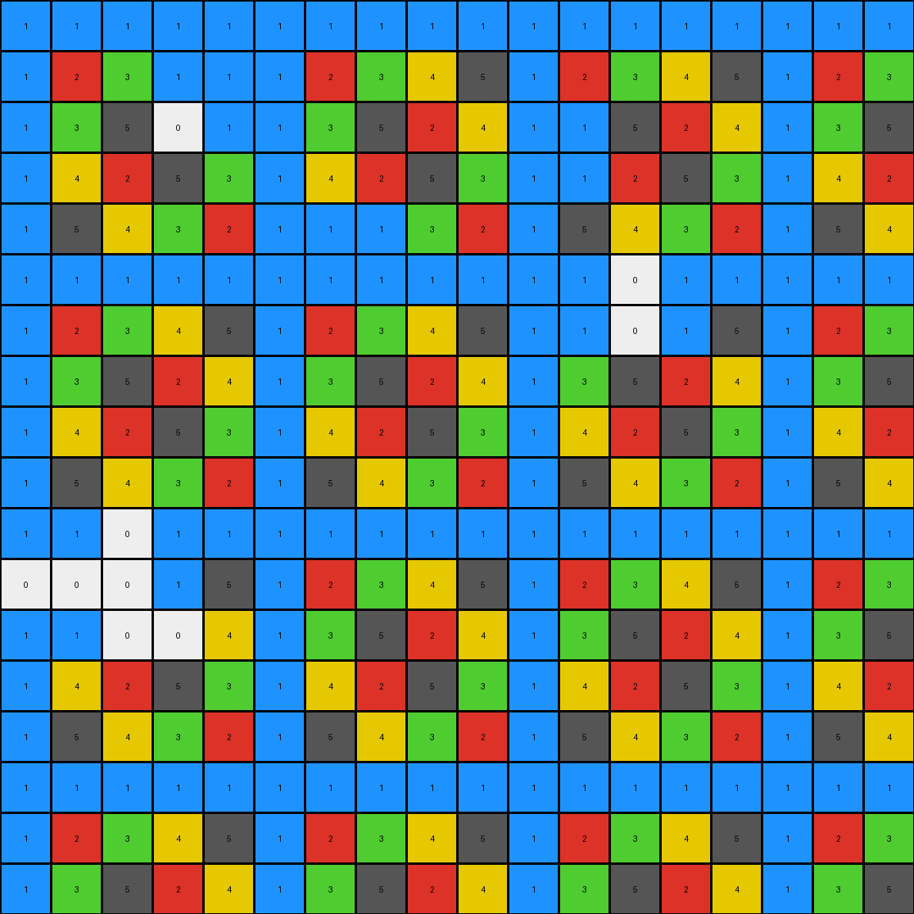
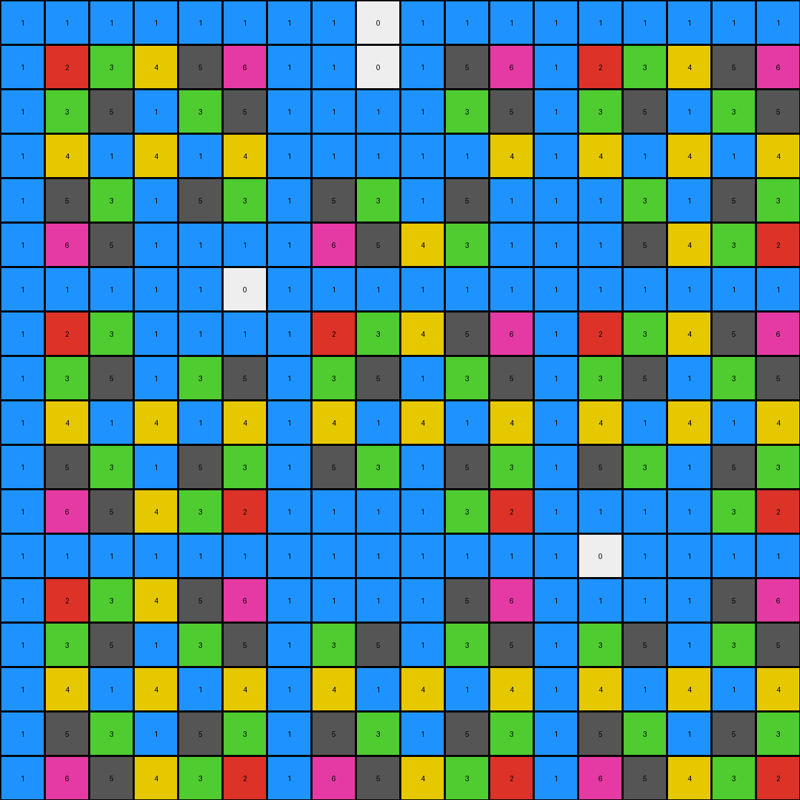

# 29ec7d0e • 005 • refine_dreamer

---

Previous Code:
```python
"""
The transformation identifies blue (1) regions and extends them by converting adjacent white (0) pixels to blue (1).
Non-white and non-blue pixels are preserved. If two separate blue regions can be connected by setting only
white pixels to blue, then change those white pixels to blue.
"""

import numpy as np
from scipy.ndimage import label, find_objects

def get_neighbors(r, c, rows, cols):
    """
    Returns the valid neighbors of a cell (r, c) in a grid of size (rows, cols).
    """
    neighbors = []
    for i in range(max(0, r - 1), min(rows, r + 2)):
        for j in range(max(0, c - 1), min(cols, c + 2)):
            if (i, j) != (r, c):
                neighbors.append((i, j))
    return neighbors

def transform(input_grid):
    """
    Transforms the input grid according to the described rule.
    """
    output_grid = np.copy(input_grid)
    rows, cols = input_grid.shape

    # 1. Preserve non-white pixels.
    # (This is implicit since we're copying the input_grid and only modifying white pixels)

    # 2. Identify blue regions and extend them.
    for r in range(rows):
        for c in range(cols):
            if input_grid[r, c] == 0:  # Check if it's a white pixel
                neighbors = get_neighbors(r, c, rows, cols)
                for nr, nc in neighbors:
                    if input_grid[nr, nc] == 1:  # If adjacent to blue
                        output_grid[r, c] = 1  # Set to blue
                        break  # Move to the next white pixel
    
    #3. Identify and Connect separate blue regions
    labeled_grid, num_features = label(output_grid == 1)  
    slices = find_objects(labeled_grid)

    for i in range(len(slices)):
        for j in range(i+1, len(slices)):
            if slices[i] is not None and slices[j] is not None:  # if not none
                # Bounding box coordinates
                r1_min, c1_min = slices[i][0].start, slices[i][1].start
                r1_max, c1_max = slices[i][0].stop -1, slices[i][1].stop -1
                r2_min, c2_min = slices[j][0].start, slices[j][1].start
                r2_max, c2_max = slices[j][0].stop -1, slices[j][1].stop -1

                # calculate manhattan distance
                dist_row = abs(r1_max-r2_min) + abs(r1_min - r2_max)
                dist_col = abs(c1_max-c2_min) + abs(c1_min- c2_max)
                dist =  min(dist_col, dist_row)

                if dist < 10: # arbitrary small number to connect
                    # Check for direct horizontal or vertical paths
                    if r1_min <= r2_max and r1_max >= r2_min: # overlap in rows
                        for c in range(min(c1_max,c2_max)+1, max(c1_min, c2_min)):
                            all_white = True
                            for r in range(min(r1_min,r2_min), max(r1_max, r2_max)+1):
                                if output_grid[r,c] != 0 and output_grid[r,c] != 1:
                                    all_white = False
                                    break
                            if all_white:
                                for r in range(min(r1_min,r2_min), max(r1_max, r2_max)+1):
                                     output_grid[r,c] = 1

                    elif c1_min <= c2_max and c1_max >= c2_min: # col overlap
                        for r in range(min(r1_max, r2_max)+1, max(r1_min, r2_min)):
                            all_white = True
                            for c in range(min(c1_min, c2_min), max(c1_max, c2_max)+1):
                                if output_grid[r,c] != 0 and output_grid[r,c] != 1:
                                    all_white = False
                                    break
                            if all_white:
                                for c in range(min(c1_min, c2_min), max(c1_max, c2_max)+1):
                                    output_grid[r,c] = 1


    return output_grid
```

Train Set Results:

## Example 1:

Input:
```
1 1 1 0 0 1 1 1 1 1 1 1 1 1 1 1 1 1
1 2 3 0 0 1 2 3 4 5 1 2 3 4 5 1 2 3
1 3 5 0 0 1 3 5 2 4 0 0 5 2 4 1 3 5
1 4 2 5 3 1 4 2 5 3 0 0 2 5 3 1 4 2
1 5 4 3 2 1 0 0 3 2 1 5 4 3 2 1 5 4
1 1 1 1 1 1 0 0 1 1 1 0 0 0 1 1 1 1
1 2 3 4 5 1 2 3 4 5 1 0 0 0 5 1 2 3
1 3 5 2 4 1 3 5 2 4 1 3 5 2 4 1 3 5
1 4 2 5 3 1 4 2 5 3 1 4 2 5 3 1 4 2
1 5 4 3 2 1 5 4 3 2 1 5 4 3 2 1 5 4
0 0 0 0 1 1 1 1 1 1 1 1 1 1 1 1 1 1
0 0 0 0 5 1 2 3 4 5 1 2 3 4 5 1 2 3
0 0 0 0 4 1 3 5 2 4 1 3 5 2 4 1 3 5
1 4 2 5 3 1 4 2 5 3 1 4 2 5 3 1 4 2
1 5 4 3 2 1 5 4 3 2 1 5 4 3 2 1 5 4
1 1 1 1 1 1 1 1 1 1 1 1 1 1 1 1 1 1
1 2 3 4 5 1 2 3 4 5 1 2 3 4 5 1 2 3
1 3 5 2 4 1 3 5 2 4 1 3 5 2 4 1 3 5
```
Expected Output:
```
1 1 1 1 1 1 1 1 1 1 1 1 1 1 1 1 1 1
1 2 3 4 5 1 2 3 4 5 1 2 3 4 5 1 2 3
1 3 5 2 4 1 3 5 2 4 1 3 5 2 4 1 3 5
1 4 2 5 3 1 4 2 5 3 1 4 2 5 3 1 4 2
1 5 4 3 2 1 5 4 3 2 1 5 4 3 2 1 5 4
1 1 1 1 1 1 1 1 1 1 1 1 1 1 1 1 1 1
1 2 3 4 5 1 2 3 4 5 1 2 3 4 5 1 2 3
1 3 5 2 4 1 3 5 2 4 1 3 5 2 4 1 3 5
1 4 2 5 3 1 4 2 5 3 1 4 2 5 3 1 4 2
1 5 4 3 2 1 5 4 3 2 1 5 4 3 2 1 5 4
1 1 1 1 1 1 1 1 1 1 1 1 1 1 1 1 1 1
1 2 3 4 5 1 2 3 4 5 1 2 3 4 5 1 2 3
1 3 5 2 4 1 3 5 2 4 1 3 5 2 4 1 3 5
1 4 2 5 3 1 4 2 5 3 1 4 2 5 3 1 4 2
1 5 4 3 2 1 5 4 3 2 1 5 4 3 2 1 5 4
1 1 1 1 1 1 1 1 1 1 1 1 1 1 1 1 1 1
1 2 3 4 5 1 2 3 4 5 1 2 3 4 5 1 2 3
1 3 5 2 4 1 3 5 2 4 1 3 5 2 4 1 3 5
```
Transformed Output:
```
1 1 1 1 1 1 1 1 1 1 1 1 1 1 1 1 1 1
1 2 3 1 1 1 2 3 4 5 1 2 3 4 5 1 2 3
1 3 5 0 1 1 3 5 2 4 1 1 5 2 4 1 3 5
1 4 2 5 3 1 4 2 5 3 1 1 2 5 3 1 4 2
1 5 4 3 2 1 1 1 3 2 1 5 4 3 2 1 5 4
1 1 1 1 1 1 1 1 1 1 1 1 0 1 1 1 1 1
1 2 3 4 5 1 2 3 4 5 1 1 0 1 5 1 2 3
1 3 5 2 4 1 3 5 2 4 1 3 5 2 4 1 3 5
1 4 2 5 3 1 4 2 5 3 1 4 2 5 3 1 4 2
1 5 4 3 2 1 5 4 3 2 1 5 4 3 2 1 5 4
1 1 0 1 1 1 1 1 1 1 1 1 1 1 1 1 1 1
0 0 0 1 5 1 2 3 4 5 1 2 3 4 5 1 2 3
1 1 0 0 4 1 3 5 2 4 1 3 5 2 4 1 3 5
1 4 2 5 3 1 4 2 5 3 1 4 2 5 3 1 4 2
1 5 4 3 2 1 5 4 3 2 1 5 4 3 2 1 5 4
1 1 1 1 1 1 1 1 1 1 1 1 1 1 1 1 1 1
1 2 3 4 5 1 2 3 4 5 1 2 3 4 5 1 2 3
1 3 5 2 4 1 3 5 2 4 1 3 5 2 4 1 3 5
```

match: False
pixels_off: 20
size_correct: True
color_palette_correct: False
correct_pixel_counts: False

## Example 2:

Input:
```
1 1 1 1 1 1 1 0 0 0 1 1 1 1 1 1 1 1
1 2 3 4 5 6 1 0 0 0 5 6 1 2 3 4 5 6
1 3 5 1 3 5 1 0 0 0 3 5 1 3 5 1 3 5
1 4 1 4 1 4 1 0 0 0 1 4 1 4 1 4 1 4
1 5 3 1 5 3 1 5 3 1 5 0 0 0 3 1 5 3
1 6 5 0 0 0 0 6 5 4 3 0 0 0 5 4 3 2
1 1 1 0 0 0 0 1 1 1 1 1 1 1 1 1 1 1
1 2 3 0 0 0 0 2 3 4 5 6 1 2 3 4 5 6
1 3 5 1 3 5 1 3 5 1 3 5 1 3 5 1 3 5
1 4 1 4 1 4 1 4 1 4 1 4 1 4 1 4 1 4
1 5 3 1 5 3 1 5 3 1 5 3 1 5 3 1 5 3
1 6 5 4 3 2 1 0 0 0 3 2 0 0 0 0 3 2
1 1 1 1 1 1 1 0 0 0 1 1 0 0 0 0 1 1
1 2 3 4 5 6 1 0 0 0 5 6 0 0 0 0 5 6
1 3 5 1 3 5 1 3 5 1 3 5 1 3 5 1 3 5
1 4 1 4 1 4 1 4 1 4 1 4 1 4 1 4 1 4
1 5 3 1 5 3 1 5 3 1 5 3 1 5 3 1 5 3
1 6 5 4 3 2 1 6 5 4 3 2 1 6 5 4 3 2
```
Expected Output:
```
1 1 1 1 1 1 1 1 1 1 1 1 1 1 1 1 1 1
1 2 3 4 5 6 1 2 3 4 5 6 1 2 3 4 5 6
1 3 5 1 3 5 1 3 5 1 3 5 1 3 5 1 3 5
1 4 1 4 1 4 1 4 1 4 1 4 1 4 1 4 1 4
1 5 3 1 5 3 1 5 3 1 5 3 1 5 3 1 5 3
1 6 5 4 3 2 1 6 5 4 3 2 1 6 5 4 3 2
1 1 1 1 1 1 1 1 1 1 1 1 1 1 1 1 1 1
1 2 3 4 5 6 1 2 3 4 5 6 1 2 3 4 5 6
1 3 5 1 3 5 1 3 5 1 3 5 1 3 5 1 3 5
1 4 1 4 1 4 1 4 1 4 1 4 1 4 1 4 1 4
1 5 3 1 5 3 1 5 3 1 5 3 1 5 3 1 5 3
1 6 5 4 3 2 1 6 5 4 3 2 1 6 5 4 3 2
1 1 1 1 1 1 1 1 1 1 1 1 1 1 1 1 1 1
1 2 3 4 5 6 1 2 3 4 5 6 1 2 3 4 5 6
1 3 5 1 3 5 1 3 5 1 3 5 1 3 5 1 3 5
1 4 1 4 1 4 1 4 1 4 1 4 1 4 1 4 1 4
1 5 3 1 5 3 1 5 3 1 5 3 1 5 3 1 5 3
1 6 5 4 3 2 1 6 5 4 3 2 1 6 5 4 3 2
```
Transformed Output:
```
1 1 1 1 1 1 1 1 0 1 1 1 1 1 1 1 1 1
1 2 3 4 5 6 1 1 0 1 5 6 1 2 3 4 5 6
1 3 5 1 3 5 1 1 1 1 3 5 1 3 5 1 3 5
1 4 1 4 1 4 1 1 1 1 1 4 1 4 1 4 1 4
1 5 3 1 5 3 1 5 3 1 5 1 1 1 3 1 5 3
1 6 5 1 1 1 1 6 5 4 3 1 1 1 5 4 3 2
1 1 1 1 1 0 1 1 1 1 1 1 1 1 1 1 1 1
1 2 3 1 1 1 1 2 3 4 5 6 1 2 3 4 5 6
1 3 5 1 3 5 1 3 5 1 3 5 1 3 5 1 3 5
1 4 1 4 1 4 1 4 1 4 1 4 1 4 1 4 1 4
1 5 3 1 5 3 1 5 3 1 5 3 1 5 3 1 5 3
1 6 5 4 3 2 1 1 1 1 3 2 1 1 1 1 3 2
1 1 1 1 1 1 1 1 1 1 1 1 1 0 1 1 1 1
1 2 3 4 5 6 1 1 1 1 5 6 1 1 1 1 5 6
1 3 5 1 3 5 1 3 5 1 3 5 1 3 5 1 3 5
1 4 1 4 1 4 1 4 1 4 1 4 1 4 1 4 1 4
1 5 3 1 5 3 1 5 3 1 5 3 1 5 3 1 5 3
1 6 5 4 3 2 1 6 5 4 3 2 1 6 5 4 3 2
```

match: False
pixels_off: 32
size_correct: True
color_palette_correct: False
correct_pixel_counts: False

## Example 3:

Input:
```
1 1 1 1 1 1 1 1 1 1 1 1 1 1 1 1 1 1
1 2 3 4 5 6 7 1 2 3 4 5 6 7 1 2 3 4
1 3 5 7 2 4 6 1 3 5 7 2 0 0 0 0 5 7
1 4 7 3 6 2 0 0 0 0 0 0 0 0 0 0 7 3
1 5 2 6 3 7 0 0 0 0 0 0 0 0 0 0 2 6
1 0 0 2 7 5 0 0 0 0 2 7 0 0 0 0 4 2
1 0 0 5 4 3 0 0 0 0 5 4 3 0 0 0 6 5
1 0 0 1 1 1 1 1 1 1 1 1 1 0 0 0 1 1
1 0 0 4 5 6 7 1 2 3 4 5 6 7 1 2 3 4
1 3 5 7 2 4 6 1 3 5 7 2 4 6 1 3 5 7
1 4 7 3 6 2 5 1 4 7 3 6 2 5 1 4 7 3
1 5 2 6 3 7 4 1 5 2 6 3 7 4 1 5 2 6
1 6 4 2 7 5 3 1 6 4 2 7 5 3 1 6 4 2
1 7 6 5 4 3 2 1 7 6 5 4 3 2 1 7 6 5
1 1 1 1 1 1 1 1 1 1 1 1 1 1 1 1 1 1
1 2 3 4 5 6 7 1 2 3 4 5 6 7 1 2 3 4
1 3 5 7 2 4 6 1 3 5 7 2 4 6 1 3 5 7
1 4 7 3 6 2 5 1 4 7 3 6 2 5 1 4 7 3
```
Expected Output:
```
1 1 1 1 1 1 1 1 1 1 1 1 1 1 1 1 1 1
1 2 3 4 5 6 7 1 2 3 4 5 6 7 1 2 3 4
1 3 5 7 2 4 6 1 3 5 7 2 4 6 1 3 5 7
1 4 7 3 6 2 5 1 4 7 3 6 2 5 1 4 7 3
1 5 2 6 3 7 4 1 5 2 6 3 7 4 1 5 2 6
1 6 4 2 7 5 3 1 6 4 2 7 5 3 1 6 4 2
1 7 6 5 4 3 2 1 7 6 5 4 3 2 1 7 6 5
1 1 1 1 1 1 1 1 1 1 1 1 1 1 1 1 1 1
1 2 3 4 5 6 7 1 2 3 4 5 6 7 1 2 3 4
1 3 5 7 2 4 6 1 3 5 7 2 4 6 1 3 5 7
1 4 7 3 6 2 5 1 4 7 3 6 2 5 1 4 7 3
1 5 2 6 3 7 4 1 5 2 6 3 7 4 1 5 2 6
1 6 4 2 7 5 3 1 6 4 2 7 5 3 1 6 4 2
1 7 6 5 4 3 2 1 7 6 5 4 3 2 1 7 6 5
1 1 1 1 1 1 1 1 1 1 1 1 1 1 1 1 1 1
1 2 3 4 5 6 7 1 2 3 4 5 6 7 1 2 3 4
1 3 5 7 2 4 6 1 3 5 7 2 4 6 1 3 5 7
1 4 7 3 6 2 5 1 4 7 3 6 2 5 1 4 7 3
```
Transformed Output:
```
1 1 1 1 1 1 1 1 1 1 1 1 1 1 1 1 1 1
1 2 3 4 5 6 7 1 2 3 4 5 6 7 1 2 3 4
1 3 5 7 2 4 6 1 3 5 7 2 0 1 1 1 5 7
1 4 7 3 6 2 1 1 1 0 0 0 0 0 0 0 7 3
1 5 2 6 3 7 0 0 0 0 0 0 0 0 0 0 2 6
1 1 0 2 7 5 0 0 0 0 2 7 0 0 0 0 4 2
1 1 1 5 4 3 1 1 1 1 5 4 3 1 0 1 6 5
1 1 1 1 1 1 1 1 1 1 1 1 1 1 1 1 1 1
1 1 1 4 5 6 7 1 2 3 4 5 6 7 1 2 3 4
1 3 5 7 2 4 6 1 3 5 7 2 4 6 1 3 5 7
1 4 7 3 6 2 5 1 4 7 3 6 2 5 1 4 7 3
1 5 2 6 3 7 4 1 5 2 6 3 7 4 1 5 2 6
1 6 4 2 7 5 3 1 6 4 2 7 5 3 1 6 4 2
1 7 6 5 4 3 2 1 7 6 5 4 3 2 1 7 6 5
1 1 1 1 1 1 1 1 1 1 1 1 1 1 1 1 1 1
1 2 3 4 5 6 7 1 2 3 4 5 6 7 1 2 3 4
1 3 5 7 2 4 6 1 3 5 7 2 4 6 1 3 5 7
1 4 7 3 6 2 5 1 4 7 3 6 2 5 1 4 7 3
```

match: False
pixels_off: 42
size_correct: True
color_palette_correct: False
correct_pixel_counts: False

## Example 4:

Input:
```
1 1 1 1 1 1 1 1 1 1 1 1 1 1 1 1 1 1
1 2 3 4 5 6 7 8 1 2 3 4 5 6 7 8 1 2
1 3 5 7 1 3 5 7 1 3 5 7 1 3 5 7 1 3
1 4 7 2 5 8 3 6 1 4 7 2 5 8 0 0 1 4
1 5 1 5 1 5 1 5 1 5 1 5 1 5 0 0 1 5
1 6 3 8 5 2 7 4 1 6 3 8 5 2 0 0 1 6
1 7 5 3 1 7 5 3 1 7 5 3 1 7 5 3 1 7
1 8 7 6 5 4 3 2 1 8 7 6 5 4 3 2 1 8
1 1 1 0 0 0 0 0 1 1 1 1 1 1 1 1 1 1
1 2 3 0 0 0 0 0 1 2 3 4 5 6 7 8 1 2
1 3 5 7 0 0 0 0 1 3 5 7 1 3 5 7 1 3
1 4 7 2 5 8 3 6 1 4 7 2 5 8 3 6 1 4
1 5 1 5 1 5 1 5 1 5 1 5 1 5 1 5 1 5
1 6 3 8 5 2 0 0 1 6 3 8 5 2 7 4 1 6
1 7 5 3 1 7 0 0 1 7 5 3 1 7 5 3 1 7
1 8 7 6 0 0 3 2 1 8 7 6 5 4 3 2 1 8
1 1 1 1 0 0 1 1 1 1 1 1 1 1 1 1 1 1
1 2 3 4 5 6 7 8 1 2 3 4 5 6 7 8 1 2
```
Expected Output:
```
1 1 1 1 1 1 1 1 1 1 1 1 1 1 1 1 1 1
1 2 3 4 5 6 7 8 1 2 3 4 5 6 7 8 1 2
1 3 5 7 1 3 5 7 1 3 5 7 1 3 5 7 1 3
1 4 7 2 5 8 3 6 1 4 7 2 5 8 3 6 1 4
1 5 1 5 1 5 1 5 1 5 1 5 1 5 1 5 1 5
1 6 3 8 5 2 7 4 1 6 3 8 5 2 7 4 1 6
1 7 5 3 1 7 5 3 1 7 5 3 1 7 5 3 1 7
1 8 7 6 5 4 3 2 1 8 7 6 5 4 3 2 1 8
1 1 1 1 1 1 1 1 1 1 1 1 1 1 1 1 1 1
1 2 3 4 5 6 7 8 1 2 3 4 5 6 7 8 1 2
1 3 5 7 1 3 5 7 1 3 5 7 1 3 5 7 1 3
1 4 7 2 5 8 3 6 1 4 7 2 5 8 3 6 1 4
1 5 1 5 1 5 1 5 1 5 1 5 1 5 1 5 1 5
1 6 3 8 5 2 7 4 1 6 3 8 5 2 7 4 1 6
1 7 5 3 1 7 5 3 1 7 5 3 1 7 5 3 1 7
1 8 7 6 5 4 3 2 1 8 7 6 5 4 3 2 1 8
1 1 1 1 1 1 1 1 1 1 1 1 1 1 1 1 1 1
1 2 3 4 5 6 7 8 1 2 3 4 5 6 7 8 1 2
```
Transformed Output:
```
1 1 1 1 1 1 1 1 1 1 1 1 1 1 1 1 1 1
1 2 3 4 5 6 7 8 1 2 3 4 5 6 7 8 1 2
1 3 5 7 1 3 5 7 1 3 5 7 1 3 5 7 1 3
1 4 7 2 5 8 3 6 1 4 7 2 5 8 0 1 1 4
1 5 1 5 1 5 1 5 1 5 1 5 1 5 0 1 1 5
1 6 3 8 5 2 7 4 1 6 3 8 5 2 0 1 1 6
1 7 5 3 1 7 5 3 1 7 5 3 1 7 5 3 1 7
1 8 7 6 5 4 3 2 1 8 7 6 5 4 3 2 1 8
1 1 1 1 1 0 0 1 1 1 1 1 1 1 1 1 1 1
1 2 3 1 1 0 0 1 1 2 3 4 5 6 7 8 1 2
1 3 5 7 1 0 0 1 1 3 5 7 1 3 5 7 1 3
1 4 7 2 5 8 3 6 1 4 7 2 5 8 3 6 1 4
1 5 1 5 1 5 1 5 1 5 1 5 1 5 1 5 1 5
1 6 3 8 5 2 1 1 1 6 3 8 5 2 7 4 1 6
1 7 5 3 1 7 0 1 1 7 5 3 1 7 5 3 1 7
1 8 7 6 1 1 3 2 1 8 7 6 5 4 3 2 1 8
1 1 1 1 1 1 1 1 1 1 1 1 1 1 1 1 1 1
1 2 3 4 5 6 7 8 1 2 3 4 5 6 7 8 1 2
```

match: False
pixels_off: 22
size_correct: True
color_palette_correct: False
correct_pixel_counts: False
**INSTRUCTIONS**

The code above was generated based on observations from the first training
example

we have tested the transform function on each of the task example inputs and
compared with the expected output

review each of the examples provided and the results and consider how the
natural language program should be updated to accommodate this new knowledge

respond with the following deliverables:

- general assessment of the information provided and strategy for resolving the
  errors
- gather metrics about each of the examples and results - use code_execution to
  develop accurate reports on your assumptions
- a YAML block documenting facts - Focus on identifying objects, their properties, and the actions performed on them.
- a natural language program - Be as clear and concise as possible, providing a complete description of the transformation rule.


your responses should be considered as information in a report - not a
conversation
