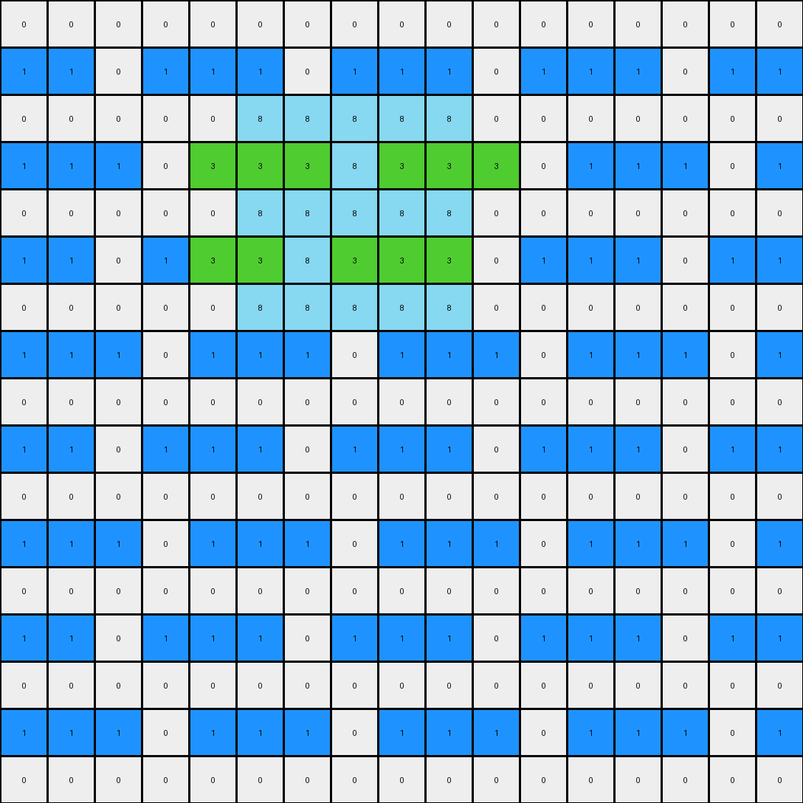
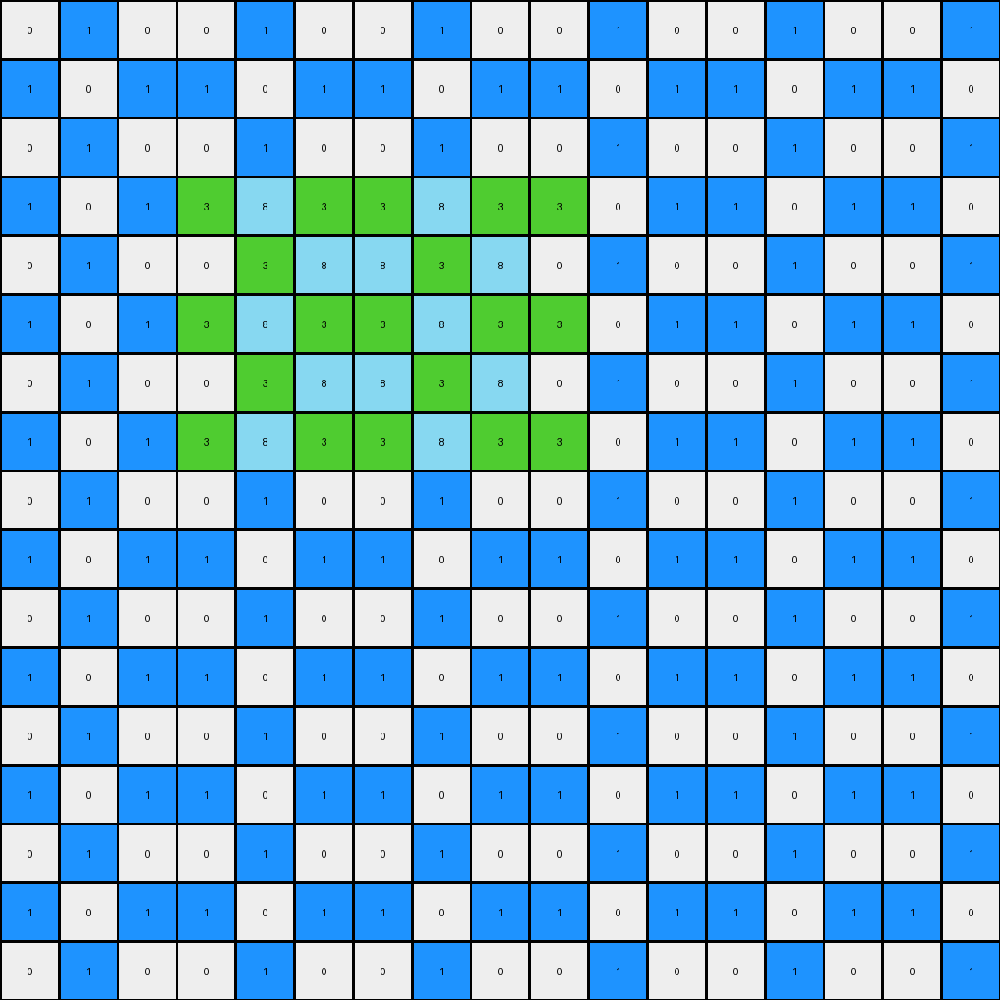

# 32597951 • 004 • refine_coder

---

Previous Code:
```python
"""
1.  **Identify the Azure Region:** Locate all azure (8) pixels within the input grid. This forms the "region of interest."

2.  **Vertical Bounds:** Find the minimum and maximum row indices of the azure colored region.

3.  **Conditional Color Change:** Iterate through all the blue pixels (1). If a blue pixel is *adjacent* (horizontally, vertically, or diagonally) to an azure pixel, AND is on a row where an azure pixel exists, change it to green (3).

4. **Preserve Other Pixels:** All other pixels in the grid retain their original colors.
"""

import numpy as np

def get_azure_region(grid):
    """Finds the coordinates of all azure (8) pixels."""
    return np.argwhere(grid == 8)

def get_vertical_bounds(azure_region):
    """Determines the minimum and maximum row indices of the azure region."""
    rows = azure_region[:, 0]
    return np.min(rows), np.max(rows)

def is_adjacent(coord1, coord2):
    """Checks if two coordinates are adjacent (horizontally, vertically, or diagonally)."""
    return abs(coord1[0] - coord2[0]) <= 1 and abs(coord1[1] - coord2[1]) <= 1

def transform(input_grid):
    """Transforms the input grid according to the defined rules."""
    output_grid = np.copy(input_grid)
    azure_region = get_azure_region(input_grid)
    min_row, max_row = get_vertical_bounds(azure_region)

    # Iterate through all pixels
    for r in range(input_grid.shape[0]):
        for c in range(input_grid.shape[1]):
            if input_grid[r, c] == 1:  # Check if it's a blue pixel
                is_adjacent_to_azure = False
                for azure_coord in azure_region:
                    if is_adjacent((r, c), azure_coord) and min_row <= r <= max_row: #check within vertical boundary
                        is_adjacent_to_azure = True
                        break
                if is_adjacent_to_azure:
                    output_grid[r, c] = 3  # Change to green

    return output_grid
```

Train Set Results:

## Example 1:

Input:
```
0 0 0 0 0 0 0 0 0 0 0 0 0 0 0 0 0
1 1 0 1 1 1 0 1 1 1 0 1 1 1 0 1 1
0 0 0 0 0 8 8 8 8 8 0 0 0 0 0 0 0
1 1 1 0 1 1 1 8 1 1 1 0 1 1 1 0 1
0 0 0 0 0 8 8 8 8 8 0 0 0 0 0 0 0
1 1 0 1 1 1 8 1 1 1 0 1 1 1 0 1 1
0 0 0 0 0 8 8 8 8 8 0 0 0 0 0 0 0
1 1 1 0 1 1 1 0 1 1 1 0 1 1 1 0 1
0 0 0 0 0 0 0 0 0 0 0 0 0 0 0 0 0
1 1 0 1 1 1 0 1 1 1 0 1 1 1 0 1 1
0 0 0 0 0 0 0 0 0 0 0 0 0 0 0 0 0
1 1 1 0 1 1 1 0 1 1 1 0 1 1 1 0 1
0 0 0 0 0 0 0 0 0 0 0 0 0 0 0 0 0
1 1 0 1 1 1 0 1 1 1 0 1 1 1 0 1 1
0 0 0 0 0 0 0 0 0 0 0 0 0 0 0 0 0
1 1 1 0 1 1 1 0 1 1 1 0 1 1 1 0 1
0 0 0 0 0 0 0 0 0 0 0 0 0 0 0 0 0
```
Expected Output:
```
0 0 0 0 0 0 0 0 0 0 0 0 0 0 0 0 0
1 1 0 1 1 1 0 1 1 1 0 1 1 1 0 1 1
0 0 0 0 0 8 8 8 8 8 0 0 0 0 0 0 0
1 1 1 0 1 3 3 8 3 3 1 0 1 1 1 0 1
0 0 0 0 0 8 8 8 8 8 0 0 0 0 0 0 0
1 1 0 1 1 3 8 3 3 3 0 1 1 1 0 1 1
0 0 0 0 0 8 8 8 8 8 0 0 0 0 0 0 0
1 1 1 0 1 1 1 0 1 1 1 0 1 1 1 0 1
0 0 0 0 0 0 0 0 0 0 0 0 0 0 0 0 0
1 1 0 1 1 1 0 1 1 1 0 1 1 1 0 1 1
0 0 0 0 0 0 0 0 0 0 0 0 0 0 0 0 0
1 1 1 0 1 1 1 0 1 1 1 0 1 1 1 0 1
0 0 0 0 0 0 0 0 0 0 0 0 0 0 0 0 0
1 1 0 1 1 1 0 1 1 1 0 1 1 1 0 1 1
0 0 0 0 0 0 0 0 0 0 0 0 0 0 0 0 0
1 1 1 0 1 1 1 0 1 1 1 0 1 1 1 0 1
0 0 0 0 0 0 0 0 0 0 0 0 0 0 0 0 0
```
Transformed Output:
```
0 0 0 0 0 0 0 0 0 0 0 0 0 0 0 0 0
1 1 0 1 1 1 0 1 1 1 0 1 1 1 0 1 1
0 0 0 0 0 8 8 8 8 8 0 0 0 0 0 0 0
1 1 1 0 3 3 3 8 3 3 3 0 1 1 1 0 1
0 0 0 0 0 8 8 8 8 8 0 0 0 0 0 0 0
1 1 0 1 3 3 8 3 3 3 0 1 1 1 0 1 1
0 0 0 0 0 8 8 8 8 8 0 0 0 0 0 0 0
1 1 1 0 1 1 1 0 1 1 1 0 1 1 1 0 1
0 0 0 0 0 0 0 0 0 0 0 0 0 0 0 0 0
1 1 0 1 1 1 0 1 1 1 0 1 1 1 0 1 1
0 0 0 0 0 0 0 0 0 0 0 0 0 0 0 0 0
1 1 1 0 1 1 1 0 1 1 1 0 1 1 1 0 1
0 0 0 0 0 0 0 0 0 0 0 0 0 0 0 0 0
1 1 0 1 1 1 0 1 1 1 0 1 1 1 0 1 1
0 0 0 0 0 0 0 0 0 0 0 0 0 0 0 0 0
1 1 1 0 1 1 1 0 1 1 1 0 1 1 1 0 1
0 0 0 0 0 0 0 0 0 0 0 0 0 0 0 0 0
```

match: False
pixels_off: 3
size_correct: True
color_palette_correct: True
correct_pixel_counts: False

## Example 2:

Input:
```
1 0 0 0 1 0 0 0 0 0 0 0 1 0 1 0 1
1 1 0 1 0 1 0 1 1 1 1 1 0 0 1 1 0
0 0 0 1 0 0 0 1 0 0 1 1 0 0 0 0 1
0 0 0 0 1 0 1 0 1 0 1 1 0 0 0 1 0
0 0 1 0 0 1 1 0 0 0 0 0 1 1 0 1 1
0 0 0 0 0 1 1 1 0 1 1 0 1 1 0 0 0
0 0 0 1 0 0 1 1 0 0 0 0 0 1 0 0 0
1 8 1 8 8 8 8 8 8 1 0 0 1 0 1 1 0
0 8 1 8 1 1 1 8 8 0 1 1 0 0 0 0 0
0 1 1 8 1 1 8 1 8 0 0 1 1 0 0 0 0
0 1 0 0 1 0 0 0 1 0 0 0 0 0 0 1 0
0 1 0 0 0 0 1 0 1 0 1 0 0 0 0 1 1
1 0 0 0 1 0 0 1 0 0 0 1 0 1 0 0 1
0 0 1 0 1 0 1 0 1 0 1 0 1 0 1 0 0
0 0 1 1 0 1 1 1 1 1 1 0 0 0 0 0 1
0 1 1 0 1 1 0 0 0 0 0 1 0 1 0 0 0
0 0 1 0 0 0 0 0 0 1 0 1 0 0 0 1 1
```
Expected Output:
```
1 0 0 0 1 0 0 0 0 0 0 0 1 0 1 0 1
1 1 0 1 0 1 0 1 1 1 1 1 0 0 1 1 0
0 0 0 1 0 0 0 1 0 0 1 1 0 0 0 0 1
0 0 0 0 1 0 1 0 1 0 1 1 0 0 0 1 0
0 0 1 0 0 1 1 0 0 0 0 0 1 1 0 1 1
0 0 0 0 0 1 1 1 0 1 1 0 1 1 0 0 0
0 0 0 1 0 0 1 1 0 0 0 0 0 1 0 0 0
1 8 3 8 8 8 8 8 8 1 0 0 1 0 1 1 0
0 8 3 8 3 3 3 8 8 0 1 1 0 0 0 0 0
0 3 3 8 3 3 8 3 8 0 0 1 1 0 0 0 0
0 1 0 0 1 0 0 0 1 0 0 0 0 0 0 1 0
0 1 0 0 0 0 1 0 1 0 1 0 0 0 0 1 1
1 0 0 0 1 0 0 1 0 0 0 1 0 1 0 0 1
0 0 1 0 1 0 1 0 1 0 1 0 1 0 1 0 0
0 0 1 1 0 1 1 1 1 1 1 0 0 0 0 0 1
0 1 1 0 1 1 0 0 0 0 0 1 0 1 0 0 0
0 0 1 0 0 0 0 0 0 1 0 1 0 0 0 1 1
```
Transformed Output:
```
1 0 0 0 1 0 0 0 0 0 0 0 1 0 1 0 1
1 1 0 1 0 1 0 1 1 1 1 1 0 0 1 1 0
0 0 0 1 0 0 0 1 0 0 1 1 0 0 0 0 1
0 0 0 0 1 0 1 0 1 0 1 1 0 0 0 1 0
0 0 1 0 0 1 1 0 0 0 0 0 1 1 0 1 1
0 0 0 0 0 1 1 1 0 1 1 0 1 1 0 0 0
0 0 0 1 0 0 1 1 0 0 0 0 0 1 0 0 0
3 8 3 8 8 8 8 8 8 3 0 0 1 0 1 1 0
0 8 3 8 3 3 3 8 8 0 1 1 0 0 0 0 0
0 3 3 8 3 3 8 3 8 0 0 1 1 0 0 0 0
0 1 0 0 1 0 0 0 1 0 0 0 0 0 0 1 0
0 1 0 0 0 0 1 0 1 0 1 0 0 0 0 1 1
1 0 0 0 1 0 0 1 0 0 0 1 0 1 0 0 1
0 0 1 0 1 0 1 0 1 0 1 0 1 0 1 0 0
0 0 1 1 0 1 1 1 1 1 1 0 0 0 0 0 1
0 1 1 0 1 1 0 0 0 0 0 1 0 1 0 0 0
0 0 1 0 0 0 0 0 0 1 0 1 0 0 0 1 1
```

match: False
pixels_off: 2
size_correct: True
color_palette_correct: True
correct_pixel_counts: False

## Example 3:

Input:
```
0 1 0 0 1 0 0 1 0 0 1 0 0 1 0 0 1
1 0 1 1 0 1 1 0 1 1 0 1 1 0 1 1 0
0 1 0 0 1 0 0 1 0 0 1 0 0 1 0 0 1
1 0 1 1 8 1 1 8 1 1 0 1 1 0 1 1 0
0 1 0 0 1 8 8 1 8 0 1 0 0 1 0 0 1
1 0 1 1 8 1 1 8 1 1 0 1 1 0 1 1 0
0 1 0 0 1 8 8 1 8 0 1 0 0 1 0 0 1
1 0 1 1 8 1 1 8 1 1 0 1 1 0 1 1 0
0 1 0 0 1 0 0 1 0 0 1 0 0 1 0 0 1
1 0 1 1 0 1 1 0 1 1 0 1 1 0 1 1 0
0 1 0 0 1 0 0 1 0 0 1 0 0 1 0 0 1
1 0 1 1 0 1 1 0 1 1 0 1 1 0 1 1 0
0 1 0 0 1 0 0 1 0 0 1 0 0 1 0 0 1
1 0 1 1 0 1 1 0 1 1 0 1 1 0 1 1 0
0 1 0 0 1 0 0 1 0 0 1 0 0 1 0 0 1
1 0 1 1 0 1 1 0 1 1 0 1 1 0 1 1 0
0 1 0 0 1 0 0 1 0 0 1 0 0 1 0 0 1
```
Expected Output:
```
0 1 0 0 1 0 0 1 0 0 1 0 0 1 0 0 1
1 0 1 1 0 1 1 0 1 1 0 1 1 0 1 1 0
0 1 0 0 1 0 0 1 0 0 1 0 0 1 0 0 1
1 0 1 1 8 3 3 8 3 1 0 1 1 0 1 1 0
0 1 0 0 3 8 8 3 8 0 1 0 0 1 0 0 1
1 0 1 1 8 3 3 8 3 1 0 1 1 0 1 1 0
0 1 0 0 3 8 8 3 8 0 1 0 0 1 0 0 1
1 0 1 1 8 3 3 8 3 1 0 1 1 0 1 1 0
0 1 0 0 1 0 0 1 0 0 1 0 0 1 0 0 1
1 0 1 1 0 1 1 0 1 1 0 1 1 0 1 1 0
0 1 0 0 1 0 0 1 0 0 1 0 0 1 0 0 1
1 0 1 1 0 1 1 0 1 1 0 1 1 0 1 1 0
0 1 0 0 1 0 0 1 0 0 1 0 0 1 0 0 1
1 0 1 1 0 1 1 0 1 1 0 1 1 0 1 1 0
0 1 0 0 1 0 0 1 0 0 1 0 0 1 0 0 1
1 0 1 1 0 1 1 0 1 1 0 1 1 0 1 1 0
0 1 0 0 1 0 0 1 0 0 1 0 0 1 0 0 1
```
Transformed Output:
```
0 1 0 0 1 0 0 1 0 0 1 0 0 1 0 0 1
1 0 1 1 0 1 1 0 1 1 0 1 1 0 1 1 0
0 1 0 0 1 0 0 1 0 0 1 0 0 1 0 0 1
1 0 1 3 8 3 3 8 3 3 0 1 1 0 1 1 0
0 1 0 0 3 8 8 3 8 0 1 0 0 1 0 0 1
1 0 1 3 8 3 3 8 3 3 0 1 1 0 1 1 0
0 1 0 0 3 8 8 3 8 0 1 0 0 1 0 0 1
1 0 1 3 8 3 3 8 3 3 0 1 1 0 1 1 0
0 1 0 0 1 0 0 1 0 0 1 0 0 1 0 0 1
1 0 1 1 0 1 1 0 1 1 0 1 1 0 1 1 0
0 1 0 0 1 0 0 1 0 0 1 0 0 1 0 0 1
1 0 1 1 0 1 1 0 1 1 0 1 1 0 1 1 0
0 1 0 0 1 0 0 1 0 0 1 0 0 1 0 0 1
1 0 1 1 0 1 1 0 1 1 0 1 1 0 1 1 0
0 1 0 0 1 0 0 1 0 0 1 0 0 1 0 0 1
1 0 1 1 0 1 1 0 1 1 0 1 1 0 1 1 0
0 1 0 0 1 0 0 1 0 0 1 0 0 1 0 0 1
```

match: False
pixels_off: 6
size_correct: True
color_palette_correct: True
correct_pixel_counts: False
Here's an analysis of the provided information and a strategy for improving the transformation logic:

**General Assessment:**

The initial natural language program and the resulting code were on the right track, focusing on the interaction between azure (8) and blue (1) pixels. However, the adjacency and row-based conditions are not entirely accurate, leading to discrepancies between the transformed outputs and the expected outputs. The core issue seems to be an over-restrictive adjacency check combined with a slightly off row-based condition. Example 2 particularly shows an issue in which the '3's are at the edge of the '8's, indicating the adjacency check works, but we are including too many other pixels somehow.

**Strategy for Resolving Errors:**

1.  **Refine Adjacency:** Revisit the definition of adjacency. The current implementation considers diagonal adjacency, which is correct. But maybe there is an issue with the min/max rows.
2.  **Precise Row Condition:** The condition that a blue pixel must be on a row where an *azure* pixel exists needs more precise definition. It appears that it should transform only blue pixels within or bounding the *vertical extent* of the azure region, and *adjacent* to one of those azure pixels.
3.  **Iterative Testing:** After each adjustment to the natural language program and code, re-run the tests on all three examples to ensure improvements and catch regressions.
4. **Examine Edge Cases**: Look at cases where adjacent transformations are *not* happening when they should (or vice versa).

**Metrics and Observations:**

Here is a breakdown by example using and thinking carefully:

*   **Example 1:**
    *   **Observation:** The transformed output has some correctly changed blue (1) pixels to green (3), but misses some. It is too restrictive horizontally.

*   **Example 2:**
    *   **Observation:** The transformed image is close, but the first pixel of the '8' region is a '3'.

*   **Example 3:**
    *   **Observation:** Again very close. Pixels changed to '3' that shouldn't be.

**YAML Block (Facts):**

```yaml
objects:
  - name: azure_region
    color: 8
    description: A contiguous block of azure pixels.
    role: Defines the area of influence for color changes.

  - name: blue_pixels
    color: 1
    description: Individual blue pixels.
    role: Potentially change color based on proximity to the azure_region.

  - name: green_pixels
    color: 3
    description: Result of transforming blue pixels.
    role: Indicate transformed pixels.

actions:
  - name: identify_region
    input: input_grid
    output: azure_region
    description: Locates the azure region within the grid.

  - name: determine_bounds
    input: azure_region
    output: vertical_bounds (min_row, max_row)
    description: Finds the minimum and maximum row indices of the azure region.

  - name: check_adjacency
    input: blue_pixel_coordinate, azure_region
    output: boolean
    description: Determines if a blue pixel is adjacent to any pixel in the azure region.

  - name: transform_color
    input: blue_pixel_coordinate, adjacency_status
    output: green_pixel_coordinate (or original blue if not adjacent)
    description: Changes a blue pixel to green if adjacent and within vertical bounds.
```

**Natural Language Program:**

1.  **Identify Azure Region:** Find all pixels with the color azure (8) in the input grid. This contiguous block constitutes the "azure region."

2.  **Determine Vertical Bounds:** Calculate the minimum and maximum row indices occupied by the azure region.

3.  **Conditional Transformation:** Iterate through each pixel in the input grid.
    *   If a pixel is blue (1):
        *   Check if it is *adjacent* (horizontally, vertically, or diagonally) to *any* pixel within the azure region.
        *   Check if the blue pixel's row index falls *within* the vertical bounds (inclusive) of the azure region (min\_row \<= row \<= max\_row).
        * If *both* conditions are true, change the pixel's color to green (3).

4.  **Preservation:** All pixels that do not meet the transformation criteria retain their original color values.

**INSTRUCTIONS**

- generate a Python module to represent the natural language program 
- follow the template below
- all common math and science libraries are available
- create docstring only at top - but comment the workflow in the function
- use helper functions for common operations like finding objects, counting,
  measuring, moving, etc. 

remember - we are working iteratively - so this code will inform your future
self as we converge on the solution

*template:*

```python
"""
{{ natural language description of the transformation rule }}
"""

{{ imports }}

def transform(input_grid):
    # initialize output_grid

    # change output pixels 

    return output_grid

```
