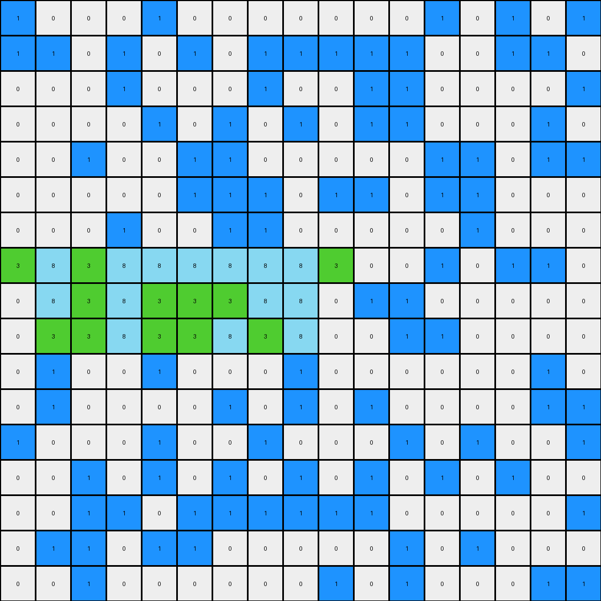

# 32597951 • 005 • refine_dreamer

---


Previous Code:
```python
"""
1.  **Identify Azure Region:** Find all pixels with the color azure (8) in the input grid. This contiguous block constitutes the "azure region."

2.  **Determine Vertical Bounds:** Calculate the minimum and maximum row indices occupied by the azure region.

3.  **Conditional Transformation:** Iterate through each pixel in the input grid.
    *   If a pixel is blue (1):
        *   Check if it is *adjacent* (horizontally, vertically, or diagonally) to *any* pixel within the azure region.
        *   Check if the blue pixel's row index falls *within* the vertical bounds (inclusive) of the azure region (min_row <= row <= max_row).
        * If *both* conditions are true, change the pixel's color to green (3).

4.  **Preservation:** All pixels that do not meet the transformation criteria retain their original color values.
"""

import numpy as np

def get_azure_region(grid):
    """Finds the coordinates of all azure (8) pixels."""
    return np.argwhere(grid == 8)

def get_vertical_bounds(azure_region):
    """Determines the minimum and maximum row indices of the azure region."""
    rows = azure_region[:, 0]
    return np.min(rows), np.max(rows)

def is_adjacent(coord1, coord2):
    """Checks if two coordinates are adjacent (horizontally, vertically, or diagonally)."""
    return abs(coord1[0] - coord2[0]) <= 1 and abs(coord1[1] - coord2[1]) <= 1

def transform(input_grid):
    """Transforms the input grid according to the defined rules."""
    output_grid = np.copy(input_grid)
    azure_region = get_azure_region(input_grid)
    min_row, max_row = get_vertical_bounds(azure_region)

    # Iterate through all pixels
    for r in range(input_grid.shape[0]):
        for c in range(input_grid.shape[1]):
            if input_grid[r, c] == 1:  # Check if it's a blue pixel
                is_adjacent_to_azure = False
                for azure_coord in azure_region:
                    if is_adjacent((r, c), azure_coord): #check adjacent
                        if min_row <= r <= max_row: # Check within vertical bounds
                            is_adjacent_to_azure = True
                            break
                if is_adjacent_to_azure:
                    output_grid[r, c] = 3  # Change to green

    return output_grid
```

Train Set Results:

## Example 1:

Input:
```
0 0 0 0 0 0 0 0 0 0 0 0 0 0 0 0 0
1 1 0 1 1 1 0 1 1 1 0 1 1 1 0 1 1
0 0 0 0 0 8 8 8 8 8 0 0 0 0 0 0 0
1 1 1 0 1 1 1 8 1 1 1 0 1 1 1 0 1
0 0 0 0 0 8 8 8 8 8 0 0 0 0 0 0 0
1 1 0 1 1 1 8 1 1 1 0 1 1 1 0 1 1
0 0 0 0 0 8 8 8 8 8 0 0 0 0 0 0 0
1 1 1 0 1 1 1 0 1 1 1 0 1 1 1 0 1
0 0 0 0 0 0 0 0 0 0 0 0 0 0 0 0 0
1 1 0 1 1 1 0 1 1 1 0 1 1 1 0 1 1
0 0 0 0 0 0 0 0 0 0 0 0 0 0 0 0 0
1 1 1 0 1 1 1 0 1 1 1 0 1 1 1 0 1
0 0 0 0 0 0 0 0 0 0 0 0 0 0 0 0 0
1 1 0 1 1 1 0 1 1 1 0 1 1 1 0 1 1
0 0 0 0 0 0 0 0 0 0 0 0 0 0 0 0 0
1 1 1 0 1 1 1 0 1 1 1 0 1 1 1 0 1
0 0 0 0 0 0 0 0 0 0 0 0 0 0 0 0 0
```
Expected Output:
```
0 0 0 0 0 0 0 0 0 0 0 0 0 0 0 0 0
1 1 0 1 1 1 0 1 1 1 0 1 1 1 0 1 1
0 0 0 0 0 8 8 8 8 8 0 0 0 0 0 0 0
1 1 1 0 1 3 3 8 3 3 1 0 1 1 1 0 1
0 0 0 0 0 8 8 8 8 8 0 0 0 0 0 0 0
1 1 0 1 1 3 8 3 3 3 0 1 1 1 0 1 1
0 0 0 0 0 8 8 8 8 8 0 0 0 0 0 0 0
1 1 1 0 1 1 1 0 1 1 1 0 1 1 1 0 1
0 0 0 0 0 0 0 0 0 0 0 0 0 0 0 0 0
1 1 0 1 1 1 0 1 1 1 0 1 1 1 0 1 1
0 0 0 0 0 0 0 0 0 0 0 0 0 0 0 0 0
1 1 1 0 1 1 1 0 1 1 1 0 1 1 1 0 1
0 0 0 0 0 0 0 0 0 0 0 0 0 0 0 0 0
1 1 0 1 1 1 0 1 1 1 0 1 1 1 0 1 1
0 0 0 0 0 0 0 0 0 0 0 0 0 0 0 0 0
1 1 1 0 1 1 1 0 1 1 1 0 1 1 1 0 1
0 0 0 0 0 0 0 0 0 0 0 0 0 0 0 0 0
```
Transformed Output:
```
0 0 0 0 0 0 0 0 0 0 0 0 0 0 0 0 0
1 1 0 1 1 1 0 1 1 1 0 1 1 1 0 1 1
0 0 0 0 0 8 8 8 8 8 0 0 0 0 0 0 0
1 1 1 0 3 3 3 8 3 3 3 0 1 1 1 0 1
0 0 0 0 0 8 8 8 8 8 0 0 0 0 0 0 0
1 1 0 1 3 3 8 3 3 3 0 1 1 1 0 1 1
0 0 0 0 0 8 8 8 8 8 0 0 0 0 0 0 0
1 1 1 0 1 1 1 0 1 1 1 0 1 1 1 0 1
0 0 0 0 0 0 0 0 0 0 0 0 0 0 0 0 0
1 1 0 1 1 1 0 1 1 1 0 1 1 1 0 1 1
0 0 0 0 0 0 0 0 0 0 0 0 0 0 0 0 0
1 1 1 0 1 1 1 0 1 1 1 0 1 1 1 0 1
0 0 0 0 0 0 0 0 0 0 0 0 0 0 0 0 0
1 1 0 1 1 1 0 1 1 1 0 1 1 1 0 1 1
0 0 0 0 0 0 0 0 0 0 0 0 0 0 0 0 0
1 1 1 0 1 1 1 0 1 1 1 0 1 1 1 0 1
0 0 0 0 0 0 0 0 0 0 0 0 0 0 0 0 0
```

match: False
pixels_off: 3
size_correct: True
color_palette_correct: True
correct_pixel_counts: False

## Example 2:

Input:
```
1 0 0 0 1 0 0 0 0 0 0 0 1 0 1 0 1
1 1 0 1 0 1 0 1 1 1 1 1 0 0 1 1 0
0 0 0 1 0 0 0 1 0 0 1 1 0 0 0 0 1
0 0 0 0 1 0 1 0 1 0 1 1 0 0 0 1 0
0 0 1 0 0 1 1 0 0 0 0 0 1 1 0 1 1
0 0 0 0 0 1 1 1 0 1 1 0 1 1 0 0 0
0 0 0 1 0 0 1 1 0 0 0 0 0 1 0 0 0
1 8 1 8 8 8 8 8 8 1 0 0 1 0 1 1 0
0 8 1 8 1 1 1 8 8 0 1 1 0 0 0 0 0
0 1 1 8 1 1 8 1 8 0 0 1 1 0 0 0 0
0 1 0 0 1 0 0 0 1 0 0 0 0 0 0 1 0
0 1 0 0 0 0 1 0 1 0 1 0 0 0 0 1 1
1 0 0 0 1 0 0 1 0 0 0 1 0 1 0 0 1
0 0 1 0 1 0 1 0 1 0 1 0 1 0 1 0 0
0 0 1 1 0 1 1 1 1 1 1 0 0 0 0 0 1
0 1 1 0 1 1 0 0 0 0 0 1 0 1 0 0 0
0 0 1 0 0 0 0 0 0 1 0 1 0 0 0 1 1
```
Expected Output:
```
1 0 0 0 1 0 0 0 0 0 0 0 1 0 1 0 1
1 1 0 1 0 1 0 1 1 1 1 1 0 0 1 1 0
0 0 0 1 0 0 0 1 0 0 1 1 0 0 0 0 1
0 0 0 0 1 0 1 0 1 0 1 1 0 0 0 1 0
0 0 1 0 0 1 1 0 0 0 0 0 1 1 0 1 1
0 0 0 0 0 1 1 1 0 1 1 0 1 1 0 0 0
0 0 0 1 0 0 1 1 0 0 0 0 0 1 0 0 0
1 8 3 8 8 8 8 8 8 1 0 0 1 0 1 1 0
0 8 3 8 3 3 3 8 8 0 1 1 0 0 0 0 0
0 3 3 8 3 3 8 3 8 0 0 1 1 0 0 0 0
0 1 0 0 1 0 0 0 1 0 0 0 0 0 0 1 0
0 1 0 0 0 0 1 0 1 0 1 0 0 0 0 1 1
1 0 0 0 1 0 0 1 0 0 0 1 0 1 0 0 1
0 0 1 0 1 0 1 0 1 0 1 0 1 0 1 0 0
0 0 1 1 0 1 1 1 1 1 1 0 0 0 0 0 1
0 1 1 0 1 1 0 0 0 0 0 1 0 1 0 0 0
0 0 1 0 0 0 0 0 0 1 0 1 0 0 0 1 1
```
Transformed Output:
```
1 0 0 0 1 0 0 0 0 0 0 0 1 0 1 0 1
1 1 0 1 0 1 0 1 1 1 1 1 0 0 1 1 0
0 0 0 1 0 0 0 1 0 0 1 1 0 0 0 0 1
0 0 0 0 1 0 1 0 1 0 1 1 0 0 0 1 0
0 0 1 0 0 1 1 0 0 0 0 0 1 1 0 1 1
0 0 0 0 0 1 1 1 0 1 1 0 1 1 0 0 0
0 0 0 1 0 0 1 1 0 0 0 0 0 1 0 0 0
3 8 3 8 8 8 8 8 8 3 0 0 1 0 1 1 0
0 8 3 8 3 3 3 8 8 0 1 1 0 0 0 0 0
0 3 3 8 3 3 8 3 8 0 0 1 1 0 0 0 0
0 1 0 0 1 0 0 0 1 0 0 0 0 0 0 1 0
0 1 0 0 0 0 1 0 1 0 1 0 0 0 0 1 1
1 0 0 0 1 0 0 1 0 0 0 1 0 1 0 0 1
0 0 1 0 1 0 1 0 1 0 1 0 1 0 1 0 0
0 0 1 1 0 1 1 1 1 1 1 0 0 0 0 0 1
0 1 1 0 1 1 0 0 0 0 0 1 0 1 0 0 0
0 0 1 0 0 0 0 0 0 1 0 1 0 0 0 1 1
```

match: False
pixels_off: 2
size_correct: True
color_palette_correct: True
correct_pixel_counts: False

## Example 3:

Input:
```
0 1 0 0 1 0 0 1 0 0 1 0 0 1 0 0 1
1 0 1 1 0 1 1 0 1 1 0 1 1 0 1 1 0
0 1 0 0 1 0 0 1 0 0 1 0 0 1 0 0 1
1 0 1 1 8 1 1 8 1 1 0 1 1 0 1 1 0
0 1 0 0 1 8 8 1 8 0 1 0 0 1 0 0 1
1 0 1 1 8 1 1 8 1 1 0 1 1 0 1 1 0
0 1 0 0 1 8 8 1 8 0 1 0 0 1 0 0 1
1 0 1 1 8 1 1 8 1 1 0 1 1 0 1 1 0
0 1 0 0 1 0 0 1 0 0 1 0 0 1 0 0 1
1 0 1 1 0 1 1 0 1 1 0 1 1 0 1 1 0
0 1 0 0 1 0 0 1 0 0 1 0 0 1 0 0 1
1 0 1 1 0 1 1 0 1 1 0 1 1 0 1 1 0
0 1 0 0 1 0 0 1 0 0 1 0 0 1 0 0 1
1 0 1 1 0 1 1 0 1 1 0 1 1 0 1 1 0
0 1 0 0 1 0 0 1 0 0 1 0 0 1 0 0 1
1 0 1 1 0 1 1 0 1 1 0 1 1 0 1 1 0
0 1 0 0 1 0 0 1 0 0 1 0 0 1 0 0 1
```
Expected Output:
```
0 1 0 0 1 0 0 1 0 0 1 0 0 1 0 0 1
1 0 1 1 0 1 1 0 1 1 0 1 1 0 1 1 0
0 1 0 0 1 0 0 1 0 0 1 0 0 1 0 0 1
1 0 1 1 8 3 3 8 3 1 0 1 1 0 1 1 0
0 1 0 0 3 8 8 3 8 0 1 0 0 1 0 0 1
1 0 1 1 8 3 3 8 3 1 0 1 1 0 1 1 0
0 1 0 0 3 8 8 3 8 0 1 0 0 1 0 0 1
1 0 1 1 8 3 3 8 3 1 0 1 1 0 1 1 0
0 1 0 0 1 0 0 1 0 0 1 0 0 1 0 0 1
1 0 1 1 0 1 1 0 1 1 0 1 1 0 1 1 0
0 1 0 0 1 0 0 1 0 0 1 0 0 1 0 0 1
1 0 1 1 0 1 1 0 1 1 0 1 1 0 1 1 0
0 1 0 0 1 0 0 1 0 0 1 0 0 1 0 0 1
1 0 1 1 0 1 1 0 1 1 0 1 1 0 1 1 0
0 1 0 0 1 0 0 1 0 0 1 0 0 1 0 0 1
1 0 1 1 0 1 1 0 1 1 0 1 1 0 1 1 0
0 1 0 0 1 0 0 1 0 0 1 0 0 1 0 0 1
```
Transformed Output:
```
0 1 0 0 1 0 0 1 0 0 1 0 0 1 0 0 1
1 0 1 1 0 1 1 0 1 1 0 1 1 0 1 1 0
0 1 0 0 1 0 0 1 0 0 1 0 0 1 0 0 1
1 0 1 3 8 3 3 8 3 3 0 1 1 0 1 1 0
0 1 0 0 3 8 8 3 8 0 1 0 0 1 0 0 1
1 0 1 3 8 3 3 8 3 3 0 1 1 0 1 1 0
0 1 0 0 3 8 8 3 8 0 1 0 0 1 0 0 1
1 0 1 3 8 3 3 8 3 3 0 1 1 0 1 1 0
0 1 0 0 1 0 0 1 0 0 1 0 0 1 0 0 1
1 0 1 1 0 1 1 0 1 1 0 1 1 0 1 1 0
0 1 0 0 1 0 0 1 0 0 1 0 0 1 0 0 1
1 0 1 1 0 1 1 0 1 1 0 1 1 0 1 1 0
0 1 0 0 1 0 0 1 0 0 1 0 0 1 0 0 1
1 0 1 1 0 1 1 0 1 1 0 1 1 0 1 1 0
0 1 0 0 1 0 0 1 0 0 1 0 0 1 0 0 1
1 0 1 1 0 1 1 0 1 1 0 1 1 0 1 1 0
0 1 0 0 1 0 0 1 0 0 1 0 0 1 0 0 1
```

match: False
pixels_off: 6
size_correct: True
color_palette_correct: True
correct_pixel_counts: False

**INSTRUCTIONS**

The code above was generated based on observations from the first training
example

we have tested the transform function on each of the task example inputs and
compared with the expected output

review each of the examples provided and the results and consider how the
natural language program should be updated to accommodate this new knowledge

respond with the following deliverables:

- general assessment of the information provided and strategy for resolving the
  errors
- gather metrics about each of the examples and results - use code_execution to
  develop accurate reports on your assumptions
- a YAML block documenting facts - Focus on identifying objects, their properties, and the actions performed on them.
- a natural language program - Be as clear and concise as possible, providing a complete description of the transformation rule.


your responses should be considered as information in a report - not a
conversation
