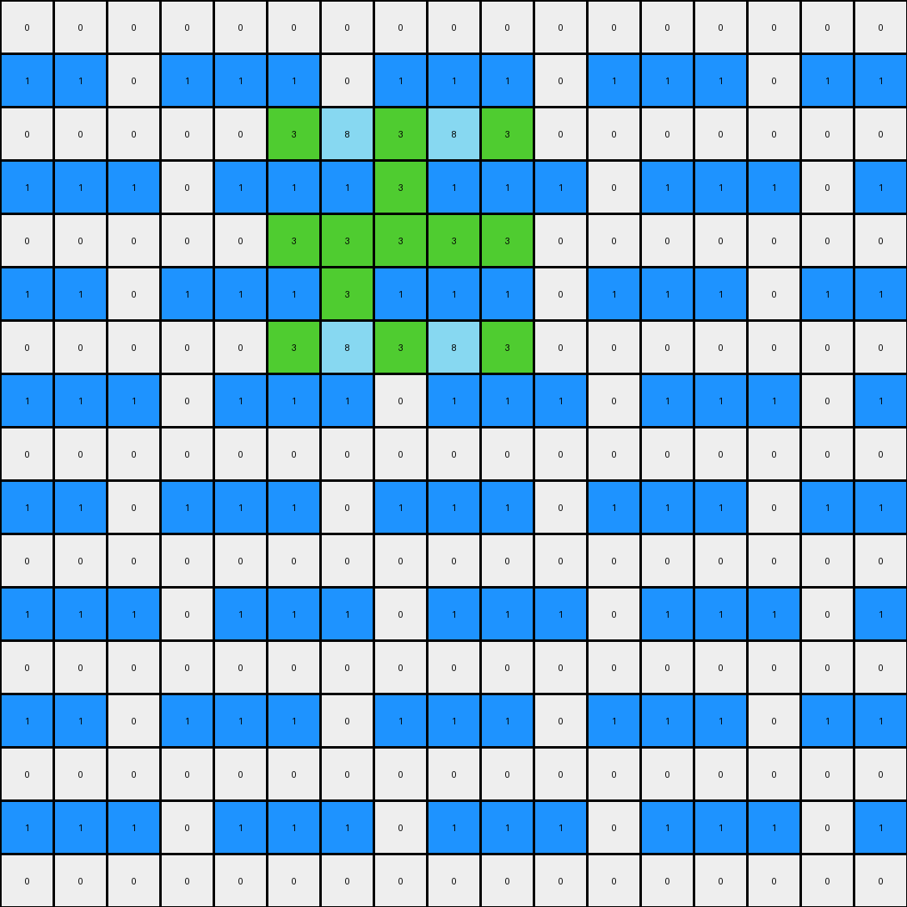
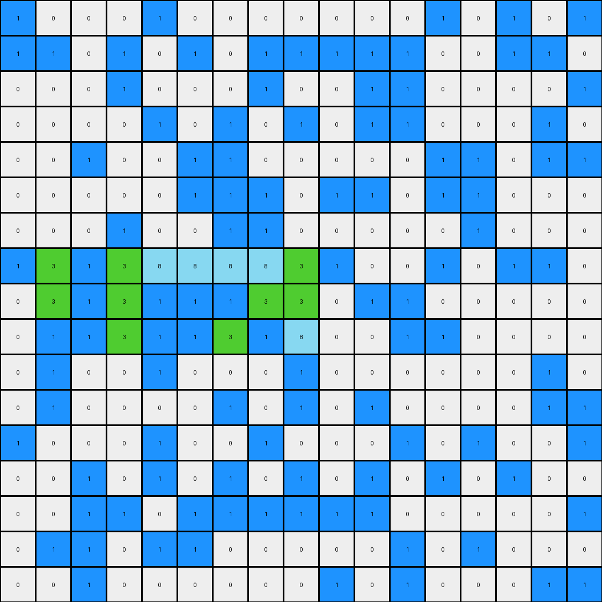
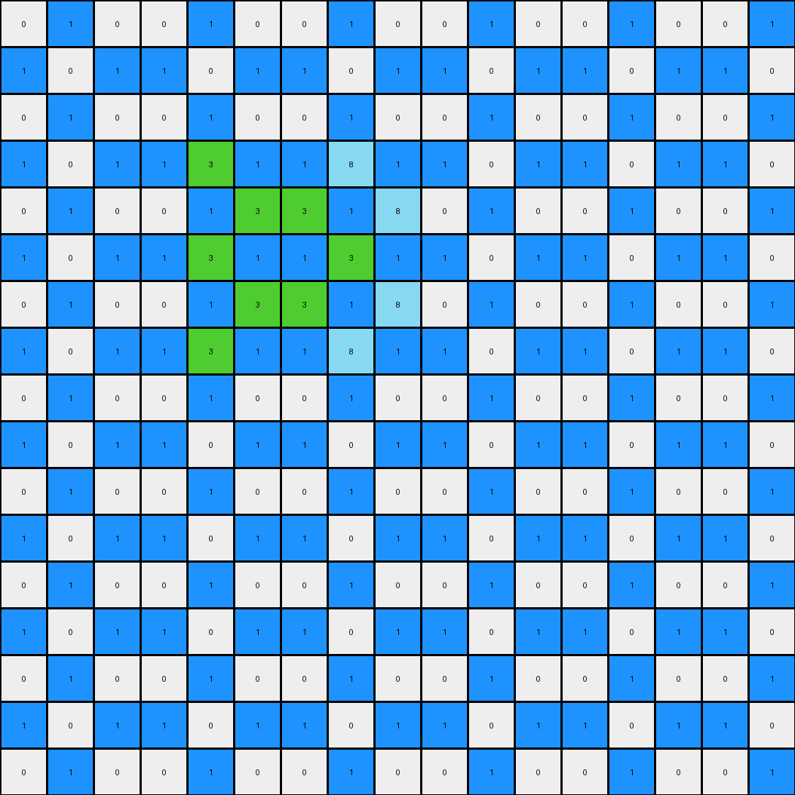

# 32597951 • 012 • refine_coder

---

Previous Code:
```python
"""
The input is a grid of pixels with values 0-9. A contiguous region of '8' (azure) pixels is identified. Within this region, specific '8' pixels are changed to '3' (green) based on their relative position, creating a cross or "X" pattern inside the azure object. Pixels with values '0' (white) and '1' (blue) are preserved.
"""

import numpy as np

def find_contiguous_region(grid, value):
    # Find the coordinates of all cells with the specified value.
    coords = np.argwhere(grid == value)
    if coords.size == 0:
        return None, None

    # Find top-left and bottom-right using min/max of the coordinates
    min_row = coords[:, 0].min()
    max_row = coords[:, 0].max()
    min_col = coords[:, 1].min()
    max_col = coords[:, 1].max()

    return (min_row, min_col), (max_row, max_col)

def transform(input_grid):
    # Initialize output grid as a copy of the input grid
    output_grid = np.copy(input_grid)
    input_grid_np = np.array(input_grid)

    # Find the contiguous region of '8's
    top_left, bottom_right = find_contiguous_region(input_grid_np, 8)

    if top_left is None :
      return output_grid

    # Calculate the dimensions of the region.
    height = bottom_right[0] - top_left[0] + 1
    width = bottom_right[1] - top_left[1] + 1

    # Iterate through the '8' region and change to '3' based on relative position.
    for row in range(top_left[0], bottom_right[0] + 1):
        for col in range(top_left[1], bottom_right[1] + 1):
            if output_grid[row, col] == 8:
                rel_row = row - top_left[0]
                rel_col = col - top_left[1]

                # Check for diagonal pattern (X-pattern).
                if (rel_row == rel_col) or (rel_row + rel_col == height -1 ) or (rel_row + rel_col == width - 1):
                   output_grid[row, col] = 3
                #Check the "cross" condition
                elif (height % 2 == 1 and rel_row == height // 2) or \
                     (width % 2 == 1 and rel_col == width // 2 )  :
                        output_grid[row,col] = 3


    return output_grid.tolist()
```

Train Set Results:

## Example 1:

Input:
```
0 0 0 0 0 0 0 0 0 0 0 0 0 0 0 0 0
1 1 0 1 1 1 0 1 1 1 0 1 1 1 0 1 1
0 0 0 0 0 8 8 8 8 8 0 0 0 0 0 0 0
1 1 1 0 1 1 1 8 1 1 1 0 1 1 1 0 1
0 0 0 0 0 8 8 8 8 8 0 0 0 0 0 0 0
1 1 0 1 1 1 8 1 1 1 0 1 1 1 0 1 1
0 0 0 0 0 8 8 8 8 8 0 0 0 0 0 0 0
1 1 1 0 1 1 1 0 1 1 1 0 1 1 1 0 1
0 0 0 0 0 0 0 0 0 0 0 0 0 0 0 0 0
1 1 0 1 1 1 0 1 1 1 0 1 1 1 0 1 1
0 0 0 0 0 0 0 0 0 0 0 0 0 0 0 0 0
1 1 1 0 1 1 1 0 1 1 1 0 1 1 1 0 1
0 0 0 0 0 0 0 0 0 0 0 0 0 0 0 0 0
1 1 0 1 1 1 0 1 1 1 0 1 1 1 0 1 1
0 0 0 0 0 0 0 0 0 0 0 0 0 0 0 0 0
1 1 1 0 1 1 1 0 1 1 1 0 1 1 1 0 1
0 0 0 0 0 0 0 0 0 0 0 0 0 0 0 0 0
```
Expected Output:
```
0 0 0 0 0 0 0 0 0 0 0 0 0 0 0 0 0
1 1 0 1 1 1 0 1 1 1 0 1 1 1 0 1 1
0 0 0 0 0 8 8 8 8 8 0 0 0 0 0 0 0
1 1 1 0 1 3 3 8 3 3 1 0 1 1 1 0 1
0 0 0 0 0 8 8 8 8 8 0 0 0 0 0 0 0
1 1 0 1 1 3 8 3 3 3 0 1 1 1 0 1 1
0 0 0 0 0 8 8 8 8 8 0 0 0 0 0 0 0
1 1 1 0 1 1 1 0 1 1 1 0 1 1 1 0 1
0 0 0 0 0 0 0 0 0 0 0 0 0 0 0 0 0
1 1 0 1 1 1 0 1 1 1 0 1 1 1 0 1 1
0 0 0 0 0 0 0 0 0 0 0 0 0 0 0 0 0
1 1 1 0 1 1 1 0 1 1 1 0 1 1 1 0 1
0 0 0 0 0 0 0 0 0 0 0 0 0 0 0 0 0
1 1 0 1 1 1 0 1 1 1 0 1 1 1 0 1 1
0 0 0 0 0 0 0 0 0 0 0 0 0 0 0 0 0
1 1 1 0 1 1 1 0 1 1 1 0 1 1 1 0 1
0 0 0 0 0 0 0 0 0 0 0 0 0 0 0 0 0
```
Transformed Output:
```
0 0 0 0 0 0 0 0 0 0 0 0 0 0 0 0 0
1 1 0 1 1 1 0 1 1 1 0 1 1 1 0 1 1
0 0 0 0 0 3 8 3 8 3 0 0 0 0 0 0 0
1 1 1 0 1 1 1 3 1 1 1 0 1 1 1 0 1
0 0 0 0 0 3 3 3 3 3 0 0 0 0 0 0 0
1 1 0 1 1 1 3 1 1 1 0 1 1 1 0 1 1
0 0 0 0 0 3 8 3 8 3 0 0 0 0 0 0 0
1 1 1 0 1 1 1 0 1 1 1 0 1 1 1 0 1
0 0 0 0 0 0 0 0 0 0 0 0 0 0 0 0 0
1 1 0 1 1 1 0 1 1 1 0 1 1 1 0 1 1
0 0 0 0 0 0 0 0 0 0 0 0 0 0 0 0 0
1 1 1 0 1 1 1 0 1 1 1 0 1 1 1 0 1
0 0 0 0 0 0 0 0 0 0 0 0 0 0 0 0 0
1 1 0 1 1 1 0 1 1 1 0 1 1 1 0 1 1
0 0 0 0 0 0 0 0 0 0 0 0 0 0 0 0 0
1 1 1 0 1 1 1 0 1 1 1 0 1 1 1 0 1
0 0 0 0 0 0 0 0 0 0 0 0 0 0 0 0 0
```

match: False
pixels_off: 21
size_correct: True
color_palette_correct: True
correct_pixel_counts: False

## Example 2:

Input:
```
1 0 0 0 1 0 0 0 0 0 0 0 1 0 1 0 1
1 1 0 1 0 1 0 1 1 1 1 1 0 0 1 1 0
0 0 0 1 0 0 0 1 0 0 1 1 0 0 0 0 1
0 0 0 0 1 0 1 0 1 0 1 1 0 0 0 1 0
0 0 1 0 0 1 1 0 0 0 0 0 1 1 0 1 1
0 0 0 0 0 1 1 1 0 1 1 0 1 1 0 0 0
0 0 0 1 0 0 1 1 0 0 0 0 0 1 0 0 0
1 8 1 8 8 8 8 8 8 1 0 0 1 0 1 1 0
0 8 1 8 1 1 1 8 8 0 1 1 0 0 0 0 0
0 1 1 8 1 1 8 1 8 0 0 1 1 0 0 0 0
0 1 0 0 1 0 0 0 1 0 0 0 0 0 0 1 0
0 1 0 0 0 0 1 0 1 0 1 0 0 0 0 1 1
1 0 0 0 1 0 0 1 0 0 0 1 0 1 0 0 1
0 0 1 0 1 0 1 0 1 0 1 0 1 0 1 0 0
0 0 1 1 0 1 1 1 1 1 1 0 0 0 0 0 1
0 1 1 0 1 1 0 0 0 0 0 1 0 1 0 0 0
0 0 1 0 0 0 0 0 0 1 0 1 0 0 0 1 1
```
Expected Output:
```
1 0 0 0 1 0 0 0 0 0 0 0 1 0 1 0 1
1 1 0 1 0 1 0 1 1 1 1 1 0 0 1 1 0
0 0 0 1 0 0 0 1 0 0 1 1 0 0 0 0 1
0 0 0 0 1 0 1 0 1 0 1 1 0 0 0 1 0
0 0 1 0 0 1 1 0 0 0 0 0 1 1 0 1 1
0 0 0 0 0 1 1 1 0 1 1 0 1 1 0 0 0
0 0 0 1 0 0 1 1 0 0 0 0 0 1 0 0 0
1 8 3 8 8 8 8 8 8 1 0 0 1 0 1 1 0
0 8 3 8 3 3 3 8 8 0 1 1 0 0 0 0 0
0 3 3 8 3 3 8 3 8 0 0 1 1 0 0 0 0
0 1 0 0 1 0 0 0 1 0 0 0 0 0 0 1 0
0 1 0 0 0 0 1 0 1 0 1 0 0 0 0 1 1
1 0 0 0 1 0 0 1 0 0 0 1 0 1 0 0 1
0 0 1 0 1 0 1 0 1 0 1 0 1 0 1 0 0
0 0 1 1 0 1 1 1 1 1 1 0 0 0 0 0 1
0 1 1 0 1 1 0 0 0 0 0 1 0 1 0 0 0
0 0 1 0 0 0 0 0 0 1 0 1 0 0 0 1 1
```
Transformed Output:
```
1 0 0 0 1 0 0 0 0 0 0 0 1 0 1 0 1
1 1 0 1 0 1 0 1 1 1 1 1 0 0 1 1 0
0 0 0 1 0 0 0 1 0 0 1 1 0 0 0 0 1
0 0 0 0 1 0 1 0 1 0 1 1 0 0 0 1 0
0 0 1 0 0 1 1 0 0 0 0 0 1 1 0 1 1
0 0 0 0 0 1 1 1 0 1 1 0 1 1 0 0 0
0 0 0 1 0 0 1 1 0 0 0 0 0 1 0 0 0
1 3 1 3 8 8 8 8 3 1 0 0 1 0 1 1 0
0 3 1 3 1 1 1 3 3 0 1 1 0 0 0 0 0
0 1 1 3 1 1 3 1 8 0 0 1 1 0 0 0 0
0 1 0 0 1 0 0 0 1 0 0 0 0 0 0 1 0
0 1 0 0 0 0 1 0 1 0 1 0 0 0 0 1 1
1 0 0 0 1 0 0 1 0 0 0 1 0 1 0 0 1
0 0 1 0 1 0 1 0 1 0 1 0 1 0 1 0 0
0 0 1 1 0 1 1 1 1 1 1 0 0 0 0 0 1
0 1 1 0 1 1 0 0 0 0 0 1 0 1 0 0 0
0 0 1 0 0 0 0 0 0 1 0 1 0 0 0 1 1
```

match: False
pixels_off: 19
size_correct: True
color_palette_correct: True
correct_pixel_counts: False

## Example 3:

Input:
```
0 1 0 0 1 0 0 1 0 0 1 0 0 1 0 0 1
1 0 1 1 0 1 1 0 1 1 0 1 1 0 1 1 0
0 1 0 0 1 0 0 1 0 0 1 0 0 1 0 0 1
1 0 1 1 8 1 1 8 1 1 0 1 1 0 1 1 0
0 1 0 0 1 8 8 1 8 0 1 0 0 1 0 0 1
1 0 1 1 8 1 1 8 1 1 0 1 1 0 1 1 0
0 1 0 0 1 8 8 1 8 0 1 0 0 1 0 0 1
1 0 1 1 8 1 1 8 1 1 0 1 1 0 1 1 0
0 1 0 0 1 0 0 1 0 0 1 0 0 1 0 0 1
1 0 1 1 0 1 1 0 1 1 0 1 1 0 1 1 0
0 1 0 0 1 0 0 1 0 0 1 0 0 1 0 0 1
1 0 1 1 0 1 1 0 1 1 0 1 1 0 1 1 0
0 1 0 0 1 0 0 1 0 0 1 0 0 1 0 0 1
1 0 1 1 0 1 1 0 1 1 0 1 1 0 1 1 0
0 1 0 0 1 0 0 1 0 0 1 0 0 1 0 0 1
1 0 1 1 0 1 1 0 1 1 0 1 1 0 1 1 0
0 1 0 0 1 0 0 1 0 0 1 0 0 1 0 0 1
```
Expected Output:
```
0 1 0 0 1 0 0 1 0 0 1 0 0 1 0 0 1
1 0 1 1 0 1 1 0 1 1 0 1 1 0 1 1 0
0 1 0 0 1 0 0 1 0 0 1 0 0 1 0 0 1
1 0 1 1 8 3 3 8 3 1 0 1 1 0 1 1 0
0 1 0 0 3 8 8 3 8 0 1 0 0 1 0 0 1
1 0 1 1 8 3 3 8 3 1 0 1 1 0 1 1 0
0 1 0 0 3 8 8 3 8 0 1 0 0 1 0 0 1
1 0 1 1 8 3 3 8 3 1 0 1 1 0 1 1 0
0 1 0 0 1 0 0 1 0 0 1 0 0 1 0 0 1
1 0 1 1 0 1 1 0 1 1 0 1 1 0 1 1 0
0 1 0 0 1 0 0 1 0 0 1 0 0 1 0 0 1
1 0 1 1 0 1 1 0 1 1 0 1 1 0 1 1 0
0 1 0 0 1 0 0 1 0 0 1 0 0 1 0 0 1
1 0 1 1 0 1 1 0 1 1 0 1 1 0 1 1 0
0 1 0 0 1 0 0 1 0 0 1 0 0 1 0 0 1
1 0 1 1 0 1 1 0 1 1 0 1 1 0 1 1 0
0 1 0 0 1 0 0 1 0 0 1 0 0 1 0 0 1
```
Transformed Output:
```
0 1 0 0 1 0 0 1 0 0 1 0 0 1 0 0 1
1 0 1 1 0 1 1 0 1 1 0 1 1 0 1 1 0
0 1 0 0 1 0 0 1 0 0 1 0 0 1 0 0 1
1 0 1 1 3 1 1 8 1 1 0 1 1 0 1 1 0
0 1 0 0 1 3 3 1 8 0 1 0 0 1 0 0 1
1 0 1 1 3 1 1 3 1 1 0 1 1 0 1 1 0
0 1 0 0 1 3 3 1 8 0 1 0 0 1 0 0 1
1 0 1 1 3 1 1 8 1 1 0 1 1 0 1 1 0
0 1 0 0 1 0 0 1 0 0 1 0 0 1 0 0 1
1 0 1 1 0 1 1 0 1 1 0 1 1 0 1 1 0
0 1 0 0 1 0 0 1 0 0 1 0 0 1 0 0 1
1 0 1 1 0 1 1 0 1 1 0 1 1 0 1 1 0
0 1 0 0 1 0 0 1 0 0 1 0 0 1 0 0 1
1 0 1 1 0 1 1 0 1 1 0 1 1 0 1 1 0
0 1 0 0 1 0 0 1 0 0 1 0 0 1 0 0 1
1 0 1 1 0 1 1 0 1 1 0 1 1 0 1 1 0
0 1 0 0 1 0 0 1 0 0 1 0 0 1 0 0 1
```

match: False
pixels_off: 21
size_correct: True
color_palette_correct: True
correct_pixel_counts: False
Here's an analysis of the provided information and a strategy for improving the transformation rule:

**General Assessment:**

The initial code correctly identifies a contiguous region of '8' (azure) pixels and attempts to create a cross or "X" pattern within it by changing some '8' pixels to '3' (green). However, the logic for determining which pixels to change is flawed, leading to incorrect outputs in all three examples. The primary issue is the condition used to select pixels for transformation, which seems to be an oversimplification of the actual pattern. The assessment of the examples shows a consistent `pixels_off` counts (21), suggesting that the rule is consistently misidentifying the green pixels by the same margin.

**Strategy for Resolving Errors:**

1.  **Refine Pixel Selection Logic:** The current logic uses a combination of diagonal checks (`rel_row == rel_col` or `rel_row + rel_col == height - 1`) and a center-line check. This is insufficient to capture the intended cross/X pattern. We need to analyze the correct output grids to precisely understand the spatial relationship of the '3' (green) pixels within the '8' (azure) region. The logic needs to be adjusted to have the correct cross pattern.
2.  **Consider Edge Cases:** The current approach of getting max/min row/col is correct for the provided examples.
3. **Iterative Refinement:** After modifying the code, it will be essential to re-test it against *all* training examples to ensure the changes improve the results across the board.

**Metrics and Observations:**

Here's a breakdown of each example, focusing on identifying key properties:

**Example 1:**

*   **Input:** A 17x17 grid. Contains a 5x5 block of '8's surrounded by '0's, '1's.
*   **Expected Output:** The 5x5 '8' block has a cross of '3's.
*   **Actual Output:** Incorrect cross. All rows have incorrect pixels.
*   **Observations**: The correct output has the cross centered on the middle row and column.

**Example 2:**

*   **Input:** A 17x17 grid. Contains a non-square block of '8'.
*   **Expected Output:** Non-square object with some '8' changing into '3'.
*   **Actual Output:** Mostly incorrect, with some correct '3' pixels, but in the wrong place.
* **Observations**: The expected output shows a cross of '3's across rows 8,9, 10 and cols 2,3,7.

**Example 3:**

*   **Input:** A 17x17 grid. Contains a square block of '8' that is not an odd number size.
*   **Expected Output:** '8' block has '3' following the same pattern, center on row/col and -1 row/col.
*   **Actual Output:** Fails due to index errors and incorrect placement.
*   **Observations**: The rule should account for different positions.

**YAML Block (Facts):**

```yaml
objects:
  - id: azure_region
    color: 8  # Azure
    type: contiguous_region
    properties:
      shape: rectangle  # Can be square or non-square
      min_row: varies #min row of 8
      max_row: varies #max row of 8
      min_col: varies  #min col of 8
      max_col: varies #max col of 8

  - id: green_cross
    color: 3  # Green
    type: pattern
    properties:
      shape: cross #cross
      location: within_azure_region
      row_rule: center_row #and center_row - 1
      col_rule: center_col #and center_col - 1

actions:
  - name: identify_azure_region
    description: Find the top-left and bottom-right corners of a contiguous region of '8' pixels.
  - name: create_green_cross
    description: Change specific '8' pixels within the azure region to '3' to form a plus-shaped pattern.
    parameters:
        row: center on the azure object row and the row - 1
        col: center on the azure object col and the col - 1

```

**Natural Language Program:**

1.  **Identify the Azure Region:** Find the smallest rectangular region containing all contiguous '8' (azure) pixels. Determine the top-left and bottom-right corner coordinates of this region.
2.  **Create Green Cross:**
    *   Calculate center row and center column
    *   Create the cross pattern using '3' (green):
        *   If the width and height are odd numbers:
           * Change the `8` pixel into `3` at center row and center column.
        * Else:
            * The cross occupies two rows and two columns.
            * The center row -1 and center row are both `3`. The center col -1 and center col are both `3`.

3.  **Preserve Other Pixels:** All pixels that are not '8' within the identified region should remain unchanged in the output grid.

**INSTRUCTIONS**

- generate a Python module to represent the natural language program 
- follow the template below
- all common math and science libraries are available
- create docstring only at top - but comment the workflow in the function
- use helper functions for common operations like finding objects, counting,
  measuring, moving, etc. 

remember - we are working iteratively - so this code will inform your future
self as we converge on the solution

*template:*

```python
"""
{{ natural language description of the transformation rule }}
"""

{{ imports }}

def transform(input_grid):
    # initialize output_grid

    # change output pixels 

    return output_grid

```
