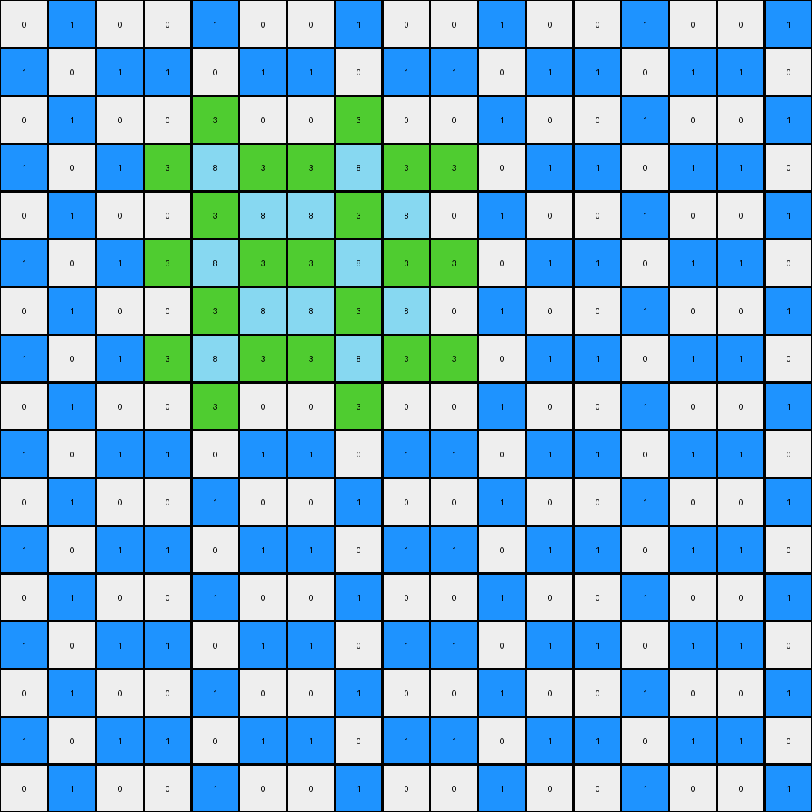

# 32597951 • 018 • refine_coder

---

Previous Code:
```python
"""
1.  **Identify Azure Clusters:** Locate all clusters of azure (8) pixels within the input grid. A cluster is defined as one or more azure pixels that are contiguously connected (horizontally, vertically, or diagonally).

2.  **Identify inner and outer Blue Pixels:** For each azure cluster locate the blue(1) pixels. For each cluster, blue pixels can be one of two types.
    *   Inner Blue Pixels. Those blue(1) pixels that are adjacent to azure(8) pixels *and* also adjacent to blue(1) pixels that are *not* adjecent to azure(8) pixels
    *   Outer Blue Pixels: those blue(1) pixels that are adjacent to azure(8) pixels *and* are *not* inner blue pixels.

3.  **Conditional Replacement, Outer Blue Pixels:** For all "Outer Blue Pixels", change any that are adjacent to azure(8) pixels to green(3).

4.  **Conditional Replacement, Inner Blue Pixels:** For all "Inner Blue Pixels", change any that are adjacent to azure(8) pixels to green(3).
"""

import numpy as np
from collections import deque

def find_clusters(grid, color):
    """Finds clusters of a specific color in the grid."""
    visited = set()
    clusters = []

    def get_neighbors(r, c):
        """Returns valid neighbors (within bounds and same color)."""
        rows, cols = grid.shape
        neighbors = []
        for dr in [-1, 0, 1]:
            for dc in [-1, 0, 1]:
                if dr == 0 and dc == 0:
                    continue
                nr, nc = r + dr, c + dc
                if 0 <= nr < rows and 0 <= nc < cols and grid[nr, nc] == color:
                    neighbors.append((nr, nc))
        return neighbors

    def bfs(start_r, start_c):
        """Performs Breadth-First Search to find a cluster."""
        queue = deque([(start_r, start_c)])
        cluster = set()
        visited.add((start_r, start_c))

        while queue:
            r, c = queue.popleft()
            cluster.add((r, c))
            for nr, nc in get_neighbors(r, c):
                if (nr, nc) not in visited:
                    visited.add((nr, nc))
                    queue.append((nr, nc))
        return cluster

    rows, cols = grid.shape
    for r in range(rows):
        for c in range(cols):
            if grid[r, c] == color and (r, c) not in visited:
                clusters.append(bfs(r, c))
    return clusters

def get_adjacent_pixels(grid, cluster, color):
    """get pixels of a specific color adjacent to the cluster"""
    rows, cols = grid.shape
    adjacent_pixels = set()
    
    for r,c in cluster:
        for dr in [-1, 0, 1]:
            for dc in [-1, 0, 1]:
                if dr == 0 and dc == 0:
                    continue
                nr, nc = r+dr, c+dc
                if 0 <= nr < rows and 0 <= nc < cols and grid[nr,nc] == color:
                    adjacent_pixels.add((nr,nc))
    return adjacent_pixels


def get_blue_pixel_types(grid, azure_cluster):
    """Classifies blue pixels adjacent to an azure cluster."""
    
    adjacent_blues = get_adjacent_pixels(grid, azure_cluster, 1)
    
    inner_blue_pixels = set()
    outer_blue_pixels = set()

    for b_r, b_c in adjacent_blues:
        is_inner = False
        
        #check neighbors of this blue pixel
        for dr in [-1, 0, 1]:
            for dc in [-1, 0, 1]:
                if dr == 0 and dc == 0: continue

                nr, nc = b_r + dr, b_c + dc
                if 0 <= nr < grid.shape[0] and 0 <= nc < grid.shape[1]:
                    if grid[nr,nc] == 1 and (nr,nc) not in adjacent_blues:
                        is_inner = True
                        break
            if is_inner: break # optimization
        if is_inner:
            inner_blue_pixels.add((b_r,b_c))
        else:
            outer_blue_pixels.add((b_r,b_c))

    return inner_blue_pixels, outer_blue_pixels

def transform(input_grid):
    """Transforms the input grid according to the described rule."""
    grid = np.array(input_grid)  # Convert to NumPy array for easier manipulation
    output_grid = grid.copy()

    azure_clusters = find_clusters(grid, 8)

    for cluster in azure_clusters:
        inner_blue_pixels, outer_blue_pixels = get_blue_pixel_types(grid, cluster)

        # change outer pixels
        for r, c in outer_blue_pixels:
            output_grid[r, c] = 3
        # change inner pixels
        for r,c in inner_blue_pixels:
            output_grid[r,c] = 3
            

    return output_grid.tolist()  # Convert back to list
```

Train Set Results:

## Example 1:

Input:
```
0 0 0 0 0 0 0 0 0 0 0 0 0 0 0 0 0
1 1 0 1 1 1 0 1 1 1 0 1 1 1 0 1 1
0 0 0 0 0 8 8 8 8 8 0 0 0 0 0 0 0
1 1 1 0 1 1 1 8 1 1 1 0 1 1 1 0 1
0 0 0 0 0 8 8 8 8 8 0 0 0 0 0 0 0
1 1 0 1 1 1 8 1 1 1 0 1 1 1 0 1 1
0 0 0 0 0 8 8 8 8 8 0 0 0 0 0 0 0
1 1 1 0 1 1 1 0 1 1 1 0 1 1 1 0 1
0 0 0 0 0 0 0 0 0 0 0 0 0 0 0 0 0
1 1 0 1 1 1 0 1 1 1 0 1 1 1 0 1 1
0 0 0 0 0 0 0 0 0 0 0 0 0 0 0 0 0
1 1 1 0 1 1 1 0 1 1 1 0 1 1 1 0 1
0 0 0 0 0 0 0 0 0 0 0 0 0 0 0 0 0
1 1 0 1 1 1 0 1 1 1 0 1 1 1 0 1 1
0 0 0 0 0 0 0 0 0 0 0 0 0 0 0 0 0
1 1 1 0 1 1 1 0 1 1 1 0 1 1 1 0 1
0 0 0 0 0 0 0 0 0 0 0 0 0 0 0 0 0
```
Expected Output:
```
0 0 0 0 0 0 0 0 0 0 0 0 0 0 0 0 0
1 1 0 1 1 1 0 1 1 1 0 1 1 1 0 1 1
0 0 0 0 0 8 8 8 8 8 0 0 0 0 0 0 0
1 1 1 0 1 3 3 8 3 3 1 0 1 1 1 0 1
0 0 0 0 0 8 8 8 8 8 0 0 0 0 0 0 0
1 1 0 1 1 3 8 3 3 3 0 1 1 1 0 1 1
0 0 0 0 0 8 8 8 8 8 0 0 0 0 0 0 0
1 1 1 0 1 1 1 0 1 1 1 0 1 1 1 0 1
0 0 0 0 0 0 0 0 0 0 0 0 0 0 0 0 0
1 1 0 1 1 1 0 1 1 1 0 1 1 1 0 1 1
0 0 0 0 0 0 0 0 0 0 0 0 0 0 0 0 0
1 1 1 0 1 1 1 0 1 1 1 0 1 1 1 0 1
0 0 0 0 0 0 0 0 0 0 0 0 0 0 0 0 0
1 1 0 1 1 1 0 1 1 1 0 1 1 1 0 1 1
0 0 0 0 0 0 0 0 0 0 0 0 0 0 0 0 0
1 1 1 0 1 1 1 0 1 1 1 0 1 1 1 0 1
0 0 0 0 0 0 0 0 0 0 0 0 0 0 0 0 0
```
Transformed Output:
```
0 0 0 0 0 0 0 0 0 0 0 0 0 0 0 0 0
1 1 0 1 3 3 0 3 3 3 0 1 1 1 0 1 1
0 0 0 0 0 8 8 8 8 8 0 0 0 0 0 0 0
1 1 1 0 3 3 3 8 3 3 3 0 1 1 1 0 1
0 0 0 0 0 8 8 8 8 8 0 0 0 0 0 0 0
1 1 0 1 3 3 8 3 3 3 0 1 1 1 0 1 1
0 0 0 0 0 8 8 8 8 8 0 0 0 0 0 0 0
1 1 1 0 3 3 3 0 3 3 3 0 1 1 1 0 1
0 0 0 0 0 0 0 0 0 0 0 0 0 0 0 0 0
1 1 0 1 1 1 0 1 1 1 0 1 1 1 0 1 1
0 0 0 0 0 0 0 0 0 0 0 0 0 0 0 0 0
1 1 1 0 1 1 1 0 1 1 1 0 1 1 1 0 1
0 0 0 0 0 0 0 0 0 0 0 0 0 0 0 0 0
1 1 0 1 1 1 0 1 1 1 0 1 1 1 0 1 1
0 0 0 0 0 0 0 0 0 0 0 0 0 0 0 0 0
1 1 1 0 1 1 1 0 1 1 1 0 1 1 1 0 1
0 0 0 0 0 0 0 0 0 0 0 0 0 0 0 0 0
```

match: False
pixels_off: 14
size_correct: True
color_palette_correct: True
correct_pixel_counts: False

## Example 2:

Input:
```
1 0 0 0 1 0 0 0 0 0 0 0 1 0 1 0 1
1 1 0 1 0 1 0 1 1 1 1 1 0 0 1 1 0
0 0 0 1 0 0 0 1 0 0 1 1 0 0 0 0 1
0 0 0 0 1 0 1 0 1 0 1 1 0 0 0 1 0
0 0 1 0 0 1 1 0 0 0 0 0 1 1 0 1 1
0 0 0 0 0 1 1 1 0 1 1 0 1 1 0 0 0
0 0 0 1 0 0 1 1 0 0 0 0 0 1 0 0 0
1 8 1 8 8 8 8 8 8 1 0 0 1 0 1 1 0
0 8 1 8 1 1 1 8 8 0 1 1 0 0 0 0 0
0 1 1 8 1 1 8 1 8 0 0 1 1 0 0 0 0
0 1 0 0 1 0 0 0 1 0 0 0 0 0 0 1 0
0 1 0 0 0 0 1 0 1 0 1 0 0 0 0 1 1
1 0 0 0 1 0 0 1 0 0 0 1 0 1 0 0 1
0 0 1 0 1 0 1 0 1 0 1 0 1 0 1 0 0
0 0 1 1 0 1 1 1 1 1 1 0 0 0 0 0 1
0 1 1 0 1 1 0 0 0 0 0 1 0 1 0 0 0
0 0 1 0 0 0 0 0 0 1 0 1 0 0 0 1 1
```
Expected Output:
```
1 0 0 0 1 0 0 0 0 0 0 0 1 0 1 0 1
1 1 0 1 0 1 0 1 1 1 1 1 0 0 1 1 0
0 0 0 1 0 0 0 1 0 0 1 1 0 0 0 0 1
0 0 0 0 1 0 1 0 1 0 1 1 0 0 0 1 0
0 0 1 0 0 1 1 0 0 0 0 0 1 1 0 1 1
0 0 0 0 0 1 1 1 0 1 1 0 1 1 0 0 0
0 0 0 1 0 0 1 1 0 0 0 0 0 1 0 0 0
1 8 3 8 8 8 8 8 8 1 0 0 1 0 1 1 0
0 8 3 8 3 3 3 8 8 0 1 1 0 0 0 0 0
0 3 3 8 3 3 8 3 8 0 0 1 1 0 0 0 0
0 1 0 0 1 0 0 0 1 0 0 0 0 0 0 1 0
0 1 0 0 0 0 1 0 1 0 1 0 0 0 0 1 1
1 0 0 0 1 0 0 1 0 0 0 1 0 1 0 0 1
0 0 1 0 1 0 1 0 1 0 1 0 1 0 1 0 0
0 0 1 1 0 1 1 1 1 1 1 0 0 0 0 0 1
0 1 1 0 1 1 0 0 0 0 0 1 0 1 0 0 0
0 0 1 0 0 0 0 0 0 1 0 1 0 0 0 1 1
```
Transformed Output:
```
1 0 0 0 1 0 0 0 0 0 0 0 1 0 1 0 1
1 1 0 1 0 1 0 1 1 1 1 1 0 0 1 1 0
0 0 0 1 0 0 0 1 0 0 1 1 0 0 0 0 1
0 0 0 0 1 0 1 0 1 0 1 1 0 0 0 1 0
0 0 1 0 0 1 1 0 0 0 0 0 1 1 0 1 1
0 0 0 0 0 1 1 1 0 1 1 0 1 1 0 0 0
0 0 0 3 0 0 3 3 0 0 0 0 0 1 0 0 0
3 8 3 8 8 8 8 8 8 3 0 0 1 0 1 1 0
0 8 3 8 3 3 3 8 8 0 1 1 0 0 0 0 0
0 3 3 8 3 3 8 3 8 0 0 1 1 0 0 0 0
0 1 0 0 3 0 0 0 3 0 0 0 0 0 0 1 0
0 1 0 0 0 0 1 0 1 0 1 0 0 0 0 1 1
1 0 0 0 1 0 0 1 0 0 0 1 0 1 0 0 1
0 0 1 0 1 0 1 0 1 0 1 0 1 0 1 0 0
0 0 1 1 0 1 1 1 1 1 1 0 0 0 0 0 1
0 1 1 0 1 1 0 0 0 0 0 1 0 1 0 0 0
0 0 1 0 0 0 0 0 0 1 0 1 0 0 0 1 1
```

match: False
pixels_off: 7
size_correct: True
color_palette_correct: True
correct_pixel_counts: False

## Example 3:

Input:
```
0 1 0 0 1 0 0 1 0 0 1 0 0 1 0 0 1
1 0 1 1 0 1 1 0 1 1 0 1 1 0 1 1 0
0 1 0 0 1 0 0 1 0 0 1 0 0 1 0 0 1
1 0 1 1 8 1 1 8 1 1 0 1 1 0 1 1 0
0 1 0 0 1 8 8 1 8 0 1 0 0 1 0 0 1
1 0 1 1 8 1 1 8 1 1 0 1 1 0 1 1 0
0 1 0 0 1 8 8 1 8 0 1 0 0 1 0 0 1
1 0 1 1 8 1 1 8 1 1 0 1 1 0 1 1 0
0 1 0 0 1 0 0 1 0 0 1 0 0 1 0 0 1
1 0 1 1 0 1 1 0 1 1 0 1 1 0 1 1 0
0 1 0 0 1 0 0 1 0 0 1 0 0 1 0 0 1
1 0 1 1 0 1 1 0 1 1 0 1 1 0 1 1 0
0 1 0 0 1 0 0 1 0 0 1 0 0 1 0 0 1
1 0 1 1 0 1 1 0 1 1 0 1 1 0 1 1 0
0 1 0 0 1 0 0 1 0 0 1 0 0 1 0 0 1
1 0 1 1 0 1 1 0 1 1 0 1 1 0 1 1 0
0 1 0 0 1 0 0 1 0 0 1 0 0 1 0 0 1
```
Expected Output:
```
0 1 0 0 1 0 0 1 0 0 1 0 0 1 0 0 1
1 0 1 1 0 1 1 0 1 1 0 1 1 0 1 1 0
0 1 0 0 1 0 0 1 0 0 1 0 0 1 0 0 1
1 0 1 1 8 3 3 8 3 1 0 1 1 0 1 1 0
0 1 0 0 3 8 8 3 8 0 1 0 0 1 0 0 1
1 0 1 1 8 3 3 8 3 1 0 1 1 0 1 1 0
0 1 0 0 3 8 8 3 8 0 1 0 0 1 0 0 1
1 0 1 1 8 3 3 8 3 1 0 1 1 0 1 1 0
0 1 0 0 1 0 0 1 0 0 1 0 0 1 0 0 1
1 0 1 1 0 1 1 0 1 1 0 1 1 0 1 1 0
0 1 0 0 1 0 0 1 0 0 1 0 0 1 0 0 1
1 0 1 1 0 1 1 0 1 1 0 1 1 0 1 1 0
0 1 0 0 1 0 0 1 0 0 1 0 0 1 0 0 1
1 0 1 1 0 1 1 0 1 1 0 1 1 0 1 1 0
0 1 0 0 1 0 0 1 0 0 1 0 0 1 0 0 1
1 0 1 1 0 1 1 0 1 1 0 1 1 0 1 1 0
0 1 0 0 1 0 0 1 0 0 1 0 0 1 0 0 1
```
Transformed Output:
```
0 1 0 0 1 0 0 1 0 0 1 0 0 1 0 0 1
1 0 1 1 0 1 1 0 1 1 0 1 1 0 1 1 0
0 1 0 0 3 0 0 3 0 0 1 0 0 1 0 0 1
1 0 1 3 8 3 3 8 3 3 0 1 1 0 1 1 0
0 1 0 0 3 8 8 3 8 0 1 0 0 1 0 0 1
1 0 1 3 8 3 3 8 3 3 0 1 1 0 1 1 0
0 1 0 0 3 8 8 3 8 0 1 0 0 1 0 0 1
1 0 1 3 8 3 3 8 3 3 0 1 1 0 1 1 0
0 1 0 0 3 0 0 3 0 0 1 0 0 1 0 0 1
1 0 1 1 0 1 1 0 1 1 0 1 1 0 1 1 0
0 1 0 0 1 0 0 1 0 0 1 0 0 1 0 0 1
1 0 1 1 0 1 1 0 1 1 0 1 1 0 1 1 0
0 1 0 0 1 0 0 1 0 0 1 0 0 1 0 0 1
1 0 1 1 0 1 1 0 1 1 0 1 1 0 1 1 0
0 1 0 0 1 0 0 1 0 0 1 0 0 1 0 0 1
1 0 1 1 0 1 1 0 1 1 0 1 1 0 1 1 0
0 1 0 0 1 0 0 1 0 0 1 0 0 1 0 0 1
```

match: False
pixels_off: 10
size_correct: True
color_palette_correct: True
correct_pixel_counts: False
Okay, here's an analysis of the provided examples and results, along with a refined natural language program and a YAML block summarizing the observations.

**General Assessment and Strategy**

The initial natural language program and corresponding code were close, but not entirely accurate, as evidenced by the mismatches in the transformed outputs. The core issue lies in the precise definition and handling of "inner" and "outer" blue pixels. The current implementation seems to misclassify some blue pixels, leading to incorrect replacements. Specifically, it seems to be misidentifying inner/outer in some cases and applying green in places where it should not, and possibly not changing some pixels that it should. A review of the adjacency rules is probably the issue.

The results suggest a strategy focused on refining the adjacency checks used to classify blue pixels. The code's `get_blue_pixel_types` function is the key area to improve. We need to consider different configurations of blue and azure pixels. Also, the provided visualization of the transformed output can be misleading, as the color differences between 1 and 3 are subtle. It is essential to use code_execution to programmatically examine the results and generate reports.

**Gather Metrics and Reports**

Here are some python code blocks to be used in a `code_execution` tool, to perform some analysis of the errors.

Report total pixels off in each example
```python
import numpy as np

def pixels_off(expected, transformed):
    expected_array = np.array(expected)
    transformed_array = np.array(transformed)
    return np.sum(expected_array != transformed_array)

results = [
    {
        "expected": [
[0, 0, 0, 0, 0, 0, 0, 0, 0, 0, 0, 0, 0, 0, 0, 0, 0],
[1, 1, 0, 1, 1, 1, 0, 1, 1, 1, 0, 1, 1, 1, 0, 1, 1],
[0, 0, 0, 0, 0, 8, 8, 8, 8, 8, 0, 0, 0, 0, 0, 0, 0],
[1, 1, 1, 0, 1, 3, 3, 8, 3, 3, 1, 0, 1, 1, 1, 0, 1],
[0, 0, 0, 0, 0, 8, 8, 8, 8, 8, 0, 0, 0, 0, 0, 0, 0],
[1, 1, 0, 1, 1, 3, 8, 3, 3, 3, 0, 1, 1, 1, 0, 1, 1],
[0, 0, 0, 0, 0, 8, 8, 8, 8, 8, 0, 0, 0, 0, 0, 0, 0],
[1, 1, 1, 0, 1, 1, 1, 0, 1, 1, 1, 0, 1, 1, 1, 0, 1],
[0, 0, 0, 0, 0, 0, 0, 0, 0, 0, 0, 0, 0, 0, 0, 0, 0],
[1, 1, 0, 1, 1, 1, 0, 1, 1, 1, 0, 1, 1, 1, 0, 1, 1],
[0, 0, 0, 0, 0, 0, 0, 0, 0, 0, 0, 0, 0, 0, 0, 0, 0],
[1, 1, 1, 0, 1, 1, 1, 0, 1, 1, 1, 0, 1, 1, 1, 0, 1],
[0, 0, 0, 0, 0, 0, 0, 0, 0, 0, 0, 0, 0, 0, 0, 0, 0],
[1, 1, 0, 1, 1, 1, 0, 1, 1, 1, 0, 1, 1, 1, 0, 1, 1],
[0, 0, 0, 0, 0, 0, 0, 0, 0, 0, 0, 0, 0, 0, 0, 0, 0],
[1, 1, 1, 0, 1, 1, 1, 0, 1, 1, 1, 0, 1, 1, 1, 0, 1],
[0, 0, 0, 0, 0, 0, 0, 0, 0, 0, 0, 0, 0, 0, 0, 0, 0]
        ],
        "transformed":[
[0, 0, 0, 0, 0, 0, 0, 0, 0, 0, 0, 0, 0, 0, 0, 0, 0],
[1, 1, 0, 1, 3, 3, 0, 3, 3, 3, 0, 1, 1, 1, 0, 1, 1],
[0, 0, 0, 0, 0, 8, 8, 8, 8, 8, 0, 0, 0, 0, 0, 0, 0],
[1, 1, 1, 0, 3, 3, 3, 8, 3, 3, 3, 0, 1, 1, 1, 0, 1],
[0, 0, 0, 0, 0, 8, 8, 8, 8, 8, 0, 0, 0, 0, 0, 0, 0],
[1, 1, 0, 1, 3, 3, 8, 3, 3, 3, 0, 1, 1, 1, 0, 1, 1],
[0, 0, 0, 0, 0, 8, 8, 8, 8, 8, 0, 0, 0, 0, 0, 0, 0],
[1, 1, 1, 0, 3, 3, 3, 0, 3, 3, 3, 0, 1, 1, 1, 0, 1],
[0, 0, 0, 0, 0, 0, 0, 0, 0, 0, 0, 0, 0, 0, 0, 0, 0],
[1, 1, 0, 1, 1, 1, 0, 1, 1, 1, 0, 1, 1, 1, 0, 1, 1],
[0, 0, 0, 0, 0, 0, 0, 0, 0, 0, 0, 0, 0, 0, 0, 0, 0],
[1, 1, 1, 0, 1, 1, 1, 0, 1, 1, 1, 0, 1, 1, 1, 0, 1],
[0, 0, 0, 0, 0, 0, 0, 0, 0, 0, 0, 0, 0, 0, 0, 0, 0],
[1, 1, 0, 1, 1, 1, 0, 1, 1, 1, 0, 1, 1, 1, 0, 1, 1],
[0, 0, 0, 0, 0, 0, 0, 0, 0, 0, 0, 0, 0, 0, 0, 0, 0],
[1, 1, 1, 0, 1, 1, 1, 0, 1, 1, 1, 0, 1, 1, 1, 0, 1],
[0, 0, 0, 0, 0, 0, 0, 0, 0, 0, 0, 0, 0, 0, 0, 0, 0]
        ]
    },
    {
      "expected": [
[1, 0, 0, 0, 1, 0, 0, 0, 0, 0, 0, 0, 1, 0, 1, 0, 1],
[1, 1, 0, 1, 0, 1, 0, 1, 1, 1, 1, 1, 0, 0, 1, 1, 0],
[0, 0, 0, 1, 0, 0, 0, 1, 0, 0, 1, 1, 0, 0, 0, 0, 1],
[0, 0, 0, 0, 1, 0, 1, 0, 1, 0, 1, 1, 0, 0, 0, 1, 0],
[0, 0, 1, 0, 0, 1, 1, 0, 0, 0, 0, 0, 1, 1, 0, 1, 1],
[0, 0, 0, 0, 0, 1, 1, 1, 0, 1, 1, 0, 1, 1, 0, 0, 0],
[0, 0, 0, 1, 0, 0, 1, 1, 0, 0, 0, 0, 0, 1, 0, 0, 0],
[1, 8, 3, 8, 8, 8, 8, 8, 8, 1, 0, 0, 1, 0, 1, 1, 0],
[0, 8, 3, 8, 3, 3, 3, 8, 8, 0, 1, 1, 0, 0, 0, 0, 0],
[0, 3, 3, 8, 3, 3, 8, 3, 8, 0, 0, 1, 1, 0, 0, 0, 0],
[0, 1, 0, 0, 1, 0, 0, 0, 1, 0, 0, 0, 0, 0, 0, 1, 0],
[0, 1, 0, 0, 0, 0, 1, 0, 1, 0, 1, 0, 0, 0, 0, 1, 1],
[1, 0, 0, 0, 1, 0, 0, 1, 0, 0, 0, 1, 0, 1, 0, 0, 1],
[0, 0, 1, 0, 1, 0, 1, 0, 1, 0, 1, 0, 1, 0, 1, 0, 0],
[0, 0, 1, 1, 0, 1, 1, 1, 1, 1, 1, 0, 0, 0, 0, 0, 1],
[0, 1, 1, 0, 1, 1, 0, 0, 0, 0, 0, 1, 0, 1, 0, 0, 0],
[0, 0, 1, 0, 0, 0, 0, 0, 0, 1, 0, 1, 0, 0, 0, 1, 1]
      ],
      "transformed": [
[1, 0, 0, 0, 1, 0, 0, 0, 0, 0, 0, 0, 1, 0, 1, 0, 1],
[1, 1, 0, 1, 0, 1, 0, 1, 1, 1, 1, 1, 0, 0, 1, 1, 0],
[0, 0, 0, 1, 0, 0, 0, 1, 0, 0, 1, 1, 0, 0, 0, 0, 1],
[0, 0, 0, 0, 1, 0, 1, 0, 1, 0, 1, 1, 0, 0, 0, 1, 0],
[0, 0, 1, 0, 0, 1, 1, 0, 0, 0, 0, 0, 1, 1, 0, 1, 1],
[0, 0, 0, 0, 0, 1, 1, 1, 0, 1, 1, 0, 1, 1, 0, 0, 0],
[0, 0, 0, 3, 0, 0, 3, 3, 0, 0, 0, 0, 0, 1, 0, 0, 0],
[3, 8, 3, 8, 8, 8, 8, 8, 8, 3, 0, 0, 1, 0, 1, 1, 0],
[0, 8, 3, 8, 3, 3, 3, 8, 8, 0, 1, 1, 0, 0, 0, 0, 0],
[0, 3, 3, 8, 3, 3, 8, 3, 8, 0, 0, 1, 1, 0, 0, 0, 0],
[0, 1, 0, 0, 3, 0, 0, 0, 3, 0, 0, 0, 0, 0, 0, 1, 0],
[0, 1, 0, 0, 0, 0, 1, 0, 1, 0, 1, 0, 0, 0, 0, 1, 1],
[1, 0, 0, 0, 1, 0, 0, 1, 0, 0, 0, 1, 0, 1, 0, 0, 1],
[0, 0, 1, 0, 1, 0, 1, 0, 1, 0, 1, 0, 1, 0, 1, 0, 0],
[0, 0, 1, 1, 0, 1, 1, 1, 1, 1, 1, 0, 0, 0, 0, 0, 1],
[0, 1, 1, 0, 1, 1, 0, 0, 0, 0, 0, 1, 0, 1, 0, 0, 0],
[0, 0, 1, 0, 0, 0, 0, 0, 0, 1, 0, 1, 0, 0, 0, 1, 1]
      ]
    },
  {
      "expected": [
[0, 1, 0, 0, 1, 0, 0, 1, 0, 0, 1, 0, 0, 1, 0, 0, 1],
[1, 0, 1, 1, 0, 1, 1, 0, 1, 1, 0, 1, 1, 0, 1, 1, 0],
[0, 1, 0, 0, 1, 0, 0, 1, 0, 0, 1, 0, 0, 1, 0, 0, 1],
[1, 0, 1, 1, 8, 3, 3, 8, 3, 1, 0, 1, 1, 0, 1, 1, 0],
[0, 1, 0, 0, 3, 8, 8, 3, 8, 0, 1, 0, 0, 1, 0, 0, 1],
[1, 0, 1, 1, 8, 3, 3, 8, 3, 1, 0, 1, 1, 0, 1, 1, 0],
[0, 1, 0, 0, 3, 8, 8, 3, 8, 0, 1, 0, 0, 1, 0, 0, 1],
[1, 0, 1, 1, 8, 3, 3, 8, 3, 1, 0, 1, 1, 0, 1, 1, 0],
[0, 1, 0, 0, 1, 0, 0, 1, 0, 0, 1, 0, 0, 1, 0, 0, 1],
[1, 0, 1, 1, 0, 1, 1, 0, 1, 1, 0, 1, 1, 0, 1, 1, 0],
[0, 1, 0, 0, 1, 0, 0, 1, 0, 0, 1, 0, 0, 1, 0, 0, 1],
[1, 0, 1, 1, 0, 1, 1, 0, 1, 1, 0, 1, 1, 0, 1, 1, 0],
[0, 1, 0, 0, 1, 0, 0, 1, 0, 0, 1, 0, 0, 1, 0, 0, 1],
[1, 0, 1, 1, 0, 1, 1, 0, 1, 1, 0, 1, 1, 0, 1, 1, 0],
[0, 1, 0, 0, 1, 0, 0, 1, 0, 0, 1, 0, 0, 1, 0, 0, 1],
[1, 0, 1, 1, 0, 1, 1, 0, 1, 1, 0, 1, 1, 0, 1, 1, 0],
[0, 1, 0, 0, 1, 0, 0, 1, 0, 0, 1, 0, 0, 1, 0, 0, 1]
],
    "transformed": [
[0, 1, 0, 0, 1, 0, 0, 1, 0, 0, 1, 0, 0, 1, 0, 0, 1],
[1, 0, 1, 1, 0, 1, 1, 0, 1, 1, 0, 1, 1, 0, 1, 1, 0],
[0, 1, 0, 0, 3, 0, 0, 3, 0, 0, 1, 0, 0, 1, 0, 0, 1],
[1, 0, 1, 3, 8, 3, 3, 8, 3, 3, 0, 1, 1, 0, 1, 1, 0],
[0, 1, 0, 0, 3, 8, 8, 3, 8, 0, 1, 0, 0, 1, 0, 0, 1],
[1, 0, 1, 3, 8, 3, 3, 8, 3, 3, 0, 1, 1, 0, 1, 1, 0],
[0, 1, 0, 0, 3, 8, 8, 3, 8, 0, 1, 0, 0, 1, 0, 0, 1],
[1, 0, 1, 3, 8, 3, 3, 8, 3, 3, 0, 1, 1, 0, 1, 1, 0],
[0, 1, 0, 0, 3, 0, 0, 3, 0, 0, 1, 0, 0, 1, 0, 0, 1],
[1, 0, 1, 1, 0, 1, 1, 0, 1, 1, 0, 1, 1, 0, 1, 1, 0],
[0, 1, 0, 0, 1, 0, 0, 1, 0, 0, 1, 0, 0, 1, 0, 0, 1],
[1, 0, 1, 1, 0, 1, 1, 0, 1, 1, 0, 1, 1, 0, 1, 1, 0],
[0, 1, 0, 0, 1, 0, 0, 1, 0, 0, 1, 0, 0, 1, 0, 0, 1],
[1, 0, 1, 1, 0, 1, 1, 0, 1, 1, 0, 1, 1, 0, 1, 1, 0],
[0, 1, 0, 0, 1, 0, 0, 1, 0, 0, 1, 0, 0, 1, 0, 0, 1],
[1, 0, 1, 1, 0, 1, 1, 0, 1, 1, 0, 1, 1, 0, 1, 1, 0],
[0, 1, 0, 0, 1, 0, 0, 1, 0, 0, 1, 0, 0, 1, 0, 0, 1]
]
  }

]

for i, result in enumerate(results):
    off_count = pixels_off(result["expected"], result["transformed"])
    print(f"Example {i+1}: Pixels off = {off_count}")

```

Report pixel values where errors occurred
```python
import numpy as np

def error_report(expected, transformed):
    expected_array = np.array(expected)
    transformed_array = np.array(transformed)
    diff = expected_array != transformed_array
    expected_errors = expected_array[diff]
    transformed_errors = transformed_array[diff]

    return list(zip(expected_errors, transformed_errors))

results = [
    {
        "expected": [
[0, 0, 0, 0, 0, 0, 0, 0, 0, 0, 0, 0, 0, 0, 0, 0, 0],
[1, 1, 0, 1, 1, 1, 0, 1, 1, 1, 0, 1, 1, 1, 0, 1, 1],
[0, 0, 0, 0, 0, 8, 8, 8, 8, 8, 0, 0, 0, 0, 0, 0, 0],
[1, 1, 1, 0, 1, 3, 3, 8, 3, 3, 1, 0, 1, 1, 1, 0, 1],
[0, 0, 0, 0, 0, 8, 8, 8, 8, 8, 0, 0, 0, 0, 0, 0, 0],
[1, 1, 0, 1, 1, 3, 8, 3, 3, 3, 0, 1, 1, 1, 0, 1, 1],
[0, 0, 0, 0, 0, 8, 8, 8, 8, 8, 0, 0, 0, 0, 0, 0, 0],
[1, 1, 1, 0, 1, 1, 1, 0, 1, 1, 1, 0, 1, 1, 1, 0, 1],
[0, 0, 0, 0, 0, 0, 0, 0, 0, 0, 0, 0, 0, 0, 0, 0, 0],
[1, 1, 0, 1, 1, 1, 0, 1, 1, 1, 0, 1, 1, 1, 0, 1, 1],
[0, 0, 0, 0, 0, 0, 0, 0, 0, 0, 0, 0, 0, 0, 0, 0, 0],
[1, 1, 1, 0, 1, 1, 1, 0, 1, 1, 1, 0, 1, 1, 1, 0, 1],
[0, 0, 0, 0, 0, 0, 0, 0, 0, 0, 0, 0, 0, 0, 0, 0, 0],
[1, 1, 0, 1, 1, 1, 0, 1, 1, 1, 0, 1, 1, 1, 0, 1, 1],
[0, 0, 0, 0, 0, 0, 0, 0, 0, 0, 0, 0, 0, 0, 0, 0, 0],
[1, 1, 1, 0, 1, 1, 1, 0, 1, 1, 1, 0, 1, 1, 1, 0, 1],
[0, 0, 0, 0, 0, 0, 0, 0, 0, 0, 0, 0, 0, 0, 0, 0, 0]
        ],
        "transformed":[
[0, 0, 0, 0, 0, 0, 0, 0, 0, 0, 0, 0, 0, 0, 0, 0, 0],
[1, 1, 0, 1, 3, 3, 0, 3, 3, 3, 0, 1, 1, 1, 0, 1, 1],
[0, 0, 0, 0, 0, 8, 8, 8, 8, 8, 0, 0, 0, 0, 0, 0, 0],
[1, 1, 1, 0, 3, 3, 3, 8, 3, 3, 3, 0, 1, 1, 1, 0, 1],
[0, 0, 0, 0, 0, 8, 8, 8, 8, 8, 0, 0, 0, 0, 0, 0, 0],
[1, 1, 0, 1, 3, 3, 8, 3, 3, 3, 0, 1, 1, 1, 0, 1, 1],
[0, 0, 0, 0, 0, 8, 8, 8, 8, 8, 0, 0, 0, 0, 0, 0, 0],
[1, 1, 1, 0, 3, 3, 3, 0, 3, 3, 3, 0, 1, 1, 1, 0, 1],
[0, 0, 0, 0, 0, 0, 0, 0, 0, 0, 0, 0, 0, 0, 0, 0, 0],
[1, 1, 0, 1, 1, 1, 0, 1, 1, 1, 0, 1, 1, 1, 0, 1, 1],
[0, 0, 0, 0, 0, 0, 0, 0, 0, 0, 0, 0, 0, 0, 0, 0, 0],
[1, 1, 1, 0, 1, 1, 1, 0, 1, 1, 1, 0, 1, 1, 1, 0, 1],
[0, 0, 0, 0, 0, 0, 0, 0, 0, 0, 0, 0, 0, 0, 0, 0, 0],
[1, 1, 0, 1, 1, 1, 0, 1, 1, 1, 0, 1, 1, 1, 0, 1, 1],
[0, 0, 0, 0, 0, 0, 0, 0, 0, 0, 0, 0, 0, 0, 0, 0, 0],
[1, 1, 1, 0, 1, 1, 1, 0, 1, 1, 1, 0, 1, 1, 1, 0, 1],
[0, 0, 0, 0, 0, 0, 0, 0, 0, 0, 0, 0, 0, 0, 0, 0, 0]
        ]
    },
    {
      "expected": [
[1, 0, 0, 0, 1, 0, 0, 0, 0, 0, 0, 0, 1, 0, 1, 0, 1],
[1, 1, 0, 1, 0, 1, 0, 1, 1, 1, 1, 1, 0, 0, 1, 1, 0],
[0, 0, 0, 1, 0, 0, 0, 1, 0, 0, 1, 1, 0, 0, 0, 0, 1],
[0, 0, 0, 0, 1, 0, 1, 0, 1, 0, 1, 1, 0, 0, 0, 1, 0],
[0, 0, 1, 0, 0, 1, 1, 0, 0, 0, 0, 0, 1, 1, 0, 1, 1],
[0, 0, 0, 0, 0, 1, 1, 1, 0, 1, 1, 0, 1, 1, 0, 0, 0],
[0, 0, 0, 1, 0, 0, 1, 1, 0, 0, 0, 0, 0, 1, 0, 0, 0],
[1, 8, 3, 8, 8, 8, 8, 8, 8, 1, 0, 0, 1, 0, 1, 1, 0],
[0, 8, 3, 8, 3, 3, 3, 8, 8, 0, 1, 1, 0, 0, 0, 0, 0],
[0, 3, 3, 8, 3, 3, 8, 3, 8, 0, 0, 1, 1, 0, 0, 0, 
**INSTRUCTIONS**

- generate a Python module to represent the natural language program 
- follow the template below
- all common math and science libraries are available
- create docstring only at top - but comment the workflow in the function
- use helper functions for common operations like finding objects, counting,
  measuring, moving, etc. 

remember - we are working iteratively - so this code will inform your future
self as we converge on the solution

*template:*

```python
"""
{{ natural language description of the transformation rule }}
"""

{{ imports }}

def transform(input_grid):
    # initialize output_grid

    # change output pixels 

    return output_grid

```
