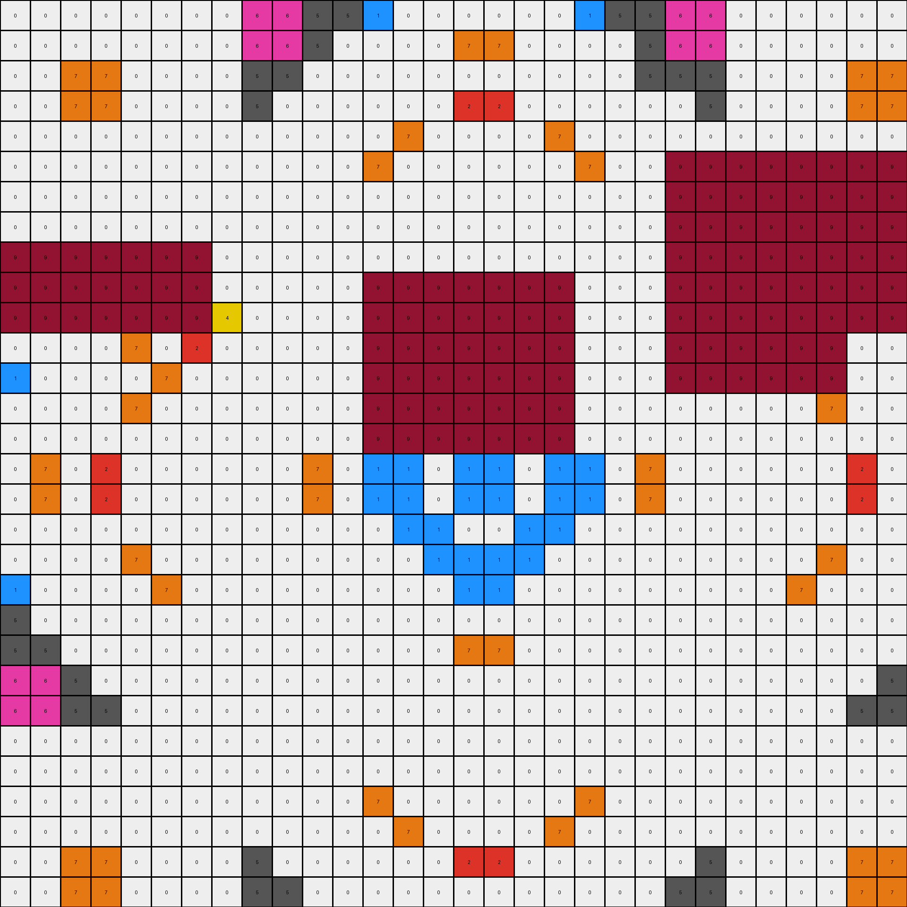
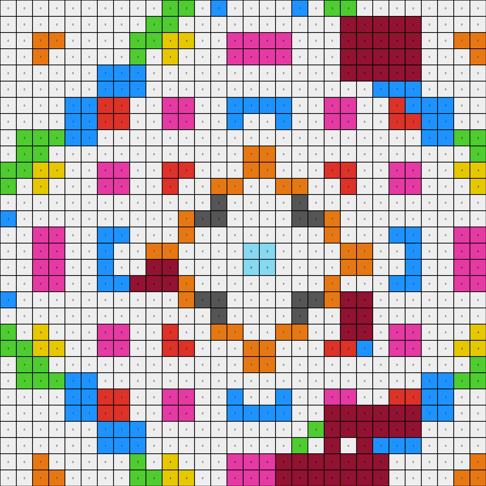
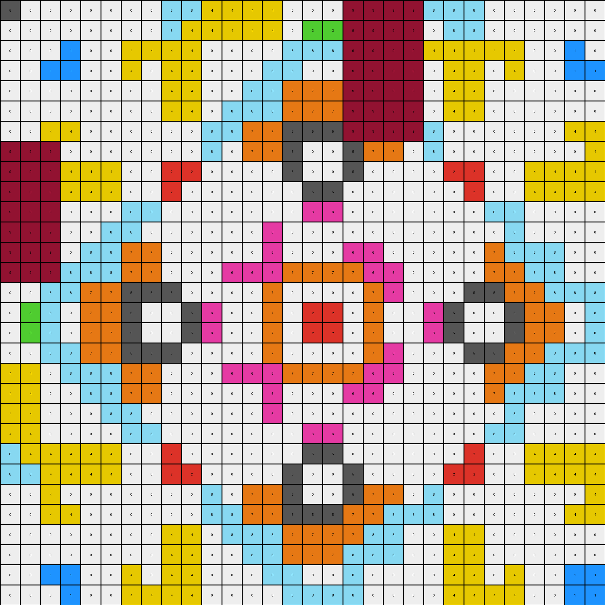

# 3631a71a • 009 • refine_dreamer

---


Previous Code:
```python
"""
The transformation rule involves identifying connected regions (objects) of the same color in the input grid and then simplifying the colors within each object. Specifically, if a color appears only once within an object, it is replaced by one of its most prevalent neighboring color.
"""

import numpy as np
from collections import Counter

def get_objects(grid):
    """
    Identifies and returns a list of objects in the grid.
    An object is a set of connected pixels with the same color.
    """
    objects = []
    visited = set()
    rows, cols = grid.shape

    def is_valid(r, c):
        return 0 <= r < rows and 0 <= c < cols

    def dfs(r, c, color, current_object):
        if (r, c) in visited or not is_valid(r, c) or grid[r, c] != color:
            return
        visited.add((r, c))
        current_object.add((r, c))
        for dr, dc in [(0, 1), (1, 0), (0, -1), (-1, 0)]:
            dfs(r + dr, c + dc, color, current_object)

    for r in range(rows):
        for c in range(cols):
            if (r, c) not in visited:
                current_object = set()
                dfs(r, c, grid[r, c], current_object)
                objects.append((grid[r,c], current_object)) #Store the color and the set
    return objects

def get_neighbors(grid, r, c):
    """
    Get valid neighbors for the given cell.

    """

    rows, cols = grid.shape
    neighbors = []
    for dr, dc in [(0, 1), (1, 0), (0, -1), (-1, 0)]:
        nr, nc = r + dr, c + dc
        if 0 <= nr < rows and 0 <= nc < cols:
            neighbors.append(grid[nr, nc])
    return neighbors


def transform(input_grid):
    # initialize output_grid
    output_grid = np.copy(input_grid)
    rows, cols = output_grid.shape

    # Identify Objects:
    objects = get_objects(input_grid)

    # Iterate through each object:
    for color, object_pixels in objects:

      # Analyze Colors:
      pixels_list = list(object_pixels)
      colors_in_object = [input_grid[r,c] for r, c in pixels_list]
      color_counts = Counter(colors_in_object)

      #Find the colors to be changed and store positions in dict
      colors_to_change = {color:[] for color, count in color_counts.items() if count == 1}
      for r, c in pixels_list:
          if input_grid[r,c] in colors_to_change:
              colors_to_change[input_grid[r,c]].append((r,c))

      # Update Colors
      for unique_color, positions in colors_to_change.items():
        for r, c in positions:
          #Find the most prevalent neighbor
          neighbors = get_neighbors(input_grid, r, c)
          if neighbors: #Check that list of neighbors is not empty
            neighbor_counts = Counter(neighbors)
            #Exclude pixels of same color from the count
            if unique_color in neighbor_counts:
               del neighbor_counts[unique_color]

            if neighbor_counts: # Check the neighbor count is not empty after removing same color
              most_common_neighbor = neighbor_counts.most_common(1)[0][0]

            #If the count is empty, keeps original pixel
              output_grid[r, c] = most_common_neighbor


    return output_grid
```

Train Set Results:

## Example 1:

Input:
```
0 0 0 0 0 0 0 0 6 6 5 5 0 1 0 0 0 0 1 0 5 5 6 6 0 0 0 0 0 0
0 0 0 0 0 5 0 0 6 6 5 0 1 0 0 7 7 0 0 1 0 5 6 6 0 0 5 0 0 0
0 0 7 7 0 0 0 7 5 5 4 0 0 0 0 0 0 0 0 0 0 4 5 5 7 0 0 0 7 7
0 0 7 7 0 0 7 0 5 0 0 4 0 7 0 2 2 0 7 0 4 0 0 5 0 7 0 0 7 7
0 0 0 0 0 0 0 0 0 1 0 0 7 0 4 0 0 4 0 7 0 0 1 0 0 0 0 0 0 0
0 5 0 0 0 0 0 0 1 0 0 7 0 7 0 0 0 0 7 0 7 0 9 9 9 9 9 9 9 9
0 0 0 7 0 0 3 0 0 0 0 0 4 0 8 0 0 8 0 4 0 0 9 9 9 9 9 9 9 9
0 0 7 0 0 0 0 0 0 7 0 2 0 0 0 0 0 0 0 0 2 0 9 9 9 9 9 9 9 9
9 9 9 9 9 9 9 0 0 0 4 0 0 0 0 0 0 0 0 0 0 4 9 9 9 9 9 9 9 9
9 9 9 9 9 9 9 7 0 8 0 0 9 9 9 9 9 9 9 0 0 0 9 9 9 9 9 9 9 9
9 9 9 9 9 9 9 0 4 0 0 5 9 9 9 9 9 9 9 0 5 0 9 9 9 9 9 9 9 9
5 0 0 4 0 7 0 2 0 0 5 0 9 9 9 9 9 9 9 0 0 5 9 9 9 9 9 9 4 0
0 1 0 0 7 0 4 0 0 0 0 0 9 9 9 9 9 9 9 1 0 0 9 9 9 9 9 9 0 0
1 0 0 7 0 7 0 0 0 0 0 0 9 9 9 9 9 9 9 0 0 0 0 0 0 0 7 0 7 0
0 0 0 0 4 0 8 0 0 0 0 7 9 9 9 9 9 9 9 0 7 0 0 0 0 8 0 4 0 0
0 7 0 2 0 0 0 0 0 0 7 0 1 1 0 1 1 0 1 1 0 7 0 0 0 0 0 0 2 0
0 7 0 2 0 0 0 0 0 0 7 0 1 1 0 1 1 0 1 1 0 7 0 0 0 0 0 0 2 0
0 0 0 0 4 0 8 0 0 0 0 7 0 1 1 0 0 1 1 0 7 0 0 0 0 8 0 4 0 0
1 0 0 7 0 7 0 0 0 0 0 0 0 0 1 1 1 1 0 0 0 0 0 0 0 0 7 0 7 0
0 1 0 0 7 0 4 0 0 0 0 0 1 0 0 1 1 0 0 1 0 0 0 0 0 4 0 7 0 0
5 0 0 4 0 7 0 2 0 0 5 0 0 0 7 0 0 7 0 0 0 5 0 0 2 0 7 0 4 0
5 5 4 0 0 0 0 0 4 0 0 5 0 0 0 7 7 0 0 0 5 0 0 4 0 0 0 0 0 4
6 6 5 0 1 0 0 7 0 8 0 0 0 0 0 0 0 0 0 0 0 0 8 0 7 0 0 1 0 5
6 6 5 5 0 1 0 0 0 0 4 0 0 0 0 0 0 0 0 0 0 4 0 0 0 0 1 0 5 5
0 0 7 0 0 0 0 0 0 7 0 2 0 0 0 0 0 0 0 0 2 0 7 0 0 0 0 0 0 7
0 0 0 7 0 0 3 0 0 0 0 0 4 0 8 0 0 8 0 4 0 0 0 0 0 3 0 0 7 0
0 5 0 0 0 0 0 0 1 0 0 7 0 7 0 0 0 0 7 0 7 0 0 1 0 0 0 0 0 0
0 0 0 0 0 0 0 0 0 1 0 0 7 0 4 0 0 4 0 7 0 0 1 0 0 0 0 0 0 0
0 0 7 7 0 0 7 0 5 0 0 4 0 7 0 2 2 0 7 0 4 0 0 5 0 7 0 0 7 7
0 0 7 7 0 0 0 7 5 5 4 0 0 0 0 0 0 0 0 0 0 4 5 5 7 0 0 0 7 7
```
Expected Output:
```
0 0 0 0 0 0 0 0 6 6 5 5 0 1 0 0 0 0 1 0 5 5 6 6 0 0 0 0 0 0
0 0 0 0 0 5 0 0 6 6 5 0 1 0 0 7 7 0 0 1 0 5 6 6 0 0 5 0 0 0
0 0 7 7 0 0 0 7 5 5 4 0 0 0 0 0 0 0 0 0 0 4 5 5 7 0 0 0 7 7
0 0 7 7 0 0 7 0 5 0 0 4 0 7 0 2 2 0 7 0 4 0 0 5 0 7 0 0 7 7
0 0 0 0 0 0 0 0 0 1 0 0 7 0 4 0 0 4 0 7 0 0 1 0 0 0 0 0 0 0
0 5 0 0 0 0 0 0 1 0 0 7 0 7 0 0 0 0 7 0 7 0 0 1 0 0 0 0 0 0
0 0 0 7 0 0 3 0 0 0 0 0 4 0 8 0 0 8 0 4 0 0 0 0 0 3 0 0 7 0
0 0 7 0 0 0 0 0 0 7 0 2 0 0 0 0 0 0 0 0 2 0 7 0 0 0 0 0 0 7
6 6 5 5 0 1 0 0 0 0 4 0 0 0 0 0 0 0 0 0 0 4 0 0 0 0 1 0 5 5
6 6 5 0 1 0 0 7 0 8 0 0 0 0 0 0 0 0 0 0 0 0 8 0 7 0 0 1 0 5
5 5 4 0 0 0 0 0 4 0 0 5 0 0 0 7 7 0 0 0 5 0 0 4 0 0 0 0 0 4
5 0 0 4 0 7 0 2 0 0 5 0 0 0 7 0 0 7 0 0 0 5 0 0 2 0 7 0 4 0
0 1 0 0 7 0 4 0 0 0 0 0 1 0 0 1 1 0 0 1 0 0 0 0 0 4 0 7 0 0
1 0 0 7 0 7 0 0 0 0 0 0 0 0 1 1 1 1 0 0 0 0 0 0 0 0 7 0 7 0
0 0 0 0 4 0 8 0 0 0 0 7 0 1 1 0 0 1 1 0 7 0 0 0 0 8 0 4 0 0
0 7 0 2 0 0 0 0 0 0 7 0 1 1 0 1 1 0 1 1 0 7 0 0 0 0 0 0 2 0
0 7 0 2 0 0 0 0 0 0 7 0 1 1 0 1 1 0 1 1 0 7 0 0 0 0 0 0 2 0
0 0 0 0 4 0 8 0 0 0 0 7 0 1 1 0 0 1 1 0 7 0 0 0 0 8 0 4 0 0
1 0 0 7 0 7 0 0 0 0 0 0 0 0 1 1 1 1 0 0 0 0 0 0 0 0 7 0 7 0
0 1 0 0 7 0 4 0 0 0 0 0 1 0 0 1 1 0 0 1 0 0 0 0 0 4 0 7 0 0
5 0 0 4 0 7 0 2 0 0 5 0 0 0 7 0 0 7 0 0 0 5 0 0 2 0 7 0 4 0
5 5 4 0 0 0 0 0 4 0 0 5 0 0 0 7 7 0 0 0 5 0 0 4 0 0 0 0 0 4
6 6 5 0 1 0 0 7 0 8 0 0 0 0 0 0 0 0 0 0 0 0 8 0 7 0 0 1 0 5
6 6 5 5 0 1 0 0 0 0 4 0 0 0 0 0 0 0 0 0 0 4 0 0 0 0 1 0 5 5
0 0 7 0 0 0 0 0 0 7 0 2 0 0 0 0 0 0 0 0 2 0 7 0 0 0 0 0 0 7
0 0 0 7 0 0 3 0 0 0 0 0 4 0 8 0 0 8 0 4 0 0 0 0 0 3 0 0 7 0
0 5 0 0 0 0 0 0 1 0 0 7 0 7 0 0 0 0 7 0 7 0 0 1 0 0 0 0 0 0
0 0 0 0 0 0 0 0 0 1 0 0 7 0 4 0 0 4 0 7 0 0 1 0 0 0 0 0 0 0
0 0 7 7 0 0 7 0 5 0 0 4 0 7 0 2 2 0 7 0 4 0 0 5 0 7 0 0 7 7
0 0 7 7 0 0 0 7 5 5 4 0 0 0 0 0 0 0 0 0 0 4 5 5 7 0 0 0 7 7
```
Transformed Output:
```
0 0 0 0 0 0 0 0 6 6 5 5 1 0 0 0 0 0 0 1 5 5 6 6 0 0 0 0 0 0
0 0 0 0 0 0 0 0 6 6 5 0 0 0 0 7 7 0 0 0 0 5 6 6 0 0 0 0 0 0
0 0 7 7 0 0 0 0 5 5 0 0 0 0 0 0 0 0 0 0 0 5 5 5 0 0 0 0 7 7
0 0 7 7 0 0 0 0 5 0 0 0 0 0 0 2 2 0 0 0 0 0 0 5 0 0 0 0 7 7
0 0 0 0 0 0 0 0 0 0 0 0 0 7 0 0 0 0 7 0 0 0 0 0 0 0 0 0 0 0
0 0 0 0 0 0 0 0 0 0 0 0 7 0 0 0 0 0 0 7 0 0 9 9 9 9 9 9 9 9
0 0 0 0 0 0 0 0 0 0 0 0 0 0 0 0 0 0 0 0 0 0 9 9 9 9 9 9 9 9
0 0 0 0 0 0 0 0 0 0 0 0 0 0 0 0 0 0 0 0 0 0 9 9 9 9 9 9 9 9
9 9 9 9 9 9 9 0 0 0 0 0 0 0 0 0 0 0 0 0 0 0 9 9 9 9 9 9 9 9
9 9 9 9 9 9 9 0 0 0 0 0 9 9 9 9 9 9 9 0 0 0 9 9 9 9 9 9 9 9
9 9 9 9 9 9 9 4 0 0 0 0 9 9 9 9 9 9 9 0 0 0 9 9 9 9 9 9 9 9
0 0 0 0 7 0 2 0 0 0 0 0 9 9 9 9 9 9 9 0 0 0 9 9 9 9 9 9 0 0
1 0 0 0 0 7 0 0 0 0 0 0 9 9 9 9 9 9 9 0 0 0 9 9 9 9 9 9 0 0
0 0 0 0 7 0 0 0 0 0 0 0 9 9 9 9 9 9 9 0 0 0 0 0 0 0 0 7 0 0
0 0 0 0 0 0 0 0 0 0 0 0 9 9 9 9 9 9 9 0 0 0 0 0 0 0 0 0 0 0
0 7 0 2 0 0 0 0 0 0 7 0 1 1 0 1 1 0 1 1 0 7 0 0 0 0 0 0 2 0
0 7 0 2 0 0 0 0 0 0 7 0 1 1 0 1 1 0 1 1 0 7 0 0 0 0 0 0 2 0
0 0 0 0 0 0 0 0 0 0 0 0 0 1 1 0 0 1 1 0 0 0 0 0 0 0 0 0 0 0
0 0 0 0 7 0 0 0 0 0 0 0 0 0 1 1 1 1 0 0 0 0 0 0 0 0 0 7 0 0
1 0 0 0 0 7 0 0 0 0 0 0 0 0 0 1 1 0 0 0 0 0 0 0 0 0 7 0 0 0
5 0 0 0 0 0 0 0 0 0 0 0 0 0 0 0 0 0 0 0 0 0 0 0 0 0 0 0 0 0
5 5 0 0 0 0 0 0 0 0 0 0 0 0 0 7 7 0 0 0 0 0 0 0 0 0 0 0 0 0
6 6 5 0 0 0 0 0 0 0 0 0 0 0 0 0 0 0 0 0 0 0 0 0 0 0 0 0 0 5
6 6 5 5 0 0 0 0 0 0 0 0 0 0 0 0 0 0 0 0 0 0 0 0 0 0 0 0 5 5
0 0 0 0 0 0 0 0 0 0 0 0 0 0 0 0 0 0 0 0 0 0 0 0 0 0 0 0 0 0
0 0 0 0 0 0 0 0 0 0 0 0 0 0 0 0 0 0 0 0 0 0 0 0 0 0 0 0 0 0
0 0 0 0 0 0 0 0 0 0 0 0 7 0 0 0 0 0 0 7 0 0 0 0 0 0 0 0 0 0
0 0 0 0 0 0 0 0 0 0 0 0 0 7 0 0 0 0 7 0 0 0 0 0 0 0 0 0 0 0
0 0 7 7 0 0 0 0 5 0 0 0 0 0 0 2 2 0 0 0 0 0 0 5 0 0 0 0 7 7
0 0 7 7 0 0 0 0 5 5 0 0 0 0 0 0 0 0 0 0 0 0 5 5 0 0 0 0 7 7
```

match: False
pixels_off: 293
size_correct: True
color_palette_correct: False
correct_pixel_counts: False

## Example 2:

Input:
```
3 0 0 0 0 0 0 0 0 8 3 3 1 0 8 0 0 8 0 1 3 3 8 0 0 0 0 0 0 0
0 0 0 0 0 0 0 3 8 0 3 0 0 1 0 0 0 0 1 0 0 9 9 9 9 9 0 0 0 0
0 0 7 7 0 0 4 0 3 3 4 4 8 0 6 6 6 6 0 8 4 9 9 9 9 9 0 0 7 7
0 0 7 0 0 3 0 0 3 0 4 0 0 0 6 6 6 6 0 0 0 9 9 9 9 9 3 0 0 7
0 0 0 0 0 0 1 1 1 0 8 0 3 0 8 0 0 8 0 3 0 9 9 9 9 9 0 0 0 0
0 0 0 3 0 0 1 1 0 1 0 0 0 3 0 0 0 0 3 0 0 0 1 0 1 1 0 0 3 0
0 0 4 0 1 1 0 2 8 0 6 6 8 0 1 1 1 1 0 8 6 6 0 8 2 0 1 1 0 4
0 3 0 0 1 1 2 2 0 0 6 6 0 0 1 0 0 1 0 0 6 6 0 0 2 2 1 1 0 0
0 8 3 3 1 0 8 0 0 0 1 0 0 5 7 0 0 7 5 0 0 1 0 0 0 8 0 1 3 3
8 0 3 0 0 1 0 0 0 8 0 0 5 0 0 7 7 0 0 5 0 0 8 0 0 0 1 0 0 3
3 3 4 4 8 0 6 6 1 0 2 2 7 0 0 7 7 0 0 7 2 2 0 1 6 6 0 8 4 4
3 0 4 0 0 0 6 6 0 0 2 0 0 7 7 0 0 7 7 0 0 2 0 0 6 6 0 0 0 4
1 0 8 0 3 0 8 0 0 5 7 0 0 5 0 0 0 0 5 0 0 7 5 0 0 8 0 3 0 8
0 1 0 0 0 3 0 0 5 0 0 7 5 5 0 0 0 0 5 5 7 0 0 5 0 0 3 0 0 0
8 0 6 6 8 0 1 1 7 0 0 7 0 0 0 0 0 0 0 0 7 0 0 7 1 1 0 8 6 6
0 0 6 6 0 0 1 0 0 7 7 0 0 0 0 8 8 0 0 0 0 7 7 0 0 1 0 0 6 6
0 0 6 6 0 0 1 0 0 9 9 0 0 0 0 8 8 0 0 0 0 7 7 0 0 1 0 0 6 6
8 0 6 6 8 0 1 1 7 9 9 7 0 0 0 0 0 0 0 0 7 0 0 7 1 1 0 8 6 6
0 1 0 0 0 3 0 0 5 0 0 7 5 5 0 0 0 0 5 5 7 9 9 5 0 0 3 0 0 0
1 0 8 0 3 0 8 0 0 5 7 0 0 5 0 0 0 0 5 0 0 9 9 0 0 8 0 3 0 8
3 0 4 0 0 0 6 6 0 0 2 0 0 7 7 0 0 7 7 0 0 9 9 0 6 6 0 0 0 4
3 3 4 4 8 0 6 6 1 0 2 2 7 0 0 7 7 0 0 7 2 2 0 1 6 6 0 8 4 4
8 0 3 0 0 1 0 0 0 8 0 0 5 0 0 7 7 0 0 5 0 0 8 0 0 0 1 0 0 3
0 8 3 3 1 0 8 0 0 0 1 0 0 5 7 0 0 7 5 0 0 1 0 0 0 8 0 1 3 3
0 3 0 0 1 1 2 2 0 0 6 6 0 0 1 0 0 1 0 0 6 6 0 0 2 2 1 1 0 0
0 0 4 0 1 1 0 2 8 0 6 6 8 0 1 1 1 1 0 8 9 9 9 9 9 9 1 1 0 4
0 0 0 3 0 0 1 1 0 1 0 0 0 3 0 0 0 0 3 0 9 9 9 9 9 9 0 0 3 0
0 0 0 0 0 0 1 1 1 0 8 0 3 0 8 0 0 8 0 3 0 8 0 1 1 1 0 0 0 0
0 0 7 0 0 3 0 0 3 0 4 0 0 0 6 6 6 9 9 9 9 9 9 9 0 0 3 0 0 7
0 0 7 7 0 0 4 0 3 3 4 4 8 0 6 6 6 9 9 9 9 9 9 9 0 4 0 0 7 7
```
Expected Output:
```
3 0 0 0 0 0 0 0 0 8 3 3 1 0 8 0 0 8 0 1 3 3 8 0 0 0 0 0 0 0
0 0 0 0 0 0 0 3 8 0 3 0 0 1 0 0 0 0 1 0 0 3 0 8 3 0 0 0 0 0
0 0 7 7 0 0 4 0 3 3 4 4 8 0 6 6 6 6 0 8 4 4 3 3 0 4 0 0 7 7
0 0 7 0 0 3 0 0 3 0 4 0 0 0 6 6 6 6 0 0 0 4 0 3 0 0 3 0 0 7
0 0 0 0 0 0 1 1 1 0 8 0 3 0 8 0 0 8 0 3 0 8 0 1 1 1 0 0 0 0
0 0 0 3 0 0 1 1 0 1 0 0 0 3 0 0 0 0 3 0 0 0 1 0 1 1 0 0 3 0
0 0 4 0 1 1 0 2 8 0 6 6 8 0 1 1 1 1 0 8 6 6 0 8 2 0 1 1 0 4
0 3 0 0 1 1 2 2 0 0 6 6 0 0 1 0 0 1 0 0 6 6 0 0 2 2 1 1 0 0
0 8 3 3 1 0 8 0 0 0 1 0 0 5 7 0 0 7 5 0 0 1 0 0 0 8 0 1 3 3
8 0 3 0 0 1 0 0 0 8 0 0 5 0 0 7 7 0 0 5 0 0 8 0 0 0 1 0 0 3
3 3 4 4 8 0 6 6 1 0 2 2 7 0 0 7 7 0 0 7 2 2 0 1 6 6 0 8 4 4
3 0 4 0 0 0 6 6 0 0 2 0 0 7 7 0 0 7 7 0 0 2 0 0 6 6 0 0 0 4
1 0 8 0 3 0 8 0 0 5 7 0 0 5 0 0 0 0 5 0 0 7 5 0 0 8 0 3 0 8
0 1 0 0 0 3 0 0 5 0 0 7 5 5 0 0 0 0 5 5 7 0 0 5 0 0 3 0 0 0
8 0 6 6 8 0 1 1 7 0 0 7 0 0 0 0 0 0 0 0 7 0 0 7 1 1 0 8 6 6
0 0 6 6 0 0 1 0 0 7 7 0 0 0 0 8 8 0 0 0 0 7 7 0 0 1 0 0 6 6
0 0 6 6 0 0 1 0 0 7 7 0 0 0 0 8 8 0 0 0 0 7 7 0 0 1 0 0 6 6
8 0 6 6 8 0 1 1 7 0 0 7 0 0 0 0 0 0 0 0 7 0 0 7 1 1 0 8 6 6
0 1 0 0 0 3 0 0 5 0 0 7 5 5 0 0 0 0 5 5 7 0 0 5 0 0 3 0 0 0
1 0 8 0 3 0 8 0 0 5 7 0 0 5 0 0 0 0 5 0 0 7 5 0 0 8 0 3 0 8
3 0 4 0 0 0 6 6 0 0 2 0 0 7 7 0 0 7 7 0 0 2 0 0 6 6 0 0 0 4
3 3 4 4 8 0 6 6 1 0 2 2 7 0 0 7 7 0 0 7 2 2 0 1 6 6 0 8 4 4
8 0 3 0 0 1 0 0 0 8 0 0 5 0 0 7 7 0 0 5 0 0 8 0 0 0 1 0 0 3
0 8 3 3 1 0 8 0 0 0 1 0 0 5 7 0 0 7 5 0 0 1 0 0 0 8 0 1 3 3
0 3 0 0 1 1 2 2 0 0 6 6 0 0 1 0 0 1 0 0 6 6 0 0 2 2 1 1 0 0
0 0 4 0 1 1 0 2 8 0 6 6 8 0 1 1 1 1 0 8 6 6 0 8 2 0 1 1 0 4
0 0 0 3 0 0 1 1 0 1 0 0 0 3 0 0 0 0 3 0 0 0 1 0 1 1 0 0 3 0
0 0 0 0 0 0 1 1 1 0 8 0 3 0 8 0 0 8 0 3 0 8 0 1 1 1 0 0 0 0
0 0 7 0 0 3 0 0 3 0 4 0 0 0 6 6 6 6 0 0 0 4 0 3 0 0 3 0 0 7
0 0 7 7 0 0 4 0 3 3 4 4 8 0 6 6 6 6 0 8 4 4 3 3 0 4 0 0 7 7
```
Transformed Output:
```
0 0 0 0 0 0 0 0 0 0 3 3 0 1 0 0 0 0 1 0 3 3 0 0 0 0 0 0 0 0
0 0 0 0 0 0 0 0 0 3 3 0 0 0 0 0 0 0 0 0 0 9 9 9 9 9 0 0 0 0
0 0 7 7 0 0 0 0 3 3 4 4 0 0 6 6 6 6 0 0 0 9 9 9 9 9 0 0 7 7
0 0 7 0 0 0 0 0 3 0 4 0 0 0 6 6 6 6 0 0 0 9 9 9 9 9 0 0 0 7
0 0 0 0 0 0 1 1 1 0 0 0 0 0 0 0 0 0 0 0 0 9 9 9 9 9 0 0 0 0
0 0 0 0 0 0 1 1 1 0 0 0 0 0 0 0 0 0 0 0 0 0 0 1 1 1 0 0 0 0
0 0 0 0 1 1 2 2 0 0 6 6 0 0 1 1 1 1 0 0 6 6 0 0 2 1 1 1 0 0
0 0 0 0 1 1 2 2 0 0 6 6 0 0 1 0 0 1 0 0 6 6 0 0 2 2 1 1 0 0
0 3 3 3 1 1 0 0 0 0 0 0 0 0 0 0 0 0 0 0 0 0 0 0 0 0 1 1 3 3
0 3 3 0 0 0 0 0 0 0 0 0 0 0 0 7 7 0 0 0 0 0 0 0 0 0 0 0 0 3
3 3 4 4 0 0 6 6 0 0 2 2 0 0 0 7 7 0 0 0 2 2 0 0 6 6 0 0 4 4
3 0 4 0 0 0 6 6 0 0 2 0 0 7 7 0 0 7 7 0 0 2 0 0 6 6 0 0 0 4
0 0 0 0 0 0 0 0 0 0 0 0 0 5 0 0 0 0 5 0 0 0 0 0 0 0 0 0 0 0
1 0 0 0 0 0 0 0 0 0 0 7 5 5 0 0 0 0 5 5 7 0 0 0 0 0 0 0 0 0
0 0 6 6 0 0 1 1 0 0 0 7 0 0 0 0 0 0 0 0 7 0 0 0 1 1 0 0 6 6
0 0 6 6 0 0 1 0 0 7 7 0 0 0 0 8 8 0 0 0 0 7 7 0 0 1 0 0 6 6
0 0 6 6 0 0 1 0 0 9 9 0 0 0 0 8 8 0 0 0 0 7 7 0 0 1 0 0 6 6
0 0 6 6 0 0 1 1 9 9 9 7 0 0 0 0 0 0 0 0 7 0 0 0 1 1 0 0 6 6
1 0 0 0 0 0 0 0 0 0 0 7 5 5 0 0 0 0 5 5 7 9 9 0 0 0 0 0 0 0
0 0 0 0 0 0 0 0 0 0 0 0 0 5 0 0 0 0 5 0 0 9 9 0 0 0 0 0 0 0
3 0 4 0 0 0 6 6 0 0 2 0 0 7 7 0 0 7 7 0 0 9 9 0 6 6 0 0 0 4
3 3 4 4 0 0 6 6 0 0 2 2 0 0 0 7 7 0 0 0 2 2 1 0 6 6 0 0 4 4
0 3 3 0 0 0 0 0 0 0 0 0 0 0 0 7 7 0 0 0 0 0 0 0 0 0 0 0 0 3
0 3 3 3 1 1 0 0 0 0 0 0 0 0 0 0 0 0 0 0 0 0 0 0 0 0 1 1 3 3
0 0 0 0 1 1 2 2 0 0 6 6 0 0 1 0 0 1 0 0 6 6 0 0 2 2 1 1 0 0
0 0 0 0 1 1 2 2 0 0 6 6 0 0 1 1 1 1 0 0 9 9 9 9 9 9 1 1 0 0
0 0 0 0 0 0 1 1 1 0 0 0 0 0 0 0 0 0 0 3 9 9 9 9 9 9 0 0 0 0
0 0 0 0 0 0 1 1 1 0 0 0 0 0 0 0 0 0 3 0 9 0 9 1 1 1 0 0 0 0
0 0 7 0 0 0 0 0 3 0 4 0 0 0 6 6 6 9 9 9 9 9 9 9 0 0 0 0 0 7
0 0 7 7 0 0 0 0 3 3 4 4 0 0 6 6 6 9 9 9 9 9 9 9 0 0 0 0 7 7
```

match: False
pixels_off: 219
size_correct: True
color_palette_correct: False
correct_pixel_counts: False

## Example 3:

Input:
```
0 5 0 0 0 5 0 0 8 8 0 4 4 4 0 0 0 9 9 9 9 0 8 8 0 0 5 0 0 0
5 0 0 0 5 0 0 0 8 0 4 4 4 4 0 3 3 9 9 9 9 4 0 8 0 0 0 5 0 0
0 0 0 1 0 0 4 4 0 4 2 0 0 0 8 8 8 9 9 9 9 2 4 0 4 4 0 0 1 0
0 0 1 1 0 0 4 0 4 4 0 0 0 3 8 0 0 9 9 9 9 0 4 4 0 4 0 0 1 1
0 5 0 0 1 0 0 0 4 4 0 0 8 8 0 7 7 9 9 9 9 0 4 4 0 0 0 1 0 0
5 0 0 0 0 1 0 0 4 4 0 3 8 8 7 7 7 9 9 9 9 0 4 4 0 0 1 0 0 0
0 0 4 4 0 0 1 0 0 0 8 8 0 7 0 5 5 9 9 9 9 8 0 0 0 1 0 0 4 4
9 9 9 0 0 0 0 1 0 3 8 0 7 7 5 0 0 5 7 7 0 8 3 0 1 0 0 0 0 4
9 9 9 4 4 4 0 0 2 2 1 0 4 0 5 0 0 5 0 4 0 1 2 2 0 0 4 4 4 0
9 9 9 4 4 4 0 3 2 0 0 0 0 0 0 5 5 0 0 0 0 0 0 2 3 0 4 4 4 4
9 9 9 0 0 0 8 8 1 0 3 0 5 0 0 6 6 0 0 5 0 3 0 1 8 8 0 0 0 2
9 9 9 0 0 3 8 0 0 0 0 3 0 5 6 0 0 6 5 0 3 0 0 0 0 8 3 0 0 0
9 9 9 0 8 8 0 7 4 0 5 0 0 6 7 0 0 7 6 0 0 5 0 4 7 0 8 8 0 0
9 9 9 3 8 8 7 7 0 0 0 5 6 6 0 7 7 0 6 6 5 0 0 0 7 7 8 8 3 0
0 0 8 8 0 7 0 5 5 0 0 6 7 0 2 0 0 2 0 7 6 0 0 5 5 0 7 0 8 8
0 3 8 0 7 7 5 0 0 5 6 0 0 7 0 2 2 0 7 0 0 6 5 0 0 5 7 7 0 8
0 3 8 0 7 7 5 0 0 5 6 0 0 7 0 2 2 0 7 0 0 6 5 0 0 5 7 7 0 8
0 0 8 8 0 7 0 5 5 0 0 6 7 0 2 0 0 2 0 7 6 0 0 5 5 0 7 0 8 8
4 4 0 3 8 8 7 7 0 0 0 5 6 6 0 7 7 0 6 6 5 0 0 0 7 7 8 8 3 0
4 4 0 0 8 8 0 7 4 0 5 0 0 6 7 0 0 7 6 0 0 5 0 4 7 0 8 8 0 0
4 4 0 0 0 3 8 0 0 0 0 3 0 5 6 0 0 6 5 0 3 0 0 0 0 8 3 0 0 0
0 4 2 0 0 0 8 8 1 0 3 0 5 0 0 6 6 0 0 5 0 3 0 1 8 8 0 0 0 2
8 0 4 4 4 4 0 3 2 0 0 0 0 0 0 5 5 0 0 0 0 0 0 2 3 0 4 4 4 4
8 8 0 4 4 4 0 0 2 2 1 0 4 0 5 0 0 5 0 4 0 1 2 2 0 0 4 4 4 0
0 0 4 0 0 0 0 1 0 3 8 0 7 7 5 0 0 5 7 7 0 8 3 0 1 0 0 0 0 4
0 0 4 4 0 0 1 0 0 0 8 8 0 7 0 5 5 0 7 0 8 8 0 0 0 1 0 0 4 4
5 0 0 0 0 1 0 0 4 4 0 3 8 8 7 7 7 7 8 8 3 0 4 4 0 0 1 0 0 0
0 5 0 0 1 0 0 0 4 4 0 0 8 8 0 7 7 0 8 8 0 0 4 4 0 0 0 1 0 0
0 0 1 1 0 0 4 0 4 4 0 0 0 3 8 0 0 8 3 0 0 0 4 4 0 4 0 0 1 1
0 0 0 1 0 0 4 4 0 4 2 0 0 0 8 8 8 8 0 0 0 2 4 0 4 4 0 0 1 0
```
Expected Output:
```
0 5 0 0 0 5 0 0 8 8 0 4 4 4 0 0 0 0 4 4 4 0 8 8 0 0 5 0 0 0
5 0 0 0 5 0 0 0 8 0 4 4 4 4 0 3 3 0 4 4 4 4 0 8 0 0 0 5 0 0
0 0 0 1 0 0 4 4 0 4 2 0 0 0 8 8 8 8 0 0 0 2 4 0 4 4 0 0 1 0
0 0 1 1 0 0 4 0 4 4 0 0 0 3 8 0 0 8 3 0 0 0 4 4 0 4 0 0 1 1
0 5 0 0 1 0 0 0 4 4 0 0 8 8 0 7 7 0 8 8 0 0 4 4 0 0 0 1 0 0
5 0 0 0 0 1 0 0 4 4 0 3 8 8 7 7 7 7 8 8 3 0 4 4 0 0 1 0 0 0
0 0 4 4 0 0 1 0 0 0 8 8 0 7 0 5 5 0 7 0 8 8 0 0 0 1 0 0 4 4
0 0 4 0 0 0 0 1 0 3 8 0 7 7 5 0 0 5 7 7 0 8 3 0 1 0 0 0 0 4
8 8 0 4 4 4 0 0 2 2 1 0 4 0 5 0 0 5 0 4 0 1 2 2 0 0 4 4 4 0
8 0 4 4 4 4 0 3 2 0 0 0 0 0 0 5 5 0 0 0 0 0 0 2 3 0 4 4 4 4
0 4 2 0 0 0 8 8 1 0 3 0 5 0 0 6 6 0 0 5 0 3 0 1 8 8 0 0 0 2
4 4 0 0 0 3 8 0 0 0 0 3 0 5 6 0 0 6 5 0 3 0 0 0 0 8 3 0 0 0
4 4 0 0 8 8 0 7 4 0 5 0 0 6 7 0 0 7 6 0 0 5 0 4 7 0 8 8 0 0
4 4 0 3 8 8 7 7 0 0 0 5 6 6 0 7 7 0 6 6 5 0 0 0 7 7 8 8 3 0
0 0 8 8 0 7 0 5 5 0 0 6 7 0 2 0 0 2 0 7 6 0 0 5 5 0 7 0 8 8
0 3 8 0 7 7 5 0 0 5 6 0 0 7 0 2 2 0 7 0 0 6 5 0 0 5 7 7 0 8
0 3 8 0 7 7 5 0 0 5 6 0 0 7 0 2 2 0 7 0 0 6 5 0 0 5 7 7 0 8
0 0 8 8 0 7 0 5 5 0 0 6 7 0 2 0 0 2 0 7 6 0 0 5 5 0 7 0 8 8
4 4 0 3 8 8 7 7 0 0 0 5 6 6 0 7 7 0 6 6 5 0 0 0 7 7 8 8 3 0
4 4 0 0 8 8 0 7 4 0 5 0 0 6 7 0 0 7 6 0 0 5 0 4 7 0 8 8 0 0
4 4 0 0 0 3 8 0 0 0 0 3 0 5 6 0 0 6 5 0 3 0 0 0 0 8 3 0 0 0
0 4 2 0 0 0 8 8 1 0 3 0 5 0 0 6 6 0 0 5 0 3 0 1 8 8 0 0 0 2
8 0 4 4 4 4 0 3 2 0 0 0 0 0 0 5 5 0 0 0 0 0 0 2 3 0 4 4 4 4
8 8 0 4 4 4 0 0 2 2 1 0 4 0 5 0 0 5 0 4 0 1 2 2 0 0 4 4 4 0
0 0 4 0 0 0 0 1 0 3 8 0 7 7 5 0 0 5 7 7 0 8 3 0 1 0 0 0 0 4
0 0 4 4 0 0 1 0 0 0 8 8 0 7 0 5 5 0 7 0 8 8 0 0 0 1 0 0 4 4
5 0 0 0 0 1 0 0 4 4 0 3 8 8 7 7 7 7 8 8 3 0 4 4 0 0 1 0 0 0
0 5 0 0 1 0 0 0 4 4 0 0 8 8 0 7 7 0 8 8 0 0 4 4 0 0 0 1 0 0
0 0 1 1 0 0 4 0 4 4 0 0 0 3 8 0 0 8 3 0 0 0 4 4 0 4 0 0 1 1
0 0 0 1 0 0 4 4 0 4 2 0 0 0 8 8 8 8 0 0 0 2 4 0 4 4 0 0 1 0
```
Transformed Output:
```
5 0 0 0 0 0 0 0 8 8 4 4 4 4 0 0 0 9 9 9 9 8 8 8 0 0 0 0 0 0
0 0 0 0 0 0 0 0 8 4 4 4 4 4 0 3 3 9 9 9 9 0 8 8 0 0 0 0 0 0
0 0 0 1 0 0 4 4 4 4 0 0 0 0 8 8 8 9 9 9 9 4 4 4 4 4 0 0 1 0
0 0 1 1 0 0 4 0 4 4 0 0 0 8 8 0 0 9 9 9 9 0 4 4 0 4 0 0 1 1
0 0 0 0 0 0 0 0 4 4 0 0 8 8 7 7 7 9 9 9 9 0 4 4 0 0 0 0 0 0
0 0 0 0 0 0 0 0 4 4 0 8 8 8 7 7 7 9 9 9 9 0 4 4 0 0 0 0 0 0
0 0 4 4 0 0 0 0 0 0 8 8 7 7 5 5 5 9 9 9 9 8 0 0 0 0 0 0 4 4
9 9 9 0 0 0 0 0 0 0 8 0 7 7 5 0 0 5 7 7 0 8 0 0 0 0 0 0 0 4
9 9 9 4 4 4 0 0 2 2 0 0 0 0 5 0 0 5 0 0 0 0 2 2 0 0 4 4 4 4
9 9 9 4 4 4 0 0 2 0 0 0 0 0 0 5 5 0 0 0 0 0 0 2 0 0 4 4 4 4
9 9 9 0 0 0 8 8 0 0 0 0 0 0 0 6 6 0 0 0 0 0 0 0 8 8 0 0 0 0
9 9 9 0 0 8 8 0 0 0 0 0 0 6 0 0 0 0 0 0 0 0 0 0 0 8 0 0 0 0
9 9 9 0 8 8 7 7 0 0 0 0 0 6 0 0 0 6 6 0 0 0 0 0 7 8 8 8 0 0
9 9 9 8 8 8 7 7 0 0 0 6 6 6 7 7 7 7 6 6 0 0 0 0 7 7 8 8 0 0
0 0 8 8 7 7 5 5 5 0 0 0 0 7 0 0 0 0 7 6 0 0 0 5 5 7 7 8 8 8
0 3 8 0 7 7 5 0 0 5 6 0 0 7 0 2 2 0 7 0 0 6 5 0 0 5 7 7 0 8
0 3 8 0 7 7 5 0 0 5 6 0 0 7 0 2 2 0 7 0 0 6 5 0 0 5 7 7 0 8
0 0 8 8 7 7 5 5 5 0 0 0 0 7 0 0 0 0 7 6 0 0 0 5 5 7 7 8 8 8
4 4 0 8 8 8 7 7 0 0 0 6 6 6 7 7 7 7 6 6 0 0 0 0 7 7 8 8 0 0
4 4 0 0 8 8 7 7 0 0 0 0 0 6 0 0 0 6 6 0 0 0 0 0 7 8 8 8 0 0
4 4 0 0 0 8 8 0 0 0 0 0 0 6 0 0 0 0 0 0 0 0 0 0 0 8 0 0 0 0
4 4 0 0 0 0 8 8 0 0 0 0 0 0 0 6 6 0 0 0 0 0 0 0 8 8 0 0 0 0
8 4 4 4 4 4 0 0 2 0 0 0 0 0 0 5 5 0 0 0 0 0 0 2 0 0 4 4 4 4
8 8 4 4 4 4 0 0 2 2 0 0 0 0 5 0 0 5 0 0 0 0 2 2 0 0 4 4 4 4
0 0 4 0 0 0 0 0 0 0 8 0 7 7 5 0 0 5 7 7 0 8 0 0 0 0 0 0 0 4
0 0 4 4 0 0 0 0 0 0 8 8 7 7 5 5 5 7 7 8 8 8 0 0 0 0 0 0 4 4
0 0 0 0 0 0 0 0 4 4 0 8 8 8 7 7 7 7 8 8 0 0 4 4 0 0 0 0 0 0
0 0 0 0 0 0 0 0 4 4 0 0 8 8 7 7 7 8 8 8 0 0 4 4 0 0 0 0 0 0
0 0 1 1 0 0 4 0 4 4 0 0 0 8 8 0 0 8 0 0 0 0 4 4 0 4 0 0 1 1
0 0 0 1 0 0 4 4 4 4 0 0 0 0 8 8 8 8 0 0 0 0 4 4 4 4 0 0 1 1
```

match: False
pixels_off: 209
size_correct: True
color_palette_correct: False
correct_pixel_counts: False

## Example 4:

Input:
```
0 0 0 1 7 0 6 0 0 0 0 6 3 3 0 2 2 0 3 3 6 0 0 0 0 6 0 7 1 0
0 7 1 0 0 7 0 0 0 4 6 6 3 0 2 0 0 2 0 3 6 6 4 0 0 0 7 0 0 1
0 1 5 0 6 0 0 0 0 6 3 3 0 2 7 7 7 7 2 0 3 3 6 0 0 0 0 6 0 5
1 0 0 5 0 0 0 0 6 6 3 3 2 0 7 0 0 7 0 2 3 3 6 6 0 0 0 0 5 0
7 0 6 0 8 8 6 0 3 9 9 9 4 4 1 0 0 1 4 4 2 0 3 3 0 6 8 8 0 6
0 7 0 0 8 0 0 0 3 9 9 9 4 4 0 0 0 0 4 4 0 2 0 3 0 0 0 8 0 0
6 0 0 0 6 0 2 0 0 9 9 9 1 0 0 0 0 0 0 1 7 7 2 0 0 2 0 6 0 0
0 0 0 0 0 0 0 2 2 0 7 0 0 0 0 4 4 0 0 0 0 7 0 2 2 0 0 9 9 9
0 0 0 6 3 3 0 2 0 8 1 1 7 7 0 2 2 0 7 7 1 1 8 0 2 0 3 9 9 9
0 4 6 6 3 0 2 0 8 8 1 1 7 0 2 2 2 2 0 7 1 1 8 8 0 2 0 9 9 9
0 6 3 3 0 2 7 7 1 1 0 0 0 2 4 4 4 4 2 0 0 0 1 1 7 7 2 9 9 9
6 6 3 3 2 9 9 9 9 9 9 9 9 2 4 0 0 4 2 2 0 0 1 1 0 7 0 2 3 3
3 3 0 2 4 9 9 9 9 9 9 9 9 2 0 2 2 0 2 0 2 0 7 7 0 1 4 4 2 0
3 0 2 0 4 9 9 9 9 9 9 9 9 0 2 2 2 2 0 2 2 2 0 7 0 0 4 4 0 2
0 2 7 7 1 9 9 9 9 9 9 9 9 2 6 6 6 6 2 0 4 4 2 0 0 0 0 1 7 7
2 0 7 0 0 9 9 9 2 2 4 0 2 2 6 0 0 6 2 2 0 4 2 2 4 0 0 0 0 7
2 0 7 0 0 9 9 9 2 2 4 0 2 2 6 0 0 6 2 2 0 4 2 2 4 0 0 0 0 7
0 2 7 7 1 9 9 9 0 2 4 4 0 2 6 6 6 6 2 0 4 4 2 0 0 0 0 1 7 7
3 0 2 0 4 4 0 0 7 0 2 2 2 0 2 2 2 2 0 2 2 2 0 7 0 0 4 4 0 2
3 3 0 2 4 4 1 0 7 7 0 2 0 2 0 2 2 0 2 0 2 0 7 7 0 1 4 4 2 0
6 6 3 3 2 0 7 0 1 1 0 0 2 2 4 0 0 4 2 2 0 0 1 1 0 7 0 2 3 3
0 6 3 3 0 2 7 7 1 1 0 0 0 2 4 4 4 4 2 0 0 0 1 1 7 7 2 0 3 3
0 4 6 6 3 0 2 0 8 8 1 1 7 0 2 2 2 2 0 7 1 1 8 8 0 2 0 3 6 6
0 0 0 6 3 3 0 2 0 9 9 1 7 7 0 2 2 0 7 7 1 1 8 0 2 0 3 3 6 0
0 0 0 0 0 0 0 2 2 9 9 0 0 0 0 4 4 0 0 0 0 7 0 2 2 0 0 0 0 0
6 0 0 0 6 0 2 0 0 9 9 7 1 0 0 0 0 0 0 1 7 7 2 0 0 2 0 6 0 0
0 7 0 0 8 0 0 0 3 9 9 0 4 4 0 0 0 0 4 4 0 2 0 3 0 0 0 8 0 0
7 0 6 0 8 8 6 0 3 9 9 2 4 4 1 0 0 1 4 4 2 0 3 3 0 6 8 8 0 6
1 0 0 5 0 0 0 0 6 9 9 3 2 0 7 0 0 7 0 2 3 3 6 6 0 0 0 0 5 0
0 1 5 0 6 0 0 0 0 9 9 3 0 2 7 7 7 7 2 0 3 3 6 0 0 0 0 6 0 5
```
Expected Output:
```
0 0 0 1 7 0 6 0 0 0 0 6 3 3 0 2 2 0 3 3 6 0 0 0 0 6 0 7 1 0
0 7 1 0 0 7 0 0 0 4 6 6 3 0 2 0 0 2 0 3 6 6 4 0 0 0 7 0 0 1
0 1 5 0 6 0 0 0 0 6 3 3 0 2 7 7 7 7 2 0 3 3 6 0 0 0 0 6 0 5
1 0 0 5 0 0 0 0 6 6 3 3 2 0 7 0 0 7 0 2 3 3 6 6 0 0 0 0 5 0
7 0 6 0 8 8 6 0 3 3 0 2 4 4 1 0 0 1 4 4 2 0 3 3 0 6 8 8 0 6
0 7 0 0 8 0 0 0 3 0 2 0 4 4 0 0 0 0 4 4 0 2 0 3 0 0 0 8 0 0
6 0 0 0 6 0 2 0 0 2 7 7 1 0 0 0 0 0 0 1 7 7 2 0 0 2 0 6 0 0
0 0 0 0 0 0 0 2 2 0 7 0 0 0 0 4 4 0 0 0 0 7 0 2 2 0 0 0 0 0
0 0 0 6 3 3 0 2 0 8 1 1 7 7 0 2 2 0 7 7 1 1 8 0 2 0 3 3 6 0
0 4 6 6 3 0 2 0 8 8 1 1 7 0 2 2 2 2 0 7 1 1 8 8 0 2 0 3 6 6
0 6 3 3 0 2 7 7 1 1 0 0 0 2 4 4 4 4 2 0 0 0 1 1 7 7 2 0 3 3
6 6 3 3 2 0 7 0 1 1 0 0 2 2 4 0 0 4 2 2 0 0 1 1 0 7 0 2 3 3
3 3 0 2 4 4 1 0 7 7 0 2 0 2 0 2 2 0 2 0 2 0 7 7 0 1 4 4 2 0
3 0 2 0 4 4 0 0 7 0 2 2 2 0 2 2 2 2 0 2 2 2 0 7 0 0 4 4 0 2
0 2 7 7 1 0 0 0 0 2 4 4 0 2 6 6 6 6 2 0 4 4 2 0 0 0 0 1 7 7
2 0 7 0 0 0 0 4 2 2 4 0 2 2 6 0 0 6 2 2 0 4 2 2 4 0 0 0 0 7
2 0 7 0 0 0 0 4 2 2 4 0 2 2 6 0 0 6 2 2 0 4 2 2 4 0 0 0 0 7
0 2 7 7 1 0 0 0 0 2 4 4 0 2 6 6 6 6 2 0 4 4 2 0 0 0 0 1 7 7
3 0 2 0 4 4 0 0 7 0 2 2 2 0 2 2 2 2 0 2 2 2 0 7 0 0 4 4 0 2
3 3 0 2 4 4 1 0 7 7 0 2 0 2 0 2 2 0 2 0 2 0 7 7 0 1 4 4 2 0
6 6 3 3 2 0 7 0 1 1 0 0 2 2 4 0 0 4 2 2 0 0 1 1 0 7 0 2 3 3
0 6 3 3 0 2 7 7 1 1 0 0 0 2 4 4 4 4 2 0 0 0 1 1 7 7 2 0 3 3
0 4 6 6 3 0 2 0 8 8 1 1 7 0 2 2 2 2 0 7 1 1 8 8 0 2 0 3 6 6
0 0 0 6 3 3 0 2 0 8 1 1 7 7 0 2 2 0 7 7 1 1 8 0 2 0 3 3 6 0
0 0 0 0 0 0 0 2 2 0 7 0 0 0 0 4 4 0 0 0 0 7 0 2 2 0 0 0 0 0
6 0 0 0 6 0 2 0 0 2 7 7 1 0 0 0 0 0 0 1 7 7 2 0 0 2 0 6 0 0
0 7 0 0 8 0 0 0 3 0 2 0 4 4 0 0 0 0 4 4 0 2 0 3 0 0 0 8 0 0
7 0 6 0 8 8 6 0 3 3 0 2 4 4 1 0 0 1 4 4 2 0 3 3 0 6 8 8 0 6
1 0 0 5 0 0 0 0 6 6 3 3 2 0 7 0 0 7 0 2 3 3 6 6 0 0 0 0 5 0
0 1 5 0 6 0 0 0 0 6 3 3 0 2 7 7 7 7 2 0 3 3 6 0 0 0 0 6 0 5
```
Transformed Output:
```
0 0 0 0 0 7 0 0 0 0 0 6 3 3 2 2 2 2 3 3 6 0 0 0 0 0 7 0 0 1
0 1 0 0 0 0 0 0 0 6 6 6 3 2 0 0 0 0 3 3 6 6 0 0 0 0 0 0 0 0
0 0 0 0 0 0 0 0 0 6 3 3 2 0 7 7 7 7 0 3 3 3 6 0 0 0 0 0 0 0
0 0 0 0 0 0 0 0 6 6 3 3 0 2 7 0 0 7 2 0 3 3 6 6 0 0 0 0 0 5
0 0 0 0 8 8 0 0 3 9 9 9 4 4 0 0 0 0 4 4 0 3 3 3 0 0 8 8 0 0
7 0 0 0 8 0 0 0 3 9 9 9 4 4 0 0 0 0 4 4 2 0 3 3 0 0 0 8 0 0
0 0 0 0 0 0 0 0 0 9 9 9 0 0 0 0 0 0 0 0 7 7 0 0 0 0 0 0 0 0
0 0 0 0 0 0 0 2 2 7 0 0 0 0 0 4 4 0 0 0 0 7 2 2 2 0 0 9 9 9
0 0 0 6 3 3 0 2 8 8 1 1 7 7 0 2 2 0 7 7 1 1 8 2 2 0 0 9 9 9
0 6 6 6 3 2 0 2 8 8 1 1 7 2 2 2 2 2 7 7 1 1 8 8 2 0 2 9 9 9
0 6 3 3 2 0 7 7 1 1 0 0 0 2 4 4 4 4 2 0 0 0 1 1 7 7 0 9 9 9
6 6 3 3 9 9 9 9 9 9 9 9 9 2 4 0 0 4 2 2 0 0 1 1 0 7 2 3 3 3
3 3 2 0 4 9 9 9 9 9 9 9 9 2 2 2 2 2 2 2 2 0 7 7 0 0 4 4 0 2
3 2 0 2 4 9 9 9 9 9 9 9 9 2 2 2 2 2 2 2 2 2 7 7 0 0 4 4 2 0
2 0 7 7 9 9 9 9 9 9 9 9 9 2 6 6 6 6 2 2 4 4 2 0 0 0 0 0 7 7
2 0 7 0 0 9 9 9 2 2 4 0 2 2 6 0 0 6 2 2 0 4 2 2 4 0 0 0 0 7
2 0 7 0 0 9 9 9 2 2 4 0 2 2 6 0 0 6 2 2 0 4 2 2 4 0 0 0 0 7
2 0 7 7 9 9 9 9 2 2 4 4 2 2 6 6 6 6 2 2 4 4 2 0 0 0 0 0 7 7
3 2 0 2 4 4 0 0 7 2 2 2 2 2 2 2 2 2 2 2 2 2 7 7 0 0 4 4 2 0
3 3 2 0 4 4 0 0 7 7 0 2 2 2 2 2 2 2 2 2 2 0 7 7 0 0 4 4 0 2
6 6 3 3 0 2 7 0 1 1 0 0 2 2 4 0 0 4 2 2 0 0 1 1 0 7 2 0 3 3
0 6 3 3 2 0 7 7 1 1 0 0 0 2 4 4 4 4 2 0 0 0 1 1 7 7 0 3 3 3
0 6 6 6 3 2 0 2 8 8 1 1 7 2 2 2 2 2 7 7 1 1 8 8 2 0 3 3 6 6
0 0 0 6 3 3 0 2 2 9 9 1 7 7 0 2 2 0 7 7 1 1 8 2 2 0 3 3 6 0
0 0 0 0 0 0 0 2 2 9 9 0 0 0 0 4 4 0 0 0 0 7 2 2 2 0 0 0 0 0
0 0 0 0 0 0 0 0 0 9 9 0 0 0 0 0 0 0 0 0 7 7 0 0 0 0 0 0 0 0
7 0 0 0 8 0 0 0 3 9 9 4 4 4 0 0 0 0 4 4 2 0 3 3 0 0 0 8 0 0
0 0 0 0 8 8 0 0 3 9 9 4 4 4 0 0 0 0 4 4 0 3 3 3 0 0 8 8 0 0
0 0 0 0 0 0 0 0 0 9 9 3 0 2 7 0 0 7 2 0 3 3 6 6 0 0 0 0 0 5
1 0 0 5 0 0 0 0 0 9 9 3 2 0 7 7 7 7 0 2 3 3 6 0 0 0 0 0 5 0
```

match: False
pixels_off: 271
size_correct: True
color_palette_correct: False
correct_pixel_counts: False

**INSTRUCTIONS**

The code above was generated based on observations from the first training
example

we have tested the transform function on each of the task example inputs and
compared with the expected output

review each of the examples provided and the results and consider how the
natural language program should be updated to accommodate this new knowledge

respond with the following deliverables:

- general assessment of the information provided and strategy for resolving the
  errors
- gather metrics about each of the examples and results - use code_execution to
  develop accurate reports on your assumptions
- a YAML block documenting facts - Focus on identifying objects, their properties, and the actions performed on them.
- a natural language program - Be as clear and concise as possible, providing a complete description of the transformation rule.


your responses should be considered as information in a report - not a
conversation
