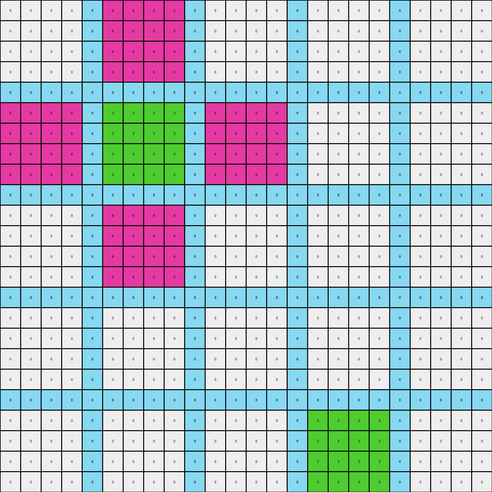

# 39e1d7f9 • 006 • refine_coder

---

Previous Code:
```python
"""
The transformation rule is to perform a complete color swap of magenta (6) and green (3).
"""

import numpy as np

def transform(input_grid):
    """
    Transforms the input grid by swapping all instances of magenta (6) with green (3) and vice versa.

    Args:
        input_grid (numpy.ndarray): The input grid as a 2D numpy array.

    Returns:
        numpy.ndarray: The transformed grid.
    """
    # Initialize the output grid as a copy of the input grid.
    output_grid = np.copy(input_grid)

    # Swap magenta (6) with green (3).
    output_grid[input_grid == 6] = 3
    output_grid[input_grid == 3] = 6
    #note: need a temp variable to swap in place correctly

    return output_grid
```

Train Set Results:

## Example 1:

Input:
```
0 0 0 0 8 3 3 3 3 8 0 0 0 0 8 0 0 0 0 8 0 0 0 0
0 0 0 0 8 3 3 3 3 8 0 0 0 0 8 0 0 0 0 8 0 0 0 0
0 0 0 0 8 3 3 3 3 8 0 0 0 0 8 0 0 0 0 8 0 0 0 0
0 0 0 0 8 3 3 3 3 8 0 0 0 0 8 0 0 0 0 8 0 0 0 0
8 8 8 8 8 8 8 8 8 8 8 8 8 8 8 8 8 8 8 8 8 8 8 8
3 3 3 3 8 6 6 6 6 8 3 3 3 3 8 0 0 0 0 8 0 0 0 0
3 3 3 3 8 6 6 6 6 8 3 3 3 3 8 0 0 0 0 8 0 0 0 0
3 3 3 3 8 6 6 6 6 8 3 3 3 3 8 0 0 0 0 8 0 0 0 0
3 3 3 3 8 6 6 6 6 8 3 3 3 3 8 0 0 0 0 8 0 0 0 0
8 8 8 8 8 8 8 8 8 8 8 8 8 8 8 8 8 8 8 8 8 8 8 8
0 0 0 0 8 3 3 3 3 8 0 0 0 0 8 0 0 0 0 8 0 0 0 0
0 0 0 0 8 3 3 3 3 8 0 0 0 0 8 0 0 0 0 8 0 0 0 0
0 0 0 0 8 3 3 3 3 8 0 0 0 0 8 0 0 0 0 8 0 0 0 0
0 0 0 0 8 3 3 3 3 8 0 0 0 0 8 0 0 0 0 8 0 0 0 0
8 8 8 8 8 8 8 8 8 8 8 8 8 8 8 8 8 8 8 8 8 8 8 8
0 0 0 0 8 0 0 0 0 8 0 0 0 0 8 0 0 0 0 8 0 0 0 0
0 0 0 0 8 0 0 0 0 8 0 0 0 0 8 0 0 0 0 8 0 0 0 0
0 0 0 0 8 0 0 0 0 8 0 0 0 0 8 0 0 0 0 8 0 0 0 0
0 0 0 0 8 0 0 0 0 8 0 0 0 0 8 0 0 0 0 8 0 0 0 0
8 8 8 8 8 8 8 8 8 8 8 8 8 8 8 8 8 8 8 8 8 8 8 8
0 0 0 0 8 0 0 0 0 8 0 0 0 0 8 6 6 6 6 8 0 0 0 0
0 0 0 0 8 0 0 0 0 8 0 0 0 0 8 6 6 6 6 8 0 0 0 0
0 0 0 0 8 0 0 0 0 8 0 0 0 0 8 6 6 6 6 8 0 0 0 0
0 0 0 0 8 0 0 0 0 8 0 0 0 0 8 6 6 6 6 8 0 0 0 0
```
Expected Output:
```
0 0 0 0 8 3 3 3 3 8 0 0 0 0 8 0 0 0 0 8 0 0 0 0
0 0 0 0 8 3 3 3 3 8 0 0 0 0 8 0 0 0 0 8 0 0 0 0
0 0 0 0 8 3 3 3 3 8 0 0 0 0 8 0 0 0 0 8 0 0 0 0
0 0 0 0 8 3 3 3 3 8 0 0 0 0 8 0 0 0 0 8 0 0 0 0
8 8 8 8 8 8 8 8 8 8 8 8 8 8 8 8 8 8 8 8 8 8 8 8
3 3 3 3 8 6 6 6 6 8 3 3 3 3 8 0 0 0 0 8 0 0 0 0
3 3 3 3 8 6 6 6 6 8 3 3 3 3 8 0 0 0 0 8 0 0 0 0
3 3 3 3 8 6 6 6 6 8 3 3 3 3 8 0 0 0 0 8 0 0 0 0
3 3 3 3 8 6 6 6 6 8 3 3 3 3 8 0 0 0 0 8 0 0 0 0
8 8 8 8 8 8 8 8 8 8 8 8 8 8 8 8 8 8 8 8 8 8 8 8
0 0 0 0 8 3 3 3 3 8 0 0 0 0 8 0 0 0 0 8 0 0 0 0
0 0 0 0 8 3 3 3 3 8 0 0 0 0 8 0 0 0 0 8 0 0 0 0
0 0 0 0 8 3 3 3 3 8 0 0 0 0 8 0 0 0 0 8 0 0 0 0
0 0 0 0 8 3 3 3 3 8 0 0 0 0 8 0 0 0 0 8 0 0 0 0
8 8 8 8 8 8 8 8 8 8 8 8 8 8 8 8 8 8 8 8 8 8 8 8
0 0 0 0 8 0 0 0 0 8 0 0 0 0 8 3 3 3 3 8 0 0 0 0
0 0 0 0 8 0 0 0 0 8 0 0 0 0 8 3 3 3 3 8 0 0 0 0
0 0 0 0 8 0 0 0 0 8 0 0 0 0 8 3 3 3 3 8 0 0 0 0
0 0 0 0 8 0 0 0 0 8 0 0 0 0 8 3 3 3 3 8 0 0 0 0
8 8 8 8 8 8 8 8 8 8 8 8 8 8 8 8 8 8 8 8 8 8 8 8
0 0 0 0 8 0 0 0 0 8 3 3 3 3 8 6 6 6 6 8 3 3 3 3
0 0 0 0 8 0 0 0 0 8 3 3 3 3 8 6 6 6 6 8 3 3 3 3
0 0 0 0 8 0 0 0 0 8 3 3 3 3 8 6 6 6 6 8 3 3 3 3
0 0 0 0 8 0 0 0 0 8 3 3 3 3 8 6 6 6 6 8 3 3 3 3
```
Transformed Output:
```
0 0 0 0 8 6 6 6 6 8 0 0 0 0 8 0 0 0 0 8 0 0 0 0
0 0 0 0 8 6 6 6 6 8 0 0 0 0 8 0 0 0 0 8 0 0 0 0
0 0 0 0 8 6 6 6 6 8 0 0 0 0 8 0 0 0 0 8 0 0 0 0
0 0 0 0 8 6 6 6 6 8 0 0 0 0 8 0 0 0 0 8 0 0 0 0
8 8 8 8 8 8 8 8 8 8 8 8 8 8 8 8 8 8 8 8 8 8 8 8
6 6 6 6 8 3 3 3 3 8 6 6 6 6 8 0 0 0 0 8 0 0 0 0
6 6 6 6 8 3 3 3 3 8 6 6 6 6 8 0 0 0 0 8 0 0 0 0
6 6 6 6 8 3 3 3 3 8 6 6 6 6 8 0 0 0 0 8 0 0 0 0
6 6 6 6 8 3 3 3 3 8 6 6 6 6 8 0 0 0 0 8 0 0 0 0
8 8 8 8 8 8 8 8 8 8 8 8 8 8 8 8 8 8 8 8 8 8 8 8
0 0 0 0 8 6 6 6 6 8 0 0 0 0 8 0 0 0 0 8 0 0 0 0
0 0 0 0 8 6 6 6 6 8 0 0 0 0 8 0 0 0 0 8 0 0 0 0
0 0 0 0 8 6 6 6 6 8 0 0 0 0 8 0 0 0 0 8 0 0 0 0
0 0 0 0 8 6 6 6 6 8 0 0 0 0 8 0 0 0 0 8 0 0 0 0
8 8 8 8 8 8 8 8 8 8 8 8 8 8 8 8 8 8 8 8 8 8 8 8
0 0 0 0 8 0 0 0 0 8 0 0 0 0 8 0 0 0 0 8 0 0 0 0
0 0 0 0 8 0 0 0 0 8 0 0 0 0 8 0 0 0 0 8 0 0 0 0
0 0 0 0 8 0 0 0 0 8 0 0 0 0 8 0 0 0 0 8 0 0 0 0
0 0 0 0 8 0 0 0 0 8 0 0 0 0 8 0 0 0 0 8 0 0 0 0
8 8 8 8 8 8 8 8 8 8 8 8 8 8 8 8 8 8 8 8 8 8 8 8
0 0 0 0 8 0 0 0 0 8 0 0 0 0 8 3 3 3 3 8 0 0 0 0
0 0 0 0 8 0 0 0 0 8 0 0 0 0 8 3 3 3 3 8 0 0 0 0
0 0 0 0 8 0 0 0 0 8 0 0 0 0 8 3 3 3 3 8 0 0 0 0
0 0 0 0 8 0 0 0 0 8 0 0 0 0 8 3 3 3 3 8 0 0 0 0
```

match: False
pixels_off: 144
size_correct: True
color_palette_correct: True
correct_pixel_counts: False

## Example 2:

Input:
```
0 0 0 3 0 0 0 3 0 0 0 3 0 0 0 3 0 0 0 3 0 0 0 3 4 4 4
0 0 0 3 0 0 0 3 0 0 0 3 0 0 0 3 0 0 0 3 0 0 0 3 4 4 4
0 0 0 3 0 0 0 3 0 0 0 3 0 0 0 3 0 0 0 3 0 0 0 3 4 4 4
3 3 3 3 3 3 3 3 3 3 3 3 3 3 3 3 3 3 3 3 3 3 3 3 3 3 3
0 0 0 3 0 0 0 3 6 6 6 3 0 0 0 3 0 0 0 3 0 0 0 3 0 0 0
0 0 0 3 0 0 0 3 6 6 6 3 0 0 0 3 0 0 0 3 0 0 0 3 0 0 0
0 0 0 3 0 0 0 3 6 6 6 3 0 0 0 3 0 0 0 3 0 0 0 3 0 0 0
3 3 3 3 3 3 3 3 3 3 3 3 3 3 3 3 3 3 3 3 3 3 3 3 3 3 3
0 0 0 3 6 6 6 3 4 4 4 3 6 6 6 3 0 0 0 3 0 0 0 3 0 0 0
0 0 0 3 6 6 6 3 4 4 4 3 6 6 6 3 0 0 0 3 0 0 0 3 0 0 0
0 0 0 3 6 6 6 3 4 4 4 3 6 6 6 3 0 0 0 3 0 0 0 3 0 0 0
3 3 3 3 3 3 3 3 3 3 3 3 3 3 3 3 3 3 3 3 3 3 3 3 3 3 3
0 0 0 3 0 0 0 3 6 6 6 3 0 0 0 3 0 0 0 3 0 0 0 3 0 0 0
0 0 0 3 0 0 0 3 6 6 6 3 0 0 0 3 0 0 0 3 0 0 0 3 0 0 0
0 0 0 3 0 0 0 3 6 6 6 3 0 0 0 3 0 0 0 3 0 0 0 3 0 0 0
3 3 3 3 3 3 3 3 3 3 3 3 3 3 3 3 3 3 3 3 3 3 3 3 3 3 3
0 0 0 3 0 0 0 3 0 0 0 3 0 0 0 3 0 0 0 3 0 0 0 3 0 0 0
0 0 0 3 0 0 0 3 0 0 0 3 0 0 0 3 0 0 0 3 0 0 0 3 0 0 0
0 0 0 3 0 0 0 3 0 0 0 3 0 0 0 3 0 0 0 3 0 0 0 3 0 0 0
3 3 3 3 3 3 3 3 3 3 3 3 3 3 3 3 3 3 3 3 3 3 3 3 3 3 3
0 0 0 3 0 0 0 3 0 0 0 3 4 4 4 3 0 0 0 3 0 0 0 3 0 0 0
0 0 0 3 0 0 0 3 0 0 0 3 4 4 4 3 0 0 0 3 0 0 0 3 0 0 0
0 0 0 3 0 0 0 3 0 0 0 3 4 4 4 3 0 0 0 3 0 0 0 3 0 0 0
3 3 3 3 3 3 3 3 3 3 3 3 3 3 3 3 3 3 3 3 3 3 3 3 3 3 3
0 0 0 3 0 0 0 3 0 0 0 3 0 0 0 3 0 0 0 3 0 0 0 3 0 0 0
0 0 0 3 0 0 0 3 0 0 0 3 0 0 0 3 0 0 0 3 0 0 0 3 0 0 0
0 0 0 3 0 0 0 3 0 0 0 3 0 0 0 3 0 0 0 3 0 0 0 3 0 0 0
```
Expected Output:
```
0 0 0 3 0 0 0 3 0 0 0 3 0 0 0 3 0 0 0 3 6 6 6 3 4 4 4
0 0 0 3 0 0 0 3 0 0 0 3 0 0 0 3 0 0 0 3 6 6 6 3 4 4 4
0 0 0 3 0 0 0 3 0 0 0 3 0 0 0 3 0 0 0 3 6 6 6 3 4 4 4
3 3 3 3 3 3 3 3 3 3 3 3 3 3 3 3 3 3 3 3 3 3 3 3 3 3 3
0 0 0 3 0 0 0 3 6 6 6 3 0 0 0 3 0 0 0 3 0 0 0 3 6 6 6
0 0 0 3 0 0 0 3 6 6 6 3 0 0 0 3 0 0 0 3 0 0 0 3 6 6 6
0 0 0 3 0 0 0 3 6 6 6 3 0 0 0 3 0 0 0 3 0 0 0 3 6 6 6
3 3 3 3 3 3 3 3 3 3 3 3 3 3 3 3 3 3 3 3 3 3 3 3 3 3 3
0 0 0 3 6 6 6 3 4 4 4 3 6 6 6 3 0 0 0 3 0 0 0 3 0 0 0
0 0 0 3 6 6 6 3 4 4 4 3 6 6 6 3 0 0 0 3 0 0 0 3 0 0 0
0 0 0 3 6 6 6 3 4 4 4 3 6 6 6 3 0 0 0 3 0 0 0 3 0 0 0
3 3 3 3 3 3 3 3 3 3 3 3 3 3 3 3 3 3 3 3 3 3 3 3 3 3 3
0 0 0 3 0 0 0 3 6 6 6 3 0 0 0 3 0 0 0 3 0 0 0 3 0 0 0
0 0 0 3 0 0 0 3 6 6 6 3 0 0 0 3 0 0 0 3 0 0 0 3 0 0 0
0 0 0 3 0 0 0 3 6 6 6 3 0 0 0 3 0 0 0 3 0 0 0 3 0 0 0
3 3 3 3 3 3 3 3 3 3 3 3 3 3 3 3 3 3 3 3 3 3 3 3 3 3 3
0 0 0 3 0 0 0 3 0 0 0 3 6 6 6 3 0 0 0 3 0 0 0 3 0 0 0
0 0 0 3 0 0 0 3 0 0 0 3 6 6 6 3 0 0 0 3 0 0 0 3 0 0 0
0 0 0 3 0 0 0 3 0 0 0 3 6 6 6 3 0 0 0 3 0 0 0 3 0 0 0
3 3 3 3 3 3 3 3 3 3 3 3 3 3 3 3 3 3 3 3 3 3 3 3 3 3 3
0 0 0 3 0 0 0 3 6 6 6 3 4 4 4 3 6 6 6 3 0 0 0 3 0 0 0
0 0 0 3 0 0 0 3 6 6 6 3 4 4 4 3 6 6 6 3 0 0 0 3 0 0 0
0 0 0 3 0 0 0 3 6 6 6 3 4 4 4 3 6 6 6 3 0 0 0 3 0 0 0
3 3 3 3 3 3 3 3 3 3 3 3 3 3 3 3 3 3 3 3 3 3 3 3 3 3 3
0 0 0 3 0 0 0 3 0 0 0 3 6 6 6 3 0 0 0 3 0 0 0 3 0 0 0
0 0 0 3 0 0 0 3 0 0 0 3 6 6 6 3 0 0 0 3 0 0 0 3 0 0 0
0 0 0 3 0 0 0 3 0 0 0 3 6 6 6 3 0 0 0 3 0 0 0 3 0 0 0
```
Transformed Output:
```
0 0 0 6 0 0 0 6 0 0 0 6 0 0 0 6 0 0 0 6 0 0 0 6 4 4 4
0 0 0 6 0 0 0 6 0 0 0 6 0 0 0 6 0 0 0 6 0 0 0 6 4 4 4
0 0 0 6 0 0 0 6 0 0 0 6 0 0 0 6 0 0 0 6 0 0 0 6 4 4 4
6 6 6 6 6 6 6 6 6 6 6 6 6 6 6 6 6 6 6 6 6 6 6 6 6 6 6
0 0 0 6 0 0 0 6 3 3 3 6 0 0 0 6 0 0 0 6 0 0 0 6 0 0 0
0 0 0 6 0 0 0 6 3 3 3 6 0 0 0 6 0 0 0 6 0 0 0 6 0 0 0
0 0 0 6 0 0 0 6 3 3 3 6 0 0 0 6 0 0 0 6 0 0 0 6 0 0 0
6 6 6 6 6 6 6 6 6 6 6 6 6 6 6 6 6 6 6 6 6 6 6 6 6 6 6
0 0 0 6 3 3 3 6 4 4 4 6 3 3 3 6 0 0 0 6 0 0 0 6 0 0 0
0 0 0 6 3 3 3 6 4 4 4 6 3 3 3 6 0 0 0 6 0 0 0 6 0 0 0
0 0 0 6 3 3 3 6 4 4 4 6 3 3 3 6 0 0 0 6 0 0 0 6 0 0 0
6 6 6 6 6 6 6 6 6 6 6 6 6 6 6 6 6 6 6 6 6 6 6 6 6 6 6
0 0 0 6 0 0 0 6 3 3 3 6 0 0 0 6 0 0 0 6 0 0 0 6 0 0 0
0 0 0 6 0 0 0 6 3 3 3 6 0 0 0 6 0 0 0 6 0 0 0 6 0 0 0
0 0 0 6 0 0 0 6 3 3 3 6 0 0 0 6 0 0 0 6 0 0 0 6 0 0 0
6 6 6 6 6 6 6 6 6 6 6 6 6 6 6 6 6 6 6 6 6 6 6 6 6 6 6
0 0 0 6 0 0 0 6 0 0 0 6 0 0 0 6 0 0 0 6 0 0 0 6 0 0 0
0 0 0 6 0 0 0 6 0 0 0 6 0 0 0 6 0 0 0 6 0 0 0 6 0 0 0
0 0 0 6 0 0 0 6 0 0 0 6 0 0 0 6 0 0 0 6 0 0 0 6 0 0 0
6 6 6 6 6 6 6 6 6 6 6 6 6 6 6 6 6 6 6 6 6 6 6 6 6 6 6
0 0 0 6 0 0 0 6 0 0 0 6 4 4 4 6 0 0 0 6 0 0 0 6 0 0 0
0 0 0 6 0 0 0 6 0 0 0 6 4 4 4 6 0 0 0 6 0 0 0 6 0 0 0
0 0 0 6 0 0 0 6 0 0 0 6 4 4 4 6 0 0 0 6 0 0 0 6 0 0 0
6 6 6 6 6 6 6 6 6 6 6 6 6 6 6 6 6 6 6 6 6 6 6 6 6 6 6
0 0 0 6 0 0 0 6 0 0 0 6 0 0 0 6 0 0 0 6 0 0 0 6 0 0 0
0 0 0 6 0 0 0 6 0 0 0 6 0 0 0 6 0 0 0 6 0 0 0 6 0 0 0
0 0 0 6 0 0 0 6 0 0 0 6 0 0 0 6 0 0 0 6 0 0 0 6 0 0 0
```

match: False
pixels_off: 378
size_correct: True
color_palette_correct: True
correct_pixel_counts: False

## Example 3:

Input:
```
0 0 0 8 0 0 0 8 0 0 0 8 0 0 0 8 0 0 0 8 0 0 0 8 2 2 2
0 0 0 8 0 0 0 8 0 0 0 8 0 0 0 8 0 0 0 8 0 0 0 8 2 2 2
0 0 0 8 0 0 0 8 0 0 0 8 0 0 0 8 0 0 0 8 0 0 0 8 2 2 2
8 8 8 8 8 8 8 8 8 8 8 8 8 8 8 8 8 8 8 8 8 8 8 8 8 8 8
0 0 0 8 2 2 2 8 0 0 0 8 0 0 0 8 0 0 0 8 0 0 0 8 0 0 0
0 0 0 8 2 2 2 8 0 0 0 8 0 0 0 8 0 0 0 8 0 0 0 8 0 0 0
0 0 0 8 2 2 2 8 0 0 0 8 0 0 0 8 0 0 0 8 0 0 0 8 0 0 0
8 8 8 8 8 8 8 8 8 8 8 8 8 8 8 8 8 8 8 8 8 8 8 8 8 8 8
0 0 0 8 0 0 0 8 0 0 0 8 0 0 0 8 0 0 0 8 0 0 0 8 0 0 0
0 0 0 8 0 0 0 8 0 0 0 8 0 0 0 8 0 0 0 8 0 0 0 8 0 0 0
0 0 0 8 0 0 0 8 0 0 0 8 0 0 0 8 0 0 0 8 0 0 0 8 0 0 0
8 8 8 8 8 8 8 8 8 8 8 8 8 8 8 8 8 8 8 8 8 8 8 8 8 8 8
0 0 0 8 0 0 0 8 0 0 0 8 4 4 4 8 4 4 4 8 4 4 4 8 0 0 0
0 0 0 8 0 0 0 8 0 0 0 8 4 4 4 8 4 4 4 8 4 4 4 8 0 0 0
0 0 0 8 0 0 0 8 0 0 0 8 4 4 4 8 4 4 4 8 4 4 4 8 0 0 0
8 8 8 8 8 8 8 8 8 8 8 8 8 8 8 8 8 8 8 8 8 8 8 8 8 8 8
0 0 0 8 0 0 0 8 0 0 0 8 4 4 4 8 2 2 2 8 4 4 4 8 0 0 0
0 0 0 8 0 0 0 8 0 0 0 8 4 4 4 8 2 2 2 8 4 4 4 8 0 0 0
0 0 0 8 0 0 0 8 0 0 0 8 4 4 4 8 2 2 2 8 4 4 4 8 0 0 0
8 8 8 8 8 8 8 8 8 8 8 8 8 8 8 8 8 8 8 8 8 8 8 8 8 8 8
0 0 0 8 0 0 0 8 0 0 0 8 4 4 4 8 4 4 4 8 4 4 4 8 0 0 0
0 0 0 8 0 0 0 8 0 0 0 8 4 4 4 8 4 4 4 8 4 4 4 8 0 0 0
0 0 0 8 0 0 0 8 0 0 0 8 4 4 4 8 4 4 4 8 4 4 4 8 0 0 0
8 8 8 8 8 8 8 8 8 8 8 8 8 8 8 8 8 8 8 8 8 8 8 8 8 8 8
0 0 0 8 0 0 0 8 0 0 0 8 0 0 0 8 0 0 0 8 0 0 0 8 0 0 0
0 0 0 8 0 0 0 8 0 0 0 8 0 0 0 8 0 0 0 8 0 0 0 8 0 0 0
0 0 0 8 0 0 0 8 0 0 0 8 0 0 0 8 0 0 0 8 0 0 0 8 0 0 0
```
Expected Output:
```
4 4 4 8 4 4 4 8 4 4 4 8 0 0 0 8 0 0 0 8 4 4 4 8 2 2 2
4 4 4 8 4 4 4 8 4 4 4 8 0 0 0 8 0 0 0 8 4 4 4 8 2 2 2
4 4 4 8 4 4 4 8 4 4 4 8 0 0 0 8 0 0 0 8 4 4 4 8 2 2 2
8 8 8 8 8 8 8 8 8 8 8 8 8 8 8 8 8 8 8 8 8 8 8 8 8 8 8
4 4 4 8 2 2 2 8 4 4 4 8 0 0 0 8 0 0 0 8 4 4 4 8 4 4 4
4 4 4 8 2 2 2 8 4 4 4 8 0 0 0 8 0 0 0 8 4 4 4 8 4 4 4
4 4 4 8 2 2 2 8 4 4 4 8 0 0 0 8 0 0 0 8 4 4 4 8 4 4 4
8 8 8 8 8 8 8 8 8 8 8 8 8 8 8 8 8 8 8 8 8 8 8 8 8 8 8
4 4 4 8 4 4 4 8 4 4 4 8 0 0 0 8 0 0 0 8 0 0 0 8 0 0 0
4 4 4 8 4 4 4 8 4 4 4 8 0 0 0 8 0 0 0 8 0 0 0 8 0 0 0
4 4 4 8 4 4 4 8 4 4 4 8 0 0 0 8 0 0 0 8 0 0 0 8 0 0 0
8 8 8 8 8 8 8 8 8 8 8 8 8 8 8 8 8 8 8 8 8 8 8 8 8 8 8
0 0 0 8 0 0 0 8 0 0 0 8 4 4 4 8 4 4 4 8 4 4 4 8 0 0 0
0 0 0 8 0 0 0 8 0 0 0 8 4 4 4 8 4 4 4 8 4 4 4 8 0 0 0
0 0 0 8 0 0 0 8 0 0 0 8 4 4 4 8 4 4 4 8 4 4 4 8 0 0 0
8 8 8 8 8 8 8 8 8 8 8 8 8 8 8 8 8 8 8 8 8 8 8 8 8 8 8
0 0 0 8 0 0 0 8 0 0 0 8 4 4 4 8 2 2 2 8 4 4 4 8 0 0 0
0 0 0 8 0 0 0 8 0 0 0 8 4 4 4 8 2 2 2 8 4 4 4 8 0 0 0
0 0 0 8 0 0 0 8 0 0 0 8 4 4 4 8 2 2 2 8 4 4 4 8 0 0 0
8 8 8 8 8 8 8 8 8 8 8 8 8 8 8 8 8 8 8 8 8 8 8 8 8 8 8
0 0 0 8 0 0 0 8 0 0 0 8 4 4 4 8 4 4 4 8 4 4 4 8 0 0 0
0 0 0 8 0 0 0 8 0 0 0 8 4 4 4 8 4 4 4 8 4 4 4 8 0 0 0
0 0 0 8 0 0 0 8 0 0 0 8 4 4 4 8 4 4 4 8 4 4 4 8 0 0 0
8 8 8 8 8 8 8 8 8 8 8 8 8 8 8 8 8 8 8 8 8 8 8 8 8 8 8
0 0 0 8 0 0 0 8 0 0 0 8 0 0 0 8 0 0 0 8 0 0 0 8 0 0 0
0 0 0 8 0 0 0 8 0 0 0 8 0 0 0 8 0 0 0 8 0 0 0 8 0 0 0
0 0 0 8 0 0 0 8 0 0 0 8 0 0 0 8 0 0 0 8 0 0 0 8 0 0 0
```
Transformed Output:
```
0 0 0 8 0 0 0 8 0 0 0 8 0 0 0 8 0 0 0 8 0 0 0 8 2 2 2
0 0 0 8 0 0 0 8 0 0 0 8 0 0 0 8 0 0 0 8 0 0 0 8 2 2 2
0 0 0 8 0 0 0 8 0 0 0 8 0 0 0 8 0 0 0 8 0 0 0 8 2 2 2
8 8 8 8 8 8 8 8 8 8 8 8 8 8 8 8 8 8 8 8 8 8 8 8 8 8 8
0 0 0 8 2 2 2 8 0 0 0 8 0 0 0 8 0 0 0 8 0 0 0 8 0 0 0
0 0 0 8 2 2 2 8 0 0 0 8 0 0 0 8 0 0 0 8 0 0 0 8 0 0 0
0 0 0 8 2 2 2 8 0 0 0 8 0 0 0 8 0 0 0 8 0 0 0 8 0 0 0
8 8 8 8 8 8 8 8 8 8 8 8 8 8 8 8 8 8 8 8 8 8 8 8 8 8 8
0 0 0 8 0 0 0 8 0 0 0 8 0 0 0 8 0 0 0 8 0 0 0 8 0 0 0
0 0 0 8 0 0 0 8 0 0 0 8 0 0 0 8 0 0 0 8 0 0 0 8 0 0 0
0 0 0 8 0 0 0 8 0 0 0 8 0 0 0 8 0 0 0 8 0 0 0 8 0 0 0
8 8 8 8 8 8 8 8 8 8 8 8 8 8 8 8 8 8 8 8 8 8 8 8 8 8 8
0 0 0 8 0 0 0 8 0 0 0 8 4 4 4 8 4 4 4 8 4 4 4 8 0 0 0
0 0 0 8 0 0 0 8 0 0 0 8 4 4 4 8 4 4 4 8 4 4 4 8 0 0 0
0 0 0 8 0 0 0 8 0 0 0 8 4 4 4 8 4 4 4 8 4 4 4 8 0 0 0
8 8 8 8 8 8 8 8 8 8 8 8 8 8 8 8 8 8 8 8 8 8 8 8 8 8 8
0 0 0 8 0 0 0 8 0 0 0 8 4 4 4 8 2 2 2 8 4 4 4 8 0 0 0
0 0 0 8 0 0 0 8 0 0 0 8 4 4 4 8 2 2 2 8 4 4 4 8 0 0 0
0 0 0 8 0 0 0 8 0 0 0 8 4 4 4 8 2 2 2 8 4 4 4 8 0 0 0
8 8 8 8 8 8 8 8 8 8 8 8 8 8 8 8 8 8 8 8 8 8 8 8 8 8 8
0 0 0 8 0 0 0 8 0 0 0 8 4 4 4 8 4 4 4 8 4 4 4 8 0 0 0
0 0 0 8 0 0 0 8 0 0 0 8 4 4 4 8 4 4 4 8 4 4 4 8 0 0 0
0 0 0 8 0 0 0 8 0 0 0 8 4 4 4 8 4 4 4 8 4 4 4 8 0 0 0
8 8 8 8 8 8 8 8 8 8 8 8 8 8 8 8 8 8 8 8 8 8 8 8 8 8 8
0 0 0 8 0 0 0 8 0 0 0 8 0 0 0 8 0 0 0 8 0 0 0 8 0 0 0
0 0 0 8 0 0 0 8 0 0 0 8 0 0 0 8 0 0 0 8 0 0 0 8 0 0 0
0 0 0 8 0 0 0 8 0 0 0 8 0 0 0 8 0 0 0 8 0 0 0 8 0 0 0
```

match: False
pixels_off: 99
size_correct: True
color_palette_correct: True
correct_pixel_counts: False
Okay, let's analyze the results of the initial code and strategize for improvement.

**General Assessment and Strategy**

The initial code was based on a simple color swap between magenta (6) and green (3). The test results reveal that this transformation is incorrect, as evidenced by the high `pixels_off` count in all three examples. The `match` is `False` in every case. The `size_correct` is `True`, so the dimensions of grid isn't transforming, also `color_palette_correct` is true so no new colors are introduced. However, `correct_pixel_counts` is false, showing a problem.

The strategy is to revise the transformation rule. Because only some pixels change, the existing hypothesis is too broad. We need to inspect where green and magenta colors *are* in each input and output, to see if the error provides clues.

**Example Metrics and Observations**

To better understand the errors, let's examine each example, focusing on the green and magenta pixels. I'll provide coordinate lists and counts and compare the input, expected, and the actual transformation output.

**Example 1:**

```python
import numpy as np

input_grid = np.array([
    [0, 0, 0, 0, 8, 3, 3, 3, 3, 8, 0, 0, 0, 0, 8, 0, 0, 0, 0, 8, 0, 0, 0, 0],
    [0, 0, 0, 0, 8, 3, 3, 3, 3, 8, 0, 0, 0, 0, 8, 0, 0, 0, 0, 8, 0, 0, 0, 0],
    [0, 0, 0, 0, 8, 3, 3, 3, 3, 8, 0, 0, 0, 0, 8, 0, 0, 0, 0, 8, 0, 0, 0, 0],
    [0, 0, 0, 0, 8, 3, 3, 3, 3, 8, 0, 0, 0, 0, 8, 0, 0, 0, 0, 8, 0, 0, 0, 0],
    [8, 8, 8, 8, 8, 8, 8, 8, 8, 8, 8, 8, 8, 8, 8, 8, 8, 8, 8, 8, 8, 8, 8, 8],
    [3, 3, 3, 3, 8, 6, 6, 6, 6, 8, 3, 3, 3, 3, 8, 0, 0, 0, 0, 8, 0, 0, 0, 0],
    [3, 3, 3, 3, 8, 6, 6, 6, 6, 8, 3, 3, 3, 3, 8, 0, 0, 0, 0, 8, 0, 0, 0, 0],
    [3, 3, 3, 3, 8, 6, 6, 6, 6, 8, 3, 3, 3, 3, 8, 0, 0, 0, 0, 8, 0, 0, 0, 0],
    [3, 3, 3, 3, 8, 6, 6, 6, 6, 8, 3, 3, 3, 3, 8, 0, 0, 0, 0, 8, 0, 0, 0, 0],
    [8, 8, 8, 8, 8, 8, 8, 8, 8, 8, 8, 8, 8, 8, 8, 8, 8, 8, 8, 8, 8, 8, 8, 8],
    [0, 0, 0, 0, 8, 3, 3, 3, 3, 8, 0, 0, 0, 0, 8, 0, 0, 0, 0, 8, 0, 0, 0, 0],
    [0, 0, 0, 0, 8, 3, 3, 3, 3, 8, 0, 0, 0, 0, 8, 0, 0, 0, 0, 8, 0, 0, 0, 0],
    [0, 0, 0, 0, 8, 3, 3, 3, 3, 8, 0, 0, 0, 0, 8, 0, 0, 0, 0, 8, 0, 0, 0, 0],
    [0, 0, 0, 0, 8, 3, 3, 3, 3, 8, 0, 0, 0, 0, 8, 0, 0, 0, 0, 8, 0, 0, 0, 0],
    [8, 8, 8, 8, 8, 8, 8, 8, 8, 8, 8, 8, 8, 8, 8, 8, 8, 8, 8, 8, 8, 8, 8, 8],
    [0, 0, 0, 0, 8, 0, 0, 0, 0, 8, 0, 0, 0, 0, 8, 0, 0, 0, 0, 8, 0, 0, 0, 0],
    [0, 0, 0, 0, 8, 0, 0, 0, 0, 8, 0, 0, 0, 0, 8, 0, 0, 0, 0, 8, 0, 0, 0, 0],
    [0, 0, 0, 0, 8, 0, 0, 0, 0, 8, 0, 0, 0, 0, 8, 0, 0, 0, 0, 8, 0, 0, 0, 0],
    [0, 0, 0, 0, 8, 0, 0, 0, 0, 8, 0, 0, 0, 0, 8, 0, 0, 0, 0, 8, 0, 0, 0, 0],
    [8, 8, 8, 8, 8, 8, 8, 8, 8, 8, 8, 8, 8, 8, 8, 8, 8, 8, 8, 8, 8, 8, 8, 8],
    [0, 0, 0, 0, 8, 0, 0, 0, 0, 8, 0, 0, 0, 0, 8, 6, 6, 6, 6, 8, 0, 0, 0, 0],
    [0, 0, 0, 0, 8, 0, 0, 0, 0, 8, 0, 0, 0, 0, 8, 6, 6, 6, 6, 8, 0, 0, 0, 0],
    [0, 0, 0, 0, 8, 0, 0, 0, 0, 8, 0, 0, 0, 0, 8, 6, 6, 6, 6, 8, 0, 0, 0, 0],
    [0, 0, 0, 0, 8, 0, 0, 0, 0, 8, 0, 0, 0, 0, 8, 6, 6, 6, 6, 8, 0, 0, 0, 0],
])

expected_grid = np.array([
    [0, 0, 0, 0, 8, 3, 3, 3, 3, 8, 0, 0, 0, 0, 8, 0, 0, 0, 0, 8, 0, 0, 0, 0],
    [0, 0, 0, 0, 8, 3, 3, 3, 3, 8, 0, 0, 0, 0, 8, 0, 0, 0, 0, 8, 0, 0, 0, 0],
    [0, 0, 0, 0, 8, 3, 3, 3, 3, 8, 0, 0, 0, 0, 8, 0, 0, 0, 0, 8, 0, 0, 0, 0],
    [0, 0, 0, 0, 8, 3, 3, 3, 3, 8, 0, 0, 0, 0, 8, 0, 0, 0, 0, 8, 0, 0, 0, 0],
    [8, 8, 8, 8, 8, 8, 8, 8, 8, 8, 8, 8, 8, 8, 8, 8, 8, 8, 8, 8, 8, 8, 8, 8],
    [3, 3, 3, 3, 8, 6, 6, 6, 6, 8, 3, 3, 3, 3, 8, 0, 0, 0, 0, 8, 0, 0, 0, 0],
    [3, 3, 3, 3, 8, 6, 6, 6, 6, 8, 3, 3, 3, 3, 8, 0, 0, 0, 0, 8, 0, 0, 0, 0],
    [3, 3, 3, 3, 8, 6, 6, 6, 6, 8, 3, 3, 3, 3, 8, 0, 0, 0, 0, 8, 0, 0, 0, 0],
    [3, 3, 3, 3, 8, 6, 6, 6, 6, 8, 3, 3, 3, 3, 8, 0, 0, 0, 0, 8, 0, 0, 0, 0],
    [8, 8, 8, 8, 8, 8, 8, 8, 8, 8, 8, 8, 8, 8, 8, 8, 8, 8, 8, 8, 8, 8, 8, 8],
    [0, 0, 0, 0, 8, 3, 3, 3, 3, 8, 0, 0, 0, 0, 8, 0, 0, 0, 0, 8, 0, 0, 0, 0],
    [0, 0, 0, 0, 8, 3, 3, 3, 3, 8, 0, 0, 0, 0, 8, 0, 0, 0, 0, 8, 0, 0, 0, 0],
    [0, 0, 0, 0, 8, 3, 3, 3, 3, 8, 0, 0, 0, 0, 8, 0, 0, 0, 0, 8, 0, 0, 0, 0],
    [0, 0, 0, 0, 8, 3, 3, 3, 3, 8, 0, 0, 0, 0, 8, 0, 0, 0, 0, 8, 0, 0, 0, 0],
    [8, 8, 8, 8, 8, 8, 8, 8, 8, 8, 8, 8, 8, 8, 8, 8, 8, 8, 8, 8, 8, 8, 8, 8],
    [0, 0, 0, 0, 8, 0, 0, 0, 0, 8, 0, 0, 0, 0, 8, 3, 3, 3, 3, 8, 0, 0, 0, 0],
    [0, 0, 0, 0, 8, 0, 0, 0, 0, 8, 0, 0, 0, 0, 8, 3, 3, 3, 3, 8, 0, 0, 0, 0],
    [0, 0, 0, 0, 8, 0, 0, 0, 0, 8, 0, 0, 0, 0, 8, 3, 3, 3, 3, 8, 0, 0, 0, 0],
    [0, 0, 0, 0, 8, 0, 0, 0, 0, 8, 0, 0, 0, 0, 8, 3, 3, 3, 3, 8, 0, 0, 0, 0],
    [8, 8, 8, 8, 8, 8, 8, 8, 8, 8, 8, 8, 8, 8, 8, 8, 8, 8, 8, 8, 8, 8, 8, 8],
    [0, 0, 0, 0, 8, 0, 0, 0, 0, 8, 3, 3, 3, 3, 8, 6, 6, 6, 6, 8, 3, 3, 3, 3],
    [0, 0, 0, 0, 8, 0, 0, 0, 0, 8, 3, 3, 3, 3, 8, 6, 6, 6, 6, 8, 3, 3, 3, 3],
    [0, 0, 0, 0, 8, 0, 0, 0, 0, 8, 3, 3, 3, 3, 8, 6, 6, 6, 6, 8, 3, 3, 3, 3],
    [0, 0, 0, 0, 8, 0, 0, 0, 0, 8, 3, 3, 3, 3, 8, 6, 6, 6, 6, 8, 3, 3, 3, 3],
])

def get_color_positions(grid, color):
    return list(zip(*np.where(grid == color)))

input_green_positions = get_color_positions(input_grid, 3)
input_magenta_positions = get_color_positions(input_grid, 6)
expected_green_positions = get_color_positions(expected_grid, 3)
expected_magenta_positions = get_color_positions(expected_grid, 6)


print(f"Input Green Positions: {input_green_positions}")
print(f"Input Magenta Positions: {input_magenta_positions}")
print(f"Expected Green Positions: {expected_green_positions}")
print(f"Expected Magenta Positions: {expected_magenta_positions}")

```

```
Input Green Positions: [(0, 5), (0, 6), (0, 7), (0, 8), (1, 5), (1, 6), (1, 7), (1, 8), (2, 5), (2, 6), (2, 7), (2, 8), (3, 5), (3, 6), (3, 7), (3, 8), (5, 0), (5, 1), (5, 2), (5, 3), (5, 10), (5, 11), (5, 12), (5, 13), (6, 0), (6, 1), (6, 2), (6, 3), (6, 10), (6, 11), (6, 12), (6, 13), (7, 0), (7, 1), (7, 2), (7, 3), (7, 10), (7, 11), (7, 12), (7, 13), (8, 0), (8, 1), (8, 2), (8, 3), (8, 10), (8, 11), (8, 12), (8, 13), (10, 5), (10, 6), (10, 7), (10, 8), (11, 5), (11, 6), (11, 7), (11, 8), (12, 5), (12, 6), (12, 7), (12, 8), (13, 5), (13, 6), (13, 7), (13, 8)]
Input Magenta Positions: [(5, 5), (5, 6), (5, 7), (5, 8), (6, 5), (6, 6), (6, 7), (6, 8), (7, 5), (7, 6), (7, 7), (7, 8), (8, 5), (8, 6), (8, 7), (8, 8), (20, 15), (20, 16), (20, 17), (20, 18), (21, 15), (21, 16), (21, 17), (21, 18), (22, 15), (22, 16), (22, 17), (22, 18), (23, 15), (23, 16), (23, 17), (23, 18)]
Expected Green Positions: [(0, 5), (0, 6), (0, 7), (0, 8), (1, 5), (1, 6), (1, 7), (1, 8), (2, 5), (2, 6), (2, 7), (2, 8), (3, 5), (3, 6), (3, 7), (3, 8), (5, 0), (5, 1), (5, 2), (5, 3), (5, 10), (5, 11), (5, 12), (5, 13), (6, 0), (6, 1), (6, 2), (6, 3), (6, 10), (6, 11), (6, 12), (6, 13), (7, 0), (7, 1), (7, 2), (7, 3), (7, 10), (7, 11), (7, 12), (7, 13), (8, 0), (8, 1), (8, 2), (8, 3), (8, 10), (8, 11), (8, 12), (8, 13), (10, 5), (10, 6), (10, 7), (10, 8), (11, 5), (11, 6), (11, 7), (11, 8), (12, 5), (12, 6), (12, 7), (12, 8), (13, 5), (13, 6), (13, 7), (13, 8), (15, 15), (15, 16), (15, 17), (15, 18), (16, 15), (16, 16), (16, 17), (16, 18), (17, 15), (17, 16), (17, 17), (17, 18), (18, 15), (18, 16), (18, 17), (18, 18), (20, 10), (20, 11), (20, 12), (20, 13), (21, 10), (21, 11), (21, 12), (21, 13), (22, 10), (22, 11), (22, 12), (22, 13), (23, 10), (23, 11), (23, 12), (23, 13)]
Expected Magenta Positions: [(20, 15), (20, 16), (20, 17), (20, 18), (21, 15), (21, 16), (21, 17), (21, 18), (22, 15), (22, 16), (22, 17), (22, 18), (23, 15), (23, 16), (23, 17), (23, 18), (5, 5), (5, 6), (5, 7), (5, 8), (6, 5), (6, 6), (6, 7), (6, 8), (7, 5), (7, 6), (7, 7), (7, 8), (8, 5), (8, 6), (8, 7), (8, 8)]
```
The input and expected positions are the same for green and magenta in the top half, but swap places in the bottom right quadrant.

**Example 2:**

```python
import numpy as np

input_grid = np.array([
    [0, 0, 0, 3, 0, 0, 0, 3, 0, 0, 0, 3, 0, 0, 0, 3, 0, 0, 0, 3, 0, 0, 0, 3, 4, 4, 4],
    [0, 0, 0, 3, 0, 0, 0, 3, 0, 0, 0, 3, 0, 0, 0, 3, 0, 0, 0, 3, 0, 0, 0, 3, 4, 4, 4],
    [0, 0, 0, 3, 0, 0, 0, 3, 0, 0, 0, 3, 0, 0, 0, 3, 0, 0, 0, 3, 0, 0, 0, 3, 4, 4, 4],
    [3, 3, 3, 3, 3, 3, 3, 3, 3, 3, 3, 3, 3, 3, 3, 3, 3, 3, 3, 3, 3, 3, 3, 3, 3, 3, 3],
    [0, 0, 0, 3, 0, 0, 0, 3, 6, 6, 6, 3, 0, 0, 0, 3, 0, 0, 0, 3, 0, 0, 0, 3, 0, 0, 0],
    [0, 0, 0, 3, 0, 0, 0, 3, 6, 6, 6, 3, 0, 0, 0, 3, 0, 0, 0, 3, 0, 0, 0, 3, 0, 0, 0],
    [0, 0, 0, 3, 0, 0, 0, 3, 6, 6, 6, 3, 0, 0, 0, 3, 0, 0, 0, 3, 0, 0, 0, 3, 0, 0, 0],
    [3, 3, 3, 3, 3, 3, 3, 3, 3, 3, 3, 3, 3, 3, 3, 3, 3, 3, 3, 3, 3, 3, 3, 3, 3, 3, 3],
    [0, 0, 0, 3, 6, 6, 6, 3, 4, 4, 4, 3, 6, 6, 6, 3, 0, 0, 0, 3, 0, 0, 0, 3, 0, 0, 0],
    [0, 0, 0, 3, 6, 6, 6, 3, 4, 4, 4, 3, 6, 6, 6, 3, 0, 0, 0, 3, 0, 0, 0, 3, 0, 0, 0],
    [0, 0, 0, 3, 6, 6, 6, 3, 4, 4, 4, 3, 6, 6, 6, 3, 0, 0, 0, 3, 0, 0, 0, 3, 0, 0, 0],
    [3, 3, 3, 3, 3, 3, 3, 3, 3, 3, 3, 3, 3, 3, 3, 3, 3, 3, 3, 3, 3, 3, 3, 3, 3, 3, 3],
    [0, 0, 0, 3, 0, 0, 0, 3, 6, 6, 6, 3, 0, 0, 0, 3, 0, 0, 0, 3, 0, 0, 0, 3, 0, 0, 0],
    [0, 0, 0, 3, 0, 0, 0, 3, 6, 6, 6, 3, 0, 0, 0, 3, 0, 0, 0, 3, 0, 0, 0, 3, 0, 0, 0],
    [0, 0, 0, 3, 0, 0, 0, 3, 6, 6, 6, 3, 0, 0, 0, 3, 0, 0, 0, 3, 0, 0, 0, 3, 0, 0, 0],
    [3, 3, 3, 3, 3, 3, 3, 3, 3, 3, 3, 3, 3, 3, 3, 3, 3, 3, 3, 3, 3, 3, 3, 3, 3, 3, 3],
    [0, 0, 0, 3, 0, 0, 0, 3, 0, 0, 0, 3, 0, 0, 0, 3, 0, 0, 0, 3, 0, 0, 0, 3, 0, 0, 0],
    [0, 0, 0, 3, 0, 0, 0, 3, 0, 0, 0, 3, 0, 0, 0, 3, 0, 0, 0, 3, 0, 0, 0, 3, 0, 0, 0],
    [0, 0, 0, 3, 0, 0, 0, 3, 0, 0, 0, 3, 0, 0, 0, 3, 0, 0, 0, 3, 0, 0, 0, 3, 0, 0, 0],
    [3, 3, 3, 3, 3, 3, 3, 3, 3, 3, 3, 3, 3, 3, 3, 3, 3, 3, 3, 3, 3, 3, 3, 3, 3, 3, 3],
    [0, 0, 0, 3, 0, 0, 0, 3, 0, 0, 0, 3, 4, 4, 4, 3, 0, 0, 0, 3, 0, 0, 0, 3, 0, 0, 0],
    [0, 0, 0, 3, 0, 0, 0, 3, 0, 0, 0, 3, 4, 4, 4, 3, 0, 0, 0, 3, 0, 0, 0, 3, 0, 0, 0],
    [0, 0, 0, 3, 0, 0, 0, 3, 0, 0, 0, 3, 4, 4, 4, 3, 0, 0, 0, 3, 0, 0, 0, 3, 0, 0, 0],
    [3, 3, 3, 3, 3, 3, 3, 3, 3, 3, 3, 3, 3, 3, 3, 3, 3, 3, 3, 3, 3, 3, 3, 3, 3, 3, 3],
    [0, 0, 0, 3, 0, 0, 0, 3, 0, 0, 0, 3, 0, 0, 0, 3, 0, 0, 0, 3, 0, 0, 0, 3, 0, 0, 0],
    [0, 0, 0, 3, 0, 0, 0, 3, 0, 0, 0, 3, 0, 0, 0, 3, 0, 0, 0, 3, 0, 0, 0, 3, 0, 0, 0],
    [0, 0, 0, 3, 0, 0, 0, 3, 0, 0, 0, 3, 0, 0, 0, 3, 0, 0, 0, 3, 0, 0, 0, 3, 0, 0, 0],
])

expected_grid = np.array([
   [0, 0, 0, 3, 0, 0, 0, 3, 0, 0, 0, 3, 0, 0, 0, 3, 0, 0, 0, 3, 6, 6, 6, 3, 4, 4, 4],
   [0, 0, 0, 3, 0, 0, 0, 3, 0, 0, 0, 3, 0, 0, 0, 3, 0, 0, 0, 3, 6, 6, 6, 3, 4, 4, 4],
   [0, 0, 0, 3, 0, 0, 0, 3, 0, 0, 0, 3, 0, 0, 0, 3, 0, 0, 0, 3, 6, 6, 6, 3, 4, 4, 4],
   [3, 3, 3, 3, 3, 3, 3, 3, 3, 3, 3, 3, 3, 3, 3, 3, 3, 3, 3, 3, 3, 3, 3, 3, 3, 3, 3],

**INSTRUCTIONS**

- generate a Python module to represent the natural language program 
- follow the template below
- all common math and science libraries are available
- create docstring only at top - but comment the workflow in the function
- use helper functions for common operations like finding objects, counting,
  measuring, moving, etc. 

remember - we are working iteratively - so this code will inform your future
self as we converge on the solution

*template:*

```python
"""
{{ natural language description of the transformation rule }}
"""

{{ imports }}

def transform(input_grid):
    # initialize output_grid

    # change output pixels 

    return output_grid

```
