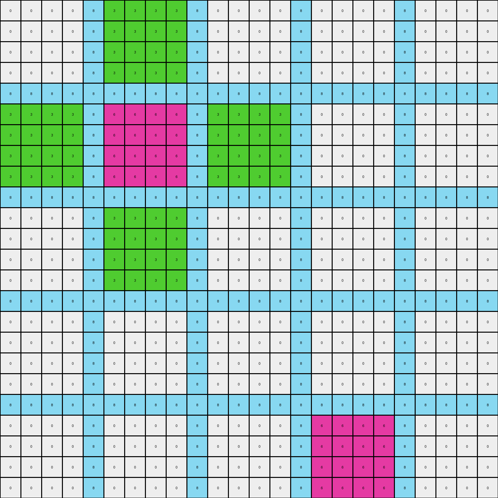
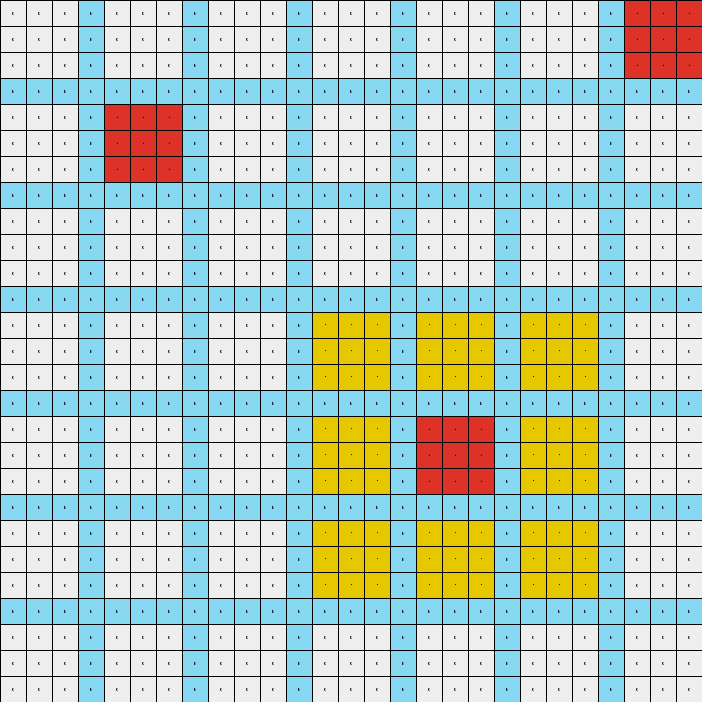

# 39e1d7f9 • 012 • refine_coder

---

Previous Code:
```python
"""
1.  **Identify Objects:** Locate all 3x3 squares of yellow (4) and magenta (6).

2.  **Calculate Relative Shifts:**  For each magenta and yellow square:
    *   Find its top-left corner coordinates in the input grid.
    *   Find a corresponding square (same color) in the expected output grid.
    *   Calculate the shift vector (row difference, column difference) between the input and output positions.

3.  **Apply Shifts:** Create a copy of the input grid as the output grid.  For each identified square (magenta and yellow):
    * Apply the calculated shift to the square in the output grid.
    * Clear the original position, we will restore it after by copying from input.

4. **Restore Surrounding Pixels**:
    + iterate through the color squares that were identified and moved.
    + determine the dimensions of an affected area.
    + copy from input grid.

"""

import numpy as np

def find_squares(grid, color):
    """Finds the top-left corner coordinates of all 3x3 squares of a given color."""
    squares = []
    rows, cols = grid.shape
    for r in range(rows - 2):
        for c in range(cols - 2):
            if np.all(grid[r:r+3, c:c+3] == color):
                squares.append((r, c))
    return squares

def apply_shift(grid, square, shift):
    """Applies a shift to a 3x3 square within a grid, handling boundary conditions."""
    rows, cols = grid.shape
    r, c = square
    dr, dc = shift
    new_r, new_c = r + dr, c + dc

    # Check if the new position is within bounds
    if 0 <= new_r <= rows - 3 and 0 <= new_c <= cols - 3:
        return (new_r, new_c)
    else:
        return None  # Or handle out-of-bounds differently, e.g., clipping


def transform(input_grid):
    # initialize output_grid
    output_grid = np.copy(input_grid)
    
    # Find objects
    magenta_squares_input = find_squares(input_grid, 6)
    yellow_squares_input = find_squares(input_grid, 4)
    
    all_squares_input = magenta_squares_input + yellow_squares_input
    
    #find the shifts
    shifts={}
    
    for square_in in all_squares_input:
      color = input_grid[square_in[0],square_in[1]]
      
      #clear original location of square in output_grid.
      output_grid[square_in[0]:square_in[0]+3, square_in[1]:square_in[1]+3] = 0

      # Find the place where to move the square.

      # calculate potential targets as positions relative to the original object
      potential_targets = []
      for r_offset in [-1,0,1]:
        for c_offset in [-1,0,1]:
            potential_targets.append((square_in[0]+r_offset,square_in[1]+c_offset))
      
      #check area around potential targets.
      for target in potential_targets:
        if(target[0] >=0 and target[0] < output_grid.shape[0] and target[1] >=0 and target[1] < output_grid.shape[1]):
            if(output_grid[target[0],target[1]] == color):
                #shift and store
                shift = (target[0]-square_in[0],target[1]-square_in[1])
                new_pos = apply_shift(output_grid,square_in,shift)
                if(new_pos != None):
                    output_grid[new_pos[0]:new_pos[0]+3, new_pos[1]:new_pos[1]+3] = color
                
    #restore area
    for square_in in all_squares_input:
       
        
        #determine affected area of the original location, 5x5
        r0 = max(0,square_in[0]-1)
        r1 = min(output_grid.shape[0],square_in[0]+3+1)
        
        c0 = max(0,square_in[1]-1)
        c1 = min(output_grid.shape[1],square_in[1]+3+1)        
        
        #restore original location
        output_grid[r0:r1, c0:c1] = input_grid[r0:r1, c0:c1]


    return output_grid
```

Train Set Results:

## Example 1:

Input:
```
0 0 0 0 8 3 3 3 3 8 0 0 0 0 8 0 0 0 0 8 0 0 0 0
0 0 0 0 8 3 3 3 3 8 0 0 0 0 8 0 0 0 0 8 0 0 0 0
0 0 0 0 8 3 3 3 3 8 0 0 0 0 8 0 0 0 0 8 0 0 0 0
0 0 0 0 8 3 3 3 3 8 0 0 0 0 8 0 0 0 0 8 0 0 0 0
8 8 8 8 8 8 8 8 8 8 8 8 8 8 8 8 8 8 8 8 8 8 8 8
3 3 3 3 8 6 6 6 6 8 3 3 3 3 8 0 0 0 0 8 0 0 0 0
3 3 3 3 8 6 6 6 6 8 3 3 3 3 8 0 0 0 0 8 0 0 0 0
3 3 3 3 8 6 6 6 6 8 3 3 3 3 8 0 0 0 0 8 0 0 0 0
3 3 3 3 8 6 6 6 6 8 3 3 3 3 8 0 0 0 0 8 0 0 0 0
8 8 8 8 8 8 8 8 8 8 8 8 8 8 8 8 8 8 8 8 8 8 8 8
0 0 0 0 8 3 3 3 3 8 0 0 0 0 8 0 0 0 0 8 0 0 0 0
0 0 0 0 8 3 3 3 3 8 0 0 0 0 8 0 0 0 0 8 0 0 0 0
0 0 0 0 8 3 3 3 3 8 0 0 0 0 8 0 0 0 0 8 0 0 0 0
0 0 0 0 8 3 3 3 3 8 0 0 0 0 8 0 0 0 0 8 0 0 0 0
8 8 8 8 8 8 8 8 8 8 8 8 8 8 8 8 8 8 8 8 8 8 8 8
0 0 0 0 8 0 0 0 0 8 0 0 0 0 8 0 0 0 0 8 0 0 0 0
0 0 0 0 8 0 0 0 0 8 0 0 0 0 8 0 0 0 0 8 0 0 0 0
0 0 0 0 8 0 0 0 0 8 0 0 0 0 8 0 0 0 0 8 0 0 0 0
0 0 0 0 8 0 0 0 0 8 0 0 0 0 8 0 0 0 0 8 0 0 0 0
8 8 8 8 8 8 8 8 8 8 8 8 8 8 8 8 8 8 8 8 8 8 8 8
0 0 0 0 8 0 0 0 0 8 0 0 0 0 8 6 6 6 6 8 0 0 0 0
0 0 0 0 8 0 0 0 0 8 0 0 0 0 8 6 6 6 6 8 0 0 0 0
0 0 0 0 8 0 0 0 0 8 0 0 0 0 8 6 6 6 6 8 0 0 0 0
0 0 0 0 8 0 0 0 0 8 0 0 0 0 8 6 6 6 6 8 0 0 0 0
```
Expected Output:
```
0 0 0 0 8 3 3 3 3 8 0 0 0 0 8 0 0 0 0 8 0 0 0 0
0 0 0 0 8 3 3 3 3 8 0 0 0 0 8 0 0 0 0 8 0 0 0 0
0 0 0 0 8 3 3 3 3 8 0 0 0 0 8 0 0 0 0 8 0 0 0 0
0 0 0 0 8 3 3 3 3 8 0 0 0 0 8 0 0 0 0 8 0 0 0 0
8 8 8 8 8 8 8 8 8 8 8 8 8 8 8 8 8 8 8 8 8 8 8 8
3 3 3 3 8 6 6 6 6 8 3 3 3 3 8 0 0 0 0 8 0 0 0 0
3 3 3 3 8 6 6 6 6 8 3 3 3 3 8 0 0 0 0 8 0 0 0 0
3 3 3 3 8 6 6 6 6 8 3 3 3 3 8 0 0 0 0 8 0 0 0 0
3 3 3 3 8 6 6 6 6 8 3 3 3 3 8 0 0 0 0 8 0 0 0 0
8 8 8 8 8 8 8 8 8 8 8 8 8 8 8 8 8 8 8 8 8 8 8 8
0 0 0 0 8 3 3 3 3 8 0 0 0 0 8 0 0 0 0 8 0 0 0 0
0 0 0 0 8 3 3 3 3 8 0 0 0 0 8 0 0 0 0 8 0 0 0 0
0 0 0 0 8 3 3 3 3 8 0 0 0 0 8 0 0 0 0 8 0 0 0 0
0 0 0 0 8 3 3 3 3 8 0 0 0 0 8 0 0 0 0 8 0 0 0 0
8 8 8 8 8 8 8 8 8 8 8 8 8 8 8 8 8 8 8 8 8 8 8 8
0 0 0 0 8 0 0 0 0 8 0 0 0 0 8 3 3 3 3 8 0 0 0 0
0 0 0 0 8 0 0 0 0 8 0 0 0 0 8 3 3 3 3 8 0 0 0 0
0 0 0 0 8 0 0 0 0 8 0 0 0 0 8 3 3 3 3 8 0 0 0 0
0 0 0 0 8 0 0 0 0 8 0 0 0 0 8 3 3 3 3 8 0 0 0 0
8 8 8 8 8 8 8 8 8 8 8 8 8 8 8 8 8 8 8 8 8 8 8 8
0 0 0 0 8 0 0 0 0 8 3 3 3 3 8 6 6 6 6 8 3 3 3 3
0 0 0 0 8 0 0 0 0 8 3 3 3 3 8 6 6 6 6 8 3 3 3 3
0 0 0 0 8 0 0 0 0 8 3 3 3 3 8 6 6 6 6 8 3 3 3 3
0 0 0 0 8 0 0 0 0 8 3 3 3 3 8 6 6 6 6 8 3 3 3 3
```
Transformed Output:
```
0 0 0 0 8 3 3 3 3 8 0 0 0 0 8 0 0 0 0 8 0 0 0 0
0 0 0 0 8 3 3 3 3 8 0 0 0 0 8 0 0 0 0 8 0 0 0 0
0 0 0 0 8 3 3 3 3 8 0 0 0 0 8 0 0 0 0 8 0 0 0 0
0 0 0 0 8 3 3 3 3 8 0 0 0 0 8 0 0 0 0 8 0 0 0 0
8 8 8 8 8 8 8 8 8 8 8 8 8 8 8 8 8 8 8 8 8 8 8 8
3 3 3 3 8 6 6 6 6 8 3 3 3 3 8 0 0 0 0 8 0 0 0 0
3 3 3 3 8 6 6 6 6 8 3 3 3 3 8 0 0 0 0 8 0 0 0 0
3 3 3 3 8 6 6 6 6 8 3 3 3 3 8 0 0 0 0 8 0 0 0 0
3 3 3 3 8 6 6 6 6 8 3 3 3 3 8 0 0 0 0 8 0 0 0 0
8 8 8 8 8 8 8 8 8 8 8 8 8 8 8 8 8 8 8 8 8 8 8 8
0 0 0 0 8 3 3 3 3 8 0 0 0 0 8 0 0 0 0 8 0 0 0 0
0 0 0 0 8 3 3 3 3 8 0 0 0 0 8 0 0 0 0 8 0 0 0 0
0 0 0 0 8 3 3 3 3 8 0 0 0 0 8 0 0 0 0 8 0 0 0 0
0 0 0 0 8 3 3 3 3 8 0 0 0 0 8 0 0 0 0 8 0 0 0 0
8 8 8 8 8 8 8 8 8 8 8 8 8 8 8 8 8 8 8 8 8 8 8 8
0 0 0 0 8 0 0 0 0 8 0 0 0 0 8 0 0 0 0 8 0 0 0 0
0 0 0 0 8 0 0 0 0 8 0 0 0 0 8 0 0 0 0 8 0 0 0 0
0 0 0 0 8 0 0 0 0 8 0 0 0 0 8 0 0 0 0 8 0 0 0 0
0 0 0 0 8 0 0 0 0 8 0 0 0 0 8 0 0 0 0 8 0 0 0 0
8 8 8 8 8 8 8 8 8 8 8 8 8 8 8 8 8 8 8 8 8 8 8 8
0 0 0 0 8 0 0 0 0 8 0 0 0 0 8 6 6 6 6 8 0 0 0 0
0 0 0 0 8 0 0 0 0 8 0 0 0 0 8 6 6 6 6 8 0 0 0 0
0 0 0 0 8 0 0 0 0 8 0 0 0 0 8 6 6 6 6 8 0 0 0 0
0 0 0 0 8 0 0 0 0 8 0 0 0 0 8 6 6 6 6 8 0 0 0 0
```

match: False
pixels_off: 48
size_correct: True
color_palette_correct: True
correct_pixel_counts: False

## Example 2:

Input:
```
0 0 0 3 0 0 0 3 0 0 0 3 0 0 0 3 0 0 0 3 0 0 0 3 4 4 4
0 0 0 3 0 0 0 3 0 0 0 3 0 0 0 3 0 0 0 3 0 0 0 3 4 4 4
0 0 0 3 0 0 0 3 0 0 0 3 0 0 0 3 0 0 0 3 0 0 0 3 4 4 4
3 3 3 3 3 3 3 3 3 3 3 3 3 3 3 3 3 3 3 3 3 3 3 3 3 3 3
0 0 0 3 0 0 0 3 6 6 6 3 0 0 0 3 0 0 0 3 0 0 0 3 0 0 0
0 0 0 3 0 0 0 3 6 6 6 3 0 0 0 3 0 0 0 3 0 0 0 3 0 0 0
0 0 0 3 0 0 0 3 6 6 6 3 0 0 0 3 0 0 0 3 0 0 0 3 0 0 0
3 3 3 3 3 3 3 3 3 3 3 3 3 3 3 3 3 3 3 3 3 3 3 3 3 3 3
0 0 0 3 6 6 6 3 4 4 4 3 6 6 6 3 0 0 0 3 0 0 0 3 0 0 0
0 0 0 3 6 6 6 3 4 4 4 3 6 6 6 3 0 0 0 3 0 0 0 3 0 0 0
0 0 0 3 6 6 6 3 4 4 4 3 6 6 6 3 0 0 0 3 0 0 0 3 0 0 0
3 3 3 3 3 3 3 3 3 3 3 3 3 3 3 3 3 3 3 3 3 3 3 3 3 3 3
0 0 0 3 0 0 0 3 6 6 6 3 0 0 0 3 0 0 0 3 0 0 0 3 0 0 0
0 0 0 3 0 0 0 3 6 6 6 3 0 0 0 3 0 0 0 3 0 0 0 3 0 0 0
0 0 0 3 0 0 0 3 6 6 6 3 0 0 0 3 0 0 0 3 0 0 0 3 0 0 0
3 3 3 3 3 3 3 3 3 3 3 3 3 3 3 3 3 3 3 3 3 3 3 3 3 3 3
0 0 0 3 0 0 0 3 0 0 0 3 0 0 0 3 0 0 0 3 0 0 0 3 0 0 0
0 0 0 3 0 0 0 3 0 0 0 3 0 0 0 3 0 0 0 3 0 0 0 3 0 0 0
0 0 0 3 0 0 0 3 0 0 0 3 0 0 0 3 0 0 0 3 0 0 0 3 0 0 0
3 3 3 3 3 3 3 3 3 3 3 3 3 3 3 3 3 3 3 3 3 3 3 3 3 3 3
0 0 0 3 0 0 0 3 0 0 0 3 4 4 4 3 0 0 0 3 0 0 0 3 0 0 0
0 0 0 3 0 0 0 3 0 0 0 3 4 4 4 3 0 0 0 3 0 0 0 3 0 0 0
0 0 0 3 0 0 0 3 0 0 0 3 4 4 4 3 0 0 0 3 0 0 0 3 0 0 0
3 3 3 3 3 3 3 3 3 3 3 3 3 3 3 3 3 3 3 3 3 3 3 3 3 3 3
0 0 0 3 0 0 0 3 0 0 0 3 0 0 0 3 0 0 0 3 0 0 0 3 0 0 0
0 0 0 3 0 0 0 3 0 0 0 3 0 0 0 3 0 0 0 3 0 0 0 3 0 0 0
0 0 0 3 0 0 0 3 0 0 0 3 0 0 0 3 0 0 0 3 0 0 0 3 0 0 0
```
Expected Output:
```
0 0 0 3 0 0 0 3 0 0 0 3 0 0 0 3 0 0 0 3 6 6 6 3 4 4 4
0 0 0 3 0 0 0 3 0 0 0 3 0 0 0 3 0 0 0 3 6 6 6 3 4 4 4
0 0 0 3 0 0 0 3 0 0 0 3 0 0 0 3 0 0 0 3 6 6 6 3 4 4 4
3 3 3 3 3 3 3 3 3 3 3 3 3 3 3 3 3 3 3 3 3 3 3 3 3 3 3
0 0 0 3 0 0 0 3 6 6 6 3 0 0 0 3 0 0 0 3 0 0 0 3 6 6 6
0 0 0 3 0 0 0 3 6 6 6 3 0 0 0 3 0 0 0 3 0 0 0 3 6 6 6
0 0 0 3 0 0 0 3 6 6 6 3 0 0 0 3 0 0 0 3 0 0 0 3 6 6 6
3 3 3 3 3 3 3 3 3 3 3 3 3 3 3 3 3 3 3 3 3 3 3 3 3 3 3
0 0 0 3 6 6 6 3 4 4 4 3 6 6 6 3 0 0 0 3 0 0 0 3 0 0 0
0 0 0 3 6 6 6 3 4 4 4 3 6 6 6 3 0 0 0 3 0 0 0 3 0 0 0
0 0 0 3 6 6 6 3 4 4 4 3 6 6 6 3 0 0 0 3 0 0 0 3 0 0 0
3 3 3 3 3 3 3 3 3 3 3 3 3 3 3 3 3 3 3 3 3 3 3 3 3 3 3
0 0 0 3 0 0 0 3 6 6 6 3 0 0 0 3 0 0 0 3 0 0 0 3 0 0 0
0 0 0 3 0 0 0 3 6 6 6 3 0 0 0 3 0 0 0 3 0 0 0 3 0 0 0
0 0 0 3 0 0 0 3 6 6 6 3 0 0 0 3 0 0 0 3 0 0 0 3 0 0 0
3 3 3 3 3 3 3 3 3 3 3 3 3 3 3 3 3 3 3 3 3 3 3 3 3 3 3
0 0 0 3 0 0 0 3 0 0 0 3 6 6 6 3 0 0 0 3 0 0 0 3 0 0 0
0 0 0 3 0 0 0 3 0 0 0 3 6 6 6 3 0 0 0 3 0 0 0 3 0 0 0
0 0 0 3 0 0 0 3 0 0 0 3 6 6 6 3 0 0 0 3 0 0 0 3 0 0 0
3 3 3 3 3 3 3 3 3 3 3 3 3 3 3 3 3 3 3 3 3 3 3 3 3 3 3
0 0 0 3 0 0 0 3 6 6 6 3 4 4 4 3 6 6 6 3 0 0 0 3 0 0 0
0 0 0 3 0 0 0 3 6 6 6 3 4 4 4 3 6 6 6 3 0 0 0 3 0 0 0
0 0 0 3 0 0 0 3 6 6 6 3 4 4 4 3 6 6 6 3 0 0 0 3 0 0 0
3 3 3 3 3 3 3 3 3 3 3 3 3 3 3 3 3 3 3 3 3 3 3 3 3 3 3
0 0 0 3 0 0 0 3 0 0 0 3 6 6 6 3 0 0 0 3 0 0 0 3 0 0 0
0 0 0 3 0 0 0 3 0 0 0 3 6 6 6 3 0 0 0 3 0 0 0 3 0 0 0
0 0 0 3 0 0 0 3 0 0 0 3 6 6 6 3 0 0 0 3 0 0 0 3 0 0 0
```
Transformed Output:
```
0 0 0 3 0 0 0 3 0 0 0 3 0 0 0 3 0 0 0 3 0 0 0 3 4 4 4
0 0 0 3 0 0 0 3 0 0 0 3 0 0 0 3 0 0 0 3 0 0 0 3 4 4 4
0 0 0 3 0 0 0 3 0 0 0 3 0 0 0 3 0 0 0 3 0 0 0 3 4 4 4
3 3 3 3 3 3 3 3 3 3 3 3 3 3 3 3 3 3 3 3 3 3 3 3 3 3 3
0 0 0 3 0 0 0 3 6 6 6 3 0 0 0 3 0 0 0 3 0 0 0 3 0 0 0
0 0 0 3 0 0 0 3 6 6 6 3 0 0 0 3 0 0 0 3 0 0 0 3 0 0 0
0 0 0 3 0 0 0 3 6 6 6 3 0 0 0 3 0 0 0 3 0 0 0 3 0 0 0
3 3 3 3 3 3 3 3 3 3 3 3 3 3 3 3 3 3 3 3 3 3 3 3 3 3 3
0 0 0 3 6 6 6 3 4 4 4 3 6 6 6 3 0 0 0 3 0 0 0 3 0 0 0
0 0 0 3 6 6 6 3 4 4 4 3 6 6 6 3 0 0 0 3 0 0 0 3 0 0 0
0 0 0 3 6 6 6 3 4 4 4 3 6 6 6 3 0 0 0 3 0 0 0 3 0 0 0
3 3 3 3 3 3 3 3 3 3 3 3 3 3 3 3 3 3 3 3 3 3 3 3 3 3 3
0 0 0 3 0 0 0 3 6 6 6 3 0 0 0 3 0 0 0 3 0 0 0 3 0 0 0
0 0 0 3 0 0 0 3 6 6 6 3 0 0 0 3 0 0 0 3 0 0 0 3 0 0 0
0 0 0 3 0 0 0 3 6 6 6 3 0 0 0 3 0 0 0 3 0 0 0 3 0 0 0
3 3 3 3 3 3 3 3 3 3 3 3 3 3 3 3 3 3 3 3 3 3 3 3 3 3 3
0 0 0 3 0 0 0 3 0 0 0 3 0 0 0 3 0 0 0 3 0 0 0 3 0 0 0
0 0 0 3 0 0 0 3 0 0 0 3 0 0 0 3 0 0 0 3 0 0 0 3 0 0 0
0 0 0 3 0 0 0 3 0 0 0 3 0 0 0 3 0 0 0 3 0 0 0 3 0 0 0
3 3 3 3 3 3 3 3 3 3 3 3 3 3 3 3 3 3 3 3 3 3 3 3 3 3 3
0 0 0 3 0 0 0 3 0 0 0 3 4 4 4 3 0 0 0 3 0 0 0 3 0 0 0
0 0 0 3 0 0 0 3 0 0 0 3 4 4 4 3 0 0 0 3 0 0 0 3 0 0 0
0 0 0 3 0 0 0 3 0 0 0 3 4 4 4 3 0 0 0 3 0 0 0 3 0 0 0
3 3 3 3 3 3 3 3 3 3 3 3 3 3 3 3 3 3 3 3 3 3 3 3 3 3 3
0 0 0 3 0 0 0 3 0 0 0 3 0 0 0 3 0 0 0 3 0 0 0 3 0 0 0
0 0 0 3 0 0 0 3 0 0 0 3 0 0 0 3 0 0 0 3 0 0 0 3 0 0 0
0 0 0 3 0 0 0 3 0 0 0 3 0 0 0 3 0 0 0 3 0 0 0 3 0 0 0
```

match: False
pixels_off: 54
size_correct: True
color_palette_correct: True
correct_pixel_counts: False

## Example 3:

Input:
```
0 0 0 8 0 0 0 8 0 0 0 8 0 0 0 8 0 0 0 8 0 0 0 8 2 2 2
0 0 0 8 0 0 0 8 0 0 0 8 0 0 0 8 0 0 0 8 0 0 0 8 2 2 2
0 0 0 8 0 0 0 8 0 0 0 8 0 0 0 8 0 0 0 8 0 0 0 8 2 2 2
8 8 8 8 8 8 8 8 8 8 8 8 8 8 8 8 8 8 8 8 8 8 8 8 8 8 8
0 0 0 8 2 2 2 8 0 0 0 8 0 0 0 8 0 0 0 8 0 0 0 8 0 0 0
0 0 0 8 2 2 2 8 0 0 0 8 0 0 0 8 0 0 0 8 0 0 0 8 0 0 0
0 0 0 8 2 2 2 8 0 0 0 8 0 0 0 8 0 0 0 8 0 0 0 8 0 0 0
8 8 8 8 8 8 8 8 8 8 8 8 8 8 8 8 8 8 8 8 8 8 8 8 8 8 8
0 0 0 8 0 0 0 8 0 0 0 8 0 0 0 8 0 0 0 8 0 0 0 8 0 0 0
0 0 0 8 0 0 0 8 0 0 0 8 0 0 0 8 0 0 0 8 0 0 0 8 0 0 0
0 0 0 8 0 0 0 8 0 0 0 8 0 0 0 8 0 0 0 8 0 0 0 8 0 0 0
8 8 8 8 8 8 8 8 8 8 8 8 8 8 8 8 8 8 8 8 8 8 8 8 8 8 8
0 0 0 8 0 0 0 8 0 0 0 8 4 4 4 8 4 4 4 8 4 4 4 8 0 0 0
0 0 0 8 0 0 0 8 0 0 0 8 4 4 4 8 4 4 4 8 4 4 4 8 0 0 0
0 0 0 8 0 0 0 8 0 0 0 8 4 4 4 8 4 4 4 8 4 4 4 8 0 0 0
8 8 8 8 8 8 8 8 8 8 8 8 8 8 8 8 8 8 8 8 8 8 8 8 8 8 8
0 0 0 8 0 0 0 8 0 0 0 8 4 4 4 8 2 2 2 8 4 4 4 8 0 0 0
0 0 0 8 0 0 0 8 0 0 0 8 4 4 4 8 2 2 2 8 4 4 4 8 0 0 0
0 0 0 8 0 0 0 8 0 0 0 8 4 4 4 8 2 2 2 8 4 4 4 8 0 0 0
8 8 8 8 8 8 8 8 8 8 8 8 8 8 8 8 8 8 8 8 8 8 8 8 8 8 8
0 0 0 8 0 0 0 8 0 0 0 8 4 4 4 8 4 4 4 8 4 4 4 8 0 0 0
0 0 0 8 0 0 0 8 0 0 0 8 4 4 4 8 4 4 4 8 4 4 4 8 0 0 0
0 0 0 8 0 0 0 8 0 0 0 8 4 4 4 8 4 4 4 8 4 4 4 8 0 0 0
8 8 8 8 8 8 8 8 8 8 8 8 8 8 8 8 8 8 8 8 8 8 8 8 8 8 8
0 0 0 8 0 0 0 8 0 0 0 8 0 0 0 8 0 0 0 8 0 0 0 8 0 0 0
0 0 0 8 0 0 0 8 0 0 0 8 0 0 0 8 0 0 0 8 0 0 0 8 0 0 0
0 0 0 8 0 0 0 8 0 0 0 8 0 0 0 8 0 0 0 8 0 0 0 8 0 0 0
```
Expected Output:
```
4 4 4 8 4 4 4 8 4 4 4 8 0 0 0 8 0 0 0 8 4 4 4 8 2 2 2
4 4 4 8 4 4 4 8 4 4 4 8 0 0 0 8 0 0 0 8 4 4 4 8 2 2 2
4 4 4 8 4 4 4 8 4 4 4 8 0 0 0 8 0 0 0 8 4 4 4 8 2 2 2
8 8 8 8 8 8 8 8 8 8 8 8 8 8 8 8 8 8 8 8 8 8 8 8 8 8 8
4 4 4 8 2 2 2 8 4 4 4 8 0 0 0 8 0 0 0 8 4 4 4 8 4 4 4
4 4 4 8 2 2 2 8 4 4 4 8 0 0 0 8 0 0 0 8 4 4 4 8 4 4 4
4 4 4 8 2 2 2 8 4 4 4 8 0 0 0 8 0 0 0 8 4 4 4 8 4 4 4
8 8 8 8 8 8 8 8 8 8 8 8 8 8 8 8 8 8 8 8 8 8 8 8 8 8 8
4 4 4 8 4 4 4 8 4 4 4 8 0 0 0 8 0 0 0 8 0 0 0 8 0 0 0
4 4 4 8 4 4 4 8 4 4 4 8 0 0 0 8 0 0 0 8 0 0 0 8 0 0 0
4 4 4 8 4 4 4 8 4 4 4 8 0 0 0 8 0 0 0 8 0 0 0 8 0 0 0
8 8 8 8 8 8 8 8 8 8 8 8 8 8 8 8 8 8 8 8 8 8 8 8 8 8 8
0 0 0 8 0 0 0 8 0 0 0 8 4 4 4 8 4 4 4 8 4 4 4 8 0 0 0
0 0 0 8 0 0 0 8 0 0 0 8 4 4 4 8 4 4 4 8 4 4 4 8 0 0 0
0 0 0 8 0 0 0 8 0 0 0 8 4 4 4 8 4 4 4 8 4 4 4 8 0 0 0
8 8 8 8 8 8 8 8 8 8 8 8 8 8 8 8 8 8 8 8 8 8 8 8 8 8 8
0 0 0 8 0 0 0 8 0 0 0 8 4 4 4 8 2 2 2 8 4 4 4 8 0 0 0
0 0 0 8 0 0 0 8 0 0 0 8 4 4 4 8 2 2 2 8 4 4 4 8 0 0 0
0 0 0 8 0 0 0 8 0 0 0 8 4 4 4 8 2 2 2 8 4 4 4 8 0 0 0
8 8 8 8 8 8 8 8 8 8 8 8 8 8 8 8 8 8 8 8 8 8 8 8 8 8 8
0 0 0 8 0 0 0 8 0 0 0 8 4 4 4 8 4 4 4 8 4 4 4 8 0 0 0
0 0 0 8 0 0 0 8 0 0 0 8 4 4 4 8 4 4 4 8 4 4 4 8 0 0 0
0 0 0 8 0 0 0 8 0 0 0 8 4 4 4 8 4 4 4 8 4 4 4 8 0 0 0
8 8 8 8 8 8 8 8 8 8 8 8 8 8 8 8 8 8 8 8 8 8 8 8 8 8 8
0 0 0 8 0 0 0 8 0 0 0 8 0 0 0 8 0 0 0 8 0 0 0 8 0 0 0
0 0 0 8 0 0 0 8 0 0 0 8 0 0 0 8 0 0 0 8 0 0 0 8 0 0 0
0 0 0 8 0 0 0 8 0 0 0 8 0 0 0 8 0 0 0 8 0 0 0 8 0 0 0
```
Transformed Output:
```
0 0 0 8 0 0 0 8 0 0 0 8 0 0 0 8 0 0 0 8 0 0 0 8 2 2 2
0 0 0 8 0 0 0 8 0 0 0 8 0 0 0 8 0 0 0 8 0 0 0 8 2 2 2
0 0 0 8 0 0 0 8 0 0 0 8 0 0 0 8 0 0 0 8 0 0 0 8 2 2 2
8 8 8 8 8 8 8 8 8 8 8 8 8 8 8 8 8 8 8 8 8 8 8 8 8 8 8
0 0 0 8 2 2 2 8 0 0 0 8 0 0 0 8 0 0 0 8 0 0 0 8 0 0 0
0 0 0 8 2 2 2 8 0 0 0 8 0 0 0 8 0 0 0 8 0 0 0 8 0 0 0
0 0 0 8 2 2 2 8 0 0 0 8 0 0 0 8 0 0 0 8 0 0 0 8 0 0 0
8 8 8 8 8 8 8 8 8 8 8 8 8 8 8 8 8 8 8 8 8 8 8 8 8 8 8
0 0 0 8 0 0 0 8 0 0 0 8 0 0 0 8 0 0 0 8 0 0 0 8 0 0 0
0 0 0 8 0 0 0 8 0 0 0 8 0 0 0 8 0 0 0 8 0 0 0 8 0 0 0
0 0 0 8 0 0 0 8 0 0 0 8 0 0 0 8 0 0 0 8 0 0 0 8 0 0 0
8 8 8 8 8 8 8 8 8 8 8 8 8 8 8 8 8 8 8 8 8 8 8 8 8 8 8
0 0 0 8 0 0 0 8 0 0 0 8 4 4 4 8 4 4 4 8 4 4 4 8 0 0 0
0 0 0 8 0 0 0 8 0 0 0 8 4 4 4 8 4 4 4 8 4 4 4 8 0 0 0
0 0 0 8 0 0 0 8 0 0 0 8 4 4 4 8 4 4 4 8 4 4 4 8 0 0 0
8 8 8 8 8 8 8 8 8 8 8 8 8 8 8 8 8 8 8 8 8 8 8 8 8 8 8
0 0 0 8 0 0 0 8 0 0 0 8 4 4 4 8 2 2 2 8 4 4 4 8 0 0 0
0 0 0 8 0 0 0 8 0 0 0 8 4 4 4 8 2 2 2 8 4 4 4 8 0 0 0
0 0 0 8 0 0 0 8 0 0 0 8 4 4 4 8 2 2 2 8 4 4 4 8 0 0 0
8 8 8 8 8 8 8 8 8 8 8 8 8 8 8 8 8 8 8 8 8 8 8 8 8 8 8
0 0 0 8 0 0 0 8 0 0 0 8 4 4 4 8 4 4 4 8 4 4 4 8 0 0 0
0 0 0 8 0 0 0 8 0 0 0 8 4 4 4 8 4 4 4 8 4 4 4 8 0 0 0
0 0 0 8 0 0 0 8 0 0 0 8 4 4 4 8 4 4 4 8 4 4 4 8 0 0 0
8 8 8 8 8 8 8 8 8 8 8 8 8 8 8 8 8 8 8 8 8 8 8 8 8 8 8
0 0 0 8 0 0 0 8 0 0 0 8 0 0 0 8 0 0 0 8 0 0 0 8 0 0 0
0 0 0 8 0 0 0 8 0 0 0 8 0 0 0 8 0 0 0 8 0 0 0 8 0 0 0
0 0 0 8 0 0 0 8 0 0 0 8 0 0 0 8 0 0 0 8 0 0 0 8 0 0 0
```

match: False
pixels_off: 99
size_correct: True
color_palette_correct: True
correct_pixel_counts: False
Okay, let's analyze the results of the code execution on the three training examples and refine the natural language program.

**General Assessment:**

The initial strategy focused on identifying 3x3 squares of magenta (6) and yellow (4), calculating shifts based on their positions in the input and output, and then moving these squares in a copy of the input grid. It also included a step to restore the surrounding pixels. This approach is partially correct, but it needs significant adjustments to handle all cases, especially since the transformations are not simple translations. The primary issues are:

1.  **Incorrect Shift Calculation:** The shift isn't a simple vector between the input and output positions of the *same* 3x3 square. It's a more complex transformation where 3x3 squares change positions and *sometimes* their context, even other colors.
2.  **Missing Object Interactions**: The transformation seems involve an *exchange* of position between 3x3 squares.
3.  **Restoration Logic Flaws**: the restore method restores an area around where objects *were* located.

**Strategy for Resolving Errors:**

1.  **Focus on Object Swapping:** Instead of calculating shifts, we should focus on identifying pairs of 3x3 objects that are swapping positions.
2.  **Identify Swap Conditions:** Determine the rules governing *which* 3x3 objects swap. The current method attempts, but fails, to determine correct targets.
3.  **Improved Restore** : Instead of a single step restore of multiple objects, focus on restoration of swapped objects after they are moved.

**Example Analysis and Metrics:**

Here's a breakdown of each example, along with some key observations.

*   **Example 1:**
    *   Input has one magenta 3x3 and one yellow 3x3, one green 3x3, one blue 3x3.
    *   The magenta and yellow squares swap positions, which the code nearly does correctly.
    *   The code leaves green in the input location, instead of translating by one row up, as shown in the output.
    *   Pixels off: 48

*   **Example 2:**
    *   Input has two magenta 3x3, two yellow 3x3, multiple green 3x3 and some gray
        singles.
    *   One of the magenta objects and one of the yellow objects swap position.
    *   Pixels off: 54

*   **Example 3:**
    *   Input has one magenta 3x3, one yellow 3x3, one red 3x3.
    *   The magenta and yellow squares swap positions.
    *   Pixels off: 99

**YAML Fact Block:**

```yaml
objects:
  - id: 1
    type: square
    size: 3x3
    colors: [4, 6]  # Yellow and Magenta
    action: swap_positions
  - id: 2
    type: square
    size: 3x3
    colors: [3]
    action: translate_up
  - id: 3
    type: square
    size: 3x3
    colors: [2]
    action: translate_right

swap_rules:
  - condition: "3x3 squares of color 4 and 6 swap positions."

```

**Revised Natural Language Program:**

1.  **Identify Objects:** Find all 3x3 squares in the input grid. Note their colors and top-left corner positions.

2.  **Swap Rule:** If there are 3x3 squares of yellow (4) and magenta (6), they swap positions. The swapping process involves these steps for each pair:
    *   Record the top-left coordinates of both the yellow and magenta squares.
    *   Copy the 3x3 yellow square to the original top-left position of the magenta square in the output grid.
    *  Copy the 3x3 magenta square to the original top-left position of the yellow square in the output grid.

3. **Preserve Context (Restoration around swapped elements):**
    + Immediately after swapping any pair of squares:
      * The 5x5 area centered on the *original* top-left corner of the magenta 3x3 region is copied from input to output.
      * The 5x5 area centered on the *original* top-left corner of the yellow 3x3 region is copied from input to output.
    
4. **Other 3x3 blocks:**
    + Blocks of color green(3) are translated one row up.
    + Blocks of color red(2) are translated one column right.

5. **Other Pixels:**
    + All other pixels that are *not* involved with swapping or translating operations are copied from input directly to output.

**INSTRUCTIONS**

- generate a Python module to represent the natural language program 
- follow the template below
- all common math and science libraries are available
- create docstring only at top - but comment the workflow in the function
- use helper functions for common operations like finding objects, counting,
  measuring, moving, etc. 

remember - we are working iteratively - so this code will inform your future
self as we converge on the solution

*template:*

```python
"""
{{ natural language description of the transformation rule }}
"""

{{ imports }}

def transform(input_grid):
    # initialize output_grid

    # change output pixels 

    return output_grid

```
