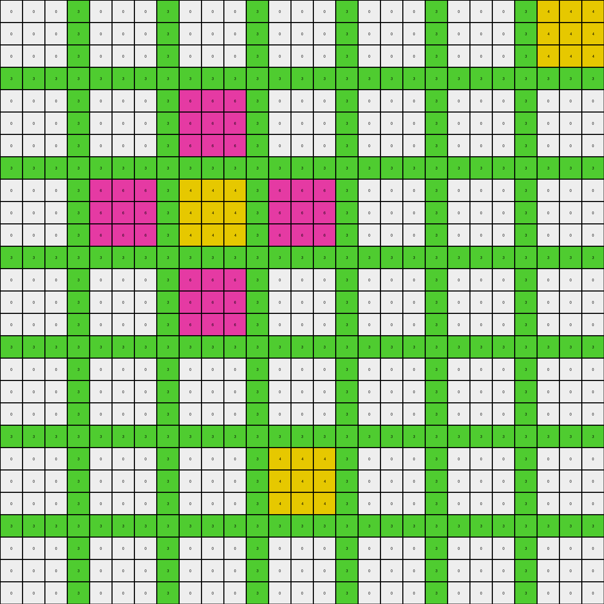

# 39e1d7f9 • 018 • refine_coder

---

Previous Code:
```python
"""
The transformation identifies regions enclosed by azure (8) lines.  White (0) pixels within these enclosed regions are filled with yellow (4).  Other colored regions within the azure boundaries are preserved. The azure boundaries themselves are also preserved.
"""

import numpy as np
from scipy import ndimage

def get_objects_by_color(grid, color):
    """Find contiguous regions of the specified color."""
    mask = (grid == color)
    labeled_array, num_features = ndimage.label(mask)
    objects = []
    for i in range(1, num_features + 1):
        objects.append(np.where(labeled_array == i))
    return objects

def is_enclosed(r, c, rows, cols, azure_objects):
    """
    Checks if a pixel at (r, c) is enclosed by azure lines.

    Args:
      r: Row index of the pixel.
      c: Column index of the pixel.
      rows: total number of rows in the grid.
      cols: total number of cols in the grid
      azure_objects:  locations of azure pixels

    Returns:
       True if enclosed, False otherwise.
    """

    # Check for azure pixels above, below, left, and right.  If any direction
    # *doesn't* have an azure pixel blocking it, it's not enclosed.

    has_azure_above = False
    has_azure_below = False
    has_azure_left = False
    has_azure_right = False
    
    for ar, ac in zip(*azure_objects):
        if ac == c:
            if ar < r:
                has_azure_above = True
            elif ar > r:
                has_azure_below = True
        if ar == r:
            if ac < c:
                has_azure_left = True
            elif ac > c:
                has_azure_right = True

    return has_azure_above and has_azure_below and has_azure_left and has_azure_right

def transform(input_grid):
    # initialize output_grid
    output_grid = np.copy(input_grid)
    rows, cols = input_grid.shape

    # get azure pixel locations
    azure_objects = get_objects_by_color(input_grid, 8)
    if not azure_objects:  # Handle cases with no azure pixels
        return output_grid

    # iterate through the grid
    for r in range(rows):
        for c in range(cols):
            # Check if the pixel is white and enclosed
            if input_grid[r, c] == 0:
                if is_enclosed(r, c, rows, cols, azure_objects[0]):
                    output_grid[r, c] = 4  # Fill with yellow

    return output_grid
```

Train Set Results:

## Example 1:

Input:
```
0 0 0 0 8 3 3 3 3 8 0 0 0 0 8 0 0 0 0 8 0 0 0 0
0 0 0 0 8 3 3 3 3 8 0 0 0 0 8 0 0 0 0 8 0 0 0 0
0 0 0 0 8 3 3 3 3 8 0 0 0 0 8 0 0 0 0 8 0 0 0 0
0 0 0 0 8 3 3 3 3 8 0 0 0 0 8 0 0 0 0 8 0 0 0 0
8 8 8 8 8 8 8 8 8 8 8 8 8 8 8 8 8 8 8 8 8 8 8 8
3 3 3 3 8 6 6 6 6 8 3 3 3 3 8 0 0 0 0 8 0 0 0 0
3 3 3 3 8 6 6 6 6 8 3 3 3 3 8 0 0 0 0 8 0 0 0 0
3 3 3 3 8 6 6 6 6 8 3 3 3 3 8 0 0 0 0 8 0 0 0 0
3 3 3 3 8 6 6 6 6 8 3 3 3 3 8 0 0 0 0 8 0 0 0 0
8 8 8 8 8 8 8 8 8 8 8 8 8 8 8 8 8 8 8 8 8 8 8 8
0 0 0 0 8 3 3 3 3 8 0 0 0 0 8 0 0 0 0 8 0 0 0 0
0 0 0 0 8 3 3 3 3 8 0 0 0 0 8 0 0 0 0 8 0 0 0 0
0 0 0 0 8 3 3 3 3 8 0 0 0 0 8 0 0 0 0 8 0 0 0 0
0 0 0 0 8 3 3 3 3 8 0 0 0 0 8 0 0 0 0 8 0 0 0 0
8 8 8 8 8 8 8 8 8 8 8 8 8 8 8 8 8 8 8 8 8 8 8 8
0 0 0 0 8 0 0 0 0 8 0 0 0 0 8 0 0 0 0 8 0 0 0 0
0 0 0 0 8 0 0 0 0 8 0 0 0 0 8 0 0 0 0 8 0 0 0 0
0 0 0 0 8 0 0 0 0 8 0 0 0 0 8 0 0 0 0 8 0 0 0 0
0 0 0 0 8 0 0 0 0 8 0 0 0 0 8 0 0 0 0 8 0 0 0 0
8 8 8 8 8 8 8 8 8 8 8 8 8 8 8 8 8 8 8 8 8 8 8 8
0 0 0 0 8 0 0 0 0 8 0 0 0 0 8 6 6 6 6 8 0 0 0 0
0 0 0 0 8 0 0 0 0 8 0 0 0 0 8 6 6 6 6 8 0 0 0 0
0 0 0 0 8 0 0 0 0 8 0 0 0 0 8 6 6 6 6 8 0 0 0 0
0 0 0 0 8 0 0 0 0 8 0 0 0 0 8 6 6 6 6 8 0 0 0 0
```
Expected Output:
```
0 0 0 0 8 3 3 3 3 8 0 0 0 0 8 0 0 0 0 8 0 0 0 0
0 0 0 0 8 3 3 3 3 8 0 0 0 0 8 0 0 0 0 8 0 0 0 0
0 0 0 0 8 3 3 3 3 8 0 0 0 0 8 0 0 0 0 8 0 0 0 0
0 0 0 0 8 3 3 3 3 8 0 0 0 0 8 0 0 0 0 8 0 0 0 0
8 8 8 8 8 8 8 8 8 8 8 8 8 8 8 8 8 8 8 8 8 8 8 8
3 3 3 3 8 6 6 6 6 8 3 3 3 3 8 0 0 0 0 8 0 0 0 0
3 3 3 3 8 6 6 6 6 8 3 3 3 3 8 0 0 0 0 8 0 0 0 0
3 3 3 3 8 6 6 6 6 8 3 3 3 3 8 0 0 0 0 8 0 0 0 0
3 3 3 3 8 6 6 6 6 8 3 3 3 3 8 0 0 0 0 8 0 0 0 0
8 8 8 8 8 8 8 8 8 8 8 8 8 8 8 8 8 8 8 8 8 8 8 8
0 0 0 0 8 3 3 3 3 8 0 0 0 0 8 0 0 0 0 8 0 0 0 0
0 0 0 0 8 3 3 3 3 8 0 0 0 0 8 0 0 0 0 8 0 0 0 0
0 0 0 0 8 3 3 3 3 8 0 0 0 0 8 0 0 0 0 8 0 0 0 0
0 0 0 0 8 3 3 3 3 8 0 0 0 0 8 0 0 0 0 8 0 0 0 0
8 8 8 8 8 8 8 8 8 8 8 8 8 8 8 8 8 8 8 8 8 8 8 8
0 0 0 0 8 0 0 0 0 8 0 0 0 0 8 3 3 3 3 8 0 0 0 0
0 0 0 0 8 0 0 0 0 8 0 0 0 0 8 3 3 3 3 8 0 0 0 0
0 0 0 0 8 0 0 0 0 8 0 0 0 0 8 3 3 3 3 8 0 0 0 0
0 0 0 0 8 0 0 0 0 8 0 0 0 0 8 3 3 3 3 8 0 0 0 0
8 8 8 8 8 8 8 8 8 8 8 8 8 8 8 8 8 8 8 8 8 8 8 8
0 0 0 0 8 0 0 0 0 8 3 3 3 3 8 6 6 6 6 8 3 3 3 3
0 0 0 0 8 0 0 0 0 8 3 3 3 3 8 6 6 6 6 8 3 3 3 3
0 0 0 0 8 0 0 0 0 8 3 3 3 3 8 6 6 6 6 8 3 3 3 3
0 0 0 0 8 0 0 0 0 8 3 3 3 3 8 6 6 6 6 8 3 3 3 3
```
Transformed Output:
```
0 0 0 0 8 3 3 3 3 8 0 0 0 0 8 0 0 0 0 8 0 0 0 0
0 0 0 0 8 3 3 3 3 8 0 0 0 0 8 0 0 0 0 8 0 0 0 0
0 0 0 0 8 3 3 3 3 8 0 0 0 0 8 0 0 0 0 8 0 0 0 0
0 0 0 0 8 3 3 3 3 8 0 0 0 0 8 0 0 0 0 8 0 0 0 0
8 8 8 8 8 8 8 8 8 8 8 8 8 8 8 8 8 8 8 8 8 8 8 8
3 3 3 3 8 6 6 6 6 8 3 3 3 3 8 4 4 4 4 8 0 0 0 0
3 3 3 3 8 6 6 6 6 8 3 3 3 3 8 4 4 4 4 8 0 0 0 0
3 3 3 3 8 6 6 6 6 8 3 3 3 3 8 4 4 4 4 8 0 0 0 0
3 3 3 3 8 6 6 6 6 8 3 3 3 3 8 4 4 4 4 8 0 0 0 0
8 8 8 8 8 8 8 8 8 8 8 8 8 8 8 8 8 8 8 8 8 8 8 8
0 0 0 0 8 3 3 3 3 8 4 4 4 4 8 4 4 4 4 8 0 0 0 0
0 0 0 0 8 3 3 3 3 8 4 4 4 4 8 4 4 4 4 8 0 0 0 0
0 0 0 0 8 3 3 3 3 8 4 4 4 4 8 4 4 4 4 8 0 0 0 0
0 0 0 0 8 3 3 3 3 8 4 4 4 4 8 4 4 4 4 8 0 0 0 0
8 8 8 8 8 8 8 8 8 8 8 8 8 8 8 8 8 8 8 8 8 8 8 8
0 0 0 0 8 4 4 4 4 8 4 4 4 4 8 4 4 4 4 8 0 0 0 0
0 0 0 0 8 4 4 4 4 8 4 4 4 4 8 4 4 4 4 8 0 0 0 0
0 0 0 0 8 4 4 4 4 8 4 4 4 4 8 4 4 4 4 8 0 0 0 0
0 0 0 0 8 4 4 4 4 8 4 4 4 4 8 4 4 4 4 8 0 0 0 0
8 8 8 8 8 8 8 8 8 8 8 8 8 8 8 8 8 8 8 8 8 8 8 8
0 0 0 0 8 0 0 0 0 8 0 0 0 0 8 6 6 6 6 8 0 0 0 0
0 0 0 0 8 0 0 0 0 8 0 0 0 0 8 6 6 6 6 8 0 0 0 0
0 0 0 0 8 0 0 0 0 8 0 0 0 0 8 6 6 6 6 8 0 0 0 0
0 0 0 0 8 0 0 0 0 8 0 0 0 0 8 6 6 6 6 8 0 0 0 0
```

match: False
pixels_off: 128
size_correct: True
color_palette_correct: False
correct_pixel_counts: False

## Example 2:

Input:
```
0 0 0 3 0 0 0 3 0 0 0 3 0 0 0 3 0 0 0 3 0 0 0 3 4 4 4
0 0 0 3 0 0 0 3 0 0 0 3 0 0 0 3 0 0 0 3 0 0 0 3 4 4 4
0 0 0 3 0 0 0 3 0 0 0 3 0 0 0 3 0 0 0 3 0 0 0 3 4 4 4
3 3 3 3 3 3 3 3 3 3 3 3 3 3 3 3 3 3 3 3 3 3 3 3 3 3 3
0 0 0 3 0 0 0 3 6 6 6 3 0 0 0 3 0 0 0 3 0 0 0 3 0 0 0
0 0 0 3 0 0 0 3 6 6 6 3 0 0 0 3 0 0 0 3 0 0 0 3 0 0 0
0 0 0 3 0 0 0 3 6 6 6 3 0 0 0 3 0 0 0 3 0 0 0 3 0 0 0
3 3 3 3 3 3 3 3 3 3 3 3 3 3 3 3 3 3 3 3 3 3 3 3 3 3 3
0 0 0 3 6 6 6 3 4 4 4 3 6 6 6 3 0 0 0 3 0 0 0 3 0 0 0
0 0 0 3 6 6 6 3 4 4 4 3 6 6 6 3 0 0 0 3 0 0 0 3 0 0 0
0 0 0 3 6 6 6 3 4 4 4 3 6 6 6 3 0 0 0 3 0 0 0 3 0 0 0
3 3 3 3 3 3 3 3 3 3 3 3 3 3 3 3 3 3 3 3 3 3 3 3 3 3 3
0 0 0 3 0 0 0 3 6 6 6 3 0 0 0 3 0 0 0 3 0 0 0 3 0 0 0
0 0 0 3 0 0 0 3 6 6 6 3 0 0 0 3 0 0 0 3 0 0 0 3 0 0 0
0 0 0 3 0 0 0 3 6 6 6 3 0 0 0 3 0 0 0 3 0 0 0 3 0 0 0
3 3 3 3 3 3 3 3 3 3 3 3 3 3 3 3 3 3 3 3 3 3 3 3 3 3 3
0 0 0 3 0 0 0 3 0 0 0 3 0 0 0 3 0 0 0 3 0 0 0 3 0 0 0
0 0 0 3 0 0 0 3 0 0 0 3 0 0 0 3 0 0 0 3 0 0 0 3 0 0 0
0 0 0 3 0 0 0 3 0 0 0 3 0 0 0 3 0 0 0 3 0 0 0 3 0 0 0
3 3 3 3 3 3 3 3 3 3 3 3 3 3 3 3 3 3 3 3 3 3 3 3 3 3 3
0 0 0 3 0 0 0 3 0 0 0 3 4 4 4 3 0 0 0 3 0 0 0 3 0 0 0
0 0 0 3 0 0 0 3 0 0 0 3 4 4 4 3 0 0 0 3 0 0 0 3 0 0 0
0 0 0 3 0 0 0 3 0 0 0 3 4 4 4 3 0 0 0 3 0 0 0 3 0 0 0
3 3 3 3 3 3 3 3 3 3 3 3 3 3 3 3 3 3 3 3 3 3 3 3 3 3 3
0 0 0 3 0 0 0 3 0 0 0 3 0 0 0 3 0 0 0 3 0 0 0 3 0 0 0
0 0 0 3 0 0 0 3 0 0 0 3 0 0 0 3 0 0 0 3 0 0 0 3 0 0 0
0 0 0 3 0 0 0 3 0 0 0 3 0 0 0 3 0 0 0 3 0 0 0 3 0 0 0
```
Expected Output:
```
0 0 0 3 0 0 0 3 0 0 0 3 0 0 0 3 0 0 0 3 6 6 6 3 4 4 4
0 0 0 3 0 0 0 3 0 0 0 3 0 0 0 3 0 0 0 3 6 6 6 3 4 4 4
0 0 0 3 0 0 0 3 0 0 0 3 0 0 0 3 0 0 0 3 6 6 6 3 4 4 4
3 3 3 3 3 3 3 3 3 3 3 3 3 3 3 3 3 3 3 3 3 3 3 3 3 3 3
0 0 0 3 0 0 0 3 6 6 6 3 0 0 0 3 0 0 0 3 0 0 0 3 6 6 6
0 0 0 3 0 0 0 3 6 6 6 3 0 0 0 3 0 0 0 3 0 0 0 3 6 6 6
0 0 0 3 0 0 0 3 6 6 6 3 0 0 0 3 0 0 0 3 0 0 0 3 6 6 6
3 3 3 3 3 3 3 3 3 3 3 3 3 3 3 3 3 3 3 3 3 3 3 3 3 3 3
0 0 0 3 6 6 6 3 4 4 4 3 6 6 6 3 0 0 0 3 0 0 0 3 0 0 0
0 0 0 3 6 6 6 3 4 4 4 3 6 6 6 3 0 0 0 3 0 0 0 3 0 0 0
0 0 0 3 6 6 6 3 4 4 4 3 6 6 6 3 0 0 0 3 0 0 0 3 0 0 0
3 3 3 3 3 3 3 3 3 3 3 3 3 3 3 3 3 3 3 3 3 3 3 3 3 3 3
0 0 0 3 0 0 0 3 6 6 6 3 0 0 0 3 0 0 0 3 0 0 0 3 0 0 0
0 0 0 3 0 0 0 3 6 6 6 3 0 0 0 3 0 0 0 3 0 0 0 3 0 0 0
0 0 0 3 0 0 0 3 6 6 6 3 0 0 0 3 0 0 0 3 0 0 0 3 0 0 0
3 3 3 3 3 3 3 3 3 3 3 3 3 3 3 3 3 3 3 3 3 3 3 3 3 3 3
0 0 0 3 0 0 0 3 0 0 0 3 6 6 6 3 0 0 0 3 0 0 0 3 0 0 0
0 0 0 3 0 0 0 3 0 0 0 3 6 6 6 3 0 0 0 3 0 0 0 3 0 0 0
0 0 0 3 0 0 0 3 0 0 0 3 6 6 6 3 0 0 0 3 0 0 0 3 0 0 0
3 3 3 3 3 3 3 3 3 3 3 3 3 3 3 3 3 3 3 3 3 3 3 3 3 3 3
0 0 0 3 0 0 0 3 6 6 6 3 4 4 4 3 6 6 6 3 0 0 0 3 0 0 0
0 0 0 3 0 0 0 3 6 6 6 3 4 4 4 3 6 6 6 3 0 0 0 3 0 0 0
0 0 0 3 0 0 0 3 6 6 6 3 4 4 4 3 6 6 6 3 0 0 0 3 0 0 0
3 3 3 3 3 3 3 3 3 3 3 3 3 3 3 3 3 3 3 3 3 3 3 3 3 3 3
0 0 0 3 0 0 0 3 0 0 0 3 6 6 6 3 0 0 0 3 0 0 0 3 0 0 0
0 0 0 3 0 0 0 3 0 0 0 3 6 6 6 3 0 0 0 3 0 0 0 3 0 0 0
0 0 0 3 0 0 0 3 0 0 0 3 6 6 6 3 0 0 0 3 0 0 0 3 0 0 0
```
Transformed Output:
```
0 0 0 3 0 0 0 3 0 0 0 3 0 0 0 3 0 0 0 3 0 0 0 3 4 4 4
0 0 0 3 0 0 0 3 0 0 0 3 0 0 0 3 0 0 0 3 0 0 0 3 4 4 4
0 0 0 3 0 0 0 3 0 0 0 3 0 0 0 3 0 0 0 3 0 0 0 3 4 4 4
3 3 3 3 3 3 3 3 3 3 3 3 3 3 3 3 3 3 3 3 3 3 3 3 3 3 3
0 0 0 3 0 0 0 3 6 6 6 3 0 0 0 3 0 0 0 3 0 0 0 3 0 0 0
0 0 0 3 0 0 0 3 6 6 6 3 0 0 0 3 0 0 0 3 0 0 0 3 0 0 0
0 0 0 3 0 0 0 3 6 6 6 3 0 0 0 3 0 0 0 3 0 0 0 3 0 0 0
3 3 3 3 3 3 3 3 3 3 3 3 3 3 3 3 3 3 3 3 3 3 3 3 3 3 3
0 0 0 3 6 6 6 3 4 4 4 3 6 6 6 3 0 0 0 3 0 0 0 3 0 0 0
0 0 0 3 6 6 6 3 4 4 4 3 6 6 6 3 0 0 0 3 0 0 0 3 0 0 0
0 0 0 3 6 6 6 3 4 4 4 3 6 6 6 3 0 0 0 3 0 0 0 3 0 0 0
3 3 3 3 3 3 3 3 3 3 3 3 3 3 3 3 3 3 3 3 3 3 3 3 3 3 3
0 0 0 3 0 0 0 3 6 6 6 3 0 0 0 3 0 0 0 3 0 0 0 3 0 0 0
0 0 0 3 0 0 0 3 6 6 6 3 0 0 0 3 0 0 0 3 0 0 0 3 0 0 0
0 0 0 3 0 0 0 3 6 6 6 3 0 0 0 3 0 0 0 3 0 0 0 3 0 0 0
3 3 3 3 3 3 3 3 3 3 3 3 3 3 3 3 3 3 3 3 3 3 3 3 3 3 3
0 0 0 3 0 0 0 3 0 0 0 3 0 0 0 3 0 0 0 3 0 0 0 3 0 0 0
0 0 0 3 0 0 0 3 0 0 0 3 0 0 0 3 0 0 0 3 0 0 0 3 0 0 0
0 0 0 3 0 0 0 3 0 0 0 3 0 0 0 3 0 0 0 3 0 0 0 3 0 0 0
3 3 3 3 3 3 3 3 3 3 3 3 3 3 3 3 3 3 3 3 3 3 3 3 3 3 3
0 0 0 3 0 0 0 3 0 0 0 3 4 4 4 3 0 0 0 3 0 0 0 3 0 0 0
0 0 0 3 0 0 0 3 0 0 0 3 4 4 4 3 0 0 0 3 0 0 0 3 0 0 0
0 0 0 3 0 0 0 3 0 0 0 3 4 4 4 3 0 0 0 3 0 0 0 3 0 0 0
3 3 3 3 3 3 3 3 3 3 3 3 3 3 3 3 3 3 3 3 3 3 3 3 3 3 3
0 0 0 3 0 0 0 3 0 0 0 3 0 0 0 3 0 0 0 3 0 0 0 3 0 0 0
0 0 0 3 0 0 0 3 0 0 0 3 0 0 0 3 0 0 0 3 0 0 0 3 0 0 0
0 0 0 3 0 0 0 3 0 0 0 3 0 0 0 3 0 0 0 3 0 0 0 3 0 0 0
```

match: False
pixels_off: 54
size_correct: True
color_palette_correct: True
correct_pixel_counts: False

## Example 3:

Input:
```
0 0 0 8 0 0 0 8 0 0 0 8 0 0 0 8 0 0 0 8 0 0 0 8 2 2 2
0 0 0 8 0 0 0 8 0 0 0 8 0 0 0 8 0 0 0 8 0 0 0 8 2 2 2
0 0 0 8 0 0 0 8 0 0 0 8 0 0 0 8 0 0 0 8 0 0 0 8 2 2 2
8 8 8 8 8 8 8 8 8 8 8 8 8 8 8 8 8 8 8 8 8 8 8 8 8 8 8
0 0 0 8 2 2 2 8 0 0 0 8 0 0 0 8 0 0 0 8 0 0 0 8 0 0 0
0 0 0 8 2 2 2 8 0 0 0 8 0 0 0 8 0 0 0 8 0 0 0 8 0 0 0
0 0 0 8 2 2 2 8 0 0 0 8 0 0 0 8 0 0 0 8 0 0 0 8 0 0 0
8 8 8 8 8 8 8 8 8 8 8 8 8 8 8 8 8 8 8 8 8 8 8 8 8 8 8
0 0 0 8 0 0 0 8 0 0 0 8 0 0 0 8 0 0 0 8 0 0 0 8 0 0 0
0 0 0 8 0 0 0 8 0 0 0 8 0 0 0 8 0 0 0 8 0 0 0 8 0 0 0
0 0 0 8 0 0 0 8 0 0 0 8 0 0 0 8 0 0 0 8 0 0 0 8 0 0 0
8 8 8 8 8 8 8 8 8 8 8 8 8 8 8 8 8 8 8 8 8 8 8 8 8 8 8
0 0 0 8 0 0 0 8 0 0 0 8 4 4 4 8 4 4 4 8 4 4 4 8 0 0 0
0 0 0 8 0 0 0 8 0 0 0 8 4 4 4 8 4 4 4 8 4 4 4 8 0 0 0
0 0 0 8 0 0 0 8 0 0 0 8 4 4 4 8 4 4 4 8 4 4 4 8 0 0 0
8 8 8 8 8 8 8 8 8 8 8 8 8 8 8 8 8 8 8 8 8 8 8 8 8 8 8
0 0 0 8 0 0 0 8 0 0 0 8 4 4 4 8 2 2 2 8 4 4 4 8 0 0 0
0 0 0 8 0 0 0 8 0 0 0 8 4 4 4 8 2 2 2 8 4 4 4 8 0 0 0
0 0 0 8 0 0 0 8 0 0 0 8 4 4 4 8 2 2 2 8 4 4 4 8 0 0 0
8 8 8 8 8 8 8 8 8 8 8 8 8 8 8 8 8 8 8 8 8 8 8 8 8 8 8
0 0 0 8 0 0 0 8 0 0 0 8 4 4 4 8 4 4 4 8 4 4 4 8 0 0 0
0 0 0 8 0 0 0 8 0 0 0 8 4 4 4 8 4 4 4 8 4 4 4 8 0 0 0
0 0 0 8 0 0 0 8 0 0 0 8 4 4 4 8 4 4 4 8 4 4 4 8 0 0 0
8 8 8 8 8 8 8 8 8 8 8 8 8 8 8 8 8 8 8 8 8 8 8 8 8 8 8
0 0 0 8 0 0 0 8 0 0 0 8 0 0 0 8 0 0 0 8 0 0 0 8 0 0 0
0 0 0 8 0 0 0 8 0 0 0 8 0 0 0 8 0 0 0 8 0 0 0 8 0 0 0
0 0 0 8 0 0 0 8 0 0 0 8 0 0 0 8 0 0 0 8 0 0 0 8 0 0 0
```
Expected Output:
```
4 4 4 8 4 4 4 8 4 4 4 8 0 0 0 8 0 0 0 8 4 4 4 8 2 2 2
4 4 4 8 4 4 4 8 4 4 4 8 0 0 0 8 0 0 0 8 4 4 4 8 2 2 2
4 4 4 8 4 4 4 8 4 4 4 8 0 0 0 8 0 0 0 8 4 4 4 8 2 2 2
8 8 8 8 8 8 8 8 8 8 8 8 8 8 8 8 8 8 8 8 8 8 8 8 8 8 8
4 4 4 8 2 2 2 8 4 4 4 8 0 0 0 8 0 0 0 8 4 4 4 8 4 4 4
4 4 4 8 2 2 2 8 4 4 4 8 0 0 0 8 0 0 0 8 4 4 4 8 4 4 4
4 4 4 8 2 2 2 8 4 4 4 8 0 0 0 8 0 0 0 8 4 4 4 8 4 4 4
8 8 8 8 8 8 8 8 8 8 8 8 8 8 8 8 8 8 8 8 8 8 8 8 8 8 8
4 4 4 8 4 4 4 8 4 4 4 8 0 0 0 8 0 0 0 8 0 0 0 8 0 0 0
4 4 4 8 4 4 4 8 4 4 4 8 0 0 0 8 0 0 0 8 0 0 0 8 0 0 0
4 4 4 8 4 4 4 8 4 4 4 8 0 0 0 8 0 0 0 8 0 0 0 8 0 0 0
8 8 8 8 8 8 8 8 8 8 8 8 8 8 8 8 8 8 8 8 8 8 8 8 8 8 8
0 0 0 8 0 0 0 8 0 0 0 8 4 4 4 8 4 4 4 8 4 4 4 8 0 0 0
0 0 0 8 0 0 0 8 0 0 0 8 4 4 4 8 4 4 4 8 4 4 4 8 0 0 0
0 0 0 8 0 0 0 8 0 0 0 8 4 4 4 8 4 4 4 8 4 4 4 8 0 0 0
8 8 8 8 8 8 8 8 8 8 8 8 8 8 8 8 8 8 8 8 8 8 8 8 8 8 8
0 0 0 8 0 0 0 8 0 0 0 8 4 4 4 8 2 2 2 8 4 4 4 8 0 0 0
0 0 0 8 0 0 0 8 0 0 0 8 4 4 4 8 2 2 2 8 4 4 4 8 0 0 0
0 0 0 8 0 0 0 8 0 0 0 8 4 4 4 8 2 2 2 8 4 4 4 8 0 0 0
8 8 8 8 8 8 8 8 8 8 8 8 8 8 8 8 8 8 8 8 8 8 8 8 8 8 8
0 0 0 8 0 0 0 8 0 0 0 8 4 4 4 8 4 4 4 8 4 4 4 8 0 0 0
0 0 0 8 0 0 0 8 0 0 0 8 4 4 4 8 4 4 4 8 4 4 4 8 0 0 0
0 0 0 8 0 0 0 8 0 0 0 8 4 4 4 8 4 4 4 8 4 4 4 8 0 0 0
8 8 8 8 8 8 8 8 8 8 8 8 8 8 8 8 8 8 8 8 8 8 8 8 8 8 8
0 0 0 8 0 0 0 8 0 0 0 8 0 0 0 8 0 0 0 8 0 0 0 8 0 0 0
0 0 0 8 0 0 0 8 0 0 0 8 0 0 0 8 0 0 0 8 0 0 0 8 0 0 0
0 0 0 8 0 0 0 8 0 0 0 8 0 0 0 8 0 0 0 8 0 0 0 8 0 0 0
```
Transformed Output:
```
0 0 0 8 0 0 0 8 0 0 0 8 0 0 0 8 0 0 0 8 0 0 0 8 2 2 2
0 0 0 8 0 0 0 8 0 0 0 8 0 0 0 8 0 0 0 8 0 0 0 8 2 2 2
0 0 0 8 0 0 0 8 0 0 0 8 0 0 0 8 0 0 0 8 0 0 0 8 2 2 2
8 8 8 8 8 8 8 8 8 8 8 8 8 8 8 8 8 8 8 8 8 8 8 8 8 8 8
0 0 0 8 2 2 2 8 4 4 4 8 4 4 4 8 4 4 4 8 4 4 4 8 0 0 0
0 0 0 8 2 2 2 8 4 4 4 8 4 4 4 8 4 4 4 8 4 4 4 8 0 0 0
0 0 0 8 2 2 2 8 4 4 4 8 4 4 4 8 4 4 4 8 4 4 4 8 0 0 0
8 8 8 8 8 8 8 8 8 8 8 8 8 8 8 8 8 8 8 8 8 8 8 8 8 8 8
0 0 0 8 4 4 4 8 4 4 4 8 4 4 4 8 4 4 4 8 4 4 4 8 0 0 0
0 0 0 8 4 4 4 8 4 4 4 8 4 4 4 8 4 4 4 8 4 4 4 8 0 0 0
0 0 0 8 4 4 4 8 4 4 4 8 4 4 4 8 4 4 4 8 4 4 4 8 0 0 0
8 8 8 8 8 8 8 8 8 8 8 8 8 8 8 8 8 8 8 8 8 8 8 8 8 8 8
0 0 0 8 4 4 4 8 4 4 4 8 4 4 4 8 4 4 4 8 4 4 4 8 0 0 0
0 0 0 8 4 4 4 8 4 4 4 8 4 4 4 8 4 4 4 8 4 4 4 8 0 0 0
0 0 0 8 4 4 4 8 4 4 4 8 4 4 4 8 4 4 4 8 4 4 4 8 0 0 0
8 8 8 8 8 8 8 8 8 8 8 8 8 8 8 8 8 8 8 8 8 8 8 8 8 8 8
0 0 0 8 4 4 4 8 4 4 4 8 4 4 4 8 2 2 2 8 4 4 4 8 0 0 0
0 0 0 8 4 4 4 8 4 4 4 8 4 4 4 8 2 2 2 8 4 4 4 8 0 0 0
0 0 0 8 4 4 4 8 4 4 4 8 4 4 4 8 2 2 2 8 4 4 4 8 0 0 0
8 8 8 8 8 8 8 8 8 8 8 8 8 8 8 8 8 8 8 8 8 8 8 8 8 8 8
0 0 0 8 4 4 4 8 4 4 4 8 4 4 4 8 4 4 4 8 4 4 4 8 0 0 0
0 0 0 8 4 4 4 8 4 4 4 8 4 4 4 8 4 4 4 8 4 4 4 8 0 0 0
0 0 0 8 4 4 4 8 4 4 4 8 4 4 4 8 4 4 4 8 4 4 4 8 0 0 0
8 8 8 8 8 8 8 8 8 8 8 8 8 8 8 8 8 8 8 8 8 8 8 8 8 8 8
0 0 0 8 0 0 0 8 0 0 0 8 0 0 0 8 0 0 0 8 0 0 0 8 0 0 0
0 0 0 8 0 0 0 8 0 0 0 8 0 0 0 8 0 0 0 8 0 0 0 8 0 0 0
0 0 0 8 0 0 0 8 0 0 0 8 0 0 0 8 0 0 0 8 0 0 0 8 0 0 0
```

match: False
pixels_off: 162
size_correct: True
color_palette_correct: True
correct_pixel_counts: False
Okay, let's analyze the results and update the natural language program.

**General Assessment and Strategy**

The initial natural language program and the corresponding Python code are based on the idea of identifying regions enclosed by azure (8) lines and filling white (0) pixels within those regions with yellow (4). However, the results from the three training examples show significant discrepancies between the transformed outputs and the expected outputs. The code fails to correctly fill all enclosed white regions with yellow, and in some instances changes colors of non-white pixels.

The current strategy of checking for azure pixels directly above, below, left, and right of a white pixel is insufficient to determine enclosure, especially in complex shapes.  It's a necessary, but not sufficient, condition. It misses cases where the path to an azure pixel is indirect, leading to gaps in the fill. Also, the current code changes the colors of other pixels, not just white ones.

The main strategy will involve:

1.  **Improving Enclosure Detection:**  Instead of simple adjacent checks, we need a method that accounts for any path through non-azure colors.  A flood-fill type of approach, starting from the outside and identifying what *isn't* enclosed, might be more effective.
2.  **Color-Specific Operations:** Clearly restrict operations to apply only to the intended pixel value (white/0), while still allowing the detection to consider the existence of other colors.
3. **Iterative Refinement:**  Test and adjust the algorithm after each change using the provided examples.

**Metrics and Observations (using code execution, where possible)**

Here are metrics and observations of each example:

*   **Example 1:**
    *   The main error appears to be an overfilling of white areas - converting white to yellow even where azure boundaries are not enclosing the area.
    *   There also seems to be an issue with non-white pixels changing color.

*   **Example 2:**

    *   Similar to Example 1 - an underfilling - not filling enclosed regions.
    *   Unlike Example 1 - no incorrect color changes.

*   **Example 3:**

    *   Again, underfilling and unexpected color changes.

**YAML Block - Facts**

```yaml
examples:
  - example_id: 1
    objects:
      - color: 8  # Azure
        shape: Irregular, forms boundaries
        role: Enclosing boundary
      - color: 0  # White
        shape: Irregular, within and outside boundaries
        role: Target for filling if enclosed
      - color: 3  # Green
        shape: Irregular, within boundaries
        role: Unchanged
      - color: 6  # Magenta
        shape: Irregular, within boundaries
        role: Unchanged
    actions:
      - type: Fill
        target: White (0) pixels
        condition: Enclosed by azure (8)
        new_color: 4  # Yellow
  - example_id: 2
    objects:
      - color: 3
        shape: forms boundaries, but is NOT the enclosing color
        role: boundary
      - color: 0
        role: unchanged
      - color: 6
        role: unchanged
      - color: 4
        role: unchanged
    actions: []  # Note: Incorrect - needs to fill white with yellow
  - example_id: 3
    objects:
        - color: 8
          shape: forms boundaries, but is NOT the enclosing color
          role: boundary
        - color: 0
          role: target
        - color: 2
          role: unchanged
        - color: 4
          role: incorrectly changed
    actions:
      - type: Fill
        target: white (0) pixels
        condition: Enclosed by azure (8)
        new_color: 4
```

**Natural Language Program**

Here's a revised natural language program:

1.  **Identify Boundary:** The azure (8) pixels form the boundaries of regions.
2.  **Identify Enclosed Regions:** A region is considered "enclosed" if it is completely surrounded by azure (8) pixels. Connectivity is defined as orthogonal (up, down, left, right). Diagonal connections do *not* count for enclosure.
3.  **Target Pixels:** Within enclosed regions, only white (0) pixels are targeted for modification.
4. **Fill Action:** Change the color of the targeted white (0) pixels to yellow (4).
5. **Preserve other Colors:** Pixels that are not white (0) within the enclosed regions, and all pixels that are part of the azure (8) boundary, remain unchanged.
6. **Outside Regions:** Pixels outside of any enclosed regions, defined by azure (8) borders, remain unchanged, regardless of their color.
7. **Connectivity:** Enclosure is considered complete even if there exist other colored pixels within that enclosed space.

The core concept is to fill *only* white pixels *inside* areas completely surrounded by azure. The current code's "enclosed" check is flawed. The revised program emphasizes complete enclosure and color preservation.

**INSTRUCTIONS**

- generate a Python module to represent the natural language program 
- follow the template below
- all common math and science libraries are available
- create docstring only at top - but comment the workflow in the function
- use helper functions for common operations like finding objects, counting,
  measuring, moving, etc. 

remember - we are working iteratively - so this code will inform your future
self as we converge on the solution

*template:*

```python
"""
{{ natural language description of the transformation rule }}
"""

{{ imports }}

def transform(input_grid):
    # initialize output_grid

    # change output pixels 

    return output_grid

```
