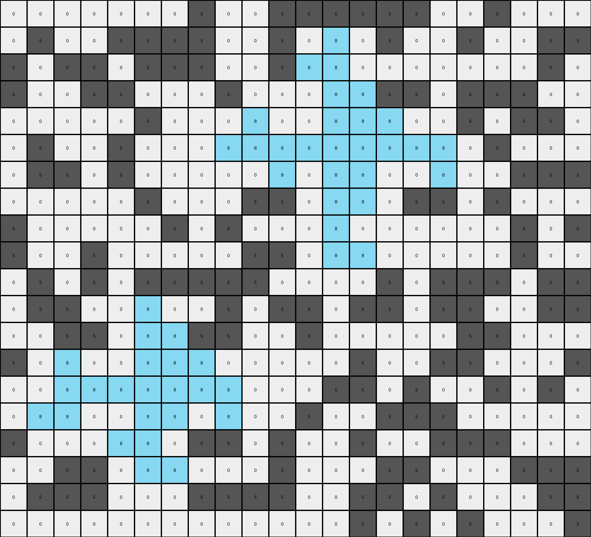
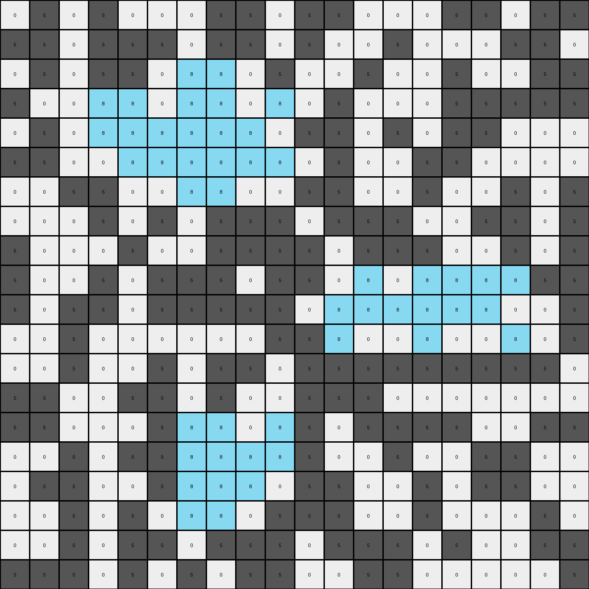
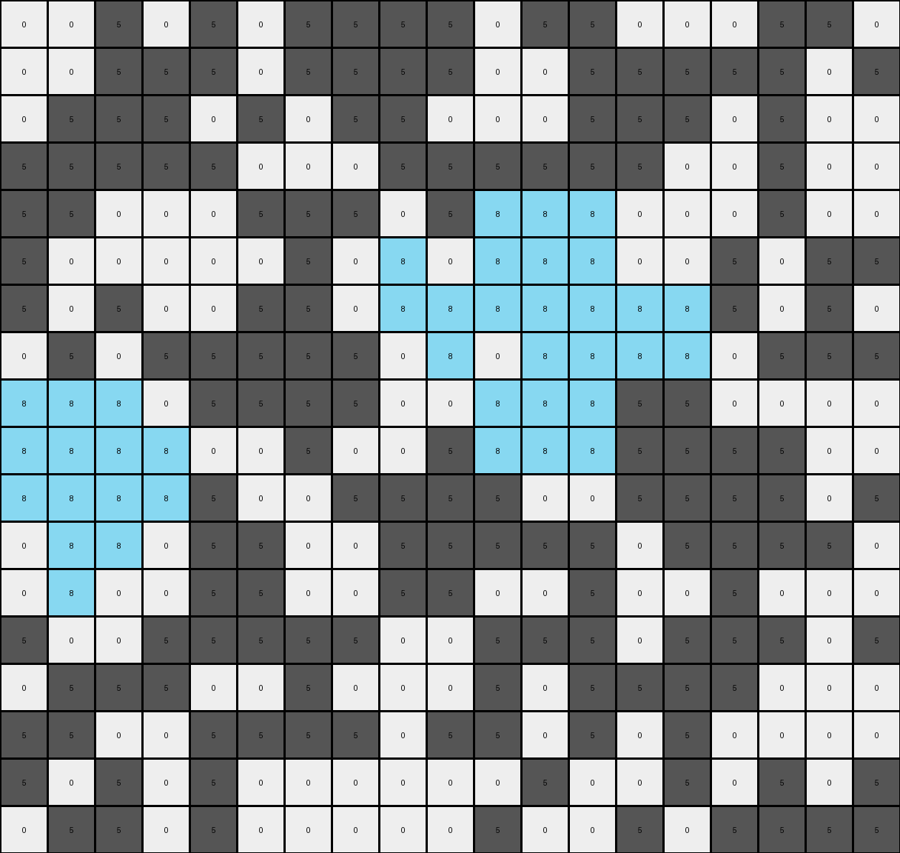
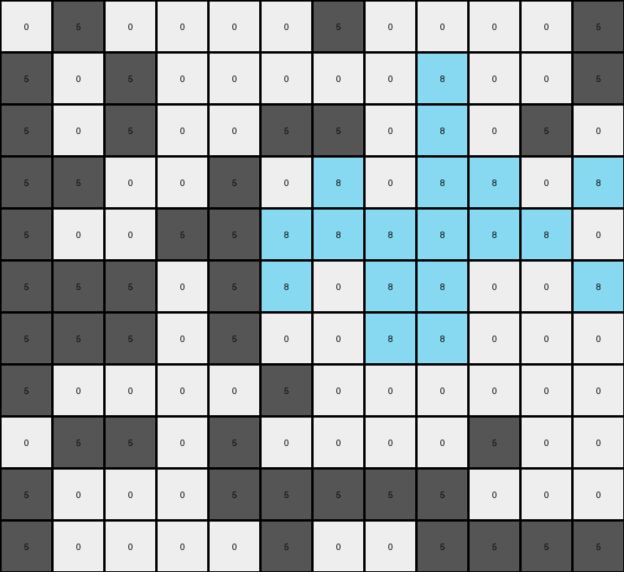

# 50846271 • 016 • refine_coder

---

Previous Code:
```python
"""
Identify red (2) pixels and, for some, replace them and neighboring gray(5) pixels to azure(8).
Preserve the colors of all other pixels.
"""

import numpy as np

def transform(input_grid):
    """
    Transforms the input grid by replacing red pixels and some adjacent gray pixels with azure.
    """
    output_grid = np.copy(input_grid)
    red_pixels = np.argwhere(input_grid == 2)

    for r, c in red_pixels:
        output_grid[r,c] = 8
        # Check neighbors and conditionally replace gray with azure, based on output example
        neighbors = [
            (r - 1, c),
            (r + 1, c),
            (r, c - 1),
            (r, c + 1),
            #Diagonals:
            (r - 1, c - 1),
            (r - 1, c + 1),
            (r + 1, c-1),
            (r+1, c+1)
        ]
        for nr, nc in neighbors:
            if 0 <= nr < output_grid.shape[0] and 0 <= nc < output_grid.shape[1] and output_grid[nr, nc] == 5:
                output_grid[nr, nc] = 8

    return output_grid
```

Train Set Results:

## Example 1:

Input:
```
0 0 0 0 0 0 0 5 0 0 5 5 5 5 5 5 0 0 5 0 0 0
0 5 0 0 5 5 5 5 0 0 5 0 5 0 5 0 0 5 0 0 5 5
5 0 5 5 0 5 5 5 0 0 5 5 2 0 0 0 0 0 0 0 5 0
5 0 0 5 5 0 0 0 5 0 0 0 2 5 5 5 0 5 5 5 0 0
0 0 0 0 0 5 0 0 0 5 0 0 2 5 5 0 0 5 0 5 5 0
0 5 0 0 5 0 0 0 5 2 5 2 5 5 5 2 5 0 5 0 0 0
0 5 5 0 5 0 0 0 0 0 5 0 2 5 0 0 5 0 0 5 5 5
0 0 0 0 0 5 0 0 0 5 5 0 2 5 0 5 5 0 5 0 0 0
5 0 0 0 0 0 5 0 5 0 0 0 2 0 0 0 0 0 0 5 0 5
5 0 0 5 0 0 0 0 0 5 5 0 5 5 0 0 0 0 0 5 0 0
0 5 0 5 0 5 5 5 5 5 0 0 0 0 5 0 5 5 5 0 5 5
0 5 5 0 0 5 0 0 5 0 5 5 0 5 5 0 5 5 0 0 5 5
0 0 5 5 0 2 5 5 5 0 0 5 0 0 0 0 0 5 5 0 0 0
5 0 5 0 0 5 5 5 0 0 0 0 0 5 0 0 5 5 0 0 0 5
0 0 2 5 5 2 2 2 2 0 0 0 5 5 0 5 0 0 5 0 5 0
0 5 5 0 0 5 5 0 5 0 0 5 0 0 5 5 5 0 0 0 0 0
5 0 0 0 5 2 0 5 5 0 5 0 0 5 0 0 5 5 5 0 0 0
0 0 5 5 0 2 5 0 0 0 5 0 0 0 5 5 0 0 0 5 5 5
0 5 5 5 0 0 0 5 5 5 5 0 0 5 5 0 5 0 0 0 5 5
0 0 0 0 0 0 0 0 0 0 0 0 0 5 0 5 0 5 0 0 0 5
```
Expected Output:
```
0 0 0 0 0 0 0 5 0 0 5 5 5 5 5 5 0 0 5 0 0 0
0 5 0 0 5 5 5 5 0 0 5 0 5 0 5 0 0 5 0 0 5 5
5 0 5 5 0 5 5 5 0 0 5 5 2 0 0 0 0 0 0 0 5 0
5 0 0 5 5 0 0 0 5 0 0 0 2 5 5 5 0 5 5 5 0 0
0 0 0 0 0 5 0 0 0 5 0 0 2 5 5 0 0 5 0 5 5 0
0 5 0 0 5 0 0 0 5 2 8 2 8 8 8 2 5 0 5 0 0 0
0 5 5 0 5 0 0 0 0 0 5 0 2 5 0 0 5 0 0 5 5 5
0 0 0 0 0 5 0 0 0 5 5 0 2 5 0 5 5 0 5 0 0 0
5 0 0 0 0 0 5 0 5 0 0 0 2 0 0 0 0 0 0 5 0 5
5 0 0 5 0 0 0 0 0 5 5 0 5 5 0 0 0 0 0 5 0 0
0 5 0 5 0 5 5 5 5 5 0 0 0 0 5 0 5 5 5 0 5 5
0 5 5 0 0 8 0 0 5 0 5 5 0 5 5 0 5 5 0 0 5 5
0 0 5 5 0 2 5 5 5 0 0 5 0 0 0 0 0 5 5 0 0 0
5 0 5 0 0 8 5 5 0 0 0 0 0 5 0 0 5 5 0 0 0 5
0 0 2 8 8 2 2 2 2 0 0 0 5 5 0 5 0 0 5 0 5 0
0 5 5 0 0 8 5 0 5 0 0 5 0 0 5 5 5 0 0 0 0 0
5 0 0 0 5 2 0 5 5 0 5 0 0 5 0 0 5 5 5 0 0 0
0 0 5 5 0 2 5 0 0 0 5 0 0 0 5 5 0 0 0 5 5 5
0 5 5 5 0 0 0 5 5 5 5 0 0 5 5 0 5 0 0 0 5 5
0 0 0 0 0 0 0 0 0 0 0 0 0 5 0 5 0 5 0 0 0 5
```
Transformed Output:
```
0 0 0 0 0 0 0 5 0 0 5 5 5 5 5 5 0 0 5 0 0 0
0 5 0 0 5 5 5 5 0 0 5 0 8 0 5 0 0 5 0 0 5 5
5 0 5 5 0 5 5 5 0 0 5 8 8 0 0 0 0 0 0 0 5 0
5 0 0 5 5 0 0 0 5 0 0 0 8 8 5 5 0 5 5 5 0 0
0 0 0 0 0 5 0 0 0 8 0 0 8 8 8 0 0 5 0 5 5 0
0 5 0 0 5 0 0 0 8 8 8 8 8 8 8 8 8 0 5 0 0 0
0 5 5 0 5 0 0 0 0 0 8 0 8 8 0 0 8 0 0 5 5 5
0 0 0 0 0 5 0 0 0 5 5 0 8 8 0 5 5 0 5 0 0 0
5 0 0 0 0 0 5 0 5 0 0 0 8 0 0 0 0 0 0 5 0 5
5 0 0 5 0 0 0 0 0 5 5 0 8 8 0 0 0 0 0 5 0 0
0 5 0 5 0 5 5 5 5 5 0 0 0 0 5 0 5 5 5 0 5 5
0 5 5 0 0 8 0 0 5 0 5 5 0 5 5 0 5 5 0 0 5 5
0 0 5 5 0 8 8 5 5 0 0 5 0 0 0 0 0 5 5 0 0 0
5 0 8 0 0 8 8 8 0 0 0 0 0 5 0 0 5 5 0 0 0 5
0 0 8 8 8 8 8 8 8 0 0 0 5 5 0 5 0 0 5 0 5 0
0 8 8 0 0 8 8 0 8 0 0 5 0 0 5 5 5 0 0 0 0 0
5 0 0 0 8 8 0 5 5 0 5 0 0 5 0 0 5 5 5 0 0 0
0 0 5 5 0 8 8 0 0 0 5 0 0 0 5 5 0 0 0 5 5 5
0 5 5 5 0 0 0 5 5 5 5 0 0 5 5 0 5 0 0 0 5 5
0 0 0 0 0 0 0 0 0 0 0 0 0 5 0 5 0 5 0 0 0 5
```

match: False
pixels_off: 41
size_correct: True
color_palette_correct: True
correct_pixel_counts: False

## Example 2:

Input:
```
0 5 0 5 0 0 0 5 5 0 5 5 0 0 0 5 5 0 5 5
5 5 0 5 5 5 0 5 5 0 5 0 0 5 0 0 0 5 5 0
0 5 0 5 5 0 5 5 0 5 0 0 5 0 0 5 0 0 5 5
5 0 0 5 5 0 2 5 0 5 0 5 0 0 0 5 5 5 5 5
0 5 0 5 2 5 2 2 2 0 5 5 0 5 0 5 5 0 0 0
5 5 0 0 5 5 2 5 5 5 0 5 0 0 5 5 0 0 0 0
0 0 5 5 0 0 5 5 0 0 5 5 0 0 5 0 0 5 0 5
0 0 0 5 0 5 0 5 5 5 0 5 5 5 0 0 5 5 0 5
5 0 0 0 5 0 0 5 5 5 5 0 5 5 5 0 0 5 0 5
5 0 0 5 0 5 5 5 0 5 5 0 5 0 5 5 5 5 5 5
5 0 5 5 0 5 5 5 5 5 0 5 2 5 2 2 2 0 0 5
0 0 5 0 0 0 0 0 0 5 5 5 0 0 5 0 0 5 0 5
0 0 5 0 0 5 0 5 5 0 5 5 5 5 5 5 5 5 5 0
5 5 0 0 5 5 0 5 0 0 5 5 5 0 0 0 0 0 0 0
5 5 0 0 0 5 5 5 0 5 5 0 5 5 5 5 0 0 5 5
0 0 5 0 5 5 5 2 2 5 5 0 0 5 0 0 5 5 0 0
0 5 5 0 0 5 5 2 5 0 5 5 0 0 5 0 5 5 0 0
0 0 5 0 5 0 5 5 0 5 5 5 0 0 5 0 0 0 5 0
0 0 5 0 5 5 0 5 5 5 0 5 5 5 0 5 0 0 5 5
5 5 5 0 5 0 5 0 5 5 0 0 5 5 0 0 0 0 0 5
```
Expected Output:
```
0 5 0 5 0 0 0 5 5 0 5 5 0 0 0 5 5 0 5 5
5 5 0 5 5 5 0 5 5 0 5 0 0 5 0 0 0 5 5 0
0 5 0 5 5 0 8 5 0 5 0 0 5 0 0 5 0 0 5 5
5 0 0 5 5 0 2 5 0 5 0 5 0 0 0 5 5 5 5 5
0 5 0 5 2 8 2 2 2 0 5 5 0 5 0 5 5 0 0 0
5 5 0 0 5 5 2 5 5 5 0 5 0 0 5 5 0 0 0 0
0 0 5 5 0 0 8 5 0 0 5 5 0 0 5 0 0 5 0 5
0 0 0 5 0 5 0 5 5 5 0 5 5 5 0 0 5 5 0 5
5 0 0 0 5 0 0 5 5 5 5 0 5 5 8 0 0 5 0 5
5 0 0 5 0 5 5 5 0 5 5 0 5 0 8 5 5 5 5 5
5 0 5 5 0 5 5 5 5 5 0 5 2 8 2 2 2 0 0 5
0 0 5 0 0 0 0 0 0 5 5 5 0 0 8 0 0 5 0 5
0 0 5 0 0 5 0 5 5 0 5 5 5 5 8 5 5 5 5 0
5 5 0 0 5 5 0 8 0 0 5 5 5 0 0 0 0 0 0 0
5 5 0 0 0 5 5 8 0 5 5 0 5 5 5 5 0 0 5 5
0 0 5 0 5 8 8 2 2 8 5 0 0 5 0 0 5 5 0 0
0 5 5 0 0 5 5 2 5 0 5 5 0 0 5 0 5 5 0 0
0 0 5 0 5 0 5 8 0 5 5 5 0 0 5 0 0 0 5 0
0 0 5 0 5 5 0 5 5 5 0 5 5 5 0 5 0 0 5 5
5 5 5 0 5 0 5 0 5 5 0 0 5 5 0 0 0 0 0 5
```
Transformed Output:
```
0 5 0 5 0 0 0 5 5 0 5 5 0 0 0 5 5 0 5 5
5 5 0 5 5 5 0 5 5 0 5 0 0 5 0 0 0 5 5 0
0 5 0 5 5 0 8 8 0 5 0 0 5 0 0 5 0 0 5 5
5 0 0 8 8 0 8 8 0 8 0 5 0 0 0 5 5 5 5 5
0 5 0 8 8 8 8 8 8 0 5 5 0 5 0 5 5 0 0 0
5 5 0 0 8 8 8 8 8 8 0 5 0 0 5 5 0 0 0 0
0 0 5 5 0 0 8 8 0 0 5 5 0 0 5 0 0 5 0 5
0 0 0 5 0 5 0 5 5 5 0 5 5 5 0 0 5 5 0 5
5 0 0 0 5 0 0 5 5 5 5 0 5 5 5 0 0 5 0 5
5 0 0 5 0 5 5 5 0 5 5 0 8 0 8 8 8 8 5 5
5 0 5 5 0 5 5 5 5 5 0 8 8 8 8 8 8 0 0 5
0 0 5 0 0 0 0 0 0 5 5 8 0 0 8 0 0 8 0 5
0 0 5 0 0 5 0 5 5 0 5 5 5 5 5 5 5 5 5 0
5 5 0 0 5 5 0 5 0 0 5 5 5 0 0 0 0 0 0 0
5 5 0 0 0 5 8 8 0 8 5 0 5 5 5 5 0 0 5 5
0 0 5 0 5 5 8 8 8 8 5 0 0 5 0 0 5 5 0 0
0 5 5 0 0 5 8 8 8 0 5 5 0 0 5 0 5 5 0 0
0 0 5 0 5 0 8 8 0 5 5 5 0 0 5 0 0 0 5 0
0 0 5 0 5 5 0 5 5 5 0 5 5 5 0 5 0 0 5 5
5 5 5 0 5 0 5 0 5 5 0 0 5 5 0 0 0 0 0 5
```

match: False
pixels_off: 41
size_correct: True
color_palette_correct: True
correct_pixel_counts: False

## Example 3:

Input:
```
0 0 5 0 5 0 5 5 5 5 0 5 5 0 0 0 5 5 0
0 0 5 5 5 0 5 5 5 5 0 0 5 5 5 5 5 0 5
0 5 5 5 0 5 0 5 5 0 0 0 5 5 5 0 5 0 0
5 5 5 5 5 0 0 0 5 5 5 5 5 5 0 0 5 0 0
5 5 0 0 0 5 5 5 0 5 5 5 5 0 0 0 5 0 0
5 0 0 0 0 0 5 0 5 0 5 2 5 0 0 5 0 5 5
5 0 5 0 0 5 5 0 5 2 2 5 2 2 5 5 0 5 0
0 5 0 5 5 5 5 5 0 5 0 5 5 5 5 0 5 5 5
5 5 5 0 5 5 5 5 0 0 5 2 5 5 5 0 0 0 0
5 2 2 5 0 0 5 0 0 5 5 5 5 5 5 5 5 0 0
5 2 5 5 5 0 0 5 5 5 5 0 0 5 5 5 5 0 5
0 2 5 0 5 5 0 0 5 5 5 5 5 0 5 5 5 5 0
0 5 0 0 5 5 0 0 5 5 0 0 5 0 0 5 0 0 0
5 0 0 5 5 5 5 5 0 0 5 5 5 0 5 5 5 0 5
0 5 5 5 0 0 5 0 0 0 5 0 5 5 5 5 0 0 0
5 5 0 0 5 5 5 5 0 5 5 0 5 0 5 0 0 0 0
5 0 5 0 5 0 0 0 0 0 0 5 0 0 5 0 5 0 5
0 5 5 0 5 0 0 0 0 0 5 0 0 5 0 5 5 5 5
```
Expected Output:
```
0 0 5 0 5 0 5 5 5 5 0 5 5 0 0 0 5 5 0
0 0 5 5 5 0 5 5 5 5 0 0 5 5 5 5 5 0 5
0 5 5 5 0 5 0 5 5 0 0 0 5 5 5 0 5 0 0
5 5 5 5 5 0 0 0 5 5 5 5 5 5 0 0 5 0 0
5 5 0 0 0 5 5 5 0 5 5 8 5 0 0 0 5 0 0
5 0 0 0 0 0 5 0 5 0 5 2 5 0 0 5 0 5 5
5 0 5 0 0 5 5 0 5 2 2 8 2 2 5 5 0 5 0
0 8 0 5 5 5 5 5 0 5 0 8 5 5 5 0 5 5 5
5 8 5 0 5 5 5 5 0 0 5 2 5 5 5 0 0 0 0
8 2 2 8 0 0 5 0 0 5 5 5 5 5 5 5 5 0 0
5 2 5 5 5 0 0 5 5 5 5 0 0 5 5 5 5 0 5
0 2 5 0 5 5 0 0 5 5 5 5 5 0 5 5 5 5 0
0 5 0 0 5 5 0 0 5 5 0 0 5 0 0 5 0 0 0
5 0 0 5 5 5 5 5 0 0 5 5 5 0 5 5 5 0 5
0 5 5 5 0 0 5 0 0 0 5 0 5 5 5 5 0 0 0
5 5 0 0 5 5 5 5 0 5 5 0 5 0 5 0 0 0 0
5 0 5 0 5 0 0 0 0 0 0 5 0 0 5 0 5 0 5
0 5 5 0 5 0 0 0 0 0 5 0 0 5 0 5 5 5 5
```
Transformed Output:
```
0 0 5 0 5 0 5 5 5 5 0 5 5 0 0 0 5 5 0
0 0 5 5 5 0 5 5 5 5 0 0 5 5 5 5 5 0 5
0 5 5 5 0 5 0 5 5 0 0 0 5 5 5 0 5 0 0
5 5 5 5 5 0 0 0 5 5 5 5 5 5 0 0 5 0 0
5 5 0 0 0 5 5 5 0 5 8 8 8 0 0 0 5 0 0
5 0 0 0 0 0 5 0 8 0 8 8 8 0 0 5 0 5 5
5 0 5 0 0 5 5 0 8 8 8 8 8 8 8 5 0 5 0
0 5 0 5 5 5 5 5 0 8 0 8 8 8 8 0 5 5 5
8 8 8 0 5 5 5 5 0 0 8 8 8 5 5 0 0 0 0
8 8 8 8 0 0 5 0 0 5 8 8 8 5 5 5 5 0 0
8 8 8 8 5 0 0 5 5 5 5 0 0 5 5 5 5 0 5
0 8 8 0 5 5 0 0 5 5 5 5 5 0 5 5 5 5 0
0 8 0 0 5 5 0 0 5 5 0 0 5 0 0 5 0 0 0
5 0 0 5 5 5 5 5 0 0 5 5 5 0 5 5 5 0 5
0 5 5 5 0 0 5 0 0 0 5 0 5 5 5 5 0 0 0
5 5 0 0 5 5 5 5 0 5 5 0 5 0 5 0 0 0 0
5 0 5 0 5 0 0 0 0 0 0 5 0 0 5 0 5 0 5
0 5 5 0 5 0 0 0 0 0 5 0 0 5 0 5 5 5 5
```

match: False
pixels_off: 34
size_correct: True
color_palette_correct: True
correct_pixel_counts: False

## Example 4:

Input:
```
0 5 0 0 0 0 5 0 0 0 0 5
5 0 5 0 0 0 0 0 5 0 0 5
5 0 5 0 0 5 5 0 2 0 5 0
5 5 0 0 5 0 5 0 2 5 0 5
5 0 0 5 5 5 2 5 2 2 2 0
5 5 5 0 5 5 0 5 2 0 0 5
5 5 5 0 5 0 0 5 5 0 0 0
5 0 0 0 0 5 0 0 0 0 0 0
0 5 5 0 5 0 0 0 0 5 0 0
5 0 0 0 5 5 5 5 5 0 0 0
5 0 0 0 0 5 0 0 5 5 5 5
```
Expected Output:
```
0 5 0 0 0 0 5 0 0 0 0 5
5 0 5 0 0 0 0 0 5 0 0 5
5 0 5 0 0 5 5 0 2 0 5 0
5 5 0 0 5 0 5 0 2 5 0 5
5 0 0 5 5 5 2 8 2 2 2 0
5 5 5 0 5 5 0 5 2 0 0 5
5 5 5 0 5 0 0 5 8 0 0 0
5 0 0 0 0 5 0 0 0 0 0 0
0 5 5 0 5 0 0 0 0 5 0 0
5 0 0 0 5 5 5 5 5 0 0 0
5 0 0 0 0 5 0 0 5 5 5 5
```
Transformed Output:
```
0 5 0 0 0 0 5 0 0 0 0 5
5 0 5 0 0 0 0 0 8 0 0 5
5 0 5 0 0 5 5 0 8 0 5 0
5 5 0 0 5 0 8 0 8 8 0 8
5 0 0 5 5 8 8 8 8 8 8 0
5 5 5 0 5 8 0 8 8 0 0 8
5 5 5 0 5 0 0 8 8 0 0 0
5 0 0 0 0 5 0 0 0 0 0 0
0 5 5 0 5 0 0 0 0 5 0 0
5 0 0 0 5 5 5 5 5 0 0 0
5 0 0 0 0 5 0 0 5 5 5 5
```

match: False
pixels_off: 16
size_correct: True
color_palette_correct: True
correct_pixel_counts: False
Okay, here's an assessment of the situation, strategy for improvement, metrics, a YAML block documenting facts, and an updated natural language program.

**General Assessment:**

The initial code was too aggressive in replacing gray (5) pixels with azure (8). It replaced *all* neighboring gray pixels adjacent to red pixels that were changed to azure. The examples show a more nuanced pattern: not all adjacent gray pixels are replaced. Some are, some aren't. There appears to be a degree of selectivity involved, although it is not simply directional (i.e., it isn't just "replace gray pixels to the right,"). The current strategy of indiscriminately changing *all* neighboring gray pixels will certainly not work, as evidenced by the large numbers of mismatched pixels. We must determine some decision criteria about which gray pixels should be transformed.

**Strategy for Resolving Errors:**

1.  **Analyze Mismatches:** Carefully examine the `Transformed Output` and `Expected Output` images, as well as the text representations, for *each* example. Focus on where the code *incorrectly* changed gray pixels to azure and where it *failed* to change them when it should have. It looks like I can refer to the images directly.
2.  **Hypothesize Selection Criteria:** Develop hypotheses about *why* certain gray pixels are changed and others are not. Consider factors like:
    *   Proximity to *other* red pixels (not just the one being processed).
    *   The overall shape formed by the gray pixels.
    *   Presence of non-gray, non-red colors in the vicinity.
    *   Row or column position (though this seems less likely).
3.  **Iterative Refinement:** Test these hypotheses by modifying the code and re-running the examples. The goal is to reduce the `pixels_off` count to zero for all training examples. It may be beneficial to adjust the natural language program with each hypothesis, to keep track of the reasoning.
4. Consider adding `print` statments to help debug within the `transform` function.

**Metrics and Observations:**

Here's a summary of the provided examples, including some extra observations:

| Example | Input Shape | Output Shape | Pixels Off | Notes                                                                                                                                                                                                              |
| ------- | ----------- | ------------ | ---------- | ------------------------------------------------------------------------------------------------------------------------------------------------------------------------------------------------------------------ |
| 1       | (20, 22)    | (20, 22)     | 41         | Over-aggressive replacement of gray. Notice the "island" of azure in the expected output, where only *some* of the originally gray area is replaced.                                                             |
| 2       | (20, 19)    | (20, 19)     | 41           | Similar to Example 1. The expected output shows selective replacement, often forming contiguous azure regions, but not always encompassing all adjacent gray.                                                      |
| 3       | (18, 19)    | (18, 19)     | 34         | Again, over-replacement. One interesting observation is that the azure replacement sometimes "extends" a shape formed by the original red pixels, but not always.                                                 |
| 4       | (11, 12)     | (11,12)        |16          |This example, with the least number of pixels off might reveal the most, but it also had the smallest input and least number of changes.|

**YAML Block (Facts):**

```yaml
task: 014_py_07
objects:
  - color: 0  # Background, typically
    shape: variable
    role: background
  - color: 2  # Red
    shape: variable
    role: trigger  # These pixels initiate the change
  - color: 5  # Gray
    shape: variable
    role: conditional_target  # These pixels *might* be changed
  - color: 8  # Azure
    shape: variable
    role: replacement  # The color that replaces red and *some* gray

actions:
  - name: replace_red
    trigger: presence of red (2)
    result: change red (2) to azure (8)
  - name: conditional_replace_gray
    trigger: presence of gray (5) adjacent to red(2) or azure(8)
    condition: UNKNOWN # This is the crucial missing piece
    result: change gray (5) to azure (8)
```

**Natural Language Program:**

1.  **Identify and Replace Red:** Locate all red (2) pixels in the input grid. Change all red pixels to azure (8).
2.  **Conditionally Replace Gray:** For each red pixel that was just changed to azure, examine its immediate neighbors (including diagonals).
    *   *IF* a neighboring pixel is gray (5), apply a further condition (currently unknown) to determine if that gray pixel should also be changed to azure (8).
    *   *UNKNOWN CONDITION*: This condition must be determined by analyzing the examples. It is *not* simply "all adjacent gray pixels."
3.  **Preserve Other Colors:** All pixels that are not red (2) or conditionally selected gray (5) should retain their original color.

The critical part of the next phase (coding) will be to figure out that "UNKNOWN CONDITION."

**INSTRUCTIONS**

- generate a Python module to represent the natural language program 
- follow the template below
- all common math and science libraries are available
- create docstring only at top - but comment the workflow in the function
- use helper functions for common operations like finding objects, counting,
  measuring, moving, etc. 

remember - we are working iteratively - so this code will inform your future
self as we converge on the solution

*template:*

```python
"""
{{ natural language description of the transformation rule }}
"""

{{ imports }}

def transform(input_grid):
    # initialize output_grid

    # change output pixels 

    return output_grid

```
