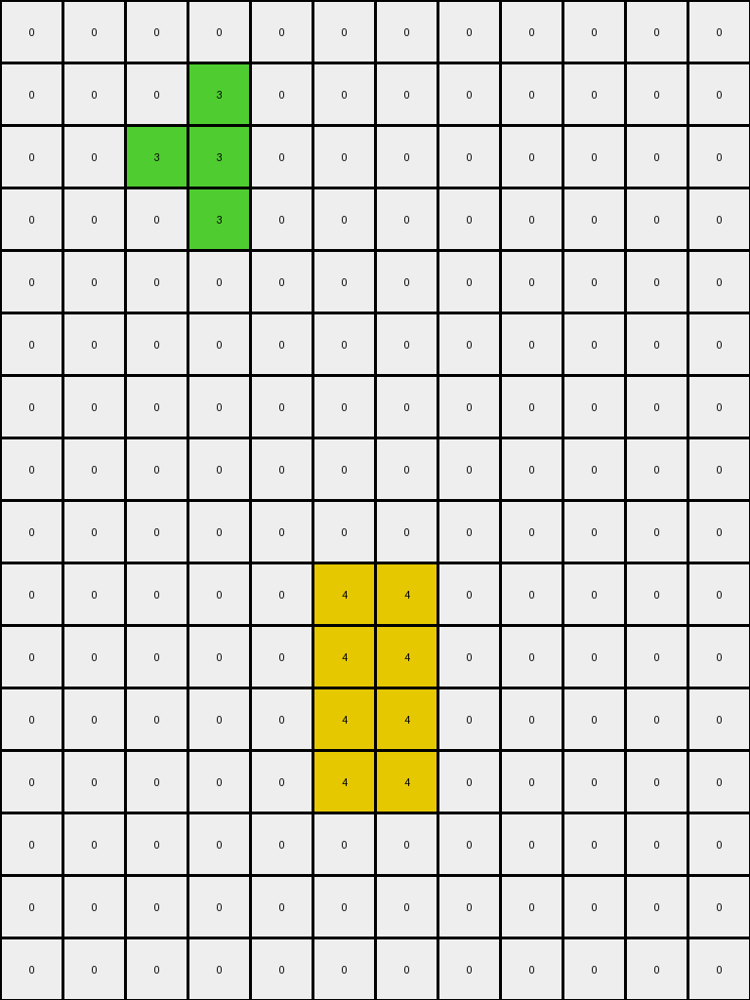
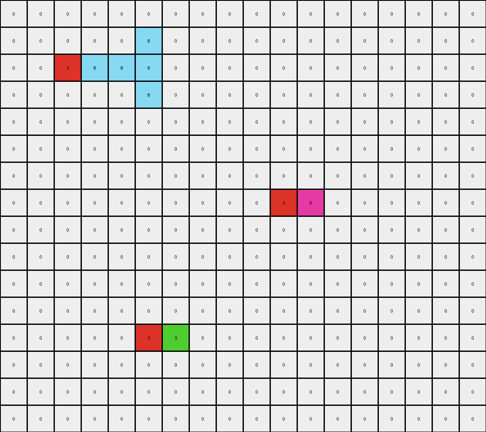
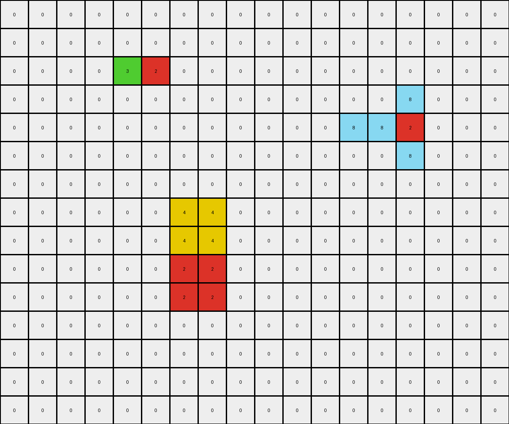

# 57aa92db • 003 • refine_dreamer

---


Previous Code:
```python
"""
1.  **Identify Objects:** Locate all contiguous blocks of non-zero pixels in the input grid. Consider each block an individual object.
2.  **Blue object Removal:**
    *   If a blue object is to the right of a green object: remove the blue object.
3.  **Yellow Expansion/Growth:**
    *   If a blue object is to the right of one or more yellow objects: remove the blue, and make the yellow object grow two pixels down.
"""

import numpy as np

def find_objects(grid):
    """Finds contiguous objects in a grid."""
    objects = []
    visited = np.zeros_like(grid, dtype=bool)

    def dfs(row, col, color, obj):
        """Depth-first search to find contiguous pixels of the same color."""
        if (
            row < 0
            or row >= grid.shape[0]
            or col < 0
            or col >= grid.shape[1]
            or visited[row, col]
            or grid[row, col] != color
        ):
            return
        visited[row, col] = True
        obj.append((row, col))
        dfs(row + 1, col, color, obj)
        dfs(row - 1, col, color, obj)
        dfs(row, col + 1, color, obj)
        dfs(row, col - 1, color, obj)

    for row in range(grid.shape[0]):
        for col in range(grid.shape[1]):
            if not visited[row, col] and grid[row, col] != 0:
                obj = []
                dfs(row, col, grid[row, col], obj)
                objects.append((grid[row, col], obj))  # Store color and object pixels
    return objects

def is_right_of(obj1_pixels, obj2_pixels):
    """Checks if obj1 is to the right of obj2."""
    for r1, c1 in obj1_pixels:
        for r2, c2 in obj2_pixels:
            if c1 == c2 + 1 and r1 == r2 :
                return True
    return False

def is_contact(obj1_pixels, obj2_pixels):
    """Checks if two sets of pixels are directly adjacent."""
    for r1, c1 in obj1_pixels:
        for r2, c2 in obj2_pixels:
             if (abs(r1 - r2) <= 1 and abs(c1 -c2) <=1) and (abs(r1 - r2) + abs(c1 -c2) == 1):
                return True
    return False


def transform(input_grid):
    # Initialize output_grid as a copy of the input grid
    output_grid = np.copy(input_grid)

    # Find all objects in the input grid
    objects = find_objects(input_grid)

    # Iterate through objects to apply transformation rules
    for color, obj_pixels in objects:
        if color == 1:  # Blue object
            for other_color, other_obj_pixels in objects:

                if other_color == 3:  # Green object
                    if is_contact(obj_pixels, other_obj_pixels):
                        for r, c in obj_pixels:
                           output_grid[r,c] = 0 # Remove blue
                if other_color == 4:
                    if is_right_of(obj_pixels, other_obj_pixels):

                        for r, c in obj_pixels:
                           output_grid[r,c] = 0 # Remove blue
                        # grow yellow
                        min_row = min(r for r, c in other_obj_pixels)
                        max_row = max(r for r, c in other_obj_pixels)
                        min_col = min(c for r, c in other_obj_pixels)
                        max_col = max(c for r, c in other_obj_pixels)

                        #grow down
                        if max_row + 2 < output_grid.shape[0]:
                            for col in range(min_col, max_col + 1):
                                    output_grid[max_row + 1, col] = 4
                                    output_grid[max_row + 2, col] = 4

    return output_grid
```

Train Set Results:

## Example 1:

Input:
```
0 0 0 0 0 0 0 0 0 0 0 0
0 0 0 3 0 0 0 0 0 0 0 0
0 0 3 3 1 0 0 0 0 0 0 0
0 0 0 3 0 0 0 0 0 0 0 0
0 0 0 0 0 0 0 0 0 0 0 0
0 0 0 0 0 0 0 0 0 0 0 0
0 0 0 0 0 0 0 0 0 0 0 0
0 0 0 0 0 0 0 0 0 0 0 0
0 0 0 0 0 0 0 0 0 0 0 0
0 0 0 0 0 4 4 1 1 0 0 0
0 0 0 0 0 4 4 1 1 0 0 0
0 0 0 0 0 0 0 0 0 0 0 0
0 0 0 0 0 0 0 0 0 0 0 0
0 0 0 0 0 0 0 0 0 0 0 0
0 0 0 0 0 0 0 0 0 0 0 0
0 0 0 0 0 0 0 0 0 0 0 0
```
Expected Output:
```
0 0 0 0 0 0 0 0 0 0 0 0
0 0 0 3 0 0 0 0 0 0 0 0
0 0 3 3 1 0 0 0 0 0 0 0
0 0 0 3 0 0 0 0 0 0 0 0
0 0 0 0 0 0 0 0 0 0 0 0
0 0 0 0 0 0 0 0 0 0 0 0
0 0 0 0 0 0 0 0 0 0 0 0
0 0 0 0 0 4 4 0 0 0 0 0
0 0 0 0 0 4 4 0 0 0 0 0
0 0 0 4 4 4 4 1 1 0 0 0
0 0 0 4 4 4 4 1 1 0 0 0
0 0 0 0 0 4 4 0 0 0 0 0
0 0 0 0 0 4 4 0 0 0 0 0
0 0 0 0 0 0 0 0 0 0 0 0
0 0 0 0 0 0 0 0 0 0 0 0
0 0 0 0 0 0 0 0 0 0 0 0
```
Transformed Output:
```
0 0 0 0 0 0 0 0 0 0 0 0
0 0 0 3 0 0 0 0 0 0 0 0
0 0 3 3 0 0 0 0 0 0 0 0
0 0 0 3 0 0 0 0 0 0 0 0
0 0 0 0 0 0 0 0 0 0 0 0
0 0 0 0 0 0 0 0 0 0 0 0
0 0 0 0 0 0 0 0 0 0 0 0
0 0 0 0 0 0 0 0 0 0 0 0
0 0 0 0 0 0 0 0 0 0 0 0
0 0 0 0 0 4 4 0 0 0 0 0
0 0 0 0 0 4 4 0 0 0 0 0
0 0 0 0 0 4 4 0 0 0 0 0
0 0 0 0 0 4 4 0 0 0 0 0
0 0 0 0 0 0 0 0 0 0 0 0
0 0 0 0 0 0 0 0 0 0 0 0
0 0 0 0 0 0 0 0 0 0 0 0
```

match: False
pixels_off: 13
size_correct: True
color_palette_correct: True
correct_pixel_counts: False

## Example 2:

Input:
```
0 0 0 0 0 0 0 0 0 0 0 0 0 0 0 0 0 0
0 0 0 0 0 8 0 0 0 0 0 0 0 0 0 0 0 0
0 0 2 8 8 8 0 0 0 0 0 0 0 0 0 0 0 0
0 0 0 0 0 8 0 0 0 0 0 0 0 0 0 0 0 0
0 0 0 0 0 0 0 0 0 0 0 0 0 0 0 0 0 0
0 0 0 0 0 0 0 0 0 0 0 0 0 0 0 0 0 0
0 0 0 0 0 0 0 0 0 0 0 0 0 0 0 0 0 0
0 0 0 0 0 0 0 0 0 0 2 6 0 0 0 0 0 0
0 0 0 0 0 0 0 0 0 0 0 0 0 0 0 0 0 0
0 0 0 0 0 0 0 0 0 0 0 0 0 0 0 0 0 0
0 0 0 0 0 0 0 0 0 0 0 0 0 0 0 0 0 0
0 0 0 0 0 0 0 0 0 0 0 0 0 0 0 0 0 0
0 0 0 0 0 2 3 0 0 0 0 0 0 0 0 0 0 0
0 0 0 0 0 0 0 0 0 0 0 0 0 0 0 0 0 0
0 0 0 0 0 0 0 0 0 0 0 0 0 0 0 0 0 0
0 0 0 0 0 0 0 0 0 0 0 0 0 0 0 0 0 0
```
Expected Output:
```
0 0 0 0 0 0 0 0 0 0 0 0 0 0 0 0 0 0
0 0 0 0 0 8 0 0 0 0 0 0 0 0 0 0 0 0
0 0 2 8 8 8 0 0 0 0 0 0 0 0 0 0 0 0
0 0 0 0 0 8 0 0 0 0 0 0 0 0 0 0 0 0
0 0 0 0 0 0 0 0 0 0 0 0 0 0 0 0 0 0
0 0 0 0 0 0 0 0 0 0 0 0 0 0 0 0 0 0
0 0 0 0 0 0 0 0 0 0 0 0 0 6 0 0 0 0
0 0 0 0 0 0 0 0 0 0 2 6 6 6 0 0 0 0
0 0 0 0 0 0 0 0 0 0 0 0 0 6 0 0 0 0
0 0 0 0 0 0 0 0 0 0 0 0 0 0 0 0 0 0
0 0 0 0 0 0 0 0 0 0 0 0 0 0 0 0 0 0
0 0 0 0 0 0 0 0 3 0 0 0 0 0 0 0 0 0
0 0 0 0 0 2 3 3 3 0 0 0 0 0 0 0 0 0
0 0 0 0 0 0 0 0 3 0 0 0 0 0 0 0 0 0
0 0 0 0 0 0 0 0 0 0 0 0 0 0 0 0 0 0
0 0 0 0 0 0 0 0 0 0 0 0 0 0 0 0 0 0
```
Transformed Output:
```
0 0 0 0 0 0 0 0 0 0 0 0 0 0 0 0 0 0
0 0 0 0 0 8 0 0 0 0 0 0 0 0 0 0 0 0
0 0 2 8 8 8 0 0 0 0 0 0 0 0 0 0 0 0
0 0 0 0 0 8 0 0 0 0 0 0 0 0 0 0 0 0
0 0 0 0 0 0 0 0 0 0 0 0 0 0 0 0 0 0
0 0 0 0 0 0 0 0 0 0 0 0 0 0 0 0 0 0
0 0 0 0 0 0 0 0 0 0 0 0 0 0 0 0 0 0
0 0 0 0 0 0 0 0 0 0 2 6 0 0 0 0 0 0
0 0 0 0 0 0 0 0 0 0 0 0 0 0 0 0 0 0
0 0 0 0 0 0 0 0 0 0 0 0 0 0 0 0 0 0
0 0 0 0 0 0 0 0 0 0 0 0 0 0 0 0 0 0
0 0 0 0 0 0 0 0 0 0 0 0 0 0 0 0 0 0
0 0 0 0 0 2 3 0 0 0 0 0 0 0 0 0 0 0
0 0 0 0 0 0 0 0 0 0 0 0 0 0 0 0 0 0
0 0 0 0 0 0 0 0 0 0 0 0 0 0 0 0 0 0
0 0 0 0 0 0 0 0 0 0 0 0 0 0 0 0 0 0
```

match: False
pixels_off: 8
size_correct: True
color_palette_correct: True
correct_pixel_counts: False

## Example 3:

Input:
```
0 0 0 0 0 0 0 0 0 0 0 0 0 0 0 0 0 0
0 0 0 0 0 0 0 0 0 0 0 0 0 0 0 0 0 0
0 0 1 1 1 0 0 0 0 0 0 0 0 0 0 0 0 0
0 0 1 4 1 0 0 0 0 0 0 0 0 0 0 0 0 0
0 0 1 0 1 0 0 0 0 0 0 0 0 0 0 0 0 0
0 0 0 0 0 0 0 0 0 0 0 0 0 0 0 0 0 0
0 0 0 0 0 0 0 0 0 0 0 0 0 0 0 0 0 0
0 0 0 0 0 0 0 0 0 8 8 8 0 0 0 0 0 0
0 0 0 0 0 0 0 0 0 8 8 8 0 0 0 0 0 0
0 0 0 0 0 0 0 0 0 8 8 8 0 0 0 0 0 0
0 0 0 0 0 0 0 0 0 4 4 4 0 0 0 0 0 0
0 0 0 0 0 0 0 0 0 4 4 4 0 0 0 0 0 0
0 0 0 0 0 0 0 0 0 4 4 4 0 0 0 0 0 0
0 0 0 0 0 0 0 0 0 0 0 0 0 0 0 0 0 0
0 0 0 0 0 0 0 0 0 0 0 0 0 0 0 0 0 0
0 0 0 0 0 0 0 0 0 0 0 0 0 0 0 0 0 0
0 0 0 0 0 0 0 0 0 0 0 0 0 0 0 0 0 0
```
Expected Output:
```
0 0 0 0 0 0 0 0 0 0 0 0 0 0 0 0 0 0
0 0 0 0 0 0 0 0 0 0 0 0 0 0 0 0 0 0
0 0 1 1 1 0 0 0 0 0 0 0 0 0 0 0 0 0
0 0 1 4 1 0 0 0 0 0 0 0 0 0 0 0 0 0
0 0 1 0 1 0 0 0 0 0 0 0 0 0 0 0 0 0
0 0 0 0 0 0 0 0 0 0 0 0 0 0 0 0 0 0
0 0 0 0 0 0 0 0 0 0 0 0 0 0 0 0 0 0
0 0 0 0 0 0 8 8 8 8 8 8 8 8 8 0 0 0
0 0 0 0 0 0 8 8 8 8 8 8 8 8 8 0 0 0
0 0 0 0 0 0 8 8 8 8 8 8 8 8 8 0 0 0
0 0 0 0 0 0 8 8 8 4 4 4 8 8 8 0 0 0
0 0 0 0 0 0 8 8 8 4 4 4 8 8 8 0 0 0
0 0 0 0 0 0 8 8 8 4 4 4 8 8 8 0 0 0
0 0 0 0 0 0 8 8 8 0 0 0 8 8 8 0 0 0
0 0 0 0 0 0 8 8 8 0 0 0 8 8 8 0 0 0
0 0 0 0 0 0 8 8 8 0 0 0 8 8 8 0 0 0
0 0 0 0 0 0 0 0 0 0 0 0 0 0 0 0 0 0
```
Transformed Output:
```
0 0 0 0 0 0 0 0 0 0 0 0 0 0 0 0 0 0
0 0 0 0 0 0 0 0 0 0 0 0 0 0 0 0 0 0
0 0 0 0 0 0 0 0 0 0 0 0 0 0 0 0 0 0
0 0 0 4 0 0 0 0 0 0 0 0 0 0 0 0 0 0
0 0 0 4 0 0 0 0 0 0 0 0 0 0 0 0 0 0
0 0 0 4 0 0 0 0 0 0 0 0 0 0 0 0 0 0
0 0 0 0 0 0 0 0 0 0 0 0 0 0 0 0 0 0
0 0 0 0 0 0 0 0 0 8 8 8 0 0 0 0 0 0
0 0 0 0 0 0 0 0 0 8 8 8 0 0 0 0 0 0
0 0 0 0 0 0 0 0 0 8 8 8 0 0 0 0 0 0
0 0 0 0 0 0 0 0 0 4 4 4 0 0 0 0 0 0
0 0 0 0 0 0 0 0 0 4 4 4 0 0 0 0 0 0
0 0 0 0 0 0 0 0 0 4 4 4 0 0 0 0 0 0
0 0 0 0 0 0 0 0 0 0 0 0 0 0 0 0 0 0
0 0 0 0 0 0 0 0 0 0 0 0 0 0 0 0 0 0
0 0 0 0 0 0 0 0 0 0 0 0 0 0 0 0 0 0
0 0 0 0 0 0 0 0 0 0 0 0 0 0 0 0 0 0
```

match: False
pixels_off: 63
size_correct: True
color_palette_correct: True
correct_pixel_counts: False

## Example 4:

Input:
```
0 0 0 0 0 0 0 0 0 0 0 0 0 0 0 0 0 0
0 0 0 0 0 0 0 0 0 0 0 0 0 0 0 0 0 0
0 0 0 0 3 2 0 0 0 0 0 0 0 0 0 0 0 0
0 0 0 0 0 0 0 0 0 0 0 0 0 0 8 0 0 0
0 0 0 0 0 0 0 0 0 0 0 0 8 8 2 0 0 0
0 0 0 0 0 0 0 0 0 0 0 0 0 0 8 0 0 0
0 0 0 0 0 0 0 0 0 0 0 0 0 0 0 0 0 0
0 0 0 0 0 0 4 4 0 0 0 0 0 0 0 0 0 0
0 0 0 0 0 0 4 4 0 0 0 0 0 0 0 0 0 0
0 0 0 0 0 0 2 2 0 0 0 0 0 0 0 0 0 0
0 0 0 0 0 0 2 2 0 0 0 0 0 0 0 0 0 0
0 0 0 0 0 0 0 0 0 0 0 0 0 0 0 0 0 0
0 0 0 0 0 0 0 0 0 0 0 0 0 0 0 0 0 0
0 0 0 0 0 0 0 0 0 0 0 0 0 0 0 0 0 0
0 0 0 0 0 0 0 0 0 0 0 0 0 0 0 0 0 0
```
Expected Output:
```
0 0 0 0 0 0 0 0 0 0 0 0 0 0 0 0 0 0
0 0 0 0 0 3 0 0 0 0 0 0 0 0 0 0 0 0
0 0 0 3 3 2 0 0 0 0 0 0 0 0 0 0 0 0
0 0 0 0 0 3 0 0 0 0 0 0 0 0 8 0 0 0
0 0 0 0 0 0 0 0 0 0 0 0 8 8 2 0 0 0
0 0 0 0 0 0 0 0 0 0 0 0 0 0 8 0 0 0
0 0 0 0 0 0 0 0 0 0 0 0 0 0 0 0 0 0
0 0 0 0 0 0 4 4 0 0 0 0 0 0 0 0 0 0
0 0 0 0 0 0 4 4 0 0 0 0 0 0 0 0 0 0
0 0 4 4 4 4 2 2 0 0 0 0 0 0 0 0 0 0
0 0 4 4 4 4 2 2 0 0 0 0 0 0 0 0 0 0
0 0 0 0 0 0 4 4 0 0 0 0 0 0 0 0 0 0
0 0 0 0 0 0 4 4 0 0 0 0 0 0 0 0 0 0
0 0 0 0 0 0 0 0 0 0 0 0 0 0 0 0 0 0
0 0 0 0 0 0 0 0 0 0 0 0 0 0 0 0 0 0
```
Transformed Output:
```
0 0 0 0 0 0 0 0 0 0 0 0 0 0 0 0 0 0
0 0 0 0 0 0 0 0 0 0 0 0 0 0 0 0 0 0
0 0 0 0 3 2 0 0 0 0 0 0 0 0 0 0 0 0
0 0 0 0 0 0 0 0 0 0 0 0 0 0 8 0 0 0
0 0 0 0 0 0 0 0 0 0 0 0 8 8 2 0 0 0
0 0 0 0 0 0 0 0 0 0 0 0 0 0 8 0 0 0
0 0 0 0 0 0 0 0 0 0 0 0 0 0 0 0 0 0
0 0 0 0 0 0 4 4 0 0 0 0 0 0 0 0 0 0
0 0 0 0 0 0 4 4 0 0 0 0 0 0 0 0 0 0
0 0 0 0 0 0 2 2 0 0 0 0 0 0 0 0 0 0
0 0 0 0 0 0 2 2 0 0 0 0 0 0 0 0 0 0
0 0 0 0 0 0 0 0 0 0 0 0 0 0 0 0 0 0
0 0 0 0 0 0 0 0 0 0 0 0 0 0 0 0 0 0
0 0 0 0 0 0 0 0 0 0 0 0 0 0 0 0 0 0
0 0 0 0 0 0 0 0 0 0 0 0 0 0 0 0 0 0
```

match: False
pixels_off: 15
size_correct: True
color_palette_correct: True
correct_pixel_counts: False

**INSTRUCTIONS**

The code above was generated based on observations from the first training
example

we have tested the transform function on each of the task example inputs and
compared with the expected output

review each of the examples provided and the results and consider how the
natural language program should be updated to accommodate this new knowledge

respond with the following deliverables:

- general assessment of the information provided and strategy for resolving the
  errors
- gather metrics about each of the examples and results - use code_execution to
  develop accurate reports on your assumptions
- a YAML block documenting facts - Focus on identifying objects, their properties, and the actions performed on them.
- a natural language program - Be as clear and concise as possible, providing a complete description of the transformation rule.


your responses should be considered as information in a report - not a
conversation
