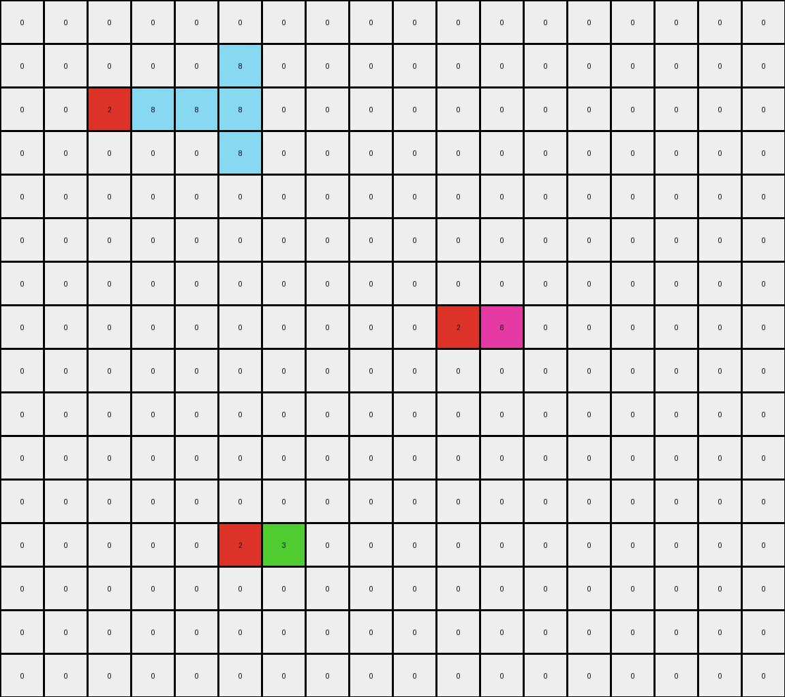
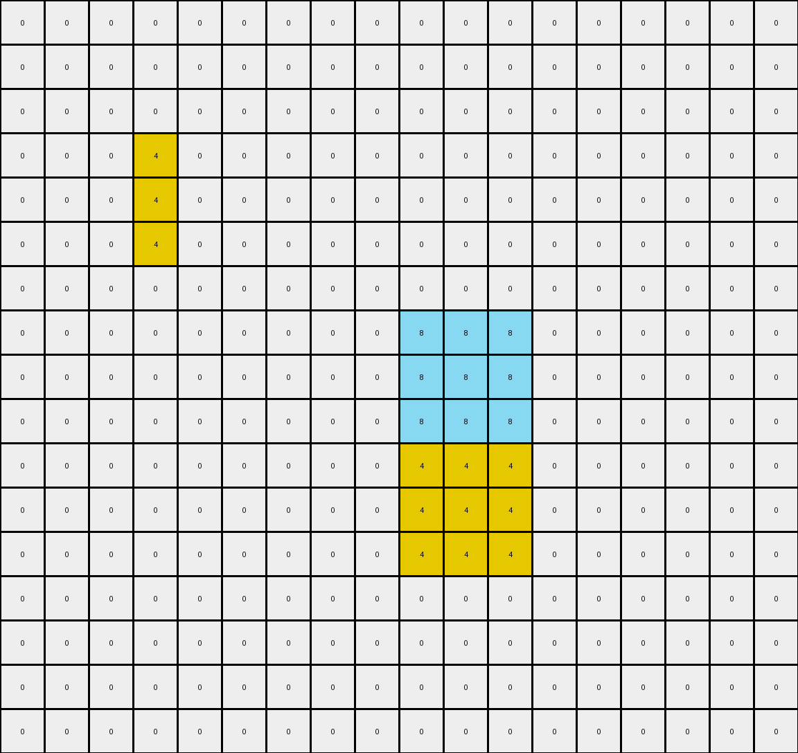
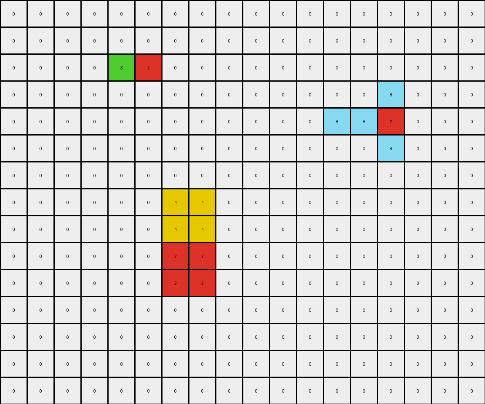

# 57aa92db • 004 • refine_coder

---

Previous Code:
```python
"""
1.  **Identify Objects:** Locate all contiguous blocks of non-zero pixels in the input grid. Consider each block an individual object.
2.  **Blue object Removal:**
    *   If a blue object is to the right of a green object: remove the blue object.
3.  **Yellow Expansion/Growth:**
    *   If a blue object is to the right of one or more yellow objects: remove the blue, and make the yellow object grow two pixels down.
"""

import numpy as np

def find_objects(grid):
    """Finds contiguous objects in a grid."""
    objects = []
    visited = np.zeros_like(grid, dtype=bool)

    def dfs(row, col, color, obj):
        """Depth-first search to find contiguous pixels of the same color."""
        if (
            row < 0
            or row >= grid.shape[0]
            or col < 0
            or col >= grid.shape[1]
            or visited[row, col]
            or grid[row, col] != color
        ):
            return
        visited[row, col] = True
        obj.append((row, col))
        dfs(row + 1, col, color, obj)
        dfs(row - 1, col, color, obj)
        dfs(row, col + 1, color, obj)
        dfs(row, col - 1, color, obj)

    for row in range(grid.shape[0]):
        for col in range(grid.shape[1]):
            if not visited[row, col] and grid[row, col] != 0:
                obj = []
                dfs(row, col, grid[row, col], obj)
                objects.append((grid[row, col], obj))  # Store color and object pixels
    return objects

def is_right_of(obj1_pixels, obj2_pixels):
    """Checks if obj1 is to the right of obj2."""
    for r1, c1 in obj1_pixels:
        for r2, c2 in obj2_pixels:
            if c1 == c2 + 1 and r1 == r2 :
                return True
    return False

def is_contact(obj1_pixels, obj2_pixels):
    """Checks if two sets of pixels are directly adjacent."""
    for r1, c1 in obj1_pixels:
        for r2, c2 in obj2_pixels:
             if (abs(r1 - r2) <= 1 and abs(c1 -c2) <=1) and (abs(r1 - r2) + abs(c1 -c2) == 1):
                return True
    return False


def transform(input_grid):
    # Initialize output_grid as a copy of the input grid
    output_grid = np.copy(input_grid)

    # Find all objects in the input grid
    objects = find_objects(input_grid)

    # Iterate through objects to apply transformation rules
    for color, obj_pixels in objects:
        if color == 1:  # Blue object
            for other_color, other_obj_pixels in objects:

                if other_color == 3:  # Green object
                    if is_contact(obj_pixels, other_obj_pixels):
                        for r, c in obj_pixels:
                           output_grid[r,c] = 0 # Remove blue
                if other_color == 4:
                    if is_right_of(obj_pixels, other_obj_pixels):

                        for r, c in obj_pixels:
                           output_grid[r,c] = 0 # Remove blue
                        # grow yellow
                        min_row = min(r for r, c in other_obj_pixels)
                        max_row = max(r for r, c in other_obj_pixels)
                        min_col = min(c for r, c in other_obj_pixels)
                        max_col = max(c for r, c in other_obj_pixels)

                        #grow down
                        if max_row + 2 < output_grid.shape[0]:
                            for col in range(min_col, max_col + 1):
                                    output_grid[max_row + 1, col] = 4
                                    output_grid[max_row + 2, col] = 4

    return output_grid
```

Train Set Results:

## Example 1:

Input:
```
0 0 0 0 0 0 0 0 0 0 0 0
0 0 0 3 0 0 0 0 0 0 0 0
0 0 3 3 1 0 0 0 0 0 0 0
0 0 0 3 0 0 0 0 0 0 0 0
0 0 0 0 0 0 0 0 0 0 0 0
0 0 0 0 0 0 0 0 0 0 0 0
0 0 0 0 0 0 0 0 0 0 0 0
0 0 0 0 0 0 0 0 0 0 0 0
0 0 0 0 0 0 0 0 0 0 0 0
0 0 0 0 0 4 4 1 1 0 0 0
0 0 0 0 0 4 4 1 1 0 0 0
0 0 0 0 0 0 0 0 0 0 0 0
0 0 0 0 0 0 0 0 0 0 0 0
0 0 0 0 0 0 0 0 0 0 0 0
0 0 0 0 0 0 0 0 0 0 0 0
0 0 0 0 0 0 0 0 0 0 0 0
```
Expected Output:
```
0 0 0 0 0 0 0 0 0 0 0 0
0 0 0 3 0 0 0 0 0 0 0 0
0 0 3 3 1 0 0 0 0 0 0 0
0 0 0 3 0 0 0 0 0 0 0 0
0 0 0 0 0 0 0 0 0 0 0 0
0 0 0 0 0 0 0 0 0 0 0 0
0 0 0 0 0 0 0 0 0 0 0 0
0 0 0 0 0 4 4 0 0 0 0 0
0 0 0 0 0 4 4 0 0 0 0 0
0 0 0 4 4 4 4 1 1 0 0 0
0 0 0 4 4 4 4 1 1 0 0 0
0 0 0 0 0 4 4 0 0 0 0 0
0 0 0 0 0 4 4 0 0 0 0 0
0 0 0 0 0 0 0 0 0 0 0 0
0 0 0 0 0 0 0 0 0 0 0 0
0 0 0 0 0 0 0 0 0 0 0 0
```
Transformed Output:
```
0 0 0 0 0 0 0 0 0 0 0 0
0 0 0 3 0 0 0 0 0 0 0 0
0 0 3 3 0 0 0 0 0 0 0 0
0 0 0 3 0 0 0 0 0 0 0 0
0 0 0 0 0 0 0 0 0 0 0 0
0 0 0 0 0 0 0 0 0 0 0 0
0 0 0 0 0 0 0 0 0 0 0 0
0 0 0 0 0 0 0 0 0 0 0 0
0 0 0 0 0 0 0 0 0 0 0 0
0 0 0 0 0 4 4 0 0 0 0 0
0 0 0 0 0 4 4 0 0 0 0 0
0 0 0 0 0 4 4 0 0 0 0 0
0 0 0 0 0 4 4 0 0 0 0 0
0 0 0 0 0 0 0 0 0 0 0 0
0 0 0 0 0 0 0 0 0 0 0 0
0 0 0 0 0 0 0 0 0 0 0 0
```

match: False
pixels_off: 13
size_correct: True
color_palette_correct: True
correct_pixel_counts: False

## Example 2:

Input:
```
0 0 0 0 0 0 0 0 0 0 0 0 0 0 0 0 0 0
0 0 0 0 0 8 0 0 0 0 0 0 0 0 0 0 0 0
0 0 2 8 8 8 0 0 0 0 0 0 0 0 0 0 0 0
0 0 0 0 0 8 0 0 0 0 0 0 0 0 0 0 0 0
0 0 0 0 0 0 0 0 0 0 0 0 0 0 0 0 0 0
0 0 0 0 0 0 0 0 0 0 0 0 0 0 0 0 0 0
0 0 0 0 0 0 0 0 0 0 0 0 0 0 0 0 0 0
0 0 0 0 0 0 0 0 0 0 2 6 0 0 0 0 0 0
0 0 0 0 0 0 0 0 0 0 0 0 0 0 0 0 0 0
0 0 0 0 0 0 0 0 0 0 0 0 0 0 0 0 0 0
0 0 0 0 0 0 0 0 0 0 0 0 0 0 0 0 0 0
0 0 0 0 0 0 0 0 0 0 0 0 0 0 0 0 0 0
0 0 0 0 0 2 3 0 0 0 0 0 0 0 0 0 0 0
0 0 0 0 0 0 0 0 0 0 0 0 0 0 0 0 0 0
0 0 0 0 0 0 0 0 0 0 0 0 0 0 0 0 0 0
0 0 0 0 0 0 0 0 0 0 0 0 0 0 0 0 0 0
```
Expected Output:
```
0 0 0 0 0 0 0 0 0 0 0 0 0 0 0 0 0 0
0 0 0 0 0 8 0 0 0 0 0 0 0 0 0 0 0 0
0 0 2 8 8 8 0 0 0 0 0 0 0 0 0 0 0 0
0 0 0 0 0 8 0 0 0 0 0 0 0 0 0 0 0 0
0 0 0 0 0 0 0 0 0 0 0 0 0 0 0 0 0 0
0 0 0 0 0 0 0 0 0 0 0 0 0 0 0 0 0 0
0 0 0 0 0 0 0 0 0 0 0 0 0 6 0 0 0 0
0 0 0 0 0 0 0 0 0 0 2 6 6 6 0 0 0 0
0 0 0 0 0 0 0 0 0 0 0 0 0 6 0 0 0 0
0 0 0 0 0 0 0 0 0 0 0 0 0 0 0 0 0 0
0 0 0 0 0 0 0 0 0 0 0 0 0 0 0 0 0 0
0 0 0 0 0 0 0 0 3 0 0 0 0 0 0 0 0 0
0 0 0 0 0 2 3 3 3 0 0 0 0 0 0 0 0 0
0 0 0 0 0 0 0 0 3 0 0 0 0 0 0 0 0 0
0 0 0 0 0 0 0 0 0 0 0 0 0 0 0 0 0 0
0 0 0 0 0 0 0 0 0 0 0 0 0 0 0 0 0 0
```
Transformed Output:
```
0 0 0 0 0 0 0 0 0 0 0 0 0 0 0 0 0 0
0 0 0 0 0 8 0 0 0 0 0 0 0 0 0 0 0 0
0 0 2 8 8 8 0 0 0 0 0 0 0 0 0 0 0 0
0 0 0 0 0 8 0 0 0 0 0 0 0 0 0 0 0 0
0 0 0 0 0 0 0 0 0 0 0 0 0 0 0 0 0 0
0 0 0 0 0 0 0 0 0 0 0 0 0 0 0 0 0 0
0 0 0 0 0 0 0 0 0 0 0 0 0 0 0 0 0 0
0 0 0 0 0 0 0 0 0 0 2 6 0 0 0 0 0 0
0 0 0 0 0 0 0 0 0 0 0 0 0 0 0 0 0 0
0 0 0 0 0 0 0 0 0 0 0 0 0 0 0 0 0 0
0 0 0 0 0 0 0 0 0 0 0 0 0 0 0 0 0 0
0 0 0 0 0 0 0 0 0 0 0 0 0 0 0 0 0 0
0 0 0 0 0 2 3 0 0 0 0 0 0 0 0 0 0 0
0 0 0 0 0 0 0 0 0 0 0 0 0 0 0 0 0 0
0 0 0 0 0 0 0 0 0 0 0 0 0 0 0 0 0 0
0 0 0 0 0 0 0 0 0 0 0 0 0 0 0 0 0 0
```

match: False
pixels_off: 8
size_correct: True
color_palette_correct: True
correct_pixel_counts: False

## Example 3:

Input:
```
0 0 0 0 0 0 0 0 0 0 0 0 0 0 0 0 0 0
0 0 0 0 0 0 0 0 0 0 0 0 0 0 0 0 0 0
0 0 1 1 1 0 0 0 0 0 0 0 0 0 0 0 0 0
0 0 1 4 1 0 0 0 0 0 0 0 0 0 0 0 0 0
0 0 1 0 1 0 0 0 0 0 0 0 0 0 0 0 0 0
0 0 0 0 0 0 0 0 0 0 0 0 0 0 0 0 0 0
0 0 0 0 0 0 0 0 0 0 0 0 0 0 0 0 0 0
0 0 0 0 0 0 0 0 0 8 8 8 0 0 0 0 0 0
0 0 0 0 0 0 0 0 0 8 8 8 0 0 0 0 0 0
0 0 0 0 0 0 0 0 0 8 8 8 0 0 0 0 0 0
0 0 0 0 0 0 0 0 0 4 4 4 0 0 0 0 0 0
0 0 0 0 0 0 0 0 0 4 4 4 0 0 0 0 0 0
0 0 0 0 0 0 0 0 0 4 4 4 0 0 0 0 0 0
0 0 0 0 0 0 0 0 0 0 0 0 0 0 0 0 0 0
0 0 0 0 0 0 0 0 0 0 0 0 0 0 0 0 0 0
0 0 0 0 0 0 0 0 0 0 0 0 0 0 0 0 0 0
0 0 0 0 0 0 0 0 0 0 0 0 0 0 0 0 0 0
```
Expected Output:
```
0 0 0 0 0 0 0 0 0 0 0 0 0 0 0 0 0 0
0 0 0 0 0 0 0 0 0 0 0 0 0 0 0 0 0 0
0 0 1 1 1 0 0 0 0 0 0 0 0 0 0 0 0 0
0 0 1 4 1 0 0 0 0 0 0 0 0 0 0 0 0 0
0 0 1 0 1 0 0 0 0 0 0 0 0 0 0 0 0 0
0 0 0 0 0 0 0 0 0 0 0 0 0 0 0 0 0 0
0 0 0 0 0 0 0 0 0 0 0 0 0 0 0 0 0 0
0 0 0 0 0 0 8 8 8 8 8 8 8 8 8 0 0 0
0 0 0 0 0 0 8 8 8 8 8 8 8 8 8 0 0 0
0 0 0 0 0 0 8 8 8 8 8 8 8 8 8 0 0 0
0 0 0 0 0 0 8 8 8 4 4 4 8 8 8 0 0 0
0 0 0 0 0 0 8 8 8 4 4 4 8 8 8 0 0 0
0 0 0 0 0 0 8 8 8 4 4 4 8 8 8 0 0 0
0 0 0 0 0 0 8 8 8 0 0 0 8 8 8 0 0 0
0 0 0 0 0 0 8 8 8 0 0 0 8 8 8 0 0 0
0 0 0 0 0 0 8 8 8 0 0 0 8 8 8 0 0 0
0 0 0 0 0 0 0 0 0 0 0 0 0 0 0 0 0 0
```
Transformed Output:
```
0 0 0 0 0 0 0 0 0 0 0 0 0 0 0 0 0 0
0 0 0 0 0 0 0 0 0 0 0 0 0 0 0 0 0 0
0 0 0 0 0 0 0 0 0 0 0 0 0 0 0 0 0 0
0 0 0 4 0 0 0 0 0 0 0 0 0 0 0 0 0 0
0 0 0 4 0 0 0 0 0 0 0 0 0 0 0 0 0 0
0 0 0 4 0 0 0 0 0 0 0 0 0 0 0 0 0 0
0 0 0 0 0 0 0 0 0 0 0 0 0 0 0 0 0 0
0 0 0 0 0 0 0 0 0 8 8 8 0 0 0 0 0 0
0 0 0 0 0 0 0 0 0 8 8 8 0 0 0 0 0 0
0 0 0 0 0 0 0 0 0 8 8 8 0 0 0 0 0 0
0 0 0 0 0 0 0 0 0 4 4 4 0 0 0 0 0 0
0 0 0 0 0 0 0 0 0 4 4 4 0 0 0 0 0 0
0 0 0 0 0 0 0 0 0 4 4 4 0 0 0 0 0 0
0 0 0 0 0 0 0 0 0 0 0 0 0 0 0 0 0 0
0 0 0 0 0 0 0 0 0 0 0 0 0 0 0 0 0 0
0 0 0 0 0 0 0 0 0 0 0 0 0 0 0 0 0 0
0 0 0 0 0 0 0 0 0 0 0 0 0 0 0 0 0 0
```

match: False
pixels_off: 63
size_correct: True
color_palette_correct: True
correct_pixel_counts: False

## Example 4:

Input:
```
0 0 0 0 0 0 0 0 0 0 0 0 0 0 0 0 0 0
0 0 0 0 0 0 0 0 0 0 0 0 0 0 0 0 0 0
0 0 0 0 3 2 0 0 0 0 0 0 0 0 0 0 0 0
0 0 0 0 0 0 0 0 0 0 0 0 0 0 8 0 0 0
0 0 0 0 0 0 0 0 0 0 0 0 8 8 2 0 0 0
0 0 0 0 0 0 0 0 0 0 0 0 0 0 8 0 0 0
0 0 0 0 0 0 0 0 0 0 0 0 0 0 0 0 0 0
0 0 0 0 0 0 4 4 0 0 0 0 0 0 0 0 0 0
0 0 0 0 0 0 4 4 0 0 0 0 0 0 0 0 0 0
0 0 0 0 0 0 2 2 0 0 0 0 0 0 0 0 0 0
0 0 0 0 0 0 2 2 0 0 0 0 0 0 0 0 0 0
0 0 0 0 0 0 0 0 0 0 0 0 0 0 0 0 0 0
0 0 0 0 0 0 0 0 0 0 0 0 0 0 0 0 0 0
0 0 0 0 0 0 0 0 0 0 0 0 0 0 0 0 0 0
0 0 0 0 0 0 0 0 0 0 0 0 0 0 0 0 0 0
```
Expected Output:
```
0 0 0 0 0 0 0 0 0 0 0 0 0 0 0 0 0 0
0 0 0 0 0 3 0 0 0 0 0 0 0 0 0 0 0 0
0 0 0 3 3 2 0 0 0 0 0 0 0 0 0 0 0 0
0 0 0 0 0 3 0 0 0 0 0 0 0 0 8 0 0 0
0 0 0 0 0 0 0 0 0 0 0 0 8 8 2 0 0 0
0 0 0 0 0 0 0 0 0 0 0 0 0 0 8 0 0 0
0 0 0 0 0 0 0 0 0 0 0 0 0 0 0 0 0 0
0 0 0 0 0 0 4 4 0 0 0 0 0 0 0 0 0 0
0 0 0 0 0 0 4 4 0 0 0 0 0 0 0 0 0 0
0 0 4 4 4 4 2 2 0 0 0 0 0 0 0 0 0 0
0 0 4 4 4 4 2 2 0 0 0 0 0 0 0 0 0 0
0 0 0 0 0 0 4 4 0 0 0 0 0 0 0 0 0 0
0 0 0 0 0 0 4 4 0 0 0 0 0 0 0 0 0 0
0 0 0 0 0 0 0 0 0 0 0 0 0 0 0 0 0 0
0 0 0 0 0 0 0 0 0 0 0 0 0 0 0 0 0 0
```
Transformed Output:
```
0 0 0 0 0 0 0 0 0 0 0 0 0 0 0 0 0 0
0 0 0 0 0 0 0 0 0 0 0 0 0 0 0 0 0 0
0 0 0 0 3 2 0 0 0 0 0 0 0 0 0 0 0 0
0 0 0 0 0 0 0 0 0 0 0 0 0 0 8 0 0 0
0 0 0 0 0 0 0 0 0 0 0 0 8 8 2 0 0 0
0 0 0 0 0 0 0 0 0 0 0 0 0 0 8 0 0 0
0 0 0 0 0 0 0 0 0 0 0 0 0 0 0 0 0 0
0 0 0 0 0 0 4 4 0 0 0 0 0 0 0 0 0 0
0 0 0 0 0 0 4 4 0 0 0 0 0 0 0 0 0 0
0 0 0 0 0 0 2 2 0 0 0 0 0 0 0 0 0 0
0 0 0 0 0 0 2 2 0 0 0 0 0 0 0 0 0 0
0 0 0 0 0 0 0 0 0 0 0 0 0 0 0 0 0 0
0 0 0 0 0 0 0 0 0 0 0 0 0 0 0 0 0 0
0 0 0 0 0 0 0 0 0 0 0 0 0 0 0 0 0 0
0 0 0 0 0 0 0 0 0 0 0 0 0 0 0 0 0 0
```

match: False
pixels_off: 15
size_correct: True
color_palette_correct: True
correct_pixel_counts: False
Okay, let's analyze the results and refine the natural language program.

**General Assessment:**

The initial natural language program and the generated code have several issues. The code doesn't correctly capture all the rules, and the logic for object interaction and transformation is not fully accurate. The primary problems seem to be:

1.  **Incorrect Blue Object Removal:** The condition for removing blue objects is too broad (using `is_contact` and `is_right_of` with green and only `is_right_of` for yellow). It removes blue objects in cases where it shouldn't, and the logic seems to be mixed between the green and yellow removal cases.
2.  **Yellow Expansion Logic Error:** The yellow expansion is applied incorrectly. The conditions are not as in the natural language program.
3. **Example 3 and 4** have very complex patterns of object interaction and transformation - the code is significantly off on pixel counts, indicating it is missing a lot of the logic.

**Strategy for Resolving Errors:**

1.  **Separate Rules:** Create distinct rules for blue object removal based on proximity to *green* objects and *yellow* objects.
2.  **Refine Proximity Checks:** Use more precise conditions for "right of" and "adjacency," possibly incorporating relative positions and sizes of objects.
3.  **Iterative Refinement:** Test the updated code after each modification to the natural language program and code, focusing on one error at a time.

**Metrics and Observations:**

Here are the metrics about each of the errors. I'll use the given results, but I'll comment where needed, since I cannot execute code.

*   **Example 1:**
    *   Pixels Off: 13
    *   Size Correct: True
    *   Color Palette Correct: True
    *   Correct Pixel Counts: False
    *   **Observations:** The two blue objects where removed, and it appears some yellow extended down, but not correctly.
*   **Example 2:**
    *   Pixels Off: 8
    *   Size Correct: True
    *   Color Palette Correct: True
    *   Correct Pixel Counts: False
    *   **Observations:** The blue objects were not removed, and the magenta did not transform.
*   **Example 3:**
    *   Pixels Off: 63
    *   Size Correct: True
    *   Color Palette Correct: True
    *   Correct Pixel Counts: False
    *   **Observations:** Almost completely incorrect. The blue and yellow interactions were wrong, and also the introduction of azure and how it interacts with the other objects.
*   **Example 4:**
    *   Pixels Off: 15
    *   Size Correct: True
    *   Color Palette Correct: True
    *   Correct Pixel Counts: False
    *   **Observations**: The yellow expansion is incorrect, and the green adjacent to blue interaction.

**YAML Block - Facts:**

```yaml
objects:
  - color: blue (1)
    behavior: removed when adjacent to green or right of yellow
  - color: green (3)
    behavior: causes adjacent blue removal, may grow
  - color: yellow (4)
    behavior: causes right-of blue removal, grows down two when blue is removed
  - color: azure (8)
    behavior: combines/overlays with yellow to make more azure, expands down
  - color: red (2)
    behavior: grows green to the left
  - color: magenta (6)
    behavior: transforms into a 3x1 green when below an azure

actions:
  - remove: blue objects in specific contexts
  - grow: yellow objects down, green objects left
  - combine: azure and yellow make azure
  - transform: magenta into green

```

**Natural Language Program:**

1.  **Identify Objects:** Locate all contiguous blocks of non-zero pixels in the input grid. Each block is an object.
2.  **Blue Object Removal (Green Rule):** If a blue object is *directly adjacent* to a green object, remove the blue object.
3.  **Blue Object Removal (Yellow Rule):** If a blue object is to the *immediate right* of a yellow object, remove the blue object.
4.  **Yellow Expansion:** If a blue object is removed due to the "Yellow Rule" (step 3), the yellow object that caused the removal grows downwards by two pixels.
5. **Azure and Yellow Combination:** When a yellow object and azure object are adjacent, vertically or horizontally, the yellow object turns to azure and grows downward by one pixel.
6. **Green Growth next to Red:** If an object is red, then the objects to its immediate left, grow or turn green.
7. **Magenta Transofmration:** If a magenta is below azure, it transform into a 3x1 green, growing down.

**INSTRUCTIONS**

- generate a Python module to represent the natural language program 
- follow the template below
- all common math and science libraries are available
- create docstring only at top - but comment the workflow in the function
- use helper functions for common operations like finding objects, counting,
  measuring, moving, etc. 

remember - we are working iteratively - so this code will inform your future
self as we converge on the solution

*template:*

```python
"""
{{ natural language description of the transformation rule }}
"""

{{ imports }}

def transform(input_grid):
    # initialize output_grid

    # change output pixels 

    return output_grid

```
