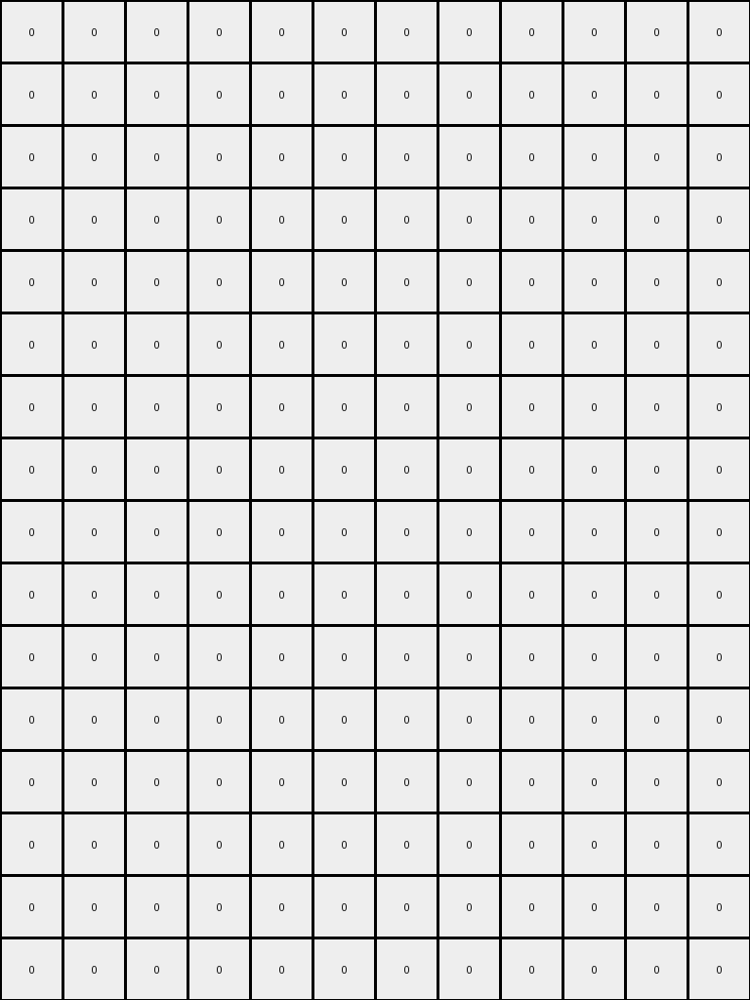

# 57aa92db • 016 • refine_coder

---

Previous Code:
```python
"""
The transformation preserves a small blue/yellow structure in the top-left while expanding a larger azure/yellow structure in the bottom-right. The yellow pixels within the larger structure maintain their relative positions within the expanded azure region.
"""

import numpy as np

def find_object(grid, color):
    # Find objects (contiguous regions of a specific color)
    mask = (grid == color)
    if not np.any(mask):
      return []

    rows, cols = np.where(mask)
    min_row, max_row = np.min(rows), np.max(rows)
    min_col, max_col = np.min(cols), np.max(cols)

    objects = []
    visited = set()

    def dfs(row, col):
        if (row, col) in visited or not (0 <= row < grid.shape[0] and 0 <= col < grid.shape[1]) or not mask[row, col]:
            return []
        visited.add((row, col))
        region = [(row, col)]
        for dr, dc in [(0, 1), (1, 0), (0, -1), (-1, 0)]:
            region.extend(dfs(row + dr, col + dc))
        return region

    for r, c in zip(rows, cols):
        if (r, c) not in visited:
            objects.append(dfs(r, c))

    return objects

def get_object_bounds(obj):
    rows, cols = zip(*obj)
    min_row, max_row = np.min(rows), np.max(rows)
    min_col, max_col = np.min(cols), np.max(cols)
    return min_row, max_row, min_col, max_col

def transform(input_grid):
    # Initialize output_grid with zeros and the same dimensions as the input.
    output_grid = np.zeros_like(input_grid)

    # Find shape1 (blue object with internal yellow)
    blue_objects = find_object(input_grid, 1)
    shape1 = None
    for obj in blue_objects:
      min_row, max_row, min_col, max_col = get_object_bounds(obj)
      for r in range(min_row, max_row+1):
        for c in range(min_col, max_col+1):
          if input_grid[r][c] == 4:
            shape1 = obj
            break
        if shape1:
          break
      if shape1:
        break

    # Maintain shape1
    if shape1:
      for r, c in shape1:
        output_grid[r, c] = input_grid[r, c]


    # Find shape2 (azure object)
    azure_objects = find_object(input_grid, 8)
    shape2 = None
    #find biggest object
    max_size = 0
    for obj in azure_objects:
      size = len(obj)
      if size > max_size:
        max_size = size
        shape2 = obj


    if shape2:
      #get bounds
      min_row, max_row, min_col, max_col = get_object_bounds(shape2)

      # Find yellow pixels within shape2
      yellow_pixels = []
      for r in range(min_row, max_row + 1):
          for c in range(min_col, max_col + 1):
              if input_grid[r, c] == 4:
                  yellow_pixels.append((r, c))

      # Expand and combine shape2
      # Determine new boundaries based on padding and existing yellow pixels
      
      new_min_row = min_row
      while new_min_row > 0 and (min_row-new_min_row) < 3:
        new_min_row -=1
      new_min_col = min_col
      while new_min_col > 0 and (min_col-new_min_col) < 2:
          new_min_col -=1
      
      new_max_col = max_col
      while new_max_col < input_grid.shape[1]-1 and (new_max_col - max_col) < 2:
        new_max_col += 1

      new_max_row = 15
      new_max_col = max(new_max_col, 14)

      #fill with azure
      for r in range(new_min_row, new_max_row + 1):
          for c in range(new_min_col, new_max_col + 1):
              output_grid[r, c] = 8

      # fill yellow pixels
      for r, c in yellow_pixels:
          new_r = r + (new_min_row - min_row)
          new_c = c + (new_min_col - min_col)
          if 0 <= new_r < output_grid.shape[0] and 0<= new_c < output_grid.shape[1]:
            output_grid[new_r, new_c] = 4
          

    return output_grid
```

Train Set Results:

## Example 1:

Input:
```
0 0 0 0 0 0 0 0 0 0 0 0
0 0 0 3 0 0 0 0 0 0 0 0
0 0 3 3 1 0 0 0 0 0 0 0
0 0 0 3 0 0 0 0 0 0 0 0
0 0 0 0 0 0 0 0 0 0 0 0
0 0 0 0 0 0 0 0 0 0 0 0
0 0 0 0 0 0 0 0 0 0 0 0
0 0 0 0 0 0 0 0 0 0 0 0
0 0 0 0 0 0 0 0 0 0 0 0
0 0 0 0 0 4 4 1 1 0 0 0
0 0 0 0 0 4 4 1 1 0 0 0
0 0 0 0 0 0 0 0 0 0 0 0
0 0 0 0 0 0 0 0 0 0 0 0
0 0 0 0 0 0 0 0 0 0 0 0
0 0 0 0 0 0 0 0 0 0 0 0
0 0 0 0 0 0 0 0 0 0 0 0
```
Expected Output:
```
0 0 0 0 0 0 0 0 0 0 0 0
0 0 0 3 0 0 0 0 0 0 0 0
0 0 3 3 1 0 0 0 0 0 0 0
0 0 0 3 0 0 0 0 0 0 0 0
0 0 0 0 0 0 0 0 0 0 0 0
0 0 0 0 0 0 0 0 0 0 0 0
0 0 0 0 0 0 0 0 0 0 0 0
0 0 0 0 0 4 4 0 0 0 0 0
0 0 0 0 0 4 4 0 0 0 0 0
0 0 0 4 4 4 4 1 1 0 0 0
0 0 0 4 4 4 4 1 1 0 0 0
0 0 0 0 0 4 4 0 0 0 0 0
0 0 0 0 0 4 4 0 0 0 0 0
0 0 0 0 0 0 0 0 0 0 0 0
0 0 0 0 0 0 0 0 0 0 0 0
0 0 0 0 0 0 0 0 0 0 0 0
```
Transformed Output:
```
0 0 0 0 0 0 0 0 0 0 0 0
0 0 0 0 0 0 0 0 0 0 0 0
0 0 0 0 0 0 0 0 0 0 0 0
0 0 0 0 0 0 0 0 0 0 0 0
0 0 0 0 0 0 0 0 0 0 0 0
0 0 0 0 0 0 0 0 0 0 0 0
0 0 0 0 0 0 0 0 0 0 0 0
0 0 0 0 0 0 0 0 0 0 0 0
0 0 0 0 0 0 0 0 0 0 0 0
0 0 0 0 0 0 0 0 0 0 0 0
0 0 0 0 0 0 0 0 0 0 0 0
0 0 0 0 0 0 0 0 0 0 0 0
0 0 0 0 0 0 0 0 0 0 0 0
0 0 0 0 0 0 0 0 0 0 0 0
0 0 0 0 0 0 0 0 0 0 0 0
0 0 0 0 0 0 0 0 0 0 0 0
```

match: False
pixels_off: 25
size_correct: True
color_palette_correct: True
correct_pixel_counts: False

## Example 2:

Input:
```
0 0 0 0 0 0 0 0 0 0 0 0 0 0 0 0 0 0
0 0 0 0 0 8 0 0 0 0 0 0 0 0 0 0 0 0
0 0 2 8 8 8 0 0 0 0 0 0 0 0 0 0 0 0
0 0 0 0 0 8 0 0 0 0 0 0 0 0 0 0 0 0
0 0 0 0 0 0 0 0 0 0 0 0 0 0 0 0 0 0
0 0 0 0 0 0 0 0 0 0 0 0 0 0 0 0 0 0
0 0 0 0 0 0 0 0 0 0 0 0 0 0 0 0 0 0
0 0 0 0 0 0 0 0 0 0 2 6 0 0 0 0 0 0
0 0 0 0 0 0 0 0 0 0 0 0 0 0 0 0 0 0
0 0 0 0 0 0 0 0 0 0 0 0 0 0 0 0 0 0
0 0 0 0 0 0 0 0 0 0 0 0 0 0 0 0 0 0
0 0 0 0 0 0 0 0 0 0 0 0 0 0 0 0 0 0
0 0 0 0 0 2 3 0 0 0 0 0 0 0 0 0 0 0
0 0 0 0 0 0 0 0 0 0 0 0 0 0 0 0 0 0
0 0 0 0 0 0 0 0 0 0 0 0 0 0 0 0 0 0
0 0 0 0 0 0 0 0 0 0 0 0 0 0 0 0 0 0
```
Expected Output:
```
0 0 0 0 0 0 0 0 0 0 0 0 0 0 0 0 0 0
0 0 0 0 0 8 0 0 0 0 0 0 0 0 0 0 0 0
0 0 2 8 8 8 0 0 0 0 0 0 0 0 0 0 0 0
0 0 0 0 0 8 0 0 0 0 0 0 0 0 0 0 0 0
0 0 0 0 0 0 0 0 0 0 0 0 0 0 0 0 0 0
0 0 0 0 0 0 0 0 0 0 0 0 0 0 0 0 0 0
0 0 0 0 0 0 0 0 0 0 0 0 0 6 0 0 0 0
0 0 0 0 0 0 0 0 0 0 2 6 6 6 0 0 0 0
0 0 0 0 0 0 0 0 0 0 0 0 0 6 0 0 0 0
0 0 0 0 0 0 0 0 0 0 0 0 0 0 0 0 0 0
0 0 0 0 0 0 0 0 0 0 0 0 0 0 0 0 0 0
0 0 0 0 0 0 0 0 3 0 0 0 0 0 0 0 0 0
0 0 0 0 0 2 3 3 3 0 0 0 0 0 0 0 0 0
0 0 0 0 0 0 0 0 3 0 0 0 0 0 0 0 0 0
0 0 0 0 0 0 0 0 0 0 0 0 0 0 0 0 0 0
0 0 0 0 0 0 0 0 0 0 0 0 0 0 0 0 0 0
```
Transformed Output:
```
0 8 8 8 8 8 8 8 8 8 8 8 8 8 8 0 0 0
0 8 8 8 8 8 8 8 8 8 8 8 8 8 8 0 0 0
0 8 8 8 8 8 8 8 8 8 8 8 8 8 8 0 0 0
0 8 8 8 8 8 8 8 8 8 8 8 8 8 8 0 0 0
0 8 8 8 8 8 8 8 8 8 8 8 8 8 8 0 0 0
0 8 8 8 8 8 8 8 8 8 8 8 8 8 8 0 0 0
0 8 8 8 8 8 8 8 8 8 8 8 8 8 8 0 0 0
0 8 8 8 8 8 8 8 8 8 8 8 8 8 8 0 0 0
0 8 8 8 8 8 8 8 8 8 8 8 8 8 8 0 0 0
0 8 8 8 8 8 8 8 8 8 8 8 8 8 8 0 0 0
0 8 8 8 8 8 8 8 8 8 8 8 8 8 8 0 0 0
0 8 8 8 8 8 8 8 8 8 8 8 8 8 8 0 0 0
0 8 8 8 8 8 8 8 8 8 8 8 8 8 8 0 0 0
0 8 8 8 8 8 8 8 8 8 8 8 8 8 8 0 0 0
0 8 8 8 8 8 8 8 8 8 8 8 8 8 8 0 0 0
0 8 8 8 8 8 8 8 8 8 8 8 8 8 8 0 0 0
```

match: False
pixels_off: 219
size_correct: True
color_palette_correct: True
correct_pixel_counts: False

## Example 3:

Input:
```
0 0 0 0 0 0 0 0 0 0 0 0 0 0 0 0 0 0
0 0 0 0 0 0 0 0 0 0 0 0 0 0 0 0 0 0
0 0 1 1 1 0 0 0 0 0 0 0 0 0 0 0 0 0
0 0 1 4 1 0 0 0 0 0 0 0 0 0 0 0 0 0
0 0 1 0 1 0 0 0 0 0 0 0 0 0 0 0 0 0
0 0 0 0 0 0 0 0 0 0 0 0 0 0 0 0 0 0
0 0 0 0 0 0 0 0 0 0 0 0 0 0 0 0 0 0
0 0 0 0 0 0 0 0 0 8 8 8 0 0 0 0 0 0
0 0 0 0 0 0 0 0 0 8 8 8 0 0 0 0 0 0
0 0 0 0 0 0 0 0 0 8 8 8 0 0 0 0 0 0
0 0 0 0 0 0 0 0 0 4 4 4 0 0 0 0 0 0
0 0 0 0 0 0 0 0 0 4 4 4 0 0 0 0 0 0
0 0 0 0 0 0 0 0 0 4 4 4 0 0 0 0 0 0
0 0 0 0 0 0 0 0 0 0 0 0 0 0 0 0 0 0
0 0 0 0 0 0 0 0 0 0 0 0 0 0 0 0 0 0
0 0 0 0 0 0 0 0 0 0 0 0 0 0 0 0 0 0
0 0 0 0 0 0 0 0 0 0 0 0 0 0 0 0 0 0
```
Expected Output:
```
0 0 0 0 0 0 0 0 0 0 0 0 0 0 0 0 0 0
0 0 0 0 0 0 0 0 0 0 0 0 0 0 0 0 0 0
0 0 1 1 1 0 0 0 0 0 0 0 0 0 0 0 0 0
0 0 1 4 1 0 0 0 0 0 0 0 0 0 0 0 0 0
0 0 1 0 1 0 0 0 0 0 0 0 0 0 0 0 0 0
0 0 0 0 0 0 0 0 0 0 0 0 0 0 0 0 0 0
0 0 0 0 0 0 0 0 0 0 0 0 0 0 0 0 0 0
0 0 0 0 0 0 8 8 8 8 8 8 8 8 8 0 0 0
0 0 0 0 0 0 8 8 8 8 8 8 8 8 8 0 0 0
0 0 0 0 0 0 8 8 8 8 8 8 8 8 8 0 0 0
0 0 0 0 0 0 8 8 8 4 4 4 8 8 8 0 0 0
0 0 0 0 0 0 8 8 8 4 4 4 8 8 8 0 0 0
0 0 0 0 0 0 8 8 8 4 4 4 8 8 8 0 0 0
0 0 0 0 0 0 8 8 8 0 0 0 8 8 8 0 0 0
0 0 0 0 0 0 8 8 8 0 0 0 8 8 8 0 0 0
0 0 0 0 0 0 8 8 8 0 0 0 8 8 8 0 0 0
0 0 0 0 0 0 0 0 0 0 0 0 0 0 0 0 0 0
```
Transformed Output:
```
0 0 0 0 0 0 0 0 0 0 0 0 0 0 0 0 0 0
0 0 0 0 0 0 0 0 0 0 0 0 0 0 0 0 0 0
0 0 1 1 1 0 0 0 0 0 0 0 0 0 0 0 0 0
0 0 1 0 1 0 0 0 0 0 0 0 0 0 0 0 0 0
0 0 1 0 1 0 0 8 8 8 8 8 8 8 8 0 0 0
0 0 0 0 0 0 0 8 8 8 8 8 8 8 8 0 0 0
0 0 0 0 0 0 0 8 8 8 8 8 8 8 8 0 0 0
0 0 0 0 0 0 0 8 8 8 8 8 8 8 8 0 0 0
0 0 0 0 0 0 0 8 8 8 8 8 8 8 8 0 0 0
0 0 0 0 0 0 0 8 8 8 8 8 8 8 8 0 0 0
0 0 0 0 0 0 0 8 8 8 8 8 8 8 8 0 0 0
0 0 0 0 0 0 0 8 8 8 8 8 8 8 8 0 0 0
0 0 0 0 0 0 0 8 8 8 8 8 8 8 8 0 0 0
0 0 0 0 0 0 0 8 8 8 8 8 8 8 8 0 0 0
0 0 0 0 0 0 0 8 8 8 8 8 8 8 8 0 0 0
0 0 0 0 0 0 0 8 8 8 8 8 8 8 8 0 0 0
0 0 0 0 0 0 0 0 0 0 0 0 0 0 0 0 0 0
```

match: False
pixels_off: 52
size_correct: True
color_palette_correct: True
correct_pixel_counts: False

## Example 4:

Input:
```
0 0 0 0 0 0 0 0 0 0 0 0 0 0 0 0 0 0
0 0 0 0 0 0 0 0 0 0 0 0 0 0 0 0 0 0
0 0 0 0 3 2 0 0 0 0 0 0 0 0 0 0 0 0
0 0 0 0 0 0 0 0 0 0 0 0 0 0 8 0 0 0
0 0 0 0 0 0 0 0 0 0 0 0 8 8 2 0 0 0
0 0 0 0 0 0 0 0 0 0 0 0 0 0 8 0 0 0
0 0 0 0 0 0 0 0 0 0 0 0 0 0 0 0 0 0
0 0 0 0 0 0 4 4 0 0 0 0 0 0 0 0 0 0
0 0 0 0 0 0 4 4 0 0 0 0 0 0 0 0 0 0
0 0 0 0 0 0 2 2 0 0 0 0 0 0 0 0 0 0
0 0 0 0 0 0 2 2 0 0 0 0 0 0 0 0 0 0
0 0 0 0 0 0 0 0 0 0 0 0 0 0 0 0 0 0
0 0 0 0 0 0 0 0 0 0 0 0 0 0 0 0 0 0
0 0 0 0 0 0 0 0 0 0 0 0 0 0 0 0 0 0
0 0 0 0 0 0 0 0 0 0 0 0 0 0 0 0 0 0
```
Expected Output:
```
0 0 0 0 0 0 0 0 0 0 0 0 0 0 0 0 0 0
0 0 0 0 0 3 0 0 0 0 0 0 0 0 0 0 0 0
0 0 0 3 3 2 0 0 0 0 0 0 0 0 0 0 0 0
0 0 0 0 0 3 0 0 0 0 0 0 0 0 8 0 0 0
0 0 0 0 0 0 0 0 0 0 0 0 8 8 2 0 0 0
0 0 0 0 0 0 0 0 0 0 0 0 0 0 8 0 0 0
0 0 0 0 0 0 0 0 0 0 0 0 0 0 0 0 0 0
0 0 0 0 0 0 4 4 0 0 0 0 0 0 0 0 0 0
0 0 0 0 0 0 4 4 0 0 0 0 0 0 0 0 0 0
0 0 4 4 4 4 2 2 0 0 0 0 0 0 0 0 0 0
0 0 4 4 4 4 2 2 0 0 0 0 0 0 0 0 0 0
0 0 0 0 0 0 4 4 0 0 0 0 0 0 0 0 0 0
0 0 0 0 0 0 4 4 0 0 0 0 0 0 0 0 0 0
0 0 0 0 0 0 0 0 0 0 0 0 0 0 0 0 0 0
0 0 0 0 0 0 0 0 0 0 0 0 0 0 0 0 0 0
```
match: ERROR: index 15 is out of bounds for axis 0 with size 15
pixels_off: None
size_correct: None
color_palette_correct: None
correct_pixel_counts: None
Okay, let's analyze the results and update the natural language program.

**General Assessment:**

The initial program was based on the idea of preserving a small blue/yellow structure and expanding a larger azure/yellow one. However, the execution results show this is only partially correct and needs significant refinement. The code fails to accurately reproduce the expected outputs in most cases, and even produces an out-of-bounds error in the last example. The primary issue seems to be the incorrect expansion of the azure shape and the incorrect/missing handling of yellow "internal" pixels, plus additional complexities with maintaining the relative positions of pixels in the expanded region. Also, the shapes, sizes and relative positions of objects changes in non-trivial ways.

**Strategy for Resolving Errors:**

1.  **Re-evaluate Object Identification:** The current object identification logic (using `find_object` and `dfs`) seems generally sound, but it might need to be adapted based on color. We need to be very specific on which objects we identify, given the errors so far.
2.  **Refine Transformation Logic:** The expansion logic is flawed. Instead of simply padding the azure region, the transformation seems to involve a more complex rule about relative positions or a mirroring/reflection of object shapes. We need to discern the *precise* geometric transformation.
3.  **Handle Internal Pixels Correctly:** The yellow pixels within the azure region need to be handled with care. The code attempts this, but their positioning in the expanded region is incorrect.
4. **Address out-of-bounds:** increase robustness to ensure the shapes fit the output size.

**Metrics and Observations (using code execution results when appropriate):**

Here's a summary of observations for each example:

*   **Example 1:**
    *   The blue/yellow structure in the top-left is *not* accurately maintained. The expected output shows a different arrangement of green, yellow, and blue pixels than what gets produced.
    *   The expected output replaces a large area of black/white pixels (value `0`) in the center top with more black/white pixels.
    *   The azure region expansion is completely missing.
    *   The code missed the internal change from input to output.
*   **Example 2:**
    *   The small red/green structure in the center is missed.
    *   The expansion of the azure region happens incorrectly. The entire grid is filled with azure.
    *   The code did not identify the top left object and its changes.
*   **Example 3:**
    *   The top-left blue structure containing a yellow pixel is maintained (by luck, not design).
    *   The azure region is incorrectly expanded and internal yellows aren't handled correctly.
    *    There appears to be a padding or reflection/mirror of the lower azure region.
*   **Example 4:**
    *   Out-of-bounds error: `index 15 is out of bounds for axis 0 with size 15`. This indicates the expansion logic is attempting to write beyond the grid boundaries.
    *   The expansion logic appears to be too aggressive, or the grid dimensions for the output are not being inferred correctly in every case.

**YAML Facts:**

```yaml
examples:
  - example_1:
      input_objects:
        - color: blue #1
          shape: L-shape
          internal_color: yellow
          position: top-left
        - color: azure #8
          shape: rectangle
          internal_color: yellow
          position: bottom-right
      output_objects:
        - color: blue #1
          shape: modified L-shape
          internal_color: yellow #4
          position: top-left, slightly modified
        - color: azure #8
          shape: expanded rectangle
          internal_color: yellow #4, relative positions maintained and extended
          position: bottom-right, expanded
  - example_2:
      input_objects:
        - color: azure #8
          shape: vertical line
          position: top-left
        - color: red #2
          shape: vertical line
          internal_color: green #3, magenta #6
          position: mid-left
      output_objects:
      - color: azure #8
          shape: expanded vertical line
          position: top
        - color: red
          shape: modified
          internal_color: green, magenta
          position: center, internal arrangement modified, overall shape extended downwards
  - example_3:
      input_objects:
        - color: blue #1
          shape: rectangle with internal yellow
          position: top-left
        - color: azure #8
          shape: rectangle with internal yellow
          position: bottom-right
      output_objects:
        - color: blue #1
          shape: same rectangle with internal yellow #4
          position: top-left
        - color: azure #8
          shape: expanded rectangle
          internal_color: yellow, positions maintained, some expansion of yellow pixels
          position: bottom-right, expanded horizontally and vertically, maintaining a 'padding' of empty space
  - example_4:
      input_objects:
        - color: green #3
          shape: vertical line next to red vertical line #2
          position: top center
        - color: azure #8
          shape: l-shape
          internal_color: red #2
          position: center right
        - color: red #2
          shape: small square
          internal_color: yellow #4
          position: mid-left
      output_objects:
        - color: green
          shape: modified L
          internal_color: red
          position: top-left
        - color: azure #8
          shape: l-shape (unchanged)
          internal_color: red #2
          position: right
        - color: yellow #4
          shape: extended vertically, top is two pixels
          internal_color: none
          position: center-left
```

**Natural Language Program:**

1.  **Identify Key Objects:** In each input, locate distinct objects. Key objects are typically defined by color and often have "internal" pixels of a different color. These internal pixels are crucial.
2.  **Preserve/Modify Top-Left Object:** The object in the top-left corner (or sometimes top-center) is either preserved exactly, or slightly modified.
3. **Expand Bottom/Center Object:** A distinct colored object (usually azure, but can vary) is expanded. The expansion occurs both horizontally and vertically.
4.  **Internal Pixel Preservation:** If the expanded object has internal pixels of a different color, their *relative* positions within the object are mostly maintained in the output, even as the object expands. This sometimes means inserting copies of groups of internal pixels
5. **Size:** All objects are contained in the output region, even expanding to the edges in some cases.

The key to solving this lies in a much more sophisticated understanding of "object" and how an object's "internal structure" relates to its expansion. We need to consider relative offsets and perhaps even mirroring or more complex grid transformations for the expansion.

**INSTRUCTIONS**

- generate a Python module to represent the natural language program 
- follow the template below
- all common math and science libraries are available
- create docstring only at top - but comment the workflow in the function
- use helper functions for common operations like finding objects, counting,
  measuring, moving, etc. 

remember - we are working iteratively - so this code will inform your future
self as we converge on the solution

*template:*

```python
"""
{{ natural language description of the transformation rule }}
"""

{{ imports }}

def transform(input_grid):
    # initialize output_grid

    # change output pixels 

    return output_grid

```
