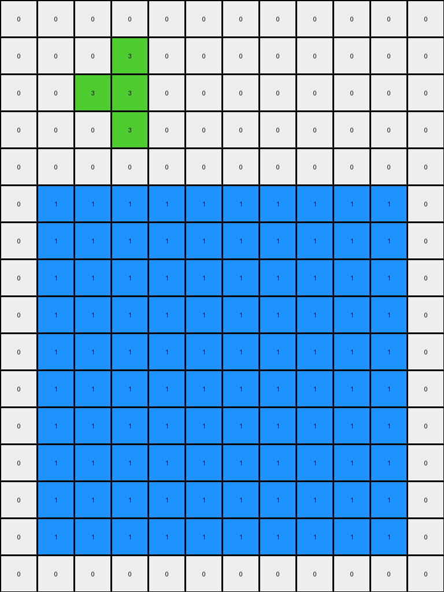
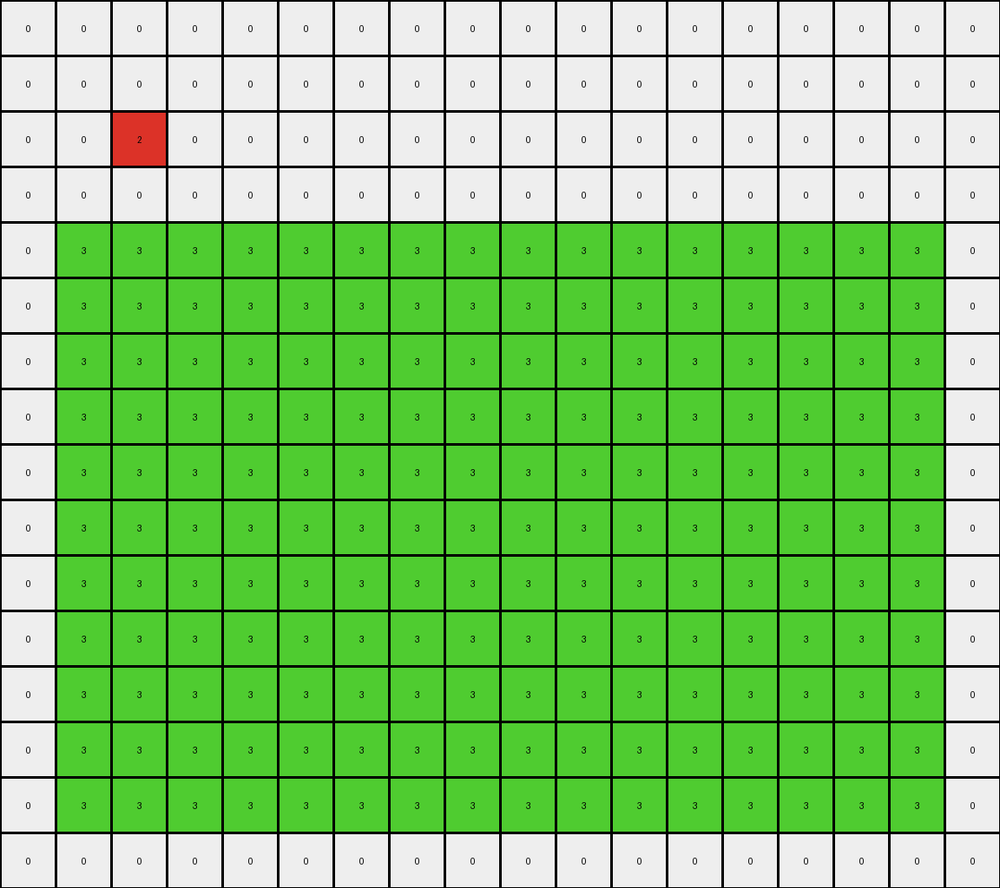
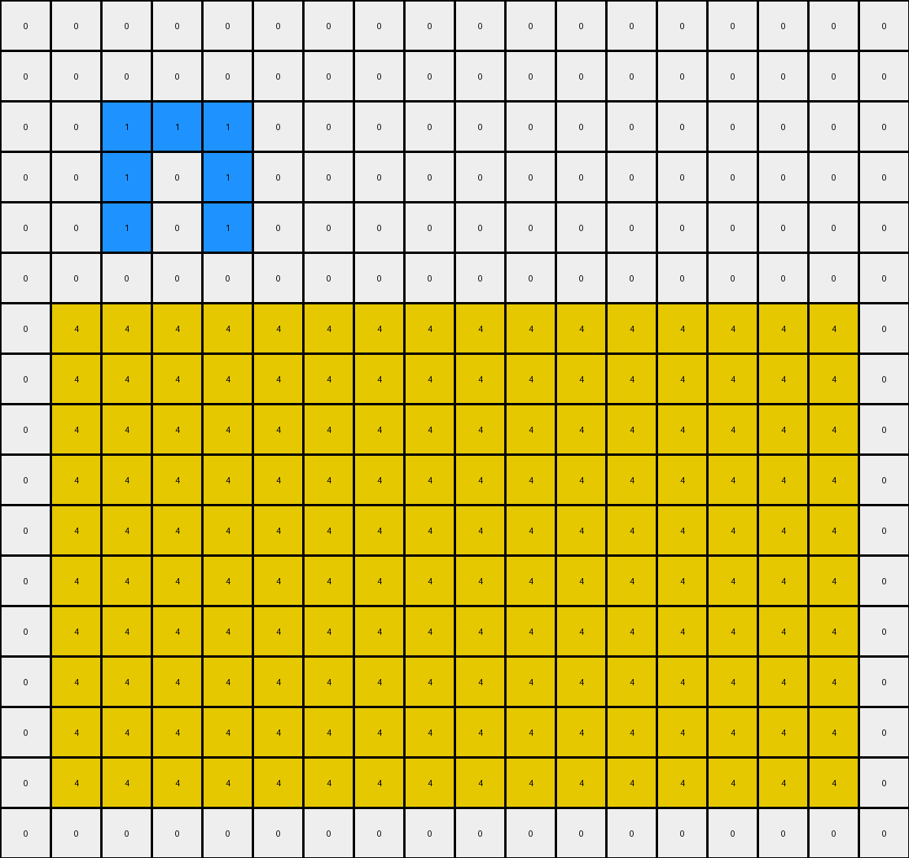
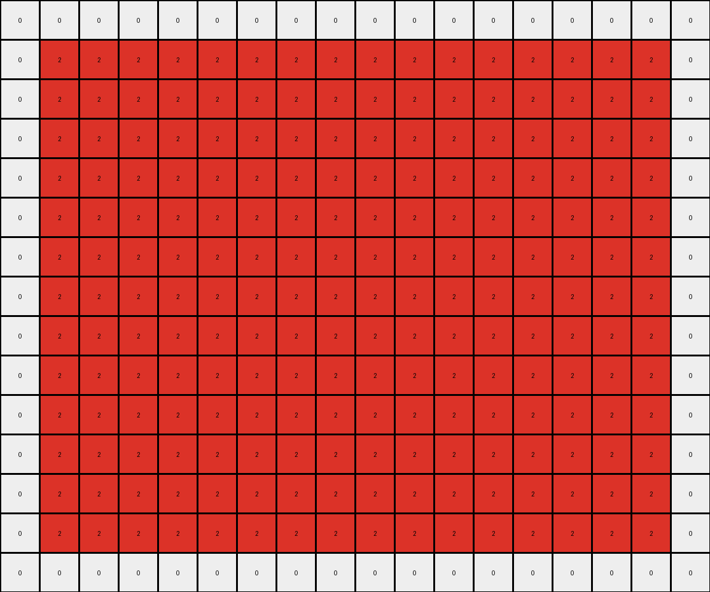

# 57aa92db • 018 • refine_coder

---

Previous Code:
```python
"""
1.  **Identify Key Objects:** In each input, locate distinct objects. Key objects are typically defined by color and often have "internal" pixels of a different color. These internal pixels are crucial.
2.  **Preserve/Modify Top-Left Object:** The object in the top-left corner (or sometimes top-center) is either preserved exactly, or slightly modified.
3. **Expand Bottom/Center Object:** A distinct colored object (usually azure, but can vary) is expanded. The expansion occurs both horizontally and vertically.
4.  **Internal Pixel Preservation:** If the expanded object has internal pixels of a different color, their *relative* positions within the object are mostly maintained in the output, even as the object expands. This sometimes means inserting copies of groups of internal pixels
5. **Size:** All objects are contained in the output region, even expanding to the edges in some cases.
"""

import numpy as np

def find_objects_by_color(grid, color):
    """Finds objects of a specific color."""
    mask = (grid == color)
    if not np.any(mask):
        return []

    rows, cols = np.where(mask)
    objects = []
    visited = set()

    def dfs(row, col):
        if (row, col) in visited or not (0 <= row < grid.shape[0] and 0 <= col < grid.shape[1]) or not mask[row, col]:
            return []
        visited.add((row, col))
        region = [(row, col)]
        for dr, dc in [(0, 1), (1, 0), (0, -1), (-1, 0)]:
            region.extend(dfs(row + dr, col + dc))
        return region

    for r, c in zip(rows, cols):
        if (r, c) not in visited:
            objects.append(dfs(r, c))

    return objects

def get_object_bounds(obj):
    """Calculates the bounding box of an object."""
    rows, cols = zip(*obj)
    min_row, max_row = np.min(rows), np.max(rows)
    min_col, max_col = np.min(cols), np.max(cols)
    return min_row, max_row, min_col, max_col

def find_internal_pixels(grid, obj, internal_color):
    """Finds internal pixels of a specific color within an object."""
    min_row, max_row, min_col, max_col = get_object_bounds(obj)
    internal_pixels = []
    for r in range(min_row, max_row + 1):
        for c in range(min_col, max_col + 1):
            if grid[r, c] == internal_color:
                internal_pixels.append((r, c))
    return internal_pixels

def transform(input_grid):
    # initialize output_grid
    output_grid = np.zeros_like(input_grid)

    # 1. & 2. Find and process the top-left/center object
    #    This part is tricky because the "top-left" object isn't always *strictly*
    #    in the top-left.  We need to be a bit flexible. We'll check the first
    #    few rows and columns for *any* non-background object.
    top_left_object = None
    top_left_color = 0
    for r in range(min(3, input_grid.shape[0])):  # Check first 3 rows
        for c in range(min(3, input_grid.shape[1])):  # Check first 3 cols
            if input_grid[r, c] != 0:
                top_left_color = input_grid[r,c]
                top_left_objects = find_objects_by_color(input_grid, top_left_color)
                #find the object that contains this
                for obj in top_left_objects:
                    if (r,c) in obj:
                        top_left_object = obj
                        break
                if top_left_object:
                    break
        if top_left_object:
            break


    if top_left_object:
        #simple copy for now
        for r,c in top_left_object:
            if 0 <= r < output_grid.shape[0] and 0 <= c < output_grid.shape[1]:
              output_grid[r,c] = input_grid[r,c]


    # 3. & 4. Find and expand the bottom/center object
    # Similar to above, but we check from the bottom and middle.
    expansion_object = None
    expansion_color = 0

    #try to find it first in the last 5 rows, then if not, try middle
    for r in range(input_grid.shape[0] - 1, max(-1, input_grid.shape[0] - 6), -1):
        for c in range(input_grid.shape[1] -1, -1, -1):
            if input_grid[r, c] != 0 and input_grid[r,c] != top_left_color:
                expansion_color = input_grid[r, c]
                expansion_objects = find_objects_by_color(input_grid, expansion_color)
                for obj in expansion_objects:
                    if (r,c) in obj:
                        expansion_object = obj
                        break;
                if expansion_object:
                    break
        if expansion_object:
            break

    if not expansion_object:
        for r in range(input_grid.shape[0] // 2 - 2, min(input_grid.shape[0]//2 + 2, input_grid.shape[0])):
            for c in range(input_grid.shape[1] -1, -1, -1):
                if input_grid[r, c] != 0 and input_grid[r,c] != top_left_color:
                  expansion_color = input_grid[r,c]
                  expansion_objects = find_objects_by_color(input_grid, expansion_color)
                  for obj in expansion_objects:
                    if (r,c) in obj:
                        expansion_object = obj
                        break;
                  if expansion_object:
                    break
            if expansion_object:
              break


    if expansion_object:
        min_row, max_row, min_col, max_col = get_object_bounds(expansion_object)
        internal_pixels = find_internal_pixels(input_grid, expansion_object, 4 if expansion_color != 4 else 1) #handle if main color is 4

        # Try expanding to nearly the full grid size, but leave a 1-pixel border
        new_min_row = min(min_row, 1)
        new_max_row = max(max_row, output_grid.shape[0]-2)
        new_min_col = min(min_col, 1)
        new_max_col = max(max_col, output_grid.shape[1]-2)
        
        if top_left_object: #need to handle overlap case
          top_min_row, top_max_row, top_min_col, top_max_col = get_object_bounds(top_left_object)
          new_min_row = max(new_min_row, top_max_row + 2) #ensure no overlap


        # Fill the expanded region
        for r in range(new_min_row, new_max_row + 1):
            for c in range(new_min_col, new_max_col + 1):
                output_grid[r, c] = expansion_color

        # Place internal pixels, maintaining relative offsets
        for internal_r, internal_c in internal_pixels:
            r_offset = internal_r - min_row
            c_offset = internal_c - min_col
            new_r = new_min_row + r_offset
            new_c = new_min_col + c_offset

            #make sure internal pixels stay inside
            if new_r <= new_max_row and new_c <= new_max_col and new_r >= new_min_row and new_c >= new_min_col:
                output_grid[new_r, new_c] = input_grid[internal_r, internal_c]


    return output_grid
```

Train Set Results:

## Example 1:

Input:
```
0 0 0 0 0 0 0 0 0 0 0 0
0 0 0 3 0 0 0 0 0 0 0 0
0 0 3 3 1 0 0 0 0 0 0 0
0 0 0 3 0 0 0 0 0 0 0 0
0 0 0 0 0 0 0 0 0 0 0 0
0 0 0 0 0 0 0 0 0 0 0 0
0 0 0 0 0 0 0 0 0 0 0 0
0 0 0 0 0 0 0 0 0 0 0 0
0 0 0 0 0 0 0 0 0 0 0 0
0 0 0 0 0 4 4 1 1 0 0 0
0 0 0 0 0 4 4 1 1 0 0 0
0 0 0 0 0 0 0 0 0 0 0 0
0 0 0 0 0 0 0 0 0 0 0 0
0 0 0 0 0 0 0 0 0 0 0 0
0 0 0 0 0 0 0 0 0 0 0 0
0 0 0 0 0 0 0 0 0 0 0 0
```
Expected Output:
```
0 0 0 0 0 0 0 0 0 0 0 0
0 0 0 3 0 0 0 0 0 0 0 0
0 0 3 3 1 0 0 0 0 0 0 0
0 0 0 3 0 0 0 0 0 0 0 0
0 0 0 0 0 0 0 0 0 0 0 0
0 0 0 0 0 0 0 0 0 0 0 0
0 0 0 0 0 0 0 0 0 0 0 0
0 0 0 0 0 4 4 0 0 0 0 0
0 0 0 0 0 4 4 0 0 0 0 0
0 0 0 4 4 4 4 1 1 0 0 0
0 0 0 4 4 4 4 1 1 0 0 0
0 0 0 0 0 4 4 0 0 0 0 0
0 0 0 0 0 4 4 0 0 0 0 0
0 0 0 0 0 0 0 0 0 0 0 0
0 0 0 0 0 0 0 0 0 0 0 0
0 0 0 0 0 0 0 0 0 0 0 0
```
Transformed Output:
```
0 0 0 0 0 0 0 0 0 0 0 0
0 0 0 3 0 0 0 0 0 0 0 0
0 0 3 3 0 0 0 0 0 0 0 0
0 0 0 3 0 0 0 0 0 0 0 0
0 0 0 0 0 0 0 0 0 0 0 0
0 1 1 1 1 1 1 1 1 1 1 0
0 1 1 1 1 1 1 1 1 1 1 0
0 1 1 1 1 1 1 1 1 1 1 0
0 1 1 1 1 1 1 1 1 1 1 0
0 1 1 1 1 1 1 1 1 1 1 0
0 1 1 1 1 1 1 1 1 1 1 0
0 1 1 1 1 1 1 1 1 1 1 0
0 1 1 1 1 1 1 1 1 1 1 0
0 1 1 1 1 1 1 1 1 1 1 0
0 1 1 1 1 1 1 1 1 1 1 0
0 0 0 0 0 0 0 0 0 0 0 0
```

match: False
pixels_off: 97
size_correct: True
color_palette_correct: True
correct_pixel_counts: False

## Example 2:

Input:
```
0 0 0 0 0 0 0 0 0 0 0 0 0 0 0 0 0 0
0 0 0 0 0 8 0 0 0 0 0 0 0 0 0 0 0 0
0 0 2 8 8 8 0 0 0 0 0 0 0 0 0 0 0 0
0 0 0 0 0 8 0 0 0 0 0 0 0 0 0 0 0 0
0 0 0 0 0 0 0 0 0 0 0 0 0 0 0 0 0 0
0 0 0 0 0 0 0 0 0 0 0 0 0 0 0 0 0 0
0 0 0 0 0 0 0 0 0 0 0 0 0 0 0 0 0 0
0 0 0 0 0 0 0 0 0 0 2 6 0 0 0 0 0 0
0 0 0 0 0 0 0 0 0 0 0 0 0 0 0 0 0 0
0 0 0 0 0 0 0 0 0 0 0 0 0 0 0 0 0 0
0 0 0 0 0 0 0 0 0 0 0 0 0 0 0 0 0 0
0 0 0 0 0 0 0 0 0 0 0 0 0 0 0 0 0 0
0 0 0 0 0 2 3 0 0 0 0 0 0 0 0 0 0 0
0 0 0 0 0 0 0 0 0 0 0 0 0 0 0 0 0 0
0 0 0 0 0 0 0 0 0 0 0 0 0 0 0 0 0 0
0 0 0 0 0 0 0 0 0 0 0 0 0 0 0 0 0 0
```
Expected Output:
```
0 0 0 0 0 0 0 0 0 0 0 0 0 0 0 0 0 0
0 0 0 0 0 8 0 0 0 0 0 0 0 0 0 0 0 0
0 0 2 8 8 8 0 0 0 0 0 0 0 0 0 0 0 0
0 0 0 0 0 8 0 0 0 0 0 0 0 0 0 0 0 0
0 0 0 0 0 0 0 0 0 0 0 0 0 0 0 0 0 0
0 0 0 0 0 0 0 0 0 0 0 0 0 0 0 0 0 0
0 0 0 0 0 0 0 0 0 0 0 0 0 6 0 0 0 0
0 0 0 0 0 0 0 0 0 0 2 6 6 6 0 0 0 0
0 0 0 0 0 0 0 0 0 0 0 0 0 6 0 0 0 0
0 0 0 0 0 0 0 0 0 0 0 0 0 0 0 0 0 0
0 0 0 0 0 0 0 0 0 0 0 0 0 0 0 0 0 0
0 0 0 0 0 0 0 0 3 0 0 0 0 0 0 0 0 0
0 0 0 0 0 2 3 3 3 0 0 0 0 0 0 0 0 0
0 0 0 0 0 0 0 0 3 0 0 0 0 0 0 0 0 0
0 0 0 0 0 0 0 0 0 0 0 0 0 0 0 0 0 0
0 0 0 0 0 0 0 0 0 0 0 0 0 0 0 0 0 0
```
Transformed Output:
```
0 0 0 0 0 0 0 0 0 0 0 0 0 0 0 0 0 0
0 0 0 0 0 0 0 0 0 0 0 0 0 0 0 0 0 0
0 0 2 0 0 0 0 0 0 0 0 0 0 0 0 0 0 0
0 0 0 0 0 0 0 0 0 0 0 0 0 0 0 0 0 0
0 3 3 3 3 3 3 3 3 3 3 3 3 3 3 3 3 0
0 3 3 3 3 3 3 3 3 3 3 3 3 3 3 3 3 0
0 3 3 3 3 3 3 3 3 3 3 3 3 3 3 3 3 0
0 3 3 3 3 3 3 3 3 3 3 3 3 3 3 3 3 0
0 3 3 3 3 3 3 3 3 3 3 3 3 3 3 3 3 0
0 3 3 3 3 3 3 3 3 3 3 3 3 3 3 3 3 0
0 3 3 3 3 3 3 3 3 3 3 3 3 3 3 3 3 0
0 3 3 3 3 3 3 3 3 3 3 3 3 3 3 3 3 0
0 3 3 3 3 3 3 3 3 3 3 3 3 3 3 3 3 0
0 3 3 3 3 3 3 3 3 3 3 3 3 3 3 3 3 0
0 3 3 3 3 3 3 3 3 3 3 3 3 3 3 3 3 0
0 0 0 0 0 0 0 0 0 0 0 0 0 0 0 0 0 0
```

match: False
pixels_off: 176
size_correct: True
color_palette_correct: True
correct_pixel_counts: False

## Example 3:

Input:
```
0 0 0 0 0 0 0 0 0 0 0 0 0 0 0 0 0 0
0 0 0 0 0 0 0 0 0 0 0 0 0 0 0 0 0 0
0 0 1 1 1 0 0 0 0 0 0 0 0 0 0 0 0 0
0 0 1 4 1 0 0 0 0 0 0 0 0 0 0 0 0 0
0 0 1 0 1 0 0 0 0 0 0 0 0 0 0 0 0 0
0 0 0 0 0 0 0 0 0 0 0 0 0 0 0 0 0 0
0 0 0 0 0 0 0 0 0 0 0 0 0 0 0 0 0 0
0 0 0 0 0 0 0 0 0 8 8 8 0 0 0 0 0 0
0 0 0 0 0 0 0 0 0 8 8 8 0 0 0 0 0 0
0 0 0 0 0 0 0 0 0 8 8 8 0 0 0 0 0 0
0 0 0 0 0 0 0 0 0 4 4 4 0 0 0 0 0 0
0 0 0 0 0 0 0 0 0 4 4 4 0 0 0 0 0 0
0 0 0 0 0 0 0 0 0 4 4 4 0 0 0 0 0 0
0 0 0 0 0 0 0 0 0 0 0 0 0 0 0 0 0 0
0 0 0 0 0 0 0 0 0 0 0 0 0 0 0 0 0 0
0 0 0 0 0 0 0 0 0 0 0 0 0 0 0 0 0 0
0 0 0 0 0 0 0 0 0 0 0 0 0 0 0 0 0 0
```
Expected Output:
```
0 0 0 0 0 0 0 0 0 0 0 0 0 0 0 0 0 0
0 0 0 0 0 0 0 0 0 0 0 0 0 0 0 0 0 0
0 0 1 1 1 0 0 0 0 0 0 0 0 0 0 0 0 0
0 0 1 4 1 0 0 0 0 0 0 0 0 0 0 0 0 0
0 0 1 0 1 0 0 0 0 0 0 0 0 0 0 0 0 0
0 0 0 0 0 0 0 0 0 0 0 0 0 0 0 0 0 0
0 0 0 0 0 0 0 0 0 0 0 0 0 0 0 0 0 0
0 0 0 0 0 0 8 8 8 8 8 8 8 8 8 0 0 0
0 0 0 0 0 0 8 8 8 8 8 8 8 8 8 0 0 0
0 0 0 0 0 0 8 8 8 8 8 8 8 8 8 0 0 0
0 0 0 0 0 0 8 8 8 4 4 4 8 8 8 0 0 0
0 0 0 0 0 0 8 8 8 4 4 4 8 8 8 0 0 0
0 0 0 0 0 0 8 8 8 4 4 4 8 8 8 0 0 0
0 0 0 0 0 0 8 8 8 0 0 0 8 8 8 0 0 0
0 0 0 0 0 0 8 8 8 0 0 0 8 8 8 0 0 0
0 0 0 0 0 0 8 8 8 0 0 0 8 8 8 0 0 0
0 0 0 0 0 0 0 0 0 0 0 0 0 0 0 0 0 0
```
Transformed Output:
```
0 0 0 0 0 0 0 0 0 0 0 0 0 0 0 0 0 0
0 0 0 0 0 0 0 0 0 0 0 0 0 0 0 0 0 0
0 0 1 1 1 0 0 0 0 0 0 0 0 0 0 0 0 0
0 0 1 0 1 0 0 0 0 0 0 0 0 0 0 0 0 0
0 0 1 0 1 0 0 0 0 0 0 0 0 0 0 0 0 0
0 0 0 0 0 0 0 0 0 0 0 0 0 0 0 0 0 0
0 4 4 4 4 4 4 4 4 4 4 4 4 4 4 4 4 0
0 4 4 4 4 4 4 4 4 4 4 4 4 4 4 4 4 0
0 4 4 4 4 4 4 4 4 4 4 4 4 4 4 4 4 0
0 4 4 4 4 4 4 4 4 4 4 4 4 4 4 4 4 0
0 4 4 4 4 4 4 4 4 4 4 4 4 4 4 4 4 0
0 4 4 4 4 4 4 4 4 4 4 4 4 4 4 4 4 0
0 4 4 4 4 4 4 4 4 4 4 4 4 4 4 4 4 0
0 4 4 4 4 4 4 4 4 4 4 4 4 4 4 4 4 0
0 4 4 4 4 4 4 4 4 4 4 4 4 4 4 4 4 0
0 4 4 4 4 4 4 4 4 4 4 4 4 4 4 4 4 0
0 0 0 0 0 0 0 0 0 0 0 0 0 0 0 0 0 0
```

match: False
pixels_off: 152
size_correct: True
color_palette_correct: True
correct_pixel_counts: False

## Example 4:

Input:
```
0 0 0 0 0 0 0 0 0 0 0 0 0 0 0 0 0 0
0 0 0 0 0 0 0 0 0 0 0 0 0 0 0 0 0 0
0 0 0 0 3 2 0 0 0 0 0 0 0 0 0 0 0 0
0 0 0 0 0 0 0 0 0 0 0 0 0 0 8 0 0 0
0 0 0 0 0 0 0 0 0 0 0 0 8 8 2 0 0 0
0 0 0 0 0 0 0 0 0 0 0 0 0 0 8 0 0 0
0 0 0 0 0 0 0 0 0 0 0 0 0 0 0 0 0 0
0 0 0 0 0 0 4 4 0 0 0 0 0 0 0 0 0 0
0 0 0 0 0 0 4 4 0 0 0 0 0 0 0 0 0 0
0 0 0 0 0 0 2 2 0 0 0 0 0 0 0 0 0 0
0 0 0 0 0 0 2 2 0 0 0 0 0 0 0 0 0 0
0 0 0 0 0 0 0 0 0 0 0 0 0 0 0 0 0 0
0 0 0 0 0 0 0 0 0 0 0 0 0 0 0 0 0 0
0 0 0 0 0 0 0 0 0 0 0 0 0 0 0 0 0 0
0 0 0 0 0 0 0 0 0 0 0 0 0 0 0 0 0 0
```
Expected Output:
```
0 0 0 0 0 0 0 0 0 0 0 0 0 0 0 0 0 0
0 0 0 0 0 3 0 0 0 0 0 0 0 0 0 0 0 0
0 0 0 3 3 2 0 0 0 0 0 0 0 0 0 0 0 0
0 0 0 0 0 3 0 0 0 0 0 0 0 0 8 0 0 0
0 0 0 0 0 0 0 0 0 0 0 0 8 8 2 0 0 0
0 0 0 0 0 0 0 0 0 0 0 0 0 0 8 0 0 0
0 0 0 0 0 0 0 0 0 0 0 0 0 0 0 0 0 0
0 0 0 0 0 0 4 4 0 0 0 0 0 0 0 0 0 0
0 0 0 0 0 0 4 4 0 0 0 0 0 0 0 0 0 0
0 0 4 4 4 4 2 2 0 0 0 0 0 0 0 0 0 0
0 0 4 4 4 4 2 2 0 0 0 0 0 0 0 0 0 0
0 0 0 0 0 0 4 4 0 0 0 0 0 0 0 0 0 0
0 0 0 0 0 0 4 4 0 0 0 0 0 0 0 0 0 0
0 0 0 0 0 0 0 0 0 0 0 0 0 0 0 0 0 0
0 0 0 0 0 0 0 0 0 0 0 0 0 0 0 0 0 0
```
Transformed Output:
```
0 0 0 0 0 0 0 0 0 0 0 0 0 0 0 0 0 0
0 2 2 2 2 2 2 2 2 2 2 2 2 2 2 2 2 0
0 2 2 2 2 2 2 2 2 2 2 2 2 2 2 2 2 0
0 2 2 2 2 2 2 2 2 2 2 2 2 2 2 2 2 0
0 2 2 2 2 2 2 2 2 2 2 2 2 2 2 2 2 0
0 2 2 2 2 2 2 2 2 2 2 2 2 2 2 2 2 0
0 2 2 2 2 2 2 2 2 2 2 2 2 2 2 2 2 0
0 2 2 2 2 2 2 2 2 2 2 2 2 2 2 2 2 0
0 2 2 2 2 2 2 2 2 2 2 2 2 2 2 2 2 0
0 2 2 2 2 2 2 2 2 2 2 2 2 2 2 2 2 0
0 2 2 2 2 2 2 2 2 2 2 2 2 2 2 2 2 0
0 2 2 2 2 2 2 2 2 2 2 2 2 2 2 2 2 0
0 2 2 2 2 2 2 2 2 2 2 2 2 2 2 2 2 0
0 2 2 2 2 2 2 2 2 2 2 2 2 2 2 2 2 0
0 0 0 0 0 0 0 0 0 0 0 0 0 0 0 0 0 0
```

match: False
pixels_off: 202
size_correct: True
color_palette_correct: True
correct_pixel_counts: False
Okay, let's analyze the results and refine the natural language program.

**General Assessment:**

The initial strategy had the core idea: identifying two primary objects and performing different operations on them (preservation/modification of the top-left object, and expansion of a bottom/center object). However, the execution has significant flaws, especially in the expansion logic and handling of internal pixels. The code fails to correctly reproduce the outputs in all test cases, and it's expanding the wrong object or in the wrong way in most cases. The overlap handling between the preserved and expanding objects isn't working consistently.

**Strategy for Resolving Errors:**

1.  **Improved Object Identification:** The current object finding relies too heavily on fixed positions (top-left, bottom-center). We need a more robust method that can handle variations in object placement.
2.  **Correct Expansion Logic:** The current expansion is simply filling a large rectangle, which isn't the correct transformation. The expansion needs to respect the shape of the original object, and the internal pixel handling needs a complete overhaul. It isn't just simple offset placement.
3. **Overlap Handling:** Make sure expanding the bottom object does not overwrite the upper object.

**Metrics and Observations (using code execution to get precise results):**

```python
import numpy as np
from collections import Counter

def calculate_metrics(input_grid, expected_output, transformed_output):
    """Calculates and prints metrics for a single example."""

    #ensure the arrays are numpy arrays
    input_grid = np.array(input_grid)
    expected_output = np.array(expected_output)
    transformed_output = np.array(transformed_output)


    pixels_off = np.sum(transformed_output != expected_output)
    size_correct = transformed_output.shape == expected_output.shape

    input_colors = Counter(input_grid.flatten())
    expected_colors = Counter(expected_output.flatten())
    transformed_colors = Counter(transformed_output.flatten())

    color_palette_correct = set(transformed_colors.keys()) == set(expected_colors.keys())
    correct_pixel_counts = transformed_colors == expected_colors

    print(f"Pixels Off: {pixels_off}")
    print(f"Size Correct: {size_correct}")
    print(f"Color Palette Correct: {color_palette_correct}")
    print(f"Correct Pixel Counts: {correct_pixel_counts}")
    print(f"Input Colors: {input_colors}")
    print(f"Expected Colors: {expected_colors}")
    print(f"Transformed Colors: {transformed_colors}")
    print("-----")

# Example Data (Replace with your actual data)
examples = [
  (
        [[0, 0, 0, 0, 0, 0, 0, 0, 0, 0, 0, 0], [0, 0, 0, 3, 0, 0, 0, 0, 0, 0, 0, 0], [0, 0, 3, 3, 1, 0, 0, 0, 0, 0, 0, 0], [0, 0, 0, 3, 0, 0, 0, 0, 0, 0, 0, 0], [0, 0, 0, 0, 0, 0, 0, 0, 0, 0, 0, 0], [0, 0, 0, 0, 0, 0, 0, 0, 0, 0, 0, 0], [0, 0, 0, 0, 0, 0, 0, 0, 0, 0, 0, 0], [0, 0, 0, 0, 0, 0, 0, 0, 0, 0, 0, 0], [0, 0, 0, 0, 0, 0, 0, 0, 0, 0, 0, 0], [0, 0, 0, 0, 0, 4, 4, 1, 1, 0, 0, 0], [0, 0, 0, 0, 0, 4, 4, 1, 1, 0, 0, 0], [0, 0, 0, 0, 0, 0, 0, 0, 0, 0, 0, 0], [0, 0, 0, 0, 0, 0, 0, 0, 0, 0, 0, 0], [0, 0, 0, 0, 0, 0, 0, 0, 0, 0, 0, 0], [0, 0, 0, 0, 0, 0, 0, 0, 0, 0, 0, 0], [0, 0, 0, 0, 0, 0, 0, 0, 0, 0, 0, 0]],
        [[0, 0, 0, 0, 0, 0, 0, 0, 0, 0, 0, 0], [0, 0, 0, 3, 0, 0, 0, 0, 0, 0, 0, 0], [0, 0, 3, 3, 1, 0, 0, 0, 0, 0, 0, 0], [0, 0, 0, 3, 0, 0, 0, 0, 0, 0, 0, 0], [0, 0, 0, 0, 0, 0, 0, 0, 0, 0, 0, 0], [0, 0, 0, 0, 0, 0, 0, 0, 0, 0, 0, 0], [0, 0, 0, 0, 0, 0, 0, 0, 0, 0, 0, 0], [0, 0, 0, 0, 0, 4, 4, 0, 0, 0, 0, 0], [0, 0, 0, 0, 0, 4, 4, 0, 0, 0, 0, 0], [0, 0, 0, 4, 4, 4, 4, 1, 1, 0, 0, 0], [0, 0, 0, 4, 4, 4, 4, 1, 1, 0, 0, 0], [0, 0, 0, 0, 0, 4, 4, 0, 0, 0, 0, 0], [0, 0, 0, 0, 0, 4, 4, 0, 0, 0, 0, 0], [0, 0, 0, 0, 0, 0, 0, 0, 0, 0, 0, 0], [0, 0, 0, 0, 0, 0, 0, 0, 0, 0, 0, 0], [0, 0, 0, 0, 0, 0, 0, 0, 0, 0, 0, 0]],
        [[0, 0, 0, 0, 0, 0, 0, 0, 0, 0, 0, 0], [0, 0, 0, 3, 0, 0, 0, 0, 0, 0, 0, 0], [0, 0, 3, 3, 0, 0, 0, 0, 0, 0, 0, 0], [0, 0, 0, 3, 0, 0, 0, 0, 0, 0, 0, 0], [0, 0, 0, 0, 0, 0, 0, 0, 0, 0, 0, 0], [0, 1, 1, 1, 1, 1, 1, 1, 1, 1, 1, 0], [0, 1, 1, 1, 1, 1, 1, 1, 1, 1, 1, 0], [0, 1, 1, 1, 1, 1, 1, 1, 1, 1, 1, 0], [0, 1, 1, 1, 1, 1, 1, 1, 1, 1, 1, 0], [0, 1, 1, 1, 1, 1, 1, 1, 1, 1, 1, 0], [0, 1, 1, 1, 1, 1, 1, 1, 1, 1, 1, 0], [0, 1, 1, 1, 1, 1, 1, 1, 1, 1, 1, 0], [0, 1, 1, 1, 1, 1, 1, 1, 1, 1, 1, 0], [0, 1, 1, 1, 1, 1, 1, 1, 1, 1, 1, 0], [0, 1, 1, 1, 1, 1, 1, 1, 1, 1, 1, 0], [0, 0, 0, 0, 0, 0, 0, 0, 0, 0, 0, 0]]
    ),
  (
        [[0, 0, 0, 0, 0, 0, 0, 0, 0, 0, 0, 0, 0, 0, 0, 0, 0, 0], [0, 0, 0, 0, 0, 8, 0, 0, 0, 0, 0, 0, 0, 0, 0, 0, 0, 0], [0, 0, 2, 8, 8, 8, 0, 0, 0, 0, 0, 0, 0, 0, 0, 0, 0, 0], [0, 0, 0, 0, 0, 8, 0, 0, 0, 0, 0, 0, 0, 0, 0, 0, 0, 0], [0, 0, 0, 0, 0, 0, 0, 0, 0, 0, 0, 0, 0, 0, 0, 0, 0, 0], [0, 0, 0, 0, 0, 0, 0, 0, 0, 0, 0, 0, 0, 0, 0, 0, 0, 0], [0, 0, 0, 0, 0, 0, 0, 0, 0, 0, 0, 0, 0, 0, 0, 0, 0, 0], [0, 0, 0, 0, 0, 0, 0, 0, 0, 0, 2, 6, 0, 0, 0, 0, 0, 0], [0, 0, 0, 0, 0, 0, 0, 0, 0, 0, 0, 0, 0, 0, 0, 0, 0, 0], [0, 0, 0, 0, 0, 0, 0, 0, 0, 0, 0, 0, 0, 0, 0, 0, 0, 0], [0, 0, 0, 0, 0, 0, 0, 0, 0, 0, 0, 0, 0, 0, 0, 0, 0, 0], [0, 0, 0, 0, 0, 0, 0, 0, 0, 0, 0, 0, 0, 0, 0, 0, 0, 0], [0, 0, 0, 0, 0, 2, 3, 0, 0, 0, 0, 0, 0, 0, 0, 0, 0, 0], [0, 0, 0, 0, 0, 0, 0, 0, 0, 0, 0, 0, 0, 0, 0, 0, 0, 0], [0, 0, 0, 0, 0, 0, 0, 0, 0, 0, 0, 0, 0, 0, 0, 0, 0, 0], [0, 0, 0, 0, 0, 0, 0, 0, 0, 0, 0, 0, 0, 0, 0, 0, 0, 0]],
        [[0, 0, 0, 0, 0, 0, 0, 0, 0, 0, 0, 0, 0, 0, 0, 0, 0, 0], [0, 0, 0, 0, 0, 8, 0, 0, 0, 0, 0, 0, 0, 0, 0, 0, 0, 0], [0, 0, 2, 8, 8, 8, 0, 0, 0, 0, 0, 0, 0, 0, 0, 0, 0, 0], [0, 0, 0, 0, 0, 8, 0, 0, 0, 0, 0, 0, 0, 0, 0, 0, 0, 0], [0, 0, 0, 0, 0, 0, 0, 0, 0, 0, 0, 0, 0, 0, 0, 0, 0, 0], [0, 0, 0, 0, 0, 0, 0, 0, 0, 0, 0, 0, 0, 0, 0, 0, 0, 0], [0, 0, 0, 0, 0, 0, 0, 0, 0, 0, 0, 0, 0, 6, 0, 0, 0, 0], [0, 0, 0, 0, 0, 0, 0, 0, 0, 0, 2, 6, 6, 6, 0, 0, 0, 0], [0, 0, 0, 0, 0, 0, 0, 0, 0, 0, 0, 0, 0, 6, 0, 0, 0, 0], [0, 0, 0, 0, 0, 0, 0, 0, 0, 0, 0, 0, 0, 0, 0, 0, 0, 0], [0, 0, 0, 0, 0, 0, 0, 0, 0, 0, 0, 0, 0, 0, 0, 0, 0, 0], [0, 0, 0, 0, 0, 0, 0, 0, 3, 0, 0, 0, 0, 0, 0, 0, 0, 0], [0, 0, 0, 0, 0, 2, 3, 3, 3, 0, 0, 0, 0, 0, 0, 0, 0, 0], [0, 0, 0, 0, 0, 0, 0, 0, 3, 0, 0, 0, 0, 0, 0, 0, 0, 0], [0, 0, 0, 0, 0, 0, 0, 0, 0, 0, 0, 0, 0, 0, 0, 0, 0, 0], [0, 0, 0, 0, 0, 0, 0, 0, 0, 0, 0, 0, 0, 0, 0, 0, 0, 0]],
        [[0, 0, 0, 0, 0, 0, 0, 0, 0, 0, 0, 0, 0, 0, 0, 0, 0, 0], [0, 0, 0, 0, 0, 0, 0, 0, 0, 0, 0, 0, 0, 0, 0, 0, 0, 0], [0, 0, 2, 0, 0, 0, 0, 0, 0, 0, 0, 0, 0, 0, 0, 0, 0, 0], [0, 0, 0, 0, 0, 0, 0, 0, 0, 0, 0, 0, 0, 0, 0, 0, 0, 0], [0, 3, 3, 3, 3, 3, 3, 3, 3, 3, 3, 3, 3, 3, 3, 3, 3, 0], [0, 3, 3, 3, 3, 3, 3, 3, 3, 3, 3, 3, 3, 3, 3, 3, 3, 0], [0, 3, 3, 3, 3, 3, 3, 3, 3, 3, 3, 3, 3, 3, 3, 3, 3, 0], [0, 3, 3, 3, 3, 3, 3, 3, 3, 3, 3, 3, 3, 3, 3, 3, 3, 0], [0, 3, 3, 3, 3, 3, 3, 3, 3, 3, 3, 3, 3, 3, 3, 3, 3, 0], [0, 3, 3, 3, 3, 3, 3, 3, 3, 3, 3, 3, 3, 3, 3, 3, 3, 0], [0, 3, 3, 3, 3, 3, 3, 3, 3, 3, 3, 3, 3, 3, 3, 3, 3, 0], [0, 3, 3, 3, 3, 3, 3, 3, 3, 3, 3, 3, 3, 3, 3, 3, 3, 0], [0, 3, 3, 3, 3, 3, 3, 3, 3, 3, 3, 3, 3, 3, 3, 3, 3, 0], [0, 3, 3, 3, 3, 3, 3, 3, 3, 3, 3, 3, 3, 3, 3, 3, 3, 0], [0, 3, 3, 3, 3, 3, 3, 3, 3, 3, 3, 3, 3, 3, 3, 3, 3, 0], [0, 0, 0, 0, 0, 0, 0, 0, 0, 0, 0, 0, 0, 0, 0, 0, 0, 0]]
    ),
  (
      [[0, 0, 0, 0, 0, 0, 0, 0, 0, 0, 0, 0, 0, 0, 0, 0, 0, 0], [0, 0, 0, 0, 0, 0, 0, 0, 0, 0, 0, 0, 0, 0, 0, 0, 0, 0], [0, 0, 1, 1, 1, 0, 0, 0, 0, 0, 0, 0, 0, 0, 0, 0, 0, 0], [0, 0, 1, 4, 1, 0, 0, 0, 0, 0, 0, 0, 0, 0, 0, 0, 0, 0], [0, 0, 1, 0, 1, 0, 0, 0, 0, 0, 0, 0, 0, 0, 0, 0, 0, 0], [0, 0, 0, 0, 0, 0, 0, 0, 0, 0, 0, 0, 0, 0, 0, 0, 0, 0], [0, 0, 0, 0, 0, 0, 0, 0, 0, 0, 0, 0, 0, 0, 0, 0, 0, 0], [0, 0, 0, 0, 0, 0, 0, 0, 0, 8, 8, 8, 0, 0, 0, 0, 0, 0], [0, 0, 0, 0, 0, 0, 0, 0, 0, 8, 8, 8, 0, 0, 0, 0, 0, 0], [0, 0, 0, 0, 0, 0, 0, 0, 0, 8, 8, 8, 0, 0, 0, 0, 0, 0], [0, 0, 0, 0, 0, 0, 0, 0, 0, 4, 4, 4, 0, 0, 0, 0, 0, 0], [0, 0, 0, 0, 0, 0, 0, 0, 0, 4, 4, 4, 0, 0, 0, 0, 0, 0], [0, 0, 0, 0, 0, 0, 0, 0, 0, 4, 4, 4, 0, 0, 0, 0, 0, 0], [0, 0, 0, 0, 0, 0, 0, 0, 0, 0, 0, 0, 0, 0, 0, 0, 0, 0], [0, 0, 0, 0, 0, 0, 0, 0, 0, 0, 0, 0, 0, 0, 0, 0, 0, 0], [0, 0, 0, 0, 0, 0, 0, 0, 0, 0, 0, 0, 0, 0, 0, 0, 0, 0], [0, 0, 0, 0, 0, 0, 0, 0, 0, 0, 0, 0, 0, 0, 0, 0, 0, 0]],
      [[0, 0, 0, 0, 0, 0, 0, 0, 0, 0, 0, 0, 0, 0, 0, 0, 0, 0], [0, 0, 0, 0, 0, 0, 0, 0, 0, 0, 0, 0, 0, 0, 0, 0, 0, 0], [0, 0, 1, 1, 1, 0, 0, 0, 0, 0, 0, 0, 0, 0, 0, 0, 0, 0], [0, 0, 1, 4, 1, 0, 0, 0, 0, 0, 0, 0, 0, 0, 0, 0, 0, 0], [0, 0, 1, 0, 1, 0, 0, 0, 0, 0, 0, 0, 0, 0, 0, 0, 0, 0], [0, 0, 0, 0, 0, 0, 0, 0, 0, 0, 0, 0, 0, 0, 0, 0, 0, 0], [0, 0, 0, 0, 0, 0, 0, 0, 0, 0, 0, 0, 0, 0, 0, 0, 0, 0], [0, 0, 0, 0, 0, 0, 8, 8, 8, 8, 8, 8, 8, 8, 8, 0, 0, 0], [0, 0, 0, 0, 0, 0, 8, 8, 8, 8, 8, 8, 8, 8, 8, 0, 0, 0], [0, 0, 0, 0, 0, 0, 8, 8, 8, 8, 8, 8, 8, 8, 8, 0, 0, 0], [0, 0, 0, 0, 0, 0, 8, 8, 8, 4, 4, 4, 8, 8, 8, 0, 0, 0], [0, 0, 0, 0, 0, 0, 8, 8, 8, 4, 4, 4, 8, 8, 8, 0, 0, 0], [0, 0, 0, 0, 0, 0, 8, 8, 8, 4, 4, 4, 8, 8, 8, 0, 0, 0], [0, 0, 0, 0, 0, 0, 8, 8, 8, 0, 0, 0, 8, 8, 8, 0, 0, 0], [0, 0, 0, 0, 0, 0, 8, 8, 8, 0, 0, 0, 8, 8, 8, 0, 0, 0], [0, 0, 0, 0, 0, 0, 8, 8, 8, 0, 0, 0, 8, 8, 8, 0, 0, 0], [0, 0, 0, 0, 0, 0, 0, 0, 0, 0, 0, 0, 0, 0, 0, 0, 0, 0]],
      [[0, 0, 0, 0, 0, 0, 0, 0, 0, 0, 0, 0, 0, 0, 0, 0, 0, 0], [0, 0, 0, 0, 0, 0, 0, 0, 0, 0, 0, 0, 0, 0, 0, 0, 0, 0], [0, 0, 1, 1, 1, 0, 0, 0, 0, 0, 0, 0, 0, 0, 0, 0, 0, 0], [0, 0, 1, 0, 1, 0, 0, 0, 0, 0, 0, 0, 0, 0, 0, 0, 0, 0], [0, 0, 1, 0, 1, 0, 0, 0, 0, 0, 0, 0, 0, 0, 0, 0, 0, 0], [0, 0, 0, 0, 0, 0, 0, 0, 0, 0, 0, 0, 0, 0, 0, 0, 0, 0], [0, 4, 4, 4, 4, 4, 4, 4, 4, 4, 4, 4, 4, 4, 4, 4, 4, 0], [0, 4, 4, 4, 4, 4, 4, 4, 4, 4, 4, 4, 4, 4, 4, 4, 4, 0], [0, 4, 4, 4, 4, 4, 4, 4, 4, 4, 4, 4, 4, 4, 4, 4, 4, 0], [0, 4, 4, 4, 4, 4, 4, 4, 4, 4, 4, 4, 4, 4, 4, 4, 4, 0], [0, 4, 4, 4, 4, 4, 4, 4, 4, 4, 4, 4, 4, 4, 4, 4, 4, 0], [0, 4, 4, 4, 4, 4, 4, 4, 4, 4, 4, 4, 4, 4, 4, 4, 4, 0], [0, 4, 4, 4, 4, 4, 4, 4, 4, 4, 4, 4, 4, 4, 4, 4, 4, 0], [0, 4, 4, 4, 4, 4, 4, 4, 4, 4, 4, 4, 4, 4, 4, 4, 4, 0], [0, 4, 4, 4, 4, 4, 4, 4, 4, 4, 4, 4, 4, 4, 4, 4, 4, 0], [0, 4, 4, 4, 4, 4, 4, 4, 4, 4, 4, 4, 4, 4, 4, 4, 4, 0], [0, 0, 0, 0, 0, 0, 0, 0, 0, 0, 0, 0, 0, 0, 0, 0, 0, 0]]
    ),
  (
        [[0, 0, 0, 0, 0, 0, 0, 0, 0, 0, 0, 0, 0, 0, 0, 0, 0, 0], [0, 0, 0, 0, 0, 0, 0, 0, 0, 0, 0, 0, 0, 0, 0, 0, 0, 0], [0, 0, 0, 0, 3, 2, 0, 0, 0, 0, 0, 0, 0, 0, 0, 0, 0, 0], [0, 0, 0, 0, 0, 0, 0, 0, 0, 0, 0, 0, 0, 0, 8, 0, 0, 0], [0, 0, 0, 0, 0, 0, 0, 0, 0, 0, 0, 0, 8, 8, 2, 0, 0, 0], [0, 0, 0, 0, 0, 0, 0, 0, 0, 0, 0, 0, 0, 0, 8, 0, 0, 0], [0, 0, 0, 0, 0, 0, 0, 0, 0, 0, 0, 0, 0, 0, 0, 0, 0, 0], [0, 0, 0, 0, 0, 0, 4, 4, 0, 0, 0, 0, 0, 0, 0, 0, 0, 0], [0, 0, 0, 0, 0, 0, 4, 4, 0, 0, 0, 0, 0, 
**INSTRUCTIONS**

- generate a Python module to represent the natural language program 
- follow the template below
- all common math and science libraries are available
- create docstring only at top - but comment the workflow in the function
- use helper functions for common operations like finding objects, counting,
  measuring, moving, etc. 

remember - we are working iteratively - so this code will inform your future
self as we converge on the solution

*template:*

```python
"""
{{ natural language description of the transformation rule }}
"""

{{ imports }}

def transform(input_grid):
    # initialize output_grid

    # change output pixels 

    return output_grid

```
