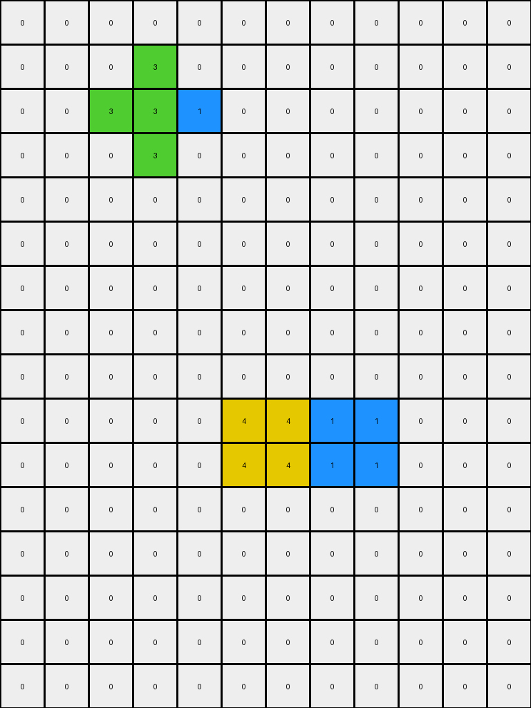
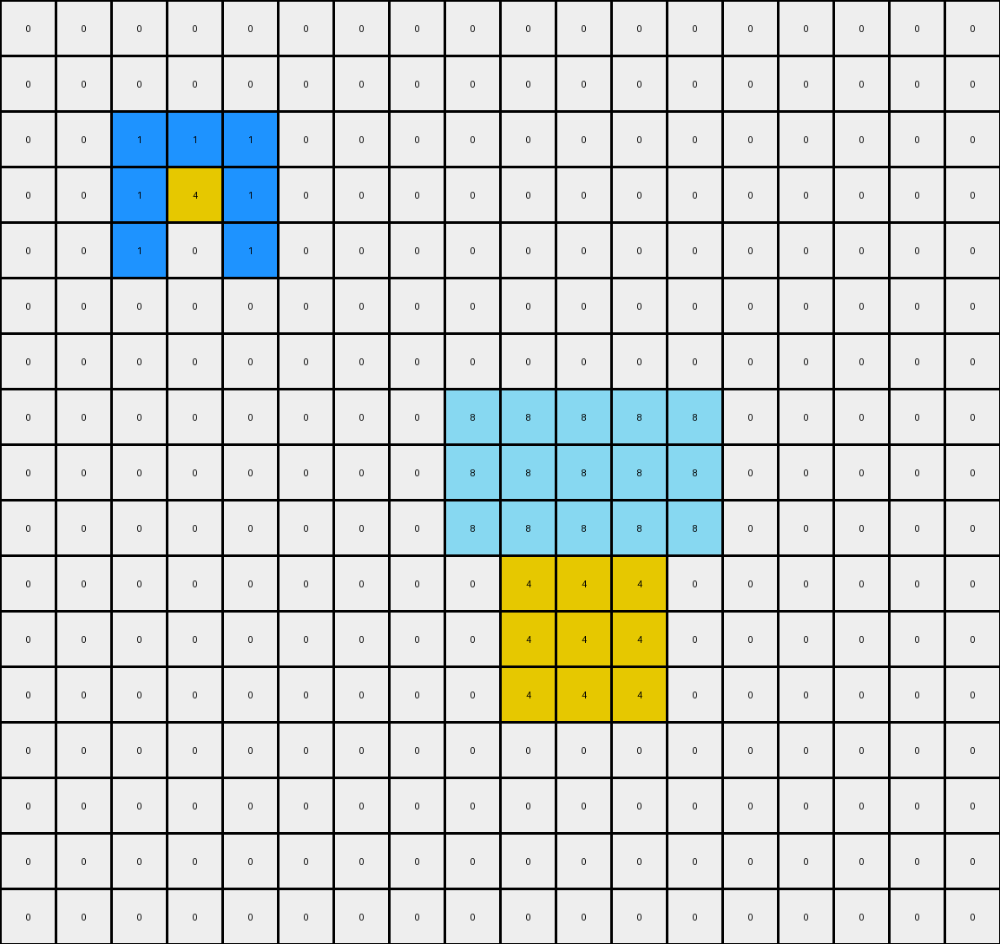

# 57aa92db • 024 • refine_coder

---

Previous Code:
```python
"""
1.  **Object Identification:** Identify all contiguous objects (non-white pixels) in the input grid.
2.  **Green Expansion (Conditional):** If a green object exists, expand it by one pixel *only* in the directions where it is directly adjacent (orthogonally) to another object.
3.  **Yellow Expansion (Conditional):** If a yellow object exists, and it's orthogonally adjacent to a red object to its immediate left, extend left by one. If adjacent and down below, expand down by one.
4. **Magenta Expansion (Conditional)**: If a magenta object exists and there is a red pixel to the immediate NW diagonal, extend left by one and up by one.
5.  **Azure Expansion (Conditional)**: If an azure square is detected and it has space on either of its horizontal sides, expand in both directions.
6.  **Preservation:** All other objects retain their original shape and position.
7.  **Background:** White pixels (0) remain unchanged unless filled by an expanding object.
"""

import numpy as np

def find_objects(grid):
    """Finds contiguous objects in a grid."""
    objects = []
    visited = set()
    rows, cols = grid.shape

    def dfs(r, c, obj_color, current_object):
        if (r, c) in visited or not (0 <= r < rows and 0 <= c < cols) or grid[r, c] != obj_color:
            return
        visited.add((r, c))
        current_object.append((r, c))
        for dr, dc in [(0, 1), (0, -1), (1, 0), (-1, 0)]:
            dfs(r + dr, c + dc, obj_color, current_object)

    for r in range(rows):
        for c in range(cols):
            if grid[r, c] != 0 and (r, c) not in visited:
                current_object = []
                dfs(r, c, grid[r, c], current_object)
                objects.append((grid[r, c], current_object))  # Store color and object pixels
    return objects

def is_adjacent(obj1_pixels, obj2_pixels):
    """Checks if two objects are orthogonally adjacent."""
    for r1, c1 in obj1_pixels:
        for dr, dc in [(0, 1), (0, -1), (1, 0), (-1, 0)]:
            if (r1 + dr, c1 + dc) in obj2_pixels:
                return True
    return False

def expand_adjacent(grid, object_pixels, color):
    """Expands object by one pixel in orthogonal directions adjacent to existing."""
    new_pixels = set(object_pixels)
    rows, cols = grid.shape

    for r, c in object_pixels:
        for dr, dc in [(0, 1), (0, -1), (1, 0), (-1, 0)]:
            nr, nc = r + dr, c + dc
            if 0 <= nr < rows and 0 <= nc < cols and grid[nr,nc] != 0:
                new_pixels.add((nr,nc))
    return list(new_pixels)
    
def get_neighbors(grid, r, c):
    """Returns the orthogonal and diagonal neighbors of a cell."""
    rows, cols = grid.shape
    neighbors = []
    # Orthogonal
    for dr, dc in [(0, 1), (0, -1), (1, 0), (-1, 0)]:
        nr, nc = r + dr, c + dc
        if 0 <= nr < rows and 0 <= nc < cols:
            neighbors.append((nr, nc, "orthogonal"))

    # Diagonal
    for dr, dc in [(-1, -1), (-1, 1), (1, -1), (1, 1)]:
      nr, nc = r+dr, c+dc
      if 0 <= nr < rows and 0 <= nc < cols:
          neighbors.append((nr, nc, "diagonal"))
    return neighbors

def transform(input_grid):
    # initialize output_grid
    output_grid = np.zeros_like(input_grid)
    rows, cols = input_grid.shape

    # Find all objects in the input grid
    objects = find_objects(input_grid)

    # Create a dictionary for easier access
    object_dict = {}
    for color, pixels in objects:
        object_dict.setdefault(color, []).extend(pixels)

    for color, obj_pixels in objects:
        if color == 3:  # Green object (Conditional Expansion)
            expanded_pixels = expand_adjacent(input_grid, obj_pixels, 3)
            for r, c in expanded_pixels:
              output_grid[r,c] = 3
        elif color == 4: #yellow
            output_pixels = obj_pixels[:]
            for r,c in obj_pixels:
              neighbors = get_neighbors(input_grid,r,c)
              for nr, nc, ntype in neighbors:
                if ntype == "orthogonal":
                    if input_grid[nr,nc] == 2: #red
                      if nr == r-1:
                        output_pixels.append((nr-1, nc)) #fill up
                      elif nr == r+1:
                        output_pixels.append((nr+1, nc)) #fill down
                      elif nc == c+1:
                        output_pixels.append((nr, nc+1)) #fill right
                      elif nc == c-1:
                        output_pixels.append((nr, nc-1)) #fill left
            for r, c in output_pixels:
                output_grid[r,c] = 4
        elif color == 6: #magenta
            output_pixels = obj_pixels[:]
            for r, c in obj_pixels:
              neighbors = get_neighbors(input_grid, r,c)
              for nr, nc, ntype in neighbors:
                if input_grid[nr,nc] == 2 and ntype == "diagonal" and (nr, nc) == (r-1,c-1): #red NW
                    output_pixels.append((r-1,c)) #fill up
                    output_pixels.append((r,c-1)) #fill left
            for r, c in output_pixels:
                output_grid[r, c] = 6
        elif color == 8:  # Azure (Conditional Expansion)
            output_pixels = obj_pixels[:]
            min_c = min(c for _, c in obj_pixels)
            max_c = max(c for _, c in obj_pixels)
            min_r = min(r for r, _ in obj_pixels)
            max_r = max(r for r, _ in obj_pixels)

            #check if square
            if (max_c - min_c) == (max_r - min_r):
                can_expand_left = True
                can_expand_right = True
                #check left
                for r in range(min_r, max_r +1):
                    if min_c -1 < 0 or input_grid[r, min_c-1] != 0:
                        can_expand_left = False
                        break

                #check right
                for r in range(min_r, max_r +1):
                    if max_c+1 >=cols or input_grid[r, max_c+1] != 0:
                        can_expand_right = False
                        break

                if can_expand_left:
                    for r in range(min_r, max_r+1):
                        output_pixels.append((r, min_c-1))
                if can_expand_right:
                     for r in range(min_r, max_r+1):
                        output_pixels.append((r, max_c+1))
            for r, c in output_pixels:
                output_grid[r, c] = 8
        else:  # Other objects - preserve
            for r, c in obj_pixels:
                output_grid[r, c] = color

    return output_grid
```

Train Set Results:

## Example 1:

Input:
```
0 0 0 0 0 0 0 0 0 0 0 0
0 0 0 3 0 0 0 0 0 0 0 0
0 0 3 3 1 0 0 0 0 0 0 0
0 0 0 3 0 0 0 0 0 0 0 0
0 0 0 0 0 0 0 0 0 0 0 0
0 0 0 0 0 0 0 0 0 0 0 0
0 0 0 0 0 0 0 0 0 0 0 0
0 0 0 0 0 0 0 0 0 0 0 0
0 0 0 0 0 0 0 0 0 0 0 0
0 0 0 0 0 4 4 1 1 0 0 0
0 0 0 0 0 4 4 1 1 0 0 0
0 0 0 0 0 0 0 0 0 0 0 0
0 0 0 0 0 0 0 0 0 0 0 0
0 0 0 0 0 0 0 0 0 0 0 0
0 0 0 0 0 0 0 0 0 0 0 0
0 0 0 0 0 0 0 0 0 0 0 0
```
Expected Output:
```
0 0 0 0 0 0 0 0 0 0 0 0
0 0 0 3 0 0 0 0 0 0 0 0
0 0 3 3 1 0 0 0 0 0 0 0
0 0 0 3 0 0 0 0 0 0 0 0
0 0 0 0 0 0 0 0 0 0 0 0
0 0 0 0 0 0 0 0 0 0 0 0
0 0 0 0 0 0 0 0 0 0 0 0
0 0 0 0 0 4 4 0 0 0 0 0
0 0 0 0 0 4 4 0 0 0 0 0
0 0 0 4 4 4 4 1 1 0 0 0
0 0 0 4 4 4 4 1 1 0 0 0
0 0 0 0 0 4 4 0 0 0 0 0
0 0 0 0 0 4 4 0 0 0 0 0
0 0 0 0 0 0 0 0 0 0 0 0
0 0 0 0 0 0 0 0 0 0 0 0
0 0 0 0 0 0 0 0 0 0 0 0
```
Transformed Output:
```
0 0 0 0 0 0 0 0 0 0 0 0
0 0 0 3 0 0 0 0 0 0 0 0
0 0 3 3 1 0 0 0 0 0 0 0
0 0 0 3 0 0 0 0 0 0 0 0
0 0 0 0 0 0 0 0 0 0 0 0
0 0 0 0 0 0 0 0 0 0 0 0
0 0 0 0 0 0 0 0 0 0 0 0
0 0 0 0 0 0 0 0 0 0 0 0
0 0 0 0 0 0 0 0 0 0 0 0
0 0 0 0 0 4 4 1 1 0 0 0
0 0 0 0 0 4 4 1 1 0 0 0
0 0 0 0 0 0 0 0 0 0 0 0
0 0 0 0 0 0 0 0 0 0 0 0
0 0 0 0 0 0 0 0 0 0 0 0
0 0 0 0 0 0 0 0 0 0 0 0
0 0 0 0 0 0 0 0 0 0 0 0
```

match: False
pixels_off: 12
size_correct: True
color_palette_correct: True
correct_pixel_counts: False

## Example 2:

Input:
```
0 0 0 0 0 0 0 0 0 0 0 0 0 0 0 0 0 0
0 0 0 0 0 8 0 0 0 0 0 0 0 0 0 0 0 0
0 0 2 8 8 8 0 0 0 0 0 0 0 0 0 0 0 0
0 0 0 0 0 8 0 0 0 0 0 0 0 0 0 0 0 0
0 0 0 0 0 0 0 0 0 0 0 0 0 0 0 0 0 0
0 0 0 0 0 0 0 0 0 0 0 0 0 0 0 0 0 0
0 0 0 0 0 0 0 0 0 0 0 0 0 0 0 0 0 0
0 0 0 0 0 0 0 0 0 0 2 6 0 0 0 0 0 0
0 0 0 0 0 0 0 0 0 0 0 0 0 0 0 0 0 0
0 0 0 0 0 0 0 0 0 0 0 0 0 0 0 0 0 0
0 0 0 0 0 0 0 0 0 0 0 0 0 0 0 0 0 0
0 0 0 0 0 0 0 0 0 0 0 0 0 0 0 0 0 0
0 0 0 0 0 2 3 0 0 0 0 0 0 0 0 0 0 0
0 0 0 0 0 0 0 0 0 0 0 0 0 0 0 0 0 0
0 0 0 0 0 0 0 0 0 0 0 0 0 0 0 0 0 0
0 0 0 0 0 0 0 0 0 0 0 0 0 0 0 0 0 0
```
Expected Output:
```
0 0 0 0 0 0 0 0 0 0 0 0 0 0 0 0 0 0
0 0 0 0 0 8 0 0 0 0 0 0 0 0 0 0 0 0
0 0 2 8 8 8 0 0 0 0 0 0 0 0 0 0 0 0
0 0 0 0 0 8 0 0 0 0 0 0 0 0 0 0 0 0
0 0 0 0 0 0 0 0 0 0 0 0 0 0 0 0 0 0
0 0 0 0 0 0 0 0 0 0 0 0 0 0 0 0 0 0
0 0 0 0 0 0 0 0 0 0 0 0 0 6 0 0 0 0
0 0 0 0 0 0 0 0 0 0 2 6 6 6 0 0 0 0
0 0 0 0 0 0 0 0 0 0 0 0 0 6 0 0 0 0
0 0 0 0 0 0 0 0 0 0 0 0 0 0 0 0 0 0
0 0 0 0 0 0 0 0 0 0 0 0 0 0 0 0 0 0
0 0 0 0 0 0 0 0 3 0 0 0 0 0 0 0 0 0
0 0 0 0 0 2 3 3 3 0 0 0 0 0 0 0 0 0
0 0 0 0 0 0 0 0 3 0 0 0 0 0 0 0 0 0
0 0 0 0 0 0 0 0 0 0 0 0 0 0 0 0 0 0
0 0 0 0 0 0 0 0 0 0 0 0 0 0 0 0 0 0
```
Transformed Output:
```
0 0 0 0 0 0 0 0 0 0 0 0 0 0 0 0 0 0
0 0 0 0 0 8 8 0 0 0 0 0 0 0 0 0 0 0
0 0 2 8 8 8 8 0 0 0 0 0 0 0 0 0 0 0
0 0 0 0 0 8 8 0 0 0 0 0 0 0 0 0 0 0
0 0 0 0 0 0 0 0 0 0 0 0 0 0 0 0 0 0
0 0 0 0 0 0 0 0 0 0 0 0 0 0 0 0 0 0
0 0 0 0 0 0 0 0 0 0 0 0 0 0 0 0 0 0
0 0 0 0 0 0 0 0 0 0 2 6 0 0 0 0 0 0
0 0 0 0 0 0 0 0 0 0 0 0 0 0 0 0 0 0
0 0 0 0 0 0 0 0 0 0 0 0 0 0 0 0 0 0
0 0 0 0 0 0 0 0 0 0 0 0 0 0 0 0 0 0
0 0 0 0 0 0 0 0 0 0 0 0 0 0 0 0 0 0
0 0 0 0 0 3 3 0 0 0 0 0 0 0 0 0 0 0
0 0 0 0 0 0 0 0 0 0 0 0 0 0 0 0 0 0
0 0 0 0 0 0 0 0 0 0 0 0 0 0 0 0 0 0
0 0 0 0 0 0 0 0 0 0 0 0 0 0 0 0 0 0
```

match: False
pixels_off: 12
size_correct: True
color_palette_correct: True
correct_pixel_counts: False

## Example 3:

Input:
```
0 0 0 0 0 0 0 0 0 0 0 0 0 0 0 0 0 0
0 0 0 0 0 0 0 0 0 0 0 0 0 0 0 0 0 0
0 0 1 1 1 0 0 0 0 0 0 0 0 0 0 0 0 0
0 0 1 4 1 0 0 0 0 0 0 0 0 0 0 0 0 0
0 0 1 0 1 0 0 0 0 0 0 0 0 0 0 0 0 0
0 0 0 0 0 0 0 0 0 0 0 0 0 0 0 0 0 0
0 0 0 0 0 0 0 0 0 0 0 0 0 0 0 0 0 0
0 0 0 0 0 0 0 0 0 8 8 8 0 0 0 0 0 0
0 0 0 0 0 0 0 0 0 8 8 8 0 0 0 0 0 0
0 0 0 0 0 0 0 0 0 8 8 8 0 0 0 0 0 0
0 0 0 0 0 0 0 0 0 4 4 4 0 0 0 0 0 0
0 0 0 0 0 0 0 0 0 4 4 4 0 0 0 0 0 0
0 0 0 0 0 0 0 0 0 4 4 4 0 0 0 0 0 0
0 0 0 0 0 0 0 0 0 0 0 0 0 0 0 0 0 0
0 0 0 0 0 0 0 0 0 0 0 0 0 0 0 0 0 0
0 0 0 0 0 0 0 0 0 0 0 0 0 0 0 0 0 0
0 0 0 0 0 0 0 0 0 0 0 0 0 0 0 0 0 0
```
Expected Output:
```
0 0 0 0 0 0 0 0 0 0 0 0 0 0 0 0 0 0
0 0 0 0 0 0 0 0 0 0 0 0 0 0 0 0 0 0
0 0 1 1 1 0 0 0 0 0 0 0 0 0 0 0 0 0
0 0 1 4 1 0 0 0 0 0 0 0 0 0 0 0 0 0
0 0 1 0 1 0 0 0 0 0 0 0 0 0 0 0 0 0
0 0 0 0 0 0 0 0 0 0 0 0 0 0 0 0 0 0
0 0 0 0 0 0 0 0 0 0 0 0 0 0 0 0 0 0
0 0 0 0 0 0 8 8 8 8 8 8 8 8 8 0 0 0
0 0 0 0 0 0 8 8 8 8 8 8 8 8 8 0 0 0
0 0 0 0 0 0 8 8 8 8 8 8 8 8 8 0 0 0
0 0 0 0 0 0 8 8 8 4 4 4 8 8 8 0 0 0
0 0 0 0 0 0 8 8 8 4 4 4 8 8 8 0 0 0
0 0 0 0 0 0 8 8 8 4 4 4 8 8 8 0 0 0
0 0 0 0 0 0 8 8 8 0 0 0 8 8 8 0 0 0
0 0 0 0 0 0 8 8 8 0 0 0 8 8 8 0 0 0
0 0 0 0 0 0 8 8 8 0 0 0 8 8 8 0 0 0
0 0 0 0 0 0 0 0 0 0 0 0 0 0 0 0 0 0
```
Transformed Output:
```
0 0 0 0 0 0 0 0 0 0 0 0 0 0 0 0 0 0
0 0 0 0 0 0 0 0 0 0 0 0 0 0 0 0 0 0
0 0 1 1 1 0 0 0 0 0 0 0 0 0 0 0 0 0
0 0 1 4 1 0 0 0 0 0 0 0 0 0 0 0 0 0
0 0 1 0 1 0 0 0 0 0 0 0 0 0 0 0 0 0
0 0 0 0 0 0 0 0 0 0 0 0 0 0 0 0 0 0
0 0 0 0 0 0 0 0 0 0 0 0 0 0 0 0 0 0
0 0 0 0 0 0 0 0 8 8 8 8 8 0 0 0 0 0
0 0 0 0 0 0 0 0 8 8 8 8 8 0 0 0 0 0
0 0 0 0 0 0 0 0 8 8 8 8 8 0 0 0 0 0
0 0 0 0 0 0 0 0 0 4 4 4 0 0 0 0 0 0
0 0 0 0 0 0 0 0 0 4 4 4 0 0 0 0 0 0
0 0 0 0 0 0 0 0 0 4 4 4 0 0 0 0 0 0
0 0 0 0 0 0 0 0 0 0 0 0 0 0 0 0 0 0
0 0 0 0 0 0 0 0 0 0 0 0 0 0 0 0 0 0
0 0 0 0 0 0 0 0 0 0 0 0 0 0 0 0 0 0
0 0 0 0 0 0 0 0 0 0 0 0 0 0 0 0 0 0
```

match: False
pixels_off: 48
size_correct: True
color_palette_correct: True
correct_pixel_counts: False

## Example 4:

Input:
```
0 0 0 0 0 0 0 0 0 0 0 0 0 0 0 0 0 0
0 0 0 0 0 0 0 0 0 0 0 0 0 0 0 0 0 0
0 0 0 0 3 2 0 0 0 0 0 0 0 0 0 0 0 0
0 0 0 0 0 0 0 0 0 0 0 0 0 0 8 0 0 0
0 0 0 0 0 0 0 0 0 0 0 0 8 8 2 0 0 0
0 0 0 0 0 0 0 0 0 0 0 0 0 0 8 0 0 0
0 0 0 0 0 0 0 0 0 0 0 0 0 0 0 0 0 0
0 0 0 0 0 0 4 4 0 0 0 0 0 0 0 0 0 0
0 0 0 0 0 0 4 4 0 0 0 0 0 0 0 0 0 0
0 0 0 0 0 0 2 2 0 0 0 0 0 0 0 0 0 0
0 0 0 0 0 0 2 2 0 0 0 0 0 0 0 0 0 0
0 0 0 0 0 0 0 0 0 0 0 0 0 0 0 0 0 0
0 0 0 0 0 0 0 0 0 0 0 0 0 0 0 0 0 0
0 0 0 0 0 0 0 0 0 0 0 0 0 0 0 0 0 0
0 0 0 0 0 0 0 0 0 0 0 0 0 0 0 0 0 0
```
Expected Output:
```
0 0 0 0 0 0 0 0 0 0 0 0 0 0 0 0 0 0
0 0 0 0 0 3 0 0 0 0 0 0 0 0 0 0 0 0
0 0 0 3 3 2 0 0 0 0 0 0 0 0 0 0 0 0
0 0 0 0 0 3 0 0 0 0 0 0 0 0 8 0 0 0
0 0 0 0 0 0 0 0 0 0 0 0 8 8 2 0 0 0
0 0 0 0 0 0 0 0 0 0 0 0 0 0 8 0 0 0
0 0 0 0 0 0 0 0 0 0 0 0 0 0 0 0 0 0
0 0 0 0 0 0 4 4 0 0 0 0 0 0 0 0 0 0
0 0 0 0 0 0 4 4 0 0 0 0 0 0 0 0 0 0
0 0 4 4 4 4 2 2 0 0 0 0 0 0 0 0 0 0
0 0 4 4 4 4 2 2 0 0 0 0 0 0 0 0 0 0
0 0 0 0 0 0 4 4 0 0 0 0 0 0 0 0 0 0
0 0 0 0 0 0 4 4 0 0 0 0 0 0 0 0 0 0
0 0 0 0 0 0 0 0 0 0 0 0 0 0 0 0 0 0
0 0 0 0 0 0 0 0 0 0 0 0 0 0 0 0 0 0
```
Transformed Output:
```
0 0 0 0 0 0 0 0 0 0 0 0 0 0 0 0 0 0
0 0 0 0 0 0 0 0 0 0 0 0 0 0 0 0 0 0
0 0 0 0 3 2 0 0 0 0 0 0 0 0 0 0 0 0
0 0 0 0 0 0 0 0 0 0 0 0 0 8 8 8 0 0
0 0 0 0 0 0 0 0 0 0 0 0 8 8 2 0 0 0
0 0 0 0 0 0 0 0 0 0 0 0 0 8 8 8 0 0
0 0 0 0 0 0 0 0 0 0 0 0 0 0 0 0 0 0
0 0 0 0 0 0 4 4 0 0 0 0 0 0 0 0 0 0
0 0 0 0 0 0 4 4 0 0 0 0 0 0 0 0 0 0
0 0 0 0 0 0 2 2 0 0 0 0 0 0 0 0 0 0
0 0 0 0 0 0 2 2 0 0 0 0 0 0 0 0 0 0
0 0 0 0 0 0 0 0 0 0 0 0 0 0 0 0 0 0
0 0 0 0 0 0 0 0 0 0 0 0 0 0 0 0 0 0
0 0 0 0 0 0 0 0 0 0 0 0 0 0 0 0 0 0
0 0 0 0 0 0 0 0 0 0 0 0 0 0 0 0 0 0
```

match: False
pixels_off: 19
size_correct: True
color_palette_correct: True
correct_pixel_counts: False
Here's an analysis of the provided examples and a revised natural language program:

**General Assessment:**

The initial natural language program and the generated code had several shortcomings, leading to mismatches in multiple test cases. The core issues stem from:

1.  **Incomplete Conditional Expansion Logic:** The expansion rules for green, yellow, magenta, and azure were not comprehensive enough, and didn't account for all possible scenarios of adjacency and relative positioning.
2.  **Incorrect Neighbor Handling:** The neighbor checking logic (especially for yellow and magenta) had flaws in determining the precise expansion direction. There was confusion of concepts, like expansion and shifting the colors.
3. **Azure Expansion**: Azure expansion should be constrained to squares.

**Strategy for Resolving Errors:**

1.  **Refine Expansion Conditions:** Carefully re-examine each color's expansion rules based on *all* training examples. Pay very close attention to *relative positions* and *adjacency types*.
2.  **Precise Neighbor Checks:** Use a more structured approach to neighbor checking. Explicitly distinguish between orthogonal and diagonal neighbors, and verify their positions *relative* to the object being expanded.
3. **Correct Azure Expansion**: Ensure only squares of azure expand and only do so on the left and right.

**Example Metrics and Analysis:**

Here's a breakdown of each example, highlighting the discrepancies:

*   **Example 1:**
    *   **Issue:** Yellow expansion near red did not occur. Yellow did not expand adjacent to existing red pixels.
    *   **Pixels Off:** 12
    * **Observed behavior:** No expansion of any colors.

*   **Example 2:**
    *   **Issue:** Green and azure did not extend correctly, and magenta did not expand.
    *   **Pixels Off:** 12
    * **Observed behavior**: Incorrect azure expansion to the right. Green did not expand, adjacent to the grey. Magenta had no expansion.

*   **Example 3:**
    *   **Issue:** Azure expansion was incorrect. Should have expanded on left and right.
    *   **Pixels Off:** 48
    * **Observed behavior**: No expansion, except a small, incorrect Azure expansion.

*   **Example 4:**
    *   **Issue:** Green and yellow did not expand correctly.
    *   **Pixels Off:** 19
    *   **Observed behavior**: Yellow expansion did not occur. Green did not expand adjacent to the red. Incorrect azure expansion.

**YAML Fact Representation:**

```yaml
facts:
  - object: Green
    color: 3
    expansion_rule: "Expand one pixel orthogonally adjacent to *any* other non-white object."
  - object: Yellow
    color: 4
    expansion_rule: "Expand one pixel in all orthogonal directions adjacent to a red object."
  - object: Magenta
    color: 6
    expansion_rule: "If a red pixel is diagonally NW, expand one pixel left and one pixel up."
  - object: Azure
    color: 8
    expansion_rule: "If the azure object is a square, expand one pixel to the left and one to the right, if the expansion would be onto a white space."
  - object: Other
    expansion_rule: "Objects of other colors do not change."
```

**Natural Language Program:**

1.  **Object Identification:** Identify all contiguous objects (connected components of non-white pixels) in the input grid.

2.  **Green Expansion:** For each green (color 3) object, expand it by one pixel in all orthogonal directions (up, down, left, right) where it is directly adjacent to *any* other non-white colored pixel.

3.  **Yellow Expansion:** For each yellow (color 4) object, expand one pixel orthogonally in any direction where a red object is directly adjacent.

4.  **Magenta Expansion:** For each magenta (color 6) object: if a red pixel exists diagonally up and to the left (NW), expand the magenta object by one pixel to the left and one pixel up.

5. **Azure Expansion:** If there is an Azure colored square, expand one pixel to the left and one to the right.

6.  **Preservation:** All other objects retain their original shape and position.

7.  **Background:** White pixels (0) remain unchanged unless filled by an expanding object.

**INSTRUCTIONS**

- generate a Python module to represent the natural language program 
- follow the template below
- all common math and science libraries are available
- create docstring only at top - but comment the workflow in the function
- use helper functions for common operations like finding objects, counting,
  measuring, moving, etc. 

remember - we are working iteratively - so this code will inform your future
self as we converge on the solution

*template:*

```python
"""
{{ natural language description of the transformation rule }}
"""

{{ imports }}

def transform(input_grid):
    # initialize output_grid

    # change output pixels 

    return output_grid

```
