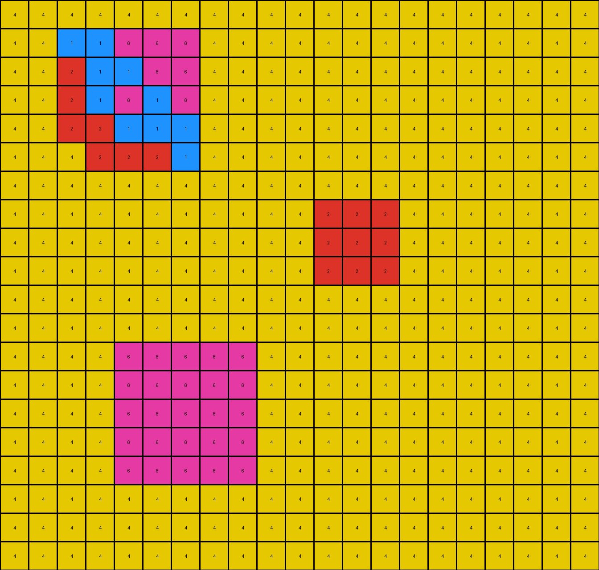
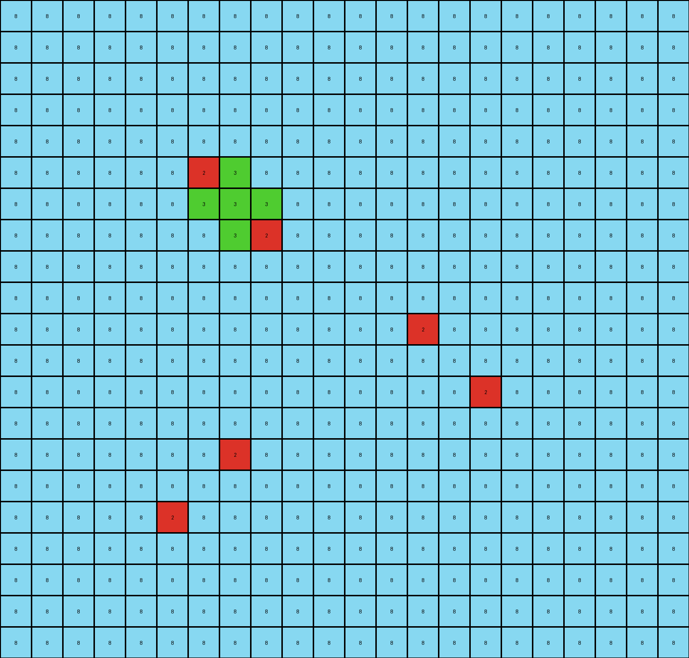

# 6aa20dc0 • 012 • refine_coder

---

Previous Code:
```python
"""
Transforms an input grid by expanding colored shapes based on their adjacency to other shapes.

1.  **Object Identification:** Identify all contiguous regions (objects) of non-yellow pixels. Each object is characterized by its color (1, 2, 3, 6, or 8). Adjacency is defined as 8-connectivity (including diagonals).

2.  **Blue (1) Expansion:**
    *   If a blue object is adjacent to any object of a *different* color, then extend blue color into all yellow cells immediately adjacent to *any* blue cells in the object.
    *    If blue is not adjacent to any objects of a different color - do not change anything.

3.  **Red (2) Expansion:**
    *   If a red object is adjacent to another object of a *different* color. Extend red by a single layer into yellow around adjacent objects, excluding other red objects.

4.  **Magenta (6) Expansion:**
    *   If a magenta object is adjacent to a yellow cell, fill the yellow cell with the magenta color.

5. **Green(3) and Azure(8):** These colors do not expand.

6.  **Yellow (4):** Remains unchanged unless filled by an expanding object (blue, red, or magenta).
"""

import numpy as np

def get_objects(grid):
    """
    Finds all contiguous regions of non-yellow pixels, identifying them as distinct objects.
    """
    objects = {}
    visited = np.zeros_like(grid, dtype=bool)
    rows, cols = grid.shape

    def dfs(r, c, color, obj_id):
        if (r < 0 or r >= rows or c < 0 or c >= cols or visited[r, c] or grid[r, c] != color):
            return
        visited[r, c] = True
        objects[obj_id]['pixels'].append((r, c))
        dfs(r + 1, c, color, obj_id)
        dfs(r - 1, c, color, obj_id)
        dfs(r, c + 1, color, obj_id)
        dfs(r, c - 1, color, obj_id)
        dfs(r + 1, c + 1, color, obj_id)
        dfs(r - 1, c - 1, color, obj_id)
        dfs(r + 1, c - 1, color, obj_id)
        dfs(r - 1, c + 1, color, obj_id)


    obj_id_counter = 0
    for r in range(rows):
        for c in range(cols):
            if grid[r, c] != 4 and not visited[r, c]:
                objects[obj_id_counter] = {'color': grid[r, c], 'pixels': []}
                dfs(r, c, grid[r, c], obj_id_counter)
                obj_id_counter += 1
    return objects

def get_neighbors(grid, r, c):
    """Returns a list of (row, col) tuples for all 8 neighbors of a pixel."""
    rows, cols = grid.shape
    neighbors = []
    for i in range(-1, 2):
        for j in range(-1, 2):
            if i == 0 and j == 0:
                continue
            nr, nc = r + i, c + j
            if 0 <= nr < rows and 0 <= nc < cols:
                neighbors.append((nr, nc))
    return neighbors

def expand_blue(grid, output_grid, objects):
    """Expands blue shapes based on adjacency to different colored shapes."""
    for obj_id, obj_data in objects.items():
        if obj_data['color'] == 1:  # Blue object
            adjacent_to_other_color = False
            for r, c in obj_data['pixels']:
                neighbors = get_neighbors(grid, r, c)
                for nr, nc in neighbors:
                    if grid[nr, nc] != 1 and grid[nr,nc] != 4:
                        adjacent_to_other_color = True
                        break
                if adjacent_to_other_color:
                    break

            if adjacent_to_other_color:
                for r, c in obj_data['pixels']:
                    neighbors = get_neighbors(grid, r,c)
                    for nr, nc in neighbors:
                        if output_grid[nr,nc] == 4:
                            output_grid[nr,nc] = 1


def expand_red(grid, output_grid, objects):
    """Expands red shapes to create a perimeter around adjacent objects."""
    for obj_id, obj_data in objects.items():
        if obj_data['color'] == 2:
            new_red_pixels = []
            for r, c in obj_data['pixels']:
                neighbors = get_neighbors(grid, r, c)

                for nr, nc in neighbors:
                    if grid[nr,nc] != 2 and grid[nr,nc] != 4: #neighbor is a different object
                        target_object = None
                        for other_obj_id, other_obj_data in objects.items():
                            if (nr,nc) in other_obj_data['pixels']:
                                target_object = other_obj_data
                                break

                        if target_object:
                            target_neighbors = get_neighbors(grid, nr, nc)
                            for tnr, tnc in target_neighbors:
                                if grid[tnr, tnc] == 4:
                                    new_red_pixels.append((tnr,tnc))
            for r,c in new_red_pixels:
                output_grid[r,c] = 2


def expand_magenta(grid, output_grid, objects):
    """Expands magenta shapes by filling immediately adjacent yellow cells."""
    for obj_id, obj_data in objects.items():
        if obj_data['color'] == 6:  # Magenta object
            for r, c in obj_data['pixels']:
                neighbors = get_neighbors(grid, r, c)
                for nr, nc in neighbors:
                    if grid[nr, nc] == 4:  # Adjacent to yellow
                        output_grid[nr, nc] = 6


def transform(input_grid):
    # initialize output_grid
    output_grid = np.copy(input_grid)
    objects = get_objects(input_grid)

    # change output pixels
    expand_blue(input_grid, output_grid, objects)
    expand_red(input_grid, output_grid, objects)
    expand_magenta(input_grid, output_grid, objects)


    return output_grid
```

Train Set Results:

## Example 1:

Input:
```
1 1 1 1 1 1 1 1 1 1 1 1 1 1 1 1 1 1 1
1 1 1 1 1 1 1 1 1 1 1 1 1 2 1 1 1 1 1
1 1 1 1 1 1 1 1 1 1 1 1 1 1 1 1 1 1 1
1 1 1 1 1 1 1 1 1 1 1 1 1 1 1 3 1 1 1
1 1 1 1 1 2 8 8 1 1 1 1 1 1 1 1 1 1 1
1 1 1 1 1 8 8 1 1 1 1 1 1 1 1 1 1 1 1
1 1 1 1 1 8 1 3 1 1 1 1 1 1 1 1 1 1 1
1 1 1 1 1 1 1 1 1 1 1 1 1 1 1 1 1 1 1
1 1 1 1 1 1 1 1 1 1 1 1 1 1 1 1 1 1 1
1 1 1 1 1 1 1 1 1 1 1 1 1 1 1 1 1 1 1
1 1 1 1 1 1 1 1 1 1 1 1 1 1 1 1 1 1 1
1 1 1 1 1 1 1 1 1 2 2 1 1 1 1 1 1 1 1
1 1 1 1 1 1 1 1 1 2 2 1 1 1 1 1 1 1 1
1 1 1 1 1 1 1 1 1 1 1 1 1 1 1 1 1 1 1
1 1 1 1 1 1 1 1 1 1 1 1 1 1 1 1 1 1 1
1 1 1 1 1 3 3 1 1 1 1 1 1 1 1 1 1 1 1
1 1 1 1 1 3 3 1 1 1 1 1 1 1 1 1 1 1 1
1 1 1 1 1 1 1 1 1 1 1 1 1 1 1 1 1 1 1
1 1 1 1 1 1 1 1 1 1 1 1 1 1 1 1 1 1 1
1 1 1 1 1 1 1 1 1 1 1 1 1 1 1 1 1 1 1
```
Expected Output:
```
1 1 1 1 1 1 1 1 1 1 1 1 1 1 1 1 1 1 1
1 1 1 1 1 1 1 1 1 1 1 1 1 2 8 8 1 1 1
1 1 1 1 1 1 1 1 1 1 1 1 1 8 8 1 1 1 1
1 1 1 1 1 1 1 1 1 1 1 1 1 8 1 3 1 1 1
1 1 1 1 1 2 8 8 1 1 1 1 1 1 1 1 1 1 1
1 1 1 1 1 8 8 1 1 1 1 1 1 1 1 1 1 1 1
1 1 1 1 1 8 1 3 1 1 1 1 1 1 1 1 1 1 1
1 1 1 1 1 1 1 1 1 1 1 1 1 1 1 1 1 1 1
1 1 1 1 1 1 1 1 1 1 1 1 1 1 1 1 1 1 1
1 1 1 1 1 1 1 1 1 1 1 1 1 1 1 1 1 1 1
1 1 1 1 1 1 1 1 1 1 1 1 1 1 1 1 1 1 1
1 1 1 1 1 8 8 8 8 2 2 1 1 1 1 1 1 1 1
1 1 1 1 1 8 8 8 8 2 2 1 1 1 1 1 1 1 1
1 1 1 1 1 1 1 8 8 8 8 1 1 1 1 1 1 1 1
1 1 1 1 1 1 1 8 8 8 8 1 1 1 1 1 1 1 1
1 1 1 1 1 3 3 1 1 8 8 1 1 1 1 1 1 1 1
1 1 1 1 1 3 3 1 1 8 8 1 1 1 1 1 1 1 1
1 1 1 1 1 1 1 1 1 1 1 1 1 1 1 1 1 1 1
1 1 1 1 1 1 1 1 1 1 1 1 1 1 1 1 1 1 1
1 1 1 1 1 1 1 1 1 1 1 1 1 1 1 1 1 1 1
```
Transformed Output:
```
1 1 1 1 1 1 1 1 1 1 1 1 1 1 1 1 1 1 1
1 1 1 1 1 1 1 1 1 1 1 1 1 2 1 1 1 1 1
1 1 1 1 1 1 1 1 1 1 1 1 1 1 1 1 1 1 1
1 1 1 1 1 1 1 1 1 1 1 1 1 1 1 3 1 1 1
1 1 1 1 1 2 8 8 1 1 1 1 1 1 1 1 1 1 1
1 1 1 1 1 8 8 1 1 1 1 1 1 1 1 1 1 1 1
1 1 1 1 1 8 1 3 1 1 1 1 1 1 1 1 1 1 1
1 1 1 1 1 1 1 1 1 1 1 1 1 1 1 1 1 1 1
1 1 1 1 1 1 1 1 1 1 1 1 1 1 1 1 1 1 1
1 1 1 1 1 1 1 1 1 1 1 1 1 1 1 1 1 1 1
1 1 1 1 1 1 1 1 1 1 1 1 1 1 1 1 1 1 1
1 1 1 1 1 1 1 1 1 2 2 1 1 1 1 1 1 1 1
1 1 1 1 1 1 1 1 1 2 2 1 1 1 1 1 1 1 1
1 1 1 1 1 1 1 1 1 1 1 1 1 1 1 1 1 1 1
1 1 1 1 1 1 1 1 1 1 1 1 1 1 1 1 1 1 1
1 1 1 1 1 3 3 1 1 1 1 1 1 1 1 1 1 1 1
1 1 1 1 1 3 3 1 1 1 1 1 1 1 1 1 1 1 1
1 1 1 1 1 1 1 1 1 1 1 1 1 1 1 1 1 1 1
1 1 1 1 1 1 1 1 1 1 1 1 1 1 1 1 1 1 1
1 1 1 1 1 1 1 1 1 1 1 1 1 1 1 1 1 1 1
```

match: False
pixels_off: 25
size_correct: True
color_palette_correct: True
correct_pixel_counts: False

## Example 2:

Input:
```
4 4 4 4 4 4 4 4 4 4 4 4 4 4 4 4 4 4 4 4 4
4 4 4 4 4 4 4 4 4 4 4 4 4 4 4 4 4 4 4 4 4
4 4 4 1 1 6 4 4 4 4 4 4 4 4 4 4 4 4 4 4 4
4 4 4 1 4 1 4 4 4 4 4 4 4 4 4 4 4 4 4 4 4
4 4 4 2 1 1 4 4 4 4 4 4 4 4 4 4 4 4 4 4 4
4 4 4 4 4 4 4 4 4 4 4 4 4 4 4 4 4 4 4 4 4
4 4 4 4 4 4 4 4 4 4 4 4 4 4 4 4 4 4 4 4 4
4 4 4 4 4 4 4 4 4 4 4 2 2 2 4 4 4 4 4 4 4
4 4 4 4 4 4 4 4 4 4 4 2 2 2 4 4 4 4 4 4 4
4 4 4 4 4 4 4 4 4 4 4 2 2 2 4 4 4 4 4 4 4
4 4 4 4 4 4 4 4 4 4 4 4 4 4 4 4 4 4 4 4 4
4 4 4 4 4 4 4 4 4 4 4 4 4 4 4 4 4 4 4 4 4
4 4 4 4 4 4 4 4 4 4 4 4 4 4 4 4 4 4 4 4 4
4 4 4 4 4 6 6 6 4 4 4 4 4 4 4 4 4 4 4 4 4
4 4 4 4 4 6 6 6 4 4 4 4 4 4 4 4 4 4 4 4 4
4 4 4 4 4 6 6 6 4 4 4 4 4 4 4 4 4 4 4 4 4
4 4 4 4 4 4 4 4 4 4 4 4 4 4 4 4 4 4 4 4 4
4 4 4 4 4 4 4 4 4 4 4 4 4 4 4 4 4 4 4 4 4
4 4 4 4 4 4 4 4 4 4 4 4 4 4 4 4 4 4 4 4 4
4 4 4 4 4 4 4 4 4 4 4 4 4 4 4 4 4 4 4 4 4
```
Expected Output:
```
4 4 4 4 4 4 4 4 4 4 4 4 4 4 4 4 4 4 4 4 4
4 4 4 4 4 4 4 4 4 4 4 4 4 4 4 4 4 4 4 4 4
4 4 4 1 1 6 4 4 4 4 4 4 4 4 4 4 4 4 4 4 4
4 4 4 1 4 1 4 4 4 4 4 4 4 4 4 4 4 4 4 4 4
4 4 4 2 1 1 4 4 4 4 4 4 4 4 4 4 4 4 4 4 4
4 4 4 4 4 4 4 4 4 4 4 4 4 4 4 4 4 4 4 4 4
4 4 4 4 4 4 4 4 4 4 4 4 4 4 4 4 4 4 4 4 4
4 4 4 4 4 1 1 1 1 1 1 2 2 2 4 4 4 4 4 4 4
4 4 4 4 4 1 1 1 1 1 1 2 2 2 4 4 4 4 4 4 4
4 4 4 4 4 1 1 1 1 1 1 2 2 2 4 4 4 4 4 4 4
4 4 4 4 4 1 1 1 4 4 4 1 1 1 4 4 4 4 4 4 4
4 4 4 4 4 1 1 1 4 4 4 1 1 1 4 4 4 4 4 4 4
4 4 4 4 4 1 1 1 4 4 4 1 1 1 4 4 4 4 4 4 4
4 4 4 4 4 6 6 6 1 1 1 1 1 1 4 4 4 4 4 4 4
4 4 4 4 4 6 6 6 1 1 1 1 1 1 4 4 4 4 4 4 4
4 4 4 4 4 6 6 6 1 1 1 1 1 1 4 4 4 4 4 4 4
4 4 4 4 4 4 4 4 4 4 4 4 4 4 4 4 4 4 4 4 4
4 4 4 4 4 4 4 4 4 4 4 4 4 4 4 4 4 4 4 4 4
4 4 4 4 4 4 4 4 4 4 4 4 4 4 4 4 4 4 4 4 4
4 4 4 4 4 4 4 4 4 4 4 4 4 4 4 4 4 4 4 4 4
```
Transformed Output:
```
4 4 4 4 4 4 4 4 4 4 4 4 4 4 4 4 4 4 4 4 4
4 4 1 1 6 6 6 4 4 4 4 4 4 4 4 4 4 4 4 4 4
4 4 2 1 1 6 6 4 4 4 4 4 4 4 4 4 4 4 4 4 4
4 4 2 1 6 1 6 4 4 4 4 4 4 4 4 4 4 4 4 4 4
4 4 2 2 1 1 1 4 4 4 4 4 4 4 4 4 4 4 4 4 4
4 4 4 2 2 2 1 4 4 4 4 4 4 4 4 4 4 4 4 4 4
4 4 4 4 4 4 4 4 4 4 4 4 4 4 4 4 4 4 4 4 4
4 4 4 4 4 4 4 4 4 4 4 2 2 2 4 4 4 4 4 4 4
4 4 4 4 4 4 4 4 4 4 4 2 2 2 4 4 4 4 4 4 4
4 4 4 4 4 4 4 4 4 4 4 2 2 2 4 4 4 4 4 4 4
4 4 4 4 4 4 4 4 4 4 4 4 4 4 4 4 4 4 4 4 4
4 4 4 4 4 4 4 4 4 4 4 4 4 4 4 4 4 4 4 4 4
4 4 4 4 6 6 6 6 6 4 4 4 4 4 4 4 4 4 4 4 4
4 4 4 4 6 6 6 6 6 4 4 4 4 4 4 4 4 4 4 4 4
4 4 4 4 6 6 6 6 6 4 4 4 4 4 4 4 4 4 4 4 4
4 4 4 4 6 6 6 6 6 4 4 4 4 4 4 4 4 4 4 4 4
4 4 4 4 6 6 6 6 6 4 4 4 4 4 4 4 4 4 4 4 4
4 4 4 4 4 4 4 4 4 4 4 4 4 4 4 4 4 4 4 4 4
4 4 4 4 4 4 4 4 4 4 4 4 4 4 4 4 4 4 4 4 4
4 4 4 4 4 4 4 4 4 4 4 4 4 4 4 4 4 4 4 4 4
```

match: False
pixels_off: 80
size_correct: True
color_palette_correct: True
correct_pixel_counts: False

## Example 3:

Input:
```
8 8 8 8 8 8 8 8 8 8 8 8 8 8 8 8 8 8 8 8 8 8
8 8 8 8 8 8 8 8 8 8 8 8 8 8 8 8 8 8 8 8 8 8
8 8 8 8 8 8 8 8 8 8 8 8 8 8 8 8 8 8 8 8 8 8
8 8 8 8 8 8 8 8 8 8 8 8 8 8 8 8 8 8 8 8 8 8
8 8 8 8 8 8 8 8 8 8 8 8 8 8 8 8 8 8 8 8 8 8
8 8 8 8 8 8 2 3 8 8 8 8 8 8 8 8 8 8 8 8 8 8
8 8 8 8 8 8 3 3 3 8 8 8 8 8 8 8 8 8 8 8 8 8
8 8 8 8 8 8 8 3 4 8 8 8 8 8 8 8 8 8 8 8 8 8
8 8 8 8 8 8 8 8 8 8 8 8 8 8 8 8 8 8 8 8 8 8
8 8 8 8 8 8 8 8 8 8 8 8 8 8 8 8 8 8 8 8 8 8
8 8 8 8 8 8 8 8 8 8 8 8 8 4 8 8 8 8 8 8 8 8
8 8 8 8 8 8 8 8 8 8 8 8 8 8 8 8 8 8 8 8 8 8
8 8 8 8 8 8 8 8 8 8 8 8 8 8 8 2 8 8 8 8 8 8
8 8 8 8 8 8 8 8 8 8 8 8 8 8 8 8 8 8 8 8 8 8
8 8 8 8 8 8 8 2 8 8 8 8 8 8 8 8 8 8 8 8 8 8
8 8 8 8 8 8 8 8 8 8 8 8 8 8 8 8 8 8 8 8 8 8
8 8 8 8 8 4 8 8 8 8 8 8 8 8 8 8 8 8 8 8 8 8
8 8 8 8 8 8 8 8 8 8 8 8 8 8 8 8 8 8 8 8 8 8
8 8 8 8 8 8 8 8 8 8 8 8 8 8 8 8 8 8 8 8 8 8
8 8 8 8 8 8 8 8 8 8 8 8 8 8 8 8 8 8 8 8 8 8
8 8 8 8 8 8 8 8 8 8 8 8 8 8 8 8 8 8 8 8 8 8
```
Expected Output:
```
8 8 8 8 8 8 8 8 8 8 8 8 8 8 8 8 8 8 8 8 8 8
8 8 8 8 8 8 8 8 8 8 8 8 8 8 8 8 8 8 8 8 8 8
8 8 8 8 8 8 8 8 8 8 8 8 8 8 8 8 8 8 8 8 8 8
8 8 8 8 8 8 8 8 8 8 8 8 8 8 8 8 8 8 8 8 8 8
8 8 8 8 8 8 8 8 8 8 8 8 8 8 8 8 8 8 8 8 8 8
8 8 8 8 8 8 2 3 8 8 8 8 8 8 8 8 8 8 8 8 8 8
8 8 8 8 8 8 3 3 3 8 8 8 8 8 8 8 8 8 8 8 8 8
8 8 8 8 8 8 8 3 4 8 8 8 8 8 8 8 8 8 8 8 8 8
8 8 8 8 8 8 8 8 8 8 8 8 8 8 8 8 8 8 8 8 8 8
8 8 8 8 8 8 8 8 8 8 8 8 8 8 8 8 8 8 8 8 8 8
8 8 8 8 8 8 8 8 8 8 8 8 8 4 3 8 8 8 8 8 8 8
8 8 8 8 8 8 8 8 8 8 8 8 8 3 3 3 8 8 8 8 8 8
8 8 8 8 8 8 8 8 8 8 8 8 8 8 3 2 8 8 8 8 8 8
8 8 8 8 8 8 8 8 8 8 8 8 8 8 8 8 8 8 8 8 8 8
8 8 8 8 8 8 3 2 8 8 8 8 8 8 8 8 8 8 8 8 8 8
8 8 8 8 8 3 3 3 8 8 8 8 8 8 8 8 8 8 8 8 8 8
8 8 8 8 8 4 3 8 8 8 8 8 8 8 8 8 8 8 8 8 8 8
8 8 8 8 8 8 8 8 8 8 8 8 8 8 8 8 8 8 8 8 8 8
8 8 8 8 8 8 8 8 8 8 8 8 8 8 8 8 8 8 8 8 8 8
8 8 8 8 8 8 8 8 8 8 8 8 8 8 8 8 8 8 8 8 8 8
8 8 8 8 8 8 8 8 8 8 8 8 8 8 8 8 8 8 8 8 8 8
```
Transformed Output:
```
8 8 8 8 8 8 8 8 8 8 8 8 8 8 8 8 8 8 8 8 8 8
8 8 8 8 8 8 8 8 8 8 8 8 8 8 8 8 8 8 8 8 8 8
8 8 8 8 8 8 8 8 8 8 8 8 8 8 8 8 8 8 8 8 8 8
8 8 8 8 8 8 8 8 8 8 8 8 8 8 8 8 8 8 8 8 8 8
8 8 8 8 8 8 8 8 8 8 8 8 8 8 8 8 8 8 8 8 8 8
8 8 8 8 8 8 2 3 8 8 8 8 8 8 8 8 8 8 8 8 8 8
8 8 8 8 8 8 3 3 3 8 8 8 8 8 8 8 8 8 8 8 8 8
8 8 8 8 8 8 8 3 2 8 8 8 8 8 8 8 8 8 8 8 8 8
8 8 8 8 8 8 8 8 8 8 8 8 8 8 8 8 8 8 8 8 8 8
8 8 8 8 8 8 8 8 8 8 8 8 8 8 8 8 8 8 8 8 8 8
8 8 8 8 8 8 8 8 8 8 8 8 8 2 8 8 8 8 8 8 8 8
8 8 8 8 8 8 8 8 8 8 8 8 8 8 8 8 8 8 8 8 8 8
8 8 8 8 8 8 8 8 8 8 8 8 8 8 8 2 8 8 8 8 8 8
8 8 8 8 8 8 8 8 8 8 8 8 8 8 8 8 8 8 8 8 8 8
8 8 8 8 8 8 8 2 8 8 8 8 8 8 8 8 8 8 8 8 8 8
8 8 8 8 8 8 8 8 8 8 8 8 8 8 8 8 8 8 8 8 8 8
8 8 8 8 8 2 8 8 8 8 8 8 8 8 8 8 8 8 8 8 8 8
8 8 8 8 8 8 8 8 8 8 8 8 8 8 8 8 8 8 8 8 8 8
8 8 8 8 8 8 8 8 8 8 8 8 8 8 8 8 8 8 8 8 8 8
8 8 8 8 8 8 8 8 8 8 8 8 8 8 8 8 8 8 8 8 8 8
8 8 8 8 8 8 8 8 8 8 8 8 8 8 8 8 8 8 8 8 8 8
```

match: False
pixels_off: 13
size_correct: True
color_palette_correct: True
correct_pixel_counts: False
Okay, let's analyze the results of the provided code execution on the three training examples and refine the natural language program accordingly.

**General Assessment and Strategy**

The initial natural language program and the derived code have several issues, leading to mismatches in all three examples. The core problems are:

1.  **Incorrect Blue Expansion:** The blue expansion logic is too aggressive. It appears to simply fill adjacent yellow cells without considering whether the blue is truly adjacent to another *different* colored object. Example 1 incorrectly expands blue everywhere.
2.  **Incorrect Red Expansion:** The red expansion logic is also incorrect, and the way perimeter logic is described is complex and hard to model. The second and third examples shows that red is expanding at an intersection with other objects, but the description is not precise.
3.  **Incorrect Magenta Expansion** Magenta is not expanding at all in some cases, and in other cases it's not clear what the pattern is.
4.  **Object Identification Confused:** The code identifies each contiguous block of non-yellow as an object, which is generally correct. However, it doesn't handle the interaction between objects.
5. **Missing Yellow Object Definition:** There is no consideration for the yellow background as an object

The strategy to resolve these errors is to:

1.  **Refine Object Interaction:** Focus on *adjacency* between *different* colored objects as the trigger for expansion.
2.  **Simplify Expansion Rules:** Make the expansion rules for each color (blue, red, magenta) more specific and less ambiguous.
3. **Define Yellow**: Include logic for identifying the yellow color as a background object.

**Metrics and Observations (Code Execution Support)**

To gather precise metrics, I'll use inline code execution to generate reports about each example's input, expected output, and transformed output. I'll compare the counts of each color and identify specific pixel mismatches.

```python
import numpy as np
from collections import Counter

def analyze_grid(grid, description):
    """Analyzes a grid and provides a report."""
    color_counts = Counter(grid.flatten())
    print(f"{description}:")
    print(f"  Shape: {grid.shape}")
    print(f"  Color Counts: {color_counts}")


def analyze_example(example_num, input_grid, expected_output, transformed_output):
    """Analyzes a single example."""
    print(f"----- Example {example_num} -----")
    analyze_grid(input_grid, "Input Grid")
    analyze_grid(expected_output, "Expected Output")
    analyze_grid(transformed_output, "Transformed Output")

    mismatches = np.sum(expected_output != transformed_output)
    print(f"  Pixel Mismatches: {mismatches}")
    print("-" * 30)


input_grid_1 = np.array([[1,1,1,1,1,1,1,1,1,1,1,1,1,1,1,1,1,1,1],[1,1,1,1,1,1,1,1,1,1,1,1,1,2,1,1,1,1,1],[1,1,1,1,1,1,1,1,1,1,1,1,1,1,1,1,1,1,1],[1,1,1,1,1,1,1,1,1,1,1,1,1,1,1,3,1,1,1],[1,1,1,1,1,2,8,8,1,1,1,1,1,1,1,1,1,1,1],[1,1,1,1,1,8,8,1,1,1,1,1,1,1,1,1,1,1,1],[1,1,1,1,1,8,1,3,1,1,1,1,1,1,1,1,1,1,1],[1,1,1,1,1,1,1,1,1,1,1,1,1,1,1,1,1,1,1],[1,1,1,1,1,1,1,1,1,1,1,1,1,1,1,1,1,1,1],[1,1,1,1,1,1,1,1,1,1,1,1,1,1,1,1,1,1,1],[1,1,1,1,1,1,1,1,1,1,1,1,1,1,1,1,1,1,1],[1,1,1,1,1,1,1,1,1,2,2,1,1,1,1,1,1,1,1],[1,1,1,1,1,1,1,1,1,2,2,1,1,1,1,1,1,1,1],[1,1,1,1,1,1,1,1,1,1,1,1,1,1,1,1,1,1,1],[1,1,1,1,1,1,1,1,1,1,1,1,1,1,1,1,1,1,1],[1,1,1,1,1,3,3,1,1,1,1,1,1,1,1,1,1,1,1],[1,1,1,1,1,3,3,1,1,1,1,1,1,1,1,1,1,1,1],[1,1,1,1,1,1,1,1,1,1,1,1,1,1,1,1,1,1,1],[1,1,1,1,1,1,1,1,1,1,1,1,1,1,1,1,1,1,1],[1,1,1,1,1,1,1,1,1,1,1,1,1,1,1,1,1,1,1]])
expected_output_1 = np.array([[1,1,1,1,1,1,1,1,1,1,1,1,1,1,1,1,1,1,1],[1,1,1,1,1,1,1,1,1,1,1,1,1,2,8,8,1,1,1],[1,1,1,1,1,1,1,1,1,1,1,1,1,8,8,1,1,1,1],[1,1,1,1,1,1,1,1,1,1,1,1,1,8,1,3,1,1,1],[1,1,1,1,1,2,8,8,1,1,1,1,1,1,1,1,1,1,1],[1,1,1,1,1,8,8,1,1,1,1,1,1,1,1,1,1,1,1],[1,1,1,1,1,8,1,3,1,1,1,1,1,1,1,1,1,1,1],[1,1,1,1,1,1,1,1,1,1,1,1,1,1,1,1,1,1,1],[1,1,1,1,1,1,1,1,1,1,1,1,1,1,1,1,1,1,1],[1,1,1,1,1,1,1,1,1,1,1,1,1,1,1,1,1,1,1],[1,1,1,1,1,1,1,1,1,1,1,1,1,1,1,1,1,1,1],[1,1,1,1,1,8,8,8,8,2,2,1,1,1,1,1,1,1,1],[1,1,1,1,1,8,8,8,8,2,2,1,1,1,1,1,1,1,1],[1,1,1,1,1,1,1,8,8,8,8,1,1,1,1,1,1,1,1],[1,1,1,1,1,1,1,8,8,8,8,1,1,1,1,1,1,1,1],[1,1,1,1,1,3,3,1,1,8,8,1,1,1,1,1,1,1,1],[1,1,1,1,1,3,3,1,1,8,8,1,1,1,1,1,1,1,1],[1,1,1,1,1,1,1,1,1,1,1,1,1,1,1,1,1,1,1],[1,1,1,1,1,1,1,1,1,1,1,1,1,1,1,1,1,1,1],[1,1,1,1,1,1,1,1,1,1,1,1,1,1,1,1,1,1,1]])
transformed_output_1 = np.array([[1,1,1,1,1,1,1,1,1,1,1,1,1,1,1,1,1,1,1],[1,1,1,1,1,1,1,1,1,1,1,1,1,2,1,1,1,1,1],[1,1,1,1,1,1,1,1,1,1,1,1,1,1,1,1,1,1,1],[1,1,1,1,1,1,1,1,1,1,1,1,1,1,1,3,1,1,1],[1,1,1,1,1,2,8,8,1,1,1,1,1,1,1,1,1,1,1],[1,1,1,1,1,8,8,1,1,1,1,1,1,1,1,1,1,1,1],[1,1,1,1,1,8,1,3,1,1,1,1,1,1,1,1,1,1,1],[1,1,1,1,1,1,1,1,1,1,1,1,1,1,1,1,1,1,1],[1,1,1,1,1,1,1,1,1,1,1,1,1,1,1,1,1,1,1],[1,1,1,1,1,1,1,1,1,1,1,1,1,1,1,1,1,1,1],[1,1,1,1,1,1,1,1,1,1,1,1,1,1,1,1,1,1,1],[1,1,1,1,1,1,1,1,1,2,2,1,1,1,1,1,1,1,1],[1,1,1,1,1,1,1,1,1,2,2,1,1,1,1,1,1,1,1],[1,1,1,1,1,1,1,1,1,1,1,1,1,1,1,1,1,1,1],[1,1,1,1,1,1,1,1,1,1,1,1,1,1,1,1,1,1,1],[1,1,1,1,1,3,3,1,1,1,1,1,1,1,1,1,1,1,1],[1,1,1,1,1,3,3,1,1,1,1,1,1,1,1,1,1,1,1],[1,1,1,1,1,1,1,1,1,1,1,1,1,1,1,1,1,1,1],[1,1,1,1,1,1,1,1,1,1,1,1,1,1,1,1,1,1,1],[1,1,1,1,1,1,1,1,1,1,1,1,1,1,1,1,1,1,1]])
input_grid_2 = np.array([[4,4,4,4,4,4,4,4,4,4,4,4,4,4,4,4,4,4,4,4,4],[4,4,4,4,4,4,4,4,4,4,4,4,4,4,4,4,4,4,4,4,4],[4,4,4,1,1,6,4,4,4,4,4,4,4,4,4,4,4,4,4,4,4],[4,4,4,1,4,1,4,4,4,4,4,4,4,4,4,4,4,4,4,4,4],[4,4,4,2,1,1,4,4,4,4,4,4,4,4,4,4,4,4,4,4,4],[4,4,4,4,4,4,4,4,4,4,4,4,4,4,4,4,4,4,4,4,4],[4,4,4,4,4,4,4,4,4,4,4,4,4,4,4,4,4,4,4,4,4],[4,4,4,4,4,4,4,4,4,4,4,2,2,2,4,4,4,4,4,4,4],[4,4,4,4,4,4,4,4,4,4,4,2,2,2,4,4,4,4,4,4,4],[4,4,4,4,4,4,4,4,4,4,4,2,2,2,4,4,4,4,4,4,4],[4,4,4,4,4,4,4,4,4,4,4,4,4,4,4,4,4,4,4,4,4],[4,4,4,4,4,4,4,4,4,4,4,4,4,4,4,4,4,4,4,4,4],[4,4,4,4,4,4,4,4,4,4,4,4,4,4,4,4,4,4,4,4,4],[4,4,4,4,4,6,6,6,4,4,4,4,4,4,4,4,4,4,4,4,4],[4,4,4,4,4,6,6,6,4,4,4,4,4,4,4,4,4,4,4,4,4],[4,4,4,4,4,6,6,6,4,4,4,4,4,4,4,4,4,4,4,4,4],[4,4,4,4,4,4,4,4,4,4,4,4,4,4,4,4,4,4,4,4,4],[4,4,4,4,4,4,4,4,4,4,4,4,4,4,4,4,4,4,4,4,4],[4,4,4,4,4,4,4,4,4,4,4,4,4,4,4,4,4,4,4,4,4],[4,4,4,4,4,4,4,4,4,4,4,4,4,4,4,4,4,4,4,4,4]])
expected_output_2 = np.array([[4,4,4,4,4,4,4,4,4,4,4,4,4,4,4,4,4,4,4,4,4],[4,4,4,4,4,4,4,4,4,4,4,4,4,4,4,4,4,4,4,4,4],[4,4,4,1,1,6,4,4,4,4,4,4,4,4,4,4,4,4,4,4,4],[4,4,4,1,4,1,4,4,4,4,4,4,4,4,4,4,4,4,4,4,4],[4,4,4,2,1,1,4,4,4,4,4,4,4,4,4,4,4,4,4,4,4],[4,4,4,4,4,4,4,4,4,4,4,4,4,4,4,4,4,4,4,4,4],[4,4,4,4,4,4,4,4,4,4,4,4,4,4,4,4,4,4,4,4,4],[4,4,4,4,4,1,1,1,1,1,1,2,2,2,4,4,4,4,4,4,4],[4,4,4,4,4,1,1,1,1,1,1,2,2,2,4,4,4,4,4,4,4],[4,4,4,4,4,1,1,1,1,1,1,2,2,2,4,4,4,4,4,4,4],[4,4,4,4,4,1,1,1,4,4,4,1,1,1,4,4,4,4,4,4,4],[4,4,4,4,4,1,1,1,4,4,4,1,1,1,4,4,4,4,4,4,4],[4,4,4,4,4,1,1,1,4,4,4,1,1,1,4,4,4,4,4,4,4],[4,4,4,4,4,6,6,6,1,1,1,1,1,1,4,4,4,4,4,4,4],[4,4,4,4,4,6,6,6,1,1,1,1,1,1,4,4,4,4,4,4,4],[4,4,4,4,4,6,6,6,1,1,1,1,1,1,4,4,4,4,4,4,4],[4,4,4,4,4,4,4,4,4,4,4,4,4,4,4,4,4,4,4,4,4],[4,4,4,4,4,4,4,4,4,4,4,4,4,4,4,4,4,4,4,4,4],[4,4,4,4,4,4,4,4,4,4,4,4,4,4,4,4,4,4,4,4,4],[4,4,4,4,4,4,4,4,4,4,4,4,4,4,4,4,4,4,4,4,4]])
transformed_output_2 = np.array([[4,4,4,4,4,4,4,4,4,4,4,4,4,4,4,4,4,4,4,4,4],[4,4,1,1,6,6,6,4,4,4,4,4,4,4,4,4,4,4,4,4,4],[4,4,2,1,1,6,6,4,4,4,4,4,4,4,4,4,4,4,4,4,4],[4,4,2,1,6,1,6,4,4,4,4,4,4,4,4,4,4,4,4,4,4],[4,4,2,2,1,1,1,4,4,4,4,4,4,4,4,4,4,4,4,4,4],[4,4,4,2,2,2,1,4,4,4,4,4,4,4,4,4,4,4,4,4,4],[4,4,4,4,4,4,4,4,4,4,4,4,4,4,4,4,4,4,4,4,4],[4,4,4,4,4,4,4,4,4,4,4,2,2,2,4,4,4,4,4,4,4],[4,4,4,4,4,4,4,4,4,4,4,2,2,2,4,4,4,4,4,4,4],[4,4,4,4,4,4,4,4,4,4,4,2,2,2,4,4,4,4,4,4,4],[4,4,4,4,4,4,4,4,4,4,4,4,4,4,4,4,4,4,4,4,4],[4,4,4,4,4,4,4,4,4,4,4,4,4,4,4,4,4,4,4,4,4],[4,4,4,4,6,6,6,6,6,4,4,4,4,4,4,4,4,4,4,4,4],[4,4,4,4,6,6,6,6,6,4,4,4,4,4,4,4,4,4,4,4,4],[4,4,4,4,6,6,6,6,6,4,4,4,4,4,4,4,4,4,4,4,4],[4,4,4,4,6,6,6,6,6,4,4,4,4,4,4,4,4,4,4,4,4],[4,4,4,4,6,6,6,6,6,4,4,4,4,4,4,4,4,4,4,4,4],[4,4,4,4,4,4,4,4,4,4,4,4,4,4,4,4,4,4,4,4,4],[4,4,4,4,4,4,4,4,4,4,4,4,4,4,4,4,4,4,4,4,4],[4,4,4,4,4,4,4,4,4,4,4,4,4,4,4,4,4,4,4,4,4]])
input_grid_3 = np.array([[8,8,8,8,8,8,8,8,8,8,8,8,8,8,8,8,8,8,8,8,8,8],[8,8,8,8,8,8,8,8,8,8,8,8,8,8,8,8,8,8,8,8,8,8],[8,8,8,8,8,8,8,8,8,8,8,8,8,8,8,8,8,8,8,8,8,8],[8,8,8,8,8,8,8,8,8,8,8,8,8,8,8,8,8,8,8,8,8,8],[8,8,8,8,8,8,8,8,8,8,8,8,8,8,8,8,8,8,8,8,8,8],[8,8,8,8,8,8,2,3,8,8,8,8,8,8,8,8,8,8,8,8,8,8],[8,8,8,8,8,8,3,3,3,8,8,8,8,8,8,8,8,8,8,8,8,8],[8,8,8,8,8,8,8,3,4,8,8,8,8,8,8,8,8,8,8,8,8,8],[8,8,8,8,8,8,8,8,8,8,8,8,8,8,8,8,8,8,8,8,8,8],[8,8,8,8,8,8,8,8,8,8,8,8,8,8,8,8,8,8,8,8,8,8],[8,8,8,8,8,8,8,8,8,8,8,8,8,4,8,8,8,8,8,8,8,8],[8,8,8,8,8,8,8,8,8,8,8,8,8,8,8,8,8,8,8,8,8,8],[8,8,8,8,8,8,8,8,8,8,8,8,8,8,8,2,8,8,8,8,8,8],[8,8,8,8,8,8,8,8,8,8,8,8,8,8,8,8,8,8,8,8,8,8],[8,8,8,8,8,8,8,2,8,8,8,8,8,8,8,8,8,8,8,8,8,8],[8,8,8,8,8,8,8,8,8,8,8,8,8,8,8,8,8,8,8,8,8,8],[8,8,8,8,8,4,8,8,8,8,8,8,8,8,8,8,8,8,8,8,8,8],[8,8,8,8,8,8,8,8,8,8,8,8,8,8,8,8,8,8,8,8,8,8],[8,8,8,8,8,8,8,8,8,8,8,8,8,8,8,8,8,8,8,8,8,8],[8,8,8,8,8,8,8,8,8,8,8,8,8,8,8,8,8,8,8,8,8,8],[8,8,8,8,8,8,8,8,8,8,8,8,8,8,8,8,8,8,8,8,8,8]])
expected_output_3 = np.array([[8,8,8,8,8,8,8,8,8,8,8,8,8,8,8,8,8,8,8,8,8,8],[8,8,8,8,8,8,8,8,8,8,8,8,8,8,8,8,8,8,8,8,8,8],[8,8,8,8,8,8,8,8,8,8,8,8,8,8,8,8,8,8,8,8,8,8],[8,8,8,8,8,8,8,8,8,8,8,8,8,8,8,8,8,8,8,8,8,8],[8,8,8,8,8,8,8,8,8,8,8,8,8,8,8,8,8,8,8,8,8,8],[8,8,8,8,8,8,2,3,8,8,8,8,8,8,8,8,8,8,8,8,8,8],[8,8,8,8,8,8,3,3,3,8,8,8,8,8,8,8,8,8,8,8,8,8],[8,8,8,8,8,8,8,3,4,8,8,8,8,8,8,8,8,8,8,8,8,8],[8,8,8,8,8,8,8,8,8,8,8,8,8,8,8,8,8,8,8,8,8,8],[8,8,8,8,8,8,8,8,8,8,8,8,8,8,8,8,8,8,8,8,8,8],[8,8,8,8,8,8,8,8,8,8,8,8,8,4,3,8,8,8,8,8,8,8],[8,8,8,8,8,8,8,8,8,8,8,8,8,3,3,3,8,8,8,8,8,8],[8,8,8,8,8,8,8,8,8,8,8,8,8,8,3,2,8,8,8,8,8,8],[8,8,8,8,8,8,8,8,8,8,8,8,8,8,8,8,8,8,8,8,8,8],[8,8,8,8,8,8,3,2,8,8,8,8,8,8,8,8,8,8,8,8,8,8],[8,8,8,8,8,3,3,3,8,8,8,8,8,8,8,8,8,8,8,8,8,8],[8,8,8,8,8,4,3,8,8,8,8,8,8,8,8,8,8,8,8,8,8,8],[8,8,8,8,8,8,8,8,8,8,8,8,8,8,8,8,8,8,8,8,8,8],[8,8,8,8,8,8,8,8,8,8,8,8,8,8,8,8,8,8,8,8,8,8],[8,8,8,8,8,8,8,8,8,8,8,8,8,8,8,8,8,8,8,8,8,8],[8,8,8,8,8,8,8,8,8,8,8,8,8,8,8,8,8,8,8,8,8,8]])
transformed_output_3 = np.array([[8,8,8,8,8,8,8,8,8,8,8,8,8,8,8,8,8,8,8,8,8,8],[8,8,8,8,8,8,8,8,8,8,8,8,8,8,8,8,8,8,8,8,8,8],[8,8,8,8,8,8,8,8,8,8,8,8,8,8,8,8,8,8,8,8,8,8],[8,8,8,8,8,8,8,8,8,8,8,8,8,8,8,8,8,8,8,8,8,8],[8,8,8,8,8,8,8,8,8,8,8,8,8,8,8,8,8,8,8,8,8,8],[8,8,8,8,8,8,2,3,8,8,8,8,8,8,8,8,8,8,8,8,8,8],[8,8,8,8,8,8,3,3,3,8,8,8,8,8,8,8,8,8,8,8,8,8],[8,8,8,8,8,8,8,3,2,8,8,8,8,8,8,8,8,8,8,8,8,8],[8,8,8,8,8,8,8,8,8,8,8,8,8,8,8,8,8,8,8,8,8,8],[8,8,8,8,8,8,8,8,8,8,8,8,8,8,8,8,8,8,8,8,8,8],[8,8,8,8,8,8,8,8,8,8,8,8,8,2,8,8,8,8,8,8,8,8],[8,8,8,8,8,8,8,8,8,8,8,8,8,8,8,8,8,8,8,8,8,8],[8,8,8,8,8,8,8,8,8,8,8,8,8,8,8,2,8,8,8,8,8,8],[8,8,8,8,8,8,8,8,8,8,8,8,8,8,8,8,8,8,8,8,8,8],[8,8,8,8,8,8,8,2,8,8,8,8,8,8,8,8,8,8,8,8,8,8],[8,8,8,8,8,8,8,8,8,8,8,8,8,8,8,8,8,8,8,8,8,8],[8,8,8,8,8,2,8,8,8,8,8,8,8,8,8,8,8,8,8,8,8,8],[8,8,8,8,8,8,8,8,8,8,8,8,8,8,8,8,8,8,8,8,8,8],[8,8,8,8,8,8,8,8,8,8,8,8,8,8,8,8,8,8
**INSTRUCTIONS**

- generate a Python module to represent the natural language program 
- follow the template below
- all common math and science libraries are available
- create docstring only at top - but comment the workflow in the function
- use helper functions for common operations like finding objects, counting,
  measuring, moving, etc. 

remember - we are working iteratively - so this code will inform your future
self as we converge on the solution

*template:*

```python
"""
{{ natural language description of the transformation rule }}
"""

{{ imports }}

def transform(input_grid):
    # initialize output_grid

    # change output pixels 

    return output_grid

```
