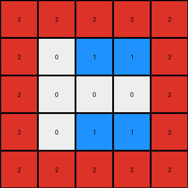

# 6b9890af • 009 • refine_dreamer

---


Previous Code:
```python
"""
1.  **Identify Objects:** In the input grid, identify distinct colored regions. In this example, we see a hollow red rectangle (object_1) and a filled blue rectangle (object_2).

2.  **Bounding Box:** Determine the smallest bounding box that can encompass both of the identified colored regions.

3.  **Create Output grid:** Create a 5x5 grid

4.  **Fill Outside with Red:** Fill the perimeter (outermost rows and columns) of this 5 x 5 with Red (2).

5. **Fill Interior with object_2, if present**
    *  check the object in the input
    *  If a filled shape of color other than red exists inside of the bounding box, add 2 units of this color inside of the Red border
    *  These are placed, horizontally centered, at row, column locations: (1,2)(1,3) and (3,2)(3,3)

6.  **Fill remaining with white** Add a White (0) in the one cell inside the Red (2) border and Blue(1) infill
"""

import numpy as np

def find_objects(grid):
    # Find distinct colored regions in the grid.
    objects = {}
    visited = np.zeros_like(grid, dtype=bool)

    def dfs(row, col, color, object_pixels):
        if (row < 0 or row >= grid.shape[0] or col < 0 or col >= grid.shape[1] or
                visited[row, col] or grid[row, col] != color):
            return
        visited[row, col] = True
        object_pixels.append((row, col))
        dfs(row + 1, col, color, object_pixels)
        dfs(row - 1, col, color, object_pixels)
        dfs(row, col + 1, color, object_pixels)
        dfs(row, col - 1, color, object_pixels)

    for row in range(grid.shape[0]):
        for col in range(grid.shape[1]):
            if not visited[row, col] and grid[row, col] != 0:
                color = grid[row, col]
                object_pixels = []
                dfs(row, col, color, object_pixels)
                if color not in objects:
                    objects[color] = []
                objects[color].append(object_pixels)
    return objects

def bounding_box(objects):
    # Determine the smallest bounding box encompassing all objects.
    min_row, min_col = float('inf'), float('inf')
    max_row, max_col = float('-inf'), float('-inf')

    for color in objects:
        for obj in objects[color]:
            for row, col in obj:
                min_row = min(min_row, row)
                min_col = min(min_col, col)
                max_row = max(max_row, row)
                max_col = max(max_col, col)
    return min_row, min_col, max_row, max_col


def transform(input_grid):
    # Identify objects
    objects = find_objects(input_grid)

    # Create a 5x5 output grid
    output_grid = np.zeros((5, 5), dtype=int)

    # Fill the perimeter with Red (2)
    output_grid[0, :] = 2
    output_grid[-1, :] = 2
    output_grid[:, 0] = 2
    output_grid[:, -1] = 2
    
    # check for blue object
    if 1 in objects:
      output_grid[1,2] = 1
      output_grid[1,3] = 1
      output_grid[3,2] = 1
      output_grid[3,3] = 1

    return output_grid
```

Train Set Results:

## Example 1:

Input:
```
0 0 0 0 0 0 0 0 0 0 0 0 0 0 0 0 0 0 0 0 0
0 0 0 0 0 0 0 0 0 0 0 0 0 0 0 0 0 0 0 0 0
0 0 0 0 0 0 8 0 0 0 0 0 0 0 0 0 0 0 0 0 0
0 0 0 0 0 8 8 8 0 0 0 0 0 0 0 0 0 0 0 0 0
0 0 0 0 0 0 8 0 0 0 0 0 0 0 0 0 0 0 0 0 0
0 0 0 0 0 0 0 0 0 0 0 0 0 0 0 0 0 0 0 0 0
0 0 0 0 0 0 0 0 0 0 0 0 0 0 0 0 0 0 0 0 0
0 0 0 0 0 0 2 2 2 2 2 2 2 2 0 0 0 0 0 0 0
0 0 0 0 0 0 2 0 0 0 0 0 0 2 0 0 0 0 0 0 0
0 0 0 0 0 0 2 0 0 0 0 0 0 2 0 0 0 0 0 0 0
0 0 0 0 0 0 2 0 0 0 0 0 0 2 0 0 0 0 0 0 0
0 0 0 0 0 0 2 0 0 0 0 0 0 2 0 0 0 0 0 0 0
0 0 0 0 0 0 2 0 0 0 0 0 0 2 0 0 0 0 0 0 0
0 0 0 0 0 0 2 0 0 0 0 0 0 2 0 0 0 0 0 0 0
0 0 0 0 0 0 2 2 2 2 2 2 2 2 0 0 0 0 0 0 0
0 0 0 0 0 0 0 0 0 0 0 0 0 0 0 0 0 0 0 0 0
0 0 0 0 0 0 0 0 0 0 0 0 0 0 0 0 0 0 0 0 0
0 0 0 0 0 0 0 0 0 0 0 0 0 0 0 0 0 0 0 0 0
```
Expected Output:
```
2 2 2 2 2 2 2 2
2 0 0 8 8 0 0 2
2 0 0 8 8 0 0 2
2 8 8 8 8 8 8 2
2 8 8 8 8 8 8 2
2 0 0 8 8 0 0 2
2 0 0 8 8 0 0 2
2 2 2 2 2 2 2 2
```
Transformed Output:
```
2 2 2 2 2
2 0 0 0 2
2 0 0 0 2
2 0 0 0 2
2 2 2 2 2
```

match: False
pixels_off: None
size_correct: False
color_palette_correct: True
correct_pixel_counts: False

## Example 2:

Input:
```
0 0 0 0 0 0 0 0 0 0 0 0 0 0 0 0 0 0 0 0 0 0
0 0 0 0 0 0 0 0 0 0 0 0 0 0 0 0 0 0 0 0 0 0
0 0 2 2 2 2 2 0 0 0 0 0 0 0 0 0 0 0 0 0 0 0
0 0 2 0 0 0 2 0 0 0 0 0 0 0 0 0 0 0 0 0 0 0
0 0 2 0 0 0 2 0 0 0 0 0 0 0 0 0 0 0 0 0 0 0
0 0 2 0 0 0 2 0 0 0 0 0 0 0 0 0 0 0 0 0 0 0
0 0 2 2 2 2 2 0 0 0 0 0 0 0 0 0 0 0 0 0 0 0
0 0 0 0 0 0 0 0 0 0 0 0 0 0 0 0 0 0 0 0 0 0
0 0 0 0 0 0 0 0 0 0 0 0 0 0 0 0 0 0 0 0 0 0
0 0 0 0 0 0 0 0 0 0 0 1 1 0 0 0 0 0 0 0 0 0
0 0 0 0 0 0 0 0 0 0 1 0 0 0 0 0 0 0 0 0 0 0
0 0 0 0 0 0 0 0 0 0 0 1 1 0 0 0 0 0 0 0 0 0
0 0 0 0 0 0 0 0 0 0 0 0 0 0 0 0 0 0 0 0 0 0
0 0 0 0 0 0 0 0 0 0 0 0 0 0 0 0 0 0 0 0 0 0
0 0 0 0 0 0 0 0 0 0 0 0 0 0 0 0 0 0 0 0 0 0
0 0 0 0 0 0 0 0 0 0 0 0 0 0 0 0 0 0 0 0 0 0
0 0 0 0 0 0 0 0 0 0 0 0 0 0 0 0 0 0 0 0 0 0
0 0 0 0 0 0 0 0 0 0 0 0 0 0 0 0 0 0 0 0 0 0
0 0 0 0 0 0 0 0 0 0 0 0 0 0 0 0 0 0 0 0 0 0
```
Expected Output:
```
2 2 2 2 2
2 0 1 1 2
2 1 0 0 2
2 0 1 1 2
2 2 2 2 2
```
Transformed Output:
```
2 2 2 2 2
2 0 1 1 2
2 0 0 0 2
2 0 1 1 2
2 2 2 2 2
```

match: False
pixels_off: 1
size_correct: True
color_palette_correct: True
correct_pixel_counts: False

## Example 3:

Input:
```
0 0 0 0 0 0 0 0 0 0 0 0 0 0 0 0 0 0 0 0 0 0 0 0
0 0 2 2 2 2 2 2 2 2 2 2 2 0 0 0 0 0 0 0 0 0 0 0
0 0 2 0 0 0 0 0 0 0 0 0 2 0 0 0 0 0 0 0 0 0 0 0
0 0 2 0 0 0 0 0 0 0 0 0 2 0 0 0 0 0 0 0 0 0 0 0
0 0 2 0 0 0 0 0 0 0 0 0 2 0 0 0 0 0 0 0 0 0 0 0
0 0 2 0 0 0 0 0 0 0 0 0 2 0 0 0 0 0 0 0 0 0 0 0
0 0 2 0 0 0 0 0 0 0 0 0 2 0 0 0 0 0 0 0 0 0 0 0
0 0 2 0 0 0 0 0 0 0 0 0 2 0 0 0 0 0 0 0 0 0 0 0
0 0 2 0 0 0 0 0 0 0 0 0 2 0 0 0 0 0 0 0 0 0 0 0
0 0 2 0 0 0 0 0 0 0 0 0 2 0 0 0 0 0 0 0 0 0 0 0
0 0 2 0 0 0 0 0 0 0 0 0 2 0 0 0 0 0 0 0 0 0 0 0
0 0 2 2 2 2 2 2 2 2 2 2 2 0 0 0 0 0 0 0 0 0 0 0
0 0 0 0 0 0 0 0 0 0 0 0 0 0 0 0 0 0 0 0 0 0 0 0
0 0 0 0 0 0 0 0 0 0 0 0 0 0 0 0 0 0 0 0 0 0 0 0
0 0 0 0 0 0 0 0 0 0 0 0 0 0 0 0 0 0 0 0 0 0 0 0
0 0 0 0 0 0 0 0 0 0 0 0 0 0 4 4 0 0 0 0 0 0 0 0
0 0 0 0 0 0 0 0 0 0 0 0 0 4 0 4 0 0 0 0 0 0 0 0
0 0 0 0 0 0 0 0 0 0 0 0 0 0 0 4 0 0 0 0 0 0 0 0
0 0 0 0 0 0 0 0 0 0 0 0 0 0 0 0 0 0 0 0 0 0 0 0
0 0 0 0 0 0 0 0 0 0 0 0 0 0 0 0 0 0 0 0 0 0 0 0
0 0 0 0 0 0 0 0 0 0 0 0 0 0 0 0 0 0 0 0 0 0 0 0
```
Expected Output:
```
2 2 2 2 2 2 2 2 2 2 2
2 0 0 0 4 4 4 4 4 4 2
2 0 0 0 4 4 4 4 4 4 2
2 0 0 0 4 4 4 4 4 4 2
2 4 4 4 0 0 0 4 4 4 2
2 4 4 4 0 0 0 4 4 4 2
2 4 4 4 0 0 0 4 4 4 2
2 0 0 0 0 0 0 4 4 4 2
2 0 0 0 0 0 0 4 4 4 2
2 0 0 0 0 0 0 4 4 4 2
2 2 2 2 2 2 2 2 2 2 2
```
Transformed Output:
```
2 2 2 2 2
2 0 0 0 2
2 0 0 0 2
2 0 0 0 2
2 2 2 2 2
```

match: False
pixels_off: None
size_correct: False
color_palette_correct: True
correct_pixel_counts: False

**INSTRUCTIONS**

The code above was generated based on observations from the first training
example

we have tested the transform function on each of the task example inputs and
compared with the expected output

review each of the examples provided and the results and consider how the
natural language program should be updated to accommodate this new knowledge

respond with the following deliverables:

- general assessment of the information provided and strategy for resolving the
  errors
- gather metrics about each of the examples and results - use code_execution to
  develop accurate reports on your assumptions
- a YAML block documenting facts - Focus on identifying objects, their properties, and the actions performed on them.
- a natural language program - Be as clear and concise as possible, providing a complete description of the transformation rule.


your responses should be considered as information in a report - not a
conversation
