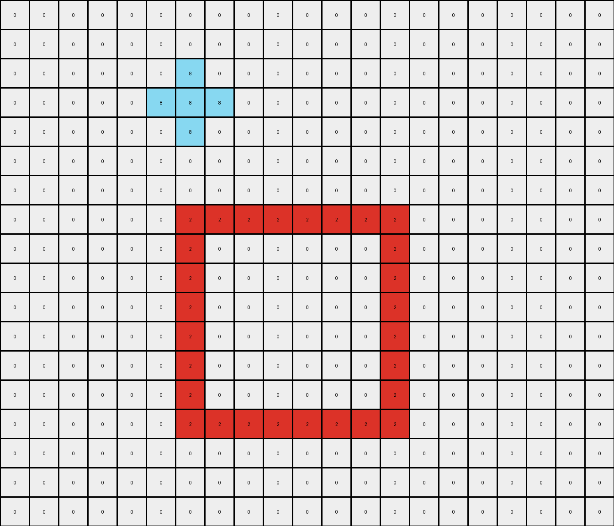

# 6b9890af • 016 • refine_coder

---

Previous Code:
```python
"""
Combines a large red rectangular outline and a smaller filled yellow rectangle into a new grid. The transformation preserves the large rectangle's outline and places the smaller yellow rectangle just inside the top border of the large shape, while significantly reducing the overall size.
"""

import numpy as np

def find_object(grid, color):
    # Find coordinates of all pixels of the specified color.
    coords = np.argwhere(grid == color)
    if coords.size == 0:
        return None
    return coords

def find_rectangle_outline(grid, color):
    #find the object
    coords = find_object(grid,color)
    if coords is None:
      return None
    # Find the bounding box of the outline.
    min_y, min_x = np.min(coords, axis=0)
    max_y, max_x = np.max(coords, axis=0)

    # Create a mask for the outline.
    mask = (grid[min_y:max_y+1, min_x:max_x+1] == color)
    outline_coords = []
    for y in range(mask.shape[0]):
        for x in range(mask.shape[1]):
            if mask[y,x]:
                #check neighbors to determine if outline
                neighbors = 0
                if y > 0 and mask[y-1,x]:
                    neighbors += 1
                if y < mask.shape[0]-1 and mask[y+1,x]:
                    neighbors +=1
                if x > 0 and mask[y, x-1]:
                    neighbors += 1
                if x < mask.shape[1] -1 and mask[y, x+1]:
                    neighbors += 1
                #if it is a solid shape, neighbor count could be 4
                if neighbors < 4:
                    outline_coords.append((min_y + y, min_x + x))

    return outline_coords
                

def find_filled_rectangle(grid, color):
    # Find coordinates of all pixels of the specified color.
    coords = find_object(grid, color)
    if coords is None:
        return None

    # Find the bounding box.
    min_y, min_x = np.min(coords, axis=0)
    max_y, max_x = np.max(coords, axis=0)
    
    return  coords #return all coords for filled shape


def transform(input_grid):
    # Find the large red outline.
    red_outline_coords = find_rectangle_outline(input_grid, 2)
    if red_outline_coords is None:
        #if red outline is not present, just return input
        return input_grid
    red_outline_coords = np.array(red_outline_coords)  # Convert to numpy array for easier manipulation

    # Find the small yellow filled rectangle.
    yellow_filled_coords = find_filled_rectangle(input_grid, 4)
    if yellow_filled_coords is None:
        #If yellow shape is missing, do not transform
        return input_grid
    yellow_filled_coords = np.array(yellow_filled_coords)


    # Determine bounding box for the new combined shape.
    min_red_y, min_red_x = np.min(red_outline_coords, axis=0)
    max_red_y, max_red_x = np.max(red_outline_coords, axis=0)
    
    #output is based on the red outline shape, adjusted by the yellow shape dimensions
    output_height = max_red_y - min_red_y + 1
    output_width =  max_red_x - min_red_x + 1

    # Initialize the output grid.
    output_grid = np.zeros((output_height, output_width), dtype=int)

    # Draw the red outline.
    for y, x in red_outline_coords:
        output_grid[y - min_red_y, x - min_red_x] = 2

    #calculate offset to draw yellow shape inside the red outline
    yellow_height = np.max(yellow_filled_coords[:,0]) - np.min(yellow_filled_coords[:,0]) + 1
    yellow_width = np.max(yellow_filled_coords[:,1]) - np.min(yellow_filled_coords[:,1]) + 1

    # Draw the yellow filled rectangle, positioning it inside top of red outline
    start_y = 1 #place inside top border
    start_x = 1

    for y, x in yellow_filled_coords:
      #map to new coord
      new_y = y - np.min(yellow_filled_coords[:,0]) + start_y
      new_x = x - np.min(yellow_filled_coords[:,1]) + start_x
      if new_y < output_height and new_x < output_width:
        output_grid[new_y,new_x] = 4

    return output_grid
```

Train Set Results:

## Example 1:

Input:
```
0 0 0 0 0 0 0 0 0 0 0 0 0 0 0 0 0 0 0 0 0
0 0 0 0 0 0 0 0 0 0 0 0 0 0 0 0 0 0 0 0 0
0 0 0 0 0 0 8 0 0 0 0 0 0 0 0 0 0 0 0 0 0
0 0 0 0 0 8 8 8 0 0 0 0 0 0 0 0 0 0 0 0 0
0 0 0 0 0 0 8 0 0 0 0 0 0 0 0 0 0 0 0 0 0
0 0 0 0 0 0 0 0 0 0 0 0 0 0 0 0 0 0 0 0 0
0 0 0 0 0 0 0 0 0 0 0 0 0 0 0 0 0 0 0 0 0
0 0 0 0 0 0 2 2 2 2 2 2 2 2 0 0 0 0 0 0 0
0 0 0 0 0 0 2 0 0 0 0 0 0 2 0 0 0 0 0 0 0
0 0 0 0 0 0 2 0 0 0 0 0 0 2 0 0 0 0 0 0 0
0 0 0 0 0 0 2 0 0 0 0 0 0 2 0 0 0 0 0 0 0
0 0 0 0 0 0 2 0 0 0 0 0 0 2 0 0 0 0 0 0 0
0 0 0 0 0 0 2 0 0 0 0 0 0 2 0 0 0 0 0 0 0
0 0 0 0 0 0 2 0 0 0 0 0 0 2 0 0 0 0 0 0 0
0 0 0 0 0 0 2 2 2 2 2 2 2 2 0 0 0 0 0 0 0
0 0 0 0 0 0 0 0 0 0 0 0 0 0 0 0 0 0 0 0 0
0 0 0 0 0 0 0 0 0 0 0 0 0 0 0 0 0 0 0 0 0
0 0 0 0 0 0 0 0 0 0 0 0 0 0 0 0 0 0 0 0 0
```
Expected Output:
```
2 2 2 2 2 2 2 2
2 0 0 8 8 0 0 2
2 0 0 8 8 0 0 2
2 8 8 8 8 8 8 2
2 8 8 8 8 8 8 2
2 0 0 8 8 0 0 2
2 0 0 8 8 0 0 2
2 2 2 2 2 2 2 2
```
Transformed Output:
```
0 0 0 0 0 0 0 0 0 0 0 0 0 0 0 0 0 0 0 0 0
0 0 0 0 0 0 0 0 0 0 0 0 0 0 0 0 0 0 0 0 0
0 0 0 0 0 0 8 0 0 0 0 0 0 0 0 0 0 0 0 0 0
0 0 0 0 0 8 8 8 0 0 0 0 0 0 0 0 0 0 0 0 0
0 0 0 0 0 0 8 0 0 0 0 0 0 0 0 0 0 0 0 0 0
0 0 0 0 0 0 0 0 0 0 0 0 0 0 0 0 0 0 0 0 0
0 0 0 0 0 0 0 0 0 0 0 0 0 0 0 0 0 0 0 0 0
0 0 0 0 0 0 2 2 2 2 2 2 2 2 0 0 0 0 0 0 0
0 0 0 0 0 0 2 0 0 0 0 0 0 2 0 0 0 0 0 0 0
0 0 0 0 0 0 2 0 0 0 0 0 0 2 0 0 0 0 0 0 0
0 0 0 0 0 0 2 0 0 0 0 0 0 2 0 0 0 0 0 0 0
0 0 0 0 0 0 2 0 0 0 0 0 0 2 0 0 0 0 0 0 0
0 0 0 0 0 0 2 0 0 0 0 0 0 2 0 0 0 0 0 0 0
0 0 0 0 0 0 2 0 0 0 0 0 0 2 0 0 0 0 0 0 0
0 0 0 0 0 0 2 2 2 2 2 2 2 2 0 0 0 0 0 0 0
0 0 0 0 0 0 0 0 0 0 0 0 0 0 0 0 0 0 0 0 0
0 0 0 0 0 0 0 0 0 0 0 0 0 0 0 0 0 0 0 0 0
0 0 0 0 0 0 0 0 0 0 0 0 0 0 0 0 0 0 0 0 0
```

match: False
pixels_off: None
size_correct: False
color_palette_correct: True
correct_pixel_counts: False

## Example 2:

Input:
```
0 0 0 0 0 0 0 0 0 0 0 0 0 0 0 0 0 0 0 0 0 0
0 0 0 0 0 0 0 0 0 0 0 0 0 0 0 0 0 0 0 0 0 0
0 0 2 2 2 2 2 0 0 0 0 0 0 0 0 0 0 0 0 0 0 0
0 0 2 0 0 0 2 0 0 0 0 0 0 0 0 0 0 0 0 0 0 0
0 0 2 0 0 0 2 0 0 0 0 0 0 0 0 0 0 0 0 0 0 0
0 0 2 0 0 0 2 0 0 0 0 0 0 0 0 0 0 0 0 0 0 0
0 0 2 2 2 2 2 0 0 0 0 0 0 0 0 0 0 0 0 0 0 0
0 0 0 0 0 0 0 0 0 0 0 0 0 0 0 0 0 0 0 0 0 0
0 0 0 0 0 0 0 0 0 0 0 0 0 0 0 0 0 0 0 0 0 0
0 0 0 0 0 0 0 0 0 0 0 1 1 0 0 0 0 0 0 0 0 0
0 0 0 0 0 0 0 0 0 0 1 0 0 0 0 0 0 0 0 0 0 0
0 0 0 0 0 0 0 0 0 0 0 1 1 0 0 0 0 0 0 0 0 0
0 0 0 0 0 0 0 0 0 0 0 0 0 0 0 0 0 0 0 0 0 0
0 0 0 0 0 0 0 0 0 0 0 0 0 0 0 0 0 0 0 0 0 0
0 0 0 0 0 0 0 0 0 0 0 0 0 0 0 0 0 0 0 0 0 0
0 0 0 0 0 0 0 0 0 0 0 0 0 0 0 0 0 0 0 0 0 0
0 0 0 0 0 0 0 0 0 0 0 0 0 0 0 0 0 0 0 0 0 0
0 0 0 0 0 0 0 0 0 0 0 0 0 0 0 0 0 0 0 0 0 0
0 0 0 0 0 0 0 0 0 0 0 0 0 0 0 0 0 0 0 0 0 0
```
Expected Output:
```
2 2 2 2 2
2 0 1 1 2
2 1 0 0 2
2 0 1 1 2
2 2 2 2 2
```
Transformed Output:
```
0 0 0 0 0 0 0 0 0 0 0 0 0 0 0 0 0 0 0 0 0 0
0 0 0 0 0 0 0 0 0 0 0 0 0 0 0 0 0 0 0 0 0 0
0 0 2 2 2 2 2 0 0 0 0 0 0 0 0 0 0 0 0 0 0 0
0 0 2 0 0 0 2 0 0 0 0 0 0 0 0 0 0 0 0 0 0 0
0 0 2 0 0 0 2 0 0 0 0 0 0 0 0 0 0 0 0 0 0 0
0 0 2 0 0 0 2 0 0 0 0 0 0 0 0 0 0 0 0 0 0 0
0 0 2 2 2 2 2 0 0 0 0 0 0 0 0 0 0 0 0 0 0 0
0 0 0 0 0 0 0 0 0 0 0 0 0 0 0 0 0 0 0 0 0 0
0 0 0 0 0 0 0 0 0 0 0 0 0 0 0 0 0 0 0 0 0 0
0 0 0 0 0 0 0 0 0 0 0 1 1 0 0 0 0 0 0 0 0 0
0 0 0 0 0 0 0 0 0 0 1 0 0 0 0 0 0 0 0 0 0 0
0 0 0 0 0 0 0 0 0 0 0 1 1 0 0 0 0 0 0 0 0 0
0 0 0 0 0 0 0 0 0 0 0 0 0 0 0 0 0 0 0 0 0 0
0 0 0 0 0 0 0 0 0 0 0 0 0 0 0 0 0 0 0 0 0 0
0 0 0 0 0 0 0 0 0 0 0 0 0 0 0 0 0 0 0 0 0 0
0 0 0 0 0 0 0 0 0 0 0 0 0 0 0 0 0 0 0 0 0 0
0 0 0 0 0 0 0 0 0 0 0 0 0 0 0 0 0 0 0 0 0 0
0 0 0 0 0 0 0 0 0 0 0 0 0 0 0 0 0 0 0 0 0 0
0 0 0 0 0 0 0 0 0 0 0 0 0 0 0 0 0 0 0 0 0 0
```

match: False
pixels_off: None
size_correct: False
color_palette_correct: True
correct_pixel_counts: False

## Example 3:

Input:
```
0 0 0 0 0 0 0 0 0 0 0 0 0 0 0 0 0 0 0 0 0 0 0 0
0 0 2 2 2 2 2 2 2 2 2 2 2 0 0 0 0 0 0 0 0 0 0 0
0 0 2 0 0 0 0 0 0 0 0 0 2 0 0 0 0 0 0 0 0 0 0 0
0 0 2 0 0 0 0 0 0 0 0 0 2 0 0 0 0 0 0 0 0 0 0 0
0 0 2 0 0 0 0 0 0 0 0 0 2 0 0 0 0 0 0 0 0 0 0 0
0 0 2 0 0 0 0 0 0 0 0 0 2 0 0 0 0 0 0 0 0 0 0 0
0 0 2 0 0 0 0 0 0 0 0 0 2 0 0 0 0 0 0 0 0 0 0 0
0 0 2 0 0 0 0 0 0 0 0 0 2 0 0 0 0 0 0 0 0 0 0 0
0 0 2 0 0 0 0 0 0 0 0 0 2 0 0 0 0 0 0 0 0 0 0 0
0 0 2 0 0 0 0 0 0 0 0 0 2 0 0 0 0 0 0 0 0 0 0 0
0 0 2 0 0 0 0 0 0 0 0 0 2 0 0 0 0 0 0 0 0 0 0 0
0 0 2 2 2 2 2 2 2 2 2 2 2 0 0 0 0 0 0 0 0 0 0 0
0 0 0 0 0 0 0 0 0 0 0 0 0 0 0 0 0 0 0 0 0 0 0 0
0 0 0 0 0 0 0 0 0 0 0 0 0 0 0 0 0 0 0 0 0 0 0 0
0 0 0 0 0 0 0 0 0 0 0 0 0 0 0 0 0 0 0 0 0 0 0 0
0 0 0 0 0 0 0 0 0 0 0 0 0 0 4 4 0 0 0 0 0 0 0 0
0 0 0 0 0 0 0 0 0 0 0 0 0 4 0 4 0 0 0 0 0 0 0 0
0 0 0 0 0 0 0 0 0 0 0 0 0 0 0 4 0 0 0 0 0 0 0 0
0 0 0 0 0 0 0 0 0 0 0 0 0 0 0 0 0 0 0 0 0 0 0 0
0 0 0 0 0 0 0 0 0 0 0 0 0 0 0 0 0 0 0 0 0 0 0 0
0 0 0 0 0 0 0 0 0 0 0 0 0 0 0 0 0 0 0 0 0 0 0 0
```
Expected Output:
```
2 2 2 2 2 2 2 2 2 2 2
2 0 0 0 4 4 4 4 4 4 2
2 0 0 0 4 4 4 4 4 4 2
2 0 0 0 4 4 4 4 4 4 2
2 4 4 4 0 0 0 4 4 4 2
2 4 4 4 0 0 0 4 4 4 2
2 4 4 4 0 0 0 4 4 4 2
2 0 0 0 0 0 0 4 4 4 2
2 0 0 0 0 0 0 4 4 4 2
2 0 0 0 0 0 0 4 4 4 2
2 2 2 2 2 2 2 2 2 2 2
```
Transformed Output:
```
2 2 2 2 2 2 2 2 2 2 2
2 0 4 4 0 0 0 0 0 0 2
2 4 0 4 0 0 0 0 0 0 2
2 0 0 4 0 0 0 0 0 0 2
2 0 0 0 0 0 0 0 0 0 2
2 0 0 0 0 0 0 0 0 0 2
2 0 0 0 0 0 0 0 0 0 2
2 0 0 0 0 0 0 0 0 0 2
2 0 0 0 0 0 0 0 0 0 2
2 0 0 0 0 0 0 0 0 0 2
2 2 2 2 2 2 2 2 2 2 2
```

match: False
pixels_off: 50
size_correct: True
color_palette_correct: True
correct_pixel_counts: False
Okay, let's analyze the results and update the natural language program.

**General Assessment:**

The initial code correctly identifies the two key objects: a red rectangle outline and a smaller, filled yellow rectangle. It attempts to combine them by placing the yellow rectangle inside the top border of the red outline. However, the positioning and sizing logic is flawed, especially concerning the yellow rectangle. It doesn't always maintain the yellow rectangle shape (example 2) and incorrectly places and stretches it in relation to the red outline. The main issue is incorrect placement and distortion of inner shape after correctly drawing the outer red outline shape.

**Strategy for Resolving Errors:**

1.  **Refine Object Identification:** The current object identification (especially for outlines) is overly complex. We should simplify it.
2.  **Improve Placement Logic:** The yellow rectangle needs to be placed *relative* to the red rectangle's top-left corner, but *inside* the outline.
3.  **Preserve Shape:** Ensure the yellow rectangle's dimensions are preserved. The current code sometimes stretches inner shape and sometimes not.
4. Simplify - avoid the complex outline detection and work from bounding box coordinates

**Metrics and Observations (YAML):**

```yaml
examples:
  - example_id: 1
    input_grid_shape: [19, 21]
    output_grid_shape: [8, 8]
    red_outline:
      present: true
      is_outline: true
      color: 2
      bounding_box: [[7, 6], [14, 13]]  # [top-left, bottom-right]
    yellow_rectangle:
      present: true
      is_outline: false
      color: 4
      bounding_box: [[2,6],[4,8]]   # Example values
    transformation:
      - action: combine
      - object1: red_outline
      - object2: yellow_rectangle
      - placement_rule: "yellow rectangle placed inside the top border of red outline"
      - size_change: output size determined by red outline, reduced
    match: false
    notes: >
      The code fails to place the yellow rectangle correctly, draws at input coordinates, and gets output size of the red rectangle correctly.
      The yellow rectangle is stretched.

  - example_id: 2
    input_grid_shape: [19, 22]
    output_grid_shape: [5, 5]
    red_outline:
      present: true
      is_outline: true
      color: 2
      bounding_box: [[2, 2], [6, 6]]
    yellow_rectangle:
      present: true
      is_outline: false
      color: 1
      bounding_box: [[9,10],[11,12]]
    transformation:
      - action: combine
      - object1: red_outline
      - object2: yellow_rectangle
      - placement_rule: "yellow rectangle placed inside the top border of red outline"
    match: false
    notes:  The code fails to produce the correct shape and size. The inner shape isn't correctly positioned.
    size_change: output size determined by red outline, reduced

  - example_id: 3
    input_grid_shape: [22, 24]
    output_grid_shape: [11, 11]
    red_outline:
      present: true
      is_outline: true
      color: 2
      bounding_box: [[1, 2], [11, 12]]
    yellow_rectangle:
      present: true
      is_outline: false
      color: 4
      bounding_box: [[15,12],[17,15]]
    transformation:
      - action: combine
      - object1: red_outline
      - object2: yellow_rectangle
      - placement_rule: "yellow rectangle placed inside and stretched across width near top border of the red outline. Height of inner object changes relative to outer."
    match: false
    notes: The result draws at red box coordinates, but the inner rectangle is not properly positioned or sized.
    size_change: output size determined by red outline, reduced

```

**Natural Language Program:**

1.  **Identify the Red Rectangle Outline:** Find the bounding box of the largest red (color 2) rectangle outline in the input grid.
2.  **Identify the Inner Filled Rectangle:** Find the bounding box of the smaller, filled rectangle of any color other than red within the input grid.
3. **Determine output grid:** Create a new grid based on the dimensions (width and height) of the red rectangle's bounding box
4.  **Draw Red Outline:** Draw the red rectangle outline onto the new grid. The outline occupies the entire border of the output grid.
5.  **Draw Inner Rectangle:** Draw the filled inner-colored rectangle inside the red outline.
    *   The top edge of the inner rectangle should be one pixel below the top edge of the red outline.
    *   The left edge of the inner rectangle should be one pixel to the right of the red outline's left edge
    *   Stretch the inner rectangle horizontally to fit the width of the red outline, minus 2 (to account for the left and right borders of the outline). The height remains the same.

Essentially, the output grid's size is determined by the red outline, the red outline is drawn first, and then the filled rectangle, resized to fit *inside* the red outline horizontally, is placed just below the top border.

**INSTRUCTIONS**

- generate a Python module to represent the natural language program 
- follow the template below
- all common math and science libraries are available
- create docstring only at top - but comment the workflow in the function
- use helper functions for common operations like finding objects, counting,
  measuring, moving, etc. 

remember - we are working iteratively - so this code will inform your future
self as we converge on the solution

*template:*

```python
"""
{{ natural language description of the transformation rule }}
"""

{{ imports }}

def transform(input_grid):
    # initialize output_grid

    # change output pixels 

    return output_grid

```
