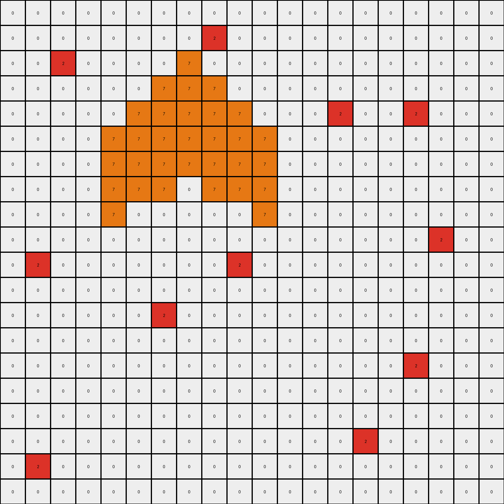

# 6d58a25d • 005 • refine_dreamer

---


Previous Code:
```python
"""
1.  **Copy all Maroon Pixels**: Identify and copy all maroon (9) pixels from the input to the output grid, maintaining their relative positions.
2.  **Process Orange Pixels**: Locate all clusters of orange (7) pixels. For each cluster, copy it to the output grid. Additionally "extrude" or copy the orange color upwards by up to three pixels.
3. **Move red and green**: Red and green pixels appear to maintain position *relative* to orange, moving upwards along with the "extruded" orange pixels.
4.  **Process Azure Pixels:** For every azure (8) pixel in the input grid:
    *   Copy the azure pixel to the output grid in the same position.
    *   Add an azure pixel directly *above* the current azure pixel (row - 1). If the current pixel is in the top row (row 0), do not add a pixel above.
5. **Overwrite**: If any azure pixels are placed in the same position as a maroon, red, green or orange pixel in the output grid, the azure pixel overwrites (replaces) the other pixel's color. Other pixels are *not* overwritten.
"""

import numpy as np

def find_objects(grid, color):
    """Finds all objects of a given color in the grid."""
    objects = []
    visited = np.zeros_like(grid, dtype=bool)
    rows, cols = grid.shape

    def dfs(r, c, current_object):
        if (r < 0 or r >= rows or c < 0 or c >= cols or
                visited[r, c] or grid[r, c] != color):
            return
        visited[r, c] = True
        current_object.append((r, c))
        dfs(r + 1, c, current_object)
        dfs(r - 1, c, current_object)
        dfs(r, c + 1, current_object)
        dfs(r, c - 1, current_object)

    for r in range(rows):
        for c in range(cols):
            if grid[r, c] == color and not visited[r, c]:
                current_object = []
                dfs(r, c, current_object)
                objects.append(current_object)
    return objects

def transform(input_grid):
    """Transforms the input grid according to the described rule."""

    output_grid = np.copy(input_grid)  # Initialize output_grid as a copy of input_grid
    rows, cols = input_grid.shape

    # 1. Copy all Maroon Pixels
    maroon_objects = find_objects(input_grid, 9)
    for obj in maroon_objects:
        for r, c in obj:
            output_grid[r, c] = 9

    # 2. Process Orange Pixels and neighbors (red and green)
    orange_objects = find_objects(input_grid, 7)
    for obj in orange_objects:
        for r, c in obj:
            output_grid[r, c] = 7  # Copy original orange
            # Extrude upwards
            for i in range(1, 4):
                if r - i >= 0:
                    output_grid[r - i, c] = 7

        # find and move red neighbors
        for r,c in obj:
             if r > 0 and input_grid[r-1,c] == 2:
                for i in range(1,4):
                    if r-i >=0:
                        output_grid[r-i-1,c] = 2
             if r+1 < rows and input_grid[r+1, c] == 2:
                for i in range(1,4):
                    if r-i >= 0:
                        output_grid[r-i+1,c] = 2

        # find and move green neighbors
        for r,c in obj:
            if r > 0 and input_grid[r-1,c] == 3:
                for i in range(1,4):
                    if r-i >=0:
                        output_grid[r-i-1,c] = 3
            if r+1 < rows and input_grid[r+1,c] == 3:
                for i in range(1,4):
                    if r-i >=0:
                        output_grid[r-i + 1,c] = 3
            if c > 0 and input_grid[r,c-1] == 3:
                for i in range(1,4):
                    if r-i >=0:
                        output_grid[r-i,c-1] = 3
            if c + 1 < cols and input_grid[r,c+1] ==3:
                for i in range(1,4):
                    if r-i >= 0:
                        output_grid[r-i,c+1] = 3


    # 3. Process Azure Pixels
    for r in range(rows):
        for c in range(cols):
            if input_grid[r, c] == 8:
                output_grid[r, c] = 8  # Copy original
                if r > 0:
                    output_grid[r - 1, c] = 8  # Add above

    # 4. Overwrite (Azure over others) - handled implicitly because azure is processed last.

    return output_grid
```

Train Set Results:

## Example 1:

Input:
```
0 0 0 0 0 0 0 0 0 0 0 0 0 0 0 0 0 0 0 0
0 0 0 0 0 0 0 0 0 0 0 0 0 0 0 0 0 0 0 0
0 0 0 0 0 8 0 0 0 0 0 0 0 0 0 0 0 0 0 0
0 0 0 0 0 0 0 0 0 0 0 0 0 0 0 0 8 0 0 0
0 0 0 8 0 0 0 0 0 0 0 0 0 0 0 0 0 0 0 0
0 0 0 0 0 0 0 0 0 9 0 0 0 0 0 0 0 0 0 0
0 0 0 0 0 0 0 0 9 9 9 0 0 0 0 0 0 0 0 0
0 0 0 0 0 0 0 9 9 0 9 9 0 0 0 0 0 0 0 0
0 0 0 0 0 0 9 0 0 0 0 0 9 0 0 0 0 0 0 0
0 0 0 0 0 0 0 0 0 0 0 0 0 0 0 0 0 0 0 0
0 8 0 0 0 0 0 0 0 0 0 0 0 0 0 0 0 0 8 0
0 0 0 0 0 0 0 0 0 0 0 0 0 0 0 0 0 0 0 0
0 0 0 0 0 0 0 0 0 0 0 0 0 0 0 0 0 0 0 0
0 0 0 0 0 0 0 0 0 8 0 0 0 0 0 0 0 0 0 0
0 0 0 0 0 0 0 0 0 0 0 0 0 0 0 0 0 0 0 0
0 0 0 0 0 0 0 0 0 0 0 0 0 0 0 0 0 0 0 0
0 0 0 0 0 0 0 0 0 0 0 0 0 0 0 0 0 0 0 0
0 0 0 0 0 0 0 0 0 0 0 0 0 0 0 0 0 0 0 0
0 0 0 0 0 0 0 0 0 0 0 0 0 0 0 8 0 0 0 0
0 8 0 0 0 0 0 0 0 0 0 0 0 0 0 0 0 0 0 0
```
Expected Output:
```
0 0 0 0 0 0 0 0 0 0 0 0 0 0 0 0 0 0 0 0
0 0 0 0 0 0 0 0 0 0 0 0 0 0 0 0 0 0 0 0
0 0 0 0 0 8 0 0 0 0 0 0 0 0 0 0 0 0 0 0
0 0 0 0 0 0 0 0 0 0 0 0 0 0 0 0 8 0 0 0
0 0 0 8 0 0 0 0 0 0 0 0 0 0 0 0 0 0 0 0
0 0 0 0 0 0 0 0 0 9 0 0 0 0 0 0 0 0 0 0
0 0 0 0 0 0 0 0 9 9 9 0 0 0 0 0 0 0 0 0
0 0 0 0 0 0 0 9 9 8 9 9 0 0 0 0 0 0 0 0
0 0 0 0 0 0 9 0 0 8 0 0 9 0 0 0 0 0 0 0
0 0 0 0 0 0 0 0 0 8 0 0 0 0 0 0 0 0 0 0
0 8 0 0 0 0 0 0 0 8 0 0 0 0 0 0 0 0 8 0
0 0 0 0 0 0 0 0 0 8 0 0 0 0 0 0 0 0 0 0
0 0 0 0 0 0 0 0 0 8 0 0 0 0 0 0 0 0 0 0
0 0 0 0 0 0 0 0 0 8 0 0 0 0 0 0 0 0 0 0
0 0 0 0 0 0 0 0 0 8 0 0 0 0 0 0 0 0 0 0
0 0 0 0 0 0 0 0 0 8 0 0 0 0 0 0 0 0 0 0
0 0 0 0 0 0 0 0 0 8 0 0 0 0 0 0 0 0 0 0
0 0 0 0 0 0 0 0 0 8 0 0 0 0 0 0 0 0 0 0
0 0 0 0 0 0 0 0 0 8 0 0 0 0 0 8 0 0 0 0
0 8 0 0 0 0 0 0 0 8 0 0 0 0 0 0 0 0 0 0
```
Transformed Output:
```
0 0 0 0 0 0 0 0 0 0 0 0 0 0 0 0 0 0 0 0
0 0 0 0 0 8 0 0 0 0 0 0 0 0 0 0 0 0 0 0
0 0 0 0 0 8 0 0 0 0 0 0 0 0 0 0 8 0 0 0
0 0 0 8 0 0 0 0 0 0 0 0 0 0 0 0 8 0 0 0
0 0 0 8 0 0 0 0 0 0 0 0 0 0 0 0 0 0 0 0
0 0 0 0 0 0 0 0 0 9 0 0 0 0 0 0 0 0 0 0
0 0 0 0 0 0 0 0 9 9 9 0 0 0 0 0 0 0 0 0
0 0 0 0 0 0 0 9 9 0 9 9 0 0 0 0 0 0 0 0
0 0 0 0 0 0 9 0 0 0 0 0 9 0 0 0 0 0 0 0
0 8 0 0 0 0 0 0 0 0 0 0 0 0 0 0 0 0 8 0
0 8 0 0 0 0 0 0 0 0 0 0 0 0 0 0 0 0 8 0
0 0 0 0 0 0 0 0 0 0 0 0 0 0 0 0 0 0 0 0
0 0 0 0 0 0 0 0 0 8 0 0 0 0 0 0 0 0 0 0
0 0 0 0 0 0 0 0 0 8 0 0 0 0 0 0 0 0 0 0
0 0 0 0 0 0 0 0 0 0 0 0 0 0 0 0 0 0 0 0
0 0 0 0 0 0 0 0 0 0 0 0 0 0 0 0 0 0 0 0
0 0 0 0 0 0 0 0 0 0 0 0 0 0 0 0 0 0 0 0
0 0 0 0 0 0 0 0 0 0 0 0 0 0 0 8 0 0 0 0
0 8 0 0 0 0 0 0 0 0 0 0 0 0 0 8 0 0 0 0
0 8 0 0 0 0 0 0 0 0 0 0 0 0 0 0 0 0 0 0
```

match: False
pixels_off: 18
size_correct: True
color_palette_correct: True
correct_pixel_counts: False

## Example 2:

Input:
```
0 0 0 0 0 0 0 0 0 0 0 0 0 0 0 0 0 0 0 0
0 0 0 0 0 0 0 0 2 0 0 0 0 0 0 0 0 0 0 0
0 0 2 0 0 0 0 0 0 0 0 0 0 0 0 0 0 0 0 0
0 0 0 0 0 0 0 0 0 0 0 0 0 0 0 0 0 0 0 0
0 0 0 0 0 0 0 0 0 0 0 0 0 2 0 0 2 0 0 0
0 0 0 0 0 0 0 7 0 0 0 0 0 0 0 0 0 0 0 0
0 0 0 0 0 0 7 7 7 0 0 0 0 0 0 0 0 0 0 0
0 0 0 0 0 7 7 0 7 7 0 0 0 0 0 0 0 0 0 0
0 0 0 0 7 0 0 0 0 0 7 0 0 0 0 0 0 0 0 0
0 0 0 0 0 0 0 0 0 0 0 0 0 0 0 0 0 2 0 0
0 2 0 0 0 0 0 0 0 2 0 0 0 0 0 0 0 0 0 0
0 0 0 0 0 0 0 0 0 0 0 0 0 0 0 0 0 0 0 0
0 0 0 0 0 0 2 0 0 0 0 0 0 0 0 0 0 0 0 0
0 0 0 0 0 0 0 0 0 0 0 0 0 0 0 0 0 0 0 0
0 0 0 0 0 0 0 0 0 0 0 0 0 0 0 0 2 0 0 0
0 0 0 0 0 0 0 0 0 0 0 0 0 0 0 0 0 0 0 0
0 0 0 0 0 0 0 0 0 0 0 0 0 0 0 0 0 0 0 0
0 0 0 0 0 0 0 0 0 0 0 0 0 0 2 0 0 0 0 0
0 2 0 0 0 0 0 0 0 0 0 0 0 0 0 0 0 0 0 0
0 0 0 0 0 0 0 0 0 0 0 0 0 0 0 0 0 0 0 0
```
Expected Output:
```
0 0 0 0 0 0 0 0 0 0 0 0 0 0 0 0 0 0 0 0
0 0 0 0 0 0 0 0 2 0 0 0 0 0 0 0 0 0 0 0
0 0 2 0 0 0 0 0 0 0 0 0 0 0 0 0 0 0 0 0
0 0 0 0 0 0 0 0 0 0 0 0 0 0 0 0 0 0 0 0
0 0 0 0 0 0 0 0 0 0 0 0 0 2 0 0 2 0 0 0
0 0 0 0 0 0 0 7 0 0 0 0 0 0 0 0 0 0 0 0
0 0 0 0 0 0 7 7 7 0 0 0 0 0 0 0 0 0 0 0
0 0 0 0 0 7 7 0 7 7 0 0 0 0 0 0 0 0 0 0
0 0 0 0 7 0 2 0 0 2 7 0 0 0 0 0 0 0 0 0
0 0 0 0 0 0 2 0 0 2 0 0 0 0 0 0 0 2 0 0
0 2 0 0 0 0 2 0 0 2 0 0 0 0 0 0 0 0 0 0
0 0 0 0 0 0 2 0 0 2 0 0 0 0 0 0 0 0 0 0
0 0 0 0 0 0 2 0 0 2 0 0 0 0 0 0 0 0 0 0
0 0 0 0 0 0 2 0 0 2 0 0 0 0 0 0 0 0 0 0
0 0 0 0 0 0 2 0 0 2 0 0 0 0 0 0 2 0 0 0
0 0 0 0 0 0 2 0 0 2 0 0 0 0 0 0 0 0 0 0
0 0 0 0 0 0 2 0 0 2 0 0 0 0 0 0 0 0 0 0
0 0 0 0 0 0 2 0 0 2 0 0 0 0 2 0 0 0 0 0
0 2 0 0 0 0 2 0 0 2 0 0 0 0 0 0 0 0 0 0
0 0 0 0 0 0 2 0 0 2 0 0 0 0 0 0 0 0 0 0
```
Transformed Output:
```
0 0 0 0 0 0 0 0 0 0 0 0 0 0 0 0 0 0 0 0
0 0 0 0 0 0 0 0 2 0 0 0 0 0 0 0 0 0 0 0
0 0 2 0 0 0 0 7 0 0 0 0 0 0 0 0 0 0 0 0
0 0 0 0 0 0 7 7 7 0 0 0 0 0 0 0 0 0 0 0
0 0 0 0 0 7 7 7 7 7 0 0 0 2 0 0 2 0 0 0
0 0 0 0 7 7 7 7 7 7 7 0 0 0 0 0 0 0 0 0
0 0 0 0 7 7 7 7 7 7 7 0 0 0 0 0 0 0 0 0
0 0 0 0 7 7 7 0 7 7 7 0 0 0 0 0 0 0 0 0
0 0 0 0 7 0 0 0 0 0 7 0 0 0 0 0 0 0 0 0
0 0 0 0 0 0 0 0 0 0 0 0 0 0 0 0 0 2 0 0
0 2 0 0 0 0 0 0 0 2 0 0 0 0 0 0 0 0 0 0
0 0 0 0 0 0 0 0 0 0 0 0 0 0 0 0 0 0 0 0
0 0 0 0 0 0 2 0 0 0 0 0 0 0 0 0 0 0 0 0
0 0 0 0 0 0 0 0 0 0 0 0 0 0 0 0 0 0 0 0
0 0 0 0 0 0 0 0 0 0 0 0 0 0 0 0 2 0 0 0
0 0 0 0 0 0 0 0 0 0 0 0 0 0 0 0 0 0 0 0
0 0 0 0 0 0 0 0 0 0 0 0 0 0 0 0 0 0 0 0
0 0 0 0 0 0 0 0 0 0 0 0 0 0 2 0 0 0 0 0
0 2 0 0 0 0 0 0 0 0 0 0 0 0 0 0 0 0 0 0
0 0 0 0 0 0 0 0 0 0 0 0 0 0 0 0 0 0 0 0
```

match: False
pixels_off: 43
size_correct: True
color_palette_correct: True
correct_pixel_counts: False

## Example 3:

Input:
```
0 0 0 0 0 0 0 0 0 0 0 0 0 0 0 0 0 0 0 0
0 0 0 0 0 0 0 0 0 0 0 0 0 0 3 0 0 0 0 0
0 0 0 0 0 3 0 0 0 0 3 0 0 0 0 0 0 0 0 0
0 0 0 0 0 0 0 0 0 0 0 0 0 0 0 0 0 0 0 0
0 3 0 0 0 0 0 0 0 0 0 0 4 0 0 0 0 0 0 0
0 0 0 0 0 0 0 3 0 0 0 4 4 4 0 0 0 0 3 0
0 0 0 0 0 0 0 0 0 0 4 4 0 4 4 0 0 0 0 0
0 0 0 0 3 0 0 0 0 4 0 0 0 0 0 4 0 0 0 0
0 0 0 0 0 0 0 0 0 0 0 0 0 0 0 0 0 0 0 0
0 0 0 0 0 0 0 0 0 0 3 0 0 0 0 0 0 0 0 0
0 0 3 0 0 0 0 0 0 0 0 0 0 0 0 0 0 0 0 0
0 0 0 0 0 0 0 0 0 0 0 0 0 0 0 0 0 0 0 0
3 0 0 0 0 0 0 3 0 0 0 0 0 3 0 0 0 0 3 0
0 0 0 0 0 0 0 0 0 0 0 0 0 0 0 0 0 0 0 0
0 0 0 0 0 0 0 0 0 0 0 0 0 0 0 0 0 0 0 0
0 0 0 0 3 0 0 0 0 0 0 0 0 0 0 0 0 0 0 0
0 0 0 0 0 0 0 0 0 0 0 0 3 0 0 0 0 0 0 0
0 3 0 0 0 0 0 0 0 0 0 0 0 0 0 0 3 0 0 0
0 0 0 0 0 0 0 3 0 0 0 0 0 3 0 0 0 0 0 3
0 0 0 0 0 0 0 0 0 0 0 0 0 0 0 0 0 0 0 0
```
Expected Output:
```
0 0 0 0 0 0 0 0 0 0 0 0 0 0 0 0 0 0 0 0
0 0 0 0 0 0 0 0 0 0 0 0 0 0 3 0 0 0 0 0
0 0 0 0 0 3 0 0 0 0 3 0 0 0 0 0 0 0 0 0
0 0 0 0 0 0 0 0 0 0 0 0 0 0 0 0 0 0 0 0
0 3 0 0 0 0 0 0 0 0 0 0 4 0 0 0 0 0 0 0
0 0 0 0 0 0 0 3 0 0 0 4 4 4 0 0 0 0 3 0
0 0 0 0 0 0 0 0 0 0 4 4 3 4 4 0 0 0 0 0
0 0 0 0 3 0 0 0 0 4 3 0 3 3 0 4 0 0 0 0
0 0 0 0 0 0 0 0 0 0 3 0 3 3 0 0 0 0 0 0
0 0 0 0 0 0 0 0 0 0 3 0 3 3 0 0 0 0 0 0
0 0 3 0 0 0 0 0 0 0 3 0 3 3 0 0 0 0 0 0
0 0 0 0 0 0 0 0 0 0 3 0 3 3 0 0 0 0 0 0
3 0 0 0 0 0 0 3 0 0 3 0 3 3 0 0 0 0 3 0
0 0 0 0 0 0 0 0 0 0 3 0 3 3 0 0 0 0 0 0
0 0 0 0 0 0 0 0 0 0 3 0 3 3 0 0 0 0 0 0
0 0 0 0 3 0 0 0 0 0 3 0 3 3 0 0 0 0 0 0
0 0 0 0 0 0 0 0 0 0 3 0 3 3 0 0 0 0 0 0
0 3 0 0 0 0 0 0 0 0 3 0 3 3 0 0 3 0 0 0
0 0 0 0 0 0 0 3 0 0 3 0 3 3 0 0 0 0 0 3
0 0 0 0 0 0 0 0 0 0 3 0 3 3 0 0 0 0 0 0
```
Transformed Output:
```
0 0 0 0 0 0 0 0 0 0 0 0 0 0 0 0 0 0 0 0
0 0 0 0 0 0 0 0 0 0 0 0 0 0 3 0 0 0 0 0
0 0 0 0 0 3 0 0 0 0 3 0 0 0 0 0 0 0 0 0
0 0 0 0 0 0 0 0 0 0 0 0 0 0 0 0 0 0 0 0
0 3 0 0 0 0 0 0 0 0 0 0 4 0 0 0 0 0 0 0
0 0 0 0 0 0 0 3 0 0 0 4 4 4 0 0 0 0 3 0
0 0 0 0 0 0 0 0 0 0 4 4 0 4 4 0 0 0 0 0
0 0 0 0 3 0 0 0 0 4 0 0 0 0 0 4 0 0 0 0
0 0 0 0 0 0 0 0 0 0 0 0 0 0 0 0 0 0 0 0
0 0 0 0 0 0 0 0 0 0 3 0 0 0 0 0 0 0 0 0
0 0 3 0 0 0 0 0 0 0 0 0 0 0 0 0 0 0 0 0
0 0 0 0 0 0 0 0 0 0 0 0 0 0 0 0 0 0 0 0
3 0 0 0 0 0 0 3 0 0 0 0 0 3 0 0 0 0 3 0
0 0 0 0 0 0 0 0 0 0 0 0 0 0 0 0 0 0 0 0
0 0 0 0 0 0 0 0 0 0 0 0 0 0 0 0 0 0 0 0
0 0 0 0 3 0 0 0 0 0 0 0 0 0 0 0 0 0 0 0
0 0 0 0 0 0 0 0 0 0 0 0 3 0 0 0 0 0 0 0
0 3 0 0 0 0 0 0 0 0 0 0 0 0 0 0 3 0 0 0
0 0 0 0 0 0 0 3 0 0 0 0 0 3 0 0 0 0 0 3
0 0 0 0 0 0 0 0 0 0 0 0 0 0 0 0 0 0 0 0
```

match: False
pixels_off: 36
size_correct: True
color_palette_correct: True
correct_pixel_counts: False

**INSTRUCTIONS**

The code above was generated based on observations from the first training
example

we have tested the transform function on each of the task example inputs and
compared with the expected output

review each of the examples provided and the results and consider how the
natural language program should be updated to accommodate this new knowledge

respond with the following deliverables:

- general assessment of the information provided and strategy for resolving the
  errors
- gather metrics about each of the examples and results - use code_execution to
  develop accurate reports on your assumptions
- a YAML block documenting facts - Focus on identifying objects, their properties, and the actions performed on them.
- a natural language program - Be as clear and concise as possible, providing a complete description of the transformation rule.


your responses should be considered as information in a report - not a
conversation
