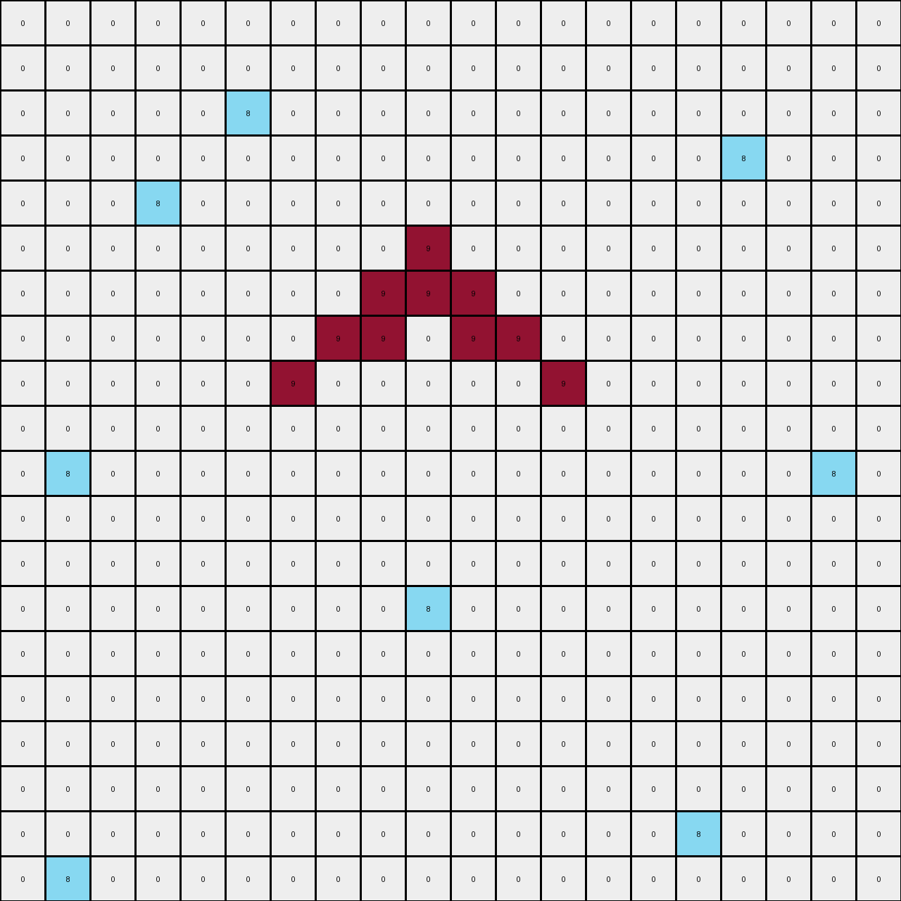
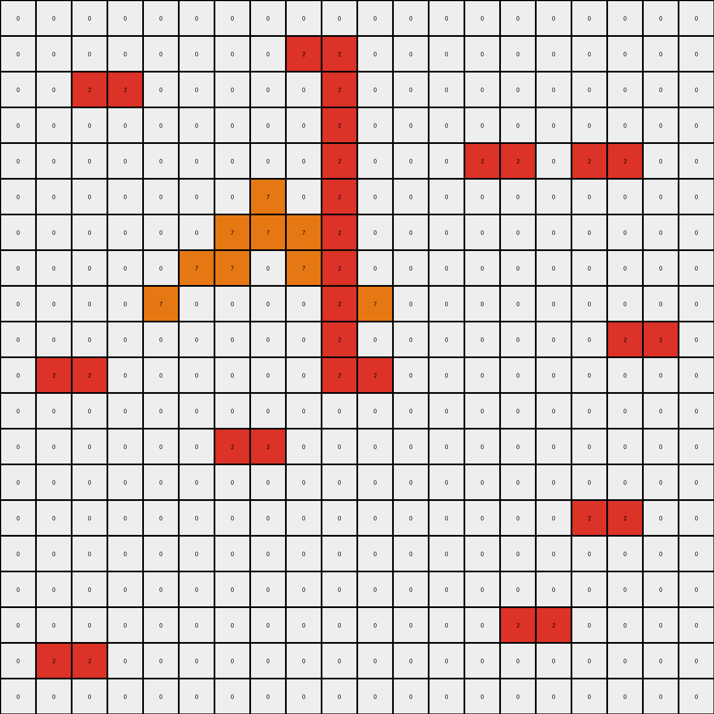

# 6d58a25d • 009 • refine_dreamer

---

Previous Code:
```python
"""
1.  **Identify Objects:** Locate all red (2) and orange (7) pixels within the input grid. Consider the orange pixels as a single object.
2.  **Horizontal Replication**: For every isolated red pixel not touching or adjacent to an orange pixel, create a duplicate red pixel immediately to its right.
3.  **Vertical Expansion Based on Orange:** For every column that contains any part of the orange object, perform the following:
    *   Find all of the existing red pixels from horizontal replication.
    *   Fill every empty cell in that column between the minimum y coordinate to the maximum y coordinate containing existing red pixels from previous step.
"""

import numpy as np

def get_objects(grid, color):
    """Finds coordinates of all pixels of a given color."""
    return np.argwhere(grid == color)

def is_adjacent_to_orange(coord, orange_coords):
    """Checks if a coordinate is adjacent to any orange pixel (including diagonally)."""
    for orange_coord in orange_coords:
        if abs(coord[0] - orange_coord[0]) <= 1 and abs(coord[1] - orange_coord[1]) <= 1:
            return True
    return False

def transform(input_grid):
    """Transforms the input grid according to the described rules."""
    output_grid = np.copy(input_grid)
    rows, cols = input_grid.shape

    # Identify Objects
    red_coords = get_objects(input_grid, 2)
    orange_coords = get_objects(input_grid, 7)

    # Horizontal Replication (for isolated red pixels)
    new_red_coords = []
    for r, c in red_coords:
        if not is_adjacent_to_orange((r,c), orange_coords):
           new_red_coords.append((r, c+1)) #add pixel
           output_grid[r,c+1] = 2 #horizontal replication
        new_red_coords.append((r,c))


    # Vertical Expansion Based on Orange
    orange_cols = set([c for _, c in orange_coords])
    
    for col in orange_cols:
        # Find all red pixels (original and replicated) in the current column
        
        red_in_col_coords = []
        for r, c in new_red_coords:
          if c == col:
            red_in_col_coords.append((r,col))


        if len(red_in_col_coords) > 0: #only if existing red
            min_row = min([r for r, _ in red_in_col_coords])
            max_row = max([r for r, _ in red_in_col_coords])

            # Fill between min and max row
            for row in range(min_row, max_row + 1):
                output_grid[row, col] = 2

    return output_grid
```

Train Set Results:

## Example 1:

Input:
```
0 0 0 0 0 0 0 0 0 0 0 0 0 0 0 0 0 0 0 0
0 0 0 0 0 0 0 0 0 0 0 0 0 0 0 0 0 0 0 0
0 0 0 0 0 8 0 0 0 0 0 0 0 0 0 0 0 0 0 0
0 0 0 0 0 0 0 0 0 0 0 0 0 0 0 0 8 0 0 0
0 0 0 8 0 0 0 0 0 0 0 0 0 0 0 0 0 0 0 0
0 0 0 0 0 0 0 0 0 9 0 0 0 0 0 0 0 0 0 0
0 0 0 0 0 0 0 0 9 9 9 0 0 0 0 0 0 0 0 0
0 0 0 0 0 0 0 9 9 0 9 9 0 0 0 0 0 0 0 0
0 0 0 0 0 0 9 0 0 0 0 0 9 0 0 0 0 0 0 0
0 0 0 0 0 0 0 0 0 0 0 0 0 0 0 0 0 0 0 0
0 8 0 0 0 0 0 0 0 0 0 0 0 0 0 0 0 0 8 0
0 0 0 0 0 0 0 0 0 0 0 0 0 0 0 0 0 0 0 0
0 0 0 0 0 0 0 0 0 0 0 0 0 0 0 0 0 0 0 0
0 0 0 0 0 0 0 0 0 8 0 0 0 0 0 0 0 0 0 0
0 0 0 0 0 0 0 0 0 0 0 0 0 0 0 0 0 0 0 0
0 0 0 0 0 0 0 0 0 0 0 0 0 0 0 0 0 0 0 0
0 0 0 0 0 0 0 0 0 0 0 0 0 0 0 0 0 0 0 0
0 0 0 0 0 0 0 0 0 0 0 0 0 0 0 0 0 0 0 0
0 0 0 0 0 0 0 0 0 0 0 0 0 0 0 8 0 0 0 0
0 8 0 0 0 0 0 0 0 0 0 0 0 0 0 0 0 0 0 0
```
Expected Output:
```
0 0 0 0 0 0 0 0 0 0 0 0 0 0 0 0 0 0 0 0
0 0 0 0 0 0 0 0 0 0 0 0 0 0 0 0 0 0 0 0
0 0 0 0 0 8 0 0 0 0 0 0 0 0 0 0 0 0 0 0
0 0 0 0 0 0 0 0 0 0 0 0 0 0 0 0 8 0 0 0
0 0 0 8 0 0 0 0 0 0 0 0 0 0 0 0 0 0 0 0
0 0 0 0 0 0 0 0 0 9 0 0 0 0 0 0 0 0 0 0
0 0 0 0 0 0 0 0 9 9 9 0 0 0 0 0 0 0 0 0
0 0 0 0 0 0 0 9 9 8 9 9 0 0 0 0 0 0 0 0
0 0 0 0 0 0 9 0 0 8 0 0 9 0 0 0 0 0 0 0
0 0 0 0 0 0 0 0 0 8 0 0 0 0 0 0 0 0 0 0
0 8 0 0 0 0 0 0 0 8 0 0 0 0 0 0 0 0 8 0
0 0 0 0 0 0 0 0 0 8 0 0 0 0 0 0 0 0 0 0
0 0 0 0 0 0 0 0 0 8 0 0 0 0 0 0 0 0 0 0
0 0 0 0 0 0 0 0 0 8 0 0 0 0 0 0 0 0 0 0
0 0 0 0 0 0 0 0 0 8 0 0 0 0 0 0 0 0 0 0
0 0 0 0 0 0 0 0 0 8 0 0 0 0 0 0 0 0 0 0
0 0 0 0 0 0 0 0 0 8 0 0 0 0 0 0 0 0 0 0
0 0 0 0 0 0 0 0 0 8 0 0 0 0 0 0 0 0 0 0
0 0 0 0 0 0 0 0 0 8 0 0 0 0 0 8 0 0 0 0
0 8 0 0 0 0 0 0 0 8 0 0 0 0 0 0 0 0 0 0
```
Transformed Output:
```
0 0 0 0 0 0 0 0 0 0 0 0 0 0 0 0 0 0 0 0
0 0 0 0 0 0 0 0 0 0 0 0 0 0 0 0 0 0 0 0
0 0 0 0 0 8 0 0 0 0 0 0 0 0 0 0 0 0 0 0
0 0 0 0 0 0 0 0 0 0 0 0 0 0 0 0 8 0 0 0
0 0 0 8 0 0 0 0 0 0 0 0 0 0 0 0 0 0 0 0
0 0 0 0 0 0 0 0 0 9 0 0 0 0 0 0 0 0 0 0
0 0 0 0 0 0 0 0 9 9 9 0 0 0 0 0 0 0 0 0
0 0 0 0 0 0 0 9 9 0 9 9 0 0 0 0 0 0 0 0
0 0 0 0 0 0 9 0 0 0 0 0 9 0 0 0 0 0 0 0
0 0 0 0 0 0 0 0 0 0 0 0 0 0 0 0 0 0 0 0
0 8 0 0 0 0 0 0 0 0 0 0 0 0 0 0 0 0 8 0
0 0 0 0 0 0 0 0 0 0 0 0 0 0 0 0 0 0 0 0
0 0 0 0 0 0 0 0 0 0 0 0 0 0 0 0 0 0 0 0
0 0 0 0 0 0 0 0 0 8 0 0 0 0 0 0 0 0 0 0
0 0 0 0 0 0 0 0 0 0 0 0 0 0 0 0 0 0 0 0
0 0 0 0 0 0 0 0 0 0 0 0 0 0 0 0 0 0 0 0
0 0 0 0 0 0 0 0 0 0 0 0 0 0 0 0 0 0 0 0
0 0 0 0 0 0 0 0 0 0 0 0 0 0 0 0 0 0 0 0
0 0 0 0 0 0 0 0 0 0 0 0 0 0 0 8 0 0 0 0
0 8 0 0 0 0 0 0 0 0 0 0 0 0 0 0 0 0 0 0
```

match: False
pixels_off: 12
size_correct: True
color_palette_correct: True
correct_pixel_counts: False

## Example 2:

Input:
```
0 0 0 0 0 0 0 0 0 0 0 0 0 0 0 0 0 0 0 0
0 0 0 0 0 0 0 0 2 0 0 0 0 0 0 0 0 0 0 0
0 0 2 0 0 0 0 0 0 0 0 0 0 0 0 0 0 0 0 0
0 0 0 0 0 0 0 0 0 0 0 0 0 0 0 0 0 0 0 0
0 0 0 0 0 0 0 0 0 0 0 0 0 2 0 0 2 0 0 0
0 0 0 0 0 0 0 7 0 0 0 0 0 0 0 0 0 0 0 0
0 0 0 0 0 0 7 7 7 0 0 0 0 0 0 0 0 0 0 0
0 0 0 0 0 7 7 0 7 7 0 0 0 0 0 0 0 0 0 0
0 0 0 0 7 0 0 0 0 0 7 0 0 0 0 0 0 0 0 0
0 0 0 0 0 0 0 0 0 0 0 0 0 0 0 0 0 2 0 0
0 2 0 0 0 0 0 0 0 2 0 0 0 0 0 0 0 0 0 0
0 0 0 0 0 0 0 0 0 0 0 0 0 0 0 0 0 0 0 0
0 0 0 0 0 0 2 0 0 0 0 0 0 0 0 0 0 0 0 0
0 0 0 0 0 0 0 0 0 0 0 0 0 0 0 0 0 0 0 0
0 0 0 0 0 0 0 0 0 0 0 0 0 0 0 0 2 0 0 0
0 0 0 0 0 0 0 0 0 0 0 0 0 0 0 0 0 0 0 0
0 0 0 0 0 0 0 0 0 0 0 0 0 0 0 0 0 0 0 0
0 0 0 0 0 0 0 0 0 0 0 0 0 0 2 0 0 0 0 0
0 2 0 0 0 0 0 0 0 0 0 0 0 0 0 0 0 0 0 0
0 0 0 0 0 0 0 0 0 0 0 0 0 0 0 0 0 0 0 0
```
Expected Output:
```
0 0 0 0 0 0 0 0 0 0 0 0 0 0 0 0 0 0 0 0
0 0 0 0 0 0 0 0 2 0 0 0 0 0 0 0 0 0 0 0
0 0 2 0 0 0 0 0 0 0 0 0 0 0 0 0 0 0 0 0
0 0 0 0 0 0 0 0 0 0 0 0 0 0 0 0 0 0 0 0
0 0 0 0 0 0 0 0 0 0 0 0 0 2 0 0 2 0 0 0
0 0 0 0 0 0 0 7 0 0 0 0 0 0 0 0 0 0 0 0
0 0 0 0 0 0 7 7 7 0 0 0 0 0 0 0 0 0 0 0
0 0 0 0 0 7 7 0 7 7 0 0 0 0 0 0 0 0 0 0
0 0 0 0 7 0 2 0 0 2 7 0 0 0 0 0 0 0 0 0
0 0 0 0 0 0 2 0 0 2 0 0 0 0 0 0 0 2 0 0
0 2 0 0 0 0 2 0 0 2 0 0 0 0 0 0 0 0 0 0
0 0 0 0 0 0 2 0 0 2 0 0 0 0 0 0 0 0 0 0
0 0 0 0 0 0 2 0 0 2 0 0 0 0 0 0 0 0 0 0
0 0 0 0 0 0 2 0 0 2 0 0 0 0 0 0 0 0 0 0
0 0 0 0 0 0 2 0 0 2 0 0 0 0 0 0 2 0 0 0
0 0 0 0 0 0 2 0 0 2 0 0 0 0 0 0 0 0 0 0
0 0 0 0 0 0 2 0 0 2 0 0 0 0 0 0 0 0 0 0
0 0 0 0 0 0 2 0 0 2 0 0 0 0 2 0 0 0 0 0
0 2 0 0 0 0 2 0 0 2 0 0 0 0 0 0 0 0 0 0
0 0 0 0 0 0 2 0 0 2 0 0 0 0 0 0 0 0 0 0
```
Transformed Output:
```
0 0 0 0 0 0 0 0 0 0 0 0 0 0 0 0 0 0 0 0
0 0 0 0 0 0 0 0 2 2 0 0 0 0 0 0 0 0 0 0
0 0 2 2 0 0 0 0 0 2 0 0 0 0 0 0 0 0 0 0
0 0 0 0 0 0 0 0 0 2 0 0 0 0 0 0 0 0 0 0
0 0 0 0 0 0 0 0 0 2 0 0 0 2 2 0 2 2 0 0
0 0 0 0 0 0 0 7 0 2 0 0 0 0 0 0 0 0 0 0
0 0 0 0 0 0 7 7 7 2 0 0 0 0 0 0 0 0 0 0
0 0 0 0 0 7 7 0 7 2 0 0 0 0 0 0 0 0 0 0
0 0 0 0 7 0 0 0 0 2 7 0 0 0 0 0 0 0 0 0
0 0 0 0 0 0 0 0 0 2 0 0 0 0 0 0 0 2 2 0
0 2 2 0 0 0 0 0 0 2 2 0 0 0 0 0 0 0 0 0
0 0 0 0 0 0 0 0 0 0 0 0 0 0 0 0 0 0 0 0
0 0 0 0 0 0 2 2 0 0 0 0 0 0 0 0 0 0 0 0
0 0 0 0 0 0 0 0 0 0 0 0 0 0 0 0 0 0 0 0
0 0 0 0 0 0 0 0 0 0 0 0 0 0 0 0 2 2 0 0
0 0 0 0 0 0 0 0 0 0 0 0 0 0 0 0 0 0 0 0
0 0 0 0 0 0 0 0 0 0 0 0 0 0 0 0 0 0 0 0
0 0 0 0 0 0 0 0 0 0 0 0 0 0 2 2 0 0 0 0
0 2 2 0 0 0 0 0 0 0 0 0 0 0 0 0 0 0 0 0
0 0 0 0 0 0 0 0 0 0 0 0 0 0 0 0 0 0 0 0
```

match: False
pixels_off: 37
size_correct: True
color_palette_correct: True
correct_pixel_counts: False

## Example 3:

Input:
```
0 0 0 0 0 0 0 0 0 0 0 0 0 0 0 0 0 0 0 0
0 0 0 0 0 0 0 0 0 0 0 0 0 0 3 0 0 0 0 0
0 0 0 0 0 3 0 0 0 0 3 0 0 0 0 0 0 0 0 0
0 0 0 0 0 0 0 0 0 0 0 0 0 0 0 0 0 0 0 0
0 3 0 0 0 0 0 0 0 0 0 0 4 0 0 0 0 0 0 0
0 0 0 0 0 0 0 3 0 0 0 4 4 4 0 0 0 0 3 0
0 0 0 0 0 0 0 0 0 0 4 4 0 4 4 0 0 0 0 0
0 0 0 0 3 0 0 0 0 4 0 0 0 0 0 4 0 0 0 0
0 0 0 0 0 0 0 0 0 0 0 0 0 0 0 0 0 0 0 0
0 0 0 0 0 0 0 0 0 0 3 0 0 0 0 0 0 0 0 0
0 0 3 0 0 0 0 0 0 0 0 0 0 0 0 0 0 0 0 0
0 0 0 0 0 0 0 0 0 0 0 0 0 0 0 0 0 0 0 0
3 0 0 0 0 0 0 3 0 0 0 0 0 3 0 0 0 0 3 0
0 0 0 0 0 0 0 0 0 0 0 0 0 0 0 0 0 0 0 0
0 0 0 0 0 0 0 0 0 0 0 0 0 0 0 0 0 0 0 0
0 0 0 0 3 0 0 0 0 0 0 0 0 0 0 0 0 0 0 0
0 0 0 0 0 0 0 0 0 0 0 0 3 0 0 0 0 0 0 0
0 3 0 0 0 0 0 0 0 0 0 0 0 0 0 0 3 0 0 0
0 0 0 0 0 0 0 3 0 0 0 0 0 3 0 0 0 0 0 3
0 0 0 0 0 0 0 0 0 0 0 0 0 0 0 0 0 0 0 0
```
Expected Output:
```
0 0 0 0 0 0 0 0 0 0 0 0 0 0 0 0 0 0 0 0
0 0 0 0 0 0 0 0 0 0 0 0 0 0 3 0 0 0 0 0
0 0 0 0 0 3 0 0 0 0 3 0 0 0 0 0 0 0 0 0
0 0 0 0 0 0 0 0 0 0 0 0 0 0 0 0 0 0 0 0
0 3 0 0 0 0 0 0 0 0 0 0 4 0 0 0 0 0 0 0
0 0 0 0 0 0 0 3 0 0 0 4 4 4 0 0 0 0 3 0
0 0 0 0 0 0 0 0 0 0 4 4 3 4 4 0 0 0 0 0
0 0 0 0 3 0 0 0 0 4 3 0 3 3 0 4 0 0 0 0
0 0 0 0 0 0 0 0 0 0 3 0 3 3 0 0 0 0 0 0
0 0 0 0 0 0 0 0 0 0 3 0 3 3 0 0 0 0 0 0
0 0 3 0 0 0 0 0 0 0 3 0 3 3 0 0 0 0 0 0
0 0 0 0 0 0 0 0 0 0 3 0 3 3 0 0 0 0 0 0
3 0 0 0 0 0 0 3 0 0 3 0 3 3 0 0 0 0 3 0
0 0 0 0 0 0 0 0 0 0 3 0 3 3 0 0 0 0 0 0
0 0 0 0 0 0 0 0 0 0 3 0 3 3 0 0 0 0 0 0
0 0 0 0 3 0 0 0 0 0 3 0 3 3 0 0 0 0 0 0
0 0 0 0 0 0 0 0 0 0 3 0 3 3 0 0 0 0 0 0
0 3 0 0 0 0 0 0 0 0 3 0 3 3 0 0 3 0 0 0
0 0 0 0 0 0 0 3 0 0 3 0 3 3 0 0 0 0 0 3
0 0 0 0 0 0 0 0 0 0 3 0 3 3 0 0 0 0 0 0
```
Transformed Output:
```
0 0 0 0 0 0 0 0 0 0 0 0 0 0 0 0 0 0 0 0
0 0 0 0 0 0 0 0 0 0 0 0 0 0 3 0 0 0 0 0
0 0 0 0 0 3 0 0 0 0 3 0 0 0 0 0 0 0 0 0
0 0 0 0 0 0 0 0 0 0 0 0 0 0 0 0 0 0 0 0
0 3 0 0 0 0 0 0 0 0 0 0 4 0 0 0 0 0 0 0
0 0 0 0 0 0 0 3 0 0 0 4 4 4 0 0 0 0 3 0
0 0 0 0 0 0 0 0 0 0 4 4 0 4 4 0 0 0 0 0
0 0 0 0 3 0 0 0 0 4 0 0 0 0 0 4 0 0 0 0
0 0 0 0 0 0 0 0 0 0 0 0 0 0 0 0 0 0 0 0
0 0 0 0 0 0 0 0 0 0 3 0 0 0 0 0 0 0 0 0
0 0 3 0 0 0 0 0 0 0 0 0 0 0 0 0 0 0 0 0
0 0 0 0 0 0 0 0 0 0 0 0 0 0 0 0 0 0 0 0
3 0 0 0 0 0 0 3 0 0 0 0 0 3 0 0 0 0 3 0
0 0 0 0 0 0 0 0 0 0 0 0 0 0 0 0 0 0 0 0
0 0 0 0 0 0 0 0 0 0 0 0 0 0 0 0 0 0 0 0
0 0 0 0 3 0 0 0 0 0 0 0 0 0 0 0 0 0 0 0
0 0 0 0 0 0 0 0 0 0 0 0 3 0 0 0 0 0 0 0
0 3 0 0 0 0 0 0 0 0 0 0 0 0 0 0 3 0 0 0
0 0 0 0 0 0 0 3 0 0 0 0 0 3 0 0 0 0 0 3
0 0 0 0 0 0 0 0 0 0 0 0 0 0 0 0 0 0 0 0
```

match: False
pixels_off: 36
size_correct: True
color_palette_correct: True
correct_pixel_counts: False
**INSTRUCTIONS**

The code above was generated based on observations from the first training
example

we have tested the transform function on each of the task example inputs and
compared with the expected output

review each of the examples provided and the results and consider how the
natural language program should be updated to accommodate this new knowledge

respond with the following deliverables:

- general assessment of the information provided and strategy for resolving the
  errors
- gather metrics about each of the examples and results - use code_execution to
  develop accurate reports on your assumptions
- a YAML block documenting facts - Focus on identifying objects, their properties, and the actions performed on them.
- a natural language program - Be as clear and concise as possible, providing a complete description of the transformation rule.


your responses should be considered as information in a report - not a
conversation
