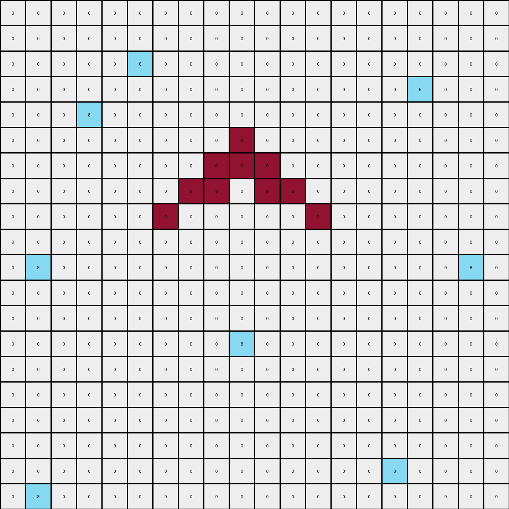
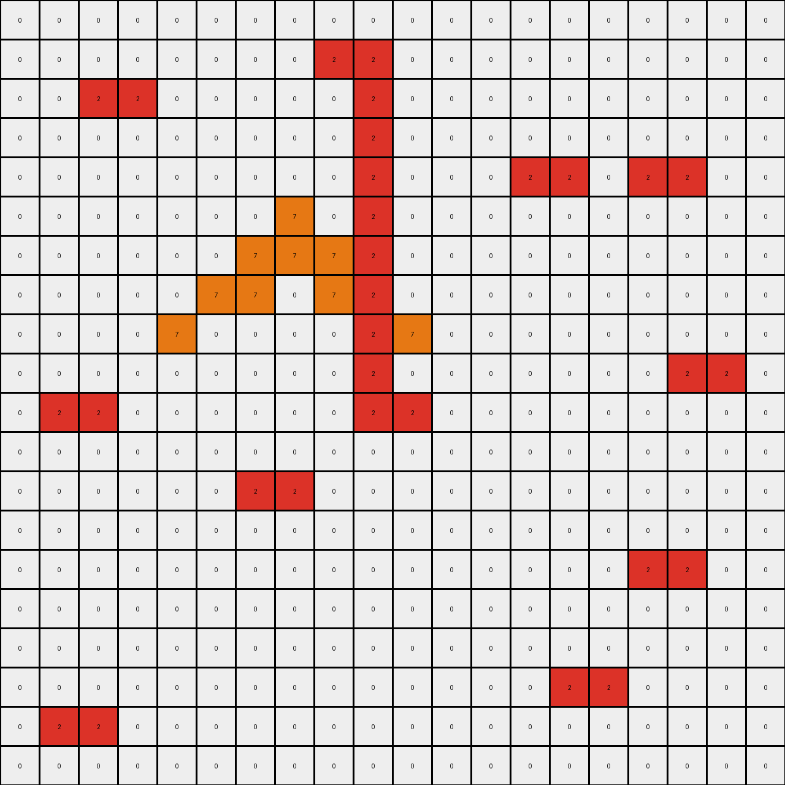

# 6d58a25d • 010 • refine_coder

---

Previous Code:
```python
"""
1.  **Identify Objects:** Locate all red (2) and orange (7) pixels within the input grid. Consider the orange pixels as a single object.
2.  **Horizontal Replication**: For every isolated red pixel not touching or adjacent to an orange pixel, create a duplicate red pixel immediately to its right.
3.  **Vertical Expansion Based on Orange:** For every column that contains any part of the orange object, perform the following:
    *   Find all of the existing red pixels from horizontal replication.
    *   Fill every empty cell in that column between the minimum y coordinate to the maximum y coordinate containing existing red pixels from previous step.
"""

import numpy as np

def get_objects(grid, color):
    """Finds coordinates of all pixels of a given color."""
    return np.argwhere(grid == color)

def is_adjacent_to_orange(coord, orange_coords):
    """Checks if a coordinate is adjacent to any orange pixel (including diagonally)."""
    for orange_coord in orange_coords:
        if abs(coord[0] - orange_coord[0]) <= 1 and abs(coord[1] - orange_coord[1]) <= 1:
            return True
    return False

def transform(input_grid):
    """Transforms the input grid according to the described rules."""
    output_grid = np.copy(input_grid)
    rows, cols = input_grid.shape

    # Identify Objects
    red_coords = get_objects(input_grid, 2)
    orange_coords = get_objects(input_grid, 7)

    # Horizontal Replication (for isolated red pixels)
    new_red_coords = []
    for r, c in red_coords:
        if not is_adjacent_to_orange((r,c), orange_coords):
           new_red_coords.append((r, c+1)) #add pixel
           output_grid[r,c+1] = 2 #horizontal replication
        new_red_coords.append((r,c))


    # Vertical Expansion Based on Orange
    orange_cols = set([c for _, c in orange_coords])
    
    for col in orange_cols:
        # Find all red pixels (original and replicated) in the current column
        
        red_in_col_coords = []
        for r, c in new_red_coords:
          if c == col:
            red_in_col_coords.append((r,col))


        if len(red_in_col_coords) > 0: #only if existing red
            min_row = min([r for r, _ in red_in_col_coords])
            max_row = max([r for r, _ in red_in_col_coords])

            # Fill between min and max row
            for row in range(min_row, max_row + 1):
                output_grid[row, col] = 2

    return output_grid
```

Train Set Results:

## Example 1:

Input:
```
0 0 0 0 0 0 0 0 0 0 0 0 0 0 0 0 0 0 0 0
0 0 0 0 0 0 0 0 0 0 0 0 0 0 0 0 0 0 0 0
0 0 0 0 0 8 0 0 0 0 0 0 0 0 0 0 0 0 0 0
0 0 0 0 0 0 0 0 0 0 0 0 0 0 0 0 8 0 0 0
0 0 0 8 0 0 0 0 0 0 0 0 0 0 0 0 0 0 0 0
0 0 0 0 0 0 0 0 0 9 0 0 0 0 0 0 0 0 0 0
0 0 0 0 0 0 0 0 9 9 9 0 0 0 0 0 0 0 0 0
0 0 0 0 0 0 0 9 9 0 9 9 0 0 0 0 0 0 0 0
0 0 0 0 0 0 9 0 0 0 0 0 9 0 0 0 0 0 0 0
0 0 0 0 0 0 0 0 0 0 0 0 0 0 0 0 0 0 0 0
0 8 0 0 0 0 0 0 0 0 0 0 0 0 0 0 0 0 8 0
0 0 0 0 0 0 0 0 0 0 0 0 0 0 0 0 0 0 0 0
0 0 0 0 0 0 0 0 0 0 0 0 0 0 0 0 0 0 0 0
0 0 0 0 0 0 0 0 0 8 0 0 0 0 0 0 0 0 0 0
0 0 0 0 0 0 0 0 0 0 0 0 0 0 0 0 0 0 0 0
0 0 0 0 0 0 0 0 0 0 0 0 0 0 0 0 0 0 0 0
0 0 0 0 0 0 0 0 0 0 0 0 0 0 0 0 0 0 0 0
0 0 0 0 0 0 0 0 0 0 0 0 0 0 0 0 0 0 0 0
0 0 0 0 0 0 0 0 0 0 0 0 0 0 0 8 0 0 0 0
0 8 0 0 0 0 0 0 0 0 0 0 0 0 0 0 0 0 0 0
```
Expected Output:
```
0 0 0 0 0 0 0 0 0 0 0 0 0 0 0 0 0 0 0 0
0 0 0 0 0 0 0 0 0 0 0 0 0 0 0 0 0 0 0 0
0 0 0 0 0 8 0 0 0 0 0 0 0 0 0 0 0 0 0 0
0 0 0 0 0 0 0 0 0 0 0 0 0 0 0 0 8 0 0 0
0 0 0 8 0 0 0 0 0 0 0 0 0 0 0 0 0 0 0 0
0 0 0 0 0 0 0 0 0 9 0 0 0 0 0 0 0 0 0 0
0 0 0 0 0 0 0 0 9 9 9 0 0 0 0 0 0 0 0 0
0 0 0 0 0 0 0 9 9 8 9 9 0 0 0 0 0 0 0 0
0 0 0 0 0 0 9 0 0 8 0 0 9 0 0 0 0 0 0 0
0 0 0 0 0 0 0 0 0 8 0 0 0 0 0 0 0 0 0 0
0 8 0 0 0 0 0 0 0 8 0 0 0 0 0 0 0 0 8 0
0 0 0 0 0 0 0 0 0 8 0 0 0 0 0 0 0 0 0 0
0 0 0 0 0 0 0 0 0 8 0 0 0 0 0 0 0 0 0 0
0 0 0 0 0 0 0 0 0 8 0 0 0 0 0 0 0 0 0 0
0 0 0 0 0 0 0 0 0 8 0 0 0 0 0 0 0 0 0 0
0 0 0 0 0 0 0 0 0 8 0 0 0 0 0 0 0 0 0 0
0 0 0 0 0 0 0 0 0 8 0 0 0 0 0 0 0 0 0 0
0 0 0 0 0 0 0 0 0 8 0 0 0 0 0 0 0 0 0 0
0 0 0 0 0 0 0 0 0 8 0 0 0 0 0 8 0 0 0 0
0 8 0 0 0 0 0 0 0 8 0 0 0 0 0 0 0 0 0 0
```
Transformed Output:
```
0 0 0 0 0 0 0 0 0 0 0 0 0 0 0 0 0 0 0 0
0 0 0 0 0 0 0 0 0 0 0 0 0 0 0 0 0 0 0 0
0 0 0 0 0 8 0 0 0 0 0 0 0 0 0 0 0 0 0 0
0 0 0 0 0 0 0 0 0 0 0 0 0 0 0 0 8 0 0 0
0 0 0 8 0 0 0 0 0 0 0 0 0 0 0 0 0 0 0 0
0 0 0 0 0 0 0 0 0 9 0 0 0 0 0 0 0 0 0 0
0 0 0 0 0 0 0 0 9 9 9 0 0 0 0 0 0 0 0 0
0 0 0 0 0 0 0 9 9 0 9 9 0 0 0 0 0 0 0 0
0 0 0 0 0 0 9 0 0 0 0 0 9 0 0 0 0 0 0 0
0 0 0 0 0 0 0 0 0 0 0 0 0 0 0 0 0 0 0 0
0 8 0 0 0 0 0 0 0 0 0 0 0 0 0 0 0 0 8 0
0 0 0 0 0 0 0 0 0 0 0 0 0 0 0 0 0 0 0 0
0 0 0 0 0 0 0 0 0 0 0 0 0 0 0 0 0 0 0 0
0 0 0 0 0 0 0 0 0 8 0 0 0 0 0 0 0 0 0 0
0 0 0 0 0 0 0 0 0 0 0 0 0 0 0 0 0 0 0 0
0 0 0 0 0 0 0 0 0 0 0 0 0 0 0 0 0 0 0 0
0 0 0 0 0 0 0 0 0 0 0 0 0 0 0 0 0 0 0 0
0 0 0 0 0 0 0 0 0 0 0 0 0 0 0 0 0 0 0 0
0 0 0 0 0 0 0 0 0 0 0 0 0 0 0 8 0 0 0 0
0 8 0 0 0 0 0 0 0 0 0 0 0 0 0 0 0 0 0 0
```

match: False
pixels_off: 12
size_correct: True
color_palette_correct: True
correct_pixel_counts: False

## Example 2:

Input:
```
0 0 0 0 0 0 0 0 0 0 0 0 0 0 0 0 0 0 0 0
0 0 0 0 0 0 0 0 2 0 0 0 0 0 0 0 0 0 0 0
0 0 2 0 0 0 0 0 0 0 0 0 0 0 0 0 0 0 0 0
0 0 0 0 0 0 0 0 0 0 0 0 0 0 0 0 0 0 0 0
0 0 0 0 0 0 0 0 0 0 0 0 0 2 0 0 2 0 0 0
0 0 0 0 0 0 0 7 0 0 0 0 0 0 0 0 0 0 0 0
0 0 0 0 0 0 7 7 7 0 0 0 0 0 0 0 0 0 0 0
0 0 0 0 0 7 7 0 7 7 0 0 0 0 0 0 0 0 0 0
0 0 0 0 7 0 0 0 0 0 7 0 0 0 0 0 0 0 0 0
0 0 0 0 0 0 0 0 0 0 0 0 0 0 0 0 0 2 0 0
0 2 0 0 0 0 0 0 0 2 0 0 0 0 0 0 0 0 0 0
0 0 0 0 0 0 0 0 0 0 0 0 0 0 0 0 0 0 0 0
0 0 0 0 0 0 2 0 0 0 0 0 0 0 0 0 0 0 0 0
0 0 0 0 0 0 0 0 0 0 0 0 0 0 0 0 0 0 0 0
0 0 0 0 0 0 0 0 0 0 0 0 0 0 0 0 2 0 0 0
0 0 0 0 0 0 0 0 0 0 0 0 0 0 0 0 0 0 0 0
0 0 0 0 0 0 0 0 0 0 0 0 0 0 0 0 0 0 0 0
0 0 0 0 0 0 0 0 0 0 0 0 0 0 2 0 0 0 0 0
0 2 0 0 0 0 0 0 0 0 0 0 0 0 0 0 0 0 0 0
0 0 0 0 0 0 0 0 0 0 0 0 0 0 0 0 0 0 0 0
```
Expected Output:
```
0 0 0 0 0 0 0 0 0 0 0 0 0 0 0 0 0 0 0 0
0 0 0 0 0 0 0 0 2 0 0 0 0 0 0 0 0 0 0 0
0 0 2 0 0 0 0 0 0 0 0 0 0 0 0 0 0 0 0 0
0 0 0 0 0 0 0 0 0 0 0 0 0 0 0 0 0 0 0 0
0 0 0 0 0 0 0 0 0 0 0 0 0 2 0 0 2 0 0 0
0 0 0 0 0 0 0 7 0 0 0 0 0 0 0 0 0 0 0 0
0 0 0 0 0 0 7 7 7 0 0 0 0 0 0 0 0 0 0 0
0 0 0 0 0 7 7 0 7 7 0 0 0 0 0 0 0 0 0 0
0 0 0 0 7 0 2 0 0 2 7 0 0 0 0 0 0 0 0 0
0 0 0 0 0 0 2 0 0 2 0 0 0 0 0 0 0 2 0 0
0 2 0 0 0 0 2 0 0 2 0 0 0 0 0 0 0 0 0 0
0 0 0 0 0 0 2 0 0 2 0 0 0 0 0 0 0 0 0 0
0 0 0 0 0 0 2 0 0 2 0 0 0 0 0 0 0 0 0 0
0 0 0 0 0 0 2 0 0 2 0 0 0 0 0 0 0 0 0 0
0 0 0 0 0 0 2 0 0 2 0 0 0 0 0 0 2 0 0 0
0 0 0 0 0 0 2 0 0 2 0 0 0 0 0 0 0 0 0 0
0 0 0 0 0 0 2 0 0 2 0 0 0 0 0 0 0 0 0 0
0 0 0 0 0 0 2 0 0 2 0 0 0 0 2 0 0 0 0 0
0 2 0 0 0 0 2 0 0 2 0 0 0 0 0 0 0 0 0 0
0 0 0 0 0 0 2 0 0 2 0 0 0 0 0 0 0 0 0 0
```
Transformed Output:
```
0 0 0 0 0 0 0 0 0 0 0 0 0 0 0 0 0 0 0 0
0 0 0 0 0 0 0 0 2 2 0 0 0 0 0 0 0 0 0 0
0 0 2 2 0 0 0 0 0 2 0 0 0 0 0 0 0 0 0 0
0 0 0 0 0 0 0 0 0 2 0 0 0 0 0 0 0 0 0 0
0 0 0 0 0 0 0 0 0 2 0 0 0 2 2 0 2 2 0 0
0 0 0 0 0 0 0 7 0 2 0 0 0 0 0 0 0 0 0 0
0 0 0 0 0 0 7 7 7 2 0 0 0 0 0 0 0 0 0 0
0 0 0 0 0 7 7 0 7 2 0 0 0 0 0 0 0 0 0 0
0 0 0 0 7 0 0 0 0 2 7 0 0 0 0 0 0 0 0 0
0 0 0 0 0 0 0 0 0 2 0 0 0 0 0 0 0 2 2 0
0 2 2 0 0 0 0 0 0 2 2 0 0 0 0 0 0 0 0 0
0 0 0 0 0 0 0 0 0 0 0 0 0 0 0 0 0 0 0 0
0 0 0 0 0 0 2 2 0 0 0 0 0 0 0 0 0 0 0 0
0 0 0 0 0 0 0 0 0 0 0 0 0 0 0 0 0 0 0 0
0 0 0 0 0 0 0 0 0 0 0 0 0 0 0 0 2 2 0 0
0 0 0 0 0 0 0 0 0 0 0 0 0 0 0 0 0 0 0 0
0 0 0 0 0 0 0 0 0 0 0 0 0 0 0 0 0 0 0 0
0 0 0 0 0 0 0 0 0 0 0 0 0 0 2 2 0 0 0 0
0 2 2 0 0 0 0 0 0 0 0 0 0 0 0 0 0 0 0 0
0 0 0 0 0 0 0 0 0 0 0 0 0 0 0 0 0 0 0 0
```

match: False
pixels_off: 37
size_correct: True
color_palette_correct: True
correct_pixel_counts: False

## Example 3:

Input:
```
0 0 0 0 0 0 0 0 0 0 0 0 0 0 0 0 0 0 0 0
0 0 0 0 0 0 0 0 0 0 0 0 0 0 3 0 0 0 0 0
0 0 0 0 0 3 0 0 0 0 3 0 0 0 0 0 0 0 0 0
0 0 0 0 0 0 0 0 0 0 0 0 0 0 0 0 0 0 0 0
0 3 0 0 0 0 0 0 0 0 0 0 4 0 0 0 0 0 0 0
0 0 0 0 0 0 0 3 0 0 0 4 4 4 0 0 0 0 3 0
0 0 0 0 0 0 0 0 0 0 4 4 0 4 4 0 0 0 0 0
0 0 0 0 3 0 0 0 0 4 0 0 0 0 0 4 0 0 0 0
0 0 0 0 0 0 0 0 0 0 0 0 0 0 0 0 0 0 0 0
0 0 0 0 0 0 0 0 0 0 3 0 0 0 0 0 0 0 0 0
0 0 3 0 0 0 0 0 0 0 0 0 0 0 0 0 0 0 0 0
0 0 0 0 0 0 0 0 0 0 0 0 0 0 0 0 0 0 0 0
3 0 0 0 0 0 0 3 0 0 0 0 0 3 0 0 0 0 3 0
0 0 0 0 0 0 0 0 0 0 0 0 0 0 0 0 0 0 0 0
0 0 0 0 0 0 0 0 0 0 0 0 0 0 0 0 0 0 0 0
0 0 0 0 3 0 0 0 0 0 0 0 0 0 0 0 0 0 0 0
0 0 0 0 0 0 0 0 0 0 0 0 3 0 0 0 0 0 0 0
0 3 0 0 0 0 0 0 0 0 0 0 0 0 0 0 3 0 0 0
0 0 0 0 0 0 0 3 0 0 0 0 0 3 0 0 0 0 0 3
0 0 0 0 0 0 0 0 0 0 0 0 0 0 0 0 0 0 0 0
```
Expected Output:
```
0 0 0 0 0 0 0 0 0 0 0 0 0 0 0 0 0 0 0 0
0 0 0 0 0 0 0 0 0 0 0 0 0 0 3 0 0 0 0 0
0 0 0 0 0 3 0 0 0 0 3 0 0 0 0 0 0 0 0 0
0 0 0 0 0 0 0 0 0 0 0 0 0 0 0 0 0 0 0 0
0 3 0 0 0 0 0 0 0 0 0 0 4 0 0 0 0 0 0 0
0 0 0 0 0 0 0 3 0 0 0 4 4 4 0 0 0 0 3 0
0 0 0 0 0 0 0 0 0 0 4 4 3 4 4 0 0 0 0 0
0 0 0 0 3 0 0 0 0 4 3 0 3 3 0 4 0 0 0 0
0 0 0 0 0 0 0 0 0 0 3 0 3 3 0 0 0 0 0 0
0 0 0 0 0 0 0 0 0 0 3 0 3 3 0 0 0 0 0 0
0 0 3 0 0 0 0 0 0 0 3 0 3 3 0 0 0 0 0 0
0 0 0 0 0 0 0 0 0 0 3 0 3 3 0 0 0 0 0 0
3 0 0 0 0 0 0 3 0 0 3 0 3 3 0 0 0 0 3 0
0 0 0 0 0 0 0 0 0 0 3 0 3 3 0 0 0 0 0 0
0 0 0 0 0 0 0 0 0 0 3 0 3 3 0 0 0 0 0 0
0 0 0 0 3 0 0 0 0 0 3 0 3 3 0 0 0 0 0 0
0 0 0 0 0 0 0 0 0 0 3 0 3 3 0 0 0 0 0 0
0 3 0 0 0 0 0 0 0 0 3 0 3 3 0 0 3 0 0 0
0 0 0 0 0 0 0 3 0 0 3 0 3 3 0 0 0 0 0 3
0 0 0 0 0 0 0 0 0 0 3 0 3 3 0 0 0 0 0 0
```
Transformed Output:
```
0 0 0 0 0 0 0 0 0 0 0 0 0 0 0 0 0 0 0 0
0 0 0 0 0 0 0 0 0 0 0 0 0 0 3 0 0 0 0 0
0 0 0 0 0 3 0 0 0 0 3 0 0 0 0 0 0 0 0 0
0 0 0 0 0 0 0 0 0 0 0 0 0 0 0 0 0 0 0 0
0 3 0 0 0 0 0 0 0 0 0 0 4 0 0 0 0 0 0 0
0 0 0 0 0 0 0 3 0 0 0 4 4 4 0 0 0 0 3 0
0 0 0 0 0 0 0 0 0 0 4 4 0 4 4 0 0 0 0 0
0 0 0 0 3 0 0 0 0 4 0 0 0 0 0 4 0 0 0 0
0 0 0 0 0 0 0 0 0 0 0 0 0 0 0 0 0 0 0 0
0 0 0 0 0 0 0 0 0 0 3 0 0 0 0 0 0 0 0 0
0 0 3 0 0 0 0 0 0 0 0 0 0 0 0 0 0 0 0 0
0 0 0 0 0 0 0 0 0 0 0 0 0 0 0 0 0 0 0 0
3 0 0 0 0 0 0 3 0 0 0 0 0 3 0 0 0 0 3 0
0 0 0 0 0 0 0 0 0 0 0 0 0 0 0 0 0 0 0 0
0 0 0 0 0 0 0 0 0 0 0 0 0 0 0 0 0 0 0 0
0 0 0 0 3 0 0 0 0 0 0 0 0 0 0 0 0 0 0 0
0 0 0 0 0 0 0 0 0 0 0 0 3 0 0 0 0 0 0 0
0 3 0 0 0 0 0 0 0 0 0 0 0 0 0 0 3 0 0 0
0 0 0 0 0 0 0 3 0 0 0 0 0 3 0 0 0 0 0 3
0 0 0 0 0 0 0 0 0 0 0 0 0 0 0 0 0 0 0 0
```

match: False
pixels_off: 36
size_correct: True
color_palette_correct: True
correct_pixel_counts: False
Here's an analysis of the provided examples and a plan to refine the natural language program and code:

**General Assessment:**

The initial natural language program and code captured some key aspects of the transformation, specifically the horizontal replication of red pixels and a vertical expansion based on columns containing orange. However, it's clear from the errors in Examples 2 and 3 that the logic is incomplete and contains inaccuracies. The primary issues are:

1.  **Incorrect Horizontal Replication:** The rule incorrectly replicates *all* red pixels not adjacent to orange, when it seems to only replicate certain ones. It's likely a context we are missing.
2.  **Incomplete Vertical Expansion:** The vertical expansion is tied to the *original and horizontally replicated* red pixels, but the intended logic seems more nuanced, including combining colors.
3. **Combining Colors.** Example 3 uses colors 3 and 4, so we need to update the program, and the code, to specify combining those colors instead of 2 and 7.

**Strategy for Resolving Errors:**

1.  **Re-examine Horizontal Replication:** Carefully analyze *which* red pixels are replicated in each example. Look for a more specific condition beyond just "not adjacent to orange." It could involve position relative to other red pixels, or distance.
2.  **Refine Vertical Expansion Condition:** Determine the *precise* trigger for vertical expansion. It's not just the presence of orange in a column, but also the presence of red (or the other color) in that column. The fill color of the vertical expansion is the same as the trigger color.
3.  **Consider Color Combinations**: Review all examples to check if the program should be generalized to consider pairs of colors, for example in example 3 it is color 3 and 4.

**Metrics and Observations (using targeted questions):**

Here's a breakdown of each example with specific observations:

*   **Example 1:**
    *   Horizontal replication occurs for some maroon (9) pixels.
    *   Vertical filling does *not* occur.
    *   An azure (8) pixel appears to be filling inside of the maroon (9) object.

*   **Example 2:**
    *   Horizontal replication occurs for *some* red (2) pixels. It appears to be those that are not directly above or below the orange (7).
    *   Vertical expansion fills in columns containing both red and orange.
    *   The vertical fill uses color red (2)

*   **Example 3:**
    *   Horizontal replication does not occur.
    *   Vertical expansion fills columns with green (3) and yellow (4).
    *   The vertical fill uses color green (3).

**YAML Facts:**

```yaml
examples:
  - id: 1
    horizontal_replication:
      color: 9
      condition: "isolated, not adjacent to 8"
      direction: right
    vertical_expansion:
      trigger_colors: []
      fill_color: 8
      fill_within_object: true
      object_color: 9
    notes: >
      Maroon pixels are replicated. The azure fill appears within the maroon
      object.

  - id: 2
    horizontal_replication:
      color: 2
      condition: "not vertically aligned with 7"
      direction: right
    vertical_expansion:
      trigger_colors: [2, 7]
      fill_color: 2
      fill_within_object: false
    notes: >
      Red pixels are replicated horizontally if they are not directly above or
      below an orange pixel. Vertical filling occurs in columns containing
      both red and orange.

  - id: 3
    horizontal_replication:
      color: null
      condition: null
      direction: null
    vertical_expansion:
      trigger_colors: [3, 4]
      fill_color: 3
      fill_within_object: false
    notes: >
      No horizontal replication. Vertical fill happens in columns with both
      green and yellow pixels using green color.
```

**Natural Language Program:**

1.  **Object Identification and Color Combination:** Identify two key colors in the input.
     * Examples 1: 8 and 9
     * Examples 2: 2 and 7
     * Examples 3: 3 and 4

2. **Determine Horizontal Replication Rule (Conditional):**
    *  _If_ isolated pixels of the first key color exist AND are not vertically aligned with pixels of the second key color, duplicate those pixels of color one to the immediate right.

3.  **Vertical Expansion:**
    *   For each column that contains *both* key colors, locate all the pixels of color one.
    *   Fill all cells between the highest and lowest of those color one pixels, in that column, with color one.
4. **Object Fill (Example 1):**
   *   If pixels of the second key color have pixels of the first key color above and below, fill the space between with the second key color.


**INSTRUCTIONS**

- generate a Python module to represent the natural language program 
- follow the template below
- all common math and science libraries are available
- create docstring only at top - but comment the workflow in the function
- use helper functions for common operations like finding objects, counting,
  measuring, moving, etc. 

remember - we are working iteratively - so this code will inform your future
self as we converge on the solution

*template:*

```python
"""
{{ natural language description of the transformation rule }}
"""

{{ imports }}

def transform(input_grid):
    # initialize output_grid

    # change output pixels 

    return output_grid

```
