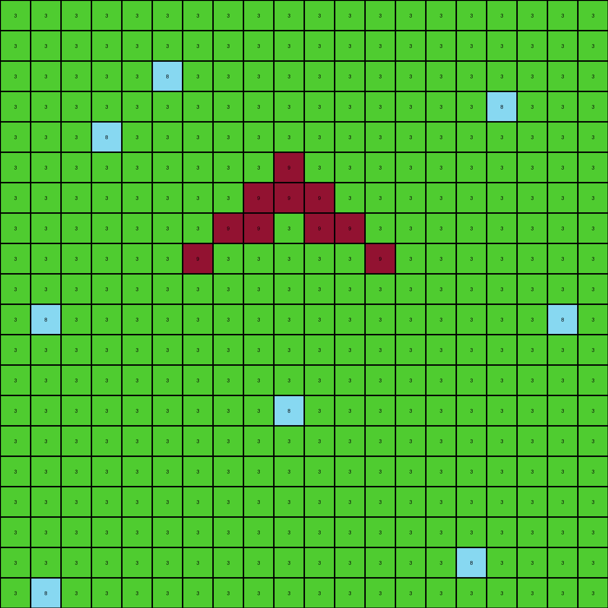
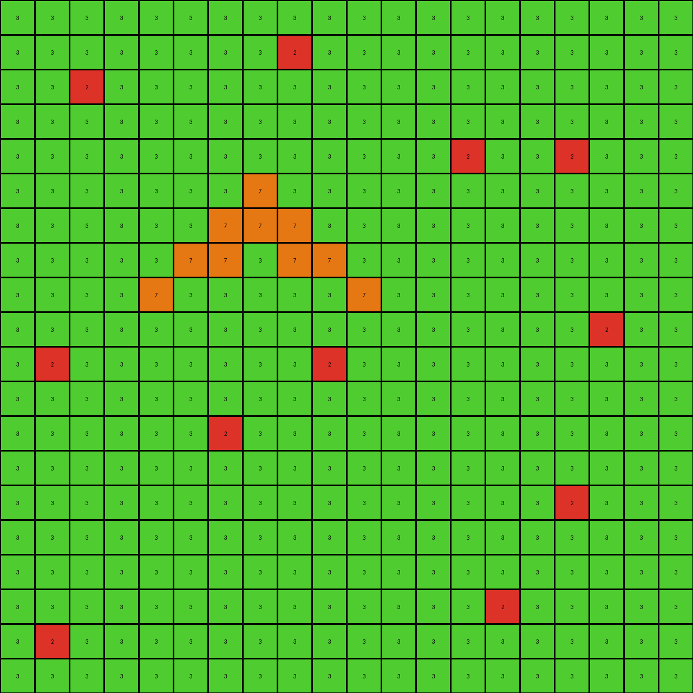

# 6d58a25d • 015 • refine_dreamer

---


Previous Code:
```python
"""
1.  **Identify** all pixels.
2.  **Identify** the contiguous yellow (4) shape.
3.  **Locate** the position the yellow shape.
4.  **Replace** the yellow (4) shape with green (3)
5.  **Fill** all of the empty (white, 0) cells with green (3) pixels.
6. Existing Green (3) pixels remain unchanged.
"""

import numpy as np

def find_contiguous_shape(grid, color):
    """Finds the coordinates of a contiguous shape of the given color."""
    rows, cols = grid.shape
    visited = np.zeros((rows, cols), dtype=bool)
    shape_coords = []

    def dfs(r, c):
        if (r < 0 or r >= rows or c < 0 or c >= cols or
                visited[r, c] or grid[r, c] != color):
            return
        visited[r, c] = True
        shape_coords.append((r, c))
        dfs(r + 1, c)
        dfs(r - 1, c)
        dfs(r, c + 1)
        dfs(r, c - 1)
        # Include diagonals:
        dfs(r + 1, c + 1)
        dfs(r + 1, c - 1)
        dfs(r - 1, c + 1)
        dfs(r - 1, c - 1)

    for r in range(rows):
        for c in range(cols):
            if grid[r, c] == color and not visited[r, c]:
                dfs(r, c)
                return shape_coords  # Return after finding the *first* contiguous shape
    return [] # return empty if no shape found


def transform(input_grid):
    # Initialize the output grid as a copy of the input grid
    output_grid = input_grid.copy()
    rows, cols = input_grid.shape

    # Find the coordinates of the contiguous yellow shape
    yellow_shape_coords = find_contiguous_shape(input_grid, 4)

    # Replace the yellow shape with green
    for r, c in yellow_shape_coords:
        output_grid[r, c] = 3

    # Fill all empty cells (white, 0) with green (3), keeping existing greens
    for r in range(rows):
        for c in range(cols):
            if output_grid[r, c] == 0:
                output_grid[r, c] = 3

    return output_grid
```

Train Set Results:

## Example 1:

Input:
```
0 0 0 0 0 0 0 0 0 0 0 0 0 0 0 0 0 0 0 0
0 0 0 0 0 0 0 0 0 0 0 0 0 0 0 0 0 0 0 0
0 0 0 0 0 8 0 0 0 0 0 0 0 0 0 0 0 0 0 0
0 0 0 0 0 0 0 0 0 0 0 0 0 0 0 0 8 0 0 0
0 0 0 8 0 0 0 0 0 0 0 0 0 0 0 0 0 0 0 0
0 0 0 0 0 0 0 0 0 9 0 0 0 0 0 0 0 0 0 0
0 0 0 0 0 0 0 0 9 9 9 0 0 0 0 0 0 0 0 0
0 0 0 0 0 0 0 9 9 0 9 9 0 0 0 0 0 0 0 0
0 0 0 0 0 0 9 0 0 0 0 0 9 0 0 0 0 0 0 0
0 0 0 0 0 0 0 0 0 0 0 0 0 0 0 0 0 0 0 0
0 8 0 0 0 0 0 0 0 0 0 0 0 0 0 0 0 0 8 0
0 0 0 0 0 0 0 0 0 0 0 0 0 0 0 0 0 0 0 0
0 0 0 0 0 0 0 0 0 0 0 0 0 0 0 0 0 0 0 0
0 0 0 0 0 0 0 0 0 8 0 0 0 0 0 0 0 0 0 0
0 0 0 0 0 0 0 0 0 0 0 0 0 0 0 0 0 0 0 0
0 0 0 0 0 0 0 0 0 0 0 0 0 0 0 0 0 0 0 0
0 0 0 0 0 0 0 0 0 0 0 0 0 0 0 0 0 0 0 0
0 0 0 0 0 0 0 0 0 0 0 0 0 0 0 0 0 0 0 0
0 0 0 0 0 0 0 0 0 0 0 0 0 0 0 8 0 0 0 0
0 8 0 0 0 0 0 0 0 0 0 0 0 0 0 0 0 0 0 0
```
Expected Output:
```
0 0 0 0 0 0 0 0 0 0 0 0 0 0 0 0 0 0 0 0
0 0 0 0 0 0 0 0 0 0 0 0 0 0 0 0 0 0 0 0
0 0 0 0 0 8 0 0 0 0 0 0 0 0 0 0 0 0 0 0
0 0 0 0 0 0 0 0 0 0 0 0 0 0 0 0 8 0 0 0
0 0 0 8 0 0 0 0 0 0 0 0 0 0 0 0 0 0 0 0
0 0 0 0 0 0 0 0 0 9 0 0 0 0 0 0 0 0 0 0
0 0 0 0 0 0 0 0 9 9 9 0 0 0 0 0 0 0 0 0
0 0 0 0 0 0 0 9 9 8 9 9 0 0 0 0 0 0 0 0
0 0 0 0 0 0 9 0 0 8 0 0 9 0 0 0 0 0 0 0
0 0 0 0 0 0 0 0 0 8 0 0 0 0 0 0 0 0 0 0
0 8 0 0 0 0 0 0 0 8 0 0 0 0 0 0 0 0 8 0
0 0 0 0 0 0 0 0 0 8 0 0 0 0 0 0 0 0 0 0
0 0 0 0 0 0 0 0 0 8 0 0 0 0 0 0 0 0 0 0
0 0 0 0 0 0 0 0 0 8 0 0 0 0 0 0 0 0 0 0
0 0 0 0 0 0 0 0 0 8 0 0 0 0 0 0 0 0 0 0
0 0 0 0 0 0 0 0 0 8 0 0 0 0 0 0 0 0 0 0
0 0 0 0 0 0 0 0 0 8 0 0 0 0 0 0 0 0 0 0
0 0 0 0 0 0 0 0 0 8 0 0 0 0 0 0 0 0 0 0
0 0 0 0 0 0 0 0 0 8 0 0 0 0 0 8 0 0 0 0
0 8 0 0 0 0 0 0 0 8 0 0 0 0 0 0 0 0 0 0
```
Transformed Output:
```
3 3 3 3 3 3 3 3 3 3 3 3 3 3 3 3 3 3 3 3
3 3 3 3 3 3 3 3 3 3 3 3 3 3 3 3 3 3 3 3
3 3 3 3 3 8 3 3 3 3 3 3 3 3 3 3 3 3 3 3
3 3 3 3 3 3 3 3 3 3 3 3 3 3 3 3 8 3 3 3
3 3 3 8 3 3 3 3 3 3 3 3 3 3 3 3 3 3 3 3
3 3 3 3 3 3 3 3 3 9 3 3 3 3 3 3 3 3 3 3
3 3 3 3 3 3 3 3 9 9 9 3 3 3 3 3 3 3 3 3
3 3 3 3 3 3 3 9 9 3 9 9 3 3 3 3 3 3 3 3
3 3 3 3 3 3 9 3 3 3 3 3 9 3 3 3 3 3 3 3
3 3 3 3 3 3 3 3 3 3 3 3 3 3 3 3 3 3 3 3
3 8 3 3 3 3 3 3 3 3 3 3 3 3 3 3 3 3 8 3
3 3 3 3 3 3 3 3 3 3 3 3 3 3 3 3 3 3 3 3
3 3 3 3 3 3 3 3 3 3 3 3 3 3 3 3 3 3 3 3
3 3 3 3 3 3 3 3 3 8 3 3 3 3 3 3 3 3 3 3
3 3 3 3 3 3 3 3 3 3 3 3 3 3 3 3 3 3 3 3
3 3 3 3 3 3 3 3 3 3 3 3 3 3 3 3 3 3 3 3
3 3 3 3 3 3 3 3 3 3 3 3 3 3 3 3 3 3 3 3
3 3 3 3 3 3 3 3 3 3 3 3 3 3 3 3 3 3 3 3
3 3 3 3 3 3 3 3 3 3 3 3 3 3 3 8 3 3 3 3
3 8 3 3 3 3 3 3 3 3 3 3 3 3 3 3 3 3 3 3
```

match: False
pixels_off: 382
size_correct: True
color_palette_correct: False
correct_pixel_counts: False

## Example 2:

Input:
```
0 0 0 0 0 0 0 0 0 0 0 0 0 0 0 0 0 0 0 0
0 0 0 0 0 0 0 0 2 0 0 0 0 0 0 0 0 0 0 0
0 0 2 0 0 0 0 0 0 0 0 0 0 0 0 0 0 0 0 0
0 0 0 0 0 0 0 0 0 0 0 0 0 0 0 0 0 0 0 0
0 0 0 0 0 0 0 0 0 0 0 0 0 2 0 0 2 0 0 0
0 0 0 0 0 0 0 7 0 0 0 0 0 0 0 0 0 0 0 0
0 0 0 0 0 0 7 7 7 0 0 0 0 0 0 0 0 0 0 0
0 0 0 0 0 7 7 0 7 7 0 0 0 0 0 0 0 0 0 0
0 0 0 0 7 0 0 0 0 0 7 0 0 0 0 0 0 0 0 0
0 0 0 0 0 0 0 0 0 0 0 0 0 0 0 0 0 2 0 0
0 2 0 0 0 0 0 0 0 2 0 0 0 0 0 0 0 0 0 0
0 0 0 0 0 0 0 0 0 0 0 0 0 0 0 0 0 0 0 0
0 0 0 0 0 0 2 0 0 0 0 0 0 0 0 0 0 0 0 0
0 0 0 0 0 0 0 0 0 0 0 0 0 0 0 0 0 0 0 0
0 0 0 0 0 0 0 0 0 0 0 0 0 0 0 0 2 0 0 0
0 0 0 0 0 0 0 0 0 0 0 0 0 0 0 0 0 0 0 0
0 0 0 0 0 0 0 0 0 0 0 0 0 0 0 0 0 0 0 0
0 0 0 0 0 0 0 0 0 0 0 0 0 0 2 0 0 0 0 0
0 2 0 0 0 0 0 0 0 0 0 0 0 0 0 0 0 0 0 0
0 0 0 0 0 0 0 0 0 0 0 0 0 0 0 0 0 0 0 0
```
Expected Output:
```
0 0 0 0 0 0 0 0 0 0 0 0 0 0 0 0 0 0 0 0
0 0 0 0 0 0 0 0 2 0 0 0 0 0 0 0 0 0 0 0
0 0 2 0 0 0 0 0 0 0 0 0 0 0 0 0 0 0 0 0
0 0 0 0 0 0 0 0 0 0 0 0 0 0 0 0 0 0 0 0
0 0 0 0 0 0 0 0 0 0 0 0 0 2 0 0 2 0 0 0
0 0 0 0 0 0 0 7 0 0 0 0 0 0 0 0 0 0 0 0
0 0 0 0 0 0 7 7 7 0 0 0 0 0 0 0 0 0 0 0
0 0 0 0 0 7 7 0 7 7 0 0 0 0 0 0 0 0 0 0
0 0 0 0 7 0 2 0 0 2 7 0 0 0 0 0 0 0 0 0
0 0 0 0 0 0 2 0 0 2 0 0 0 0 0 0 0 2 0 0
0 2 0 0 0 0 2 0 0 2 0 0 0 0 0 0 0 0 0 0
0 0 0 0 0 0 2 0 0 2 0 0 0 0 0 0 0 0 0 0
0 0 0 0 0 0 2 0 0 2 0 0 0 0 0 0 0 0 0 0
0 0 0 0 0 0 2 0 0 2 0 0 0 0 0 0 0 0 0 0
0 0 0 0 0 0 2 0 0 2 0 0 0 0 0 0 2 0 0 0
0 0 0 0 0 0 2 0 0 2 0 0 0 0 0 0 0 0 0 0
0 0 0 0 0 0 2 0 0 2 0 0 0 0 0 0 0 0 0 0
0 0 0 0 0 0 2 0 0 2 0 0 0 0 2 0 0 0 0 0
0 2 0 0 0 0 2 0 0 2 0 0 0 0 0 0 0 0 0 0
0 0 0 0 0 0 2 0 0 2 0 0 0 0 0 0 0 0 0 0
```
Transformed Output:
```
3 3 3 3 3 3 3 3 3 3 3 3 3 3 3 3 3 3 3 3
3 3 3 3 3 3 3 3 2 3 3 3 3 3 3 3 3 3 3 3
3 3 2 3 3 3 3 3 3 3 3 3 3 3 3 3 3 3 3 3
3 3 3 3 3 3 3 3 3 3 3 3 3 3 3 3 3 3 3 3
3 3 3 3 3 3 3 3 3 3 3 3 3 2 3 3 2 3 3 3
3 3 3 3 3 3 3 7 3 3 3 3 3 3 3 3 3 3 3 3
3 3 3 3 3 3 7 7 7 3 3 3 3 3 3 3 3 3 3 3
3 3 3 3 3 7 7 3 7 7 3 3 3 3 3 3 3 3 3 3
3 3 3 3 7 3 3 3 3 3 7 3 3 3 3 3 3 3 3 3
3 3 3 3 3 3 3 3 3 3 3 3 3 3 3 3 3 2 3 3
3 2 3 3 3 3 3 3 3 2 3 3 3 3 3 3 3 3 3 3
3 3 3 3 3 3 3 3 3 3 3 3 3 3 3 3 3 3 3 3
3 3 3 3 3 3 2 3 3 3 3 3 3 3 3 3 3 3 3 3
3 3 3 3 3 3 3 3 3 3 3 3 3 3 3 3 3 3 3 3
3 3 3 3 3 3 3 3 3 3 3 3 3 3 3 3 2 3 3 3
3 3 3 3 3 3 3 3 3 3 3 3 3 3 3 3 3 3 3 3
3 3 3 3 3 3 3 3 3 3 3 3 3 3 3 3 3 3 3 3
3 3 3 3 3 3 3 3 3 3 3 3 3 3 2 3 3 3 3 3
3 2 3 3 3 3 3 3 3 3 3 3 3 3 3 3 3 3 3 3
3 3 3 3 3 3 3 3 3 3 3 3 3 3 3 3 3 3 3 3
```

match: False
pixels_off: 379
size_correct: True
color_palette_correct: False
correct_pixel_counts: False

## Example 3:

Input:
```
0 0 0 0 0 0 0 0 0 0 0 0 0 0 0 0 0 0 0 0
0 0 0 0 0 0 0 0 0 0 0 0 0 0 3 0 0 0 0 0
0 0 0 0 0 3 0 0 0 0 3 0 0 0 0 0 0 0 0 0
0 0 0 0 0 0 0 0 0 0 0 0 0 0 0 0 0 0 0 0
0 3 0 0 0 0 0 0 0 0 0 0 4 0 0 0 0 0 0 0
0 0 0 0 0 0 0 3 0 0 0 4 4 4 0 0 0 0 3 0
0 0 0 0 0 0 0 0 0 0 4 4 0 4 4 0 0 0 0 0
0 0 0 0 3 0 0 0 0 4 0 0 0 0 0 4 0 0 0 0
0 0 0 0 0 0 0 0 0 0 0 0 0 0 0 0 0 0 0 0
0 0 0 0 0 0 0 0 0 0 3 0 0 0 0 0 0 0 0 0
0 0 3 0 0 0 0 0 0 0 0 0 0 0 0 0 0 0 0 0
0 0 0 0 0 0 0 0 0 0 0 0 0 0 0 0 0 0 0 0
3 0 0 0 0 0 0 3 0 0 0 0 0 3 0 0 0 0 3 0
0 0 0 0 0 0 0 0 0 0 0 0 0 0 0 0 0 0 0 0
0 0 0 0 0 0 0 0 0 0 0 0 0 0 0 0 0 0 0 0
0 0 0 0 3 0 0 0 0 0 0 0 0 0 0 0 0 0 0 0
0 0 0 0 0 0 0 0 0 0 0 0 3 0 0 0 0 0 0 0
0 3 0 0 0 0 0 0 0 0 0 0 0 0 0 0 3 0 0 0
0 0 0 0 0 0 0 3 0 0 0 0 0 3 0 0 0 0 0 3
0 0 0 0 0 0 0 0 0 0 0 0 0 0 0 0 0 0 0 0
```
Expected Output:
```
0 0 0 0 0 0 0 0 0 0 0 0 0 0 0 0 0 0 0 0
0 0 0 0 0 0 0 0 0 0 0 0 0 0 3 0 0 0 0 0
0 0 0 0 0 3 0 0 0 0 3 0 0 0 0 0 0 0 0 0
0 0 0 0 0 0 0 0 0 0 0 0 0 0 0 0 0 0 0 0
0 3 0 0 0 0 0 0 0 0 0 0 4 0 0 0 0 0 0 0
0 0 0 0 0 0 0 3 0 0 0 4 4 4 0 0 0 0 3 0
0 0 0 0 0 0 0 0 0 0 4 4 3 4 4 0 0 0 0 0
0 0 0 0 3 0 0 0 0 4 3 0 3 3 0 4 0 0 0 0
0 0 0 0 0 0 0 0 0 0 3 0 3 3 0 0 0 0 0 0
0 0 0 0 0 0 0 0 0 0 3 0 3 3 0 0 0 0 0 0
0 0 3 0 0 0 0 0 0 0 3 0 3 3 0 0 0 0 0 0
0 0 0 0 0 0 0 0 0 0 3 0 3 3 0 0 0 0 0 0
3 0 0 0 0 0 0 3 0 0 3 0 3 3 0 0 0 0 3 0
0 0 0 0 0 0 0 0 0 0 3 0 3 3 0 0 0 0 0 0
0 0 0 0 0 0 0 0 0 0 3 0 3 3 0 0 0 0 0 0
0 0 0 0 3 0 0 0 0 0 3 0 3 3 0 0 0 0 0 0
0 0 0 0 0 0 0 0 0 0 3 0 3 3 0 0 0 0 0 0
0 3 0 0 0 0 0 0 0 0 3 0 3 3 0 0 3 0 0 0
0 0 0 0 0 0 0 3 0 0 3 0 3 3 0 0 0 0 0 3
0 0 0 0 0 0 0 0 0 0 3 0 3 3 0 0 0 0 0 0
```
Transformed Output:
```
3 3 3 3 3 3 3 3 3 3 3 3 3 3 3 3 3 3 3 3
3 3 3 3 3 3 3 3 3 3 3 3 3 3 3 3 3 3 3 3
3 3 3 3 3 3 3 3 3 3 3 3 3 3 3 3 3 3 3 3
3 3 3 3 3 3 3 3 3 3 3 3 3 3 3 3 3 3 3 3
3 3 3 3 3 3 3 3 3 3 3 3 3 3 3 3 3 3 3 3
3 3 3 3 3 3 3 3 3 3 3 3 3 3 3 3 3 3 3 3
3 3 3 3 3 3 3 3 3 3 3 3 3 3 3 3 3 3 3 3
3 3 3 3 3 3 3 3 3 3 3 3 3 3 3 3 3 3 3 3
3 3 3 3 3 3 3 3 3 3 3 3 3 3 3 3 3 3 3 3
3 3 3 3 3 3 3 3 3 3 3 3 3 3 3 3 3 3 3 3
3 3 3 3 3 3 3 3 3 3 3 3 3 3 3 3 3 3 3 3
3 3 3 3 3 3 3 3 3 3 3 3 3 3 3 3 3 3 3 3
3 3 3 3 3 3 3 3 3 3 3 3 3 3 3 3 3 3 3 3
3 3 3 3 3 3 3 3 3 3 3 3 3 3 3 3 3 3 3 3
3 3 3 3 3 3 3 3 3 3 3 3 3 3 3 3 3 3 3 3
3 3 3 3 3 3 3 3 3 3 3 3 3 3 3 3 3 3 3 3
3 3 3 3 3 3 3 3 3 3 3 3 3 3 3 3 3 3 3 3
3 3 3 3 3 3 3 3 3 3 3 3 3 3 3 3 3 3 3 3
3 3 3 3 3 3 3 3 3 3 3 3 3 3 3 3 3 3 3 3
3 3 3 3 3 3 3 3 3 3 3 3 3 3 3 3 3 3 3 3
```

match: False
pixels_off: 344
size_correct: True
color_palette_correct: True
correct_pixel_counts: False

**INSTRUCTIONS**

The code above was generated based on observations from the first training
example

we have tested the transform function on each of the task example inputs and
compared with the expected output

review each of the examples provided and the results and consider how the
natural language program should be updated to accommodate this new knowledge

respond with the following deliverables:

- general assessment of the information provided and strategy for resolving the
  errors
- gather metrics about each of the examples and results - use code_execution to
  develop accurate reports on your assumptions
- a YAML block documenting facts - Focus on identifying objects, their properties, and the actions performed on them.
- a natural language program - Be as clear and concise as possible, providing a complete description of the transformation rule.


your responses should be considered as information in a report - not a
conversation
