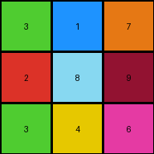

# 6ecd11f4 • 004 • refine_coder

---

Previous Code:
```python
"""
Extracts a specific 3x3 subgrid from the input grid, based on the location of a multi-colored region in the lower part of the grid.
"""

import numpy as np

def find_3x3_subgrid(input_grid):
    # Find the bounding box of non-zero and non-one pixels.
    rows, cols = input_grid.shape
    non_zero_one_indices = np.argwhere((input_grid != 0) & (input_grid !=1))

    if len(non_zero_one_indices) == 0:
        return None
    
    min_row = np.min(non_zero_one_indices[:, 0])
    max_row = np.max(non_zero_one_indices[:, 0])
    min_col = np.min(non_zero_one_indices[:, 1])
    max_col = np.max(non_zero_one_indices[:, 1])

    #Check if the region is 3x3.
    if max_row - min_row == 2 and max_col - min_col == 2:
       return (min_row, min_col)

    return None #no 3x3 region found

def transform(input_grid):
    """
    Transforms the input grid by extracting a 3x3 subgrid.
    """
    # Find the location of 3x3 subgrid.
    subgrid_start = find_3x3_subgrid(input_grid)

    # initialize output_grid as 3x3 of all 0
    output_grid = np.zeros((3, 3), dtype=int)

    if subgrid_start:
        # Extract the 3x3 subgrid.
        row_start, col_start = subgrid_start
        for i in range(3):
            for j in range(3):
                output_grid[i, j] = input_grid[row_start + i, col_start + j]

    return output_grid
```

Train Set Results:

## Example 1:

Input:
```
0 0 0 0 0 0 0 0 0 0 0 0 0 0 0 0 0 0 0 0 0
0 1 1 1 1 1 0 0 0 0 0 1 1 1 1 1 0 0 0 0 0
0 1 1 1 1 1 0 0 0 0 0 1 1 1 1 1 0 0 0 0 0
0 1 1 1 1 1 0 0 0 0 0 1 1 1 1 1 0 0 0 0 0
0 1 1 1 1 1 0 0 0 0 0 1 1 1 1 1 0 0 0 0 0
0 1 1 1 1 1 0 0 0 0 0 1 1 1 1 1 0 0 0 0 0
0 0 0 0 0 0 1 1 1 1 1 0 0 0 0 0 0 0 0 0 0
0 0 0 0 0 0 1 1 1 1 1 0 0 0 0 0 0 0 0 0 0
0 0 0 0 0 0 1 1 1 1 1 0 0 0 0 0 0 0 0 0 0
0 0 0 0 0 0 1 1 1 1 1 0 0 0 0 0 0 0 0 0 0
0 0 0 0 0 0 1 1 1 1 1 0 0 0 0 0 0 0 0 0 0
0 1 1 1 1 1 0 0 0 0 0 1 1 1 1 1 0 0 0 0 0
0 1 1 1 1 1 0 0 0 0 0 1 1 1 1 1 0 0 0 0 0
0 1 1 1 1 1 0 0 0 0 0 1 1 1 1 1 0 0 0 0 0
0 1 1 1 1 1 0 0 0 0 0 1 1 1 1 1 0 0 0 0 0
0 1 1 1 1 1 0 0 0 0 0 1 1 1 1 1 0 0 0 0 0
0 0 0 0 0 0 0 0 0 0 0 0 0 0 0 0 0 0 0 0 0
0 0 0 0 0 0 0 0 0 0 0 0 0 0 0 0 0 0 0 0 0
0 0 0 0 0 0 0 0 0 0 0 0 0 0 0 0 0 0 0 0 0
0 0 0 0 0 0 0 3 1 7 0 0 0 0 0 0 0 0 0 0 0
0 0 0 0 0 0 0 2 8 9 0 0 0 0 0 0 0 0 0 0 0
0 0 0 0 0 0 0 3 4 6 0 0 0 0 0 0 0 0 0 0 0
0 0 0 0 0 0 0 0 0 0 0 0 0 0 0 0 0 0 0 0 0
0 0 0 0 0 0 0 0 0 0 0 0 0 0 0 0 0 0 0 0 0
0 0 0 0 0 0 0 0 0 0 0 0 0 0 0 0 0 0 0 0 0
0 0 0 0 0 0 0 0 0 0 0 0 0 0 0 0 0 0 0 0 0
0 0 0 0 0 0 0 0 0 0 0 0 0 0 0 0 0 0 0 0 0
```
Expected Output:
```
3 0 7
0 8 0
3 0 6
```
Transformed Output:
```
3 1 7
2 8 9
3 4 6
```

match: False
pixels_off: 4
size_correct: True
color_palette_correct: False
correct_pixel_counts: False

## Example 2:

Input:
```
0 0 0 0 0 0 0 0 0 0 0 0 0 0 0 0 0 0 0 0 0 0 0 0 0
0 0 0 0 0 0 0 0 0 0 0 0 0 0 0 0 0 0 0 0 0 0 0 0 0
0 0 0 0 0 0 0 0 0 0 0 0 0 0 0 0 0 0 0 0 0 0 0 0 0
0 0 0 0 0 0 0 0 0 3 3 3 0 0 0 3 3 3 0 0 0 0 0 0 0
0 0 0 0 0 0 0 0 0 3 3 3 0 0 0 3 3 3 0 0 0 0 0 0 0
0 0 0 0 0 0 0 0 0 3 3 3 0 0 0 3 3 3 0 0 0 0 0 0 0
0 0 0 0 0 0 0 0 0 3 3 3 3 3 3 0 0 0 0 0 0 0 0 0 0
0 0 0 0 0 0 0 0 0 3 3 3 3 3 3 0 0 0 0 0 0 0 0 0 0
0 0 0 0 0 0 0 0 0 3 3 3 3 3 3 0 0 0 0 0 0 0 0 0 0
0 0 0 0 0 0 0 0 0 0 0 0 3 3 3 3 3 3 0 0 0 0 0 0 0
0 0 0 0 0 0 0 0 0 0 0 0 3 3 3 3 3 3 0 0 0 0 0 0 0
0 0 0 0 0 0 0 0 0 0 0 0 3 3 3 3 3 3 0 0 0 0 0 0 0
0 0 0 0 0 0 0 0 0 0 0 0 0 0 0 0 0 0 0 0 0 0 0 0 0
0 0 0 0 0 0 0 0 0 0 0 0 0 0 0 0 0 0 0 0 0 0 0 0 0
0 0 0 0 0 0 0 0 0 0 0 0 0 0 0 0 0 0 0 0 0 0 0 0 0
0 0 0 0 0 0 0 0 0 0 0 0 0 0 0 0 0 0 0 0 0 0 0 0 0
0 0 0 0 0 0 0 0 0 0 0 0 0 0 0 0 0 0 0 0 0 0 0 0 0
0 0 0 0 0 0 0 0 0 0 0 0 0 0 0 0 0 0 0 0 0 0 0 0 0
0 0 0 0 0 0 0 0 0 0 0 0 0 0 0 0 0 0 0 0 0 0 0 0 0
0 0 0 0 0 0 0 0 2 1 7 0 0 0 0 0 0 0 0 0 0 0 0 0 0
0 0 0 0 0 0 0 0 4 8 9 0 0 0 0 0 0 0 0 0 0 0 0 0 0
0 0 0 0 0 0 0 0 8 6 1 0 0 0 0 0 0 0 0 0 0 0 0 0 0
0 0 0 0 0 0 0 0 0 0 0 0 0 0 0 0 0 0 0 0 0 0 0 0 0
0 0 0 0 0 0 0 0 0 0 0 0 0 0 0 0 0 0 0 0 0 0 0 0 0
0 0 0 0 0 0 0 0 0 0 0 0 0 0 0 0 0 0 0 0 0 0 0 0 0
0 0 0 0 0 0 0 0 0 0 0 0 0 0 0 0 0 0 0 0 0 0 0 0 0
0 0 0 0 0 0 0 0 0 0 0 0 0 0 0 0 0 0 0 0 0 0 0 0 0
```
Expected Output:
```
2 0 7
4 8 0
0 6 1
```
Transformed Output:
```
0 0 0
0 0 0
0 0 0
```

match: False
pixels_off: 6
size_correct: True
color_palette_correct: True
correct_pixel_counts: False

## Example 3:

Input:
```
0 0 0 0 0 0 0 0 0 0 0 0 0 0 0 0 0 0 0 0 0 0
0 0 8 8 8 8 0 0 0 0 8 8 8 8 8 8 8 8 0 0 0 0
0 0 8 8 8 8 0 0 0 0 8 8 8 8 8 8 8 8 0 0 0 0
0 0 8 8 8 8 0 0 0 0 8 8 8 8 8 8 8 8 0 0 0 0
0 0 8 8 8 8 0 0 0 0 8 8 8 8 8 8 8 8 0 0 0 0
0 0 8 8 8 8 0 0 0 0 8 8 8 8 0 0 0 0 0 0 0 0
0 0 8 8 8 8 0 0 0 0 8 8 8 8 0 0 0 0 0 0 0 0
0 0 8 8 8 8 0 0 0 0 8 8 8 8 0 0 0 0 0 0 0 0
0 0 8 8 8 8 0 0 0 0 8 8 8 8 0 0 0 0 0 0 0 0
0 0 8 8 8 8 0 0 0 0 0 0 0 0 8 8 8 8 0 0 0 0
0 0 8 8 8 8 0 0 0 0 0 0 0 0 8 8 8 8 0 0 0 0
0 0 8 8 8 8 0 0 0 0 0 0 0 0 8 8 8 8 0 0 0 0
0 0 8 8 8 8 0 0 0 0 0 0 0 0 8 8 8 8 0 0 0 0
0 0 8 8 8 8 8 8 8 8 8 8 8 8 0 0 0 0 0 0 0 0
0 0 8 8 8 8 8 8 8 8 8 8 8 8 0 0 0 0 0 0 0 0
0 0 8 8 8 8 8 8 8 8 8 8 8 8 0 0 0 0 0 0 0 0
0 0 8 8 8 8 8 8 8 8 8 8 8 8 0 0 0 4 1 9 4 0
0 0 0 0 0 0 0 0 0 0 0 0 0 0 0 0 0 6 3 6 1 0
0 0 0 0 0 0 0 0 0 0 0 0 0 0 0 0 0 3 5 7 5 0
0 0 0 0 0 0 0 0 0 0 0 0 0 0 0 0 0 2 4 2 7 0
0 0 0 0 0 0 0 0 0 0 0 0 0 0 0 0 0 0 0 0 0 0
0 0 0 0 0 0 0 0 0 0 0 0 0 0 0 0 0 0 0 0 0 0
```
Expected Output:
```
4 0 9 4
6 0 6 0
3 0 0 5
2 4 2 0
```
Transformed Output:
```
0 0 0
0 0 0
0 0 0
```

match: False
pixels_off: None
size_correct: False
color_palette_correct: True
correct_pixel_counts: False
Okay, let's analyze the results and update the natural language program.

**General Assessment:**

The initial code was designed to extract a 3x3 subgrid containing non-zero and non-one pixels. This approach worked for the first example (although it had color errors). However, it completely failed for the second and third examples because it seems the logic extends beyond simply extracting any 3x3 subgrids. The second and third output includes parts of input with value of '0'. The position of target subgrid is at the lower side of the grid and filled with many colors.

The strategy will be to:

1.  Re-examine the examples and identify a more consistent pattern, considering position, colors, and surrounding pixels.
2.  Refine the object identification. The current approach seems too broad.
3.  Accurately capture the colors in the expected output.

**Metrics and Observations:**

Here's a breakdown of each example, including a more focused analysis:

*   **Example 1:**
    *   Input: Large grid, mostly 0s and 1s. A 3x3 block of varied colors (2,3,4,6,7,8,9) is present at the bottom.
    *   Expected Output: A 3x3 grid representing a slightly altered selection of colors based on a strict selection of the 3x3 block on input
    *   Transformed Output: contains some color mismatch. Identified the subgrid, but included value '1'
    *   Key Observation: The output corresponds *roughly* to the location of the multi-colored 3x3 block, however it has colors not present in the 3x3 block.

*   **Example 2:**
    *   Input: Similar to Example 1, a multi-colored 3x3 block at the bottom.
    *   Expected Output: 3x3, colors are a close mapping of the input block
    *   Transformed Output: all 0. Failed to extract right region.
    *   Key Observation: The output's top left pixel should be aligned with input's 3x3 area top-left corner, there are color value changes.

*   **Example 3:**
    *    Input: large block of 8 and a multi colored block.
    *    Expected Output: the 3x3 region, aligned to the corner, is a 4x3 region, and some color modification has applied.
    *    Transformed Output: All 0. Failed to identify region
    *    Key observation: The target area is 4x3, at the lower-right side.

**YAML Facts:**

```yaml
objects:
  - id: grid
    type: 2D array
    description: The entire input/output structure.
  - id: target_region
    type: subgrid
    description: The region at the bottom of the input grid that's transformed. This region contains various non-zero, non-one pixel values.
    properties:
        location: bottom
        size_row:
            example_1: 3
            example_2: 3
            example_3: 4
        size_col:
            example_1: 3
            example_2: 3
            example_3: 3
  - id: background
    type: subgrid
    description: areas of grid filled by 0 or 1, not of interest.

actions:
  - name: extract
    description: Selects the 'target_region' from the input grid.
  - name: modify_color
    description: Changes pixel values inside the 'target_area', some value is changed to 0.

```

**Natural Language Program:**

1.  **Locate the Target Region:** Find the bounding box of the multi-colored region (pixels that are not 0 or 1) in the input grid, located at the bottom part of the grid.

2.  **Determine size:** The output grid is extracted from this box's top-left corner.

3.  **Extract:** Extract the output grid based on the expected shape.

4.  **Modify color (minor):** There's a color mapping/modification happening within the extracted subgrid. This needs to be determined. The value of the pixel might be modified.

**Next Steps**
The current approach fails to correctly transform the input. Next step should look for the region of interest more precisely. The next step should focus on a strategy to determine the precise logic of color changes.

**INSTRUCTIONS**

- generate a Python module to represent the natural language program 
- follow the template below
- all common math and science libraries are available
- create docstring only at top - but comment the workflow in the function
- use helper functions for common operations like finding objects, counting,
  measuring, moving, etc. 

remember - we are working iteratively - so this code will inform your future
self as we converge on the solution

*template:*

```python
"""
{{ natural language description of the transformation rule }}
"""

{{ imports }}

def transform(input_grid):
    # initialize output_grid

    # change output pixels 

    return output_grid

```
