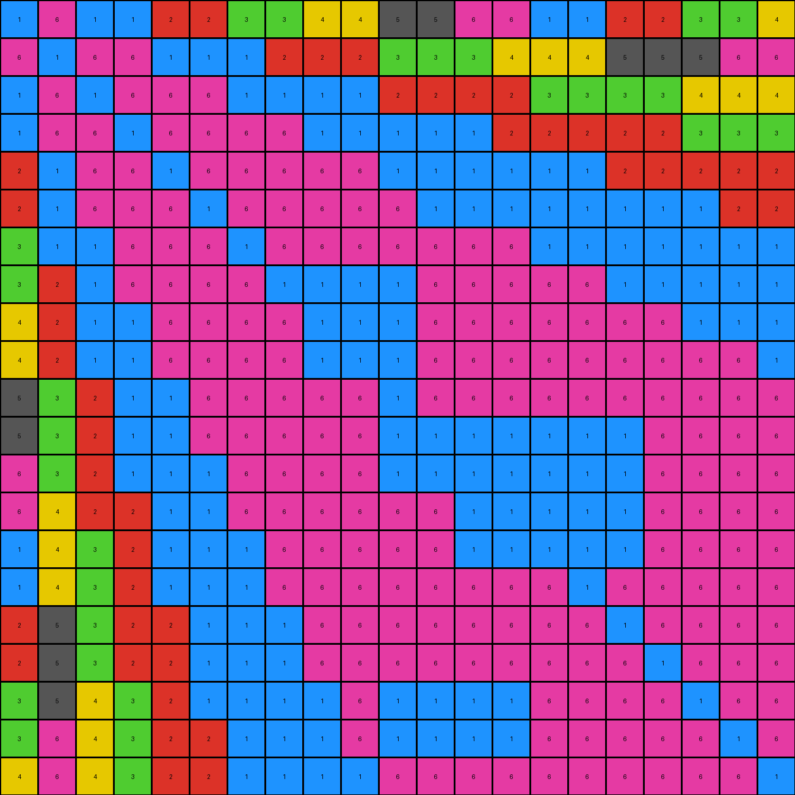
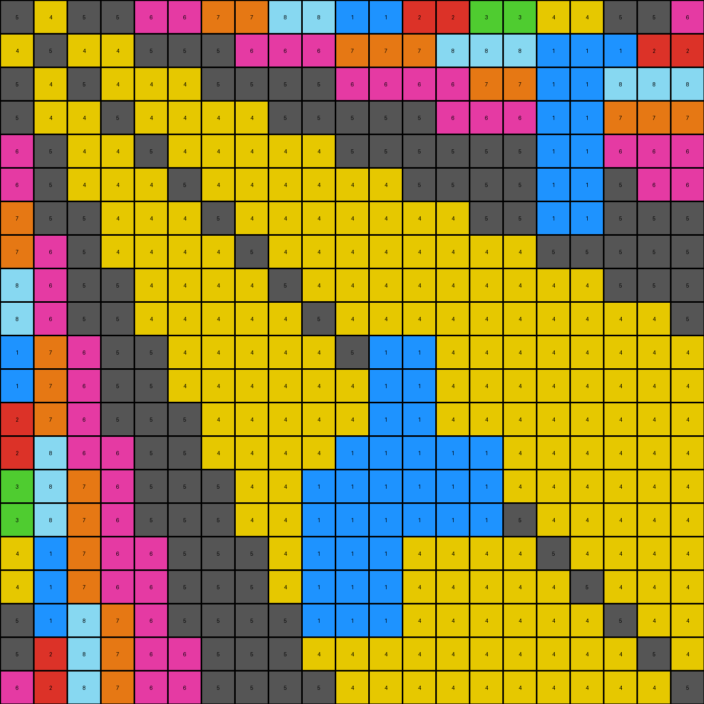

# 73251a56 • 005 • refine_dreamer

---

Previous Code:
```python
"""
1. Identify Colored Regions: Find all contiguous blocks of non-white pixels. These form the boundaries of potential shapes.
2. Identify White Regions: Locate all groups of connected white (0) pixels.
3. Determine Enclosure: For each `white_region`,
    - Inspect the neighbors of each white pixel.
    - If all neighbors are either the same white pixel or a boundary of non-white, and has at least one non-white neighbor, it is determined to be enclosed by a colored region.
4. Remove Enclosed White Regions: Change the color value of all pixels in enclosed white regions to 1 (blue) to match training output examples.
5. Retain Other Pixels: All other pixels (non-white and white pixels not part of enclosed regions) remain unchanged.
"""

import numpy as np

def get_neighbors(grid, row, col):
    """
    Get the neighbors of a cell (including diagonals).
    """
    rows, cols = grid.shape
    neighbors = []
    for i in range(max(0, row - 1), min(rows, row + 2)):
        for j in range(max(0, col - 1), min(cols, col + 2)):
            if (i, j) != (row, col):
                neighbors.append((i,j))
    return neighbors

def is_enclosed(grid, row, col, visited):
    """
    Check if a white region is fully enclosed by non-white pixels using flood fill.
    """
    rows, cols = grid.shape
    stack = [(row, col)]
    enclosed = True
    visited.add((row, col))

    while stack:
        r, c = stack.pop()
        neighbors = get_neighbors(grid, r, c)
        for nr, nc in neighbors:
            if grid[nr, nc] == 0 and (nr, nc) not in visited:
                visited.add((nr, nc))
                stack.append((nr, nc))
            elif grid[nr,nc] == 0 and (nr,nc) in visited:
              continue
            elif grid[nr, nc] != 0:
                continue

    return enclosed

def transform(input_grid):
    """
    Transforms the input grid by removing white pixels that are part of enclosed shapes.
    """
    output_grid = np.copy(input_grid)
    rows, cols = input_grid.shape
    visited = set()

     # Iterate through each cell in the grid
    for row in range(rows):
        for col in range(cols):
            # Check if the current cell is white (0)
            if input_grid[row, col] == 0 and (row, col) not in visited:
                region_visited = set()
                if is_enclosed(input_grid, row, col, region_visited):
                    # Remove the enclosed white region
                    for r, c in region_visited:
                        output_grid[r, c] = 1  # Change to 1 to match example
                visited.update(region_visited)

    return output_grid
```

Train Set Results:

## Example 1:

Input:
```
1 6 1 1 2 2 3 3 4 4 5 5 6 6 1 1 2 2 3 3 4
6 1 6 6 1 1 1 2 2 2 3 3 3 4 4 4 5 5 5 6 6
1 6 1 6 6 6 1 1 1 1 2 2 2 2 3 3 3 3 4 4 4
1 6 6 1 6 6 6 6 1 1 1 1 1 2 2 2 2 2 3 3 3
2 1 6 6 1 6 6 6 6 6 1 0 0 0 1 1 2 2 2 2 2
2 1 6 6 6 1 6 6 6 6 6 0 0 0 1 1 1 1 1 2 2
3 1 1 6 6 6 1 6 6 6 6 6 6 6 1 1 1 1 1 1 1
3 2 1 6 6 6 6 1 0 0 0 6 6 6 6 6 1 1 1 1 1
4 2 1 1 6 6 6 6 0 0 0 6 6 6 6 6 6 6 1 1 1
4 2 1 1 6 6 6 6 0 0 0 6 6 6 6 6 6 6 6 6 1
5 3 2 1 1 6 6 6 6 6 1 6 6 6 6 6 6 6 6 6 6
5 3 2 1 1 6 6 6 6 6 0 0 0 0 0 0 0 6 6 6 6
6 3 2 1 1 1 6 6 6 6 0 0 0 0 0 0 0 6 6 6 6
6 4 2 2 1 1 6 6 6 6 6 6 0 0 0 0 0 6 6 6 6
1 4 3 2 1 1 1 6 6 6 6 6 0 0 0 0 0 6 6 6 6
1 4 3 2 1 1 1 6 6 6 6 6 6 6 6 1 6 6 6 6 6
2 5 3 2 2 1 1 1 6 6 6 6 6 6 6 6 1 6 6 6 6
2 5 3 2 2 1 1 1 6 6 6 6 6 6 6 6 6 1 6 6 6
3 5 4 3 2 1 1 1 1 6 0 0 0 0 6 6 6 6 1 6 6
3 6 4 3 2 2 1 1 1 6 0 0 0 0 6 6 6 6 6 1 6
4 6 4 3 2 2 1 1 1 1 6 6 6 6 6 6 6 6 6 6 1
```
Expected Output:
```
1 6 1 1 2 2 3 3 4 4 5 5 6 6 1 1 2 2 3 3 4
6 1 6 6 1 1 1 2 2 2 3 3 3 4 4 4 5 5 5 6 6
1 6 1 6 6 6 1 1 1 1 2 2 2 2 3 3 3 3 4 4 4
1 6 6 1 6 6 6 6 1 1 1 1 1 2 2 2 2 2 3 3 3
2 1 6 6 1 6 6 6 6 6 1 1 1 1 1 1 2 2 2 2 2
2 1 6 6 6 1 6 6 6 6 6 6 1 1 1 1 1 1 1 2 2
3 1 1 6 6 6 1 6 6 6 6 6 6 6 1 1 1 1 1 1 1
3 2 1 6 6 6 6 1 6 6 6 6 6 6 6 6 1 1 1 1 1
4 2 1 1 6 6 6 6 1 6 6 6 6 6 6 6 6 6 1 1 1
4 2 1 1 6 6 6 6 6 1 6 6 6 6 6 6 6 6 6 6 1
5 3 2 1 1 6 6 6 6 6 1 6 6 6 6 6 6 6 6 6 6
5 3 2 1 1 6 6 6 6 6 6 1 6 6 6 6 6 6 6 6 6
6 3 2 1 1 1 6 6 6 6 6 6 1 6 6 6 6 6 6 6 6
6 4 2 2 1 1 6 6 6 6 6 6 6 1 6 6 6 6 6 6 6
1 4 3 2 1 1 1 6 6 6 6 6 6 6 1 6 6 6 6 6 6
1 4 3 2 1 1 1 6 6 6 6 6 6 6 6 1 6 6 6 6 6
2 5 3 2 2 1 1 1 6 6 6 6 6 6 6 6 1 6 6 6 6
2 5 3 2 2 1 1 1 6 6 6 6 6 6 6 6 6 1 6 6 6
3 5 4 3 2 1 1 1 1 6 6 6 6 6 6 6 6 6 1 6 6
3 6 4 3 2 2 1 1 1 6 6 6 6 6 6 6 6 6 6 1 6
4 6 4 3 2 2 1 1 1 1 6 6 6 6 6 6 6 6 6 6 1
```
Transformed Output:
```
1 6 1 1 2 2 3 3 4 4 5 5 6 6 1 1 2 2 3 3 4
6 1 6 6 1 1 1 2 2 2 3 3 3 4 4 4 5 5 5 6 6
1 6 1 6 6 6 1 1 1 1 2 2 2 2 3 3 3 3 4 4 4
1 6 6 1 6 6 6 6 1 1 1 1 1 2 2 2 2 2 3 3 3
2 1 6 6 1 6 6 6 6 6 1 1 1 1 1 1 2 2 2 2 2
2 1 6 6 6 1 6 6 6 6 6 1 1 1 1 1 1 1 1 2 2
3 1 1 6 6 6 1 6 6 6 6 6 6 6 1 1 1 1 1 1 1
3 2 1 6 6 6 6 1 1 1 1 6 6 6 6 6 1 1 1 1 1
4 2 1 1 6 6 6 6 1 1 1 6 6 6 6 6 6 6 1 1 1
4 2 1 1 6 6 6 6 1 1 1 6 6 6 6 6 6 6 6 6 1
5 3 2 1 1 6 6 6 6 6 1 6 6 6 6 6 6 6 6 6 6
5 3 2 1 1 6 6 6 6 6 1 1 1 1 1 1 1 6 6 6 6
6 3 2 1 1 1 6 6 6 6 1 1 1 1 1 1 1 6 6 6 6
6 4 2 2 1 1 6 6 6 6 6 6 1 1 1 1 1 6 6 6 6
1 4 3 2 1 1 1 6 6 6 6 6 1 1 1 1 1 6 6 6 6
1 4 3 2 1 1 1 6 6 6 6 6 6 6 6 1 6 6 6 6 6
2 5 3 2 2 1 1 1 6 6 6 6 6 6 6 6 1 6 6 6 6
2 5 3 2 2 1 1 1 6 6 6 6 6 6 6 6 6 1 6 6 6
3 5 4 3 2 1 1 1 1 6 1 1 1 1 6 6 6 6 1 6 6
3 6 4 3 2 2 1 1 1 6 1 1 1 1 6 6 6 6 6 1 6
4 6 4 3 2 2 1 1 1 1 6 6 6 6 6 6 6 6 6 6 1
```

match: False
pixels_off: 36
size_correct: True
color_palette_correct: True
correct_pixel_counts: False

## Example 2:

Input:
```
6 5 6 6 7 7 1 1 2 2 3 3 4 4 5 5 6 6 7 7 1
5 6 5 5 6 6 6 7 7 7 1 1 1 2 2 2 3 3 3 4 4
6 5 6 5 5 5 6 6 6 6 7 7 7 7 1 1 1 1 2 2 2
6 5 5 0 0 0 5 5 6 6 6 6 6 7 7 7 7 7 1 1 1
7 6 5 0 0 0 5 5 5 5 6 6 6 6 6 6 7 7 7 7 7
7 6 5 0 0 0 5 5 5 5 5 5 6 6 6 6 6 6 6 7 7
1 6 6 0 0 0 6 5 5 0 0 0 5 5 6 6 6 6 6 6 6
1 7 6 0 0 0 5 6 5 0 0 0 5 5 5 5 6 6 6 6 6
2 7 6 6 5 5 5 5 6 0 0 0 0 0 0 0 0 5 6 6 6
2 7 6 6 5 5 5 5 5 6 5 5 0 0 0 0 0 5 5 5 6
3 1 7 6 6 5 5 5 5 5 6 5 5 5 5 5 5 5 5 5 5
3 1 7 6 6 5 5 5 5 5 5 6 5 5 5 5 5 5 5 5 5
4 1 7 6 6 6 5 5 5 5 5 5 6 5 5 5 5 5 5 5 5
4 2 7 7 6 6 5 5 5 5 5 5 5 6 5 5 5 5 5 5 5
5 2 0 0 0 0 6 5 5 5 5 5 5 5 6 5 5 5 5 5 5
5 2 0 0 0 0 6 5 5 5 5 5 5 5 5 6 5 5 5 5 5
6 3 1 7 7 6 6 6 5 5 5 5 5 5 5 5 6 5 5 5 5
6 3 1 7 7 6 6 6 0 0 0 0 5 5 5 5 5 6 5 5 5
7 3 2 1 7 6 6 6 0 0 0 0 5 5 5 5 5 5 6 5 5
7 4 2 1 7 7 6 6 6 5 5 5 5 5 5 5 5 5 5 6 5
1 4 2 1 7 7 6 6 6 6 5 5 5 5 5 5 5 5 5 5 6
```
Expected Output:
```
6 5 6 6 7 7 1 1 2 2 3 3 4 4 5 5 6 6 7 7 1
5 6 5 5 6 6 6 7 7 7 1 1 1 2 2 2 3 3 3 4 4
6 5 6 5 5 5 6 6 6 6 7 7 7 7 1 1 1 1 2 2 2
6 5 5 6 5 5 5 5 6 6 6 6 6 7 7 7 7 7 1 1 1
7 6 5 5 6 5 5 5 5 5 6 6 6 6 6 6 7 7 7 7 7
7 6 5 5 5 6 5 5 5 5 5 5 6 6 6 6 6 6 6 7 7
1 6 6 5 5 5 6 5 5 5 5 5 5 5 6 6 6 6 6 6 6
1 7 6 5 5 5 5 6 5 5 5 5 5 5 5 5 6 6 6 6 6
2 7 6 6 5 5 5 5 6 5 5 5 5 5 5 5 5 5 6 6 6
2 7 6 6 5 5 5 5 5 6 5 5 5 5 5 5 5 5 5 5 6
3 1 7 6 6 5 5 5 5 5 6 5 5 5 5 5 5 5 5 5 5
3 1 7 6 6 5 5 5 5 5 5 6 5 5 5 5 5 5 5 5 5
4 1 7 6 6 6 5 5 5 5 5 5 6 5 5 5 5 5 5 5 5
4 2 7 7 6 6 5 5 5 5 5 5 5 6 5 5 5 5 5 5 5
5 2 1 7 6 6 6 5 5 5 5 5 5 5 6 5 5 5 5 5 5
5 2 1 7 6 6 6 5 5 5 5 5 5 5 5 6 5 5 5 5 5
6 3 1 7 7 6 6 6 5 5 5 5 5 5 5 5 6 5 5 5 5
6 3 1 7 7 6 6 6 5 5 5 5 5 5 5 5 5 6 5 5 5
7 3 2 1 7 6 6 6 6 5 5 5 5 5 5 5 5 5 6 5 5
7 4 2 1 7 7 6 6 6 5 5 5 5 5 5 5 5 5 5 6 5
1 4 2 1 7 7 6 6 6 6 5 5 5 5 5 5 5 5 5 5 6
```
Transformed Output:
```
6 5 6 6 7 7 1 1 2 2 3 3 4 4 5 5 6 6 7 7 1
5 6 5 5 6 6 6 7 7 7 1 1 1 2 2 2 3 3 3 4 4
6 5 6 5 5 5 6 6 6 6 7 7 7 7 1 1 1 1 2 2 2
6 5 5 1 1 1 5 5 6 6 6 6 6 7 7 7 7 7 1 1 1
7 6 5 1 1 1 5 5 5 5 6 6 6 6 6 6 7 7 7 7 7
7 6 5 1 1 1 5 5 5 5 5 5 6 6 6 6 6 6 6 7 7
1 6 6 1 1 1 6 5 5 1 1 1 5 5 6 6 6 6 6 6 6
1 7 6 1 1 1 5 6 5 1 1 1 5 5 5 5 6 6 6 6 6
2 7 6 6 5 5 5 5 6 1 1 1 1 1 1 1 1 5 6 6 6
2 7 6 6 5 5 5 5 5 6 5 5 1 1 1 1 1 5 5 5 6
3 1 7 6 6 5 5 5 5 5 6 5 5 5 5 5 5 5 5 5 5
3 1 7 6 6 5 5 5 5 5 5 6 5 5 5 5 5 5 5 5 5
4 1 7 6 6 6 5 5 5 5 5 5 6 5 5 5 5 5 5 5 5
4 2 7 7 6 6 5 5 5 5 5 5 5 6 5 5 5 5 5 5 5
5 2 1 1 1 1 6 5 5 5 5 5 5 5 6 5 5 5 5 5 5
5 2 1 1 1 1 6 5 5 5 5 5 5 5 5 6 5 5 5 5 5
6 3 1 7 7 6 6 6 5 5 5 5 5 5 5 5 6 5 5 5 5
6 3 1 7 7 6 6 6 1 1 1 1 5 5 5 5 5 6 5 5 5
7 3 2 1 7 6 6 6 1 1 1 1 5 5 5 5 5 5 6 5 5
7 4 2 1 7 7 6 6 6 5 5 5 5 5 5 5 5 5 5 6 5
1 4 2 1 7 7 6 6 6 6 5 5 5 5 5 5 5 5 5 5 6
```

match: False
pixels_off: 48
size_correct: True
color_palette_correct: True
correct_pixel_counts: False

## Example 3:

Input:
```
5 4 5 5 6 6 7 7 8 8 1 1 2 2 3 3 4 4 5 5 6
4 5 4 4 5 5 5 6 6 6 7 7 7 8 8 8 1 1 1 2 2
5 4 5 4 4 4 5 5 5 5 6 6 6 6 7 7 0 0 8 8 8
5 4 4 5 4 4 4 4 5 5 5 5 5 6 6 6 0 0 7 7 7
6 5 4 4 5 4 4 4 4 4 5 5 5 5 5 5 0 0 6 6 6
6 5 4 4 4 5 4 4 4 4 4 4 5 5 5 5 0 0 5 6 6
7 5 5 4 4 4 5 4 4 4 4 4 4 4 5 5 0 0 5 5 5
7 6 5 4 4 4 4 5 4 4 4 4 4 4 4 4 5 5 5 5 5
8 6 5 5 4 4 4 4 5 4 4 4 4 4 4 4 4 4 5 5 5
8 6 5 5 4 4 4 4 4 5 4 4 4 4 4 4 4 4 4 4 5
1 7 6 5 5 4 4 4 4 4 5 0 0 4 4 4 4 4 4 4 4
1 7 6 5 5 4 4 4 4 4 4 0 0 4 4 4 4 4 4 4 4
2 7 6 5 5 5 4 4 4 4 4 0 0 4 4 4 4 4 4 4 4
2 8 6 6 5 5 4 4 4 4 0 0 0 0 0 4 4 4 4 4 4
3 8 7 6 5 5 5 4 4 0 0 0 0 0 0 4 4 4 4 4 4
3 8 7 6 5 5 5 4 4 0 0 0 0 0 0 5 4 4 4 4 4
4 1 7 6 6 5 5 5 4 0 0 0 4 4 4 4 5 4 4 4 4
4 1 7 6 6 5 5 5 4 0 0 0 4 4 4 4 4 5 4 4 4
5 1 8 7 6 5 5 5 5 0 0 0 4 4 4 4 4 4 5 4 4
5 2 8 7 6 6 5 5 5 4 4 4 4 4 4 4 4 4 4 5 4
6 2 8 7 6 6 5 5 5 5 4 4 4 4 4 4 4 4 4 4 5
```
Expected Output:
```
5 4 5 5 6 6 7 7 8 8 1 1 2 2 3 3 4 4 5 5 6
4 5 4 4 5 5 5 6 6 6 7 7 7 8 8 8 1 1 1 2 2
5 4 5 4 4 4 5 5 5 5 6 6 6 6 7 7 7 7 8 8 8
5 4 4 5 4 4 4 4 5 5 5 5 5 6 6 6 6 6 7 7 7
6 5 4 4 5 4 4 4 4 4 5 5 5 5 5 5 6 6 6 6 6
6 5 4 4 4 5 4 4 4 4 4 4 5 5 5 5 5 5 5 6 6
7 5 5 4 4 4 5 4 4 4 4 4 4 4 5 5 5 5 5 5 5
7 6 5 4 4 4 4 5 4 4 4 4 4 4 4 4 5 5 5 5 5
8 6 5 5 4 4 4 4 5 4 4 4 4 4 4 4 4 4 5 5 5
8 6 5 5 4 4 4 4 4 5 4 4 4 4 4 4 4 4 4 4 5
1 7 6 5 5 4 4 4 4 4 5 4 4 4 4 4 4 4 4 4 4
1 7 6 5 5 4 4 4 4 4 4 5 4 4 4 4 4 4 4 4 4
2 7 6 5 5 5 4 4 4 4 4 4 5 4 4 4 4 4 4 4 4
2 8 6 6 5 5 4 4 4 4 4 4 4 5 4 4 4 4 4 4 4
3 8 7 6 5 5 5 4 4 4 4 4 4 4 5 4 4 4 4 4 4
3 8 7 6 5 5 5 4 4 4 4 4 4 4 4 5 4 4 4 4 4
4 1 7 6 6 5 5 5 4 4 4 4 4 4 4 4 5 4 4 4 4
4 1 7 6 6 5 5 5 4 4 4 4 4 4 4 4 4 5 4 4 4
5 1 8 7 6 5 5 5 5 4 4 4 4 4 4 4 4 4 5 4 4
5 2 8 7 6 6 5 5 5 4 4 4 4 4 4 4 4 4 4 5 4
6 2 8 7 6 6 5 5 5 5 4 4 4 4 4 4 4 4 4 4 5
```
Transformed Output:
```
5 4 5 5 6 6 7 7 8 8 1 1 2 2 3 3 4 4 5 5 6
4 5 4 4 5 5 5 6 6 6 7 7 7 8 8 8 1 1 1 2 2
5 4 5 4 4 4 5 5 5 5 6 6 6 6 7 7 1 1 8 8 8
5 4 4 5 4 4 4 4 5 5 5 5 5 6 6 6 1 1 7 7 7
6 5 4 4 5 4 4 4 4 4 5 5 5 5 5 5 1 1 6 6 6
6 5 4 4 4 5 4 4 4 4 4 4 5 5 5 5 1 1 5 6 6
7 5 5 4 4 4 5 4 4 4 4 4 4 4 5 5 1 1 5 5 5
7 6 5 4 4 4 4 5 4 4 4 4 4 4 4 4 5 5 5 5 5
8 6 5 5 4 4 4 4 5 4 4 4 4 4 4 4 4 4 5 5 5
8 6 5 5 4 4 4 4 4 5 4 4 4 4 4 4 4 4 4 4 5
1 7 6 5 5 4 4 4 4 4 5 1 1 4 4 4 4 4 4 4 4
1 7 6 5 5 4 4 4 4 4 4 1 1 4 4 4 4 4 4 4 4
2 7 6 5 5 5 4 4 4 4 4 1 1 4 4 4 4 4 4 4 4
2 8 6 6 5 5 4 4 4 4 1 1 1 1 1 4 4 4 4 4 4
3 8 7 6 5 5 5 4 4 1 1 1 1 1 1 4 4 4 4 4 4
3 8 7 6 5 5 5 4 4 1 1 1 1 1 1 5 4 4 4 4 4
4 1 7 6 6 5 5 5 4 1 1 1 4 4 4 4 5 4 4 4 4
4 1 7 6 6 5 5 5 4 1 1 1 4 4 4 4 4 5 4 4 4
5 1 8 7 6 5 5 5 5 1 1 1 4 4 4 4 4 4 5 4 4
5 2 8 7 6 6 5 5 5 4 4 4 4 4 4 4 4 4 4 5 4
6 2 8 7 6 6 5 5 5 5 4 4 4 4 4 4 4 4 4 4 5
```

match: False
pixels_off: 42
size_correct: True
color_palette_correct: True
correct_pixel_counts: False
**INSTRUCTIONS**

The code above was generated based on observations from the first training
example

we have tested the transform function on each of the task example inputs and
compared with the expected output

review each of the examples provided and the results and consider how the
natural language program should be updated to accommodate this new knowledge

respond with the following deliverables:

- general assessment of the information provided and strategy for resolving the
  errors
- gather metrics about each of the examples and results - use code_execution to
  develop accurate reports on your assumptions
- a YAML block documenting facts - Focus on identifying objects, their properties, and the actions performed on them.
- a natural language program - Be as clear and concise as possible, providing a complete description of the transformation rule.


your responses should be considered as information in a report - not a
conversation
