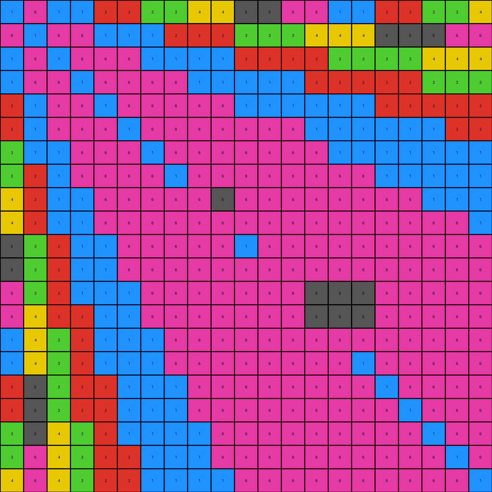
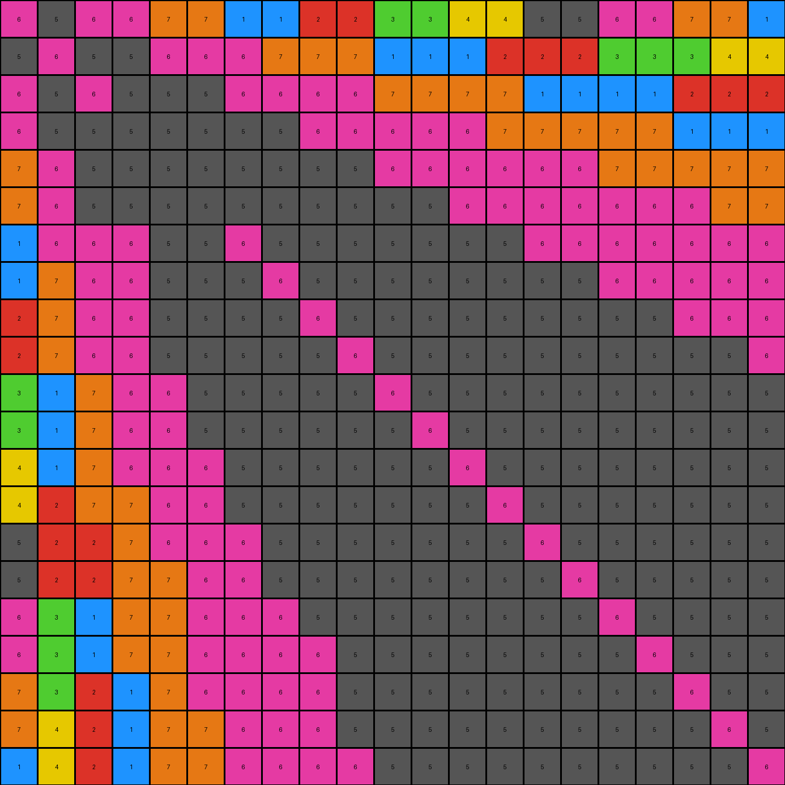

# 73251a56 • 009 • refine_dreamer

---

Previous Code:
```python
"""
Identifies and removes contiguous regions of black pixels (value 0) in the input grid, replacing them with gray (value 5), while preserving other pixels.
"""

import numpy as np
from scipy.ndimage import label

def get_neighboring_color(grid, r, c):
    """
    Finds the most frequent neighboring color around a given pixel, excluding black (0).
    """
    neighbors = []
    rows, cols = grid.shape
    for i in range(max(0, r - 1), min(rows, r + 2)):
        for j in range(max(0, c - 1), min(cols, c + 2)):
            if (i != r or j != c) and grid[i, j] != 0:  # Exclude the pixel itself and black pixels
                neighbors.append(grid[i, j])

    if not neighbors:
      return 5
      
    # return most common neighbor
    return max(set(neighbors), key=neighbors.count)

def transform(input_grid):
    """
    Transforms the input grid by removing black regions and replacing them with gray (value 5).

    Args:
        input_grid: A 2D numpy array representing the input grid.

    Returns:
        A 2D numpy array representing the transformed output grid.
    """
    # Initialize the output grid as a copy of the input grid.
    output_grid = np.copy(input_grid)
    rows, cols = input_grid.shape

    # 1. Identify Black Regions: Use scipy.ndimage.label to find connected components.
    labeled_grid, num_labels = label(input_grid == 0)

    # 2. & 3. Replace Black Regions with the surrounding color.
    for r in range(rows):
        for c in range(cols):
            if labeled_grid[r, c] != 0:  # If the pixel is part of a black region
                output_grid[r,c] = get_neighboring_color(input_grid,r,c)

    # 4. Preserve Other Pixels (already handled by initializing output_grid as a copy).
    return output_grid
```

Train Set Results:

## Example 1:

Input:
```
1 6 1 1 2 2 3 3 4 4 5 5 6 6 1 1 2 2 3 3 4
6 1 6 6 1 1 1 2 2 2 3 3 3 4 4 4 5 5 5 6 6
1 6 1 6 6 6 1 1 1 1 2 2 2 2 3 3 3 3 4 4 4
1 6 6 1 6 6 6 6 1 1 1 1 1 2 2 2 2 2 3 3 3
2 1 6 6 1 6 6 6 6 6 1 0 0 0 1 1 2 2 2 2 2
2 1 6 6 6 1 6 6 6 6 6 0 0 0 1 1 1 1 1 2 2
3 1 1 6 6 6 1 6 6 6 6 6 6 6 1 1 1 1 1 1 1
3 2 1 6 6 6 6 1 0 0 0 6 6 6 6 6 1 1 1 1 1
4 2 1 1 6 6 6 6 0 0 0 6 6 6 6 6 6 6 1 1 1
4 2 1 1 6 6 6 6 0 0 0 6 6 6 6 6 6 6 6 6 1
5 3 2 1 1 6 6 6 6 6 1 6 6 6 6 6 6 6 6 6 6
5 3 2 1 1 6 6 6 6 6 0 0 0 0 0 0 0 6 6 6 6
6 3 2 1 1 1 6 6 6 6 0 0 0 0 0 0 0 6 6 6 6
6 4 2 2 1 1 6 6 6 6 6 6 0 0 0 0 0 6 6 6 6
1 4 3 2 1 1 1 6 6 6 6 6 0 0 0 0 0 6 6 6 6
1 4 3 2 1 1 1 6 6 6 6 6 6 6 6 1 6 6 6 6 6
2 5 3 2 2 1 1 1 6 6 6 6 6 6 6 6 1 6 6 6 6
2 5 3 2 2 1 1 1 6 6 6 6 6 6 6 6 6 1 6 6 6
3 5 4 3 2 1 1 1 1 6 0 0 0 0 6 6 6 6 1 6 6
3 6 4 3 2 2 1 1 1 6 0 0 0 0 6 6 6 6 6 1 6
4 6 4 3 2 2 1 1 1 1 6 6 6 6 6 6 6 6 6 6 1
```
Expected Output:
```
1 6 1 1 2 2 3 3 4 4 5 5 6 6 1 1 2 2 3 3 4
6 1 6 6 1 1 1 2 2 2 3 3 3 4 4 4 5 5 5 6 6
1 6 1 6 6 6 1 1 1 1 2 2 2 2 3 3 3 3 4 4 4
1 6 6 1 6 6 6 6 1 1 1 1 1 2 2 2 2 2 3 3 3
2 1 6 6 1 6 6 6 6 6 1 1 1 1 1 1 2 2 2 2 2
2 1 6 6 6 1 6 6 6 6 6 6 1 1 1 1 1 1 1 2 2
3 1 1 6 6 6 1 6 6 6 6 6 6 6 1 1 1 1 1 1 1
3 2 1 6 6 6 6 1 6 6 6 6 6 6 6 6 1 1 1 1 1
4 2 1 1 6 6 6 6 1 6 6 6 6 6 6 6 6 6 1 1 1
4 2 1 1 6 6 6 6 6 1 6 6 6 6 6 6 6 6 6 6 1
5 3 2 1 1 6 6 6 6 6 1 6 6 6 6 6 6 6 6 6 6
5 3 2 1 1 6 6 6 6 6 6 1 6 6 6 6 6 6 6 6 6
6 3 2 1 1 1 6 6 6 6 6 6 1 6 6 6 6 6 6 6 6
6 4 2 2 1 1 6 6 6 6 6 6 6 1 6 6 6 6 6 6 6
1 4 3 2 1 1 1 6 6 6 6 6 6 6 1 6 6 6 6 6 6
1 4 3 2 1 1 1 6 6 6 6 6 6 6 6 1 6 6 6 6 6
2 5 3 2 2 1 1 1 6 6 6 6 6 6 6 6 1 6 6 6 6
2 5 3 2 2 1 1 1 6 6 6 6 6 6 6 6 6 1 6 6 6
3 5 4 3 2 1 1 1 1 6 6 6 6 6 6 6 6 6 1 6 6
3 6 4 3 2 2 1 1 1 6 6 6 6 6 6 6 6 6 6 1 6
4 6 4 3 2 2 1 1 1 1 6 6 6 6 6 6 6 6 6 6 1
```
Transformed Output:
```
1 6 1 1 2 2 3 3 4 4 5 5 6 6 1 1 2 2 3 3 4
6 1 6 6 1 1 1 2 2 2 3 3 3 4 4 4 5 5 5 6 6
1 6 1 6 6 6 1 1 1 1 2 2 2 2 3 3 3 3 4 4 4
1 6 6 1 6 6 6 6 1 1 1 1 1 2 2 2 2 2 3 3 3
2 1 6 6 1 6 6 6 6 6 1 1 1 1 1 1 2 2 2 2 2
2 1 6 6 6 1 6 6 6 6 6 6 6 1 1 1 1 1 1 2 2
3 1 1 6 6 6 1 6 6 6 6 6 6 6 1 1 1 1 1 1 1
3 2 1 6 6 6 6 1 6 6 6 6 6 6 6 6 1 1 1 1 1
4 2 1 1 6 6 6 6 6 5 6 6 6 6 6 6 6 6 1 1 1
4 2 1 1 6 6 6 6 6 6 6 6 6 6 6 6 6 6 6 6 1
5 3 2 1 1 6 6 6 6 6 1 6 6 6 6 6 6 6 6 6 6
5 3 2 1 1 6 6 6 6 6 6 6 6 6 6 6 6 6 6 6 6
6 3 2 1 1 1 6 6 6 6 6 6 6 5 5 5 6 6 6 6 6
6 4 2 2 1 1 6 6 6 6 6 6 6 5 5 5 6 6 6 6 6
1 4 3 2 1 1 1 6 6 6 6 6 6 6 6 6 6 6 6 6 6
1 4 3 2 1 1 1 6 6 6 6 6 6 6 6 1 6 6 6 6 6
2 5 3 2 2 1 1 1 6 6 6 6 6 6 6 6 1 6 6 6 6
2 5 3 2 2 1 1 1 6 6 6 6 6 6 6 6 6 1 6 6 6
3 5 4 3 2 1 1 1 1 6 6 6 6 6 6 6 6 6 1 6 6
3 6 4 3 2 2 1 1 1 6 6 6 6 6 6 6 6 6 6 1 6
4 6 4 3 2 2 1 1 1 1 6 6 6 6 6 6 6 6 6 6 1
```

match: False
pixels_off: 13
size_correct: True
color_palette_correct: True
correct_pixel_counts: False

## Example 2:

Input:
```
6 5 6 6 7 7 1 1 2 2 3 3 4 4 5 5 6 6 7 7 1
5 6 5 5 6 6 6 7 7 7 1 1 1 2 2 2 3 3 3 4 4
6 5 6 5 5 5 6 6 6 6 7 7 7 7 1 1 1 1 2 2 2
6 5 5 0 0 0 5 5 6 6 6 6 6 7 7 7 7 7 1 1 1
7 6 5 0 0 0 5 5 5 5 6 6 6 6 6 6 7 7 7 7 7
7 6 5 0 0 0 5 5 5 5 5 5 6 6 6 6 6 6 6 7 7
1 6 6 0 0 0 6 5 5 0 0 0 5 5 6 6 6 6 6 6 6
1 7 6 0 0 0 5 6 5 0 0 0 5 5 5 5 6 6 6 6 6
2 7 6 6 5 5 5 5 6 0 0 0 0 0 0 0 0 5 6 6 6
2 7 6 6 5 5 5 5 5 6 5 5 0 0 0 0 0 5 5 5 6
3 1 7 6 6 5 5 5 5 5 6 5 5 5 5 5 5 5 5 5 5
3 1 7 6 6 5 5 5 5 5 5 6 5 5 5 5 5 5 5 5 5
4 1 7 6 6 6 5 5 5 5 5 5 6 5 5 5 5 5 5 5 5
4 2 7 7 6 6 5 5 5 5 5 5 5 6 5 5 5 5 5 5 5
5 2 0 0 0 0 6 5 5 5 5 5 5 5 6 5 5 5 5 5 5
5 2 0 0 0 0 6 5 5 5 5 5 5 5 5 6 5 5 5 5 5
6 3 1 7 7 6 6 6 5 5 5 5 5 5 5 5 6 5 5 5 5
6 3 1 7 7 6 6 6 0 0 0 0 5 5 5 5 5 6 5 5 5
7 3 2 1 7 6 6 6 0 0 0 0 5 5 5 5 5 5 6 5 5
7 4 2 1 7 7 6 6 6 5 5 5 5 5 5 5 5 5 5 6 5
1 4 2 1 7 7 6 6 6 6 5 5 5 5 5 5 5 5 5 5 6
```
Expected Output:
```
6 5 6 6 7 7 1 1 2 2 3 3 4 4 5 5 6 6 7 7 1
5 6 5 5 6 6 6 7 7 7 1 1 1 2 2 2 3 3 3 4 4
6 5 6 5 5 5 6 6 6 6 7 7 7 7 1 1 1 1 2 2 2
6 5 5 6 5 5 5 5 6 6 6 6 6 7 7 7 7 7 1 1 1
7 6 5 5 6 5 5 5 5 5 6 6 6 6 6 6 7 7 7 7 7
7 6 5 5 5 6 5 5 5 5 5 5 6 6 6 6 6 6 6 7 7
1 6 6 5 5 5 6 5 5 5 5 5 5 5 6 6 6 6 6 6 6
1 7 6 5 5 5 5 6 5 5 5 5 5 5 5 5 6 6 6 6 6
2 7 6 6 5 5 5 5 6 5 5 5 5 5 5 5 5 5 6 6 6
2 7 6 6 5 5 5 5 5 6 5 5 5 5 5 5 5 5 5 5 6
3 1 7 6 6 5 5 5 5 5 6 5 5 5 5 5 5 5 5 5 5
3 1 7 6 6 5 5 5 5 5 5 6 5 5 5 5 5 5 5 5 5
4 1 7 6 6 6 5 5 5 5 5 5 6 5 5 5 5 5 5 5 5
4 2 7 7 6 6 5 5 5 5 5 5 5 6 5 5 5 5 5 5 5
5 2 1 7 6 6 6 5 5 5 5 5 5 5 6 5 5 5 5 5 5
5 2 1 7 6 6 6 5 5 5 5 5 5 5 5 6 5 5 5 5 5
6 3 1 7 7 6 6 6 5 5 5 5 5 5 5 5 6 5 5 5 5
6 3 1 7 7 6 6 6 5 5 5 5 5 5 5 5 5 6 5 5 5
7 3 2 1 7 6 6 6 6 5 5 5 5 5 5 5 5 5 6 5 5
7 4 2 1 7 7 6 6 6 5 5 5 5 5 5 5 5 5 5 6 5
1 4 2 1 7 7 6 6 6 6 5 5 5 5 5 5 5 5 5 5 6
```
Transformed Output:
```
6 5 6 6 7 7 1 1 2 2 3 3 4 4 5 5 6 6 7 7 1
5 6 5 5 6 6 6 7 7 7 1 1 1 2 2 2 3 3 3 4 4
6 5 6 5 5 5 6 6 6 6 7 7 7 7 1 1 1 1 2 2 2
6 5 5 5 5 5 5 5 6 6 6 6 6 7 7 7 7 7 1 1 1
7 6 5 5 5 5 5 5 5 5 6 6 6 6 6 6 7 7 7 7 7
7 6 5 5 5 5 5 5 5 5 5 5 6 6 6 6 6 6 6 7 7
1 6 6 6 5 5 6 5 5 5 5 5 5 5 6 6 6 6 6 6 6
1 7 6 6 5 5 5 6 5 5 5 5 5 5 5 5 6 6 6 6 6
2 7 6 6 5 5 5 5 6 5 5 5 5 5 5 5 5 5 6 6 6
2 7 6 6 5 5 5 5 5 6 5 5 5 5 5 5 5 5 5 5 6
3 1 7 6 6 5 5 5 5 5 6 5 5 5 5 5 5 5 5 5 5
3 1 7 6 6 5 5 5 5 5 5 6 5 5 5 5 5 5 5 5 5
4 1 7 6 6 6 5 5 5 5 5 5 6 5 5 5 5 5 5 5 5
4 2 7 7 6 6 5 5 5 5 5 5 5 6 5 5 5 5 5 5 5
5 2 2 7 6 6 6 5 5 5 5 5 5 5 6 5 5 5 5 5 5
5 2 2 7 7 6 6 5 5 5 5 5 5 5 5 6 5 5 5 5 5
6 3 1 7 7 6 6 6 5 5 5 5 5 5 5 5 6 5 5 5 5
6 3 1 7 7 6 6 6 6 5 5 5 5 5 5 5 5 6 5 5 5
7 3 2 1 7 6 6 6 6 5 5 5 5 5 5 5 5 5 6 5 5
7 4 2 1 7 7 6 6 6 5 5 5 5 5 5 5 5 5 5 6 5
1 4 2 1 7 7 6 6 6 6 5 5 5 5 5 5 5 5 5 5 6
```

match: False
pixels_off: 9
size_correct: True
color_palette_correct: True
correct_pixel_counts: False

## Example 3:

Input:
```
5 4 5 5 6 6 7 7 8 8 1 1 2 2 3 3 4 4 5 5 6
4 5 4 4 5 5 5 6 6 6 7 7 7 8 8 8 1 1 1 2 2
5 4 5 4 4 4 5 5 5 5 6 6 6 6 7 7 0 0 8 8 8
5 4 4 5 4 4 4 4 5 5 5 5 5 6 6 6 0 0 7 7 7
6 5 4 4 5 4 4 4 4 4 5 5 5 5 5 5 0 0 6 6 6
6 5 4 4 4 5 4 4 4 4 4 4 5 5 5 5 0 0 5 6 6
7 5 5 4 4 4 5 4 4 4 4 4 4 4 5 5 0 0 5 5 5
7 6 5 4 4 4 4 5 4 4 4 4 4 4 4 4 5 5 5 5 5
8 6 5 5 4 4 4 4 5 4 4 4 4 4 4 4 4 4 5 5 5
8 6 5 5 4 4 4 4 4 5 4 4 4 4 4 4 4 4 4 4 5
1 7 6 5 5 4 4 4 4 4 5 0 0 4 4 4 4 4 4 4 4
1 7 6 5 5 4 4 4 4 4 4 0 0 4 4 4 4 4 4 4 4
2 7 6 5 5 5 4 4 4 4 4 0 0 4 4 4 4 4 4 4 4
2 8 6 6 5 5 4 4 4 4 0 0 0 0 0 4 4 4 4 4 4
3 8 7 6 5 5 5 4 4 0 0 0 0 0 0 4 4 4 4 4 4
3 8 7 6 5 5 5 4 4 0 0 0 0 0 0 5 4 4 4 4 4
4 1 7 6 6 5 5 5 4 0 0 0 4 4 4 4 5 4 4 4 4
4 1 7 6 6 5 5 5 4 0 0 0 4 4 4 4 4 5 4 4 4
5 1 8 7 6 5 5 5 5 0 0 0 4 4 4 4 4 4 5 4 4
5 2 8 7 6 6 5 5 5 4 4 4 4 4 4 4 4 4 4 5 4
6 2 8 7 6 6 5 5 5 5 4 4 4 4 4 4 4 4 4 4 5
```
Expected Output:
```
5 4 5 5 6 6 7 7 8 8 1 1 2 2 3 3 4 4 5 5 6
4 5 4 4 5 5 5 6 6 6 7 7 7 8 8 8 1 1 1 2 2
5 4 5 4 4 4 5 5 5 5 6 6 6 6 7 7 7 7 8 8 8
5 4 4 5 4 4 4 4 5 5 5 5 5 6 6 6 6 6 7 7 7
6 5 4 4 5 4 4 4 4 4 5 5 5 5 5 5 6 6 6 6 6
6 5 4 4 4 5 4 4 4 4 4 4 5 5 5 5 5 5 5 6 6
7 5 5 4 4 4 5 4 4 4 4 4 4 4 5 5 5 5 5 5 5
7 6 5 4 4 4 4 5 4 4 4 4 4 4 4 4 5 5 5 5 5
8 6 5 5 4 4 4 4 5 4 4 4 4 4 4 4 4 4 5 5 5
8 6 5 5 4 4 4 4 4 5 4 4 4 4 4 4 4 4 4 4 5
1 7 6 5 5 4 4 4 4 4 5 4 4 4 4 4 4 4 4 4 4
1 7 6 5 5 4 4 4 4 4 4 5 4 4 4 4 4 4 4 4 4
2 7 6 5 5 5 4 4 4 4 4 4 5 4 4 4 4 4 4 4 4
2 8 6 6 5 5 4 4 4 4 4 4 4 5 4 4 4 4 4 4 4
3 8 7 6 5 5 5 4 4 4 4 4 4 4 5 4 4 4 4 4 4
3 8 7 6 5 5 5 4 4 4 4 4 4 4 4 5 4 4 4 4 4
4 1 7 6 6 5 5 5 4 4 4 4 4 4 4 4 5 4 4 4 4
4 1 7 6 6 5 5 5 4 4 4 4 4 4 4 4 4 5 4 4 4
5 1 8 7 6 5 5 5 5 4 4 4 4 4 4 4 4 4 5 4 4
5 2 8 7 6 6 5 5 5 4 4 4 4 4 4 4 4 4 4 5 4
6 2 8 7 6 6 5 5 5 5 4 4 4 4 4 4 4 4 4 4 5
```
Transformed Output:
```
5 4 5 5 6 6 7 7 8 8 1 1 2 2 3 3 4 4 5 5 6
4 5 4 4 5 5 5 6 6 6 7 7 7 8 8 8 1 1 1 2 2
5 4 5 4 4 4 5 5 5 5 6 6 6 6 7 7 1 1 8 8 8
5 4 4 5 4 4 4 4 5 5 5 5 5 6 6 6 5 8 7 7 7
6 5 4 4 5 4 4 4 4 4 5 5 5 5 5 5 5 5 6 6 6
6 5 4 4 4 5 4 4 4 4 4 4 5 5 5 5 5 5 5 6 6
7 5 5 4 4 4 5 4 4 4 4 4 4 4 5 5 5 5 5 5 5
7 6 5 4 4 4 4 5 4 4 4 4 4 4 4 4 5 5 5 5 5
8 6 5 5 4 4 4 4 5 4 4 4 4 4 4 4 4 4 5 5 5
8 6 5 5 4 4 4 4 4 5 4 4 4 4 4 4 4 4 4 4 5
1 7 6 5 5 4 4 4 4 4 5 4 4 4 4 4 4 4 4 4 4
1 7 6 5 5 4 4 4 4 4 4 4 4 4 4 4 4 4 4 4 4
2 7 6 5 5 5 4 4 4 4 4 4 4 4 4 4 4 4 4 4 4
2 8 6 6 5 5 4 4 4 4 4 4 4 4 4 4 4 4 4 4 4
3 8 7 6 5 5 5 4 4 4 4 5 5 5 4 4 4 4 4 4 4
3 8 7 6 5 5 5 4 4 4 5 4 4 4 4 5 4 4 4 4 4
4 1 7 6 6 5 5 5 4 4 5 4 4 4 4 4 5 4 4 4 4
4 1 7 6 6 5 5 5 4 4 5 4 4 4 4 4 4 5 4 4 4
5 1 8 7 6 5 5 5 5 4 4 4 4 4 4 4 4 4 5 4 4
5 2 8 7 6 6 5 5 5 4 4 4 4 4 4 4 4 4 4 5 4
6 2 8 7 6 6 5 5 5 5 4 4 4 4 4 4 4 4 4 4 5
```

match: False
pixels_off: 16
size_correct: True
color_palette_correct: True
correct_pixel_counts: False
**INSTRUCTIONS**

The code above was generated based on observations from the first training
example

we have tested the transform function on each of the task example inputs and
compared with the expected output

review each of the examples provided and the results and consider how the
natural language program should be updated to accommodate this new knowledge

respond with the following deliverables:

- general assessment of the information provided and strategy for resolving the
  errors
- gather metrics about each of the examples and results - use code_execution to
  develop accurate reports on your assumptions
- a YAML block documenting facts - Focus on identifying objects, their properties, and the actions performed on them.
- a natural language program - Be as clear and concise as possible, providing a complete description of the transformation rule.


your responses should be considered as information in a report - not a
conversation
