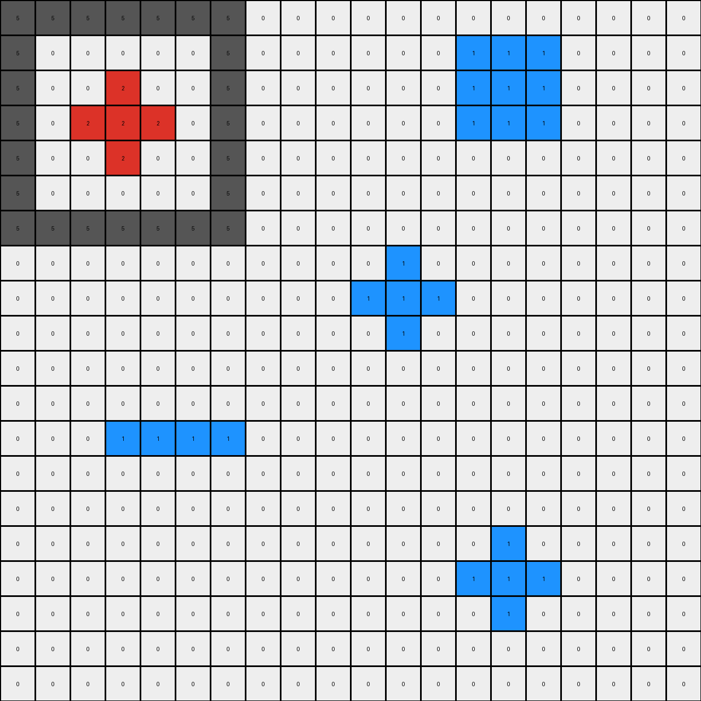

# 776ffc46 • 011 • refine_dreamer

---

Previous Code:
```python
"""
1.  **Find Objects:** Identify all distinct, contiguous objects (shapes) in the grid.  An object is a group of connected pixels of the same color. Consider pixels connected, even diagonally.

2.  **Identify Key Colors:** Focus on objects with colors blue (1), green (3), and gray (5).

3.  **Gray Container:** For each gray (5) object, consider it a "container".

4.  **Green Reference Shapes:** Within each gray container, identify all green (3) objects.  These are the "reference shapes".

5.  **Blue Target Shapes:** Identify all blue (1) objects. These are the "target shapes."

6.  **Shape Matching and Transformation:** For each blue (1) object:
    *   Compare its shape to *each* of the green (3) reference shapes *anywhere within any* gray container. The shapes must be identical in configuration but may be translated (located in different positions). The comparison should not rely on absolute position or a fixed offset between top-left corners.
    *   If a shape match is found between the blue object and *any* green object *within any* gray container, change the color of all pixels in the matching blue object to green (3).

7.  **Preserve Other Objects:** All other objects that do not meet the above criteria remain unchanged. The background (color 0) also remains unchanged.
"""

import numpy as np

def find_objects(grid):
    """
    Identifies distinct, contiguous regions of non-background (non-zero) pixels.
    Returns a list of objects, where each object is a list of (row, col) tuples.
    """
    visited = set()
    objects = []

    def is_valid(r, c):
        return 0 <= r < grid.shape[0] and 0 <= c < grid.shape[1]

    def dfs(r, c, color, current_object):
        if (r, c) in visited or not is_valid(r, c) or grid[r, c] != color:
            return
        visited.add((r, c))
        current_object.append((r, c))
        for dr, dc in [(0, 1), (1, 0), (0, -1), (-1, 0), (1, 1), (-1, -1), (1, -1), (-1, 1)]:
            dfs(r + dr, c + dc, color, current_object)

    for r in range(grid.shape[0]):
        for c in range(grid.shape[1]):
            if grid[r, c] != 0 and (r, c) not in visited:
                current_object = []
                dfs(r, c, grid[r, c], current_object)
                objects.append(current_object)
    return objects

def get_shape_configuration(obj):
    """
    Returns a simplified representation of the object's shape as a set of
    relative (row, col) offsets from the top-left corner of its bounding box.
    """
    min_row = min(r for r, _ in obj)
    min_col = min(c for _, c in obj)
    return {(r - min_row, c - min_col) for r, c in obj}

def is_shape_match(target_obj, reference_obj):
    """
    Checks if two objects have the same shape configuration.
    """
    return get_shape_configuration(target_obj) == get_shape_configuration(reference_obj)

def is_within_container(point, container_obj):
    """
    Checks if a given point is within the bounding box of a container object.
    """
    if not container_obj:
        return False
    rows, cols = zip(*container_obj)
    min_row, max_row = min(rows), max(rows)
    min_col, max_col = min(cols), max(cols)
    return min_row <= point[0] <= max_row and min_col <= point[1] <= max_col


def transform(input_grid):
    # initialize output_grid
    output_grid = np.copy(input_grid)
    objects = find_objects(input_grid)

    # Identify gray containers, green reference shapes, and blue target shapes
    gray_objects = [obj for obj in objects if input_grid[obj[0]] == 5]
    green_objects = [obj for obj in objects if input_grid[obj[0]] == 3]
    blue_objects = [obj for obj in objects if input_grid[obj[0]] == 1]

    # Iterate through blue objects and check for shape matches within gray containers
    for blue_obj in blue_objects:
        for gray_obj in gray_objects:
            for green_obj in green_objects:
              # Check if any part of green object within gray container
              if any(is_within_container(g, gray_obj) for g in green_obj):
                if is_shape_match(blue_obj, green_obj):
                    for r, c in blue_obj:
                        output_grid[r, c] = 3  # Change blue to green
                    break  # Move to the next blue object after a match
            else:
              continue
            break


    return output_grid
```

Train Set Results:

## Example 1:

Input:
```
5 5 5 5 5 5 5 0 0 0 0 0 0 0 0 0 0 0 0 0
5 0 0 0 0 0 5 0 0 0 0 0 0 1 1 1 0 0 0 0
5 0 0 2 0 0 5 0 0 0 0 0 0 1 1 1 0 0 0 0
5 0 2 2 2 0 5 0 0 0 0 0 0 1 1 1 0 0 0 0
5 0 0 2 0 0 5 0 0 0 0 0 0 0 0 0 0 0 0 0
5 0 0 0 0 0 5 0 0 0 0 0 0 0 0 0 0 0 0 0
5 5 5 5 5 5 5 0 0 0 0 0 0 0 0 0 0 0 0 0
0 0 0 0 0 0 0 0 0 0 0 1 0 0 0 0 0 0 0 0
0 0 0 0 0 0 0 0 0 0 1 1 1 0 0 0 0 0 0 0
0 0 0 0 0 0 0 0 0 0 0 1 0 0 0 0 0 0 0 0
0 0 0 0 0 0 0 0 0 0 0 0 0 0 0 0 0 0 0 0
0 0 0 0 0 0 0 0 0 0 0 0 0 0 0 0 0 0 0 0
0 0 0 1 1 1 1 0 0 0 0 0 0 0 0 0 0 0 0 0
0 0 0 0 0 0 0 0 0 0 0 0 0 0 0 0 0 0 0 0
0 0 0 0 0 0 0 0 0 0 0 0 0 0 0 0 0 0 0 0
0 0 0 0 0 0 0 0 0 0 0 0 0 0 1 0 0 0 0 0
0 0 0 0 0 0 0 0 0 0 0 0 0 1 1 1 0 0 0 0
0 0 0 0 0 0 0 0 0 0 0 0 0 0 1 0 0 0 0 0
0 0 0 0 0 0 0 0 0 0 0 0 0 0 0 0 0 0 0 0
0 0 0 0 0 0 0 0 0 0 0 0 0 0 0 0 0 0 0 0
```
Expected Output:
```
5 5 5 5 5 5 5 0 0 0 0 0 0 0 0 0 0 0 0 0
5 0 0 0 0 0 5 0 0 0 0 0 0 1 1 1 0 0 0 0
5 0 0 2 0 0 5 0 0 0 0 0 0 1 1 1 0 0 0 0
5 0 2 2 2 0 5 0 0 0 0 0 0 1 1 1 0 0 0 0
5 0 0 2 0 0 5 0 0 0 0 0 0 0 0 0 0 0 0 0
5 0 0 0 0 0 5 0 0 0 0 0 0 0 0 0 0 0 0 0
5 5 5 5 5 5 5 0 0 0 0 0 0 0 0 0 0 0 0 0
0 0 0 0 0 0 0 0 0 0 0 2 0 0 0 0 0 0 0 0
0 0 0 0 0 0 0 0 0 0 2 2 2 0 0 0 0 0 0 0
0 0 0 0 0 0 0 0 0 0 0 2 0 0 0 0 0 0 0 0
0 0 0 0 0 0 0 0 0 0 0 0 0 0 0 0 0 0 0 0
0 0 0 0 0 0 0 0 0 0 0 0 0 0 0 0 0 0 0 0
0 0 0 1 1 1 1 0 0 0 0 0 0 0 0 0 0 0 0 0
0 0 0 0 0 0 0 0 0 0 0 0 0 0 0 0 0 0 0 0
0 0 0 0 0 0 0 0 0 0 0 0 0 0 0 0 0 0 0 0
0 0 0 0 0 0 0 0 0 0 0 0 0 0 2 0 0 0 0 0
0 0 0 0 0 0 0 0 0 0 0 0 0 2 2 2 0 0 0 0
0 0 0 0 0 0 0 0 0 0 0 0 0 0 2 0 0 0 0 0
0 0 0 0 0 0 0 0 0 0 0 0 0 0 0 0 0 0 0 0
0 0 0 0 0 0 0 0 0 0 0 0 0 0 0 0 0 0 0 0
```
Transformed Output:
```
5 5 5 5 5 5 5 0 0 0 0 0 0 0 0 0 0 0 0 0
5 0 0 0 0 0 5 0 0 0 0 0 0 1 1 1 0 0 0 0
5 0 0 2 0 0 5 0 0 0 0 0 0 1 1 1 0 0 0 0
5 0 2 2 2 0 5 0 0 0 0 0 0 1 1 1 0 0 0 0
5 0 0 2 0 0 5 0 0 0 0 0 0 0 0 0 0 0 0 0
5 0 0 0 0 0 5 0 0 0 0 0 0 0 0 0 0 0 0 0
5 5 5 5 5 5 5 0 0 0 0 0 0 0 0 0 0 0 0 0
0 0 0 0 0 0 0 0 0 0 0 1 0 0 0 0 0 0 0 0
0 0 0 0 0 0 0 0 0 0 1 1 1 0 0 0 0 0 0 0
0 0 0 0 0 0 0 0 0 0 0 1 0 0 0 0 0 0 0 0
0 0 0 0 0 0 0 0 0 0 0 0 0 0 0 0 0 0 0 0
0 0 0 0 0 0 0 0 0 0 0 0 0 0 0 0 0 0 0 0
0 0 0 1 1 1 1 0 0 0 0 0 0 0 0 0 0 0 0 0
0 0 0 0 0 0 0 0 0 0 0 0 0 0 0 0 0 0 0 0
0 0 0 0 0 0 0 0 0 0 0 0 0 0 0 0 0 0 0 0
0 0 0 0 0 0 0 0 0 0 0 0 0 0 1 0 0 0 0 0
0 0 0 0 0 0 0 0 0 0 0 0 0 1 1 1 0 0 0 0
0 0 0 0 0 0 0 0 0 0 0 0 0 0 1 0 0 0 0 0
0 0 0 0 0 0 0 0 0 0 0 0 0 0 0 0 0 0 0 0
0 0 0 0 0 0 0 0 0 0 0 0 0 0 0 0 0 0 0 0
```

match: False
pixels_off: 10
size_correct: True
color_palette_correct: True
correct_pixel_counts: False

## Example 2:

Input:
```
0 0 0 0 0 0 0 0 0 0 0 0 0 0 0 0 0 0 0 0
0 0 0 0 0 5 5 5 5 5 5 5 0 0 0 0 0 0 0 0
0 0 0 0 0 5 0 0 0 0 0 5 0 0 0 0 0 0 0 0
0 0 0 0 0 5 0 3 3 3 0 5 0 0 0 0 0 0 0 0
0 0 0 0 0 5 0 3 3 3 0 5 0 0 0 0 0 0 0 0
0 0 0 0 0 5 0 3 3 3 0 5 0 0 0 0 0 0 0 0
0 0 0 0 0 5 0 0 0 0 0 5 0 0 0 0 0 0 0 0
0 0 0 0 0 5 5 5 5 5 5 5 0 0 0 0 0 0 0 0
0 0 0 0 0 0 0 0 0 0 0 0 0 0 0 0 0 0 0 0
0 0 0 0 0 0 0 0 0 0 0 0 0 0 0 1 1 1 0 0
0 0 0 0 0 0 0 0 0 0 0 0 0 0 0 1 1 1 0 0
0 0 0 0 0 0 0 0 0 0 0 1 0 0 0 1 1 1 0 0
0 0 0 1 1 1 0 0 0 0 0 1 0 0 0 0 0 0 0 0
0 0 0 1 1 1 0 0 0 0 0 1 0 0 0 0 0 0 0 0
0 0 0 1 1 1 0 0 0 0 0 0 0 0 0 0 0 0 0 0
0 0 0 0 0 0 0 0 0 0 0 0 0 0 0 0 0 0 0 0
0 0 0 0 0 0 0 0 0 0 0 0 1 0 0 0 0 0 0 0
0 0 0 0 0 0 0 0 0 0 0 1 1 1 0 0 0 0 0 0
0 0 0 0 0 0 0 0 0 0 1 1 1 1 1 0 0 0 0 0
0 0 0 0 0 0 0 0 0 0 0 0 0 0 0 0 0 0 0 0
```
Expected Output:
```
0 0 0 0 0 0 0 0 0 0 0 0 0 0 0 0 0 0 0 0
0 0 0 0 0 5 5 5 5 5 5 5 0 0 0 0 0 0 0 0
0 0 0 0 0 5 0 0 0 0 0 5 0 0 0 0 0 0 0 0
0 0 0 0 0 5 0 3 3 3 0 5 0 0 0 0 0 0 0 0
0 0 0 0 0 5 0 3 3 3 0 5 0 0 0 0 0 0 0 0
0 0 0 0 0 5 0 3 3 3 0 5 0 0 0 0 0 0 0 0
0 0 0 0 0 5 0 0 0 0 0 5 0 0 0 0 0 0 0 0
0 0 0 0 0 5 5 5 5 5 5 5 0 0 0 0 0 0 0 0
0 0 0 0 0 0 0 0 0 0 0 0 0 0 0 0 0 0 0 0
0 0 0 0 0 0 0 0 0 0 0 0 0 0 0 3 3 3 0 0
0 0 0 0 0 0 0 0 0 0 0 0 0 0 0 3 3 3 0 0
0 0 0 0 0 0 0 0 0 0 0 1 0 0 0 3 3 3 0 0
0 0 0 3 3 3 0 0 0 0 0 1 0 0 0 0 0 0 0 0
0 0 0 3 3 3 0 0 0 0 0 1 0 0 0 0 0 0 0 0
0 0 0 3 3 3 0 0 0 0 0 0 0 0 0 0 0 0 0 0
0 0 0 0 0 0 0 0 0 0 0 0 0 0 0 0 0 0 0 0
0 0 0 0 0 0 0 0 0 0 0 0 1 0 0 0 0 0 0 0
0 0 0 0 0 0 0 0 0 0 0 1 1 1 0 0 0 0 0 0
0 0 0 0 0 0 0 0 0 0 1 1 1 1 1 0 0 0 0 0
0 0 0 0 0 0 0 0 0 0 0 0 0 0 0 0 0 0 0 0
```
Transformed Output:
```
0 0 0 0 0 0 0 0 0 0 0 0 0 0 0 0 0 0 0 0
0 0 0 0 0 5 5 5 5 5 5 5 0 0 0 0 0 0 0 0
0 0 0 0 0 5 0 0 0 0 0 5 0 0 0 0 0 0 0 0
0 0 0 0 0 5 0 3 3 3 0 5 0 0 0 0 0 0 0 0
0 0 0 0 0 5 0 3 3 3 0 5 0 0 0 0 0 0 0 0
0 0 0 0 0 5 0 3 3 3 0 5 0 0 0 0 0 0 0 0
0 0 0 0 0 5 0 0 0 0 0 5 0 0 0 0 0 0 0 0
0 0 0 0 0 5 5 5 5 5 5 5 0 0 0 0 0 0 0 0
0 0 0 0 0 0 0 0 0 0 0 0 0 0 0 0 0 0 0 0
0 0 0 0 0 0 0 0 0 0 0 0 0 0 0 3 3 3 0 0
0 0 0 0 0 0 0 0 0 0 0 0 0 0 0 3 3 3 0 0
0 0 0 0 0 0 0 0 0 0 0 1 0 0 0 3 3 3 0 0
0 0 0 3 3 3 0 0 0 0 0 1 0 0 0 0 0 0 0 0
0 0 0 3 3 3 0 0 0 0 0 1 0 0 0 0 0 0 0 0
0 0 0 3 3 3 0 0 0 0 0 0 0 0 0 0 0 0 0 0
0 0 0 0 0 0 0 0 0 0 0 0 0 0 0 0 0 0 0 0
0 0 0 0 0 0 0 0 0 0 0 0 1 0 0 0 0 0 0 0
0 0 0 0 0 0 0 0 0 0 0 1 1 1 0 0 0 0 0 0
0 0 0 0 0 0 0 0 0 0 1 1 1 1 1 0 0 0 0 0
0 0 0 0 0 0 0 0 0 0 0 0 0 0 0 0 0 0 0 0
```

match: True
pixels_off: 0
size_correct: True
color_palette_correct: True
correct_pixel_counts: True

## Example 3:

Input:
```
0 0 0 0 0 5 0 0 0 0 0 0 0 5 5 5 5 5 5 5
0 0 2 0 0 5 0 0 0 0 0 0 0 5 0 0 0 0 0 5
0 0 2 0 0 5 0 0 0 0 0 0 0 5 0 2 2 2 0 5
0 0 2 0 0 5 0 0 0 0 0 0 0 5 0 2 2 2 0 5
0 0 0 0 0 5 0 0 0 0 0 0 0 5 0 0 0 0 0 5
5 5 5 5 5 5 0 0 0 0 0 0 0 5 0 0 0 0 0 5
0 0 0 0 0 0 0 0 0 0 0 0 0 5 5 5 5 5 5 5
0 0 0 0 0 0 0 0 0 0 0 0 0 0 0 0 0 0 0 0
0 0 0 0 0 0 0 0 0 0 0 0 0 0 0 0 0 0 0 0
0 0 0 0 0 0 0 0 0 0 0 0 0 0 0 0 0 0 0 0
0 0 0 0 1 0 0 0 0 0 0 0 0 0 0 0 0 0 0 0
0 0 0 0 1 0 0 0 0 0 1 1 1 0 0 0 0 0 0 0
0 0 0 0 1 0 0 0 0 0 1 1 1 0 0 0 0 0 0 0
0 0 0 0 0 0 0 0 0 0 0 0 0 0 0 0 0 0 0 0
0 0 0 0 0 0 0 0 0 0 0 0 0 0 0 0 0 0 0 0
0 0 0 0 0 0 0 0 1 0 0 0 0 0 0 0 0 0 0 0
0 0 1 1 1 0 0 1 1 1 0 0 0 0 0 0 0 0 0 0
0 0 1 1 1 0 0 0 1 0 0 0 0 0 0 0 0 0 0 0
0 0 0 0 0 0 0 0 0 0 0 0 0 0 0 0 0 0 0 0
0 0 0 0 0 0 0 0 0 0 0 0 0 0 0 0 0 0 0 0
```
Expected Output:
```
0 0 0 0 0 5 0 0 0 0 0 0 0 5 5 5 5 5 5 5
0 0 2 0 0 5 0 0 0 0 0 0 0 5 0 0 0 0 0 5
0 0 2 0 0 5 0 0 0 0 0 0 0 5 0 2 2 2 0 5
0 0 2 0 0 5 0 0 0 0 0 0 0 5 0 2 2 2 0 5
0 0 0 0 0 5 0 0 0 0 0 0 0 5 0 0 0 0 0 5
5 5 5 5 5 5 0 0 0 0 0 0 0 5 0 0 0 0 0 5
0 0 0 0 0 0 0 0 0 0 0 0 0 5 5 5 5 5 5 5
0 0 0 0 0 0 0 0 0 0 0 0 0 0 0 0 0 0 0 0
0 0 0 0 0 0 0 0 0 0 0 0 0 0 0 0 0 0 0 0
0 0 0 0 0 0 0 0 0 0 0 0 0 0 0 0 0 0 0 0
0 0 0 0 1 0 0 0 0 0 0 0 0 0 0 0 0 0 0 0
0 0 0 0 1 0 0 0 0 0 2 2 2 0 0 0 0 0 0 0
0 0 0 0 1 0 0 0 0 0 2 2 2 0 0 0 0 0 0 0
0 0 0 0 0 0 0 0 0 0 0 0 0 0 0 0 0 0 0 0
0 0 0 0 0 0 0 0 0 0 0 0 0 0 0 0 0 0 0 0
0 0 0 0 0 0 0 0 1 0 0 0 0 0 0 0 0 0 0 0
0 0 2 2 2 0 0 1 1 1 0 0 0 0 0 0 0 0 0 0
0 0 2 2 2 0 0 0 1 0 0 0 0 0 0 0 0 0 0 0
0 0 0 0 0 0 0 0 0 0 0 0 0 0 0 0 0 0 0 0
0 0 0 0 0 0 0 0 0 0 0 0 0 0 0 0 0 0 0 0
```
Transformed Output:
```
0 0 0 0 0 5 0 0 0 0 0 0 0 5 5 5 5 5 5 5
0 0 2 0 0 5 0 0 0 0 0 0 0 5 0 0 0 0 0 5
0 0 2 0 0 5 0 0 0 0 0 0 0 5 0 2 2 2 0 5
0 0 2 0 0 5 0 0 0 0 0 0 0 5 0 2 2 2 0 5
0 0 0 0 0 5 0 0 0 0 0 0 0 5 0 0 0 0 0 5
5 5 5 5 5 5 0 0 0 0 0 0 0 5 0 0 0 0 0 5
0 0 0 0 0 0 0 0 0 0 0 0 0 5 5 5 5 5 5 5
0 0 0 0 0 0 0 0 0 0 0 0 0 0 0 0 0 0 0 0
0 0 0 0 0 0 0 0 0 0 0 0 0 0 0 0 0 0 0 0
0 0 0 0 0 0 0 0 0 0 0 0 0 0 0 0 0 0 0 0
0 0 0 0 1 0 0 0 0 0 0 0 0 0 0 0 0 0 0 0
0 0 0 0 1 0 0 0 0 0 1 1 1 0 0 0 0 0 0 0
0 0 0 0 1 0 0 0 0 0 1 1 1 0 0 0 0 0 0 0
0 0 0 0 0 0 0 0 0 0 0 0 0 0 0 0 0 0 0 0
0 0 0 0 0 0 0 0 0 0 0 0 0 0 0 0 0 0 0 0
0 0 0 0 0 0 0 0 1 0 0 0 0 0 0 0 0 0 0 0
0 0 1 1 1 0 0 1 1 1 0 0 0 0 0 0 0 0 0 0
0 0 1 1 1 0 0 0 1 0 0 0 0 0 0 0 0 0 0 0
0 0 0 0 0 0 0 0 0 0 0 0 0 0 0 0 0 0 0 0
0 0 0 0 0 0 0 0 0 0 0 0 0 0 0 0 0 0 0 0
```

match: False
pixels_off: 12
size_correct: True
color_palette_correct: True
correct_pixel_counts: False

## Example 4:

Input:
```
0 0 0 0 0 0 0 0 0 0 0 0 0 5 0 0 0 0 0 0
0 0 0 0 0 0 0 0 0 0 0 0 0 5 0 0 3 3 0 0
0 0 0 0 0 0 0 0 0 0 0 0 0 5 0 0 3 3 0 0
0 5 5 5 5 5 5 5 0 0 0 0 0 5 0 3 3 3 3 0
0 5 0 0 0 0 0 5 0 0 0 0 0 5 0 0 0 0 0 0
0 5 0 3 3 3 0 5 0 0 0 0 0 5 5 5 5 5 5 5
0 5 0 3 3 3 0 5 0 0 0 0 0 0 0 0 0 0 0 0
0 5 0 3 3 3 0 5 0 0 0 0 0 0 0 0 0 0 0 0
0 5 0 0 0 0 0 5 0 0 0 0 0 0 0 0 1 1 0 0
0 5 5 5 5 5 5 5 0 0 1 1 1 0 0 0 1 1 0 0
0 0 0 0 0 0 0 0 0 0 1 1 1 0 0 1 1 1 1 0
0 0 0 0 0 0 0 0 0 0 1 1 1 0 0 0 0 0 0 0
0 0 0 0 0 1 0 0 0 0 0 0 0 0 0 0 0 0 0 0
0 0 0 0 0 1 0 0 0 0 0 0 0 0 0 0 0 0 0 0
0 0 0 0 0 1 0 0 0 0 0 0 0 0 0 0 0 0 0 0
0 0 0 0 0 1 0 0 0 0 0 1 0 0 0 0 0 0 0 0
0 0 0 0 0 0 0 0 0 0 1 1 1 0 0 0 0 0 0 0
0 0 0 0 0 0 0 0 0 0 0 1 0 0 0 0 0 0 0 0
0 0 0 0 0 0 0 0 0 0 0 0 0 0 0 0 0 0 0 0
0 0 0 0 0 0 0 0 0 0 0 0 0 0 0 0 0 0 0 0
```
Expected Output:
```
0 0 0 0 0 0 0 0 0 0 0 0 0 5 0 0 0 0 0 0
0 0 0 0 0 0 0 0 0 0 0 0 0 5 0 0 3 3 0 0
0 0 0 0 0 0 0 0 0 0 0 0 0 5 0 0 3 3 0 0
0 5 5 5 5 5 5 5 0 0 0 0 0 5 0 3 3 3 3 0
0 5 0 0 0 0 0 5 0 0 0 0 0 5 0 0 0 0 0 0
0 5 0 3 3 3 0 5 0 0 0 0 0 5 5 5 5 5 5 5
0 5 0 3 3 3 0 5 0 0 0 0 0 0 0 0 0 0 0 0
0 5 0 3 3 3 0 5 0 0 0 0 0 0 0 0 0 0 0 0
0 5 0 0 0 0 0 5 0 0 0 0 0 0 0 0 1 1 0 0
0 5 5 5 5 5 5 5 0 0 3 3 3 0 0 0 1 1 0 0
0 0 0 0 0 0 0 0 0 0 3 3 3 0 0 1 1 1 1 0
0 0 0 0 0 0 0 0 0 0 3 3 3 0 0 0 0 0 0 0
0 0 0 0 0 1 0 0 0 0 0 0 0 0 0 0 0 0 0 0
0 0 0 0 0 1 0 0 0 0 0 0 0 0 0 0 0 0 0 0
0 0 0 0 0 1 0 0 0 0 0 0 0 0 0 0 0 0 0 0
0 0 0 0 0 1 0 0 0 0 0 1 0 0 0 0 0 0 0 0
0 0 0 0 0 0 0 0 0 0 1 1 1 0 0 0 0 0 0 0
0 0 0 0 0 0 0 0 0 0 0 1 0 0 0 0 0 0 0 0
0 0 0 0 0 0 0 0 0 0 0 0 0 0 0 0 0 0 0 0
0 0 0 0 0 0 0 0 0 0 0 0 0 0 0 0 0 0 0 0
```
Transformed Output:
```
0 0 0 0 0 0 0 0 0 0 0 0 0 5 0 0 0 0 0 0
0 0 0 0 0 0 0 0 0 0 0 0 0 5 0 0 3 3 0 0
0 0 0 0 0 0 0 0 0 0 0 0 0 5 0 0 3 3 0 0
0 5 5 5 5 5 5 5 0 0 0 0 0 5 0 3 3 3 3 0
0 5 0 0 0 0 0 5 0 0 0 0 0 5 0 0 0 0 0 0
0 5 0 3 3 3 0 5 0 0 0 0 0 5 5 5 5 5 5 5
0 5 0 3 3 3 0 5 0 0 0 0 0 0 0 0 0 0 0 0
0 5 0 3 3 3 0 5 0 0 0 0 0 0 0 0 0 0 0 0
0 5 0 0 0 0 0 5 0 0 0 0 0 0 0 0 3 3 0 0
0 5 5 5 5 5 5 5 0 0 3 3 3 0 0 0 3 3 0 0
0 0 0 0 0 0 0 0 0 0 3 3 3 0 0 3 3 3 3 0
0 0 0 0 0 0 0 0 0 0 3 3 3 0 0 0 0 0 0 0
0 0 0 0 0 1 0 0 0 0 0 0 0 0 0 0 0 0 0 0
0 0 0 0 0 1 0 0 0 0 0 0 0 0 0 0 0 0 0 0
0 0 0 0 0 1 0 0 0 0 0 0 0 0 0 0 0 0 0 0
0 0 0 0 0 1 0 0 0 0 0 1 0 0 0 0 0 0 0 0
0 0 0 0 0 0 0 0 0 0 1 1 1 0 0 0 0 0 0 0
0 0 0 0 0 0 0 0 0 0 0 1 0 0 0 0 0 0 0 0
0 0 0 0 0 0 0 0 0 0 0 0 0 0 0 0 0 0 0 0
0 0 0 0 0 0 0 0 0 0 0 0 0 0 0 0 0 0 0 0
```

match: False
pixels_off: 8
size_correct: True
color_palette_correct: True
correct_pixel_counts: False
**INSTRUCTIONS**

The code above was generated based on observations from the first training
example

we have tested the transform function on each of the task example inputs and
compared with the expected output

review each of the examples provided and the results and consider how the
natural language program should be updated to accommodate this new knowledge

respond with the following deliverables:

- general assessment of the information provided and strategy for resolving the
  errors
- gather metrics about each of the examples and results - use code_execution to
  develop accurate reports on your assumptions
- a YAML block documenting facts - Focus on identifying objects, their properties, and the actions performed on them.
- a natural language program - Be as clear and concise as possible, providing a complete description of the transformation rule.


your responses should be considered as information in a report - not a
conversation
