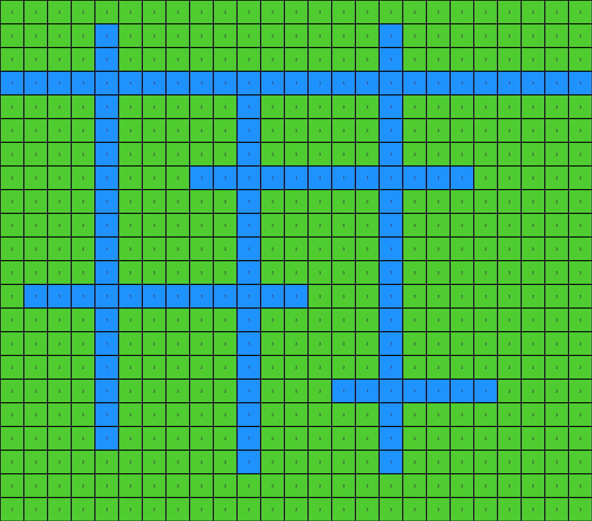

# 7b6016b9 • 003 • refine_dreamer

---

Previous Code:
```python
"""
The transformation involves identifying azure shapes, filling their interiors with red, and changing the white background to green.
"""

import numpy as np

def get_objects(grid, color):
    """
    Finds objects of a specific color in the grid.

    Args:
        grid: The input grid (NumPy array).
        color: The color of the objects to find.

    Returns:
        A list of objects, where each object is a set of (row, col) coordinates.
    """
    objects = []
    visited = set()
    rows, cols = grid.shape

    def dfs(row, col, current_object):
        if (
            row < 0
            or row >= rows
            or col < 0
            or col >= cols
            or grid[row, col] != color
            or (row, col) in visited
        ):
            return
        visited.add((row, col))
        current_object.add((row, col))
        dfs(row + 1, col, current_object)
        dfs(row - 1, col, current_object)
        dfs(row, col + 1, current_object)
        dfs(row, col - 1, current_object)

    for row in range(rows):
        for col in range(cols):
            if grid[row, col] == color and (row, col) not in visited:
                current_object = set()
                dfs(row, col, current_object)
                objects.append(current_object)
    return objects

def fill_interior(grid, objects, fill_color):
    """
    Fills the interior of the objects with the specified color.
    """
    rows, cols = grid.shape
    output_grid = np.copy(grid)

    for obj in objects:
        #find bounding box
        min_row = min(r for r, c in obj)
        max_row = max(r for r, c in obj)
        min_col = min(c for r, c in obj)
        max_col = max(c for r, c in obj)

        for r in range(min_row + 1, max_row):
          for c in range(min_col+1,max_col):
            #check if cell is inside object
            if (r,c) not in obj: #must be interior
               #check all neighbors, if all neighbors exists and either are the object color or the fill, then fill
                neighbors = [(r + 1, c), (r - 1, c), (r, c + 1), (r, c - 1)]
                valid_neighbors = all(0 <= nr < rows and 0 <= nc < cols for nr, nc in neighbors)

                if valid_neighbors:
                  neighbor_colors = [output_grid[nr,nc] for nr, nc in neighbors]
                  if all(color == 8 or color == 2 for color in neighbor_colors):
                    output_grid[r,c] = fill_color
    return output_grid

def transform(input_grid):
    # initialize output_grid
    output_grid = np.copy(input_grid)

    # change white background to green
    output_grid[output_grid == 0] = 3

    # Find azure shapes
    azure_objects = get_objects(input_grid, 8)

    # Fill interiors of azure objects with red
    output_grid = fill_interior(output_grid, azure_objects, 2)


    return output_grid
```

Train Set Results:

## Example 1:

Input:
```
0 0 0 0 0 0 0 0 0 0 8 0 0 0 0 0 0 0 0 0 0 0 0
0 0 0 0 0 0 0 0 0 0 8 0 0 0 0 0 8 0 0 0 0 0 0
0 0 0 0 0 0 0 0 0 0 8 0 0 0 0 0 8 0 0 0 0 0 0
0 0 0 0 0 0 8 0 0 0 8 0 0 0 0 0 8 0 0 0 0 0 0
0 0 0 8 8 8 8 8 8 8 8 8 8 0 0 0 8 0 0 0 0 0 0
0 0 0 0 0 0 8 0 0 0 8 0 0 0 0 0 8 0 0 0 8 0 0
0 0 0 0 0 0 8 0 0 0 8 0 0 0 0 0 8 0 0 0 8 0 0
0 0 0 0 0 0 8 0 0 0 8 0 0 0 0 0 8 0 0 0 8 0 0
0 0 0 8 8 8 8 8 8 8 8 8 8 8 8 8 8 8 8 8 8 8 0
0 0 0 0 0 0 8 0 0 0 8 0 0 0 0 0 8 0 0 0 8 0 0
0 0 0 0 0 0 8 0 0 0 8 0 0 0 0 0 8 0 0 0 8 0 0
0 0 0 0 0 0 8 0 0 0 0 0 0 0 0 0 8 0 0 0 8 0 0
0 0 0 0 0 0 8 0 0 0 0 0 0 0 0 0 8 0 0 0 0 0 0
0 0 0 0 0 0 8 0 0 0 0 0 0 0 0 0 8 0 0 0 0 0 0
0 0 0 0 0 0 8 0 0 0 0 0 0 0 0 0 8 0 0 0 0 0 0
8 8 8 8 8 8 8 8 8 8 8 8 8 8 8 8 8 8 0 0 0 0 0
0 0 0 0 0 0 8 0 0 0 0 0 0 8 0 0 8 0 0 0 0 0 0
0 0 0 0 0 0 8 0 0 0 0 0 0 8 0 0 8 0 0 0 0 0 0
0 0 0 0 0 0 8 0 0 0 0 0 0 8 0 0 8 0 0 0 0 0 0
0 0 0 0 0 0 8 0 0 0 0 0 8 8 8 8 8 8 8 8 8 0 0
0 0 0 0 0 0 0 0 0 0 0 0 0 8 0 0 8 0 0 0 0 0 0
0 0 0 0 0 0 0 0 0 0 0 0 0 8 0 0 8 0 0 0 0 0 0
0 0 0 0 0 0 0 0 0 0 0 0 0 0 0 0 0 0 0 0 0 0 0
```
Expected Output:
```
3 3 3 3 3 3 3 3 3 3 8 3 3 3 3 3 3 3 3 3 3 3 3
3 3 3 3 3 3 3 3 3 3 8 3 3 3 3 3 8 3 3 3 3 3 3
3 3 3 3 3 3 3 3 3 3 8 3 3 3 3 3 8 3 3 3 3 3 3
3 3 3 3 3 3 8 3 3 3 8 3 3 3 3 3 8 3 3 3 3 3 3
3 3 3 8 8 8 8 8 8 8 8 8 8 3 3 3 8 3 3 3 3 3 3
3 3 3 3 3 3 8 2 2 2 8 3 3 3 3 3 8 3 3 3 8 3 3
3 3 3 3 3 3 8 2 2 2 8 3 3 3 3 3 8 3 3 3 8 3 3
3 3 3 3 3 3 8 2 2 2 8 3 3 3 3 3 8 3 3 3 8 3 3
3 3 3 8 8 8 8 8 8 8 8 8 8 8 8 8 8 8 8 8 8 8 3
3 3 3 3 3 3 8 2 2 2 8 2 2 2 2 2 8 3 3 3 8 3 3
3 3 3 3 3 3 8 2 2 2 8 2 2 2 2 2 8 3 3 3 8 3 3
3 3 3 3 3 3 8 2 2 2 2 2 2 2 2 2 8 3 3 3 8 3 3
3 3 3 3 3 3 8 2 2 2 2 2 2 2 2 2 8 3 3 3 3 3 3
3 3 3 3 3 3 8 2 2 2 2 2 2 2 2 2 8 3 3 3 3 3 3
3 3 3 3 3 3 8 2 2 2 2 2 2 2 2 2 8 3 3 3 3 3 3
8 8 8 8 8 8 8 8 8 8 8 8 8 8 8 8 8 8 3 3 3 3 3
3 3 3 3 3 3 8 3 3 3 3 3 3 8 2 2 8 3 3 3 3 3 3
3 3 3 3 3 3 8 3 3 3 3 3 3 8 2 2 8 3 3 3 3 3 3
3 3 3 3 3 3 8 3 3 3 3 3 3 8 2 2 8 3 3 3 3 3 3
3 3 3 3 3 3 8 3 3 3 3 3 8 8 8 8 8 8 8 8 8 3 3
3 3 3 3 3 3 3 3 3 3 3 3 3 8 3 3 8 3 3 3 3 3 3
3 3 3 3 3 3 3 3 3 3 3 3 3 8 3 3 8 3 3 3 3 3 3
3 3 3 3 3 3 3 3 3 3 3 3 3 3 3 3 3 3 3 3 3 3 3
```
Transformed Output:
```
3 3 3 3 3 3 3 3 3 3 8 3 3 3 3 3 3 3 3 3 3 3 3
3 3 3 3 3 3 3 3 3 3 8 3 3 3 3 3 8 3 3 3 3 3 3
3 3 3 3 3 3 3 3 3 3 8 3 3 3 3 3 8 3 3 3 3 3 3
3 3 3 3 3 3 8 3 3 3 8 3 3 3 3 3 8 3 3 3 3 3 3
3 3 3 8 8 8 8 8 8 8 8 8 8 3 3 3 8 3 3 3 3 3 3
3 3 3 3 3 3 8 3 3 3 8 3 3 3 3 3 8 3 3 3 8 3 3
3 3 3 3 3 3 8 3 3 3 8 3 3 3 3 3 8 3 3 3 8 3 3
3 3 3 3 3 3 8 3 3 3 8 3 3 3 3 3 8 3 3 3 8 3 3
3 3 3 8 8 8 8 8 8 8 8 8 8 8 8 8 8 8 8 8 8 8 3
3 3 3 3 3 3 8 3 3 3 8 3 3 3 3 3 8 3 3 3 8 3 3
3 3 3 3 3 3 8 3 3 3 8 3 3 3 3 3 8 3 3 3 8 3 3
3 3 3 3 3 3 8 3 3 3 3 3 3 3 3 3 8 3 3 3 8 3 3
3 3 3 3 3 3 8 3 3 3 3 3 3 3 3 3 8 3 3 3 3 3 3
3 3 3 3 3 3 8 3 3 3 3 3 3 3 3 3 8 3 3 3 3 3 3
3 3 3 3 3 3 8 3 3 3 3 3 3 3 3 3 8 3 3 3 3 3 3
8 8 8 8 8 8 8 8 8 8 8 8 8 8 8 8 8 8 3 3 3 3 3
3 3 3 3 3 3 8 3 3 3 3 3 3 8 3 3 8 3 3 3 3 3 3
3 3 3 3 3 3 8 3 3 3 3 3 3 8 3 3 8 3 3 3 3 3 3
3 3 3 3 3 3 8 3 3 3 3 3 3 8 3 3 8 3 3 3 3 3 3
3 3 3 3 3 3 8 3 3 3 3 3 8 8 8 8 8 8 8 8 8 3 3
3 3 3 3 3 3 3 3 3 3 3 3 3 8 3 3 8 3 3 3 3 3 3
3 3 3 3 3 3 3 3 3 3 3 3 3 8 3 3 8 3 3 3 3 3 3
3 3 3 3 3 3 3 3 3 3 3 3 3 3 3 3 3 3 3 3 3 3 3
```

match: False
pixels_off: 67
size_correct: True
color_palette_correct: True
correct_pixel_counts: False

## Example 2:

Input:
```
0 0 0 0 0 0 0 0 0 0 0 0 0 0 0 0 0 0 0 0 0 0 0 0 0
0 0 0 0 1 0 0 0 0 0 0 0 0 0 0 0 1 0 0 0 0 0 0 0 0
0 0 0 0 1 0 0 0 0 0 0 0 0 0 0 0 1 0 0 0 0 0 0 0 0
1 1 1 1 1 1 1 1 1 1 1 1 1 1 1 1 1 1 1 1 1 1 1 1 1
0 0 0 0 1 0 0 0 0 0 1 0 0 0 0 0 1 0 0 0 0 0 0 0 0
0 0 0 0 1 0 0 0 0 0 1 0 0 0 0 0 1 0 0 0 0 0 0 0 0
0 0 0 0 1 0 0 0 0 0 1 0 0 0 0 0 1 0 0 0 0 0 0 0 0
0 0 0 0 1 0 0 0 1 1 1 1 1 1 1 1 1 1 1 1 0 0 0 0 0
0 0 0 0 1 0 0 0 0 0 1 0 0 0 0 0 1 0 0 0 0 0 0 0 0
0 0 0 0 1 0 0 0 0 0 1 0 0 0 0 0 1 0 0 0 0 0 0 0 0
0 0 0 0 1 0 0 0 0 0 1 0 0 0 0 0 1 0 0 0 0 0 0 0 0
0 0 0 0 1 0 0 0 0 0 1 0 0 0 0 0 1 0 0 0 0 0 0 0 0
0 1 1 1 1 1 1 1 1 1 1 1 1 0 0 0 1 0 0 0 0 0 0 0 0
0 0 0 0 1 0 0 0 0 0 1 0 0 0 0 0 1 0 0 0 0 0 0 0 0
0 0 0 0 1 0 0 0 0 0 1 0 0 0 0 0 1 0 0 0 0 0 0 0 0
0 0 0 0 1 0 0 0 0 0 1 0 0 0 0 0 1 0 0 0 0 0 0 0 0
0 0 0 0 1 0 0 0 0 0 1 0 0 0 1 1 1 1 1 1 1 0 0 0 0
0 0 0 0 1 0 0 0 0 0 1 0 0 0 0 0 1 0 0 0 0 0 0 0 0
0 0 0 0 1 0 0 0 0 0 1 0 0 0 0 0 1 0 0 0 0 0 0 0 0
0 0 0 0 0 0 0 0 0 0 1 0 0 0 0 0 1 0 0 0 0 0 0 0 0
0 0 0 0 0 0 0 0 0 0 0 0 0 0 0 0 0 0 0 0 0 0 0 0 0
0 0 0 0 0 0 0 0 0 0 0 0 0 0 0 0 0 0 0 0 0 0 0 0 0
```
Expected Output:
```
3 3 3 3 3 3 3 3 3 3 3 3 3 3 3 3 3 3 3 3 3 3 3 3 3
3 3 3 3 1 3 3 3 3 3 3 3 3 3 3 3 1 3 3 3 3 3 3 3 3
3 3 3 3 1 3 3 3 3 3 3 3 3 3 3 3 1 3 3 3 3 3 3 3 3
1 1 1 1 1 1 1 1 1 1 1 1 1 1 1 1 1 1 1 1 1 1 1 1 1
3 3 3 3 1 2 2 2 2 2 1 2 2 2 2 2 1 3 3 3 3 3 3 3 3
3 3 3 3 1 2 2 2 2 2 1 2 2 2 2 2 1 3 3 3 3 3 3 3 3
3 3 3 3 1 2 2 2 2 2 1 2 2 2 2 2 1 3 3 3 3 3 3 3 3
3 3 3 3 1 2 2 2 1 1 1 1 1 1 1 1 1 1 1 1 3 3 3 3 3
3 3 3 3 1 2 2 2 2 2 1 3 3 3 3 3 1 3 3 3 3 3 3 3 3
3 3 3 3 1 2 2 2 2 2 1 3 3 3 3 3 1 3 3 3 3 3 3 3 3
3 3 3 3 1 2 2 2 2 2 1 3 3 3 3 3 1 3 3 3 3 3 3 3 3
3 3 3 3 1 2 2 2 2 2 1 3 3 3 3 3 1 3 3 3 3 3 3 3 3
3 1 1 1 1 1 1 1 1 1 1 1 1 3 3 3 1 3 3 3 3 3 3 3 3
3 3 3 3 1 3 3 3 3 3 1 3 3 3 3 3 1 3 3 3 3 3 3 3 3
3 3 3 3 1 3 3 3 3 3 1 3 3 3 3 3 1 3 3 3 3 3 3 3 3
3 3 3 3 1 3 3 3 3 3 1 3 3 3 3 3 1 3 3 3 3 3 3 3 3
3 3 3 3 1 3 3 3 3 3 1 3 3 3 1 1 1 1 1 1 1 3 3 3 3
3 3 3 3 1 3 3 3 3 3 1 3 3 3 3 3 1 3 3 3 3 3 3 3 3
3 3 3 3 1 3 3 3 3 3 1 3 3 3 3 3 1 3 3 3 3 3 3 3 3
3 3 3 3 3 3 3 3 3 3 1 3 3 3 3 3 1 3 3 3 3 3 3 3 3
3 3 3 3 3 3 3 3 3 3 3 3 3 3 3 3 3 3 3 3 3 3 3 3 3
3 3 3 3 3 3 3 3 3 3 3 3 3 3 3 3 3 3 3 3 3 3 3 3 3
```
Transformed Output:
```
3 3 3 3 3 3 3 3 3 3 3 3 3 3 3 3 3 3 3 3 3 3 3 3 3
3 3 3 3 1 3 3 3 3 3 3 3 3 3 3 3 1 3 3 3 3 3 3 3 3
3 3 3 3 1 3 3 3 3 3 3 3 3 3 3 3 1 3 3 3 3 3 3 3 3
1 1 1 1 1 1 1 1 1 1 1 1 1 1 1 1 1 1 1 1 1 1 1 1 1
3 3 3 3 1 3 3 3 3 3 1 3 3 3 3 3 1 3 3 3 3 3 3 3 3
3 3 3 3 1 3 3 3 3 3 1 3 3 3 3 3 1 3 3 3 3 3 3 3 3
3 3 3 3 1 3 3 3 3 3 1 3 3 3 3 3 1 3 3 3 3 3 3 3 3
3 3 3 3 1 3 3 3 1 1 1 1 1 1 1 1 1 1 1 1 3 3 3 3 3
3 3 3 3 1 3 3 3 3 3 1 3 3 3 3 3 1 3 3 3 3 3 3 3 3
3 3 3 3 1 3 3 3 3 3 1 3 3 3 3 3 1 3 3 3 3 3 3 3 3
3 3 3 3 1 3 3 3 3 3 1 3 3 3 3 3 1 3 3 3 3 3 3 3 3
3 3 3 3 1 3 3 3 3 3 1 3 3 3 3 3 1 3 3 3 3 3 3 3 3
3 1 1 1 1 1 1 1 1 1 1 1 1 3 3 3 1 3 3 3 3 3 3 3 3
3 3 3 3 1 3 3 3 3 3 1 3 3 3 3 3 1 3 3 3 3 3 3 3 3
3 3 3 3 1 3 3 3 3 3 1 3 3 3 3 3 1 3 3 3 3 3 3 3 3
3 3 3 3 1 3 3 3 3 3 1 3 3 3 3 3 1 3 3 3 3 3 3 3 3
3 3 3 3 1 3 3 3 3 3 1 3 3 3 1 1 1 1 1 1 1 3 3 3 3
3 3 3 3 1 3 3 3 3 3 1 3 3 3 3 3 1 3 3 3 3 3 3 3 3
3 3 3 3 1 3 3 3 3 3 1 3 3 3 3 3 1 3 3 3 3 3 3 3 3
3 3 3 3 3 3 3 3 3 3 1 3 3 3 3 3 1 3 3 3 3 3 3 3 3
3 3 3 3 3 3 3 3 3 3 3 3 3 3 3 3 3 3 3 3 3 3 3 3 3
3 3 3 3 3 3 3 3 3 3 3 3 3 3 3 3 3 3 3 3 3 3 3 3 3
```

match: False
pixels_off: 53
size_correct: True
color_palette_correct: True
correct_pixel_counts: False

## Example 3:

Input:
```
0 0 0 0 0 0 0 0 0 0 0 0 0 0 0 0 0 0 0 0 0
0 0 0 0 4 0 0 0 0 0 0 0 0 0 0 0 0 0 0 0 0
0 0 0 0 4 0 0 0 0 0 0 0 0 4 0 0 0 0 0 0 0
0 0 0 0 4 0 0 0 0 0 0 0 0 4 0 0 0 0 0 0 0
0 0 0 0 4 0 0 0 0 0 0 0 0 4 0 0 0 0 0 0 0
0 4 4 4 4 4 4 4 4 4 4 4 4 4 4 4 4 0 0 0 0
0 0 0 0 4 0 0 0 0 0 0 0 0 4 0 0 0 0 0 0 0
0 0 0 0 4 0 0 0 0 0 0 0 0 4 0 0 0 0 0 0 0
0 0 0 0 4 0 0 0 0 4 4 4 4 4 4 4 4 4 0 0 0
0 0 0 0 4 0 0 0 0 0 0 0 0 4 0 0 0 0 0 0 0
0 0 0 0 4 0 0 0 0 0 0 0 0 4 0 0 0 0 0 0 0
0 0 0 0 4 0 0 0 0 0 0 0 0 4 0 0 0 0 0 0 0
0 0 0 0 4 0 0 0 0 0 0 0 0 4 0 0 0 0 0 0 0
0 0 0 0 4 0 0 4 0 0 0 0 0 4 0 0 0 0 4 0 0
0 0 0 0 4 0 0 4 0 0 0 0 0 4 0 0 0 0 4 0 0
0 0 4 4 4 4 4 4 4 4 4 4 4 4 4 4 4 4 4 0 0
0 0 0 0 4 0 0 4 0 0 0 0 0 4 0 0 0 0 4 0 0
0 0 0 0 4 0 0 4 0 0 0 0 0 4 0 0 0 0 4 0 0
0 0 0 0 4 0 0 4 0 0 0 0 4 4 4 4 4 4 4 4 4
0 4 4 4 4 4 4 4 4 4 0 0 0 4 0 0 0 0 4 0 0
0 0 0 0 4 0 0 4 0 0 0 0 0 4 0 0 0 0 4 0 0
0 0 0 0 4 0 0 4 0 0 0 0 0 4 0 0 0 0 4 0 0
0 0 0 0 4 0 0 4 0 0 0 0 0 4 0 0 0 0 0 0 0
0 0 0 0 0 0 0 0 0 0 0 0 0 0 0 0 0 0 0 0 0
```
Expected Output:
```
3 3 3 3 3 3 3 3 3 3 3 3 3 3 3 3 3 3 3 3 3
3 3 3 3 4 3 3 3 3 3 3 3 3 3 3 3 3 3 3 3 3
3 3 3 3 4 3 3 3 3 3 3 3 3 4 3 3 3 3 3 3 3
3 3 3 3 4 3 3 3 3 3 3 3 3 4 3 3 3 3 3 3 3
3 3 3 3 4 3 3 3 3 3 3 3 3 4 3 3 3 3 3 3 3
3 4 4 4 4 4 4 4 4 4 4 4 4 4 4 4 4 3 3 3 3
3 3 3 3 4 2 2 2 2 2 2 2 2 4 3 3 3 3 3 3 3
3 3 3 3 4 2 2 2 2 2 2 2 2 4 3 3 3 3 3 3 3
3 3 3 3 4 2 2 2 2 4 4 4 4 4 4 4 4 4 3 3 3
3 3 3 3 4 2 2 2 2 2 2 2 2 4 3 3 3 3 3 3 3
3 3 3 3 4 2 2 2 2 2 2 2 2 4 3 3 3 3 3 3 3
3 3 3 3 4 2 2 2 2 2 2 2 2 4 3 3 3 3 3 3 3
3 3 3 3 4 2 2 2 2 2 2 2 2 4 3 3 3 3 3 3 3
3 3 3 3 4 2 2 4 2 2 2 2 2 4 3 3 3 3 4 3 3
3 3 3 3 4 2 2 4 2 2 2 2 2 4 3 3 3 3 4 3 3
3 3 4 4 4 4 4 4 4 4 4 4 4 4 4 4 4 4 4 3 3
3 3 3 3 4 2 2 4 3 3 3 3 3 4 2 2 2 2 4 3 3
3 3 3 3 4 2 2 4 3 3 3 3 3 4 2 2 2 2 4 3 3
3 3 3 3 4 2 2 4 3 3 3 3 4 4 4 4 4 4 4 4 4
3 4 4 4 4 4 4 4 4 4 3 3 3 4 3 3 3 3 4 3 3
3 3 3 3 4 3 3 4 3 3 3 3 3 4 3 3 3 3 4 3 3
3 3 3 3 4 3 3 4 3 3 3 3 3 4 3 3 3 3 4 3 3
3 3 3 3 4 3 3 4 3 3 3 3 3 4 3 3 3 3 3 3 3
3 3 3 3 3 3 3 3 3 3 3 3 3 3 3 3 3 3 3 3 3
```
Transformed Output:
```
3 3 3 3 3 3 3 3 3 3 3 3 3 3 3 3 3 3 3 3 3
3 3 3 3 4 3 3 3 3 3 3 3 3 3 3 3 3 3 3 3 3
3 3 3 3 4 3 3 3 3 3 3 3 3 4 3 3 3 3 3 3 3
3 3 3 3 4 3 3 3 3 3 3 3 3 4 3 3 3 3 3 3 3
3 3 3 3 4 3 3 3 3 3 3 3 3 4 3 3 3 3 3 3 3
3 4 4 4 4 4 4 4 4 4 4 4 4 4 4 4 4 3 3 3 3
3 3 3 3 4 3 3 3 3 3 3 3 3 4 3 3 3 3 3 3 3
3 3 3 3 4 3 3 3 3 3 3 3 3 4 3 3 3 3 3 3 3
3 3 3 3 4 3 3 3 3 4 4 4 4 4 4 4 4 4 3 3 3
3 3 3 3 4 3 3 3 3 3 3 3 3 4 3 3 3 3 3 3 3
3 3 3 3 4 3 3 3 3 3 3 3 3 4 3 3 3 3 3 3 3
3 3 3 3 4 3 3 3 3 3 3 3 3 4 3 3 3 3 3 3 3
3 3 3 3 4 3 3 3 3 3 3 3 3 4 3 3 3 3 3 3 3
3 3 3 3 4 3 3 4 3 3 3 3 3 4 3 3 3 3 4 3 3
3 3 3 3 4 3 3 4 3 3 3 3 3 4 3 3 3 3 4 3 3
3 3 4 4 4 4 4 4 4 4 4 4 4 4 4 4 4 4 4 3 3
3 3 3 3 4 3 3 4 3 3 3 3 3 4 3 3 3 3 4 3 3
3 3 3 3 4 3 3 4 3 3 3 3 3 4 3 3 3 3 4 3 3
3 3 3 3 4 3 3 4 3 3 3 3 4 4 4 4 4 4 4 4 4
3 4 4 4 4 4 4 4 4 4 3 3 3 4 3 3 3 3 4 3 3
3 3 3 3 4 3 3 4 3 3 3 3 3 4 3 3 3 3 4 3 3
3 3 3 3 4 3 3 4 3 3 3 3 3 4 3 3 3 3 4 3 3
3 3 3 3 4 3 3 4 3 3 3 3 3 4 3 3 3 3 3 3 3
3 3 3 3 3 3 3 3 3 3 3 3 3 3 3 3 3 3 3 3 3
```

match: False
pixels_off: 80
size_correct: True
color_palette_correct: True
correct_pixel_counts: False
**INSTRUCTIONS**

The code above was generated based on observations from the first training
example

we have tested the transform function on each of the task example inputs and
compared with the expected output

review each of the examples provided and the results and consider how the
natural language program should be updated to accommodate this new knowledge

respond with the following deliverables:

- general assessment of the information provided and strategy for resolving the
  errors
- gather metrics about each of the examples and results - use code_execution to
  develop accurate reports on your assumptions
- a YAML block documenting facts - Focus on identifying objects, their properties, and the actions performed on them.
- a natural language program - Be as clear and concise as possible, providing a complete description of the transformation rule.


your responses should be considered as information in a report - not a
conversation
