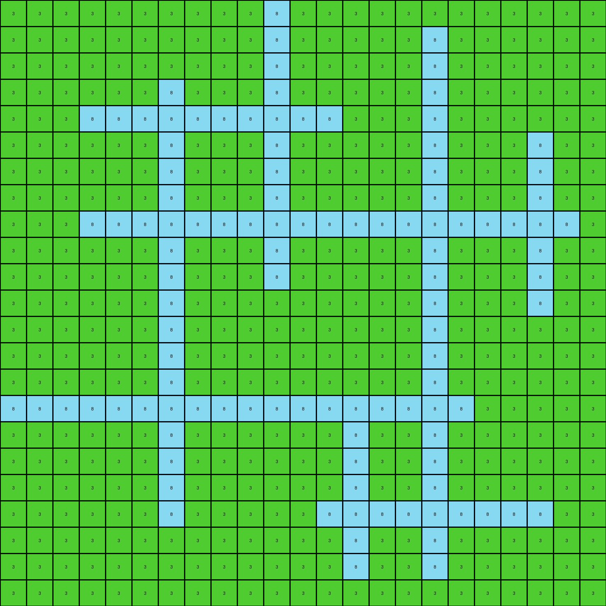
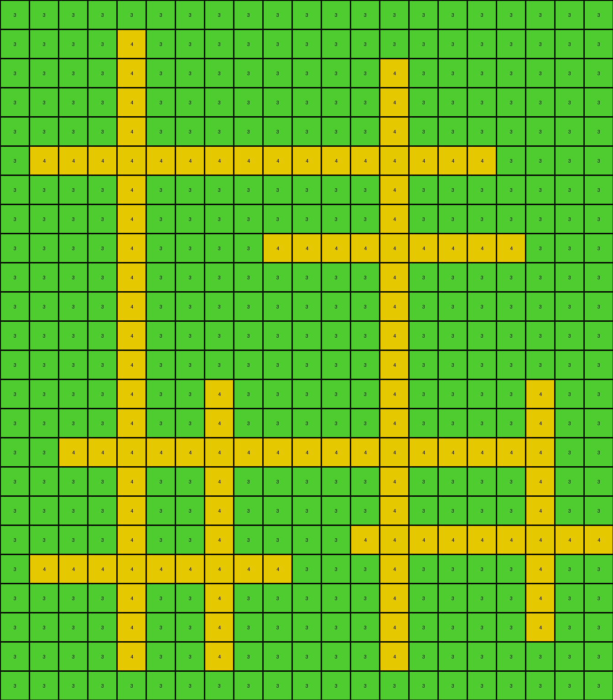

# 7b6016b9 • 004 • refine_coder

---

Previous Code:
```python
"""
The transformation involves identifying azure shapes, filling their interiors with red, and changing the white background to green.
"""

import numpy as np

def get_objects(grid, color):
    """
    Finds objects of a specific color in the grid.

    Args:
        grid: The input grid (NumPy array).
        color: The color of the objects to find.

    Returns:
        A list of objects, where each object is a set of (row, col) coordinates.
    """
    objects = []
    visited = set()
    rows, cols = grid.shape

    def dfs(row, col, current_object):
        if (
            row < 0
            or row >= rows
            or col < 0
            or col >= cols
            or grid[row, col] != color
            or (row, col) in visited
        ):
            return
        visited.add((row, col))
        current_object.add((row, col))
        dfs(row + 1, col, current_object)
        dfs(row - 1, col, current_object)
        dfs(row, col + 1, current_object)
        dfs(row, col - 1, current_object)

    for row in range(rows):
        for col in range(cols):
            if grid[row, col] == color and (row, col) not in visited:
                current_object = set()
                dfs(row, col, current_object)
                objects.append(current_object)
    return objects

def fill_interior(grid, objects, fill_color):
    """
    Fills the interior of the objects with the specified color.
    """
    rows, cols = grid.shape
    output_grid = np.copy(grid)

    for obj in objects:
        #find bounding box
        min_row = min(r for r, c in obj)
        max_row = max(r for r, c in obj)
        min_col = min(c for r, c in obj)
        max_col = max(c for r, c in obj)

        for r in range(min_row + 1, max_row):
          for c in range(min_col+1,max_col):
            #check if cell is inside object
            if (r,c) not in obj: #must be interior
               #check all neighbors, if all neighbors exists and either are the object color or the fill, then fill
                neighbors = [(r + 1, c), (r - 1, c), (r, c + 1), (r, c - 1)]
                valid_neighbors = all(0 <= nr < rows and 0 <= nc < cols for nr, nc in neighbors)

                if valid_neighbors:
                  neighbor_colors = [output_grid[nr,nc] for nr, nc in neighbors]
                  if all(color == 8 or color == 2 for color in neighbor_colors):
                    output_grid[r,c] = fill_color
    return output_grid

def transform(input_grid):
    # initialize output_grid
    output_grid = np.copy(input_grid)

    # change white background to green
    output_grid[output_grid == 0] = 3

    # Find azure shapes
    azure_objects = get_objects(input_grid, 8)

    # Fill interiors of azure objects with red
    output_grid = fill_interior(output_grid, azure_objects, 2)


    return output_grid
```

Train Set Results:

## Example 1:

Input:
```
0 0 0 0 0 0 0 0 0 0 8 0 0 0 0 0 0 0 0 0 0 0 0
0 0 0 0 0 0 0 0 0 0 8 0 0 0 0 0 8 0 0 0 0 0 0
0 0 0 0 0 0 0 0 0 0 8 0 0 0 0 0 8 0 0 0 0 0 0
0 0 0 0 0 0 8 0 0 0 8 0 0 0 0 0 8 0 0 0 0 0 0
0 0 0 8 8 8 8 8 8 8 8 8 8 0 0 0 8 0 0 0 0 0 0
0 0 0 0 0 0 8 0 0 0 8 0 0 0 0 0 8 0 0 0 8 0 0
0 0 0 0 0 0 8 0 0 0 8 0 0 0 0 0 8 0 0 0 8 0 0
0 0 0 0 0 0 8 0 0 0 8 0 0 0 0 0 8 0 0 0 8 0 0
0 0 0 8 8 8 8 8 8 8 8 8 8 8 8 8 8 8 8 8 8 8 0
0 0 0 0 0 0 8 0 0 0 8 0 0 0 0 0 8 0 0 0 8 0 0
0 0 0 0 0 0 8 0 0 0 8 0 0 0 0 0 8 0 0 0 8 0 0
0 0 0 0 0 0 8 0 0 0 0 0 0 0 0 0 8 0 0 0 8 0 0
0 0 0 0 0 0 8 0 0 0 0 0 0 0 0 0 8 0 0 0 0 0 0
0 0 0 0 0 0 8 0 0 0 0 0 0 0 0 0 8 0 0 0 0 0 0
0 0 0 0 0 0 8 0 0 0 0 0 0 0 0 0 8 0 0 0 0 0 0
8 8 8 8 8 8 8 8 8 8 8 8 8 8 8 8 8 8 0 0 0 0 0
0 0 0 0 0 0 8 0 0 0 0 0 0 8 0 0 8 0 0 0 0 0 0
0 0 0 0 0 0 8 0 0 0 0 0 0 8 0 0 8 0 0 0 0 0 0
0 0 0 0 0 0 8 0 0 0 0 0 0 8 0 0 8 0 0 0 0 0 0
0 0 0 0 0 0 8 0 0 0 0 0 8 8 8 8 8 8 8 8 8 0 0
0 0 0 0 0 0 0 0 0 0 0 0 0 8 0 0 8 0 0 0 0 0 0
0 0 0 0 0 0 0 0 0 0 0 0 0 8 0 0 8 0 0 0 0 0 0
0 0 0 0 0 0 0 0 0 0 0 0 0 0 0 0 0 0 0 0 0 0 0
```
Expected Output:
```
3 3 3 3 3 3 3 3 3 3 8 3 3 3 3 3 3 3 3 3 3 3 3
3 3 3 3 3 3 3 3 3 3 8 3 3 3 3 3 8 3 3 3 3 3 3
3 3 3 3 3 3 3 3 3 3 8 3 3 3 3 3 8 3 3 3 3 3 3
3 3 3 3 3 3 8 3 3 3 8 3 3 3 3 3 8 3 3 3 3 3 3
3 3 3 8 8 8 8 8 8 8 8 8 8 3 3 3 8 3 3 3 3 3 3
3 3 3 3 3 3 8 2 2 2 8 3 3 3 3 3 8 3 3 3 8 3 3
3 3 3 3 3 3 8 2 2 2 8 3 3 3 3 3 8 3 3 3 8 3 3
3 3 3 3 3 3 8 2 2 2 8 3 3 3 3 3 8 3 3 3 8 3 3
3 3 3 8 8 8 8 8 8 8 8 8 8 8 8 8 8 8 8 8 8 8 3
3 3 3 3 3 3 8 2 2 2 8 2 2 2 2 2 8 3 3 3 8 3 3
3 3 3 3 3 3 8 2 2 2 8 2 2 2 2 2 8 3 3 3 8 3 3
3 3 3 3 3 3 8 2 2 2 2 2 2 2 2 2 8 3 3 3 8 3 3
3 3 3 3 3 3 8 2 2 2 2 2 2 2 2 2 8 3 3 3 3 3 3
3 3 3 3 3 3 8 2 2 2 2 2 2 2 2 2 8 3 3 3 3 3 3
3 3 3 3 3 3 8 2 2 2 2 2 2 2 2 2 8 3 3 3 3 3 3
8 8 8 8 8 8 8 8 8 8 8 8 8 8 8 8 8 8 3 3 3 3 3
3 3 3 3 3 3 8 3 3 3 3 3 3 8 2 2 8 3 3 3 3 3 3
3 3 3 3 3 3 8 3 3 3 3 3 3 8 2 2 8 3 3 3 3 3 3
3 3 3 3 3 3 8 3 3 3 3 3 3 8 2 2 8 3 3 3 3 3 3
3 3 3 3 3 3 8 3 3 3 3 3 8 8 8 8 8 8 8 8 8 3 3
3 3 3 3 3 3 3 3 3 3 3 3 3 8 3 3 8 3 3 3 3 3 3
3 3 3 3 3 3 3 3 3 3 3 3 3 8 3 3 8 3 3 3 3 3 3
3 3 3 3 3 3 3 3 3 3 3 3 3 3 3 3 3 3 3 3 3 3 3
```
Transformed Output:
```
3 3 3 3 3 3 3 3 3 3 8 3 3 3 3 3 3 3 3 3 3 3 3
3 3 3 3 3 3 3 3 3 3 8 3 3 3 3 3 8 3 3 3 3 3 3
3 3 3 3 3 3 3 3 3 3 8 3 3 3 3 3 8 3 3 3 3 3 3
3 3 3 3 3 3 8 3 3 3 8 3 3 3 3 3 8 3 3 3 3 3 3
3 3 3 8 8 8 8 8 8 8 8 8 8 3 3 3 8 3 3 3 3 3 3
3 3 3 3 3 3 8 3 3 3 8 3 3 3 3 3 8 3 3 3 8 3 3
3 3 3 3 3 3 8 3 3 3 8 3 3 3 3 3 8 3 3 3 8 3 3
3 3 3 3 3 3 8 3 3 3 8 3 3 3 3 3 8 3 3 3 8 3 3
3 3 3 8 8 8 8 8 8 8 8 8 8 8 8 8 8 8 8 8 8 8 3
3 3 3 3 3 3 8 3 3 3 8 3 3 3 3 3 8 3 3 3 8 3 3
3 3 3 3 3 3 8 3 3 3 8 3 3 3 3 3 8 3 3 3 8 3 3
3 3 3 3 3 3 8 3 3 3 3 3 3 3 3 3 8 3 3 3 8 3 3
3 3 3 3 3 3 8 3 3 3 3 3 3 3 3 3 8 3 3 3 3 3 3
3 3 3 3 3 3 8 3 3 3 3 3 3 3 3 3 8 3 3 3 3 3 3
3 3 3 3 3 3 8 3 3 3 3 3 3 3 3 3 8 3 3 3 3 3 3
8 8 8 8 8 8 8 8 8 8 8 8 8 8 8 8 8 8 3 3 3 3 3
3 3 3 3 3 3 8 3 3 3 3 3 3 8 3 3 8 3 3 3 3 3 3
3 3 3 3 3 3 8 3 3 3 3 3 3 8 3 3 8 3 3 3 3 3 3
3 3 3 3 3 3 8 3 3 3 3 3 3 8 3 3 8 3 3 3 3 3 3
3 3 3 3 3 3 8 3 3 3 3 3 8 8 8 8 8 8 8 8 8 3 3
3 3 3 3 3 3 3 3 3 3 3 3 3 8 3 3 8 3 3 3 3 3 3
3 3 3 3 3 3 3 3 3 3 3 3 3 8 3 3 8 3 3 3 3 3 3
3 3 3 3 3 3 3 3 3 3 3 3 3 3 3 3 3 3 3 3 3 3 3
```

match: False
pixels_off: 67
size_correct: True
color_palette_correct: True
correct_pixel_counts: False

## Example 2:

Input:
```
0 0 0 0 0 0 0 0 0 0 0 0 0 0 0 0 0 0 0 0 0 0 0 0 0
0 0 0 0 1 0 0 0 0 0 0 0 0 0 0 0 1 0 0 0 0 0 0 0 0
0 0 0 0 1 0 0 0 0 0 0 0 0 0 0 0 1 0 0 0 0 0 0 0 0
1 1 1 1 1 1 1 1 1 1 1 1 1 1 1 1 1 1 1 1 1 1 1 1 1
0 0 0 0 1 0 0 0 0 0 1 0 0 0 0 0 1 0 0 0 0 0 0 0 0
0 0 0 0 1 0 0 0 0 0 1 0 0 0 0 0 1 0 0 0 0 0 0 0 0
0 0 0 0 1 0 0 0 0 0 1 0 0 0 0 0 1 0 0 0 0 0 0 0 0
0 0 0 0 1 0 0 0 1 1 1 1 1 1 1 1 1 1 1 1 0 0 0 0 0
0 0 0 0 1 0 0 0 0 0 1 0 0 0 0 0 1 0 0 0 0 0 0 0 0
0 0 0 0 1 0 0 0 0 0 1 0 0 0 0 0 1 0 0 0 0 0 0 0 0
0 0 0 0 1 0 0 0 0 0 1 0 0 0 0 0 1 0 0 0 0 0 0 0 0
0 0 0 0 1 0 0 0 0 0 1 0 0 0 0 0 1 0 0 0 0 0 0 0 0
0 1 1 1 1 1 1 1 1 1 1 1 1 0 0 0 1 0 0 0 0 0 0 0 0
0 0 0 0 1 0 0 0 0 0 1 0 0 0 0 0 1 0 0 0 0 0 0 0 0
0 0 0 0 1 0 0 0 0 0 1 0 0 0 0 0 1 0 0 0 0 0 0 0 0
0 0 0 0 1 0 0 0 0 0 1 0 0 0 0 0 1 0 0 0 0 0 0 0 0
0 0 0 0 1 0 0 0 0 0 1 0 0 0 1 1 1 1 1 1 1 0 0 0 0
0 0 0 0 1 0 0 0 0 0 1 0 0 0 0 0 1 0 0 0 0 0 0 0 0
0 0 0 0 1 0 0 0 0 0 1 0 0 0 0 0 1 0 0 0 0 0 0 0 0
0 0 0 0 0 0 0 0 0 0 1 0 0 0 0 0 1 0 0 0 0 0 0 0 0
0 0 0 0 0 0 0 0 0 0 0 0 0 0 0 0 0 0 0 0 0 0 0 0 0
0 0 0 0 0 0 0 0 0 0 0 0 0 0 0 0 0 0 0 0 0 0 0 0 0
```
Expected Output:
```
3 3 3 3 3 3 3 3 3 3 3 3 3 3 3 3 3 3 3 3 3 3 3 3 3
3 3 3 3 1 3 3 3 3 3 3 3 3 3 3 3 1 3 3 3 3 3 3 3 3
3 3 3 3 1 3 3 3 3 3 3 3 3 3 3 3 1 3 3 3 3 3 3 3 3
1 1 1 1 1 1 1 1 1 1 1 1 1 1 1 1 1 1 1 1 1 1 1 1 1
3 3 3 3 1 2 2 2 2 2 1 2 2 2 2 2 1 3 3 3 3 3 3 3 3
3 3 3 3 1 2 2 2 2 2 1 2 2 2 2 2 1 3 3 3 3 3 3 3 3
3 3 3 3 1 2 2 2 2 2 1 2 2 2 2 2 1 3 3 3 3 3 3 3 3
3 3 3 3 1 2 2 2 1 1 1 1 1 1 1 1 1 1 1 1 3 3 3 3 3
3 3 3 3 1 2 2 2 2 2 1 3 3 3 3 3 1 3 3 3 3 3 3 3 3
3 3 3 3 1 2 2 2 2 2 1 3 3 3 3 3 1 3 3 3 3 3 3 3 3
3 3 3 3 1 2 2 2 2 2 1 3 3 3 3 3 1 3 3 3 3 3 3 3 3
3 3 3 3 1 2 2 2 2 2 1 3 3 3 3 3 1 3 3 3 3 3 3 3 3
3 1 1 1 1 1 1 1 1 1 1 1 1 3 3 3 1 3 3 3 3 3 3 3 3
3 3 3 3 1 3 3 3 3 3 1 3 3 3 3 3 1 3 3 3 3 3 3 3 3
3 3 3 3 1 3 3 3 3 3 1 3 3 3 3 3 1 3 3 3 3 3 3 3 3
3 3 3 3 1 3 3 3 3 3 1 3 3 3 3 3 1 3 3 3 3 3 3 3 3
3 3 3 3 1 3 3 3 3 3 1 3 3 3 1 1 1 1 1 1 1 3 3 3 3
3 3 3 3 1 3 3 3 3 3 1 3 3 3 3 3 1 3 3 3 3 3 3 3 3
3 3 3 3 1 3 3 3 3 3 1 3 3 3 3 3 1 3 3 3 3 3 3 3 3
3 3 3 3 3 3 3 3 3 3 1 3 3 3 3 3 1 3 3 3 3 3 3 3 3
3 3 3 3 3 3 3 3 3 3 3 3 3 3 3 3 3 3 3 3 3 3 3 3 3
3 3 3 3 3 3 3 3 3 3 3 3 3 3 3 3 3 3 3 3 3 3 3 3 3
```
Transformed Output:
```
3 3 3 3 3 3 3 3 3 3 3 3 3 3 3 3 3 3 3 3 3 3 3 3 3
3 3 3 3 1 3 3 3 3 3 3 3 3 3 3 3 1 3 3 3 3 3 3 3 3
3 3 3 3 1 3 3 3 3 3 3 3 3 3 3 3 1 3 3 3 3 3 3 3 3
1 1 1 1 1 1 1 1 1 1 1 1 1 1 1 1 1 1 1 1 1 1 1 1 1
3 3 3 3 1 3 3 3 3 3 1 3 3 3 3 3 1 3 3 3 3 3 3 3 3
3 3 3 3 1 3 3 3 3 3 1 3 3 3 3 3 1 3 3 3 3 3 3 3 3
3 3 3 3 1 3 3 3 3 3 1 3 3 3 3 3 1 3 3 3 3 3 3 3 3
3 3 3 3 1 3 3 3 1 1 1 1 1 1 1 1 1 1 1 1 3 3 3 3 3
3 3 3 3 1 3 3 3 3 3 1 3 3 3 3 3 1 3 3 3 3 3 3 3 3
3 3 3 3 1 3 3 3 3 3 1 3 3 3 3 3 1 3 3 3 3 3 3 3 3
3 3 3 3 1 3 3 3 3 3 1 3 3 3 3 3 1 3 3 3 3 3 3 3 3
3 3 3 3 1 3 3 3 3 3 1 3 3 3 3 3 1 3 3 3 3 3 3 3 3
3 1 1 1 1 1 1 1 1 1 1 1 1 3 3 3 1 3 3 3 3 3 3 3 3
3 3 3 3 1 3 3 3 3 3 1 3 3 3 3 3 1 3 3 3 3 3 3 3 3
3 3 3 3 1 3 3 3 3 3 1 3 3 3 3 3 1 3 3 3 3 3 3 3 3
3 3 3 3 1 3 3 3 3 3 1 3 3 3 3 3 1 3 3 3 3 3 3 3 3
3 3 3 3 1 3 3 3 3 3 1 3 3 3 1 1 1 1 1 1 1 3 3 3 3
3 3 3 3 1 3 3 3 3 3 1 3 3 3 3 3 1 3 3 3 3 3 3 3 3
3 3 3 3 1 3 3 3 3 3 1 3 3 3 3 3 1 3 3 3 3 3 3 3 3
3 3 3 3 3 3 3 3 3 3 1 3 3 3 3 3 1 3 3 3 3 3 3 3 3
3 3 3 3 3 3 3 3 3 3 3 3 3 3 3 3 3 3 3 3 3 3 3 3 3
3 3 3 3 3 3 3 3 3 3 3 3 3 3 3 3 3 3 3 3 3 3 3 3 3
```

match: False
pixels_off: 53
size_correct: True
color_palette_correct: True
correct_pixel_counts: False

## Example 3:

Input:
```
0 0 0 0 0 0 0 0 0 0 0 0 0 0 0 0 0 0 0 0 0
0 0 0 0 4 0 0 0 0 0 0 0 0 0 0 0 0 0 0 0 0
0 0 0 0 4 0 0 0 0 0 0 0 0 4 0 0 0 0 0 0 0
0 0 0 0 4 0 0 0 0 0 0 0 0 4 0 0 0 0 0 0 0
0 0 0 0 4 0 0 0 0 0 0 0 0 4 0 0 0 0 0 0 0
0 4 4 4 4 4 4 4 4 4 4 4 4 4 4 4 4 0 0 0 0
0 0 0 0 4 0 0 0 0 0 0 0 0 4 0 0 0 0 0 0 0
0 0 0 0 4 0 0 0 0 0 0 0 0 4 0 0 0 0 0 0 0
0 0 0 0 4 0 0 0 0 4 4 4 4 4 4 4 4 4 0 0 0
0 0 0 0 4 0 0 0 0 0 0 0 0 4 0 0 0 0 0 0 0
0 0 0 0 4 0 0 0 0 0 0 0 0 4 0 0 0 0 0 0 0
0 0 0 0 4 0 0 0 0 0 0 0 0 4 0 0 0 0 0 0 0
0 0 0 0 4 0 0 0 0 0 0 0 0 4 0 0 0 0 0 0 0
0 0 0 0 4 0 0 4 0 0 0 0 0 4 0 0 0 0 4 0 0
0 0 0 0 4 0 0 4 0 0 0 0 0 4 0 0 0 0 4 0 0
0 0 4 4 4 4 4 4 4 4 4 4 4 4 4 4 4 4 4 0 0
0 0 0 0 4 0 0 4 0 0 0 0 0 4 0 0 0 0 4 0 0
0 0 0 0 4 0 0 4 0 0 0 0 0 4 0 0 0 0 4 0 0
0 0 0 0 4 0 0 4 0 0 0 0 4 4 4 4 4 4 4 4 4
0 4 4 4 4 4 4 4 4 4 0 0 0 4 0 0 0 0 4 0 0
0 0 0 0 4 0 0 4 0 0 0 0 0 4 0 0 0 0 4 0 0
0 0 0 0 4 0 0 4 0 0 0 0 0 4 0 0 0 0 4 0 0
0 0 0 0 4 0 0 4 0 0 0 0 0 4 0 0 0 0 0 0 0
0 0 0 0 0 0 0 0 0 0 0 0 0 0 0 0 0 0 0 0 0
```
Expected Output:
```
3 3 3 3 3 3 3 3 3 3 3 3 3 3 3 3 3 3 3 3 3
3 3 3 3 4 3 3 3 3 3 3 3 3 3 3 3 3 3 3 3 3
3 3 3 3 4 3 3 3 3 3 3 3 3 4 3 3 3 3 3 3 3
3 3 3 3 4 3 3 3 3 3 3 3 3 4 3 3 3 3 3 3 3
3 3 3 3 4 3 3 3 3 3 3 3 3 4 3 3 3 3 3 3 3
3 4 4 4 4 4 4 4 4 4 4 4 4 4 4 4 4 3 3 3 3
3 3 3 3 4 2 2 2 2 2 2 2 2 4 3 3 3 3 3 3 3
3 3 3 3 4 2 2 2 2 2 2 2 2 4 3 3 3 3 3 3 3
3 3 3 3 4 2 2 2 2 4 4 4 4 4 4 4 4 4 3 3 3
3 3 3 3 4 2 2 2 2 2 2 2 2 4 3 3 3 3 3 3 3
3 3 3 3 4 2 2 2 2 2 2 2 2 4 3 3 3 3 3 3 3
3 3 3 3 4 2 2 2 2 2 2 2 2 4 3 3 3 3 3 3 3
3 3 3 3 4 2 2 2 2 2 2 2 2 4 3 3 3 3 3 3 3
3 3 3 3 4 2 2 4 2 2 2 2 2 4 3 3 3 3 4 3 3
3 3 3 3 4 2 2 4 2 2 2 2 2 4 3 3 3 3 4 3 3
3 3 4 4 4 4 4 4 4 4 4 4 4 4 4 4 4 4 4 3 3
3 3 3 3 4 2 2 4 3 3 3 3 3 4 2 2 2 2 4 3 3
3 3 3 3 4 2 2 4 3 3 3 3 3 4 2 2 2 2 4 3 3
3 3 3 3 4 2 2 4 3 3 3 3 4 4 4 4 4 4 4 4 4
3 4 4 4 4 4 4 4 4 4 3 3 3 4 3 3 3 3 4 3 3
3 3 3 3 4 3 3 4 3 3 3 3 3 4 3 3 3 3 4 3 3
3 3 3 3 4 3 3 4 3 3 3 3 3 4 3 3 3 3 4 3 3
3 3 3 3 4 3 3 4 3 3 3 3 3 4 3 3 3 3 3 3 3
3 3 3 3 3 3 3 3 3 3 3 3 3 3 3 3 3 3 3 3 3
```
Transformed Output:
```
3 3 3 3 3 3 3 3 3 3 3 3 3 3 3 3 3 3 3 3 3
3 3 3 3 4 3 3 3 3 3 3 3 3 3 3 3 3 3 3 3 3
3 3 3 3 4 3 3 3 3 3 3 3 3 4 3 3 3 3 3 3 3
3 3 3 3 4 3 3 3 3 3 3 3 3 4 3 3 3 3 3 3 3
3 3 3 3 4 3 3 3 3 3 3 3 3 4 3 3 3 3 3 3 3
3 4 4 4 4 4 4 4 4 4 4 4 4 4 4 4 4 3 3 3 3
3 3 3 3 4 3 3 3 3 3 3 3 3 4 3 3 3 3 3 3 3
3 3 3 3 4 3 3 3 3 3 3 3 3 4 3 3 3 3 3 3 3
3 3 3 3 4 3 3 3 3 4 4 4 4 4 4 4 4 4 3 3 3
3 3 3 3 4 3 3 3 3 3 3 3 3 4 3 3 3 3 3 3 3
3 3 3 3 4 3 3 3 3 3 3 3 3 4 3 3 3 3 3 3 3
3 3 3 3 4 3 3 3 3 3 3 3 3 4 3 3 3 3 3 3 3
3 3 3 3 4 3 3 3 3 3 3 3 3 4 3 3 3 3 3 3 3
3 3 3 3 4 3 3 4 3 3 3 3 3 4 3 3 3 3 4 3 3
3 3 3 3 4 3 3 4 3 3 3 3 3 4 3 3 3 3 4 3 3
3 3 4 4 4 4 4 4 4 4 4 4 4 4 4 4 4 4 4 3 3
3 3 3 3 4 3 3 4 3 3 3 3 3 4 3 3 3 3 4 3 3
3 3 3 3 4 3 3 4 3 3 3 3 3 4 3 3 3 3 4 3 3
3 3 3 3 4 3 3 4 3 3 3 3 4 4 4 4 4 4 4 4 4
3 4 4 4 4 4 4 4 4 4 3 3 3 4 3 3 3 3 4 3 3
3 3 3 3 4 3 3 4 3 3 3 3 3 4 3 3 3 3 4 3 3
3 3 3 3 4 3 3 4 3 3 3 3 3 4 3 3 3 3 4 3 3
3 3 3 3 4 3 3 4 3 3 3 3 3 4 3 3 3 3 3 3 3
3 3 3 3 3 3 3 3 3 3 3 3 3 3 3 3 3 3 3 3 3
```

match: False
pixels_off: 80
size_correct: True
color_palette_correct: True
correct_pixel_counts: False
Okay, let's analyze the results and refine the natural language program.

**General Assessment:**

The initial strategy of identifying azure (8) shapes and filling their interiors with red (2), while also changing the white (0) background to green (3) was partially correct. However, the filling algorithm is flawed, as it doesn't correctly identify and fill all interiors. It's also clear that color 8 is not the only color that this rule applies, as is apparent by Examples 2 and 3, which use colors 1 and 4, respectively. The algorithm needs a more robust way to detect enclosed regions regardless of their shape or the color used. The consistent error is the "filling" isn't happening as expected. Many enclosed pixels are not changed.

**Strategy for Resolving Errors:**

1.  **Improve Interior Detection:** The current neighbor-checking method is insufficient. A more robust approach, such as a flood-fill algorithm or scanline fill, is necessary to correctly identify and fill interiors.
2.  **Generalize Color Application:** The concept is not related to a single color. Generalize this to work with any color that forms an enclosed shape.

**Example Metrics and Analysis:**

Here, I'll summarize observations from each example and use my understanding to build up to the revised Natural Language Program

**Example 1:**

*   **Input:** Contains multiple azure (8) shapes, some of which have interiors. The background is white (0).
*   **Expected Output:** Azure shapes should have their interiors filled with red (2). The background should be green (3).
*   **Actual Output:** Some interiors are filled, but others are not. The background is correctly changed to green.
*   **Pixels Off:** 67
*   **Observations:** The fill algorithm missed some interior pixels of the azure shapes. The background transformation is successful.

**Example 2:**

*   **Input:** Similar to Example 1, but with blue (1) shapes and a white (0) background.
*   **Expected Output:** Blue shapes' interiors should be filled with red (2), background to green (3).
*    **Actual Output:** Some interiors are filled, some are not. Background is correctly changed.
*   **Pixels Off:** 53
*   **Observations:** Confirms the issue isn't specific to azure; the fill algorithm is generally flawed.

**Example 3:**

*   **Input:** Uses yellow (4) shapes.
*   **Expected Output:** Yellow shapes filled with red, background to green.
*    **Actual Output:** Some interiors are filled, some are not. Background is correctly changed.
*   **Pixels Off:** 80
*   **Observations:** Further confirms the generalized nature of the problem across colors.

**YAML Facts:**

```yaml
examples:
  - example_id: 1
    objects:
      - color: 8  # Azure
        shape: irregular
        action: fill_interior
        fill_color: 2  # Red
    background:
      original_color: 0  # White
      new_color: 3  # Green

  - example_id: 2
    objects:
      - color: 1  # Blue
        shape: irregular
        action: fill_interior
        fill_color: 2  # Red
    background:
      original_color: 0  # White
      new_color: 3  # Green

  - example_id: 3
    objects:
      - color: 4  # Yellow
        shape: irregular
        action: fill_interior
        fill_color: 2  # Red
    background:
      original_color: 0  # White
      new_color: 3  # Green

```

**Natural Language Program:**

1.  **Background Transformation:** Change all white (0) pixels in the input grid to green (3).
2.  **Object Identification:** Identify all closed objects. A closed object consists of a contiguous region of pixels of the same color, fully enclosing one or more pixels of a *different* color. The color of the outer object can be any color other than the background color.
3. **Interior Filling:** For each identified closed object, replace the color of all pixels within the enclosed region with red (2). The enclosed pixels will be of *any* color other than the enclosing object color.

This improved natural language program now uses terms that should be easier to apply as we move to improve the python code. "closed object" and "enclosed region" are better for reasoning about.

**INSTRUCTIONS**

- generate a Python module to represent the natural language program 
- follow the template below
- all common math and science libraries are available
- create docstring only at top - but comment the workflow in the function
- use helper functions for common operations like finding objects, counting,
  measuring, moving, etc. 

remember - we are working iteratively - so this code will inform your future
self as we converge on the solution

*template:*

```python
"""
{{ natural language description of the transformation rule }}
"""

{{ imports }}

def transform(input_grid):
    # initialize output_grid

    # change output pixels 

    return output_grid

```
