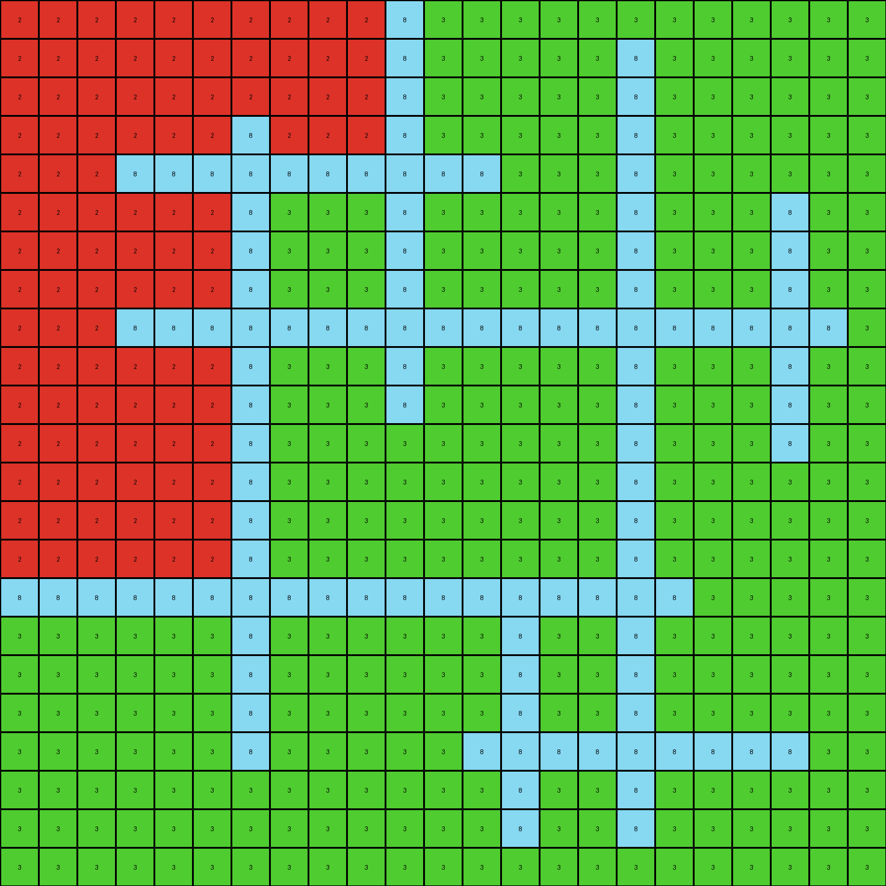
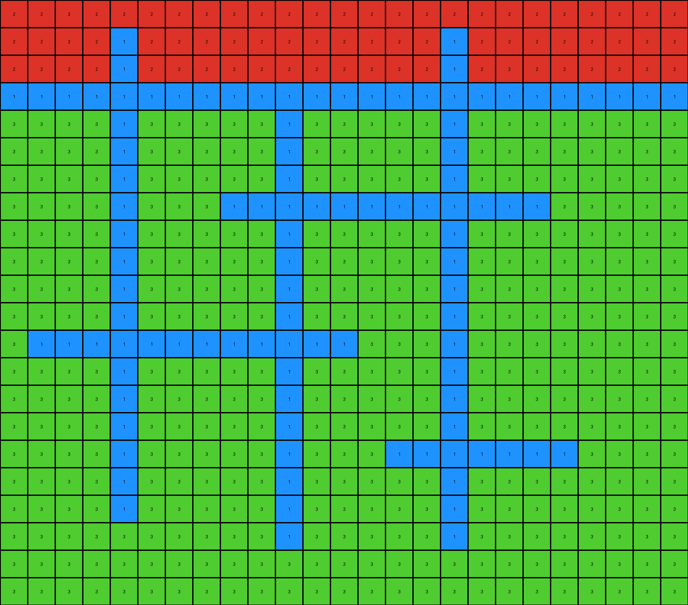
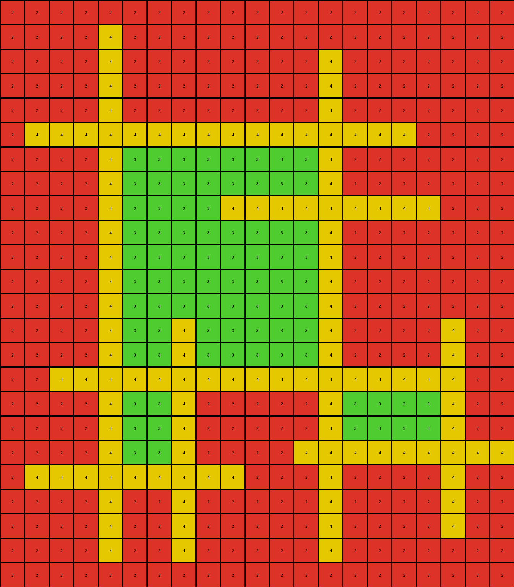

# 7b6016b9 • 005 • refine_dreamer

---


Previous Code:
```python
"""
1.  **Background Transformation:** Change all white (0) pixels in the input grid to green (3).
2.  **Object Identification:** Identify all closed objects. A closed object consists of a contiguous region of pixels of the same color, fully enclosing one or more pixels of a *different* color. The color of the outer object can be any color other than the background color.
3. **Interior Filling:** For each identified closed object, replace the color of all pixels within the enclosed region with red (2). The enclosed pixels will be of *any* color other than the enclosing object color.
"""

import numpy as np

def get_objects(grid):
    """
    Finds objects of all colors in the grid.

    Args:
        grid: The input grid (NumPy array).

    Returns:
        A dictionary of objects, where keys are colors and values are lists of objects.
        Each object is a set of (row, col) coordinates.
    """
    objects = {}
    visited = set()
    rows, cols = grid.shape

    def dfs(row, col, color, current_object):
        if (
            row < 0
            or row >= rows
            or col < 0
            or col >= cols
            or grid[row, col] != color
            or (row, col) in visited
        ):
            return
        visited.add((row, col))
        current_object.add((row, col))
        dfs(row + 1, col, color, current_object)
        dfs(row - 1, col, color, current_object)
        dfs(row, col + 1, color, current_object)
        dfs(row, col - 1, color, current_object)

    for row in range(rows):
        for col in range(cols):
            color = grid[row, col]
            if (row, col) not in visited:
                current_object = set()
                dfs(row, col, color, current_object)
                if color not in objects:
                    objects[color] = []
                objects[color].append(current_object)
    return objects

def flood_fill(grid, start_row, start_col, target_color, replacement_color):
    """
    Performs a flood fill operation on the grid.
    """
    rows, cols = grid.shape
    if target_color == replacement_color:
      return grid
    
    def get_neighbors(r, c):
        neighbors = []
        if r > 0:
            neighbors.append((r-1,c))
        if r < rows - 1:
            neighbors.append((r+1, c))
        if c > 0:
          neighbors.append((r, c - 1))
        if c < cols - 1:
          neighbors.append((r, c+1))
        return neighbors

    q = [(start_row, start_col)]
    visited = set()
    output_grid = np.copy(grid)

    while q:
      r, c = q.pop()

      if (r,c) in visited or output_grid[r,c] != target_color:
        continue

      visited.add((r,c))
      output_grid[r,c] = replacement_color

      for nr, nc in get_neighbors(r,c):
        q.append((nr,nc))
    return output_grid
        

def is_closed_object(grid, object_pixels, object_color):
    """
    Checks if an object is a closed object (encloses other colors).
    """
    rows, cols = grid.shape
    # Find bounding box
    min_row = min(r for r, c in object_pixels)
    max_row = max(r for r, c in object_pixels)
    min_col = min(c for r, c in object_pixels)
    max_col = max(c for r, c in object_pixels)


    for r in range(min_row, max_row + 1):
        for c in range(min_col, max_col + 1):
            if (r, c) not in object_pixels:
                # Check if this pixel is enclosed by object
                if grid[r,c] != object_color:
                    return True

    return False

def transform(input_grid):
    # initialize output_grid
    output_grid = np.copy(input_grid)

    # change white background to green
    output_grid[output_grid == 0] = 3

    # Find all objects
    objects_by_color = get_objects(output_grid)

    # Iterate through objects and fill interiors
    for color, objects in objects_by_color.items():
        if color == 3:  # Skip background color
            continue
        for obj in objects:
            if is_closed_object(output_grid, obj, color):
              #find a pixel within the object to use as the seed for flood_fill
              min_row = min(r for r, c in obj)
              max_row = max(r for r, c in obj)
              min_col = min(c for r, c in obj)
              max_col = max(c for r, c in obj)

              for r in range(min_row + 1, max_row):
                for c in range(min_col+1, max_col):
                  if (r,c) not in obj: #found interior
                    output_grid = flood_fill(output_grid, r, c, output_grid[r,c], 2)
                    break #only fill once per object
                else:
                  continue
                break

    return output_grid
```

Train Set Results:

## Example 1:

Input:
```
0 0 0 0 0 0 0 0 0 0 8 0 0 0 0 0 0 0 0 0 0 0 0
0 0 0 0 0 0 0 0 0 0 8 0 0 0 0 0 8 0 0 0 0 0 0
0 0 0 0 0 0 0 0 0 0 8 0 0 0 0 0 8 0 0 0 0 0 0
0 0 0 0 0 0 8 0 0 0 8 0 0 0 0 0 8 0 0 0 0 0 0
0 0 0 8 8 8 8 8 8 8 8 8 8 0 0 0 8 0 0 0 0 0 0
0 0 0 0 0 0 8 0 0 0 8 0 0 0 0 0 8 0 0 0 8 0 0
0 0 0 0 0 0 8 0 0 0 8 0 0 0 0 0 8 0 0 0 8 0 0
0 0 0 0 0 0 8 0 0 0 8 0 0 0 0 0 8 0 0 0 8 0 0
0 0 0 8 8 8 8 8 8 8 8 8 8 8 8 8 8 8 8 8 8 8 0
0 0 0 0 0 0 8 0 0 0 8 0 0 0 0 0 8 0 0 0 8 0 0
0 0 0 0 0 0 8 0 0 0 8 0 0 0 0 0 8 0 0 0 8 0 0
0 0 0 0 0 0 8 0 0 0 0 0 0 0 0 0 8 0 0 0 8 0 0
0 0 0 0 0 0 8 0 0 0 0 0 0 0 0 0 8 0 0 0 0 0 0
0 0 0 0 0 0 8 0 0 0 0 0 0 0 0 0 8 0 0 0 0 0 0
0 0 0 0 0 0 8 0 0 0 0 0 0 0 0 0 8 0 0 0 0 0 0
8 8 8 8 8 8 8 8 8 8 8 8 8 8 8 8 8 8 0 0 0 0 0
0 0 0 0 0 0 8 0 0 0 0 0 0 8 0 0 8 0 0 0 0 0 0
0 0 0 0 0 0 8 0 0 0 0 0 0 8 0 0 8 0 0 0 0 0 0
0 0 0 0 0 0 8 0 0 0 0 0 0 8 0 0 8 0 0 0 0 0 0
0 0 0 0 0 0 8 0 0 0 0 0 8 8 8 8 8 8 8 8 8 0 0
0 0 0 0 0 0 0 0 0 0 0 0 0 8 0 0 8 0 0 0 0 0 0
0 0 0 0 0 0 0 0 0 0 0 0 0 8 0 0 8 0 0 0 0 0 0
0 0 0 0 0 0 0 0 0 0 0 0 0 0 0 0 0 0 0 0 0 0 0
```
Expected Output:
```
3 3 3 3 3 3 3 3 3 3 8 3 3 3 3 3 3 3 3 3 3 3 3
3 3 3 3 3 3 3 3 3 3 8 3 3 3 3 3 8 3 3 3 3 3 3
3 3 3 3 3 3 3 3 3 3 8 3 3 3 3 3 8 3 3 3 3 3 3
3 3 3 3 3 3 8 3 3 3 8 3 3 3 3 3 8 3 3 3 3 3 3
3 3 3 8 8 8 8 8 8 8 8 8 8 3 3 3 8 3 3 3 3 3 3
3 3 3 3 3 3 8 2 2 2 8 3 3 3 3 3 8 3 3 3 8 3 3
3 3 3 3 3 3 8 2 2 2 8 3 3 3 3 3 8 3 3 3 8 3 3
3 3 3 3 3 3 8 2 2 2 8 3 3 3 3 3 8 3 3 3 8 3 3
3 3 3 8 8 8 8 8 8 8 8 8 8 8 8 8 8 8 8 8 8 8 3
3 3 3 3 3 3 8 2 2 2 8 2 2 2 2 2 8 3 3 3 8 3 3
3 3 3 3 3 3 8 2 2 2 8 2 2 2 2 2 8 3 3 3 8 3 3
3 3 3 3 3 3 8 2 2 2 2 2 2 2 2 2 8 3 3 3 8 3 3
3 3 3 3 3 3 8 2 2 2 2 2 2 2 2 2 8 3 3 3 3 3 3
3 3 3 3 3 3 8 2 2 2 2 2 2 2 2 2 8 3 3 3 3 3 3
3 3 3 3 3 3 8 2 2 2 2 2 2 2 2 2 8 3 3 3 3 3 3
8 8 8 8 8 8 8 8 8 8 8 8 8 8 8 8 8 8 3 3 3 3 3
3 3 3 3 3 3 8 3 3 3 3 3 3 8 2 2 8 3 3 3 3 3 3
3 3 3 3 3 3 8 3 3 3 3 3 3 8 2 2 8 3 3 3 3 3 3
3 3 3 3 3 3 8 3 3 3 3 3 3 8 2 2 8 3 3 3 3 3 3
3 3 3 3 3 3 8 3 3 3 3 3 8 8 8 8 8 8 8 8 8 3 3
3 3 3 3 3 3 3 3 3 3 3 3 3 8 3 3 8 3 3 3 3 3 3
3 3 3 3 3 3 3 3 3 3 3 3 3 8 3 3 8 3 3 3 3 3 3
3 3 3 3 3 3 3 3 3 3 3 3 3 3 3 3 3 3 3 3 3 3 3
```
Transformed Output:
```
2 2 2 2 2 2 2 2 2 2 8 3 3 3 3 3 3 3 3 3 3 3 3
2 2 2 2 2 2 2 2 2 2 8 3 3 3 3 3 8 3 3 3 3 3 3
2 2 2 2 2 2 2 2 2 2 8 3 3 3 3 3 8 3 3 3 3 3 3
2 2 2 2 2 2 8 2 2 2 8 3 3 3 3 3 8 3 3 3 3 3 3
2 2 2 8 8 8 8 8 8 8 8 8 8 3 3 3 8 3 3 3 3 3 3
2 2 2 2 2 2 8 3 3 3 8 3 3 3 3 3 8 3 3 3 8 3 3
2 2 2 2 2 2 8 3 3 3 8 3 3 3 3 3 8 3 3 3 8 3 3
2 2 2 2 2 2 8 3 3 3 8 3 3 3 3 3 8 3 3 3 8 3 3
2 2 2 8 8 8 8 8 8 8 8 8 8 8 8 8 8 8 8 8 8 8 3
2 2 2 2 2 2 8 3 3 3 8 3 3 3 3 3 8 3 3 3 8 3 3
2 2 2 2 2 2 8 3 3 3 8 3 3 3 3 3 8 3 3 3 8 3 3
2 2 2 2 2 2 8 3 3 3 3 3 3 3 3 3 8 3 3 3 8 3 3
2 2 2 2 2 2 8 3 3 3 3 3 3 3 3 3 8 3 3 3 3 3 3
2 2 2 2 2 2 8 3 3 3 3 3 3 3 3 3 8 3 3 3 3 3 3
2 2 2 2 2 2 8 3 3 3 3 3 3 3 3 3 8 3 3 3 3 3 3
8 8 8 8 8 8 8 8 8 8 8 8 8 8 8 8 8 8 3 3 3 3 3
3 3 3 3 3 3 8 3 3 3 3 3 3 8 3 3 8 3 3 3 3 3 3
3 3 3 3 3 3 8 3 3 3 3 3 3 8 3 3 8 3 3 3 3 3 3
3 3 3 3 3 3 8 3 3 3 3 3 3 8 3 3 8 3 3 3 3 3 3
3 3 3 3 3 3 8 3 3 3 3 3 8 8 8 8 8 8 8 8 8 3 3
3 3 3 3 3 3 3 3 3 3 3 3 3 8 3 3 8 3 3 3 3 3 3
3 3 3 3 3 3 3 3 3 3 3 3 3 8 3 3 8 3 3 3 3 3 3
3 3 3 3 3 3 3 3 3 3 3 3 3 3 3 3 3 3 3 3 3 3 3
```

match: False
pixels_off: 166
size_correct: True
color_palette_correct: True
correct_pixel_counts: False

## Example 2:

Input:
```
0 0 0 0 0 0 0 0 0 0 0 0 0 0 0 0 0 0 0 0 0 0 0 0 0
0 0 0 0 1 0 0 0 0 0 0 0 0 0 0 0 1 0 0 0 0 0 0 0 0
0 0 0 0 1 0 0 0 0 0 0 0 0 0 0 0 1 0 0 0 0 0 0 0 0
1 1 1 1 1 1 1 1 1 1 1 1 1 1 1 1 1 1 1 1 1 1 1 1 1
0 0 0 0 1 0 0 0 0 0 1 0 0 0 0 0 1 0 0 0 0 0 0 0 0
0 0 0 0 1 0 0 0 0 0 1 0 0 0 0 0 1 0 0 0 0 0 0 0 0
0 0 0 0 1 0 0 0 0 0 1 0 0 0 0 0 1 0 0 0 0 0 0 0 0
0 0 0 0 1 0 0 0 1 1 1 1 1 1 1 1 1 1 1 1 0 0 0 0 0
0 0 0 0 1 0 0 0 0 0 1 0 0 0 0 0 1 0 0 0 0 0 0 0 0
0 0 0 0 1 0 0 0 0 0 1 0 0 0 0 0 1 0 0 0 0 0 0 0 0
0 0 0 0 1 0 0 0 0 0 1 0 0 0 0 0 1 0 0 0 0 0 0 0 0
0 0 0 0 1 0 0 0 0 0 1 0 0 0 0 0 1 0 0 0 0 0 0 0 0
0 1 1 1 1 1 1 1 1 1 1 1 1 0 0 0 1 0 0 0 0 0 0 0 0
0 0 0 0 1 0 0 0 0 0 1 0 0 0 0 0 1 0 0 0 0 0 0 0 0
0 0 0 0 1 0 0 0 0 0 1 0 0 0 0 0 1 0 0 0 0 0 0 0 0
0 0 0 0 1 0 0 0 0 0 1 0 0 0 0 0 1 0 0 0 0 0 0 0 0
0 0 0 0 1 0 0 0 0 0 1 0 0 0 1 1 1 1 1 1 1 0 0 0 0
0 0 0 0 1 0 0 0 0 0 1 0 0 0 0 0 1 0 0 0 0 0 0 0 0
0 0 0 0 1 0 0 0 0 0 1 0 0 0 0 0 1 0 0 0 0 0 0 0 0
0 0 0 0 0 0 0 0 0 0 1 0 0 0 0 0 1 0 0 0 0 0 0 0 0
0 0 0 0 0 0 0 0 0 0 0 0 0 0 0 0 0 0 0 0 0 0 0 0 0
0 0 0 0 0 0 0 0 0 0 0 0 0 0 0 0 0 0 0 0 0 0 0 0 0
```
Expected Output:
```
3 3 3 3 3 3 3 3 3 3 3 3 3 3 3 3 3 3 3 3 3 3 3 3 3
3 3 3 3 1 3 3 3 3 3 3 3 3 3 3 3 1 3 3 3 3 3 3 3 3
3 3 3 3 1 3 3 3 3 3 3 3 3 3 3 3 1 3 3 3 3 3 3 3 3
1 1 1 1 1 1 1 1 1 1 1 1 1 1 1 1 1 1 1 1 1 1 1 1 1
3 3 3 3 1 2 2 2 2 2 1 2 2 2 2 2 1 3 3 3 3 3 3 3 3
3 3 3 3 1 2 2 2 2 2 1 2 2 2 2 2 1 3 3 3 3 3 3 3 3
3 3 3 3 1 2 2 2 2 2 1 2 2 2 2 2 1 3 3 3 3 3 3 3 3
3 3 3 3 1 2 2 2 1 1 1 1 1 1 1 1 1 1 1 1 3 3 3 3 3
3 3 3 3 1 2 2 2 2 2 1 3 3 3 3 3 1 3 3 3 3 3 3 3 3
3 3 3 3 1 2 2 2 2 2 1 3 3 3 3 3 1 3 3 3 3 3 3 3 3
3 3 3 3 1 2 2 2 2 2 1 3 3 3 3 3 1 3 3 3 3 3 3 3 3
3 3 3 3 1 2 2 2 2 2 1 3 3 3 3 3 1 3 3 3 3 3 3 3 3
3 1 1 1 1 1 1 1 1 1 1 1 1 3 3 3 1 3 3 3 3 3 3 3 3
3 3 3 3 1 3 3 3 3 3 1 3 3 3 3 3 1 3 3 3 3 3 3 3 3
3 3 3 3 1 3 3 3 3 3 1 3 3 3 3 3 1 3 3 3 3 3 3 3 3
3 3 3 3 1 3 3 3 3 3 1 3 3 3 3 3 1 3 3 3 3 3 3 3 3
3 3 3 3 1 3 3 3 3 3 1 3 3 3 1 1 1 1 1 1 1 3 3 3 3
3 3 3 3 1 3 3 3 3 3 1 3 3 3 3 3 1 3 3 3 3 3 3 3 3
3 3 3 3 1 3 3 3 3 3 1 3 3 3 3 3 1 3 3 3 3 3 3 3 3
3 3 3 3 3 3 3 3 3 3 1 3 3 3 3 3 1 3 3 3 3 3 3 3 3
3 3 3 3 3 3 3 3 3 3 3 3 3 3 3 3 3 3 3 3 3 3 3 3 3
3 3 3 3 3 3 3 3 3 3 3 3 3 3 3 3 3 3 3 3 3 3 3 3 3
```
Transformed Output:
```
2 2 2 2 2 2 2 2 2 2 2 2 2 2 2 2 2 2 2 2 2 2 2 2 2
2 2 2 2 1 2 2 2 2 2 2 2 2 2 2 2 1 2 2 2 2 2 2 2 2
2 2 2 2 1 2 2 2 2 2 2 2 2 2 2 2 1 2 2 2 2 2 2 2 2
1 1 1 1 1 1 1 1 1 1 1 1 1 1 1 1 1 1 1 1 1 1 1 1 1
3 3 3 3 1 3 3 3 3 3 1 3 3 3 3 3 1 3 3 3 3 3 3 3 3
3 3 3 3 1 3 3 3 3 3 1 3 3 3 3 3 1 3 3 3 3 3 3 3 3
3 3 3 3 1 3 3 3 3 3 1 3 3 3 3 3 1 3 3 3 3 3 3 3 3
3 3 3 3 1 3 3 3 1 1 1 1 1 1 1 1 1 1 1 1 3 3 3 3 3
3 3 3 3 1 3 3 3 3 3 1 3 3 3 3 3 1 3 3 3 3 3 3 3 3
3 3 3 3 1 3 3 3 3 3 1 3 3 3 3 3 1 3 3 3 3 3 3 3 3
3 3 3 3 1 3 3 3 3 3 1 3 3 3 3 3 1 3 3 3 3 3 3 3 3
3 3 3 3 1 3 3 3 3 3 1 3 3 3 3 3 1 3 3 3 3 3 3 3 3
3 1 1 1 1 1 1 1 1 1 1 1 1 3 3 3 1 3 3 3 3 3 3 3 3
3 3 3 3 1 3 3 3 3 3 1 3 3 3 3 3 1 3 3 3 3 3 3 3 3
3 3 3 3 1 3 3 3 3 3 1 3 3 3 3 3 1 3 3 3 3 3 3 3 3
3 3 3 3 1 3 3 3 3 3 1 3 3 3 3 3 1 3 3 3 3 3 3 3 3
3 3 3 3 1 3 3 3 3 3 1 3 3 3 1 1 1 1 1 1 1 3 3 3 3
3 3 3 3 1 3 3 3 3 3 1 3 3 3 3 3 1 3 3 3 3 3 3 3 3
3 3 3 3 1 3 3 3 3 3 1 3 3 3 3 3 1 3 3 3 3 3 3 3 3
3 3 3 3 3 3 3 3 3 3 1 3 3 3 3 3 1 3 3 3 3 3 3 3 3
3 3 3 3 3 3 3 3 3 3 3 3 3 3 3 3 3 3 3 3 3 3 3 3 3
3 3 3 3 3 3 3 3 3 3 3 3 3 3 3 3 3 3 3 3 3 3 3 3 3
```

match: False
pixels_off: 124
size_correct: True
color_palette_correct: True
correct_pixel_counts: False

## Example 3:

Input:
```
0 0 0 0 0 0 0 0 0 0 0 0 0 0 0 0 0 0 0 0 0
0 0 0 0 4 0 0 0 0 0 0 0 0 0 0 0 0 0 0 0 0
0 0 0 0 4 0 0 0 0 0 0 0 0 4 0 0 0 0 0 0 0
0 0 0 0 4 0 0 0 0 0 0 0 0 4 0 0 0 0 0 0 0
0 0 0 0 4 0 0 0 0 0 0 0 0 4 0 0 0 0 0 0 0
0 4 4 4 4 4 4 4 4 4 4 4 4 4 4 4 4 0 0 0 0
0 0 0 0 4 0 0 0 0 0 0 0 0 4 0 0 0 0 0 0 0
0 0 0 0 4 0 0 0 0 0 0 0 0 4 0 0 0 0 0 0 0
0 0 0 0 4 0 0 0 0 4 4 4 4 4 4 4 4 4 0 0 0
0 0 0 0 4 0 0 0 0 0 0 0 0 4 0 0 0 0 0 0 0
0 0 0 0 4 0 0 0 0 0 0 0 0 4 0 0 0 0 0 0 0
0 0 0 0 4 0 0 0 0 0 0 0 0 4 0 0 0 0 0 0 0
0 0 0 0 4 0 0 0 0 0 0 0 0 4 0 0 0 0 0 0 0
0 0 0 0 4 0 0 4 0 0 0 0 0 4 0 0 0 0 4 0 0
0 0 0 0 4 0 0 4 0 0 0 0 0 4 0 0 0 0 4 0 0
0 0 4 4 4 4 4 4 4 4 4 4 4 4 4 4 4 4 4 0 0
0 0 0 0 4 0 0 4 0 0 0 0 0 4 0 0 0 0 4 0 0
0 0 0 0 4 0 0 4 0 0 0 0 0 4 0 0 0 0 4 0 0
0 0 0 0 4 0 0 4 0 0 0 0 4 4 4 4 4 4 4 4 4
0 4 4 4 4 4 4 4 4 4 0 0 0 4 0 0 0 0 4 0 0
0 0 0 0 4 0 0 4 0 0 0 0 0 4 0 0 0 0 4 0 0
0 0 0 0 4 0 0 4 0 0 0 0 0 4 0 0 0 0 4 0 0
0 0 0 0 4 0 0 4 0 0 0 0 0 4 0 0 0 0 0 0 0
0 0 0 0 0 0 0 0 0 0 0 0 0 0 0 0 0 0 0 0 0
```
Expected Output:
```
3 3 3 3 3 3 3 3 3 3 3 3 3 3 3 3 3 3 3 3 3
3 3 3 3 4 3 3 3 3 3 3 3 3 3 3 3 3 3 3 3 3
3 3 3 3 4 3 3 3 3 3 3 3 3 4 3 3 3 3 3 3 3
3 3 3 3 4 3 3 3 3 3 3 3 3 4 3 3 3 3 3 3 3
3 3 3 3 4 3 3 3 3 3 3 3 3 4 3 3 3 3 3 3 3
3 4 4 4 4 4 4 4 4 4 4 4 4 4 4 4 4 3 3 3 3
3 3 3 3 4 2 2 2 2 2 2 2 2 4 3 3 3 3 3 3 3
3 3 3 3 4 2 2 2 2 2 2 2 2 4 3 3 3 3 3 3 3
3 3 3 3 4 2 2 2 2 4 4 4 4 4 4 4 4 4 3 3 3
3 3 3 3 4 2 2 2 2 2 2 2 2 4 3 3 3 3 3 3 3
3 3 3 3 4 2 2 2 2 2 2 2 2 4 3 3 3 3 3 3 3
3 3 3 3 4 2 2 2 2 2 2 2 2 4 3 3 3 3 3 3 3
3 3 3 3 4 2 2 2 2 2 2 2 2 4 3 3 3 3 3 3 3
3 3 3 3 4 2 2 4 2 2 2 2 2 4 3 3 3 3 4 3 3
3 3 3 3 4 2 2 4 2 2 2 2 2 4 3 3 3 3 4 3 3
3 3 4 4 4 4 4 4 4 4 4 4 4 4 4 4 4 4 4 3 3
3 3 3 3 4 2 2 4 3 3 3 3 3 4 2 2 2 2 4 3 3
3 3 3 3 4 2 2 4 3 3 3 3 3 4 2 2 2 2 4 3 3
3 3 3 3 4 2 2 4 3 3 3 3 4 4 4 4 4 4 4 4 4
3 4 4 4 4 4 4 4 4 4 3 3 3 4 3 3 3 3 4 3 3
3 3 3 3 4 3 3 4 3 3 3 3 3 4 3 3 3 3 4 3 3
3 3 3 3 4 3 3 4 3 3 3 3 3 4 3 3 3 3 4 3 3
3 3 3 3 4 3 3 4 3 3 3 3 3 4 3 3 3 3 3 3 3
3 3 3 3 3 3 3 3 3 3 3 3 3 3 3 3 3 3 3 3 3
```
Transformed Output:
```
2 2 2 2 2 2 2 2 2 2 2 2 2 2 2 2 2 2 2 2 2
2 2 2 2 4 2 2 2 2 2 2 2 2 2 2 2 2 2 2 2 2
2 2 2 2 4 2 2 2 2 2 2 2 2 4 2 2 2 2 2 2 2
2 2 2 2 4 2 2 2 2 2 2 2 2 4 2 2 2 2 2 2 2
2 2 2 2 4 2 2 2 2 2 2 2 2 4 2 2 2 2 2 2 2
2 4 4 4 4 4 4 4 4 4 4 4 4 4 4 4 4 2 2 2 2
2 2 2 2 4 3 3 3 3 3 3 3 3 4 2 2 2 2 2 2 2
2 2 2 2 4 3 3 3 3 3 3 3 3 4 2 2 2 2 2 2 2
2 2 2 2 4 3 3 3 3 4 4 4 4 4 4 4 4 4 2 2 2
2 2 2 2 4 3 3 3 3 3 3 3 3 4 2 2 2 2 2 2 2
2 2 2 2 4 3 3 3 3 3 3 3 3 4 2 2 2 2 2 2 2
2 2 2 2 4 3 3 3 3 3 3 3 3 4 2 2 2 2 2 2 2
2 2 2 2 4 3 3 3 3 3 3 3 3 4 2 2 2 2 2 2 2
2 2 2 2 4 3 3 4 3 3 3 3 3 4 2 2 2 2 4 2 2
2 2 2 2 4 3 3 4 3 3 3 3 3 4 2 2 2 2 4 2 2
2 2 4 4 4 4 4 4 4 4 4 4 4 4 4 4 4 4 4 2 2
2 2 2 2 4 3 3 4 2 2 2 2 2 4 3 3 3 3 4 2 2
2 2 2 2 4 3 3 4 2 2 2 2 2 4 3 3 3 3 4 2 2
2 2 2 2 4 3 3 4 2 2 2 2 4 4 4 4 4 4 4 4 4
2 4 4 4 4 4 4 4 4 4 2 2 2 4 2 2 2 2 4 2 2
2 2 2 2 4 2 2 4 2 2 2 2 2 4 2 2 2 2 4 2 2
2 2 2 2 4 2 2 4 2 2 2 2 2 4 2 2 2 2 4 2 2
2 2 2 2 4 2 2 4 2 2 2 2 2 4 2 2 2 2 2 2 2
2 2 2 2 2 2 2 2 2 2 2 2 2 2 2 2 2 2 2 2 2
```

match: False
pixels_off: 393
size_correct: True
color_palette_correct: True
correct_pixel_counts: False

**INSTRUCTIONS**

The code above was generated based on observations from the first training
example

we have tested the transform function on each of the task example inputs and
compared with the expected output

review each of the examples provided and the results and consider how the
natural language program should be updated to accommodate this new knowledge

respond with the following deliverables:

- general assessment of the information provided and strategy for resolving the
  errors
- gather metrics about each of the examples and results - use code_execution to
  develop accurate reports on your assumptions
- a YAML block documenting facts - Focus on identifying objects, their properties, and the actions performed on them.
- a natural language program - Be as clear and concise as possible, providing a complete description of the transformation rule.


your responses should be considered as information in a report - not a
conversation
