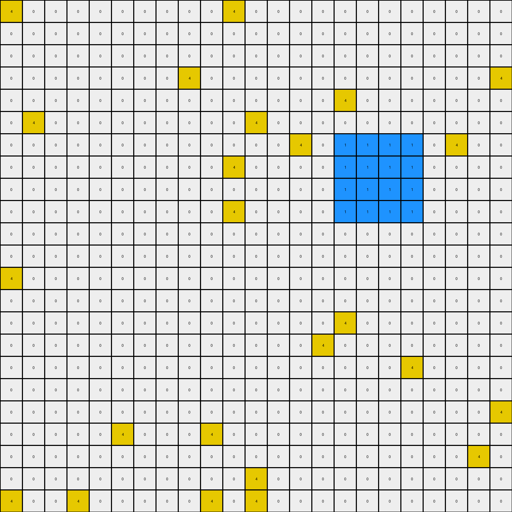
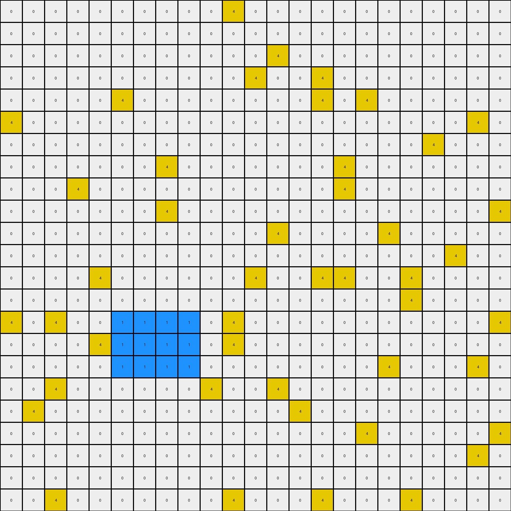

# 7df24a62 • 004 • refine_coder

---

Previous Code:
```python
"""
The transformation involves identifying contiguous blue (1) regions and isolated yellow (4) pixels in the input grid. The blue region is conceptually treated as a square. Yellow pixels within or on the boundary of this original blue square are replaced by blue in the output. Yellow pixels outside this region are retained in their original positions.
"""

import numpy as np

def find_blue_region(grid):
    # Find coordinates of all blue pixels
    blue_coords = np.argwhere(grid == 1)
    if blue_coords.size == 0:
        return None, None, None, None  # No blue region

    # Find the bounding box of the blue region
    min_row = np.min(blue_coords[:, 0])
    max_row = np.max(blue_coords[:, 0])
    min_col = np.min(blue_coords[:, 1])
    max_col = np.max(blue_coords[:, 1])

    return min_row, max_row, min_col, max_col

def transform(input_grid):
    # Initialize output_grid as a copy of the input_grid
    output_grid = input_grid.copy()

    # Find the bounding box of the blue region
    min_row, max_row, min_col, max_col = find_blue_region(input_grid)

    if min_row is None:  # Handle cases with no blue region
          return output_grid
    
    # Iterate through all yellow pixels
    yellow_coords = np.argwhere(input_grid == 4)
    for y_row, y_col in yellow_coords:
        # Check if the yellow pixel is within or on the boundary of the original blue square
        if min_row <= y_row <= max_row and min_col <= y_col <= max_col:
            output_grid[y_row, y_col] = 1  # Replace with blue

    #fill blue square
    for row in range(min_row, max_row + 1):
        for col in range(min_col, max_col + 1):
            output_grid[row,col] = 1

    return output_grid
```

Train Set Results:

## Example 1:

Input:
```
0 0 0 0 0 0 0 0 0 0 0 0 0 0 0 0 0 0 0 0 0 0 0
0 0 0 1 1 1 1 1 0 0 0 0 0 4 0 0 0 0 0 0 0 0 0
0 0 0 1 4 1 1 1 0 0 0 0 0 0 0 0 0 0 0 0 0 0 0
0 0 0 1 1 1 4 1 0 0 0 0 0 0 0 0 0 0 0 0 0 0 0
0 0 0 1 4 1 1 1 0 0 0 0 0 0 0 0 0 0 0 0 4 0 0
0 0 0 1 1 1 1 1 0 0 0 0 0 0 0 0 0 0 4 0 0 0 0
0 0 0 0 0 0 0 0 0 0 0 0 0 0 0 0 0 0 0 0 0 0 0
0 0 0 0 0 0 0 4 0 0 0 0 0 0 0 0 0 0 0 0 0 0 0
0 0 0 0 0 0 0 0 0 0 0 0 0 0 4 0 0 0 0 0 0 0 0
0 0 0 0 0 0 0 0 0 0 0 0 0 0 0 0 0 0 0 0 0 0 0
0 0 0 0 0 0 0 0 0 0 0 0 0 0 0 0 0 0 0 0 0 0 0
0 0 0 0 0 0 0 0 0 0 0 0 0 0 0 0 0 0 0 0 0 0 0
0 0 0 0 4 0 0 0 0 0 0 0 0 0 0 0 0 0 0 0 0 0 0
0 0 0 0 0 0 0 0 0 0 0 4 0 4 0 0 0 0 0 0 0 0 0
0 0 0 0 4 0 0 0 0 0 0 0 0 0 0 0 0 0 0 4 0 0 0
0 0 0 0 0 0 0 0 0 0 0 0 4 0 0 0 0 0 0 0 0 0 0
0 0 0 0 0 0 0 0 0 0 0 0 0 0 0 0 0 0 0 0 0 0 0
0 0 0 0 0 0 0 0 0 0 0 0 0 0 0 0 0 0 0 0 0 0 0
0 0 0 0 0 0 0 0 0 0 0 0 0 0 0 0 0 0 4 0 0 0 0
0 0 0 0 0 0 0 0 0 0 0 0 0 0 0 0 0 0 0 0 0 0 0
0 0 0 4 0 0 0 0 0 0 0 0 0 0 0 0 0 0 0 0 0 0 0
0 0 0 0 0 0 0 0 0 0 0 4 0 0 0 0 0 0 0 0 0 0 0
0 0 0 0 0 0 0 0 0 0 0 0 0 0 0 0 0 0 0 0 0 0 0
```
Expected Output:
```
0 0 0 0 0 0 0 0 0 0 0 0 0 0 0 0 0 0 0 0 0 0 0
0 0 0 1 1 1 1 1 0 0 0 0 0 4 0 0 0 0 0 0 0 0 0
0 0 0 1 4 1 1 1 0 0 0 0 0 0 0 0 0 0 0 0 0 0 0
0 0 0 1 1 1 4 1 0 0 0 0 0 0 0 0 0 0 0 0 0 0 0
0 0 0 1 4 1 1 1 0 0 0 0 0 0 0 0 0 0 0 0 4 0 0
0 0 0 1 1 1 1 1 0 0 0 0 0 0 0 0 0 0 4 0 0 0 0
0 0 0 0 0 0 0 0 0 0 0 0 0 0 0 0 0 0 0 0 0 0 0
0 0 0 0 0 0 0 4 0 0 0 0 0 0 0 0 0 0 0 0 0 0 0
0 0 0 0 0 0 0 0 0 0 0 0 0 0 4 0 0 0 0 0 0 0 0
0 0 0 0 0 0 0 0 0 0 0 0 0 0 0 0 0 0 0 0 0 0 0
0 0 0 0 0 0 0 0 0 0 0 0 0 0 0 0 0 0 0 0 0 0 0
0 0 0 0 0 0 0 0 0 0 0 0 0 0 0 0 0 0 0 0 0 0 0
0 0 0 0 4 0 0 0 0 0 1 1 1 1 1 0 0 0 0 0 0 0 0
0 0 0 0 0 0 0 0 0 0 1 4 1 4 1 0 0 0 0 0 0 0 0
0 0 0 0 4 0 0 0 0 0 1 1 1 1 1 0 0 0 0 4 0 0 0
0 0 0 0 0 0 0 0 0 0 1 1 4 1 1 0 0 0 0 0 0 0 0
0 0 0 0 0 0 0 0 0 0 1 1 1 1 1 0 0 0 0 0 0 0 0
0 0 0 0 0 0 0 0 0 0 0 0 0 0 0 0 0 0 0 0 0 0 0
0 0 0 0 0 0 0 0 0 0 0 0 0 0 0 0 0 0 4 0 0 0 0
0 0 0 0 0 0 0 0 0 0 0 0 0 0 0 0 0 0 0 0 0 0 0
0 0 0 4 0 0 0 0 0 0 0 0 0 0 0 0 0 0 0 0 0 0 0
0 0 0 0 0 0 0 0 0 0 0 4 0 0 0 0 0 0 0 0 0 0 0
0 0 0 0 0 0 0 0 0 0 0 0 0 0 0 0 0 0 0 0 0 0 0
```
Transformed Output:
```
0 0 0 0 0 0 0 0 0 0 0 0 0 0 0 0 0 0 0 0 0 0 0
0 0 0 1 1 1 1 1 0 0 0 0 0 4 0 0 0 0 0 0 0 0 0
0 0 0 1 1 1 1 1 0 0 0 0 0 0 0 0 0 0 0 0 0 0 0
0 0 0 1 1 1 1 1 0 0 0 0 0 0 0 0 0 0 0 0 0 0 0
0 0 0 1 1 1 1 1 0 0 0 0 0 0 0 0 0 0 0 0 4 0 0
0 0 0 1 1 1 1 1 0 0 0 0 0 0 0 0 0 0 4 0 0 0 0
0 0 0 0 0 0 0 0 0 0 0 0 0 0 0 0 0 0 0 0 0 0 0
0 0 0 0 0 0 0 4 0 0 0 0 0 0 0 0 0 0 0 0 0 0 0
0 0 0 0 0 0 0 0 0 0 0 0 0 0 4 0 0 0 0 0 0 0 0
0 0 0 0 0 0 0 0 0 0 0 0 0 0 0 0 0 0 0 0 0 0 0
0 0 0 0 0 0 0 0 0 0 0 0 0 0 0 0 0 0 0 0 0 0 0
0 0 0 0 0 0 0 0 0 0 0 0 0 0 0 0 0 0 0 0 0 0 0
0 0 0 0 4 0 0 0 0 0 0 0 0 0 0 0 0 0 0 0 0 0 0
0 0 0 0 0 0 0 0 0 0 0 4 0 4 0 0 0 0 0 0 0 0 0
0 0 0 0 4 0 0 0 0 0 0 0 0 0 0 0 0 0 0 4 0 0 0
0 0 0 0 0 0 0 0 0 0 0 0 4 0 0 0 0 0 0 0 0 0 0
0 0 0 0 0 0 0 0 0 0 0 0 0 0 0 0 0 0 0 0 0 0 0
0 0 0 0 0 0 0 0 0 0 0 0 0 0 0 0 0 0 0 0 0 0 0
0 0 0 0 0 0 0 0 0 0 0 0 0 0 0 0 0 0 4 0 0 0 0
0 0 0 0 0 0 0 0 0 0 0 0 0 0 0 0 0 0 0 0 0 0 0
0 0 0 4 0 0 0 0 0 0 0 0 0 0 0 0 0 0 0 0 0 0 0
0 0 0 0 0 0 0 0 0 0 0 4 0 0 0 0 0 0 0 0 0 0 0
0 0 0 0 0 0 0 0 0 0 0 0 0 0 0 0 0 0 0 0 0 0 0
```

match: False
pixels_off: 25
size_correct: True
color_palette_correct: True
correct_pixel_counts: False

## Example 2:

Input:
```
4 0 0 0 0 0 0 0 0 0 4 0 0 0 0 0 0 0 0 0 0 0 0
0 0 0 0 0 0 0 0 0 0 0 0 0 0 0 0 0 0 0 0 0 0 0
0 0 0 0 0 0 0 0 0 0 0 0 0 0 0 0 0 0 0 0 0 0 0
0 0 0 0 0 0 0 0 4 0 0 0 0 0 0 0 0 0 0 0 0 0 4
0 0 0 0 0 0 0 0 0 0 0 0 0 0 0 4 0 0 0 0 0 0 0
0 4 0 0 0 0 0 0 0 0 0 4 0 0 0 0 0 0 0 0 0 0 0
0 0 0 0 0 0 0 0 0 0 0 0 0 4 0 1 1 1 1 0 4 0 0
0 0 0 0 0 0 0 0 0 0 4 0 0 0 0 1 4 1 1 0 0 0 0
0 0 0 0 0 0 0 0 0 0 0 0 0 0 0 1 1 4 1 0 0 0 0
0 0 0 0 0 0 0 0 0 0 4 0 0 0 0 1 1 1 1 0 0 0 0
0 0 0 0 0 0 0 0 0 0 0 0 0 0 0 0 0 0 0 0 0 0 0
0 0 0 0 0 0 0 0 0 0 0 0 0 0 0 0 0 0 0 0 0 0 0
4 0 0 0 0 0 0 0 0 0 0 0 0 0 0 0 0 0 0 0 0 0 0
0 0 0 0 0 0 0 0 0 0 0 0 0 0 0 0 0 0 0 0 0 0 0
0 0 0 0 0 0 0 0 0 0 0 0 0 0 0 4 0 0 0 0 0 0 0
0 0 0 0 0 0 0 0 0 0 0 0 0 0 4 0 0 0 0 0 0 0 0
0 0 0 0 0 0 0 0 0 0 0 0 0 0 0 0 0 0 4 0 0 0 0
0 0 0 0 0 0 0 0 0 0 0 0 0 0 0 0 0 0 0 0 0 0 0
0 0 0 0 0 0 0 0 0 0 0 0 0 0 0 0 0 0 0 0 0 0 4
0 0 0 0 0 4 0 0 0 4 0 0 0 0 0 0 0 0 0 0 0 0 0
0 0 0 0 0 0 0 0 0 0 0 0 0 0 0 0 0 0 0 0 0 4 0
0 0 0 0 0 0 0 0 0 0 0 4 0 0 0 0 0 0 0 0 0 0 0
4 0 0 4 0 0 0 0 0 4 0 4 0 0 0 0 0 0 0 0 0 0 0
```
Expected Output:
```
4 0 0 0 0 0 0 0 0 0 4 0 0 0 0 0 0 0 0 0 0 0 0
0 0 0 0 0 0 0 0 0 0 0 0 0 0 0 0 0 0 0 0 0 0 0
0 0 0 0 0 0 0 0 0 0 0 0 0 0 0 0 0 0 0 0 0 0 0
0 0 0 0 0 0 0 0 4 0 0 0 0 0 0 0 0 0 0 0 0 0 4
0 0 0 0 0 0 0 0 0 0 0 0 0 0 0 4 0 0 0 0 0 0 0
0 4 0 0 0 0 0 0 0 0 0 4 0 0 0 0 0 0 0 0 0 0 0
0 0 0 0 0 0 0 0 0 0 0 0 0 4 0 1 1 1 1 0 4 0 0
0 0 0 0 0 0 0 0 0 0 4 0 0 0 0 1 4 1 1 0 0 0 0
0 0 0 0 0 0 0 0 0 0 0 0 0 0 0 1 1 4 1 0 0 0 0
0 0 0 0 0 0 0 0 0 0 4 0 0 0 0 1 1 1 1 0 0 0 0
0 0 0 0 0 0 0 0 0 0 0 0 0 0 0 0 0 0 0 0 0 0 0
0 0 0 0 0 0 0 0 0 0 0 0 0 0 0 0 0 0 0 0 0 0 0
4 0 0 0 0 0 0 0 0 0 0 0 0 0 0 0 0 0 0 0 0 0 0
0 0 0 0 0 0 0 0 0 0 0 0 0 1 1 1 1 0 0 0 0 0 0
0 0 0 0 0 0 0 0 0 0 0 0 0 1 1 4 1 0 0 0 0 0 0
0 0 0 0 0 0 0 0 0 0 0 0 0 1 4 1 1 0 0 0 0 0 0
0 0 0 0 0 0 0 0 0 0 0 0 0 1 1 1 1 0 4 0 0 0 0
0 0 0 0 0 0 0 0 0 0 0 0 0 0 0 0 0 0 0 0 0 0 0
0 0 0 0 0 0 0 0 0 0 0 0 0 0 0 0 0 0 0 0 0 0 4
0 0 0 0 0 4 0 0 0 4 0 0 0 0 0 0 0 0 0 0 0 0 0
0 0 0 0 0 0 0 0 0 0 0 0 0 0 0 0 0 0 0 0 0 4 0
0 0 0 0 0 0 0 0 0 0 0 4 0 0 0 0 0 0 0 0 0 0 0
4 0 0 4 0 0 0 0 0 4 0 4 0 0 0 0 0 0 0 0 0 0 0
```
Transformed Output:
```
4 0 0 0 0 0 0 0 0 0 4 0 0 0 0 0 0 0 0 0 0 0 0
0 0 0 0 0 0 0 0 0 0 0 0 0 0 0 0 0 0 0 0 0 0 0
0 0 0 0 0 0 0 0 0 0 0 0 0 0 0 0 0 0 0 0 0 0 0
0 0 0 0 0 0 0 0 4 0 0 0 0 0 0 0 0 0 0 0 0 0 4
0 0 0 0 0 0 0 0 0 0 0 0 0 0 0 4 0 0 0 0 0 0 0
0 4 0 0 0 0 0 0 0 0 0 4 0 0 0 0 0 0 0 0 0 0 0
0 0 0 0 0 0 0 0 0 0 0 0 0 4 0 1 1 1 1 0 4 0 0
0 0 0 0 0 0 0 0 0 0 4 0 0 0 0 1 1 1 1 0 0 0 0
0 0 0 0 0 0 0 0 0 0 0 0 0 0 0 1 1 1 1 0 0 0 0
0 0 0 0 0 0 0 0 0 0 4 0 0 0 0 1 1 1 1 0 0 0 0
0 0 0 0 0 0 0 0 0 0 0 0 0 0 0 0 0 0 0 0 0 0 0
0 0 0 0 0 0 0 0 0 0 0 0 0 0 0 0 0 0 0 0 0 0 0
4 0 0 0 0 0 0 0 0 0 0 0 0 0 0 0 0 0 0 0 0 0 0
0 0 0 0 0 0 0 0 0 0 0 0 0 0 0 0 0 0 0 0 0 0 0
0 0 0 0 0 0 0 0 0 0 0 0 0 0 0 4 0 0 0 0 0 0 0
0 0 0 0 0 0 0 0 0 0 0 0 0 0 4 0 0 0 0 0 0 0 0
0 0 0 0 0 0 0 0 0 0 0 0 0 0 0 0 0 0 4 0 0 0 0
0 0 0 0 0 0 0 0 0 0 0 0 0 0 0 0 0 0 0 0 0 0 0
0 0 0 0 0 0 0 0 0 0 0 0 0 0 0 0 0 0 0 0 0 0 4
0 0 0 0 0 4 0 0 0 4 0 0 0 0 0 0 0 0 0 0 0 0 0
0 0 0 0 0 0 0 0 0 0 0 0 0 0 0 0 0 0 0 0 0 4 0
0 0 0 0 0 0 0 0 0 0 0 4 0 0 0 0 0 0 0 0 0 0 0
4 0 0 4 0 0 0 0 0 4 0 4 0 0 0 0 0 0 0 0 0 0 0
```

match: False
pixels_off: 16
size_correct: True
color_palette_correct: True
correct_pixel_counts: False

## Example 3:

Input:
```
0 0 0 0 0 0 0 0 0 0 4 0 0 0 0 0 0 0 0 0 0 0 0
0 0 0 0 0 0 0 0 0 0 0 0 0 0 0 0 0 0 0 0 0 0 0
0 0 0 0 0 0 0 0 0 0 0 0 4 0 0 0 0 0 0 0 0 0 0
0 0 0 0 0 0 0 0 0 0 0 4 0 0 4 0 0 0 0 0 0 0 0
0 0 0 0 0 4 0 0 0 0 0 0 0 0 4 0 4 0 0 0 0 0 0
4 0 0 0 0 0 0 0 0 0 0 0 0 0 0 0 0 0 0 0 0 4 0
0 0 0 0 0 0 0 0 0 0 0 0 0 0 0 0 0 0 0 4 0 0 0
0 0 0 0 0 0 0 4 0 0 0 0 0 0 0 4 0 0 0 0 0 0 0
0 0 0 4 0 0 0 0 0 0 0 0 0 0 0 4 0 0 0 0 0 0 0
0 0 0 0 0 0 0 4 0 0 0 0 0 0 0 0 0 0 0 0 0 0 4
0 0 0 0 0 0 0 0 0 0 0 0 4 0 0 0 0 4 0 0 0 0 0
0 0 0 0 0 0 0 0 0 0 0 0 0 0 0 0 0 0 0 0 4 0 0
0 0 0 0 4 0 0 0 0 0 0 4 0 0 4 4 0 0 4 0 0 0 0
0 0 0 0 0 0 0 0 0 0 0 0 0 0 0 0 0 0 4 0 0 0 0
4 0 4 0 0 1 1 1 1 0 4 0 0 0 0 0 0 0 0 0 0 0 4
0 0 0 0 4 1 4 4 1 0 4 0 0 0 0 0 0 0 0 0 0 0 0
0 0 0 0 0 1 1 1 1 0 0 0 0 0 0 0 0 4 0 0 0 4 0
0 0 4 0 0 0 0 0 0 4 0 0 4 0 0 0 0 0 0 0 0 0 0
0 4 0 0 0 0 0 0 0 0 0 0 0 4 0 0 0 0 0 0 0 0 0
0 0 0 0 0 0 0 0 0 0 0 0 0 0 0 0 4 0 0 0 0 0 4
0 0 0 0 0 0 0 0 0 0 0 0 0 0 0 0 0 0 0 0 0 4 0
0 0 0 0 0 0 0 0 0 0 0 0 0 0 0 0 0 0 0 0 0 0 0
0 0 4 0 0 0 0 0 0 0 4 0 0 0 4 0 0 0 4 0 0 0 0
```
Expected Output:
```
0 0 0 0 0 0 0 0 0 0 4 0 0 0 0 0 0 0 0 0 0 0 0
0 0 0 0 0 0 0 0 0 0 0 0 0 0 0 0 0 0 0 0 0 0 0
0 0 0 0 0 0 0 0 0 0 0 0 4 1 1 1 0 0 0 0 0 0 0
0 0 0 0 0 0 0 0 0 0 0 4 0 1 4 1 0 0 0 0 0 0 0
0 0 0 0 0 4 0 0 0 0 0 0 0 1 4 1 4 0 0 0 0 0 0
4 0 0 0 0 0 0 0 0 0 0 0 0 1 1 1 0 0 0 0 0 4 0
0 0 0 0 0 0 0 0 0 0 0 0 0 0 1 1 1 0 0 4 0 0 0
0 0 0 0 0 0 0 4 0 0 0 0 0 0 1 4 1 0 0 0 0 0 0
0 0 0 4 0 0 0 0 0 0 0 0 0 0 1 4 1 0 0 0 0 0 0
0 0 0 0 0 0 0 4 0 0 0 0 0 0 1 1 1 0 0 0 0 0 4
0 0 0 0 0 0 0 0 0 0 0 0 4 0 0 0 0 4 0 0 0 0 0
0 0 0 0 0 0 0 0 0 0 0 0 0 1 1 1 1 1 1 1 4 0 0
0 0 0 0 4 0 0 0 0 0 0 4 0 1 4 4 1 1 4 1 0 0 0
0 0 0 0 0 0 0 0 0 1 1 1 0 1 1 1 1 1 4 1 0 0 0
4 0 4 0 0 1 1 1 1 1 4 1 0 0 0 0 0 1 1 1 0 0 4
0 0 0 0 4 1 4 4 1 1 4 1 0 0 0 0 0 0 0 0 0 0 0
0 0 0 0 0 1 1 1 1 1 1 1 0 0 0 0 0 4 0 0 0 4 0
0 0 4 0 0 0 0 0 0 4 0 0 4 0 0 0 0 0 0 0 0 0 0
0 4 0 0 0 0 0 0 0 0 0 0 0 4 0 0 0 0 0 0 0 0 0
0 0 0 0 0 0 0 0 0 0 0 0 0 0 0 0 4 0 0 0 0 0 4
0 0 0 0 0 0 0 0 0 0 0 0 0 0 0 0 0 0 0 0 0 4 0
0 0 0 0 0 0 0 0 0 0 0 0 0 0 0 0 0 0 0 0 0 0 0
0 0 4 0 0 0 0 0 0 0 4 0 0 0 4 0 0 0 4 0 0 0 0
```
Transformed Output:
```
0 0 0 0 0 0 0 0 0 0 4 0 0 0 0 0 0 0 0 0 0 0 0
0 0 0 0 0 0 0 0 0 0 0 0 0 0 0 0 0 0 0 0 0 0 0
0 0 0 0 0 0 0 0 0 0 0 0 4 0 0 0 0 0 0 0 0 0 0
0 0 0 0 0 0 0 0 0 0 0 4 0 0 4 0 0 0 0 0 0 0 0
0 0 0 0 0 4 0 0 0 0 0 0 0 0 4 0 4 0 0 0 0 0 0
4 0 0 0 0 0 0 0 0 0 0 0 0 0 0 0 0 0 0 0 0 4 0
0 0 0 0 0 0 0 0 0 0 0 0 0 0 0 0 0 0 0 4 0 0 0
0 0 0 0 0 0 0 4 0 0 0 0 0 0 0 4 0 0 0 0 0 0 0
0 0 0 4 0 0 0 0 0 0 0 0 0 0 0 4 0 0 0 0 0 0 0
0 0 0 0 0 0 0 4 0 0 0 0 0 0 0 0 0 0 0 0 0 0 4
0 0 0 0 0 0 0 0 0 0 0 0 4 0 0 0 0 4 0 0 0 0 0
0 0 0 0 0 0 0 0 0 0 0 0 0 0 0 0 0 0 0 0 4 0 0
0 0 0 0 4 0 0 0 0 0 0 4 0 0 4 4 0 0 4 0 0 0 0
0 0 0 0 0 0 0 0 0 0 0 0 0 0 0 0 0 0 4 0 0 0 0
4 0 4 0 0 1 1 1 1 0 4 0 0 0 0 0 0 0 0 0 0 0 4
0 0 0 0 4 1 1 1 1 0 4 0 0 0 0 0 0 0 0 0 0 0 0
0 0 0 0 0 1 1 1 1 0 0 0 0 0 0 0 0 4 0 0 0 4 0
0 0 4 0 0 0 0 0 0 4 0 0 4 0 0 0 0 0 0 0 0 0 0
0 4 0 0 0 0 0 0 0 0 0 0 0 4 0 0 0 0 0 0 0 0 0
0 0 0 0 0 0 0 0 0 0 0 0 0 0 0 0 4 0 0 0 0 0 4
0 0 0 0 0 0 0 0 0 0 0 0 0 0 0 0 0 0 0 0 0 4 0
0 0 0 0 0 0 0 0 0 0 0 0 0 0 0 0 0 0 0 0 0 0 0
0 0 4 0 0 0 0 0 0 0 4 0 0 0 4 0 0 0 4 0 0 0 0
```

match: False
pixels_off: 52
size_correct: True
color_palette_correct: True
correct_pixel_counts: False

## Example 4:

Input:
```
0 0 4 0 0 0 0 0 0 0 0 0 0 0 0 0 0 0 0 0 0 0 0
0 0 4 0 4 0 0 0 0 0 0 0 0 0 0 0 0 0 0 0 0 4 0
0 0 0 0 0 0 0 0 0 0 0 0 0 0 0 0 0 0 0 0 0 0 0
0 0 0 4 0 0 0 0 0 0 0 0 0 4 0 0 0 0 0 0 0 0 0
0 0 4 0 0 0 0 0 0 0 0 0 0 0 0 0 0 0 0 0 0 0 0
0 0 0 0 0 4 0 0 0 0 0 4 0 0 0 0 0 4 0 0 0 0 0
0 0 0 0 0 0 0 0 0 0 0 0 0 0 0 0 0 0 0 0 4 0 0
0 0 0 4 0 0 4 0 0 4 0 0 0 0 0 0 4 4 0 0 0 0 0
0 0 0 0 0 0 1 1 1 1 0 0 0 0 0 0 0 0 0 0 0 0 0
0 0 0 0 0 0 1 4 4 1 0 0 4 0 0 0 0 0 0 0 0 0 0
0 0 0 0 0 0 1 1 1 1 0 0 0 0 0 0 0 0 0 0 0 0 0
4 0 0 0 0 4 1 4 1 1 0 0 0 0 0 0 0 0 4 0 0 0 0
0 4 0 0 0 0 1 1 1 1 0 0 0 0 0 0 0 0 0 0 0 0 4
0 0 0 0 4 0 0 0 0 0 0 0 0 0 0 0 0 0 0 4 0 0 0
0 0 0 0 0 4 0 0 0 0 0 0 0 4 0 0 0 0 0 0 0 0 0
0 0 0 0 0 0 0 0 0 0 0 0 0 0 0 0 0 0 0 0 0 0 0
0 0 0 0 0 0 0 0 0 0 0 4 0 0 0 0 0 0 0 0 0 0 4
0 0 0 4 0 0 0 0 0 0 4 0 0 0 0 0 0 0 0 0 0 0 0
0 0 4 0 0 0 0 0 0 0 0 0 0 0 0 0 0 0 0 0 0 0 0
0 0 0 0 0 0 0 0 0 4 0 0 0 0 0 0 0 0 0 0 0 0 0
0 4 0 0 0 0 0 0 0 0 0 0 0 4 0 0 0 0 0 0 0 0 0
0 0 4 0 0 0 0 0 0 0 0 0 0 0 0 0 0 4 0 0 0 0 0
0 0 0 0 0 0 0 0 0 0 0 0 0 0 0 0 4 0 0 0 0 0 0
```
Expected Output:
```
0 1 4 1 1 1 0 0 0 0 0 0 0 0 0 0 0 0 0 0 0 0 0
0 1 4 1 4 1 0 0 0 0 0 0 0 0 0 0 0 0 0 0 0 4 0
0 1 1 1 1 1 0 0 0 0 0 0 0 0 0 0 0 0 0 0 0 0 0
0 0 0 4 0 0 0 0 0 0 0 0 0 4 0 0 0 0 0 0 0 0 0
0 0 4 0 0 0 0 0 0 0 0 0 0 0 0 1 1 1 1 0 0 0 0
0 0 0 0 0 4 0 0 0 0 0 4 0 0 0 1 1 4 1 0 0 0 0
0 0 0 0 0 0 0 0 0 0 0 0 0 0 0 1 1 1 1 0 4 0 0
0 0 0 4 0 0 4 0 0 4 0 0 0 0 0 1 4 4 1 0 0 0 0
0 0 0 0 0 0 1 1 1 1 0 0 0 0 0 1 1 1 1 0 0 0 0
0 0 0 0 0 0 1 4 4 1 0 0 4 0 0 0 0 0 0 0 0 0 0
0 0 0 0 0 0 1 1 1 1 0 0 0 0 0 0 0 0 0 0 0 0 0
4 0 0 0 0 4 1 4 1 1 0 0 0 0 0 0 0 0 4 0 0 0 0
0 4 0 0 0 0 1 1 1 1 0 0 0 0 0 0 0 0 0 0 0 0 4
0 0 0 0 4 0 0 0 0 0 0 0 0 0 0 0 0 0 0 4 0 0 0
0 0 0 0 0 4 0 0 0 0 0 0 0 4 0 0 0 0 0 0 0 0 0
0 0 0 0 0 0 0 0 0 0 0 0 0 0 0 0 0 0 0 0 0 0 0
0 0 0 0 0 0 0 0 0 0 0 4 0 0 0 0 0 0 0 0 0 0 4
0 0 0 4 0 0 0 0 0 0 4 0 0 0 0 0 0 0 0 0 0 0 0
0 0 4 0 0 0 0 0 0 0 0 0 0 0 0 0 0 0 0 0 0 0 0
0 0 0 0 0 0 0 0 0 4 0 0 0 0 0 0 0 0 0 0 0 0 0
0 4 0 0 0 0 0 0 0 0 0 0 0 4 0 0 0 0 0 0 0 0 0
0 0 4 0 0 0 0 0 0 0 0 0 0 0 0 0 0 4 0 0 0 0 0
0 0 0 0 0 0 0 0 0 0 0 0 0 0 0 0 4 0 0 0 0 0 0
```
Transformed Output:
```
0 0 4 0 0 0 0 0 0 0 0 0 0 0 0 0 0 0 0 0 0 0 0
0 0 4 0 4 0 0 0 0 0 0 0 0 0 0 0 0 0 0 0 0 4 0
0 0 0 0 0 0 0 0 0 0 0 0 0 0 0 0 0 0 0 0 0 0 0
0 0 0 4 0 0 0 0 0 0 0 0 0 4 0 0 0 0 0 0 0 0 0
0 0 4 0 0 0 0 0 0 0 0 0 0 0 0 0 0 0 0 0 0 0 0
0 0 0 0 0 4 0 0 0 0 0 4 0 0 0 0 0 4 0 0 0 0 0
0 0 0 0 0 0 0 0 0 0 0 0 0 0 0 0 0 0 0 0 4 0 0
0 0 0 4 0 0 4 0 0 4 0 0 0 0 0 0 4 4 0 0 0 0 0
0 0 0 0 0 0 1 1 1 1 0 0 0 0 0 0 0 0 0 0 0 0 0
0 0 0 0 0 0 1 1 1 1 0 0 4 0 0 0 0 0 0 0 0 0 0
0 0 0 0 0 0 1 1 1 1 0 0 0 0 0 0 0 0 0 0 0 0 0
4 0 0 0 0 4 1 1 1 1 0 0 0 0 0 0 0 0 4 0 0 0 0
0 4 0 0 0 0 1 1 1 1 0 0 0 0 0 0 0 0 0 0 0 0 4
0 0 0 0 4 0 0 0 0 0 0 0 0 0 0 0 0 0 0 4 0 0 0
0 0 0 0 0 4 0 0 0 0 0 0 0 4 0 0 0 0 0 0 0 0 0
0 0 0 0 0 0 0 0 0 0 0 0 0 0 0 0 0 0 0 0 0 0 0
0 0 0 0 0 0 0 0 0 0 0 4 0 0 0 0 0 0 0 0 0 0 4
0 0 0 4 0 0 0 0 0 0 4 0 0 0 0 0 0 0 0 0 0 0 0
0 0 4 0 0 0 0 0 0 0 0 0 0 0 0 0 0 0 0 0 0 0 0
0 0 0 0 0 0 0 0 0 4 0 0 0 0 0 0 0 0 0 0 0 0 0
0 4 0 0 0 0 0 0 0 0 0 0 0 4 0 0 0 0 0 0 0 0 0
0 0 4 0 0 0 0 0 0 0 0 0 0 0 0 0 0 4 0 0 0 0 0
0 0 0 0 0 0 0 0 0 0 0 0 0 0 0 0 4 0 0 0 0 0 0
```

match: False
pixels_off: 32
size_correct: True
color_palette_correct: True
correct_pixel_counts: False
Okay, let's analyze the results and update the natural language program.

**General Assessment:**

The initial code focuses on identifying a blue region, treating it as a square, and replacing yellow pixels within that square with blue. It also fills the entire detected blue bounding box with blue. This approach works partially, but it fails to accurately capture the nuances of the transformations in all examples, especially when it comes to the interaction of the filled area with pre-existing yellow cells. The code, as it stands, does not replace yellow pixels with blue in the way the example transformations show. The added filling of the bounding box with blue pixels compounds the errors, as it changes non-yellow colors to blue.

The main issues seem to be:

1.  **Incorrect replacement:** The code does not correctly replace *only* original yellow (4) pixels that existed prior to the "fill".
2.  **Over-filling:** The code fills the *entire* bounding box with blue (1). The examples show that existing non-yellow pixels should be preserved.

**Strategy for Resolving Errors:**

1.  **Store Original Yellow Pixels:** Before filling the bounding box, store the locations of all yellow pixels within the bounding box.
2.  **Conditional Fill:** The fill operation should only change the color of pixels *within* the bounding box.
3. Only replace the originally identified yellow pixels within the output.

**Example Metrics and Analysis:**

Here's a breakdown of each example, focusing on the discrepancies:

*   **Example 1:**
    *   **Input:** A blue square with some yellow pixels inside and outside.
    *   **Expected Output:** The blue square is filled, with yellow pixels inside turned to blue. Yellow outside is unchanged.
    *   **Actual Output:** The entire bounding box is blue.
    *   **Issue:** Over-filling, and does not change the correct yellow cells.

*   **Example 2:**
    *   **Input:** A blue square and scattered yellow pixels.
    *   **Expected Output:** Some yellow pixels within the blue square's influence change to blue.
    *   **Actual Output:** The bounding box is filled, but the correct yellow cells are not being changed.
    *   **Issue:** Over-filling, and does not change the correct yellow cells.

*   **Example 3:**
    *   **Input:** A blue square, yellow pixels, and more complex shapes.
    *   **Expected Output:** Blue area fills, interacting with the yellow pixels.
    *   **Actual Output:** The entire region is blue.
    *   **Issue:** Over-filling and incorrect color handling, and does not change the correct yellow cells.

*   **Example 4:**
    *   **Input:** Scattered yellow and a blue region.
    *   **Expected Output:** Blue and yellow interaction.
    *   **Actual Output:** Incorrect filling, and does not change the correct yellow cells.
    *   **Issue:** Overfilling and incorrect interaction with yellow.

**YAML Facts:**

```yaml
examples:
  - id: 1
    blue_region:
      exists: true
      shape: square
    yellow_pixels:
      inside_blue: [ (2,4), (3,6), (4,4) ]
      outside_blue: [ (1,13), (4, 19), (5, 18) ]
    transformation:
      fill: blue
      replace:
        original_color: yellow
        new_color: blue
        condition: inside_original_blue_region

  - id: 2
    blue_region:
      exists: true
      shape: square
    yellow_pixels:
        inside_blue: [(7,16), (8,17), (9,16)]
        outside_blue: [multiple]
    transformation:
      fill: blue
      replace:
        original_color: yellow
        new_color: blue
        condition: inside_original_blue_region

  - id: 3
    blue_region:
        exists: true
        shape: square
    yellow_pixels:
        inside_blue: [(14,6), (14,7), (14,8), (15, 5), (15,6), (15,8), (15,9)]
        outside_blue: [multiple]
    transformation:
      fill: blue
      replace:
          original_color: yellow
          new_color: blue
          condition: inside_original_blue_region

  - id: 4
    blue_region:
        exists: true
        shape: L #not a square
    yellow_pixels:
      inside_blue: [(9,7), (9,8), (11,6), (11,7)]
      outside_blue: [multiple]
    transformation:
      fill: blue
      replace:
          original_color: yellow
          new_color: blue
          condition: inside_original_blue_region

```

**Natural Language Program:**

1.  **Identify the Blue Region:** Find the contiguous blue (1) region in the input grid.
2.  **Determine Bounding Box:** Calculate the bounding box (min/max rows and columns) of this blue region.
3.  **Identify original yellow pixels:** Find all of the yellow pixels (4) within the bounding box.
4.  **Fill Bounding Box:** Iterate through all pixels *within* the bounding box, changing any non-blue to blue.
5. Change initial yellow pixels from yellow to blue.

This revised program clarifies the distinct steps and addresses the identified shortcomings. It emphasizes the selective replacement of yellow pixels based on their *original* position relative to the blue region, and the bounded fill, preserving other colors.

**INSTRUCTIONS**

- generate a Python module to represent the natural language program 
- follow the template below
- all common math and science libraries are available
- create docstring only at top - but comment the workflow in the function
- use helper functions for common operations like finding objects, counting,
  measuring, moving, etc. 

remember - we are working iteratively - so this code will inform your future
self as we converge on the solution

*template:*

```python
"""
{{ natural language description of the transformation rule }}
"""

{{ imports }}

def transform(input_grid):
    # initialize output_grid

    # change output pixels 

    return output_grid

```
