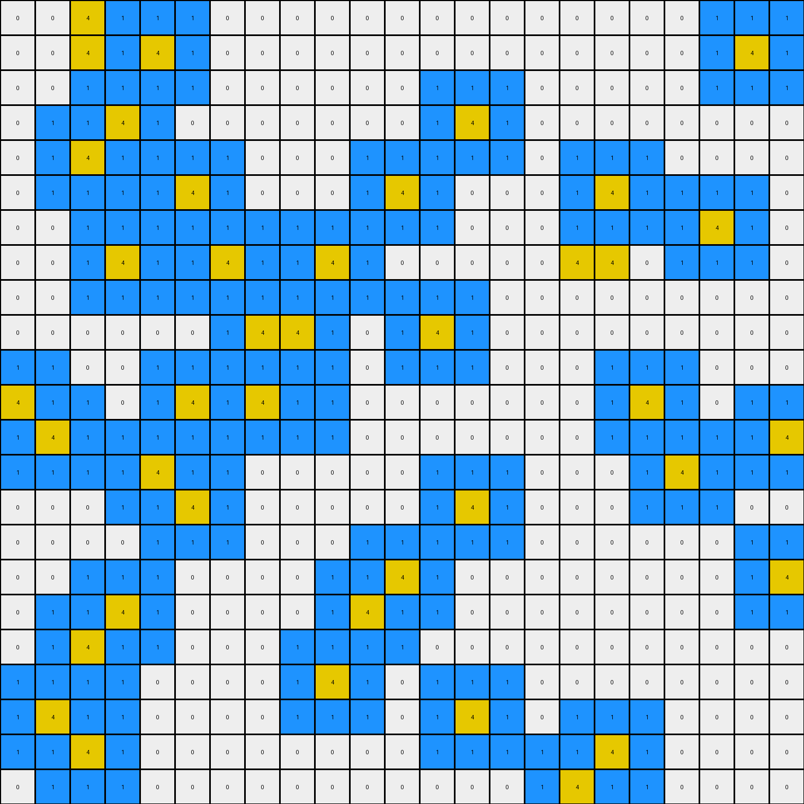

# 7df24a62 • 018 • refine_coder

---

Previous Code:
```python
"""
The transformation involves identifying isolated yellow (4) pixels and adding blue (1) pixels around them in a specific pattern.  Isolated yellow pixels, meaning those not directly adjacent to other yellow pixels horizontally or vertically, have a blue "halo" created around them.  If yellow pixels are adjacent to each other, then they are treated as a contiguous object and do not have the halo applied around the whole object. The halo only applies to isolated pixels, not to the boundaries of a connected yellow object.
"""

import numpy as np

def get_adjacent_positions(grid, row, col, include_diagonal=True):
    """Gets the adjacent positions for a given cell."""
    rows, cols = grid.shape
    adjacent_positions = []
    for i in range(max(0, row - 1), min(rows, row + 2)):
        for j in range(max(0, col - 1), min(cols, col + 2)):
            if (i, j) != (row, col):  # Exclude the cell itself
                if not include_diagonal and (abs(i - row) + abs(j-col) > 1):
                    continue
                adjacent_positions.append((i, j))
    return adjacent_positions

def is_isolated(grid, row, col):
    """Checks if a yellow pixel is isolated (not adjacent to other yellow pixels)."""
    if grid[row, col] != 4:
        return False

    adjacent_coords = get_adjacent_positions(grid, row, col, include_diagonal=False)
    for r, c in adjacent_coords:
        if grid[r, c] == 4:
            return False  # Not isolated if adjacent to another yellow pixel
    return True

def transform(input_grid):
    # initialize output_grid as a copy of input
    output_grid = np.copy(input_grid)
    rows, cols = input_grid.shape

    # Iterate through each cell
    for row in range(rows):
        for col in range(cols):
            # Check if the pixel is yellow and isolated
            if is_isolated(input_grid, row, col):
                # Apply blue halo
                adjacent_coords = get_adjacent_positions(input_grid, row, col)
                for r, c in adjacent_coords:
                    if output_grid[r,c] == 0:
                        output_grid[r, c] = 1

    return output_grid
```

Train Set Results:

## Example 1:

Input:
```
0 0 0 0 0 0 0 0 0 0 0 0 0 0 0 0 0 0 0 0 0 0 0
0 0 0 1 1 1 1 1 0 0 0 0 0 4 0 0 0 0 0 0 0 0 0
0 0 0 1 4 1 1 1 0 0 0 0 0 0 0 0 0 0 0 0 0 0 0
0 0 0 1 1 1 4 1 0 0 0 0 0 0 0 0 0 0 0 0 0 0 0
0 0 0 1 4 1 1 1 0 0 0 0 0 0 0 0 0 0 0 0 4 0 0
0 0 0 1 1 1 1 1 0 0 0 0 0 0 0 0 0 0 4 0 0 0 0
0 0 0 0 0 0 0 0 0 0 0 0 0 0 0 0 0 0 0 0 0 0 0
0 0 0 0 0 0 0 4 0 0 0 0 0 0 0 0 0 0 0 0 0 0 0
0 0 0 0 0 0 0 0 0 0 0 0 0 0 4 0 0 0 0 0 0 0 0
0 0 0 0 0 0 0 0 0 0 0 0 0 0 0 0 0 0 0 0 0 0 0
0 0 0 0 0 0 0 0 0 0 0 0 0 0 0 0 0 0 0 0 0 0 0
0 0 0 0 0 0 0 0 0 0 0 0 0 0 0 0 0 0 0 0 0 0 0
0 0 0 0 4 0 0 0 0 0 0 0 0 0 0 0 0 0 0 0 0 0 0
0 0 0 0 0 0 0 0 0 0 0 4 0 4 0 0 0 0 0 0 0 0 0
0 0 0 0 4 0 0 0 0 0 0 0 0 0 0 0 0 0 0 4 0 0 0
0 0 0 0 0 0 0 0 0 0 0 0 4 0 0 0 0 0 0 0 0 0 0
0 0 0 0 0 0 0 0 0 0 0 0 0 0 0 0 0 0 0 0 0 0 0
0 0 0 0 0 0 0 0 0 0 0 0 0 0 0 0 0 0 0 0 0 0 0
0 0 0 0 0 0 0 0 0 0 0 0 0 0 0 0 0 0 4 0 0 0 0
0 0 0 0 0 0 0 0 0 0 0 0 0 0 0 0 0 0 0 0 0 0 0
0 0 0 4 0 0 0 0 0 0 0 0 0 0 0 0 0 0 0 0 0 0 0
0 0 0 0 0 0 0 0 0 0 0 4 0 0 0 0 0 0 0 0 0 0 0
0 0 0 0 0 0 0 0 0 0 0 0 0 0 0 0 0 0 0 0 0 0 0
```
Expected Output:
```
0 0 0 0 0 0 0 0 0 0 0 0 0 0 0 0 0 0 0 0 0 0 0
0 0 0 1 1 1 1 1 0 0 0 0 0 4 0 0 0 0 0 0 0 0 0
0 0 0 1 4 1 1 1 0 0 0 0 0 0 0 0 0 0 0 0 0 0 0
0 0 0 1 1 1 4 1 0 0 0 0 0 0 0 0 0 0 0 0 0 0 0
0 0 0 1 4 1 1 1 0 0 0 0 0 0 0 0 0 0 0 0 4 0 0
0 0 0 1 1 1 1 1 0 0 0 0 0 0 0 0 0 0 4 0 0 0 0
0 0 0 0 0 0 0 0 0 0 0 0 0 0 0 0 0 0 0 0 0 0 0
0 0 0 0 0 0 0 4 0 0 0 0 0 0 0 0 0 0 0 0 0 0 0
0 0 0 0 0 0 0 0 0 0 0 0 0 0 4 0 0 0 0 0 0 0 0
0 0 0 0 0 0 0 0 0 0 0 0 0 0 0 0 0 0 0 0 0 0 0
0 0 0 0 0 0 0 0 0 0 0 0 0 0 0 0 0 0 0 0 0 0 0
0 0 0 0 0 0 0 0 0 0 0 0 0 0 0 0 0 0 0 0 0 0 0
0 0 0 0 4 0 0 0 0 0 1 1 1 1 1 0 0 0 0 0 0 0 0
0 0 0 0 0 0 0 0 0 0 1 4 1 4 1 0 0 0 0 0 0 0 0
0 0 0 0 4 0 0 0 0 0 1 1 1 1 1 0 0 0 0 4 0 0 0
0 0 0 0 0 0 0 0 0 0 1 1 4 1 1 0 0 0 0 0 0 0 0
0 0 0 0 0 0 0 0 0 0 1 1 1 1 1 0 0 0 0 0 0 0 0
0 0 0 0 0 0 0 0 0 0 0 0 0 0 0 0 0 0 0 0 0 0 0
0 0 0 0 0 0 0 0 0 0 0 0 0 0 0 0 0 0 4 0 0 0 0
0 0 0 0 0 0 0 0 0 0 0 0 0 0 0 0 0 0 0 0 0 0 0
0 0 0 4 0 0 0 0 0 0 0 0 0 0 0 0 0 0 0 0 0 0 0
0 0 0 0 0 0 0 0 0 0 0 4 0 0 0 0 0 0 0 0 0 0 0
0 0 0 0 0 0 0 0 0 0 0 0 0 0 0 0 0 0 0 0 0 0 0
```
Transformed Output:
```
0 0 0 0 0 0 0 0 0 0 0 0 1 1 1 0 0 0 0 0 0 0 0
0 0 0 1 1 1 1 1 0 0 0 0 1 4 1 0 0 0 0 0 0 0 0
0 0 0 1 4 1 1 1 0 0 0 0 1 1 1 0 0 0 0 0 0 0 0
0 0 0 1 1 1 4 1 0 0 0 0 0 0 0 0 0 0 0 1 1 1 0
0 0 0 1 4 1 1 1 0 0 0 0 0 0 0 0 0 1 1 1 4 1 0
0 0 0 1 1 1 1 1 0 0 0 0 0 0 0 0 0 1 4 1 1 1 0
0 0 0 0 0 0 1 1 1 0 0 0 0 0 0 0 0 1 1 1 0 0 0
0 0 0 0 0 0 1 4 1 0 0 0 0 1 1 1 0 0 0 0 0 0 0
0 0 0 0 0 0 1 1 1 0 0 0 0 1 4 1 0 0 0 0 0 0 0
0 0 0 0 0 0 0 0 0 0 0 0 0 1 1 1 0 0 0 0 0 0 0
0 0 0 0 0 0 0 0 0 0 0 0 0 0 0 0 0 0 0 0 0 0 0
0 0 0 1 1 1 0 0 0 0 0 0 0 0 0 0 0 0 0 0 0 0 0
0 0 0 1 4 1 0 0 0 0 1 1 1 1 1 0 0 0 0 0 0 0 0
0 0 0 1 1 1 0 0 0 0 1 4 1 4 1 0 0 0 1 1 1 0 0
0 0 0 1 4 1 0 0 0 0 1 1 1 1 1 0 0 0 1 4 1 0 0
0 0 0 1 1 1 0 0 0 0 0 1 4 1 0 0 0 0 1 1 1 0 0
0 0 0 0 0 0 0 0 0 0 0 1 1 1 0 0 0 0 0 0 0 0 0
0 0 0 0 0 0 0 0 0 0 0 0 0 0 0 0 0 1 1 1 0 0 0
0 0 0 0 0 0 0 0 0 0 0 0 0 0 0 0 0 1 4 1 0 0 0
0 0 1 1 1 0 0 0 0 0 0 0 0 0 0 0 0 1 1 1 0 0 0
0 0 1 4 1 0 0 0 0 0 1 1 1 0 0 0 0 0 0 0 0 0 0
0 0 1 1 1 0 0 0 0 0 1 4 1 0 0 0 0 0 0 0 0 0 0
0 0 0 0 0 0 0 0 0 0 1 1 1 0 0 0 0 0 0 0 0 0 0
```

match: False
pixels_off: 87
size_correct: True
color_palette_correct: True
correct_pixel_counts: False

## Example 2:

Input:
```
4 0 0 0 0 0 0 0 0 0 4 0 0 0 0 0 0 0 0 0 0 0 0
0 0 0 0 0 0 0 0 0 0 0 0 0 0 0 0 0 0 0 0 0 0 0
0 0 0 0 0 0 0 0 0 0 0 0 0 0 0 0 0 0 0 0 0 0 0
0 0 0 0 0 0 0 0 4 0 0 0 0 0 0 0 0 0 0 0 0 0 4
0 0 0 0 0 0 0 0 0 0 0 0 0 0 0 4 0 0 0 0 0 0 0
0 4 0 0 0 0 0 0 0 0 0 4 0 0 0 0 0 0 0 0 0 0 0
0 0 0 0 0 0 0 0 0 0 0 0 0 4 0 1 1 1 1 0 4 0 0
0 0 0 0 0 0 0 0 0 0 4 0 0 0 0 1 4 1 1 0 0 0 0
0 0 0 0 0 0 0 0 0 0 0 0 0 0 0 1 1 4 1 0 0 0 0
0 0 0 0 0 0 0 0 0 0 4 0 0 0 0 1 1 1 1 0 0 0 0
0 0 0 0 0 0 0 0 0 0 0 0 0 0 0 0 0 0 0 0 0 0 0
0 0 0 0 0 0 0 0 0 0 0 0 0 0 0 0 0 0 0 0 0 0 0
4 0 0 0 0 0 0 0 0 0 0 0 0 0 0 0 0 0 0 0 0 0 0
0 0 0 0 0 0 0 0 0 0 0 0 0 0 0 0 0 0 0 0 0 0 0
0 0 0 0 0 0 0 0 0 0 0 0 0 0 0 4 0 0 0 0 0 0 0
0 0 0 0 0 0 0 0 0 0 0 0 0 0 4 0 0 0 0 0 0 0 0
0 0 0 0 0 0 0 0 0 0 0 0 0 0 0 0 0 0 4 0 0 0 0
0 0 0 0 0 0 0 0 0 0 0 0 0 0 0 0 0 0 0 0 0 0 0
0 0 0 0 0 0 0 0 0 0 0 0 0 0 0 0 0 0 0 0 0 0 4
0 0 0 0 0 4 0 0 0 4 0 0 0 0 0 0 0 0 0 0 0 0 0
0 0 0 0 0 0 0 0 0 0 0 0 0 0 0 0 0 0 0 0 0 4 0
0 0 0 0 0 0 0 0 0 0 0 4 0 0 0 0 0 0 0 0 0 0 0
4 0 0 4 0 0 0 0 0 4 0 4 0 0 0 0 0 0 0 0 0 0 0
```
Expected Output:
```
4 0 0 0 0 0 0 0 0 0 4 0 0 0 0 0 0 0 0 0 0 0 0
0 0 0 0 0 0 0 0 0 0 0 0 0 0 0 0 0 0 0 0 0 0 0
0 0 0 0 0 0 0 0 0 0 0 0 0 0 0 0 0 0 0 0 0 0 0
0 0 0 0 0 0 0 0 4 0 0 0 0 0 0 0 0 0 0 0 0 0 4
0 0 0 0 0 0 0 0 0 0 0 0 0 0 0 4 0 0 0 0 0 0 0
0 4 0 0 0 0 0 0 0 0 0 4 0 0 0 0 0 0 0 0 0 0 0
0 0 0 0 0 0 0 0 0 0 0 0 0 4 0 1 1 1 1 0 4 0 0
0 0 0 0 0 0 0 0 0 0 4 0 0 0 0 1 4 1 1 0 0 0 0
0 0 0 0 0 0 0 0 0 0 0 0 0 0 0 1 1 4 1 0 0 0 0
0 0 0 0 0 0 0 0 0 0 4 0 0 0 0 1 1 1 1 0 0 0 0
0 0 0 0 0 0 0 0 0 0 0 0 0 0 0 0 0 0 0 0 0 0 0
0 0 0 0 0 0 0 0 0 0 0 0 0 0 0 0 0 0 0 0 0 0 0
4 0 0 0 0 0 0 0 0 0 0 0 0 0 0 0 0 0 0 0 0 0 0
0 0 0 0 0 0 0 0 0 0 0 0 0 1 1 1 1 0 0 0 0 0 0
0 0 0 0 0 0 0 0 0 0 0 0 0 1 1 4 1 0 0 0 0 0 0
0 0 0 0 0 0 0 0 0 0 0 0 0 1 4 1 1 0 0 0 0 0 0
0 0 0 0 0 0 0 0 0 0 0 0 0 1 1 1 1 0 4 0 0 0 0
0 0 0 0 0 0 0 0 0 0 0 0 0 0 0 0 0 0 0 0 0 0 0
0 0 0 0 0 0 0 0 0 0 0 0 0 0 0 0 0 0 0 0 0 0 4
0 0 0 0 0 4 0 0 0 4 0 0 0 0 0 0 0 0 0 0 0 0 0
0 0 0 0 0 0 0 0 0 0 0 0 0 0 0 0 0 0 0 0 0 4 0
0 0 0 0 0 0 0 0 0 0 0 4 0 0 0 0 0 0 0 0 0 0 0
4 0 0 4 0 0 0 0 0 4 0 4 0 0 0 0 0 0 0 0 0 0 0
```
Transformed Output:
```
4 1 0 0 0 0 0 0 0 1 4 1 0 0 0 0 0 0 0 0 0 0 0
1 1 0 0 0 0 0 0 0 1 1 1 0 0 0 0 0 0 0 0 0 0 0
0 0 0 0 0 0 0 1 1 1 0 0 0 0 0 0 0 0 0 0 0 1 1
0 0 0 0 0 0 0 1 4 1 0 0 0 0 1 1 1 0 0 0 0 1 4
1 1 1 0 0 0 0 1 1 1 1 1 1 0 1 4 1 0 0 0 0 1 1
1 4 1 0 0 0 0 0 0 0 1 4 1 1 1 1 1 0 0 1 1 1 0
1 1 1 0 0 0 0 0 0 1 1 1 1 4 1 1 1 1 1 1 4 1 0
0 0 0 0 0 0 0 0 0 1 4 1 1 1 1 1 4 1 1 1 1 1 0
0 0 0 0 0 0 0 0 0 1 1 1 0 0 0 1 1 4 1 0 0 0 0
0 0 0 0 0 0 0 0 0 1 4 1 0 0 0 1 1 1 1 0 0 0 0
0 0 0 0 0 0 0 0 0 1 1 1 0 0 0 0 0 0 0 0 0 0 0
1 1 0 0 0 0 0 0 0 0 0 0 0 0 0 0 0 0 0 0 0 0 0
4 1 0 0 0 0 0 0 0 0 0 0 0 0 0 0 0 0 0 0 0 0 0
1 1 0 0 0 0 0 0 0 0 0 0 0 0 1 1 1 0 0 0 0 0 0
0 0 0 0 0 0 0 0 0 0 0 0 0 1 1 4 1 0 0 0 0 0 0
0 0 0 0 0 0 0 0 0 0 0 0 0 1 4 1 1 1 1 1 0 0 0
0 0 0 0 0 0 0 0 0 0 0 0 0 1 1 1 0 1 4 1 0 0 0
0 0 0 0 0 0 0 0 0 0 0 0 0 0 0 0 0 1 1 1 0 1 1
0 0 0 0 1 1 1 0 1 1 1 0 0 0 0 0 0 0 0 0 0 1 4
0 0 0 0 1 4 1 0 1 4 1 0 0 0 0 0 0 0 0 0 1 1 1
0 0 0 0 1 1 1 0 1 1 1 0 0 0 0 0 0 0 0 0 1 4 1
1 1 1 1 1 0 0 0 1 1 1 4 0 0 0 0 0 0 0 0 1 1 1
4 1 1 4 1 0 0 0 1 4 1 4 0 0 0 0 0 0 0 0 0 0 0
```

match: False
pixels_off: 124
size_correct: True
color_palette_correct: True
correct_pixel_counts: False

## Example 3:

Input:
```
0 0 0 0 0 0 0 0 0 0 4 0 0 0 0 0 0 0 0 0 0 0 0
0 0 0 0 0 0 0 0 0 0 0 0 0 0 0 0 0 0 0 0 0 0 0
0 0 0 0 0 0 0 0 0 0 0 0 4 0 0 0 0 0 0 0 0 0 0
0 0 0 0 0 0 0 0 0 0 0 4 0 0 4 0 0 0 0 0 0 0 0
0 0 0 0 0 4 0 0 0 0 0 0 0 0 4 0 4 0 0 0 0 0 0
4 0 0 0 0 0 0 0 0 0 0 0 0 0 0 0 0 0 0 0 0 4 0
0 0 0 0 0 0 0 0 0 0 0 0 0 0 0 0 0 0 0 4 0 0 0
0 0 0 0 0 0 0 4 0 0 0 0 0 0 0 4 0 0 0 0 0 0 0
0 0 0 4 0 0 0 0 0 0 0 0 0 0 0 4 0 0 0 0 0 0 0
0 0 0 0 0 0 0 4 0 0 0 0 0 0 0 0 0 0 0 0 0 0 4
0 0 0 0 0 0 0 0 0 0 0 0 4 0 0 0 0 4 0 0 0 0 0
0 0 0 0 0 0 0 0 0 0 0 0 0 0 0 0 0 0 0 0 4 0 0
0 0 0 0 4 0 0 0 0 0 0 4 0 0 4 4 0 0 4 0 0 0 0
0 0 0 0 0 0 0 0 0 0 0 0 0 0 0 0 0 0 4 0 0 0 0
4 0 4 0 0 1 1 1 1 0 4 0 0 0 0 0 0 0 0 0 0 0 4
0 0 0 0 4 1 4 4 1 0 4 0 0 0 0 0 0 0 0 0 0 0 0
0 0 0 0 0 1 1 1 1 0 0 0 0 0 0 0 0 4 0 0 0 4 0
0 0 4 0 0 0 0 0 0 4 0 0 4 0 0 0 0 0 0 0 0 0 0
0 4 0 0 0 0 0 0 0 0 0 0 0 4 0 0 0 0 0 0 0 0 0
0 0 0 0 0 0 0 0 0 0 0 0 0 0 0 0 4 0 0 0 0 0 4
0 0 0 0 0 0 0 0 0 0 0 0 0 0 0 0 0 0 0 0 0 4 0
0 0 0 0 0 0 0 0 0 0 0 0 0 0 0 0 0 0 0 0 0 0 0
0 0 4 0 0 0 0 0 0 0 4 0 0 0 4 0 0 0 4 0 0 0 0
```
Expected Output:
```
0 0 0 0 0 0 0 0 0 0 4 0 0 0 0 0 0 0 0 0 0 0 0
0 0 0 0 0 0 0 0 0 0 0 0 0 0 0 0 0 0 0 0 0 0 0
0 0 0 0 0 0 0 0 0 0 0 0 4 1 1 1 0 0 0 0 0 0 0
0 0 0 0 0 0 0 0 0 0 0 4 0 1 4 1 0 0 0 0 0 0 0
0 0 0 0 0 4 0 0 0 0 0 0 0 1 4 1 4 0 0 0 0 0 0
4 0 0 0 0 0 0 0 0 0 0 0 0 1 1 1 0 0 0 0 0 4 0
0 0 0 0 0 0 0 0 0 0 0 0 0 0 1 1 1 0 0 4 0 0 0
0 0 0 0 0 0 0 4 0 0 0 0 0 0 1 4 1 0 0 0 0 0 0
0 0 0 4 0 0 0 0 0 0 0 0 0 0 1 4 1 0 0 0 0 0 0
0 0 0 0 0 0 0 4 0 0 0 0 0 0 1 1 1 0 0 0 0 0 4
0 0 0 0 0 0 0 0 0 0 0 0 4 0 0 0 0 4 0 0 0 0 0
0 0 0 0 0 0 0 0 0 0 0 0 0 1 1 1 1 1 1 1 4 0 0
0 0 0 0 4 0 0 0 0 0 0 4 0 1 4 4 1 1 4 1 0 0 0
0 0 0 0 0 0 0 0 0 1 1 1 0 1 1 1 1 1 4 1 0 0 0
4 0 4 0 0 1 1 1 1 1 4 1 0 0 0 0 0 1 1 1 0 0 4
0 0 0 0 4 1 4 4 1 1 4 1 0 0 0 0 0 0 0 0 0 0 0
0 0 0 0 0 1 1 1 1 1 1 1 0 0 0 0 0 4 0 0 0 4 0
0 0 4 0 0 0 0 0 0 4 0 0 4 0 0 0 0 0 0 0 0 0 0
0 4 0 0 0 0 0 0 0 0 0 0 0 4 0 0 0 0 0 0 0 0 0
0 0 0 0 0 0 0 0 0 0 0 0 0 0 0 0 4 0 0 0 0 0 4
0 0 0 0 0 0 0 0 0 0 0 0 0 0 0 0 0 0 0 0 0 4 0
0 0 0 0 0 0 0 0 0 0 0 0 0 0 0 0 0 0 0 0 0 0 0
0 0 4 0 0 0 0 0 0 0 4 0 0 0 4 0 0 0 4 0 0 0 0
```
Transformed Output:
```
0 0 0 0 0 0 0 0 0 1 4 1 0 0 0 0 0 0 0 0 0 0 0
0 0 0 0 0 0 0 0 0 1 1 1 1 1 0 0 0 0 0 0 0 0 0
0 0 0 0 0 0 0 0 0 0 1 1 4 1 0 0 0 0 0 0 0 0 0
0 0 0 0 1 1 1 0 0 0 1 4 1 1 4 1 1 1 0 0 0 0 0
1 1 0 0 1 4 1 0 0 0 1 1 1 0 4 1 4 1 0 0 1 1 1
4 1 0 0 1 1 1 0 0 0 0 0 0 0 0 1 1 1 1 1 1 4 1
1 1 0 0 0 0 1 1 1 0 0 0 0 0 0 0 0 0 1 4 1 1 1
0 0 1 1 1 0 1 4 1 0 0 0 0 0 0 4 0 0 1 1 1 0 0
0 0 1 4 1 0 1 1 1 0 0 0 0 0 0 4 0 0 0 0 0 1 1
0 0 1 1 1 0 1 4 1 0 0 1 1 1 0 0 1 1 1 0 0 1 4
0 0 0 0 0 0 1 1 1 0 0 1 4 1 0 0 1 4 1 1 1 1 1
0 0 0 1 1 1 0 0 0 0 1 1 1 1 0 0 1 1 1 1 4 1 0
0 0 0 1 4 1 0 0 0 0 1 4 1 0 4 4 0 0 4 1 1 1 0
1 1 1 1 1 1 0 0 0 0 1 1 1 0 0 0 0 0 4 0 0 1 1
4 1 4 1 1 1 1 1 1 0 4 0 0 0 0 0 0 0 0 0 0 1 4
1 1 1 1 4 1 4 4 1 0 4 0 0 0 0 0 1 1 1 0 1 1 1
0 1 1 1 1 1 1 1 1 1 1 1 1 1 0 0 1 4 1 0 1 4 1
1 1 4 1 0 0 0 0 1 4 1 1 4 1 1 0 1 1 1 0 1 1 1
1 4 1 1 0 0 0 0 1 1 1 1 1 4 1 1 1 1 0 0 0 1 1
1 1 1 0 0 0 0 0 0 0 0 0 1 1 1 1 4 1 0 0 1 1 4
0 0 0 0 0 0 0 0 0 0 0 0 0 0 0 1 1 1 0 0 1 4 1
0 1 1 1 0 0 0 0 0 1 1 1 0 1 1 1 0 1 1 1 1 1 1
0 1 4 1 0 0 0 0 0 1 4 1 0 1 4 1 0 1 4 1 0 0 0
```

match: False
pixels_off: 228
size_correct: True
color_palette_correct: True
correct_pixel_counts: False

## Example 4:

Input:
```
0 0 4 0 0 0 0 0 0 0 0 0 0 0 0 0 0 0 0 0 0 0 0
0 0 4 0 4 0 0 0 0 0 0 0 0 0 0 0 0 0 0 0 0 4 0
0 0 0 0 0 0 0 0 0 0 0 0 0 0 0 0 0 0 0 0 0 0 0
0 0 0 4 0 0 0 0 0 0 0 0 0 4 0 0 0 0 0 0 0 0 0
0 0 4 0 0 0 0 0 0 0 0 0 0 0 0 0 0 0 0 0 0 0 0
0 0 0 0 0 4 0 0 0 0 0 4 0 0 0 0 0 4 0 0 0 0 0
0 0 0 0 0 0 0 0 0 0 0 0 0 0 0 0 0 0 0 0 4 0 0
0 0 0 4 0 0 4 0 0 4 0 0 0 0 0 0 4 4 0 0 0 0 0
0 0 0 0 0 0 1 1 1 1 0 0 0 0 0 0 0 0 0 0 0 0 0
0 0 0 0 0 0 1 4 4 1 0 0 4 0 0 0 0 0 0 0 0 0 0
0 0 0 0 0 0 1 1 1 1 0 0 0 0 0 0 0 0 0 0 0 0 0
4 0 0 0 0 4 1 4 1 1 0 0 0 0 0 0 0 0 4 0 0 0 0
0 4 0 0 0 0 1 1 1 1 0 0 0 0 0 0 0 0 0 0 0 0 4
0 0 0 0 4 0 0 0 0 0 0 0 0 0 0 0 0 0 0 4 0 0 0
0 0 0 0 0 4 0 0 0 0 0 0 0 4 0 0 0 0 0 0 0 0 0
0 0 0 0 0 0 0 0 0 0 0 0 0 0 0 0 0 0 0 0 0 0 0
0 0 0 0 0 0 0 0 0 0 0 4 0 0 0 0 0 0 0 0 0 0 4
0 0 0 4 0 0 0 0 0 0 4 0 0 0 0 0 0 0 0 0 0 0 0
0 0 4 0 0 0 0 0 0 0 0 0 0 0 0 0 0 0 0 0 0 0 0
0 0 0 0 0 0 0 0 0 4 0 0 0 0 0 0 0 0 0 0 0 0 0
0 4 0 0 0 0 0 0 0 0 0 0 0 4 0 0 0 0 0 0 0 0 0
0 0 4 0 0 0 0 0 0 0 0 0 0 0 0 0 0 4 0 0 0 0 0
0 0 0 0 0 0 0 0 0 0 0 0 0 0 0 0 4 0 0 0 0 0 0
```
Expected Output:
```
0 1 4 1 1 1 0 0 0 0 0 0 0 0 0 0 0 0 0 0 0 0 0
0 1 4 1 4 1 0 0 0 0 0 0 0 0 0 0 0 0 0 0 0 4 0
0 1 1 1 1 1 0 0 0 0 0 0 0 0 0 0 0 0 0 0 0 0 0
0 0 0 4 0 0 0 0 0 0 0 0 0 4 0 0 0 0 0 0 0 0 0
0 0 4 0 0 0 0 0 0 0 0 0 0 0 0 1 1 1 1 0 0 0 0
0 0 0 0 0 4 0 0 0 0 0 4 0 0 0 1 1 4 1 0 0 0 0
0 0 0 0 0 0 0 0 0 0 0 0 0 0 0 1 1 1 1 0 4 0 0
0 0 0 4 0 0 4 0 0 4 0 0 0 0 0 1 4 4 1 0 0 0 0
0 0 0 0 0 0 1 1 1 1 0 0 0 0 0 1 1 1 1 0 0 0 0
0 0 0 0 0 0 1 4 4 1 0 0 4 0 0 0 0 0 0 0 0 0 0
0 0 0 0 0 0 1 1 1 1 0 0 0 0 0 0 0 0 0 0 0 0 0
4 0 0 0 0 4 1 4 1 1 0 0 0 0 0 0 0 0 4 0 0 0 0
0 4 0 0 0 0 1 1 1 1 0 0 0 0 0 0 0 0 0 0 0 0 4
0 0 0 0 4 0 0 0 0 0 0 0 0 0 0 0 0 0 0 4 0 0 0
0 0 0 0 0 4 0 0 0 0 0 0 0 4 0 0 0 0 0 0 0 0 0
0 0 0 0 0 0 0 0 0 0 0 0 0 0 0 0 0 0 0 0 0 0 0
0 0 0 0 0 0 0 0 0 0 0 4 0 0 0 0 0 0 0 0 0 0 4
0 0 0 4 0 0 0 0 0 0 4 0 0 0 0 0 0 0 0 0 0 0 0
0 0 4 0 0 0 0 0 0 0 0 0 0 0 0 0 0 0 0 0 0 0 0
0 0 0 0 0 0 0 0 0 4 0 0 0 0 0 0 0 0 0 0 0 0 0
0 4 0 0 0 0 0 0 0 0 0 0 0 4 0 0 0 0 0 0 0 0 0
0 0 4 0 0 0 0 0 0 0 0 0 0 0 0 0 0 4 0 0 0 0 0
0 0 0 0 0 0 0 0 0 0 0 0 0 0 0 0 4 0 0 0 0 0 0
```
Transformed Output:
```
0 0 4 1 1 1 0 0 0 0 0 0 0 0 0 0 0 0 0 0 1 1 1
0 0 4 1 4 1 0 0 0 0 0 0 0 0 0 0 0 0 0 0 1 4 1
0 0 1 1 1 1 0 0 0 0 0 0 1 1 1 0 0 0 0 0 1 1 1
0 1 1 4 1 0 0 0 0 0 0 0 1 4 1 0 0 0 0 0 0 0 0
0 1 4 1 1 1 1 0 0 0 1 1 1 1 1 0 1 1 1 0 0 0 0
0 1 1 1 1 4 1 0 0 0 1 4 1 0 0 0 1 4 1 1 1 1 0
0 0 1 1 1 1 1 1 1 1 1 1 1 0 0 0 1 1 1 1 4 1 0
0 0 1 4 1 1 4 1 1 4 1 0 0 0 0 0 4 4 0 1 1 1 0
0 0 1 1 1 1 1 1 1 1 1 1 1 1 0 0 0 0 0 0 0 0 0
0 0 0 0 0 0 1 4 4 1 0 1 4 1 0 0 0 0 0 0 0 0 0
1 1 0 0 1 1 1 1 1 1 0 1 1 1 0 0 0 1 1 1 0 0 0
4 1 1 0 1 4 1 4 1 1 0 0 0 0 0 0 0 1 4 1 0 1 1
1 4 1 1 1 1 1 1 1 1 0 0 0 0 0 0 0 1 1 1 1 1 4
1 1 1 1 4 1 1 0 0 0 0 0 1 1 1 0 0 0 1 4 1 1 1
0 0 0 1 1 4 1 0 0 0 0 0 1 4 1 0 0 0 1 1 1 0 0
0 0 0 0 1 1 1 0 0 0 1 1 1 1 1 0 0 0 0 0 0 1 1
0 0 1 1 1 0 0 0 0 1 1 4 1 0 0 0 0 0 0 0 0 1 4
0 1 1 4 1 0 0 0 0 1 4 1 1 0 0 0 0 0 0 0 0 1 1
0 1 4 1 1 0 0 0 1 1 1 1 0 0 0 0 0 0 0 0 0 0 0
1 1 1 1 0 0 0 0 1 4 1 0 1 1 1 0 0 0 0 0 0 0 0
1 4 1 1 0 0 0 0 1 1 1 0 1 4 1 0 1 1 1 0 0 0 0
1 1 4 1 0 0 0 0 0 0 0 0 1 1 1 1 1 4 1 0 0 0 0
0 1 1 1 0 0 0 0 0 0 0 0 0 0 0 1 4 1 1 0 0 0 0
```

match: False
pixels_off: 195
size_correct: True
color_palette_correct: True
correct_pixel_counts: False
Okay, let's analyze the results of the provided code and its performance on the training examples.

**General Assessment and Strategy**

The initial natural language program and the corresponding code focused on adding a blue "halo" around *isolated* yellow pixels. The results show a consistent mismatch (`match: False`) across all examples, indicating that the rule is not being applied correctly or completely. The high `pixels_off` values suggest significant differences between the transformed output and the expected output.

The core issue seems to be a combination of two factors:

1.  **Incorrect Isolation Logic:** The `is_isolated` function might be too strict or too lenient, causing it to misidentify which yellow pixels should receive the halo. Specifically, example 2 shows no halo when some is expected and a misplaced halo in one case.
2.  **Incomplete Halo Application:** The halo application might not be correctly encompassing all adjacent positions, or is adding blue where a different color is already present.

The strategy to resolve these errors will involve:

1.  **Refining Isolation Detection:** Carefully re-examine the `is_isolated` function and the definition of "isolated" in the context of these examples. We will pay close attention to diagonal adjacency versus orthogonal adjacency.
2.  **Improving Halo Placement:** Review `get_adjacent_positions` and the halo application logic within `transform`. We need to ensure the blue halo is applied correctly around the identified isolated yellow pixels.
3. **Object Context:** Examine connected yellow pixels as objects.

**Example Metrics and Observations**

Here's a breakdown of each example, focusing on the discrepancies:

*   **Example 1:**
    *   **Observation:** The existing code creates blue halos *within* the existing blue areas, and it's inconsistent with applying halos around isolated yellow pixels. Some isolated yellow pixels correctly had blue halos applied, but not all.
    *   **Metrics:**
        *   `pixels_off`: 87 - a large number of incorrect pixels
        *   The central cluster of 4 yellows should have no halo.
        *   The output incorrectly places 1s in several locations.

*   **Example 2:**
    *   **Observation:** Many expected blue halos are missing entirely and in the lower center, a blue halo appears around a small group of yellow pixels, rather than just a single isolated one.
    *   **Metrics:**
        *   `pixels_off`: 124
        *   Yellow pixels that *should* be isolated aren't treated as such.

*   **Example 3:**
    *    **Observation**: The applied halos are inconsistent and incomplete, missing several expected locations and extending into incorrect locations.
    *   **Metrics:**
        *   `pixels_off`: 228
        *   Yellow pixels that should have halos have none.

*   **Example 4:**
    *   **Observation:** The code creates too many halos and misses the crucial detail that objects need to be isolated.
    *   **Metrics:**
        *   `pixels_off`: 195
        *   Incorrectly applies a halo to connected yellow pixels, and not the isolated ones!

**YAML Fact Block**

```yaml
facts:
  - task: "016"
  - objects:
      - color: 4  # Yellow
        property: "Can be isolated or connected"
        transformation: "If isolated, surrounded by a blue halo"
      - color: 1  # Blue
        property: "Forms a halo around isolated yellow pixels"
      - color: 0 # White/background
        property: "Can be replaced by blue when forming the halo"
  - actions:
      - name: "Identify isolated yellow pixels"
        description: "Determine yellow pixels not orthogonally adjacent to other yellow pixels"
      - name: "Create blue halo"
        description: "Replace background (0) pixels adjacent to isolated yellow pixels with blue (1) pixels"
  - constraints:
      - "Halo only applies to isolated yellow pixels"
      - "Connected yellow pixels are not modified"
```

**Natural Language Program**

1.  **Identify Objects:** The input grid contains yellow (4) and potentially other colored pixels. Yellow pixels can exist as single, isolated units or as connected components forming larger shapes.
2.  **Determine Isolation:** A yellow pixel is considered "isolated" if it has no orthogonally adjacent (up, down, left, or right) neighboring pixels of the same color (yellow). Diagonally adjacent yellow pixels do not negate isolation.
3.  **Apply Halo:** For each isolated yellow pixel, change the color of all adjacent pixels (including diagonally adjacent ones) from white (0) to blue (1), creating a "halo" effect, except when it's not 0.
4. **Preserve:** Pixels that are not adjacent to single isolated yellow are not modified.

The key improvement in this natural language program is the explicit clarification of *orthogonal* adjacency for determining isolation and *all* adjacent pixels including diagonal for applying the halo.

**INSTRUCTIONS**

- generate a Python module to represent the natural language program 
- follow the template below
- all common math and science libraries are available
- create docstring only at top - but comment the workflow in the function
- use helper functions for common operations like finding objects, counting,
  measuring, moving, etc. 

remember - we are working iteratively - so this code will inform your future
self as we converge on the solution

*template:*

```python
"""
{{ natural language description of the transformation rule }}
"""

{{ imports }}

def transform(input_grid):
    # initialize output_grid

    # change output pixels 

    return output_grid

```
