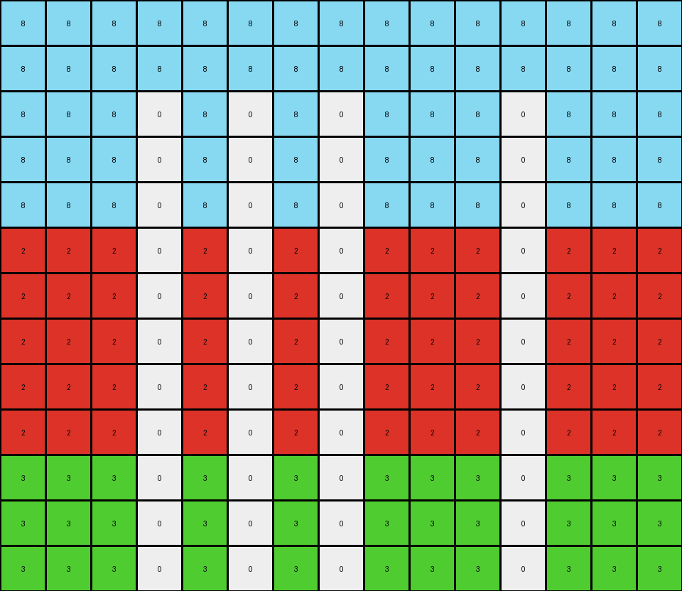
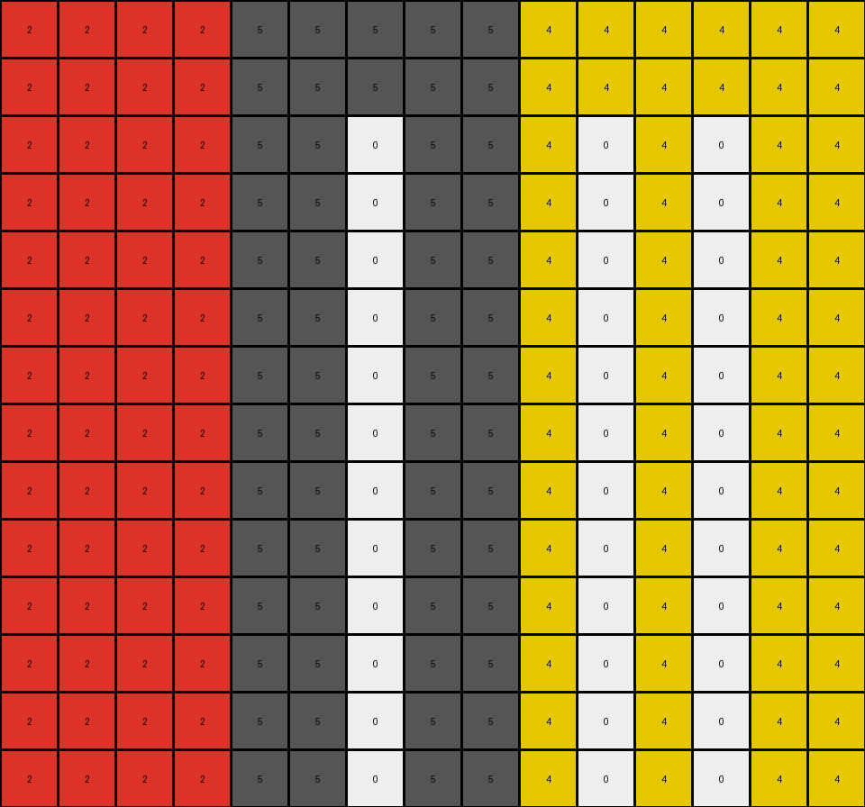

# 855e0971 • 005 • refine_dreamer

---

Previous Code:
```python
"""
1.  **Identify Bands:** Divide the input grid into horizontal bands based on color changes. The number of bands and their colors can vary.

2.  **Find White Pixel Columns:** Iterate through all rows *except* those belonging to the top band (which often remains unchanged, though its color isn't consistently grey). For each row, identify the *columns* that contain white (0) pixels.

3.  **Replicate in Non-Top Bands:** For *every* row that is *not* in the top band, set the pixel to white (0) in *all* columns identified in step 2.

4.  **Assemble Output:** Combine all rows. The final output will consist of the (potentially unchanged) top band, followed by the modified lower bands where the white pixels have been replicated downwards within their respective column across all non-grey band rows.
"""

import numpy as np

def transform(input_grid):
    # Initialize output grid as a copy of the input
    output_grid = np.copy(input_grid)
    
    # 1. Identify Bands (implicitly done by iterating rows)
    
    # 2. Find White Pixel Columns (in non-top bands)
    white_pixel_columns = set()
    for r in range(input_grid.shape[0]):
        for c in range(input_grid.shape[1]):
            if input_grid[r, c] == 0:
                white_pixel_columns.add(c)

    # Find the first band
    first_band_end_row = 0
    for i in range(1, input_grid.shape[0]):
        if not np.array_equal(input_grid[i], input_grid[0]):
            first_band_end_row = i
            break
    else: #the entire input grid is a single band
        first_band_end_row = input_grid.shape[0]
    
    # 3. Replicate in Non-Top Bands
    for r in range(first_band_end_row, output_grid.shape[0]):
        for c in white_pixel_columns:
            output_grid[r, c] = 0
            
    #Special Case: If the entire input grid is one band, and we have any white pixels.
    if first_band_end_row == input_grid.shape[0] and len(white_pixel_columns) > 0:
        for r in range(input_grid.shape[0]):
            for c in white_pixel_columns:
               if input_grid[r,c] != 0:
                   first_non_white_row = r
                   break
            else:
               continue
            break
        for r in range(first_non_white_row, output_grid.shape[0]):
            for c in white_pixel_columns:
                output_grid[r,c] = 0

    return output_grid
```

Train Set Results:

## Example 1:

Input:
```
5 5 5 5 5 5 5 5 5 5 5 5 5 5 5 5 5 5 5
5 5 5 5 5 5 5 5 5 5 5 5 5 5 5 5 5 5 5
4 4 4 4 4 4 4 4 4 4 4 4 4 4 4 4 4 4 4
4 4 4 4 4 4 4 4 4 4 4 4 4 0 4 4 4 4 4
4 4 4 4 4 4 4 4 4 4 4 4 4 4 4 4 4 4 4
4 4 4 4 0 4 4 4 4 4 4 4 4 4 4 4 4 4 4
4 4 4 4 4 4 4 4 4 4 4 4 4 4 4 4 4 4 4
4 4 4 4 4 4 4 4 4 4 4 4 4 4 4 4 4 4 4
4 4 4 4 4 4 4 4 4 4 4 4 4 4 4 4 4 4 4
8 8 8 8 8 8 8 8 8 8 8 8 8 8 8 8 8 8 8
8 8 8 8 8 8 8 8 8 8 8 8 8 8 8 8 8 8 8
8 8 8 8 8 8 8 8 8 8 8 8 8 8 8 8 8 8 8
8 8 8 8 8 8 8 8 8 0 8 8 8 8 8 8 8 8 8
8 8 8 8 8 8 8 8 8 8 8 8 8 8 8 8 8 8 8
8 8 8 8 8 8 8 8 8 8 8 8 8 8 8 8 8 8 8
```
Expected Output:
```
5 5 5 5 5 5 5 5 5 5 5 5 5 5 5 5 5 5 5
5 5 5 5 5 5 5 5 5 5 5 5 5 5 5 5 5 5 5
4 4 4 4 0 4 4 4 4 4 4 4 4 0 4 4 4 4 4
4 4 4 4 0 4 4 4 4 4 4 4 4 0 4 4 4 4 4
4 4 4 4 0 4 4 4 4 4 4 4 4 0 4 4 4 4 4
4 4 4 4 0 4 4 4 4 4 4 4 4 0 4 4 4 4 4
4 4 4 4 0 4 4 4 4 4 4 4 4 0 4 4 4 4 4
4 4 4 4 0 4 4 4 4 4 4 4 4 0 4 4 4 4 4
4 4 4 4 0 4 4 4 4 4 4 4 4 0 4 4 4 4 4
8 8 8 8 8 8 8 8 8 0 8 8 8 8 8 8 8 8 8
8 8 8 8 8 8 8 8 8 0 8 8 8 8 8 8 8 8 8
8 8 8 8 8 8 8 8 8 0 8 8 8 8 8 8 8 8 8
8 8 8 8 8 8 8 8 8 0 8 8 8 8 8 8 8 8 8
8 8 8 8 8 8 8 8 8 0 8 8 8 8 8 8 8 8 8
8 8 8 8 8 8 8 8 8 0 8 8 8 8 8 8 8 8 8
```
Transformed Output:
```
5 5 5 5 5 5 5 5 5 5 5 5 5 5 5 5 5 5 5
5 5 5 5 5 5 5 5 5 5 5 5 5 5 5 5 5 5 5
4 4 4 4 0 4 4 4 4 0 4 4 4 0 4 4 4 4 4
4 4 4 4 0 4 4 4 4 0 4 4 4 0 4 4 4 4 4
4 4 4 4 0 4 4 4 4 0 4 4 4 0 4 4 4 4 4
4 4 4 4 0 4 4 4 4 0 4 4 4 0 4 4 4 4 4
4 4 4 4 0 4 4 4 4 0 4 4 4 0 4 4 4 4 4
4 4 4 4 0 4 4 4 4 0 4 4 4 0 4 4 4 4 4
4 4 4 4 0 4 4 4 4 0 4 4 4 0 4 4 4 4 4
8 8 8 8 0 8 8 8 8 0 8 8 8 0 8 8 8 8 8
8 8 8 8 0 8 8 8 8 0 8 8 8 0 8 8 8 8 8
8 8 8 8 0 8 8 8 8 0 8 8 8 0 8 8 8 8 8
8 8 8 8 0 8 8 8 8 0 8 8 8 0 8 8 8 8 8
8 8 8 8 0 8 8 8 8 0 8 8 8 0 8 8 8 8 8
8 8 8 8 0 8 8 8 8 0 8 8 8 0 8 8 8 8 8
```

match: False
pixels_off: 19
size_correct: True
color_palette_correct: True
correct_pixel_counts: False

## Example 2:

Input:
```
2 2 2 2 2 1 1 1 1 1 1 1 1
2 2 2 2 2 1 1 1 1 1 1 1 1
2 2 2 2 2 1 1 1 1 1 1 1 1
2 2 0 2 2 1 1 1 1 1 1 1 1
2 2 2 2 2 1 1 1 1 1 1 1 1
2 2 2 2 2 1 1 1 1 1 1 1 1
2 2 2 2 2 1 1 1 1 1 1 1 1
2 2 2 2 2 1 1 1 1 1 1 1 1
2 2 2 2 2 1 1 1 1 1 1 1 1
2 2 2 2 2 1 1 1 1 1 1 1 1
2 2 2 2 2 1 1 1 1 1 1 1 1
2 2 2 2 2 1 1 1 0 1 1 1 1
2 2 2 2 2 1 1 1 1 1 1 1 1
2 2 2 2 2 1 1 1 1 1 1 1 1
```
Expected Output:
```
2 2 2 2 2 1 1 1 1 1 1 1 1
2 2 2 2 2 1 1 1 1 1 1 1 1
2 2 2 2 2 1 1 1 1 1 1 1 1
0 0 0 0 0 1 1 1 1 1 1 1 1
2 2 2 2 2 1 1 1 1 1 1 1 1
2 2 2 2 2 1 1 1 1 1 1 1 1
2 2 2 2 2 1 1 1 1 1 1 1 1
2 2 2 2 2 1 1 1 1 1 1 1 1
2 2 2 2 2 1 1 1 1 1 1 1 1
2 2 2 2 2 1 1 1 1 1 1 1 1
2 2 2 2 2 1 1 1 1 1 1 1 1
2 2 2 2 2 0 0 0 0 0 0 0 0
2 2 2 2 2 1 1 1 1 1 1 1 1
2 2 2 2 2 1 1 1 1 1 1 1 1
```
Transformed Output:
```
2 2 2 2 2 1 1 1 1 1 1 1 1
2 2 2 2 2 1 1 1 1 1 1 1 1
2 2 2 2 2 1 1 1 1 1 1 1 1
2 2 0 2 2 1 1 1 0 1 1 1 1
2 2 0 2 2 1 1 1 0 1 1 1 1
2 2 0 2 2 1 1 1 0 1 1 1 1
2 2 0 2 2 1 1 1 0 1 1 1 1
2 2 0 2 2 1 1 1 0 1 1 1 1
2 2 0 2 2 1 1 1 0 1 1 1 1
2 2 0 2 2 1 1 1 0 1 1 1 1
2 2 0 2 2 1 1 1 0 1 1 1 1
2 2 0 2 2 1 1 1 0 1 1 1 1
2 2 0 2 2 1 1 1 0 1 1 1 1
2 2 0 2 2 1 1 1 0 1 1 1 1
```

match: False
pixels_off: 31
size_correct: True
color_palette_correct: True
correct_pixel_counts: False

## Example 3:

Input:
```
8 8 8 8 8 8 8 8 8 8 8 8 8 8 8
8 8 8 8 8 8 8 8 8 8 8 8 8 8 8
8 8 8 0 8 8 8 8 8 8 8 8 8 8 8
8 8 8 8 8 8 8 8 8 8 8 0 8 8 8
8 8 8 8 8 8 8 8 8 8 8 8 8 8 8
2 2 2 2 2 2 2 2 2 2 2 2 2 2 2
2 2 2 2 2 2 2 2 2 2 2 2 2 2 2
2 2 2 2 2 0 2 2 2 2 2 2 2 2 2
2 2 2 2 2 2 2 2 2 2 2 2 2 2 2
2 2 2 2 2 2 2 2 2 2 2 2 2 2 2
3 3 3 3 3 3 3 3 3 3 3 3 3 3 3
3 3 3 3 3 3 3 0 3 3 3 3 3 3 3
3 3 3 3 3 3 3 3 3 3 3 3 3 3 3
```
Expected Output:
```
8 8 8 0 8 8 8 8 8 8 8 0 8 8 8
8 8 8 0 8 8 8 8 8 8 8 0 8 8 8
8 8 8 0 8 8 8 8 8 8 8 0 8 8 8
8 8 8 0 8 8 8 8 8 8 8 0 8 8 8
8 8 8 0 8 8 8 8 8 8 8 0 8 8 8
2 2 2 2 2 0 2 2 2 2 2 2 2 2 2
2 2 2 2 2 0 2 2 2 2 2 2 2 2 2
2 2 2 2 2 0 2 2 2 2 2 2 2 2 2
2 2 2 2 2 0 2 2 2 2 2 2 2 2 2
2 2 2 2 2 0 2 2 2 2 2 2 2 2 2
3 3 3 3 3 3 3 0 3 3 3 3 3 3 3
3 3 3 3 3 3 3 0 3 3 3 3 3 3 3
3 3 3 3 3 3 3 0 3 3 3 3 3 3 3
```
Transformed Output:
```
8 8 8 8 8 8 8 8 8 8 8 8 8 8 8
8 8 8 8 8 8 8 8 8 8 8 8 8 8 8
8 8 8 0 8 0 8 0 8 8 8 0 8 8 8
8 8 8 0 8 0 8 0 8 8 8 0 8 8 8
8 8 8 0 8 0 8 0 8 8 8 0 8 8 8
2 2 2 0 2 0 2 0 2 2 2 0 2 2 2
2 2 2 0 2 0 2 0 2 2 2 0 2 2 2
2 2 2 0 2 0 2 0 2 2 2 0 2 2 2
2 2 2 0 2 0 2 0 2 2 2 0 2 2 2
2 2 2 0 2 0 2 0 2 2 2 0 2 2 2
3 3 3 0 3 0 3 0 3 3 3 0 3 3 3
3 3 3 0 3 0 3 0 3 3 3 0 3 3 3
3 3 3 0 3 0 3 0 3 3 3 0 3 3 3
```

match: False
pixels_off: 34
size_correct: True
color_palette_correct: True
correct_pixel_counts: False

## Example 4:

Input:
```
2 2 2 2 5 5 5 5 5 4 4 4 4 4 4
2 2 2 2 5 5 5 5 5 4 4 4 4 4 4
2 2 2 2 5 5 5 5 5 4 4 4 0 4 4
2 2 2 2 5 5 5 5 5 4 4 4 4 4 4
2 2 2 2 5 5 5 5 5 4 4 4 4 4 4
2 2 2 2 5 5 5 5 5 4 4 4 4 4 4
2 2 2 2 5 5 0 5 5 4 4 4 4 4 4
2 2 2 2 5 5 5 5 5 4 4 4 4 4 4
2 2 2 2 5 5 5 5 5 4 4 4 4 4 4
2 2 2 2 5 5 5 5 5 4 4 4 4 4 4
2 2 2 2 5 5 5 5 5 4 4 4 4 4 4
2 2 2 2 5 5 5 5 5 4 4 4 4 4 4
2 2 2 2 5 5 5 5 5 4 0 4 4 4 4
2 2 2 2 5 5 5 5 5 4 4 4 4 4 4
```
Expected Output:
```
2 2 2 2 5 5 5 5 5 4 4 4 4 4 4
2 2 2 2 5 5 5 5 5 4 4 4 4 4 4
2 2 2 2 5 5 5 5 5 0 0 0 0 0 0
2 2 2 2 5 5 5 5 5 4 4 4 4 4 4
2 2 2 2 5 5 5 5 5 4 4 4 4 4 4
2 2 2 2 5 5 5 5 5 4 4 4 4 4 4
2 2 2 2 0 0 0 0 0 4 4 4 4 4 4
2 2 2 2 5 5 5 5 5 4 4 4 4 4 4
2 2 2 2 5 5 5 5 5 4 4 4 4 4 4
2 2 2 2 5 5 5 5 5 4 4 4 4 4 4
2 2 2 2 5 5 5 5 5 4 4 4 4 4 4
2 2 2 2 5 5 5 5 5 4 4 4 4 4 4
2 2 2 2 5 5 5 5 5 0 0 0 0 0 0
2 2 2 2 5 5 5 5 5 4 4 4 4 4 4
```
Transformed Output:
```
2 2 2 2 5 5 5 5 5 4 4 4 4 4 4
2 2 2 2 5 5 5 5 5 4 4 4 4 4 4
2 2 2 2 5 5 0 5 5 4 0 4 0 4 4
2 2 2 2 5 5 0 5 5 4 0 4 0 4 4
2 2 2 2 5 5 0 5 5 4 0 4 0 4 4
2 2 2 2 5 5 0 5 5 4 0 4 0 4 4
2 2 2 2 5 5 0 5 5 4 0 4 0 4 4
2 2 2 2 5 5 0 5 5 4 0 4 0 4 4
2 2 2 2 5 5 0 5 5 4 0 4 0 4 4
2 2 2 2 5 5 0 5 5 4 0 4 0 4 4
2 2 2 2 5 5 0 5 5 4 0 4 0 4 4
2 2 2 2 5 5 0 5 5 4 0 4 0 4 4
2 2 2 2 5 5 0 5 5 4 0 4 0 4 4
2 2 2 2 5 5 0 5 5 4 0 4 0 4 4
```

match: False
pixels_off: 43
size_correct: True
color_palette_correct: True
correct_pixel_counts: False
**INSTRUCTIONS**

The code above was generated based on observations from the first training
example

we have tested the transform function on each of the task example inputs and
compared with the expected output

review each of the examples provided and the results and consider how the
natural language program should be updated to accommodate this new knowledge

respond with the following deliverables:

- general assessment of the information provided and strategy for resolving the
  errors
- gather metrics about each of the examples and results - use code_execution to
  develop accurate reports on your assumptions
- a YAML block documenting facts - Focus on identifying objects, their properties, and the actions performed on them.
- a natural language program - Be as clear and concise as possible, providing a complete description of the transformation rule.


your responses should be considered as information in a report - not a
conversation
