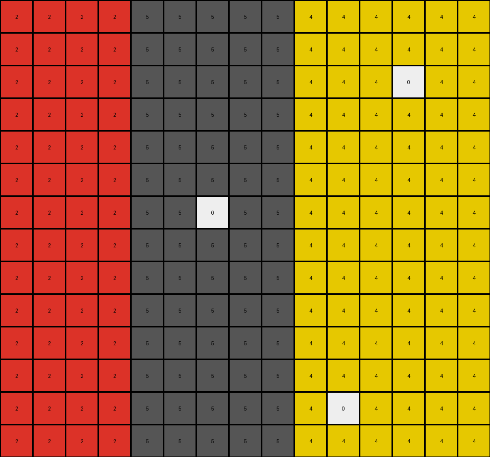

# 855e0971 • 011 • refine_dreamer

---

Previous Code:
```python
"""
The grid is divided into regions. White pixels within a region act as seeds. From each white seed, the white color spreads to all connected pixels of the region's original color, stopping at the region's boundary.
"""

import numpy as np

def get_regions(grid):
    # Divide the grid into regions based on the first row's color changes.
    regions = []
    start_col = 0
    current_color = grid[0, 0]
    for col in range(1, grid.shape[1]):
        if grid[0, col] != current_color:
            regions.append(((start_col, 0, col - start_col, grid.shape[0]), current_color))
            current_color = grid[0, col]
            start_col = col
    regions.append(((start_col, 0, grid.shape[1] - start_col, grid.shape[0]), current_color))  # Add the last region
    return regions

def flood_fill(grid, start_row, start_col, target_color, replacement_color, region_bounds):
    # Perform a flood fill, staying within the given region.
    x_start, y_start, width, height = region_bounds
    queue = [(start_row, start_col)]
    while queue:
        row, col = queue.pop(0)
        if not (x_start <= col < x_start + width and y_start <= row < y_start + height):
            continue #out of bounds
        if grid[row, col] == target_color:
            grid[row, col] = replacement_color
            if row > 0:
                queue.append((row - 1, col)) #up
            if row < grid.shape[0] - 1:
                queue.append((row + 1, col)) #down
            if col > 0:
                queue.append((row, col - 1))  # Left
            if col < grid.shape[1] - 1:
                queue.append((row, col + 1))  # Right

def transform(input_grid):
    # initialize output_grid
    output_grid = np.copy(input_grid)
    regions = get_regions(input_grid)

    # change output pixels
    for region, region_color in regions:
        x_start, y_start, width, height = region
        for row in range(y_start, y_start + height):
            for col in range(x_start, x_start + width):
                if input_grid[row, col] == 0:  # Found a white pixel
                    flood_fill(output_grid, row, col, region_color, 0, region)

    return output_grid
```

Train Set Results:

## Example 1:

Input:
```
5 5 5 5 5 5 5 5 5 5 5 5 5 5 5 5 5 5 5
5 5 5 5 5 5 5 5 5 5 5 5 5 5 5 5 5 5 5
4 4 4 4 4 4 4 4 4 4 4 4 4 4 4 4 4 4 4
4 4 4 4 4 4 4 4 4 4 4 4 4 0 4 4 4 4 4
4 4 4 4 4 4 4 4 4 4 4 4 4 4 4 4 4 4 4
4 4 4 4 0 4 4 4 4 4 4 4 4 4 4 4 4 4 4
4 4 4 4 4 4 4 4 4 4 4 4 4 4 4 4 4 4 4
4 4 4 4 4 4 4 4 4 4 4 4 4 4 4 4 4 4 4
4 4 4 4 4 4 4 4 4 4 4 4 4 4 4 4 4 4 4
8 8 8 8 8 8 8 8 8 8 8 8 8 8 8 8 8 8 8
8 8 8 8 8 8 8 8 8 8 8 8 8 8 8 8 8 8 8
8 8 8 8 8 8 8 8 8 8 8 8 8 8 8 8 8 8 8
8 8 8 8 8 8 8 8 8 0 8 8 8 8 8 8 8 8 8
8 8 8 8 8 8 8 8 8 8 8 8 8 8 8 8 8 8 8
8 8 8 8 8 8 8 8 8 8 8 8 8 8 8 8 8 8 8
```
Expected Output:
```
5 5 5 5 5 5 5 5 5 5 5 5 5 5 5 5 5 5 5
5 5 5 5 5 5 5 5 5 5 5 5 5 5 5 5 5 5 5
4 4 4 4 0 4 4 4 4 4 4 4 4 0 4 4 4 4 4
4 4 4 4 0 4 4 4 4 4 4 4 4 0 4 4 4 4 4
4 4 4 4 0 4 4 4 4 4 4 4 4 0 4 4 4 4 4
4 4 4 4 0 4 4 4 4 4 4 4 4 0 4 4 4 4 4
4 4 4 4 0 4 4 4 4 4 4 4 4 0 4 4 4 4 4
4 4 4 4 0 4 4 4 4 4 4 4 4 0 4 4 4 4 4
4 4 4 4 0 4 4 4 4 4 4 4 4 0 4 4 4 4 4
8 8 8 8 8 8 8 8 8 0 8 8 8 8 8 8 8 8 8
8 8 8 8 8 8 8 8 8 0 8 8 8 8 8 8 8 8 8
8 8 8 8 8 8 8 8 8 0 8 8 8 8 8 8 8 8 8
8 8 8 8 8 8 8 8 8 0 8 8 8 8 8 8 8 8 8
8 8 8 8 8 8 8 8 8 0 8 8 8 8 8 8 8 8 8
8 8 8 8 8 8 8 8 8 0 8 8 8 8 8 8 8 8 8
```
Transformed Output:
```
5 5 5 5 5 5 5 5 5 5 5 5 5 5 5 5 5 5 5
5 5 5 5 5 5 5 5 5 5 5 5 5 5 5 5 5 5 5
4 4 4 4 4 4 4 4 4 4 4 4 4 4 4 4 4 4 4
4 4 4 4 4 4 4 4 4 4 4 4 4 0 4 4 4 4 4
4 4 4 4 4 4 4 4 4 4 4 4 4 4 4 4 4 4 4
4 4 4 4 0 4 4 4 4 4 4 4 4 4 4 4 4 4 4
4 4 4 4 4 4 4 4 4 4 4 4 4 4 4 4 4 4 4
4 4 4 4 4 4 4 4 4 4 4 4 4 4 4 4 4 4 4
4 4 4 4 4 4 4 4 4 4 4 4 4 4 4 4 4 4 4
8 8 8 8 8 8 8 8 8 8 8 8 8 8 8 8 8 8 8
8 8 8 8 8 8 8 8 8 8 8 8 8 8 8 8 8 8 8
8 8 8 8 8 8 8 8 8 8 8 8 8 8 8 8 8 8 8
8 8 8 8 8 8 8 8 8 0 8 8 8 8 8 8 8 8 8
8 8 8 8 8 8 8 8 8 8 8 8 8 8 8 8 8 8 8
8 8 8 8 8 8 8 8 8 8 8 8 8 8 8 8 8 8 8
```

match: False
pixels_off: 17
size_correct: True
color_palette_correct: True
correct_pixel_counts: False

## Example 2:

Input:
```
2 2 2 2 2 1 1 1 1 1 1 1 1
2 2 2 2 2 1 1 1 1 1 1 1 1
2 2 2 2 2 1 1 1 1 1 1 1 1
2 2 0 2 2 1 1 1 1 1 1 1 1
2 2 2 2 2 1 1 1 1 1 1 1 1
2 2 2 2 2 1 1 1 1 1 1 1 1
2 2 2 2 2 1 1 1 1 1 1 1 1
2 2 2 2 2 1 1 1 1 1 1 1 1
2 2 2 2 2 1 1 1 1 1 1 1 1
2 2 2 2 2 1 1 1 1 1 1 1 1
2 2 2 2 2 1 1 1 1 1 1 1 1
2 2 2 2 2 1 1 1 0 1 1 1 1
2 2 2 2 2 1 1 1 1 1 1 1 1
2 2 2 2 2 1 1 1 1 1 1 1 1
```
Expected Output:
```
2 2 2 2 2 1 1 1 1 1 1 1 1
2 2 2 2 2 1 1 1 1 1 1 1 1
2 2 2 2 2 1 1 1 1 1 1 1 1
0 0 0 0 0 1 1 1 1 1 1 1 1
2 2 2 2 2 1 1 1 1 1 1 1 1
2 2 2 2 2 1 1 1 1 1 1 1 1
2 2 2 2 2 1 1 1 1 1 1 1 1
2 2 2 2 2 1 1 1 1 1 1 1 1
2 2 2 2 2 1 1 1 1 1 1 1 1
2 2 2 2 2 1 1 1 1 1 1 1 1
2 2 2 2 2 1 1 1 1 1 1 1 1
2 2 2 2 2 0 0 0 0 0 0 0 0
2 2 2 2 2 1 1 1 1 1 1 1 1
2 2 2 2 2 1 1 1 1 1 1 1 1
```
Transformed Output:
```
2 2 2 2 2 1 1 1 1 1 1 1 1
2 2 2 2 2 1 1 1 1 1 1 1 1
2 2 2 2 2 1 1 1 1 1 1 1 1
2 2 0 2 2 1 1 1 1 1 1 1 1
2 2 2 2 2 1 1 1 1 1 1 1 1
2 2 2 2 2 1 1 1 1 1 1 1 1
2 2 2 2 2 1 1 1 1 1 1 1 1
2 2 2 2 2 1 1 1 1 1 1 1 1
2 2 2 2 2 1 1 1 1 1 1 1 1
2 2 2 2 2 1 1 1 1 1 1 1 1
2 2 2 2 2 1 1 1 1 1 1 1 1
2 2 2 2 2 1 1 1 0 1 1 1 1
2 2 2 2 2 1 1 1 1 1 1 1 1
2 2 2 2 2 1 1 1 1 1 1 1 1
```

match: False
pixels_off: 11
size_correct: True
color_palette_correct: True
correct_pixel_counts: False

## Example 3:

Input:
```
8 8 8 8 8 8 8 8 8 8 8 8 8 8 8
8 8 8 8 8 8 8 8 8 8 8 8 8 8 8
8 8 8 0 8 8 8 8 8 8 8 8 8 8 8
8 8 8 8 8 8 8 8 8 8 8 0 8 8 8
8 8 8 8 8 8 8 8 8 8 8 8 8 8 8
2 2 2 2 2 2 2 2 2 2 2 2 2 2 2
2 2 2 2 2 2 2 2 2 2 2 2 2 2 2
2 2 2 2 2 0 2 2 2 2 2 2 2 2 2
2 2 2 2 2 2 2 2 2 2 2 2 2 2 2
2 2 2 2 2 2 2 2 2 2 2 2 2 2 2
3 3 3 3 3 3 3 3 3 3 3 3 3 3 3
3 3 3 3 3 3 3 0 3 3 3 3 3 3 3
3 3 3 3 3 3 3 3 3 3 3 3 3 3 3
```
Expected Output:
```
8 8 8 0 8 8 8 8 8 8 8 0 8 8 8
8 8 8 0 8 8 8 8 8 8 8 0 8 8 8
8 8 8 0 8 8 8 8 8 8 8 0 8 8 8
8 8 8 0 8 8 8 8 8 8 8 0 8 8 8
8 8 8 0 8 8 8 8 8 8 8 0 8 8 8
2 2 2 2 2 0 2 2 2 2 2 2 2 2 2
2 2 2 2 2 0 2 2 2 2 2 2 2 2 2
2 2 2 2 2 0 2 2 2 2 2 2 2 2 2
2 2 2 2 2 0 2 2 2 2 2 2 2 2 2
2 2 2 2 2 0 2 2 2 2 2 2 2 2 2
3 3 3 3 3 3 3 0 3 3 3 3 3 3 3
3 3 3 3 3 3 3 0 3 3 3 3 3 3 3
3 3 3 3 3 3 3 0 3 3 3 3 3 3 3
```
Transformed Output:
```
8 8 8 8 8 8 8 8 8 8 8 8 8 8 8
8 8 8 8 8 8 8 8 8 8 8 8 8 8 8
8 8 8 0 8 8 8 8 8 8 8 8 8 8 8
8 8 8 8 8 8 8 8 8 8 8 0 8 8 8
8 8 8 8 8 8 8 8 8 8 8 8 8 8 8
2 2 2 2 2 2 2 2 2 2 2 2 2 2 2
2 2 2 2 2 2 2 2 2 2 2 2 2 2 2
2 2 2 2 2 0 2 2 2 2 2 2 2 2 2
2 2 2 2 2 2 2 2 2 2 2 2 2 2 2
2 2 2 2 2 2 2 2 2 2 2 2 2 2 2
3 3 3 3 3 3 3 3 3 3 3 3 3 3 3
3 3 3 3 3 3 3 0 3 3 3 3 3 3 3
3 3 3 3 3 3 3 3 3 3 3 3 3 3 3
```

match: False
pixels_off: 14
size_correct: True
color_palette_correct: True
correct_pixel_counts: False

## Example 4:

Input:
```
2 2 2 2 5 5 5 5 5 4 4 4 4 4 4
2 2 2 2 5 5 5 5 5 4 4 4 4 4 4
2 2 2 2 5 5 5 5 5 4 4 4 0 4 4
2 2 2 2 5 5 5 5 5 4 4 4 4 4 4
2 2 2 2 5 5 5 5 5 4 4 4 4 4 4
2 2 2 2 5 5 5 5 5 4 4 4 4 4 4
2 2 2 2 5 5 0 5 5 4 4 4 4 4 4
2 2 2 2 5 5 5 5 5 4 4 4 4 4 4
2 2 2 2 5 5 5 5 5 4 4 4 4 4 4
2 2 2 2 5 5 5 5 5 4 4 4 4 4 4
2 2 2 2 5 5 5 5 5 4 4 4 4 4 4
2 2 2 2 5 5 5 5 5 4 4 4 4 4 4
2 2 2 2 5 5 5 5 5 4 0 4 4 4 4
2 2 2 2 5 5 5 5 5 4 4 4 4 4 4
```
Expected Output:
```
2 2 2 2 5 5 5 5 5 4 4 4 4 4 4
2 2 2 2 5 5 5 5 5 4 4 4 4 4 4
2 2 2 2 5 5 5 5 5 0 0 0 0 0 0
2 2 2 2 5 5 5 5 5 4 4 4 4 4 4
2 2 2 2 5 5 5 5 5 4 4 4 4 4 4
2 2 2 2 5 5 5 5 5 4 4 4 4 4 4
2 2 2 2 0 0 0 0 0 4 4 4 4 4 4
2 2 2 2 5 5 5 5 5 4 4 4 4 4 4
2 2 2 2 5 5 5 5 5 4 4 4 4 4 4
2 2 2 2 5 5 5 5 5 4 4 4 4 4 4
2 2 2 2 5 5 5 5 5 4 4 4 4 4 4
2 2 2 2 5 5 5 5 5 4 4 4 4 4 4
2 2 2 2 5 5 5 5 5 0 0 0 0 0 0
2 2 2 2 5 5 5 5 5 4 4 4 4 4 4
```
Transformed Output:
```
2 2 2 2 5 5 5 5 5 4 4 4 4 4 4
2 2 2 2 5 5 5 5 5 4 4 4 4 4 4
2 2 2 2 5 5 5 5 5 4 4 4 0 4 4
2 2 2 2 5 5 5 5 5 4 4 4 4 4 4
2 2 2 2 5 5 5 5 5 4 4 4 4 4 4
2 2 2 2 5 5 5 5 5 4 4 4 4 4 4
2 2 2 2 5 5 0 5 5 4 4 4 4 4 4
2 2 2 2 5 5 5 5 5 4 4 4 4 4 4
2 2 2 2 5 5 5 5 5 4 4 4 4 4 4
2 2 2 2 5 5 5 5 5 4 4 4 4 4 4
2 2 2 2 5 5 5 5 5 4 4 4 4 4 4
2 2 2 2 5 5 5 5 5 4 4 4 4 4 4
2 2 2 2 5 5 5 5 5 4 0 4 4 4 4
2 2 2 2 5 5 5 5 5 4 4 4 4 4 4
```

match: False
pixels_off: 14
size_correct: True
color_palette_correct: True
correct_pixel_counts: False
**INSTRUCTIONS**

The code above was generated based on observations from the first training
example

we have tested the transform function on each of the task example inputs and
compared with the expected output

review each of the examples provided and the results and consider how the
natural language program should be updated to accommodate this new knowledge

respond with the following deliverables:

- general assessment of the information provided and strategy for resolving the
  errors
- gather metrics about each of the examples and results - use code_execution to
  develop accurate reports on your assumptions
- a YAML block documenting facts - Focus on identifying objects, their properties, and the actions performed on them.
- a natural language program - Be as clear and concise as possible, providing a complete description of the transformation rule.


your responses should be considered as information in a report - not a
conversation
