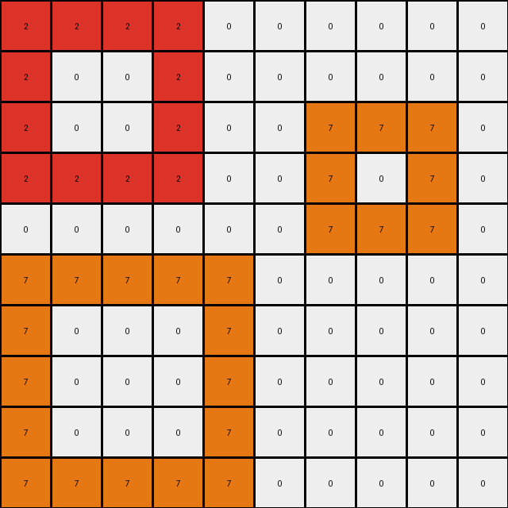
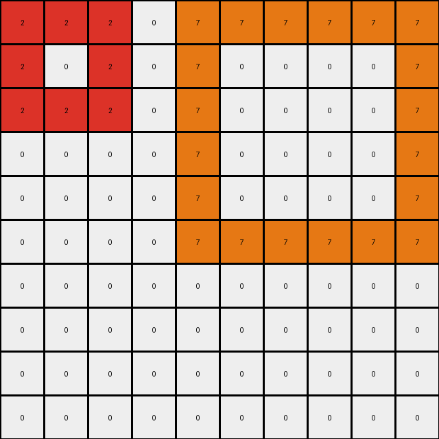
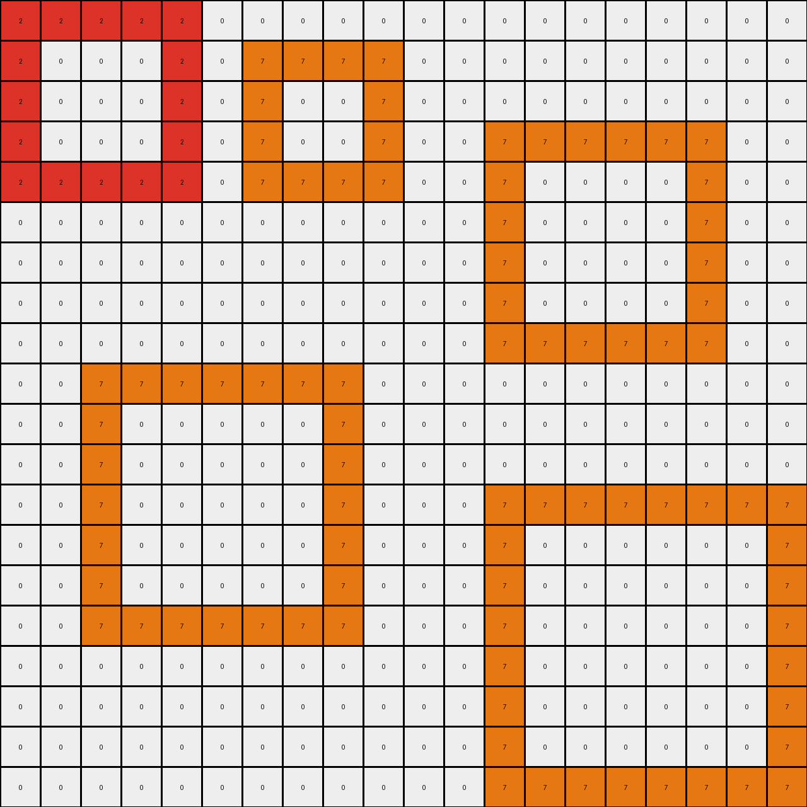
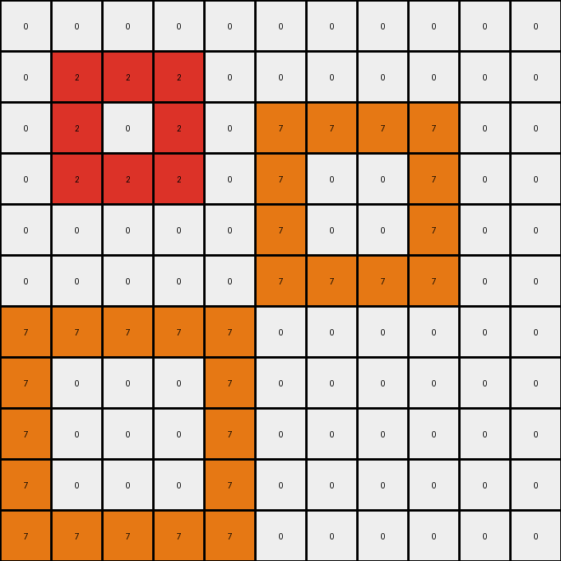
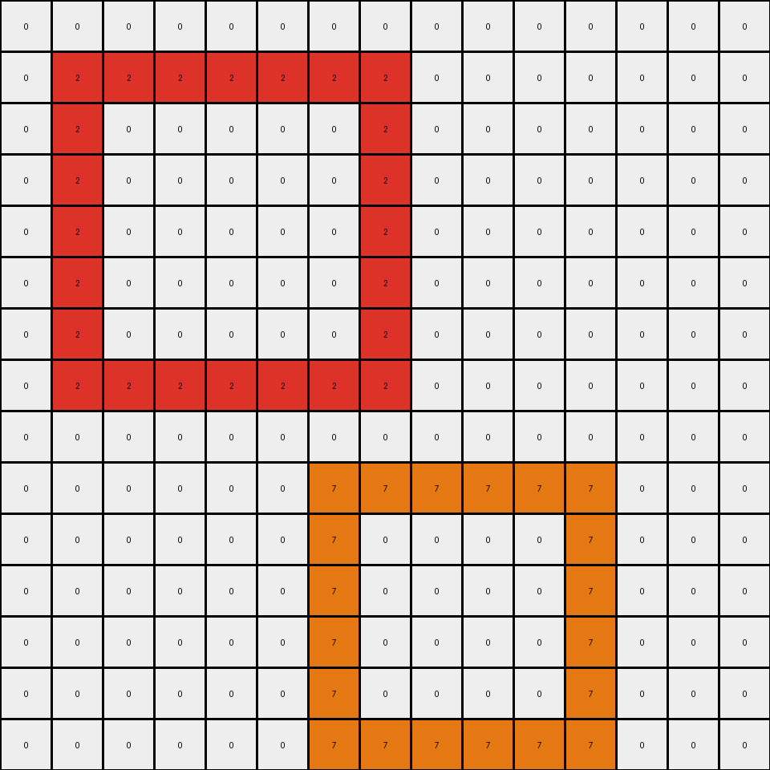

# 868de0fa • 003 • refine_dreamer

---


Previous Code:
```python
"""
1.  **Identify Objects:** Locate all contiguous regions (objects) of 'blue' (1) pixels in the input grid.  Contiguous means connected horizontally or vertically.
2. **Preserve Background:** Maintain all 'white' (0) pixels in their original positions in the output grid.
3.  **Transform Objects:** Iterate through blue regions.
    *   Change the color of the top-left blue object to red (2).
    *   Change the color of a blue object to orange (7) if it forms at least a 3x1 or 1x3 shape with blue (1) pixels.
    * The large blue object on the right-side of the image does not change.
"""

import numpy as np

def find_objects(grid, color):
    """Finds contiguous regions (objects) of a specific color in the grid."""
    visited = np.zeros_like(grid, dtype=bool)
    objects = []

    def dfs(row, col, current_object):
        """Depth-First Search to explore contiguous regions."""
        if (row < 0 or row >= grid.shape[0] or col < 0 or col >= grid.shape[1] or
                visited[row, col] or grid[row, col] != color):
            return
        visited[row, col] = True
        current_object.append((row, col))
        dfs(row + 1, col, current_object)
        dfs(row - 1, col, current_object)
        dfs(row, col + 1, current_object)
        dfs(row, col - 1, current_object)

    for row in range(grid.shape[0]):
        for col in range(grid.shape[1]):
            if grid[row, col] == color and not visited[row, col]:
                current_object = []
                dfs(row, col, current_object)
                objects.append(current_object)
    return objects

def is_long_object(object_pixels, grid):
    """ check if an object containts a 3x1 or 1x3 shape (horizontal or vertical)
    """
    rows = [p[0] for p in object_pixels]
    cols = [p[1] for p in object_pixels]

    #check width and height of bounding box
    height = max(rows) - min(rows) + 1
    width = max(cols) - min(cols) + 1

    if height >= 3 and width >=1:
        return True
    if width >= 3 and height >= 1:
        return True
    return False

def transform(input_grid):
    # initialize output_grid
    output_grid = np.copy(input_grid)
    
    # find blue objects
    blue_objects = find_objects(input_grid, 1)

    # sort objects to put the top left first
    blue_objects.sort(key=lambda obj: (min(p[0] for p in obj), min(p[1] for p in obj)))


    object_count = 0
    for obj in blue_objects:
        # change top left to red
        if object_count == 0:
            for row, col in obj:
                output_grid[row, col] = 2
        # change large objects to orange
        elif is_long_object(obj, input_grid):
          for row, col in obj:
              output_grid[row,col] = 7

        object_count += 1

    return output_grid
```

Train Set Results:

## Example 1:

Input:
```
1 1 1 1 0 0 0 0 0 0
1 0 0 1 0 0 0 0 0 0
1 0 0 1 0 0 1 1 1 0
1 1 1 1 0 0 1 0 1 0
0 0 0 0 0 0 1 1 1 0
1 1 1 1 1 0 0 0 0 0
1 0 0 0 1 0 0 0 0 0
1 0 0 0 1 0 0 0 0 0
1 0 0 0 1 0 0 0 0 0
1 1 1 1 1 0 0 0 0 0
```
Expected Output:
```
1 1 1 1 0 0 0 0 0 0
1 2 2 1 0 0 0 0 0 0
1 2 2 1 0 0 1 1 1 0
1 1 1 1 0 0 1 7 1 0
0 0 0 0 0 0 1 1 1 0
1 1 1 1 1 0 0 0 0 0
1 7 7 7 1 0 0 0 0 0
1 7 7 7 1 0 0 0 0 0
1 7 7 7 1 0 0 0 0 0
1 1 1 1 1 0 0 0 0 0
```
Transformed Output:
```
2 2 2 2 0 0 0 0 0 0
2 0 0 2 0 0 0 0 0 0
2 0 0 2 0 0 7 7 7 0
2 2 2 2 0 0 7 0 7 0
0 0 0 0 0 0 7 7 7 0
7 7 7 7 7 0 0 0 0 0
7 0 0 0 7 0 0 0 0 0
7 0 0 0 7 0 0 0 0 0
7 0 0 0 7 0 0 0 0 0
7 7 7 7 7 0 0 0 0 0
```

match: False
pixels_off: 50
size_correct: True
color_palette_correct: True
correct_pixel_counts: False

## Example 2:

Input:
```
1 1 1 0 1 1 1 1 1 1
1 0 1 0 1 0 0 0 0 1
1 1 1 0 1 0 0 0 0 1
0 0 0 0 1 0 0 0 0 1
0 0 0 0 1 0 0 0 0 1
0 0 0 0 1 1 1 1 1 1
0 0 0 0 0 0 0 0 0 0
0 0 0 0 0 0 0 0 0 0
0 0 0 0 0 0 0 0 0 0
0 0 0 0 0 0 0 0 0 0
```
Expected Output:
```
1 1 1 0 1 1 1 1 1 1
1 7 1 0 1 2 2 2 2 1
1 1 1 0 1 2 2 2 2 1
0 0 0 0 1 2 2 2 2 1
0 0 0 0 1 2 2 2 2 1
0 0 0 0 1 1 1 1 1 1
0 0 0 0 0 0 0 0 0 0
0 0 0 0 0 0 0 0 0 0
0 0 0 0 0 0 0 0 0 0
0 0 0 0 0 0 0 0 0 0
```
Transformed Output:
```
2 2 2 0 7 7 7 7 7 7
2 0 2 0 7 0 0 0 0 7
2 2 2 0 7 0 0 0 0 7
0 0 0 0 7 0 0 0 0 7
0 0 0 0 7 0 0 0 0 7
0 0 0 0 7 7 7 7 7 7
0 0 0 0 0 0 0 0 0 0
0 0 0 0 0 0 0 0 0 0
0 0 0 0 0 0 0 0 0 0
0 0 0 0 0 0 0 0 0 0
```

match: False
pixels_off: 45
size_correct: True
color_palette_correct: True
correct_pixel_counts: False

## Example 3:

Input:
```
1 1 1 1 1 0 0 0 0 0 0 0 0 0 0 0 0 0 0 0
1 0 0 0 1 0 1 1 1 1 0 0 0 0 0 0 0 0 0 0
1 0 0 0 1 0 1 0 0 1 0 0 0 0 0 0 0 0 0 0
1 0 0 0 1 0 1 0 0 1 0 0 1 1 1 1 1 1 0 0
1 1 1 1 1 0 1 1 1 1 0 0 1 0 0 0 0 1 0 0
0 0 0 0 0 0 0 0 0 0 0 0 1 0 0 0 0 1 0 0
0 0 0 0 0 0 0 0 0 0 0 0 1 0 0 0 0 1 0 0
0 0 0 0 0 0 0 0 0 0 0 0 1 0 0 0 0 1 0 0
0 0 0 0 0 0 0 0 0 0 0 0 1 1 1 1 1 1 0 0
0 0 1 1 1 1 1 1 1 0 0 0 0 0 0 0 0 0 0 0
0 0 1 0 0 0 0 0 1 0 0 0 0 0 0 0 0 0 0 0
0 0 1 0 0 0 0 0 1 0 0 0 0 0 0 0 0 0 0 0
0 0 1 0 0 0 0 0 1 0 0 0 1 1 1 1 1 1 1 1
0 0 1 0 0 0 0 0 1 0 0 0 1 0 0 0 0 0 0 1
0 0 1 0 0 0 0 0 1 0 0 0 1 0 0 0 0 0 0 1
0 0 1 1 1 1 1 1 1 0 0 0 1 0 0 0 0 0 0 1
0 0 0 0 0 0 0 0 0 0 0 0 1 0 0 0 0 0 0 1
0 0 0 0 0 0 0 0 0 0 0 0 1 0 0 0 0 0 0 1
0 0 0 0 0 0 0 0 0 0 0 0 1 0 0 0 0 0 0 1
0 0 0 0 0 0 0 0 0 0 0 0 1 1 1 1 1 1 1 1
```
Expected Output:
```
1 1 1 1 1 0 0 0 0 0 0 0 0 0 0 0 0 0 0 0
1 7 7 7 1 0 1 1 1 1 0 0 0 0 0 0 0 0 0 0
1 7 7 7 1 0 1 2 2 1 0 0 0 0 0 0 0 0 0 0
1 7 7 7 1 0 1 2 2 1 0 0 1 1 1 1 1 1 0 0
1 1 1 1 1 0 1 1 1 1 0 0 1 2 2 2 2 1 0 0
0 0 0 0 0 0 0 0 0 0 0 0 1 2 2 2 2 1 0 0
0 0 0 0 0 0 0 0 0 0 0 0 1 2 2 2 2 1 0 0
0 0 0 0 0 0 0 0 0 0 0 0 1 2 2 2 2 1 0 0
0 0 0 0 0 0 0 0 0 0 0 0 1 1 1 1 1 1 0 0
0 0 1 1 1 1 1 1 1 0 0 0 0 0 0 0 0 0 0 0
0 0 1 7 7 7 7 7 1 0 0 0 0 0 0 0 0 0 0 0
0 0 1 7 7 7 7 7 1 0 0 0 0 0 0 0 0 0 0 0
0 0 1 7 7 7 7 7 1 0 0 0 1 1 1 1 1 1 1 1
0 0 1 7 7 7 7 7 1 0 0 0 1 2 2 2 2 2 2 1
0 0 1 7 7 7 7 7 1 0 0 0 1 2 2 2 2 2 2 1
0 0 1 1 1 1 1 1 1 0 0 0 1 2 2 2 2 2 2 1
0 0 0 0 0 0 0 0 0 0 0 0 1 2 2 2 2 2 2 1
0 0 0 0 0 0 0 0 0 0 0 0 1 2 2 2 2 2 2 1
0 0 0 0 0 0 0 0 0 0 0 0 1 2 2 2 2 2 2 1
0 0 0 0 0 0 0 0 0 0 0 0 1 1 1 1 1 1 1 1
```
Transformed Output:
```
2 2 2 2 2 0 0 0 0 0 0 0 0 0 0 0 0 0 0 0
2 0 0 0 2 0 7 7 7 7 0 0 0 0 0 0 0 0 0 0
2 0 0 0 2 0 7 0 0 7 0 0 0 0 0 0 0 0 0 0
2 0 0 0 2 0 7 0 0 7 0 0 7 7 7 7 7 7 0 0
2 2 2 2 2 0 7 7 7 7 0 0 7 0 0 0 0 7 0 0
0 0 0 0 0 0 0 0 0 0 0 0 7 0 0 0 0 7 0 0
0 0 0 0 0 0 0 0 0 0 0 0 7 0 0 0 0 7 0 0
0 0 0 0 0 0 0 0 0 0 0 0 7 0 0 0 0 7 0 0
0 0 0 0 0 0 0 0 0 0 0 0 7 7 7 7 7 7 0 0
0 0 7 7 7 7 7 7 7 0 0 0 0 0 0 0 0 0 0 0
0 0 7 0 0 0 0 0 7 0 0 0 0 0 0 0 0 0 0 0
0 0 7 0 0 0 0 0 7 0 0 0 0 0 0 0 0 0 0 0
0 0 7 0 0 0 0 0 7 0 0 0 7 7 7 7 7 7 7 7
0 0 7 0 0 0 0 0 7 0 0 0 7 0 0 0 0 0 0 7
0 0 7 0 0 0 0 0 7 0 0 0 7 0 0 0 0 0 0 7
0 0 7 7 7 7 7 7 7 0 0 0 7 0 0 0 0 0 0 7
0 0 0 0 0 0 0 0 0 0 0 0 7 0 0 0 0 0 0 7
0 0 0 0 0 0 0 0 0 0 0 0 7 0 0 0 0 0 0 7
0 0 0 0 0 0 0 0 0 0 0 0 7 0 0 0 0 0 0 7
0 0 0 0 0 0 0 0 0 0 0 0 7 7 7 7 7 7 7 7
```

match: False
pixels_off: 190
size_correct: True
color_palette_correct: True
correct_pixel_counts: False

## Example 4:

Input:
```
0 0 0 0 0 0 0 0 0 0 0
0 1 1 1 0 0 0 0 0 0 0
0 1 0 1 0 1 1 1 1 0 0
0 1 1 1 0 1 0 0 1 0 0
0 0 0 0 0 1 0 0 1 0 0
0 0 0 0 0 1 1 1 1 0 0
1 1 1 1 1 0 0 0 0 0 0
1 0 0 0 1 0 0 0 0 0 0
1 0 0 0 1 0 0 0 0 0 0
1 0 0 0 1 0 0 0 0 0 0
1 1 1 1 1 0 0 0 0 0 0
```
Expected Output:
```
0 0 0 0 0 0 0 0 0 0 0
0 1 1 1 0 0 0 0 0 0 0
0 1 7 1 0 1 1 1 1 0 0
0 1 1 1 0 1 2 2 1 0 0
0 0 0 0 0 1 2 2 1 0 0
0 0 0 0 0 1 1 1 1 0 0
1 1 1 1 1 0 0 0 0 0 0
1 7 7 7 1 0 0 0 0 0 0
1 7 7 7 1 0 0 0 0 0 0
1 7 7 7 1 0 0 0 0 0 0
1 1 1 1 1 0 0 0 0 0 0
```
Transformed Output:
```
0 0 0 0 0 0 0 0 0 0 0
0 2 2 2 0 0 0 0 0 0 0
0 2 0 2 0 7 7 7 7 0 0
0 2 2 2 0 7 0 0 7 0 0
0 0 0 0 0 7 0 0 7 0 0
0 0 0 0 0 7 7 7 7 0 0
7 7 7 7 7 0 0 0 0 0 0
7 0 0 0 7 0 0 0 0 0 0
7 0 0 0 7 0 0 0 0 0 0
7 0 0 0 7 0 0 0 0 0 0
7 7 7 7 7 0 0 0 0 0 0
```

match: False
pixels_off: 50
size_correct: True
color_palette_correct: True
correct_pixel_counts: False

## Example 5:

Input:
```
0 0 0 0 0 0 0 0 0 0 0 0 0 0 0
0 1 1 1 1 1 1 1 0 0 0 0 0 0 0
0 1 0 0 0 0 0 1 0 0 0 0 0 0 0
0 1 0 0 0 0 0 1 0 0 0 0 0 0 0
0 1 0 0 0 0 0 1 0 0 0 0 0 0 0
0 1 0 0 0 0 0 1 0 0 0 0 0 0 0
0 1 0 0 0 0 0 1 0 0 0 0 0 0 0
0 1 1 1 1 1 1 1 0 0 0 0 0 0 0
0 0 0 0 0 0 0 0 0 0 0 0 0 0 0
0 0 0 0 0 0 1 1 1 1 1 1 0 0 0
0 0 0 0 0 0 1 0 0 0 0 1 0 0 0
0 0 0 0 0 0 1 0 0 0 0 1 0 0 0
0 0 0 0 0 0 1 0 0 0 0 1 0 0 0
0 0 0 0 0 0 1 0 0 0 0 1 0 0 0
0 0 0 0 0 0 1 1 1 1 1 1 0 0 0
```
Expected Output:
```
0 0 0 0 0 0 0 0 0 0 0 0 0 0 0
0 1 1 1 1 1 1 1 0 0 0 0 0 0 0
0 1 7 7 7 7 7 1 0 0 0 0 0 0 0
0 1 7 7 7 7 7 1 0 0 0 0 0 0 0
0 1 7 7 7 7 7 1 0 0 0 0 0 0 0
0 1 7 7 7 7 7 1 0 0 0 0 0 0 0
0 1 7 7 7 7 7 1 0 0 0 0 0 0 0
0 1 1 1 1 1 1 1 0 0 0 0 0 0 0
0 0 0 0 0 0 0 0 0 0 0 0 0 0 0
0 0 0 0 0 0 1 1 1 1 1 1 0 0 0
0 0 0 0 0 0 1 2 2 2 2 1 0 0 0
0 0 0 0 0 0 1 2 2 2 2 1 0 0 0
0 0 0 0 0 0 1 2 2 2 2 1 0 0 0
0 0 0 0 0 0 1 2 2 2 2 1 0 0 0
0 0 0 0 0 0 1 1 1 1 1 1 0 0 0
```
Transformed Output:
```
0 0 0 0 0 0 0 0 0 0 0 0 0 0 0
0 2 2 2 2 2 2 2 0 0 0 0 0 0 0
0 2 0 0 0 0 0 2 0 0 0 0 0 0 0
0 2 0 0 0 0 0 2 0 0 0 0 0 0 0
0 2 0 0 0 0 0 2 0 0 0 0 0 0 0
0 2 0 0 0 0 0 2 0 0 0 0 0 0 0
0 2 0 0 0 0 0 2 0 0 0 0 0 0 0
0 2 2 2 2 2 2 2 0 0 0 0 0 0 0
0 0 0 0 0 0 0 0 0 0 0 0 0 0 0
0 0 0 0 0 0 7 7 7 7 7 7 0 0 0
0 0 0 0 0 0 7 0 0 0 0 7 0 0 0
0 0 0 0 0 0 7 0 0 0 0 7 0 0 0
0 0 0 0 0 0 7 0 0 0 0 7 0 0 0
0 0 0 0 0 0 7 0 0 0 0 7 0 0 0
0 0 0 0 0 0 7 7 7 7 7 7 0 0 0
```

match: False
pixels_off: 85
size_correct: True
color_palette_correct: True
correct_pixel_counts: False

**INSTRUCTIONS**

The code above was generated based on observations from the first training
example

we have tested the transform function on each of the task example inputs and
compared with the expected output

review each of the examples provided and the results and consider how the
natural language program should be updated to accommodate this new knowledge

respond with the following deliverables:

- general assessment of the information provided and strategy for resolving the
  errors
- gather metrics about each of the examples and results - use code_execution to
  develop accurate reports on your assumptions
- a YAML block documenting facts - Focus on identifying objects, their properties, and the actions performed on them.
- a natural language program - Be as clear and concise as possible, providing a complete description of the transformation rule.


your responses should be considered as information in a report - not a
conversation
