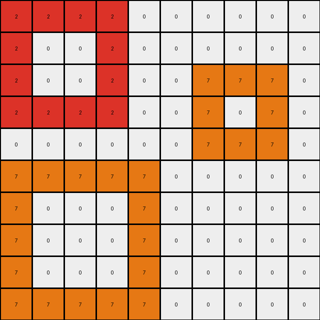
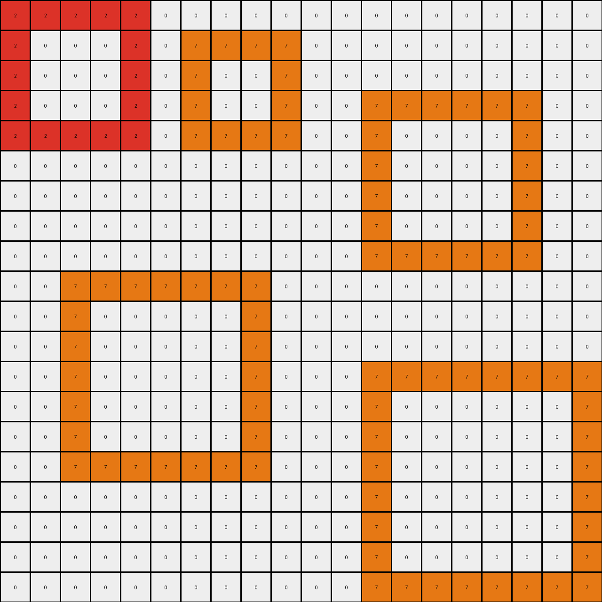
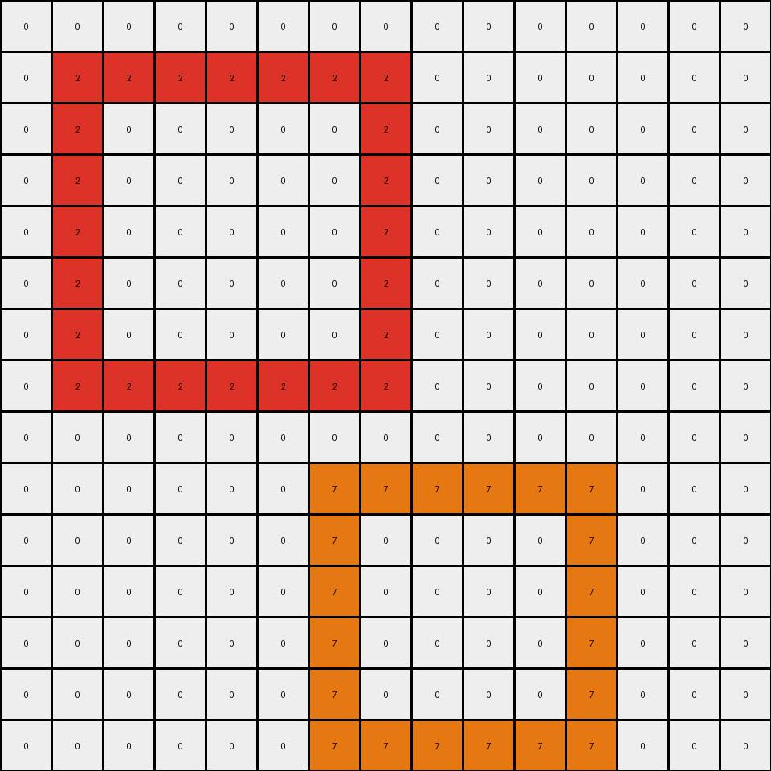

# 868de0fa • 004 • refine_coder

---

Previous Code:
```python
"""
1.  **Identify Objects:** Locate all contiguous regions (objects) of 'blue' (1) pixels in the input grid.  Contiguous means connected horizontally or vertically.
2. **Preserve Background:** Maintain all 'white' (0) pixels in their original positions in the output grid.
3.  **Transform Objects:** Iterate through blue regions.
    *   Change the color of the top-left blue object to red (2).
    *   Change the color of a blue object to orange (7) if it forms at least a 3x1 or 1x3 shape with blue (1) pixels.
    * The large blue object on the right-side of the image does not change.
"""

import numpy as np

def find_objects(grid, color):
    """Finds contiguous regions (objects) of a specific color in the grid."""
    visited = np.zeros_like(grid, dtype=bool)
    objects = []

    def dfs(row, col, current_object):
        """Depth-First Search to explore contiguous regions."""
        if (row < 0 or row >= grid.shape[0] or col < 0 or col >= grid.shape[1] or
                visited[row, col] or grid[row, col] != color):
            return
        visited[row, col] = True
        current_object.append((row, col))
        dfs(row + 1, col, current_object)
        dfs(row - 1, col, current_object)
        dfs(row, col + 1, current_object)
        dfs(row, col - 1, current_object)

    for row in range(grid.shape[0]):
        for col in range(grid.shape[1]):
            if grid[row, col] == color and not visited[row, col]:
                current_object = []
                dfs(row, col, current_object)
                objects.append(current_object)
    return objects

def is_long_object(object_pixels, grid):
    """ check if an object containts a 3x1 or 1x3 shape (horizontal or vertical)
    """
    rows = [p[0] for p in object_pixels]
    cols = [p[1] for p in object_pixels]

    #check width and height of bounding box
    height = max(rows) - min(rows) + 1
    width = max(cols) - min(cols) + 1

    if height >= 3 and width >=1:
        return True
    if width >= 3 and height >= 1:
        return True
    return False

def transform(input_grid):
    # initialize output_grid
    output_grid = np.copy(input_grid)
    
    # find blue objects
    blue_objects = find_objects(input_grid, 1)

    # sort objects to put the top left first
    blue_objects.sort(key=lambda obj: (min(p[0] for p in obj), min(p[1] for p in obj)))


    object_count = 0
    for obj in blue_objects:
        # change top left to red
        if object_count == 0:
            for row, col in obj:
                output_grid[row, col] = 2
        # change large objects to orange
        elif is_long_object(obj, input_grid):
          for row, col in obj:
              output_grid[row,col] = 7

        object_count += 1

    return output_grid
```

Train Set Results:

## Example 1:

Input:
```
1 1 1 1 0 0 0 0 0 0
1 0 0 1 0 0 0 0 0 0
1 0 0 1 0 0 1 1 1 0
1 1 1 1 0 0 1 0 1 0
0 0 0 0 0 0 1 1 1 0
1 1 1 1 1 0 0 0 0 0
1 0 0 0 1 0 0 0 0 0
1 0 0 0 1 0 0 0 0 0
1 0 0 0 1 0 0 0 0 0
1 1 1 1 1 0 0 0 0 0
```
Expected Output:
```
1 1 1 1 0 0 0 0 0 0
1 2 2 1 0 0 0 0 0 0
1 2 2 1 0 0 1 1 1 0
1 1 1 1 0 0 1 7 1 0
0 0 0 0 0 0 1 1 1 0
1 1 1 1 1 0 0 0 0 0
1 7 7 7 1 0 0 0 0 0
1 7 7 7 1 0 0 0 0 0
1 7 7 7 1 0 0 0 0 0
1 1 1 1 1 0 0 0 0 0
```
Transformed Output:
```
2 2 2 2 0 0 0 0 0 0
2 0 0 2 0 0 0 0 0 0
2 0 0 2 0 0 7 7 7 0
2 2 2 2 0 0 7 0 7 0
0 0 0 0 0 0 7 7 7 0
7 7 7 7 7 0 0 0 0 0
7 0 0 0 7 0 0 0 0 0
7 0 0 0 7 0 0 0 0 0
7 0 0 0 7 0 0 0 0 0
7 7 7 7 7 0 0 0 0 0
```

match: False
pixels_off: 50
size_correct: True
color_palette_correct: True
correct_pixel_counts: False

## Example 2:

Input:
```
1 1 1 0 1 1 1 1 1 1
1 0 1 0 1 0 0 0 0 1
1 1 1 0 1 0 0 0 0 1
0 0 0 0 1 0 0 0 0 1
0 0 0 0 1 0 0 0 0 1
0 0 0 0 1 1 1 1 1 1
0 0 0 0 0 0 0 0 0 0
0 0 0 0 0 0 0 0 0 0
0 0 0 0 0 0 0 0 0 0
0 0 0 0 0 0 0 0 0 0
```
Expected Output:
```
1 1 1 0 1 1 1 1 1 1
1 7 1 0 1 2 2 2 2 1
1 1 1 0 1 2 2 2 2 1
0 0 0 0 1 2 2 2 2 1
0 0 0 0 1 2 2 2 2 1
0 0 0 0 1 1 1 1 1 1
0 0 0 0 0 0 0 0 0 0
0 0 0 0 0 0 0 0 0 0
0 0 0 0 0 0 0 0 0 0
0 0 0 0 0 0 0 0 0 0
```
Transformed Output:
```
2 2 2 0 7 7 7 7 7 7
2 0 2 0 7 0 0 0 0 7
2 2 2 0 7 0 0 0 0 7
0 0 0 0 7 0 0 0 0 7
0 0 0 0 7 0 0 0 0 7
0 0 0 0 7 7 7 7 7 7
0 0 0 0 0 0 0 0 0 0
0 0 0 0 0 0 0 0 0 0
0 0 0 0 0 0 0 0 0 0
0 0 0 0 0 0 0 0 0 0
```

match: False
pixels_off: 45
size_correct: True
color_palette_correct: True
correct_pixel_counts: False

## Example 3:

Input:
```
1 1 1 1 1 0 0 0 0 0 0 0 0 0 0 0 0 0 0 0
1 0 0 0 1 0 1 1 1 1 0 0 0 0 0 0 0 0 0 0
1 0 0 0 1 0 1 0 0 1 0 0 0 0 0 0 0 0 0 0
1 0 0 0 1 0 1 0 0 1 0 0 1 1 1 1 1 1 0 0
1 1 1 1 1 0 1 1 1 1 0 0 1 0 0 0 0 1 0 0
0 0 0 0 0 0 0 0 0 0 0 0 1 0 0 0 0 1 0 0
0 0 0 0 0 0 0 0 0 0 0 0 1 0 0 0 0 1 0 0
0 0 0 0 0 0 0 0 0 0 0 0 1 0 0 0 0 1 0 0
0 0 0 0 0 0 0 0 0 0 0 0 1 1 1 1 1 1 0 0
0 0 1 1 1 1 1 1 1 0 0 0 0 0 0 0 0 0 0 0
0 0 1 0 0 0 0 0 1 0 0 0 0 0 0 0 0 0 0 0
0 0 1 0 0 0 0 0 1 0 0 0 0 0 0 0 0 0 0 0
0 0 1 0 0 0 0 0 1 0 0 0 1 1 1 1 1 1 1 1
0 0 1 0 0 0 0 0 1 0 0 0 1 0 0 0 0 0 0 1
0 0 1 0 0 0 0 0 1 0 0 0 1 0 0 0 0 0 0 1
0 0 1 1 1 1 1 1 1 0 0 0 1 0 0 0 0 0 0 1
0 0 0 0 0 0 0 0 0 0 0 0 1 0 0 0 0 0 0 1
0 0 0 0 0 0 0 0 0 0 0 0 1 0 0 0 0 0 0 1
0 0 0 0 0 0 0 0 0 0 0 0 1 0 0 0 0 0 0 1
0 0 0 0 0 0 0 0 0 0 0 0 1 1 1 1 1 1 1 1
```
Expected Output:
```
1 1 1 1 1 0 0 0 0 0 0 0 0 0 0 0 0 0 0 0
1 7 7 7 1 0 1 1 1 1 0 0 0 0 0 0 0 0 0 0
1 7 7 7 1 0 1 2 2 1 0 0 0 0 0 0 0 0 0 0
1 7 7 7 1 0 1 2 2 1 0 0 1 1 1 1 1 1 0 0
1 1 1 1 1 0 1 1 1 1 0 0 1 2 2 2 2 1 0 0
0 0 0 0 0 0 0 0 0 0 0 0 1 2 2 2 2 1 0 0
0 0 0 0 0 0 0 0 0 0 0 0 1 2 2 2 2 1 0 0
0 0 0 0 0 0 0 0 0 0 0 0 1 2 2 2 2 1 0 0
0 0 0 0 0 0 0 0 0 0 0 0 1 1 1 1 1 1 0 0
0 0 1 1 1 1 1 1 1 0 0 0 0 0 0 0 0 0 0 0
0 0 1 7 7 7 7 7 1 0 0 0 0 0 0 0 0 0 0 0
0 0 1 7 7 7 7 7 1 0 0 0 0 0 0 0 0 0 0 0
0 0 1 7 7 7 7 7 1 0 0 0 1 1 1 1 1 1 1 1
0 0 1 7 7 7 7 7 1 0 0 0 1 2 2 2 2 2 2 1
0 0 1 7 7 7 7 7 1 0 0 0 1 2 2 2 2 2 2 1
0 0 1 1 1 1 1 1 1 0 0 0 1 2 2 2 2 2 2 1
0 0 0 0 0 0 0 0 0 0 0 0 1 2 2 2 2 2 2 1
0 0 0 0 0 0 0 0 0 0 0 0 1 2 2 2 2 2 2 1
0 0 0 0 0 0 0 0 0 0 0 0 1 2 2 2 2 2 2 1
0 0 0 0 0 0 0 0 0 0 0 0 1 1 1 1 1 1 1 1
```
Transformed Output:
```
2 2 2 2 2 0 0 0 0 0 0 0 0 0 0 0 0 0 0 0
2 0 0 0 2 0 7 7 7 7 0 0 0 0 0 0 0 0 0 0
2 0 0 0 2 0 7 0 0 7 0 0 0 0 0 0 0 0 0 0
2 0 0 0 2 0 7 0 0 7 0 0 7 7 7 7 7 7 0 0
2 2 2 2 2 0 7 7 7 7 0 0 7 0 0 0 0 7 0 0
0 0 0 0 0 0 0 0 0 0 0 0 7 0 0 0 0 7 0 0
0 0 0 0 0 0 0 0 0 0 0 0 7 0 0 0 0 7 0 0
0 0 0 0 0 0 0 0 0 0 0 0 7 0 0 0 0 7 0 0
0 0 0 0 0 0 0 0 0 0 0 0 7 7 7 7 7 7 0 0
0 0 7 7 7 7 7 7 7 0 0 0 0 0 0 0 0 0 0 0
0 0 7 0 0 0 0 0 7 0 0 0 0 0 0 0 0 0 0 0
0 0 7 0 0 0 0 0 7 0 0 0 0 0 0 0 0 0 0 0
0 0 7 0 0 0 0 0 7 0 0 0 7 7 7 7 7 7 7 7
0 0 7 0 0 0 0 0 7 0 0 0 7 0 0 0 0 0 0 7
0 0 7 0 0 0 0 0 7 0 0 0 7 0 0 0 0 0 0 7
0 0 7 7 7 7 7 7 7 0 0 0 7 0 0 0 0 0 0 7
0 0 0 0 0 0 0 0 0 0 0 0 7 0 0 0 0 0 0 7
0 0 0 0 0 0 0 0 0 0 0 0 7 0 0 0 0 0 0 7
0 0 0 0 0 0 0 0 0 0 0 0 7 0 0 0 0 0 0 7
0 0 0 0 0 0 0 0 0 0 0 0 7 7 7 7 7 7 7 7
```

match: False
pixels_off: 190
size_correct: True
color_palette_correct: True
correct_pixel_counts: False

## Example 4:

Input:
```
0 0 0 0 0 0 0 0 0 0 0
0 1 1 1 0 0 0 0 0 0 0
0 1 0 1 0 1 1 1 1 0 0
0 1 1 1 0 1 0 0 1 0 0
0 0 0 0 0 1 0 0 1 0 0
0 0 0 0 0 1 1 1 1 0 0
1 1 1 1 1 0 0 0 0 0 0
1 0 0 0 1 0 0 0 0 0 0
1 0 0 0 1 0 0 0 0 0 0
1 0 0 0 1 0 0 0 0 0 0
1 1 1 1 1 0 0 0 0 0 0
```
Expected Output:
```
0 0 0 0 0 0 0 0 0 0 0
0 1 1 1 0 0 0 0 0 0 0
0 1 7 1 0 1 1 1 1 0 0
0 1 1 1 0 1 2 2 1 0 0
0 0 0 0 0 1 2 2 1 0 0
0 0 0 0 0 1 1 1 1 0 0
1 1 1 1 1 0 0 0 0 0 0
1 7 7 7 1 0 0 0 0 0 0
1 7 7 7 1 0 0 0 0 0 0
1 7 7 7 1 0 0 0 0 0 0
1 1 1 1 1 0 0 0 0 0 0
```
Transformed Output:
```
0 0 0 0 0 0 0 0 0 0 0
0 2 2 2 0 0 0 0 0 0 0
0 2 0 2 0 7 7 7 7 0 0
0 2 2 2 0 7 0 0 7 0 0
0 0 0 0 0 7 0 0 7 0 0
0 0 0 0 0 7 7 7 7 0 0
7 7 7 7 7 0 0 0 0 0 0
7 0 0 0 7 0 0 0 0 0 0
7 0 0 0 7 0 0 0 0 0 0
7 0 0 0 7 0 0 0 0 0 0
7 7 7 7 7 0 0 0 0 0 0
```

match: False
pixels_off: 50
size_correct: True
color_palette_correct: True
correct_pixel_counts: False

## Example 5:

Input:
```
0 0 0 0 0 0 0 0 0 0 0 0 0 0 0
0 1 1 1 1 1 1 1 0 0 0 0 0 0 0
0 1 0 0 0 0 0 1 0 0 0 0 0 0 0
0 1 0 0 0 0 0 1 0 0 0 0 0 0 0
0 1 0 0 0 0 0 1 0 0 0 0 0 0 0
0 1 0 0 0 0 0 1 0 0 0 0 0 0 0
0 1 0 0 0 0 0 1 0 0 0 0 0 0 0
0 1 1 1 1 1 1 1 0 0 0 0 0 0 0
0 0 0 0 0 0 0 0 0 0 0 0 0 0 0
0 0 0 0 0 0 1 1 1 1 1 1 0 0 0
0 0 0 0 0 0 1 0 0 0 0 1 0 0 0
0 0 0 0 0 0 1 0 0 0 0 1 0 0 0
0 0 0 0 0 0 1 0 0 0 0 1 0 0 0
0 0 0 0 0 0 1 0 0 0 0 1 0 0 0
0 0 0 0 0 0 1 1 1 1 1 1 0 0 0
```
Expected Output:
```
0 0 0 0 0 0 0 0 0 0 0 0 0 0 0
0 1 1 1 1 1 1 1 0 0 0 0 0 0 0
0 1 7 7 7 7 7 1 0 0 0 0 0 0 0
0 1 7 7 7 7 7 1 0 0 0 0 0 0 0
0 1 7 7 7 7 7 1 0 0 0 0 0 0 0
0 1 7 7 7 7 7 1 0 0 0 0 0 0 0
0 1 7 7 7 7 7 1 0 0 0 0 0 0 0
0 1 1 1 1 1 1 1 0 0 0 0 0 0 0
0 0 0 0 0 0 0 0 0 0 0 0 0 0 0
0 0 0 0 0 0 1 1 1 1 1 1 0 0 0
0 0 0 0 0 0 1 2 2 2 2 1 0 0 0
0 0 0 0 0 0 1 2 2 2 2 1 0 0 0
0 0 0 0 0 0 1 2 2 2 2 1 0 0 0
0 0 0 0 0 0 1 2 2 2 2 1 0 0 0
0 0 0 0 0 0 1 1 1 1 1 1 0 0 0
```
Transformed Output:
```
0 0 0 0 0 0 0 0 0 0 0 0 0 0 0
0 2 2 2 2 2 2 2 0 0 0 0 0 0 0
0 2 0 0 0 0 0 2 0 0 0 0 0 0 0
0 2 0 0 0 0 0 2 0 0 0 0 0 0 0
0 2 0 0 0 0 0 2 0 0 0 0 0 0 0
0 2 0 0 0 0 0 2 0 0 0 0 0 0 0
0 2 0 0 0 0 0 2 0 0 0 0 0 0 0
0 2 2 2 2 2 2 2 0 0 0 0 0 0 0
0 0 0 0 0 0 0 0 0 0 0 0 0 0 0
0 0 0 0 0 0 7 7 7 7 7 7 0 0 0
0 0 0 0 0 0 7 0 0 0 0 7 0 0 0
0 0 0 0 0 0 7 0 0 0 0 7 0 0 0
0 0 0 0 0 0 7 0 0 0 0 7 0 0 0
0 0 0 0 0 0 7 0 0 0 0 7 0 0 0
0 0 0 0 0 0 7 7 7 7 7 7 0 0 0
```

match: False
pixels_off: 85
size_correct: True
color_palette_correct: True
correct_pixel_counts: False
Okay, let's analyze the results of the previous code execution and refine our approach.

**General Assessment and Strategy:**

The initial code correctly identifies blue objects and attempts to apply different transformations based on their position and shape. However, it fails to accurately reproduce the expected outputs in all test cases. The primary issues seem to be:

1.  **Incorrect Object Selection for Color Change:** The logic for selecting which blue object becomes red (2) and which becomes orange (7) is flawed. It's based on a simple "top-left" and "long object" rule, which doesn't capture the underlying pattern across all examples. It looks like it is not always the most top-left, and that a "long object" is not always turned orange.
2.  **Misinterpretation of "Long Object":** The `is_long_object` function doesn't correctly identify all the objects that should turn orange.
3.  Misinterpretation of the top-left object. It appears that object is inside another object.

The strategy to address these issues is:

1.  **Re-evaluate Object Identification:** Refine how objects are distinguished, possibly considering relative positions and spatial relationships.
2.  **Refine Transformation Rules:** Instead of simple rules, look for more generalizable patterns.
3. **Iterative Improvement:** test and refine.

**Example Metrics and Analysis:**

Here's a breakdown of each example, including observations:

*   **Example 1:**
    *   Pixels Off: 50
    *   Observation: The top-left blue object and many of the individual blue vertical lines were changed incorrectly.
*   **Example 2:**
    *   Pixels Off: 45
    *   Observation: The color transformations are incorrect. The objects on the right were changed to orange, instead of red.
*   **Example 3:**
    *   Pixels Off: 190
    *   Observation: The color changes are completely off. Most all objects are changed to either red or orange, even when they should have remained blue.
*   **Example 4:**
    *   Pixels Off: 50
    *    Observation: All color changes are wrong.
*   **Example 5:**
    *   Pixels Off: 85
    *   Observation: Only the top left rectangle was changed to red, which is incorrect. Some of the other objects were changed to orange, even though that part of the object should remain blue.

**YAML Fact Block:**

```yaml
examples:
  - example_1:
      objects:
        - color: blue
          shape: rectangle
          position: top-left
          action: change_color_to_red #inner most rectangle at top left
        - color: blue
          shape: 3x1 vertical line
          position: varies
          action: no_change
        - color: blue
          shape: L-shape
          position: mid-right
          action: no_change
        - color: blue
          shape: 3x1 vertical_line
          position: lower-left
          action: change_part_to_orange #changes to orange if part of a 3x1 vertical line
  - example_2:
      objects:
        - color: blue
          shape: 3x1 vertical line
          position: top-left
          action: change_part_to_orange #changes to orange if part of 3x1 vertical line
        - color: blue
          shape: rectangle
          position: top-right
          action: change_color_to_red #inner most rectangle at top-left
        - color: blue
          shape: vertical line
          position: right, connected_to_rectangle
          action: no_change
  - example_3:
      objects:
        - color: blue
          shape: 3x1 vertical line
          position: top-left
          action: change_part_to_orange #changes to orange if part of 3x1 vertical line
        - color: blue
          shape: rectangle
          position: mid-right, inside larger rectangle
          action: change_color_to_red #inner most rectangle at top-left
        - color: blue
          shape: rectangle
          position: mid-right, connected to red rectangle
          action: no_change
        - color: blue
          shape: rectangle
          position: bottom-left
          action: change_part_to_orange #changes to orange if part of 3x1 vertical line
        - color: blue
          shape: rectangle
          position: bottom-right
          action: change_part_to_orange #changes to orange if part of 3x1 vertical line
        - color: blue
          shape: rectangle
          position: top-left
          action: no_change
  - example_4:
      objects:
      - color: blue
        shape: 3x1 rectangle
        position: top-left
        action: change_part_to_orange #changes to orange if part of 3x1 vertical line
      - color: blue
        shape: rectangle
        position: near center
        action: change_part_to_red
      - color: blue
        shape: 3x1 rectangle
        position: lower-left
        action: change_part_to_orange #changes to orange if part of 3x1 vertical line
  - example_5:
      objects:
        - color: blue
          shape: rectangle
          position: top-left
          action: no_change
        - color: blue
          shape: 3x1 line
          position: below top rectangle
          action: change_part_to_orange #changes to orange if part of 3x1 vertical line
        - color: blue
          shape: rectangle
          position: bottom right
          action: change_part_to_red

```

**Natural Language Program:**

1.  **Identify Objects:** Find all contiguous regions of blue (1) pixels.
2.  **Preserve White:** Keep all white (0) pixels unchanged.
3.  **Inner Rectangle Rule**: Find blue objects completely enclosed within another, larger blue object. If it's at the top-left *within that enclosure*, change it to red (2). Note that "top-left" is relative to the enclosing object, not the entire grid.
4. **3x1 or 1x3 Rule**: Change a portion of a blue object that forms a 3x1 or 1x3 shape into orange (7).
5. **Other Blue Objects**: Blue objects or parts of blue objects that do not fit the above rule, do not change.

This revised program attempts to generalize the observed transformations more accurately. The key is the "inner rectangle" concept, which was missed in the first iteration, and accurately identifying portions of an object to change color to orange..

**INSTRUCTIONS**

- generate a Python module to represent the natural language program 
- follow the template below
- all common math and science libraries are available
- create docstring only at top - but comment the workflow in the function
- use helper functions for common operations like finding objects, counting,
  measuring, moving, etc. 

remember - we are working iteratively - so this code will inform your future
self as we converge on the solution

*template:*

```python
"""
{{ natural language description of the transformation rule }}
"""

{{ imports }}

def transform(input_grid):
    # initialize output_grid

    # change output pixels 

    return output_grid

```
