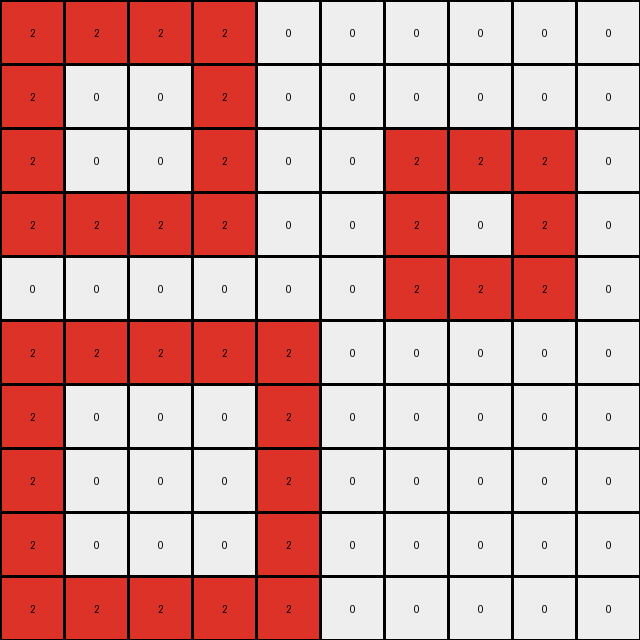
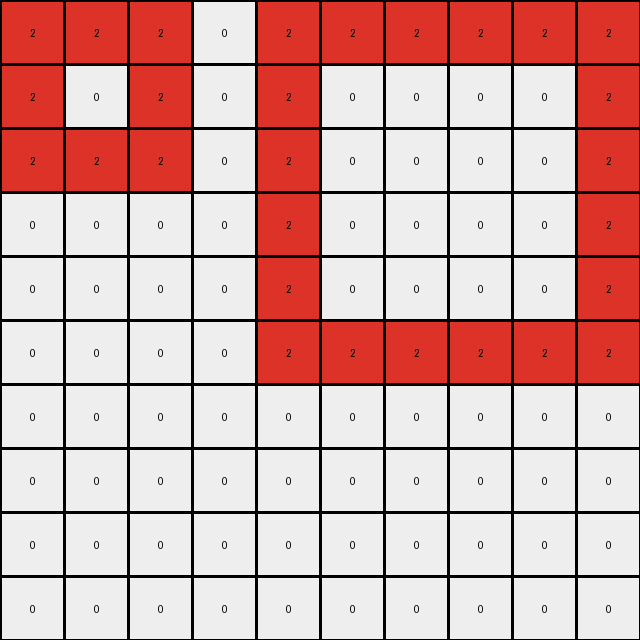
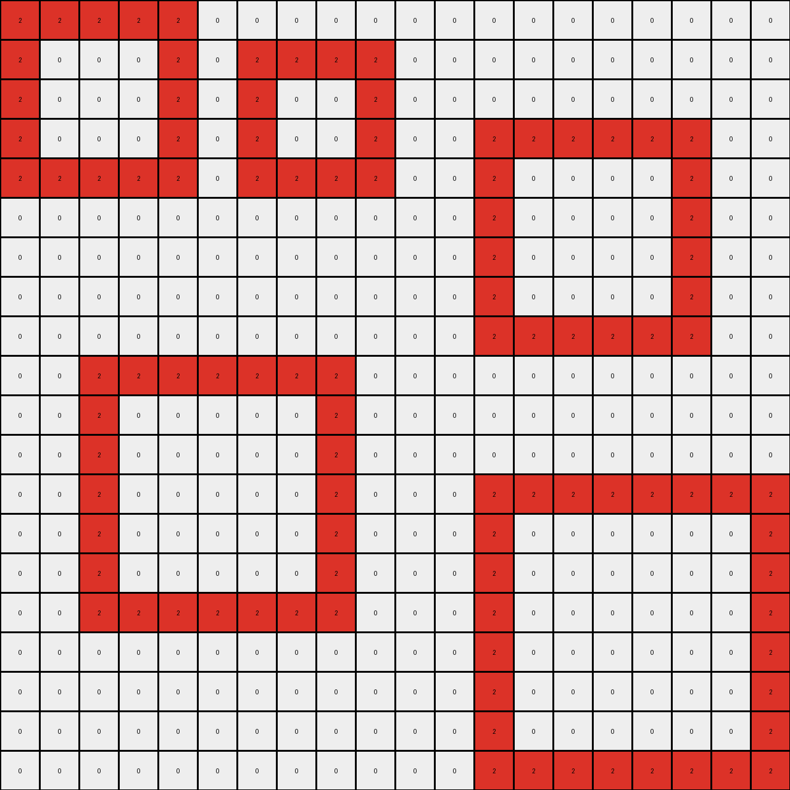
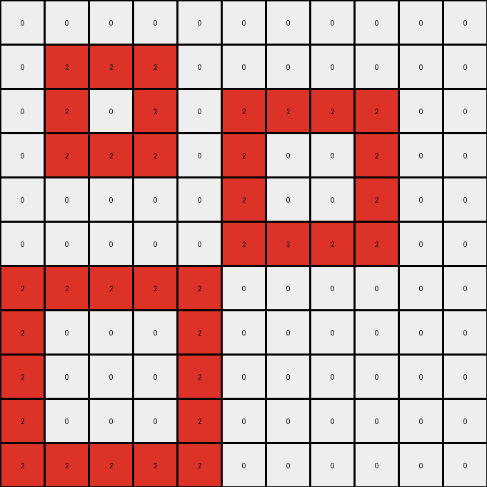
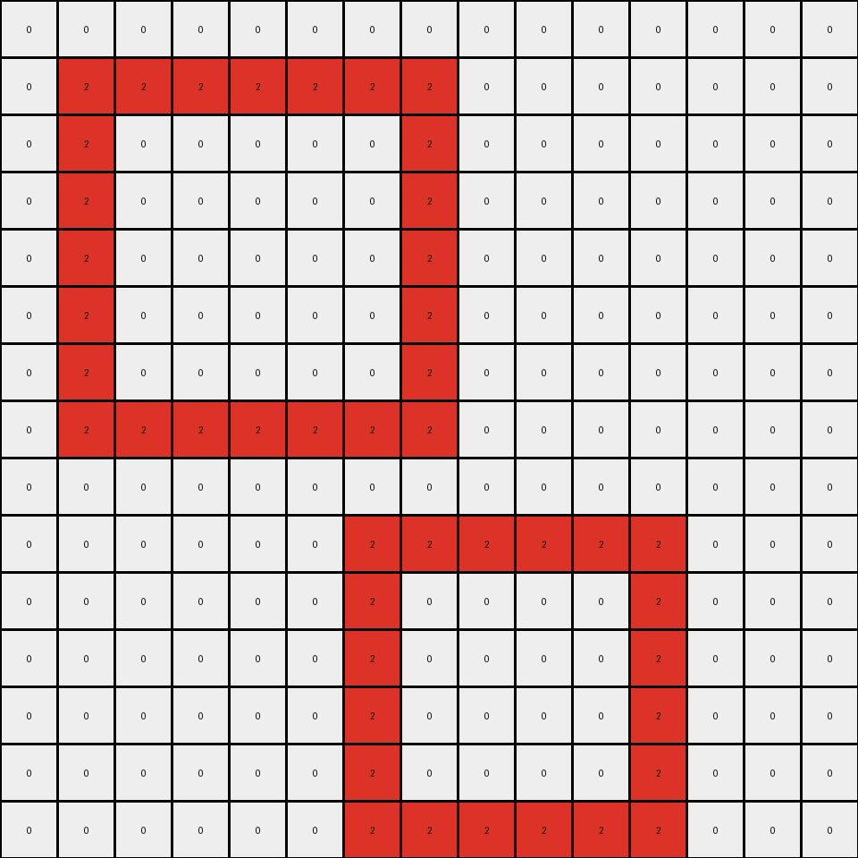

# 868de0fa • 009 • refine_dreamer

---


Previous Code:
```python
"""
1. Identify Contiguous Blue Blocks: Scan the input grid to identify contiguous blocks of blue (1) pixels. A contiguous block is defined as a group of one or more blue pixels connected horizontally, vertically and/or diagonally.
2. Recolor Large Blue Blocks: If a contiguous blue block consists of 3 or more blue pixels, change those pixel's colors to red (2).
3. Recolor a Specific Pixel: If the blue pixel has the location (1,1), change its color to orange(7).
4. Preserve Other Pixels: All other pixels retain their original colors. Specifically, isolated blue pixels (those not part of a larger contiguous block) and white pixels remain unchanged.
"""

import numpy as np

def find_contiguous_blocks(grid, color):
    visited = set()
    blocks = []

    def dfs(row, col, current_block):
        if (row, col) in visited or not (0 <= row < grid.shape[0] and 0 <= col < grid.shape[1]) or grid[row, col] != color:
            return
        visited.add((row, col))
        current_block.append((row, col))
        for dr in [-1, 0, 1]:
            for dc in [-1, 0, 1]:
                if dr == 0 and dc == 0:
                    continue
                dfs(row + dr, col + dc, current_block)

    for row in range(grid.shape[0]):
        for col in range(grid.shape[1]):
            if grid[row, col] == color and (row, col) not in visited:
                current_block = []
                dfs(row, col, current_block)
                blocks.append(current_block)
    return blocks

def transform(input_grid):
    """
    Transforms the input grid according to the specified rules.
    """
    output_grid = input_grid.copy()
    blue_blocks = find_contiguous_blocks(input_grid, 1)

    for block in blue_blocks:
      if len(block) >= 3:
        for row, col in block:
          output_grid[row, col] = 2
      elif len(block) >0:
          row, col = block[0]
          if row == 1 and col == 1:
              output_grid[row,col] = 7

    return output_grid
```

Train Set Results:

## Example 1:

Input:
```
1 1 1 1 0 0 0 0 0 0
1 0 0 1 0 0 0 0 0 0
1 0 0 1 0 0 1 1 1 0
1 1 1 1 0 0 1 0 1 0
0 0 0 0 0 0 1 1 1 0
1 1 1 1 1 0 0 0 0 0
1 0 0 0 1 0 0 0 0 0
1 0 0 0 1 0 0 0 0 0
1 0 0 0 1 0 0 0 0 0
1 1 1 1 1 0 0 0 0 0
```
Expected Output:
```
1 1 1 1 0 0 0 0 0 0
1 2 2 1 0 0 0 0 0 0
1 2 2 1 0 0 1 1 1 0
1 1 1 1 0 0 1 7 1 0
0 0 0 0 0 0 1 1 1 0
1 1 1 1 1 0 0 0 0 0
1 7 7 7 1 0 0 0 0 0
1 7 7 7 1 0 0 0 0 0
1 7 7 7 1 0 0 0 0 0
1 1 1 1 1 0 0 0 0 0
```
Transformed Output:
```
2 2 2 2 0 0 0 0 0 0
2 0 0 2 0 0 0 0 0 0
2 0 0 2 0 0 2 2 2 0
2 2 2 2 0 0 2 0 2 0
0 0 0 0 0 0 2 2 2 0
2 2 2 2 2 0 0 0 0 0
2 0 0 0 2 0 0 0 0 0
2 0 0 0 2 0 0 0 0 0
2 0 0 0 2 0 0 0 0 0
2 2 2 2 2 0 0 0 0 0
```

match: False
pixels_off: 50
size_correct: True
color_palette_correct: True
correct_pixel_counts: False

## Example 2:

Input:
```
1 1 1 0 1 1 1 1 1 1
1 0 1 0 1 0 0 0 0 1
1 1 1 0 1 0 0 0 0 1
0 0 0 0 1 0 0 0 0 1
0 0 0 0 1 0 0 0 0 1
0 0 0 0 1 1 1 1 1 1
0 0 0 0 0 0 0 0 0 0
0 0 0 0 0 0 0 0 0 0
0 0 0 0 0 0 0 0 0 0
0 0 0 0 0 0 0 0 0 0
```
Expected Output:
```
1 1 1 0 1 1 1 1 1 1
1 7 1 0 1 2 2 2 2 1
1 1 1 0 1 2 2 2 2 1
0 0 0 0 1 2 2 2 2 1
0 0 0 0 1 2 2 2 2 1
0 0 0 0 1 1 1 1 1 1
0 0 0 0 0 0 0 0 0 0
0 0 0 0 0 0 0 0 0 0
0 0 0 0 0 0 0 0 0 0
0 0 0 0 0 0 0 0 0 0
```
Transformed Output:
```
2 2 2 0 2 2 2 2 2 2
2 0 2 0 2 0 0 0 0 2
2 2 2 0 2 0 0 0 0 2
0 0 0 0 2 0 0 0 0 2
0 0 0 0 2 0 0 0 0 2
0 0 0 0 2 2 2 2 2 2
0 0 0 0 0 0 0 0 0 0
0 0 0 0 0 0 0 0 0 0
0 0 0 0 0 0 0 0 0 0
0 0 0 0 0 0 0 0 0 0
```

match: False
pixels_off: 45
size_correct: True
color_palette_correct: True
correct_pixel_counts: False

## Example 3:

Input:
```
1 1 1 1 1 0 0 0 0 0 0 0 0 0 0 0 0 0 0 0
1 0 0 0 1 0 1 1 1 1 0 0 0 0 0 0 0 0 0 0
1 0 0 0 1 0 1 0 0 1 0 0 0 0 0 0 0 0 0 0
1 0 0 0 1 0 1 0 0 1 0 0 1 1 1 1 1 1 0 0
1 1 1 1 1 0 1 1 1 1 0 0 1 0 0 0 0 1 0 0
0 0 0 0 0 0 0 0 0 0 0 0 1 0 0 0 0 1 0 0
0 0 0 0 0 0 0 0 0 0 0 0 1 0 0 0 0 1 0 0
0 0 0 0 0 0 0 0 0 0 0 0 1 0 0 0 0 1 0 0
0 0 0 0 0 0 0 0 0 0 0 0 1 1 1 1 1 1 0 0
0 0 1 1 1 1 1 1 1 0 0 0 0 0 0 0 0 0 0 0
0 0 1 0 0 0 0 0 1 0 0 0 0 0 0 0 0 0 0 0
0 0 1 0 0 0 0 0 1 0 0 0 0 0 0 0 0 0 0 0
0 0 1 0 0 0 0 0 1 0 0 0 1 1 1 1 1 1 1 1
0 0 1 0 0 0 0 0 1 0 0 0 1 0 0 0 0 0 0 1
0 0 1 0 0 0 0 0 1 0 0 0 1 0 0 0 0 0 0 1
0 0 1 1 1 1 1 1 1 0 0 0 1 0 0 0 0 0 0 1
0 0 0 0 0 0 0 0 0 0 0 0 1 0 0 0 0 0 0 1
0 0 0 0 0 0 0 0 0 0 0 0 1 0 0 0 0 0 0 1
0 0 0 0 0 0 0 0 0 0 0 0 1 0 0 0 0 0 0 1
0 0 0 0 0 0 0 0 0 0 0 0 1 1 1 1 1 1 1 1
```
Expected Output:
```
1 1 1 1 1 0 0 0 0 0 0 0 0 0 0 0 0 0 0 0
1 7 7 7 1 0 1 1 1 1 0 0 0 0 0 0 0 0 0 0
1 7 7 7 1 0 1 2 2 1 0 0 0 0 0 0 0 0 0 0
1 7 7 7 1 0 1 2 2 1 0 0 1 1 1 1 1 1 0 0
1 1 1 1 1 0 1 1 1 1 0 0 1 2 2 2 2 1 0 0
0 0 0 0 0 0 0 0 0 0 0 0 1 2 2 2 2 1 0 0
0 0 0 0 0 0 0 0 0 0 0 0 1 2 2 2 2 1 0 0
0 0 0 0 0 0 0 0 0 0 0 0 1 2 2 2 2 1 0 0
0 0 0 0 0 0 0 0 0 0 0 0 1 1 1 1 1 1 0 0
0 0 1 1 1 1 1 1 1 0 0 0 0 0 0 0 0 0 0 0
0 0 1 7 7 7 7 7 1 0 0 0 0 0 0 0 0 0 0 0
0 0 1 7 7 7 7 7 1 0 0 0 0 0 0 0 0 0 0 0
0 0 1 7 7 7 7 7 1 0 0 0 1 1 1 1 1 1 1 1
0 0 1 7 7 7 7 7 1 0 0 0 1 2 2 2 2 2 2 1
0 0 1 7 7 7 7 7 1 0 0 0 1 2 2 2 2 2 2 1
0 0 1 1 1 1 1 1 1 0 0 0 1 2 2 2 2 2 2 1
0 0 0 0 0 0 0 0 0 0 0 0 1 2 2 2 2 2 2 1
0 0 0 0 0 0 0 0 0 0 0 0 1 2 2 2 2 2 2 1
0 0 0 0 0 0 0 0 0 0 0 0 1 2 2 2 2 2 2 1
0 0 0 0 0 0 0 0 0 0 0 0 1 1 1 1 1 1 1 1
```
Transformed Output:
```
2 2 2 2 2 0 0 0 0 0 0 0 0 0 0 0 0 0 0 0
2 0 0 0 2 0 2 2 2 2 0 0 0 0 0 0 0 0 0 0
2 0 0 0 2 0 2 0 0 2 0 0 0 0 0 0 0 0 0 0
2 0 0 0 2 0 2 0 0 2 0 0 2 2 2 2 2 2 0 0
2 2 2 2 2 0 2 2 2 2 0 0 2 0 0 0 0 2 0 0
0 0 0 0 0 0 0 0 0 0 0 0 2 0 0 0 0 2 0 0
0 0 0 0 0 0 0 0 0 0 0 0 2 0 0 0 0 2 0 0
0 0 0 0 0 0 0 0 0 0 0 0 2 0 0 0 0 2 0 0
0 0 0 0 0 0 0 0 0 0 0 0 2 2 2 2 2 2 0 0
0 0 2 2 2 2 2 2 2 0 0 0 0 0 0 0 0 0 0 0
0 0 2 0 0 0 0 0 2 0 0 0 0 0 0 0 0 0 0 0
0 0 2 0 0 0 0 0 2 0 0 0 0 0 0 0 0 0 0 0
0 0 2 0 0 0 0 0 2 0 0 0 2 2 2 2 2 2 2 2
0 0 2 0 0 0 0 0 2 0 0 0 2 0 0 0 0 0 0 2
0 0 2 0 0 0 0 0 2 0 0 0 2 0 0 0 0 0 0 2
0 0 2 2 2 2 2 2 2 0 0 0 2 0 0 0 0 0 0 2
0 0 0 0 0 0 0 0 0 0 0 0 2 0 0 0 0 0 0 2
0 0 0 0 0 0 0 0 0 0 0 0 2 0 0 0 0 0 0 2
0 0 0 0 0 0 0 0 0 0 0 0 2 0 0 0 0 0 0 2
0 0 0 0 0 0 0 0 0 0 0 0 2 2 2 2 2 2 2 2
```

match: False
pixels_off: 190
size_correct: True
color_palette_correct: True
correct_pixel_counts: False

## Example 4:

Input:
```
0 0 0 0 0 0 0 0 0 0 0
0 1 1 1 0 0 0 0 0 0 0
0 1 0 1 0 1 1 1 1 0 0
0 1 1 1 0 1 0 0 1 0 0
0 0 0 0 0 1 0 0 1 0 0
0 0 0 0 0 1 1 1 1 0 0
1 1 1 1 1 0 0 0 0 0 0
1 0 0 0 1 0 0 0 0 0 0
1 0 0 0 1 0 0 0 0 0 0
1 0 0 0 1 0 0 0 0 0 0
1 1 1 1 1 0 0 0 0 0 0
```
Expected Output:
```
0 0 0 0 0 0 0 0 0 0 0
0 1 1 1 0 0 0 0 0 0 0
0 1 7 1 0 1 1 1 1 0 0
0 1 1 1 0 1 2 2 1 0 0
0 0 0 0 0 1 2 2 1 0 0
0 0 0 0 0 1 1 1 1 0 0
1 1 1 1 1 0 0 0 0 0 0
1 7 7 7 1 0 0 0 0 0 0
1 7 7 7 1 0 0 0 0 0 0
1 7 7 7 1 0 0 0 0 0 0
1 1 1 1 1 0 0 0 0 0 0
```
Transformed Output:
```
0 0 0 0 0 0 0 0 0 0 0
0 2 2 2 0 0 0 0 0 0 0
0 2 0 2 0 2 2 2 2 0 0
0 2 2 2 0 2 0 0 2 0 0
0 0 0 0 0 2 0 0 2 0 0
0 0 0 0 0 2 2 2 2 0 0
2 2 2 2 2 0 0 0 0 0 0
2 0 0 0 2 0 0 0 0 0 0
2 0 0 0 2 0 0 0 0 0 0
2 0 0 0 2 0 0 0 0 0 0
2 2 2 2 2 0 0 0 0 0 0
```

match: False
pixels_off: 50
size_correct: True
color_palette_correct: True
correct_pixel_counts: False

## Example 5:

Input:
```
0 0 0 0 0 0 0 0 0 0 0 0 0 0 0
0 1 1 1 1 1 1 1 0 0 0 0 0 0 0
0 1 0 0 0 0 0 1 0 0 0 0 0 0 0
0 1 0 0 0 0 0 1 0 0 0 0 0 0 0
0 1 0 0 0 0 0 1 0 0 0 0 0 0 0
0 1 0 0 0 0 0 1 0 0 0 0 0 0 0
0 1 0 0 0 0 0 1 0 0 0 0 0 0 0
0 1 1 1 1 1 1 1 0 0 0 0 0 0 0
0 0 0 0 0 0 0 0 0 0 0 0 0 0 0
0 0 0 0 0 0 1 1 1 1 1 1 0 0 0
0 0 0 0 0 0 1 0 0 0 0 1 0 0 0
0 0 0 0 0 0 1 0 0 0 0 1 0 0 0
0 0 0 0 0 0 1 0 0 0 0 1 0 0 0
0 0 0 0 0 0 1 0 0 0 0 1 0 0 0
0 0 0 0 0 0 1 1 1 1 1 1 0 0 0
```
Expected Output:
```
0 0 0 0 0 0 0 0 0 0 0 0 0 0 0
0 1 1 1 1 1 1 1 0 0 0 0 0 0 0
0 1 7 7 7 7 7 1 0 0 0 0 0 0 0
0 1 7 7 7 7 7 1 0 0 0 0 0 0 0
0 1 7 7 7 7 7 1 0 0 0 0 0 0 0
0 1 7 7 7 7 7 1 0 0 0 0 0 0 0
0 1 7 7 7 7 7 1 0 0 0 0 0 0 0
0 1 1 1 1 1 1 1 0 0 0 0 0 0 0
0 0 0 0 0 0 0 0 0 0 0 0 0 0 0
0 0 0 0 0 0 1 1 1 1 1 1 0 0 0
0 0 0 0 0 0 1 2 2 2 2 1 0 0 0
0 0 0 0 0 0 1 2 2 2 2 1 0 0 0
0 0 0 0 0 0 1 2 2 2 2 1 0 0 0
0 0 0 0 0 0 1 2 2 2 2 1 0 0 0
0 0 0 0 0 0 1 1 1 1 1 1 0 0 0
```
Transformed Output:
```
0 0 0 0 0 0 0 0 0 0 0 0 0 0 0
0 2 2 2 2 2 2 2 0 0 0 0 0 0 0
0 2 0 0 0 0 0 2 0 0 0 0 0 0 0
0 2 0 0 0 0 0 2 0 0 0 0 0 0 0
0 2 0 0 0 0 0 2 0 0 0 0 0 0 0
0 2 0 0 0 0 0 2 0 0 0 0 0 0 0
0 2 0 0 0 0 0 2 0 0 0 0 0 0 0
0 2 2 2 2 2 2 2 0 0 0 0 0 0 0
0 0 0 0 0 0 0 0 0 0 0 0 0 0 0
0 0 0 0 0 0 2 2 2 2 2 2 0 0 0
0 0 0 0 0 0 2 0 0 0 0 2 0 0 0
0 0 0 0 0 0 2 0 0 0 0 2 0 0 0
0 0 0 0 0 0 2 0 0 0 0 2 0 0 0
0 0 0 0 0 0 2 0 0 0 0 2 0 0 0
0 0 0 0 0 0 2 2 2 2 2 2 0 0 0
```

match: False
pixels_off: 85
size_correct: True
color_palette_correct: True
correct_pixel_counts: False

**INSTRUCTIONS**

The code above was generated based on observations from the first training
example

we have tested the transform function on each of the task example inputs and
compared with the expected output

review each of the examples provided and the results and consider how the
natural language program should be updated to accommodate this new knowledge

respond with the following deliverables:

- general assessment of the information provided and strategy for resolving the
  errors
- gather metrics about each of the examples and results - use code_execution to
  develop accurate reports on your assumptions
- a YAML block documenting facts - Focus on identifying objects, their properties, and the actions performed on them.
- a natural language program - Be as clear and concise as possible, providing a complete description of the transformation rule.


your responses should be considered as information in a report - not a
conversation
