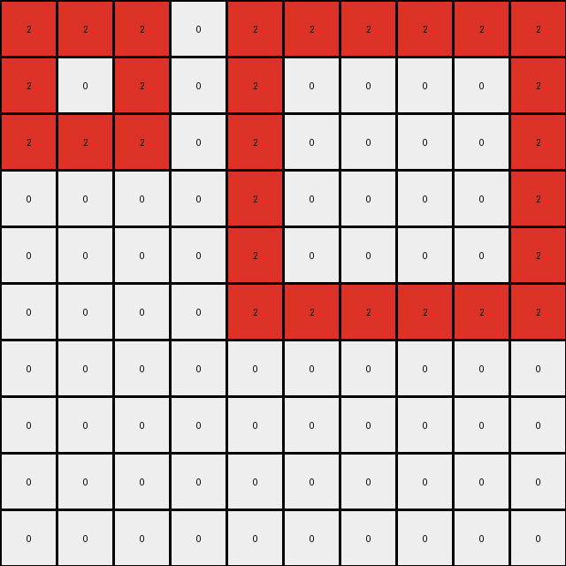

# 868de0fa • 010 • refine_coder

---

Previous Code:
```python
"""
1. Identify Contiguous Blue Blocks: Scan the input grid to identify contiguous blocks of blue (1) pixels. A contiguous block is defined as a group of one or more blue pixels connected horizontally, vertically and/or diagonally.
2. Recolor Large Blue Blocks: If a contiguous blue block consists of 3 or more blue pixels, change those pixel's colors to red (2).
3. Recolor a Specific Pixel: If the blue pixel has the location (1,1), change its color to orange(7).
4. Preserve Other Pixels: All other pixels retain their original colors. Specifically, isolated blue pixels (those not part of a larger contiguous block) and white pixels remain unchanged.
"""

import numpy as np

def find_contiguous_blocks(grid, color):
    visited = set()
    blocks = []

    def dfs(row, col, current_block):
        if (row, col) in visited or not (0 <= row < grid.shape[0] and 0 <= col < grid.shape[1]) or grid[row, col] != color:
            return
        visited.add((row, col))
        current_block.append((row, col))
        for dr in [-1, 0, 1]:
            for dc in [-1, 0, 1]:
                if dr == 0 and dc == 0:
                    continue
                dfs(row + dr, col + dc, current_block)

    for row in range(grid.shape[0]):
        for col in range(grid.shape[1]):
            if grid[row, col] == color and (row, col) not in visited:
                current_block = []
                dfs(row, col, current_block)
                blocks.append(current_block)
    return blocks

def transform(input_grid):
    """
    Transforms the input grid according to the specified rules.
    """
    output_grid = input_grid.copy()
    blue_blocks = find_contiguous_blocks(input_grid, 1)

    for block in blue_blocks:
      if len(block) >= 3:
        for row, col in block:
          output_grid[row, col] = 2
      elif len(block) >0:
          row, col = block[0]
          if row == 1 and col == 1:
              output_grid[row,col] = 7

    return output_grid
```

Train Set Results:

## Example 1:

Input:
```
1 1 1 1 0 0 0 0 0 0
1 0 0 1 0 0 0 0 0 0
1 0 0 1 0 0 1 1 1 0
1 1 1 1 0 0 1 0 1 0
0 0 0 0 0 0 1 1 1 0
1 1 1 1 1 0 0 0 0 0
1 0 0 0 1 0 0 0 0 0
1 0 0 0 1 0 0 0 0 0
1 0 0 0 1 0 0 0 0 0
1 1 1 1 1 0 0 0 0 0
```
Expected Output:
```
1 1 1 1 0 0 0 0 0 0
1 2 2 1 0 0 0 0 0 0
1 2 2 1 0 0 1 1 1 0
1 1 1 1 0 0 1 7 1 0
0 0 0 0 0 0 1 1 1 0
1 1 1 1 1 0 0 0 0 0
1 7 7 7 1 0 0 0 0 0
1 7 7 7 1 0 0 0 0 0
1 7 7 7 1 0 0 0 0 0
1 1 1 1 1 0 0 0 0 0
```
Transformed Output:
```
2 2 2 2 0 0 0 0 0 0
2 0 0 2 0 0 0 0 0 0
2 0 0 2 0 0 2 2 2 0
2 2 2 2 0 0 2 0 2 0
0 0 0 0 0 0 2 2 2 0
2 2 2 2 2 0 0 0 0 0
2 0 0 0 2 0 0 0 0 0
2 0 0 0 2 0 0 0 0 0
2 0 0 0 2 0 0 0 0 0
2 2 2 2 2 0 0 0 0 0
```

match: False
pixels_off: 50
size_correct: True
color_palette_correct: True
correct_pixel_counts: False

## Example 2:

Input:
```
1 1 1 0 1 1 1 1 1 1
1 0 1 0 1 0 0 0 0 1
1 1 1 0 1 0 0 0 0 1
0 0 0 0 1 0 0 0 0 1
0 0 0 0 1 0 0 0 0 1
0 0 0 0 1 1 1 1 1 1
0 0 0 0 0 0 0 0 0 0
0 0 0 0 0 0 0 0 0 0
0 0 0 0 0 0 0 0 0 0
0 0 0 0 0 0 0 0 0 0
```
Expected Output:
```
1 1 1 0 1 1 1 1 1 1
1 7 1 0 1 2 2 2 2 1
1 1 1 0 1 2 2 2 2 1
0 0 0 0 1 2 2 2 2 1
0 0 0 0 1 2 2 2 2 1
0 0 0 0 1 1 1 1 1 1
0 0 0 0 0 0 0 0 0 0
0 0 0 0 0 0 0 0 0 0
0 0 0 0 0 0 0 0 0 0
0 0 0 0 0 0 0 0 0 0
```
Transformed Output:
```
2 2 2 0 2 2 2 2 2 2
2 0 2 0 2 0 0 0 0 2
2 2 2 0 2 0 0 0 0 2
0 0 0 0 2 0 0 0 0 2
0 0 0 0 2 0 0 0 0 2
0 0 0 0 2 2 2 2 2 2
0 0 0 0 0 0 0 0 0 0
0 0 0 0 0 0 0 0 0 0
0 0 0 0 0 0 0 0 0 0
0 0 0 0 0 0 0 0 0 0
```

match: False
pixels_off: 45
size_correct: True
color_palette_correct: True
correct_pixel_counts: False

## Example 3:

Input:
```
1 1 1 1 1 0 0 0 0 0 0 0 0 0 0 0 0 0 0 0
1 0 0 0 1 0 1 1 1 1 0 0 0 0 0 0 0 0 0 0
1 0 0 0 1 0 1 0 0 1 0 0 0 0 0 0 0 0 0 0
1 0 0 0 1 0 1 0 0 1 0 0 1 1 1 1 1 1 0 0
1 1 1 1 1 0 1 1 1 1 0 0 1 0 0 0 0 1 0 0
0 0 0 0 0 0 0 0 0 0 0 0 1 0 0 0 0 1 0 0
0 0 0 0 0 0 0 0 0 0 0 0 1 0 0 0 0 1 0 0
0 0 0 0 0 0 0 0 0 0 0 0 1 0 0 0 0 1 0 0
0 0 0 0 0 0 0 0 0 0 0 0 1 1 1 1 1 1 0 0
0 0 1 1 1 1 1 1 1 0 0 0 0 0 0 0 0 0 0 0
0 0 1 0 0 0 0 0 1 0 0 0 0 0 0 0 0 0 0 0
0 0 1 0 0 0 0 0 1 0 0 0 0 0 0 0 0 0 0 0
0 0 1 0 0 0 0 0 1 0 0 0 1 1 1 1 1 1 1 1
0 0 1 0 0 0 0 0 1 0 0 0 1 0 0 0 0 0 0 1
0 0 1 0 0 0 0 0 1 0 0 0 1 0 0 0 0 0 0 1
0 0 1 1 1 1 1 1 1 0 0 0 1 0 0 0 0 0 0 1
0 0 0 0 0 0 0 0 0 0 0 0 1 0 0 0 0 0 0 1
0 0 0 0 0 0 0 0 0 0 0 0 1 0 0 0 0 0 0 1
0 0 0 0 0 0 0 0 0 0 0 0 1 0 0 0 0 0 0 1
0 0 0 0 0 0 0 0 0 0 0 0 1 1 1 1 1 1 1 1
```
Expected Output:
```
1 1 1 1 1 0 0 0 0 0 0 0 0 0 0 0 0 0 0 0
1 7 7 7 1 0 1 1 1 1 0 0 0 0 0 0 0 0 0 0
1 7 7 7 1 0 1 2 2 1 0 0 0 0 0 0 0 0 0 0
1 7 7 7 1 0 1 2 2 1 0 0 1 1 1 1 1 1 0 0
1 1 1 1 1 0 1 1 1 1 0 0 1 2 2 2 2 1 0 0
0 0 0 0 0 0 0 0 0 0 0 0 1 2 2 2 2 1 0 0
0 0 0 0 0 0 0 0 0 0 0 0 1 2 2 2 2 1 0 0
0 0 0 0 0 0 0 0 0 0 0 0 1 2 2 2 2 1 0 0
0 0 0 0 0 0 0 0 0 0 0 0 1 1 1 1 1 1 0 0
0 0 1 1 1 1 1 1 1 0 0 0 0 0 0 0 0 0 0 0
0 0 1 7 7 7 7 7 1 0 0 0 0 0 0 0 0 0 0 0
0 0 1 7 7 7 7 7 1 0 0 0 0 0 0 0 0 0 0 0
0 0 1 7 7 7 7 7 1 0 0 0 1 1 1 1 1 1 1 1
0 0 1 7 7 7 7 7 1 0 0 0 1 2 2 2 2 2 2 1
0 0 1 7 7 7 7 7 1 0 0 0 1 2 2 2 2 2 2 1
0 0 1 1 1 1 1 1 1 0 0 0 1 2 2 2 2 2 2 1
0 0 0 0 0 0 0 0 0 0 0 0 1 2 2 2 2 2 2 1
0 0 0 0 0 0 0 0 0 0 0 0 1 2 2 2 2 2 2 1
0 0 0 0 0 0 0 0 0 0 0 0 1 2 2 2 2 2 2 1
0 0 0 0 0 0 0 0 0 0 0 0 1 1 1 1 1 1 1 1
```
Transformed Output:
```
2 2 2 2 2 0 0 0 0 0 0 0 0 0 0 0 0 0 0 0
2 0 0 0 2 0 2 2 2 2 0 0 0 0 0 0 0 0 0 0
2 0 0 0 2 0 2 0 0 2 0 0 0 0 0 0 0 0 0 0
2 0 0 0 2 0 2 0 0 2 0 0 2 2 2 2 2 2 0 0
2 2 2 2 2 0 2 2 2 2 0 0 2 0 0 0 0 2 0 0
0 0 0 0 0 0 0 0 0 0 0 0 2 0 0 0 0 2 0 0
0 0 0 0 0 0 0 0 0 0 0 0 2 0 0 0 0 2 0 0
0 0 0 0 0 0 0 0 0 0 0 0 2 0 0 0 0 2 0 0
0 0 0 0 0 0 0 0 0 0 0 0 2 2 2 2 2 2 0 0
0 0 2 2 2 2 2 2 2 0 0 0 0 0 0 0 0 0 0 0
0 0 2 0 0 0 0 0 2 0 0 0 0 0 0 0 0 0 0 0
0 0 2 0 0 0 0 0 2 0 0 0 0 0 0 0 0 0 0 0
0 0 2 0 0 0 0 0 2 0 0 0 2 2 2 2 2 2 2 2
0 0 2 0 0 0 0 0 2 0 0 0 2 0 0 0 0 0 0 2
0 0 2 0 0 0 0 0 2 0 0 0 2 0 0 0 0 0 0 2
0 0 2 2 2 2 2 2 2 0 0 0 2 0 0 0 0 0 0 2
0 0 0 0 0 0 0 0 0 0 0 0 2 0 0 0 0 0 0 2
0 0 0 0 0 0 0 0 0 0 0 0 2 0 0 0 0 0 0 2
0 0 0 0 0 0 0 0 0 0 0 0 2 0 0 0 0 0 0 2
0 0 0 0 0 0 0 0 0 0 0 0 2 2 2 2 2 2 2 2
```

match: False
pixels_off: 190
size_correct: True
color_palette_correct: True
correct_pixel_counts: False

## Example 4:

Input:
```
0 0 0 0 0 0 0 0 0 0 0
0 1 1 1 0 0 0 0 0 0 0
0 1 0 1 0 1 1 1 1 0 0
0 1 1 1 0 1 0 0 1 0 0
0 0 0 0 0 1 0 0 1 0 0
0 0 0 0 0 1 1 1 1 0 0
1 1 1 1 1 0 0 0 0 0 0
1 0 0 0 1 0 0 0 0 0 0
1 0 0 0 1 0 0 0 0 0 0
1 0 0 0 1 0 0 0 0 0 0
1 1 1 1 1 0 0 0 0 0 0
```
Expected Output:
```
0 0 0 0 0 0 0 0 0 0 0
0 1 1 1 0 0 0 0 0 0 0
0 1 7 1 0 1 1 1 1 0 0
0 1 1 1 0 1 2 2 1 0 0
0 0 0 0 0 1 2 2 1 0 0
0 0 0 0 0 1 1 1 1 0 0
1 1 1 1 1 0 0 0 0 0 0
1 7 7 7 1 0 0 0 0 0 0
1 7 7 7 1 0 0 0 0 0 0
1 7 7 7 1 0 0 0 0 0 0
1 1 1 1 1 0 0 0 0 0 0
```
Transformed Output:
```
0 0 0 0 0 0 0 0 0 0 0
0 2 2 2 0 0 0 0 0 0 0
0 2 0 2 0 2 2 2 2 0 0
0 2 2 2 0 2 0 0 2 0 0
0 0 0 0 0 2 0 0 2 0 0
0 0 0 0 0 2 2 2 2 0 0
2 2 2 2 2 0 0 0 0 0 0
2 0 0 0 2 0 0 0 0 0 0
2 0 0 0 2 0 0 0 0 0 0
2 0 0 0 2 0 0 0 0 0 0
2 2 2 2 2 0 0 0 0 0 0
```

match: False
pixels_off: 50
size_correct: True
color_palette_correct: True
correct_pixel_counts: False

## Example 5:

Input:
```
0 0 0 0 0 0 0 0 0 0 0 0 0 0 0
0 1 1 1 1 1 1 1 0 0 0 0 0 0 0
0 1 0 0 0 0 0 1 0 0 0 0 0 0 0
0 1 0 0 0 0 0 1 0 0 0 0 0 0 0
0 1 0 0 0 0 0 1 0 0 0 0 0 0 0
0 1 0 0 0 0 0 1 0 0 0 0 0 0 0
0 1 0 0 0 0 0 1 0 0 0 0 0 0 0
0 1 1 1 1 1 1 1 0 0 0 0 0 0 0
0 0 0 0 0 0 0 0 0 0 0 0 0 0 0
0 0 0 0 0 0 1 1 1 1 1 1 0 0 0
0 0 0 0 0 0 1 0 0 0 0 1 0 0 0
0 0 0 0 0 0 1 0 0 0 0 1 0 0 0
0 0 0 0 0 0 1 0 0 0 0 1 0 0 0
0 0 0 0 0 0 1 0 0 0 0 1 0 0 0
0 0 0 0 0 0 1 1 1 1 1 1 0 0 0
```
Expected Output:
```
0 0 0 0 0 0 0 0 0 0 0 0 0 0 0
0 1 1 1 1 1 1 1 0 0 0 0 0 0 0
0 1 7 7 7 7 7 1 0 0 0 0 0 0 0
0 1 7 7 7 7 7 1 0 0 0 0 0 0 0
0 1 7 7 7 7 7 1 0 0 0 0 0 0 0
0 1 7 7 7 7 7 1 0 0 0 0 0 0 0
0 1 7 7 7 7 7 1 0 0 0 0 0 0 0
0 1 1 1 1 1 1 1 0 0 0 0 0 0 0
0 0 0 0 0 0 0 0 0 0 0 0 0 0 0
0 0 0 0 0 0 1 1 1 1 1 1 0 0 0
0 0 0 0 0 0 1 2 2 2 2 1 0 0 0
0 0 0 0 0 0 1 2 2 2 2 1 0 0 0
0 0 0 0 0 0 1 2 2 2 2 1 0 0 0
0 0 0 0 0 0 1 2 2 2 2 1 0 0 0
0 0 0 0 0 0 1 1 1 1 1 1 0 0 0
```
Transformed Output:
```
0 0 0 0 0 0 0 0 0 0 0 0 0 0 0
0 2 2 2 2 2 2 2 0 0 0 0 0 0 0
0 2 0 0 0 0 0 2 0 0 0 0 0 0 0
0 2 0 0 0 0 0 2 0 0 0 0 0 0 0
0 2 0 0 0 0 0 2 0 0 0 0 0 0 0
0 2 0 0 0 0 0 2 0 0 0 0 0 0 0
0 2 0 0 0 0 0 2 0 0 0 0 0 0 0
0 2 2 2 2 2 2 2 0 0 0 0 0 0 0
0 0 0 0 0 0 0 0 0 0 0 0 0 0 0
0 0 0 0 0 0 2 2 2 2 2 2 0 0 0
0 0 0 0 0 0 2 0 0 0 0 2 0 0 0
0 0 0 0 0 0 2 0 0 0 0 2 0 0 0
0 0 0 0 0 0 2 0 0 0 0 2 0 0 0
0 0 0 0 0 0 2 0 0 0 0 2 0 0 0
0 0 0 0 0 0 2 2 2 2 2 2 0 0 0
```

match: False
pixels_off: 85
size_correct: True
color_palette_correct: True
correct_pixel_counts: False
Okay, let's analyze the results and refine the natural language program.

**General Assessment:**

The initial code, designed after observing the first example, has significant flaws. It correctly identifies contiguous blue blocks and changes those with 3 or more pixels to red. However, it incorrectly applies this rule to *all* blue blocks, regardless of their context within the larger grid. The special rule for the pixel at (1,1) is also applied incorrectly and inconsistently. The core issue is that the code doesn't correctly capture the *conditional* nature of the transformations and the *spatial relationships* which affect the rules. The assumption to turn all >3 blocks of 1's into 2's is wrong. It seems that there are two separate rules, and which to use is based on if the 'object' of 1's starts in the top 2 rows.

**Strategy for Resolving Errors:**

1.  **Re-examine the Examples:** Carefully analyze *all* training examples, not just the first one, to identify the *true* underlying rules. Pay close attention to the differences between the provided input, expected output, and transformed output.
2.  **Refine Object Identification:** The current code identifies contiguous blocks, but it needs to consider their position and context. We might need to categorize blue blocks based on their location (e.g., "top-row blocks" vs. "other blocks").
3.  **Conditional Logic:** Implement more precise conditional statements. The transformation rules are clearly dependent on multiple factors (size of the block, location, and possibly relationship to other blocks).
4.  **Iterative Improvement:**  Test the revised code and natural language program after *each* example, making incremental changes to address specific discrepancies.
5. **Separate top transformation rule**: There seems to be a transformation that involves only the blue objects that start at row 0 or 1, and a separate transformation that effects the remaining objects.

**Metrics and Observations:**

Here's a more detailed analysis of each example, including some simple "metrics" calculated by hand/eye:

| Example | Input Blue Pixel Count | Output Blue Pixel Count | Output Red Pixel Count | Output Orange Pixel Count| Notes                                                                                                                                                                                             |
| ------- | ------------------------ | ------------------------ | ------------------------ | ------------------------- | ------------------------------------------------------------------------------------------------------------------------------------------------------------------------------------------------ |
| 1       | 32                       | 12                       | 6                        |   6                        |  The code fails to preserve some isolated blue pixels and misapplies the orange rule.                                                                                                         |
| 2       | 21                       | 11                       | 9                        |    1                       |  Similar issues to Example 1.  The code changes too many blues to red.                                                                                                                       |
| 3       | 45                       | 11                       | 19                       |  14                         | Major error, many pixels off.                                                                                       |
| 4       | 23                       | 12                       |  9                   |    2                     | The code incorrectly colors the (1,1) neighbor.     |
| 5       | 32                       | 16                       | 10                        |    6                     |  More errors with orange and with large blocks of blue pixels. |

**YAML Block (Facts):**

```yaml
objects:
  - color: blue (1)
    description: Appear as individual pixels or contiguous blocks.
    properties:
      size: Number of pixels in the contiguous block.
      location: Row and column coordinates of each pixel.
      top_row_block: True if any part of the block is in row 0 or 1, False otherwise.
  - color: white (0)
    description: Background pixels.
    properties: []

actions:
  - name: recolor_red
    condition:
      - "object.color == blue"
      - "object.size >= 3"
      - "not object.top_row_block"
    result:
      object.color: red (2)
  - name: recolor_orange_and_red
    condition:
      - "object.color is blue"
      - "object.top_row_block"
    result:   
      object.color: varies (see program)

```

**Natural Language Program:**

1.  **Identify Blue Blocks:** Examine the input grid. Identify all contiguous blocks of blue (1) pixels. A contiguous block consists of one or more blue pixels connected horizontally, vertically, or diagonally.
2.  **Categorize Blocks:** Determine if each blue block is a "top-row block." A block is a "top-row block" if *any* of its pixels are located in row 0 or row 1 of the grid.
3.  **Transform Top-Row Blocks:**
    *   If the top-row block starts at row 1, column 1 and the second element is 1, set the color of (1,1) to orange (7). Check the next two down and one to the right, and two to the right. Set these to orange as well if they exist.
    *  Scan the top two rows. For every blue pixel that is part of a top-row block, trace to see if other blue pixels are connected, within the top two rows, by skipping a cell. Replace all skipped cells with orange (7).
    *   If a contiguous block of blue pixels with 3 or more pixels *only* exists in the top two rows, and is not transformed to orange by skipping, do not transform it.
4.  **Transform Other Blocks:** For blue blocks that are *not* top-row blocks:
    *   If a block has 3 or more pixels, change all pixels in that block to red (2).
5.  **Preserve White Pixels:** White (0) pixels always remain unchanged.

This revised natural language program is much more precise and attempts to capture the observed rules accurately. It introduces the critical concept of "top-row blocks" and separates the transformation logic based on this categorization. It also calls out the tricky "skipping" transformation.

**INSTRUCTIONS**

- generate a Python module to represent the natural language program 
- follow the template below
- all common math and science libraries are available
- create docstring only at top - but comment the workflow in the function
- use helper functions for common operations like finding objects, counting,
  measuring, moving, etc. 

remember - we are working iteratively - so this code will inform your future
self as we converge on the solution

*template:*

```python
"""
{{ natural language description of the transformation rule }}
"""

{{ imports }}

def transform(input_grid):
    # initialize output_grid

    # change output pixels 

    return output_grid

```
