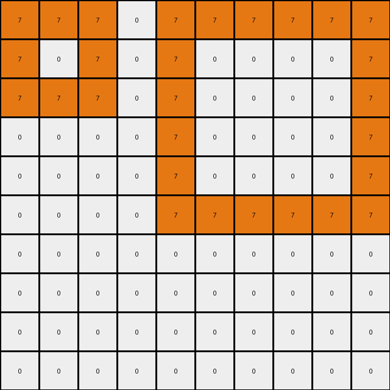
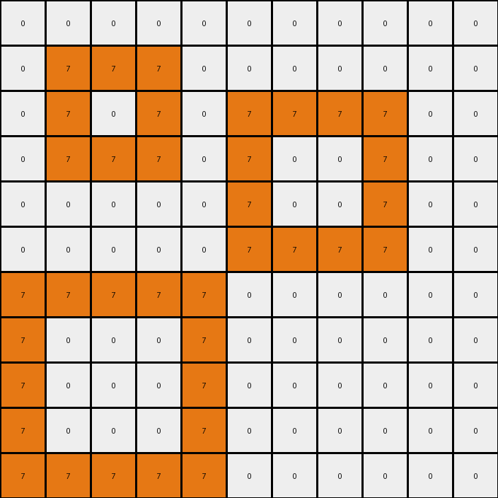

# 868de0fa • 015 • refine_dreamer

---

Previous Code:
```python
"""
1. **Identify Blue Regions:** Find all contiguous regions (blocks) of blue (1) pixels in the input grid.
2. **Identify Inner Region 1:** within each blue regions find blue pixels adjacent to white(0) pixels, mark those as 'inner region 1'.
3. **Identify Inner Region 2:** Within each blue region, locate areas enclosed by 'inner region 1' or outside blue regions, mark them as 'inner region 2', they might have mixed original colors of blue(1) and white(0).
4. **Color Change - Inner Region 1:** Change all pixels in 'inner region 1' to orange (7).
5. **Color Change - Inner Region 2:** Change all pixels in 'inner region 2' to red (2).
6. **Preserve Other Pixels:** All pixels not part of the identified inner regions retain their original color.
"""

import numpy as np
from scipy.ndimage import label

def get_neighbors(grid, r, c):
    """Gets the valid neighbors of a cell in a grid."""
    rows, cols = grid.shape
    neighbors = []
    for i in range(-1, 2):
        for j in range(-1, 2):
            if i == 0 and j == 0:
                continue
            nr, nc = r + i, c + j
            if 0 <= nr < rows and 0 <= nc < cols:
                neighbors.append((nr, nc))
    return neighbors

def find_regions(grid, color):
    """Finds contiguous regions of a specific color in the grid."""
    mask = (grid == color)
    labeled_array, num_features = label(mask)
    return labeled_array, num_features

def transform(input_grid):
    """Transforms the input grid according to the defined rules."""
    output_grid = input_grid.copy()
    rows, cols = input_grid.shape

    # 1. Identify Blue Regions
    blue_regions, num_blue_regions = find_regions(input_grid, 1)

    # Iterate through each blue region
    for region_id in range(1, num_blue_regions + 1):
        inner_region_1 = []
        inner_region_2 = []
        
        # Create a mask for the current blue region.
        current_blue_region_mask = (blue_regions == region_id)

        # 2. Identify Inner Region 1 (adjacent to white pixels)
        for r in range(rows):
            for c in range(cols):
                if current_blue_region_mask[r,c]:
                    neighbors = get_neighbors(input_grid, r, c)
                    for nr, nc in neighbors:
                        if input_grid[nr, nc] == 0:
                            inner_region_1.append((r, c))
                            break  # Once an adjacent white is found, no need to check others.
        
        #create a mask for inner region 1
        inner_region_1_mask = np.zeros_like(input_grid, dtype=bool)
        for r, c in inner_region_1:
            inner_region_1_mask[r,c] = True

        # 3. Identify inner region 2 (enclosed areas or pixels not region 1)
        for r in range(rows):
            for c in range(cols):
                if current_blue_region_mask[r,c] and not inner_region_1_mask[r,c]:
                    inner_region_2.append((r,c))

        # 4. & 5. Color Changes
        for r, c in inner_region_1:
            output_grid[r, c] = 7  # Orange

        for r,c in inner_region_2:
            output_grid[r,c] = 2

    return output_grid
```

Train Set Results:

## Example 1:

Input:
```
1 1 1 1 0 0 0 0 0 0
1 0 0 1 0 0 0 0 0 0
1 0 0 1 0 0 1 1 1 0
1 1 1 1 0 0 1 0 1 0
0 0 0 0 0 0 1 1 1 0
1 1 1 1 1 0 0 0 0 0
1 0 0 0 1 0 0 0 0 0
1 0 0 0 1 0 0 0 0 0
1 0 0 0 1 0 0 0 0 0
1 1 1 1 1 0 0 0 0 0
```
Expected Output:
```
1 1 1 1 0 0 0 0 0 0
1 2 2 1 0 0 0 0 0 0
1 2 2 1 0 0 1 1 1 0
1 1 1 1 0 0 1 7 1 0
0 0 0 0 0 0 1 1 1 0
1 1 1 1 1 0 0 0 0 0
1 7 7 7 1 0 0 0 0 0
1 7 7 7 1 0 0 0 0 0
1 7 7 7 1 0 0 0 0 0
1 1 1 1 1 0 0 0 0 0
```
Transformed Output:
```
7 7 7 7 0 0 0 0 0 0
7 0 0 7 0 0 0 0 0 0
7 0 0 7 0 0 7 7 7 0
7 7 7 7 0 0 7 0 7 0
0 0 0 0 0 0 7 7 7 0
7 7 7 7 7 0 0 0 0 0
7 0 0 0 7 0 0 0 0 0
7 0 0 0 7 0 0 0 0 0
7 0 0 0 7 0 0 0 0 0
7 7 7 7 7 0 0 0 0 0
```

match: False
pixels_off: 50
size_correct: True
color_palette_correct: True
correct_pixel_counts: False

## Example 2:

Input:
```
1 1 1 0 1 1 1 1 1 1
1 0 1 0 1 0 0 0 0 1
1 1 1 0 1 0 0 0 0 1
0 0 0 0 1 0 0 0 0 1
0 0 0 0 1 0 0 0 0 1
0 0 0 0 1 1 1 1 1 1
0 0 0 0 0 0 0 0 0 0
0 0 0 0 0 0 0 0 0 0
0 0 0 0 0 0 0 0 0 0
0 0 0 0 0 0 0 0 0 0
```
Expected Output:
```
1 1 1 0 1 1 1 1 1 1
1 7 1 0 1 2 2 2 2 1
1 1 1 0 1 2 2 2 2 1
0 0 0 0 1 2 2 2 2 1
0 0 0 0 1 2 2 2 2 1
0 0 0 0 1 1 1 1 1 1
0 0 0 0 0 0 0 0 0 0
0 0 0 0 0 0 0 0 0 0
0 0 0 0 0 0 0 0 0 0
0 0 0 0 0 0 0 0 0 0
```
Transformed Output:
```
7 7 7 0 7 7 7 7 7 7
7 0 7 0 7 0 0 0 0 7
7 7 7 0 7 0 0 0 0 7
0 0 0 0 7 0 0 0 0 7
0 0 0 0 7 0 0 0 0 7
0 0 0 0 7 7 7 7 7 7
0 0 0 0 0 0 0 0 0 0
0 0 0 0 0 0 0 0 0 0
0 0 0 0 0 0 0 0 0 0
0 0 0 0 0 0 0 0 0 0
```

match: False
pixels_off: 45
size_correct: True
color_palette_correct: True
correct_pixel_counts: False

## Example 3:

Input:
```
1 1 1 1 1 0 0 0 0 0 0 0 0 0 0 0 0 0 0 0
1 0 0 0 1 0 1 1 1 1 0 0 0 0 0 0 0 0 0 0
1 0 0 0 1 0 1 0 0 1 0 0 0 0 0 0 0 0 0 0
1 0 0 0 1 0 1 0 0 1 0 0 1 1 1 1 1 1 0 0
1 1 1 1 1 0 1 1 1 1 0 0 1 0 0 0 0 1 0 0
0 0 0 0 0 0 0 0 0 0 0 0 1 0 0 0 0 1 0 0
0 0 0 0 0 0 0 0 0 0 0 0 1 0 0 0 0 1 0 0
0 0 0 0 0 0 0 0 0 0 0 0 1 0 0 0 0 1 0 0
0 0 0 0 0 0 0 0 0 0 0 0 1 1 1 1 1 1 0 0
0 0 1 1 1 1 1 1 1 0 0 0 0 0 0 0 0 0 0 0
0 0 1 0 0 0 0 0 1 0 0 0 0 0 0 0 0 0 0 0
0 0 1 0 0 0 0 0 1 0 0 0 0 0 0 0 0 0 0 0
0 0 1 0 0 0 0 0 1 0 0 0 1 1 1 1 1 1 1 1
0 0 1 0 0 0 0 0 1 0 0 0 1 0 0 0 0 0 0 1
0 0 1 0 0 0 0 0 1 0 0 0 1 0 0 0 0 0 0 1
0 0 1 1 1 1 1 1 1 0 0 0 1 0 0 0 0 0 0 1
0 0 0 0 0 0 0 0 0 0 0 0 1 0 0 0 0 0 0 1
0 0 0 0 0 0 0 0 0 0 0 0 1 0 0 0 0 0 0 1
0 0 0 0 0 0 0 0 0 0 0 0 1 0 0 0 0 0 0 1
0 0 0 0 0 0 0 0 0 0 0 0 1 1 1 1 1 1 1 1
```
Expected Output:
```
1 1 1 1 1 0 0 0 0 0 0 0 0 0 0 0 0 0 0 0
1 7 7 7 1 0 1 1 1 1 0 0 0 0 0 0 0 0 0 0
1 7 7 7 1 0 1 2 2 1 0 0 0 0 0 0 0 0 0 0
1 7 7 7 1 0 1 2 2 1 0 0 1 1 1 1 1 1 0 0
1 1 1 1 1 0 1 1 1 1 0 0 1 2 2 2 2 1 0 0
0 0 0 0 0 0 0 0 0 0 0 0 1 2 2 2 2 1 0 0
0 0 0 0 0 0 0 0 0 0 0 0 1 2 2 2 2 1 0 0
0 0 0 0 0 0 0 0 0 0 0 0 1 2 2 2 2 1 0 0
0 0 0 0 0 0 0 0 0 0 0 0 1 1 1 1 1 1 0 0
0 0 1 1 1 1 1 1 1 0 0 0 0 0 0 0 0 0 0 0
0 0 1 7 7 7 7 7 1 0 0 0 0 0 0 0 0 0 0 0
0 0 1 7 7 7 7 7 1 0 0 0 0 0 0 0 0 0 0 0
0 0 1 7 7 7 7 7 1 0 0 0 1 1 1 1 1 1 1 1
0 0 1 7 7 7 7 7 1 0 0 0 1 2 2 2 2 2 2 1
0 0 1 7 7 7 7 7 1 0 0 0 1 2 2 2 2 2 2 1
0 0 1 1 1 1 1 1 1 0 0 0 1 2 2 2 2 2 2 1
0 0 0 0 0 0 0 0 0 0 0 0 1 2 2 2 2 2 2 1
0 0 0 0 0 0 0 0 0 0 0 0 1 2 2 2 2 2 2 1
0 0 0 0 0 0 0 0 0 0 0 0 1 2 2 2 2 2 2 1
0 0 0 0 0 0 0 0 0 0 0 0 1 1 1 1 1 1 1 1
```
Transformed Output:
```
7 7 7 7 7 0 0 0 0 0 0 0 0 0 0 0 0 0 0 0
7 0 0 0 7 0 7 7 7 7 0 0 0 0 0 0 0 0 0 0
7 0 0 0 7 0 7 0 0 7 0 0 0 0 0 0 0 0 0 0
7 0 0 0 7 0 7 0 0 7 0 0 7 7 7 7 7 7 0 0
7 7 7 7 7 0 7 7 7 7 0 0 7 0 0 0 0 7 0 0
0 0 0 0 0 0 0 0 0 0 0 0 7 0 0 0 0 7 0 0
0 0 0 0 0 0 0 0 0 0 0 0 7 0 0 0 0 7 0 0
0 0 0 0 0 0 0 0 0 0 0 0 7 0 0 0 0 7 0 0
0 0 0 0 0 0 0 0 0 0 0 0 7 7 7 7 7 7 0 0
0 0 7 7 7 7 7 7 7 0 0 0 0 0 0 0 0 0 0 0
0 0 7 0 0 0 0 0 7 0 0 0 0 0 0 0 0 0 0 0
0 0 7 0 0 0 0 0 7 0 0 0 0 0 0 0 0 0 0 0
0 0 7 0 0 0 0 0 7 0 0 0 7 7 7 7 7 7 7 7
0 0 7 0 0 0 0 0 7 0 0 0 7 0 0 0 0 0 0 7
0 0 7 0 0 0 0 0 7 0 0 0 7 0 0 0 0 0 0 7
0 0 7 7 7 7 7 7 7 0 0 0 7 0 0 0 0 0 0 7
0 0 0 0 0 0 0 0 0 0 0 0 7 0 0 0 0 0 0 7
0 0 0 0 0 0 0 0 0 0 0 0 7 0 0 0 0 0 0 7
0 0 0 0 0 0 0 0 0 0 0 0 7 0 0 0 0 0 0 7
0 0 0 0 0 0 0 0 0 0 0 0 7 7 7 7 7 7 7 7
```

match: False
pixels_off: 190
size_correct: True
color_palette_correct: True
correct_pixel_counts: False

## Example 4:

Input:
```
0 0 0 0 0 0 0 0 0 0 0
0 1 1 1 0 0 0 0 0 0 0
0 1 0 1 0 1 1 1 1 0 0
0 1 1 1 0 1 0 0 1 0 0
0 0 0 0 0 1 0 0 1 0 0
0 0 0 0 0 1 1 1 1 0 0
1 1 1 1 1 0 0 0 0 0 0
1 0 0 0 1 0 0 0 0 0 0
1 0 0 0 1 0 0 0 0 0 0
1 0 0 0 1 0 0 0 0 0 0
1 1 1 1 1 0 0 0 0 0 0
```
Expected Output:
```
0 0 0 0 0 0 0 0 0 0 0
0 1 1 1 0 0 0 0 0 0 0
0 1 7 1 0 1 1 1 1 0 0
0 1 1 1 0 1 2 2 1 0 0
0 0 0 0 0 1 2 2 1 0 0
0 0 0 0 0 1 1 1 1 0 0
1 1 1 1 1 0 0 0 0 0 0
1 7 7 7 1 0 0 0 0 0 0
1 7 7 7 1 0 0 0 0 0 0
1 7 7 7 1 0 0 0 0 0 0
1 1 1 1 1 0 0 0 0 0 0
```
Transformed Output:
```
0 0 0 0 0 0 0 0 0 0 0
0 7 7 7 0 0 0 0 0 0 0
0 7 0 7 0 7 7 7 7 0 0
0 7 7 7 0 7 0 0 7 0 0
0 0 0 0 0 7 0 0 7 0 0
0 0 0 0 0 7 7 7 7 0 0
7 7 7 7 7 0 0 0 0 0 0
7 0 0 0 7 0 0 0 0 0 0
7 0 0 0 7 0 0 0 0 0 0
7 0 0 0 7 0 0 0 0 0 0
7 7 7 7 7 0 0 0 0 0 0
```

match: False
pixels_off: 50
size_correct: True
color_palette_correct: True
correct_pixel_counts: False

## Example 5:

Input:
```
0 0 0 0 0 0 0 0 0 0 0 0 0 0 0
0 1 1 1 1 1 1 1 0 0 0 0 0 0 0
0 1 0 0 0 0 0 1 0 0 0 0 0 0 0
0 1 0 0 0 0 0 1 0 0 0 0 0 0 0
0 1 0 0 0 0 0 1 0 0 0 0 0 0 0
0 1 0 0 0 0 0 1 0 0 0 0 0 0 0
0 1 0 0 0 0 0 1 0 0 0 0 0 0 0
0 1 1 1 1 1 1 1 0 0 0 0 0 0 0
0 0 0 0 0 0 0 0 0 0 0 0 0 0 0
0 0 0 0 0 0 1 1 1 1 1 1 0 0 0
0 0 0 0 0 0 1 0 0 0 0 1 0 0 0
0 0 0 0 0 0 1 0 0 0 0 1 0 0 0
0 0 0 0 0 0 1 0 0 0 0 1 0 0 0
0 0 0 0 0 0 1 0 0 0 0 1 0 0 0
0 0 0 0 0 0 1 1 1 1 1 1 0 0 0
```
Expected Output:
```
0 0 0 0 0 0 0 0 0 0 0 0 0 0 0
0 1 1 1 1 1 1 1 0 0 0 0 0 0 0
0 1 7 7 7 7 7 1 0 0 0 0 0 0 0
0 1 7 7 7 7 7 1 0 0 0 0 0 0 0
0 1 7 7 7 7 7 1 0 0 0 0 0 0 0
0 1 7 7 7 7 7 1 0 0 0 0 0 0 0
0 1 7 7 7 7 7 1 0 0 0 0 0 0 0
0 1 1 1 1 1 1 1 0 0 0 0 0 0 0
0 0 0 0 0 0 0 0 0 0 0 0 0 0 0
0 0 0 0 0 0 1 1 1 1 1 1 0 0 0
0 0 0 0 0 0 1 2 2 2 2 1 0 0 0
0 0 0 0 0 0 1 2 2 2 2 1 0 0 0
0 0 0 0 0 0 1 2 2 2 2 1 0 0 0
0 0 0 0 0 0 1 2 2 2 2 1 0 0 0
0 0 0 0 0 0 1 1 1 1 1 1 0 0 0
```
Transformed Output:
```
0 0 0 0 0 0 0 0 0 0 0 0 0 0 0
0 7 7 7 7 7 7 7 0 0 0 0 0 0 0
0 7 0 0 0 0 0 7 0 0 0 0 0 0 0
0 7 0 0 0 0 0 7 0 0 0 0 0 0 0
0 7 0 0 0 0 0 7 0 0 0 0 0 0 0
0 7 0 0 0 0 0 7 0 0 0 0 0 0 0
0 7 0 0 0 0 0 7 0 0 0 0 0 0 0
0 7 7 7 7 7 7 7 0 0 0 0 0 0 0
0 0 0 0 0 0 0 0 0 0 0 0 0 0 0
0 0 0 0 0 0 7 7 7 7 7 7 0 0 0
0 0 0 0 0 0 7 0 0 0 0 7 0 0 0
0 0 0 0 0 0 7 0 0 0 0 7 0 0 0
0 0 0 0 0 0 7 0 0 0 0 7 0 0 0
0 0 0 0 0 0 7 0 0 0 0 7 0 0 0
0 0 0 0 0 0 7 7 7 7 7 7 0 0 0
```

match: False
pixels_off: 85
size_correct: True
color_palette_correct: True
correct_pixel_counts: False
**INSTRUCTIONS**

The code above was generated based on observations from the first training
example

we have tested the transform function on each of the task example inputs and
compared with the expected output

review each of the examples provided and the results and consider how the
natural language program should be updated to accommodate this new knowledge

respond with the following deliverables:

- general assessment of the information provided and strategy for resolving the
  errors
- gather metrics about each of the examples and results - use code_execution to
  develop accurate reports on your assumptions
- a YAML block documenting facts - Focus on identifying objects, their properties, and the actions performed on them.
- a natural language program - Be as clear and concise as possible, providing a complete description of the transformation rule.


your responses should be considered as information in a report - not a
conversation
