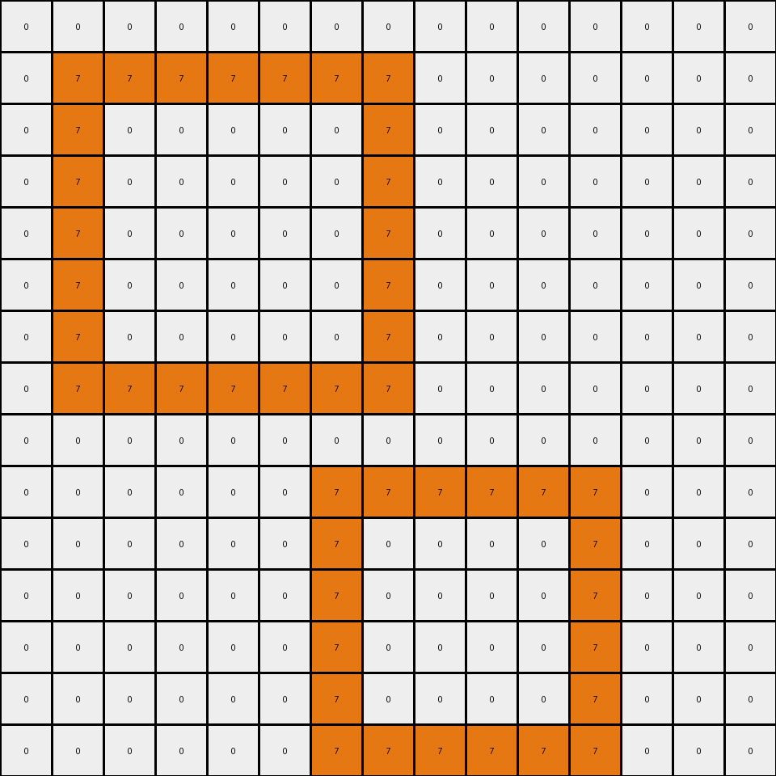

# 868de0fa • 018 • refine_coder

---

Previous Code:
```python
"""
1. **Find Blue Regions:** Identify all distinct, connected regions of blue (1) pixels in the input grid.  These are our `blue_region` objects.
2. **Find Inner Region 1 (Orange Boundary):** Within each `blue_region`, locate all blue pixels that are directly adjacent (up, down, left, or right) to a white (0) pixel. These pixels form `inner_region_1`.
3. **Find Inner Region 2 (Red Interior):** Within each `blue_region`, identify all pixels that belong to the `blue_region` but are *not* part of `inner_region_1`. These pixels form `inner_region_2`. It is the area remaining after identifying `inner_region_1`, and could include originally white or blue pixels.
4. **Color Inner Region 1:** Change the color of all pixels in `inner_region_1` to orange (7).
5. **Color Inner Region 2:** Change the color of all pixels in `inner_region_2` to red (2).
6. **Preserve Other Colors:**  All pixels that are not part of any `blue_region` should remain their original color.
"""

import numpy as np
from scipy.ndimage import label

def get_neighbors(grid, r, c):
    """Gets the valid neighbors of a cell in a grid (up, down, left, right)."""
    rows, cols = grid.shape
    neighbors = []
    for dr, dc in [(-1, 0), (1, 0), (0, -1), (0, 1)]:
        nr, nc = r + dr, c + dc
        if 0 <= nr < rows and 0 <= nc < cols:
            neighbors.append((nr, nc))
    return neighbors

def find_regions(grid, color):
    """Finds contiguous regions of a specific color in the grid."""
    mask = (grid == color)
    labeled_array, num_features = label(mask)
    return labeled_array, num_features

def transform(input_grid):
    """Transforms the input grid according to the defined rules."""
    output_grid = input_grid.copy()
    rows, cols = input_grid.shape

    # 1. Find Blue Regions
    blue_regions, num_blue_regions = find_regions(input_grid, 1)

    # Iterate through each blue region
    for region_id in range(1, num_blue_regions + 1):
        inner_region_1 = []
        inner_region_2 = []
        
        # Create a mask for the current blue region.
        current_blue_region_mask = (blue_regions == region_id)

        # 2. Identify Inner Region 1 (adjacent to white pixels)
        for r in range(rows):
            for c in range(cols):
                if current_blue_region_mask[r,c]:
                    neighbors = get_neighbors(input_grid, r, c)  # Use 4-connectivity
                    for nr, nc in neighbors:
                        if input_grid[nr, nc] == 0:
                            inner_region_1.append((r, c))
                            break

        #create a mask for inner region 1
        inner_region_1_mask = np.zeros_like(input_grid, dtype=bool)
        for r, c in inner_region_1:
            inner_region_1_mask[r,c] = True

        # 3. Identify inner region 2 (remaining pixels inside blue region)
        for r in range(rows):
            for c in range(cols):
                if current_blue_region_mask[r,c] and not inner_region_1_mask[r,c]:
                    inner_region_2.append((r,c))

        # 4. & 5. Color Changes
        for r, c in inner_region_1:
            output_grid[r, c] = 7  # Orange

        for r,c in inner_region_2:
            output_grid[r,c] = 2 #Red


    return output_grid
```

Train Set Results:

## Example 1:

Input:
```
1 1 1 1 0 0 0 0 0 0
1 0 0 1 0 0 0 0 0 0
1 0 0 1 0 0 1 1 1 0
1 1 1 1 0 0 1 0 1 0
0 0 0 0 0 0 1 1 1 0
1 1 1 1 1 0 0 0 0 0
1 0 0 0 1 0 0 0 0 0
1 0 0 0 1 0 0 0 0 0
1 0 0 0 1 0 0 0 0 0
1 1 1 1 1 0 0 0 0 0
```
Expected Output:
```
1 1 1 1 0 0 0 0 0 0
1 2 2 1 0 0 0 0 0 0
1 2 2 1 0 0 1 1 1 0
1 1 1 1 0 0 1 7 1 0
0 0 0 0 0 0 1 1 1 0
1 1 1 1 1 0 0 0 0 0
1 7 7 7 1 0 0 0 0 0
1 7 7 7 1 0 0 0 0 0
1 7 7 7 1 0 0 0 0 0
1 1 1 1 1 0 0 0 0 0
```
Transformed Output:
```
2 7 7 7 0 0 0 0 0 0
7 0 0 7 0 0 0 0 0 0
7 0 0 7 0 0 7 7 7 0
7 7 7 7 0 0 7 0 7 0
0 0 0 0 0 0 7 7 7 0
7 7 7 7 7 0 0 0 0 0
7 0 0 0 7 0 0 0 0 0
7 0 0 0 7 0 0 0 0 0
7 0 0 0 7 0 0 0 0 0
2 7 7 7 7 0 0 0 0 0
```

match: False
pixels_off: 50
size_correct: True
color_palette_correct: True
correct_pixel_counts: False

## Example 2:

Input:
```
1 1 1 0 1 1 1 1 1 1
1 0 1 0 1 0 0 0 0 1
1 1 1 0 1 0 0 0 0 1
0 0 0 0 1 0 0 0 0 1
0 0 0 0 1 0 0 0 0 1
0 0 0 0 1 1 1 1 1 1
0 0 0 0 0 0 0 0 0 0
0 0 0 0 0 0 0 0 0 0
0 0 0 0 0 0 0 0 0 0
0 0 0 0 0 0 0 0 0 0
```
Expected Output:
```
1 1 1 0 1 1 1 1 1 1
1 7 1 0 1 2 2 2 2 1
1 1 1 0 1 2 2 2 2 1
0 0 0 0 1 2 2 2 2 1
0 0 0 0 1 2 2 2 2 1
0 0 0 0 1 1 1 1 1 1
0 0 0 0 0 0 0 0 0 0
0 0 0 0 0 0 0 0 0 0
0 0 0 0 0 0 0 0 0 0
0 0 0 0 0 0 0 0 0 0
```
Transformed Output:
```
2 7 7 0 7 7 7 7 7 2
7 0 7 0 7 0 0 0 0 7
7 7 7 0 7 0 0 0 0 7
0 0 0 0 7 0 0 0 0 7
0 0 0 0 7 0 0 0 0 7
0 0 0 0 7 7 7 7 7 7
0 0 0 0 0 0 0 0 0 0
0 0 0 0 0 0 0 0 0 0
0 0 0 0 0 0 0 0 0 0
0 0 0 0 0 0 0 0 0 0
```

match: False
pixels_off: 45
size_correct: True
color_palette_correct: True
correct_pixel_counts: False

## Example 3:

Input:
```
1 1 1 1 1 0 0 0 0 0 0 0 0 0 0 0 0 0 0 0
1 0 0 0 1 0 1 1 1 1 0 0 0 0 0 0 0 0 0 0
1 0 0 0 1 0 1 0 0 1 0 0 0 0 0 0 0 0 0 0
1 0 0 0 1 0 1 0 0 1 0 0 1 1 1 1 1 1 0 0
1 1 1 1 1 0 1 1 1 1 0 0 1 0 0 0 0 1 0 0
0 0 0 0 0 0 0 0 0 0 0 0 1 0 0 0 0 1 0 0
0 0 0 0 0 0 0 0 0 0 0 0 1 0 0 0 0 1 0 0
0 0 0 0 0 0 0 0 0 0 0 0 1 0 0 0 0 1 0 0
0 0 0 0 0 0 0 0 0 0 0 0 1 1 1 1 1 1 0 0
0 0 1 1 1 1 1 1 1 0 0 0 0 0 0 0 0 0 0 0
0 0 1 0 0 0 0 0 1 0 0 0 0 0 0 0 0 0 0 0
0 0 1 0 0 0 0 0 1 0 0 0 0 0 0 0 0 0 0 0
0 0 1 0 0 0 0 0 1 0 0 0 1 1 1 1 1 1 1 1
0 0 1 0 0 0 0 0 1 0 0 0 1 0 0 0 0 0 0 1
0 0 1 0 0 0 0 0 1 0 0 0 1 0 0 0 0 0 0 1
0 0 1 1 1 1 1 1 1 0 0 0 1 0 0 0 0 0 0 1
0 0 0 0 0 0 0 0 0 0 0 0 1 0 0 0 0 0 0 1
0 0 0 0 0 0 0 0 0 0 0 0 1 0 0 0 0 0 0 1
0 0 0 0 0 0 0 0 0 0 0 0 1 0 0 0 0 0 0 1
0 0 0 0 0 0 0 0 0 0 0 0 1 1 1 1 1 1 1 1
```
Expected Output:
```
1 1 1 1 1 0 0 0 0 0 0 0 0 0 0 0 0 0 0 0
1 7 7 7 1 0 1 1 1 1 0 0 0 0 0 0 0 0 0 0
1 7 7 7 1 0 1 2 2 1 0 0 0 0 0 0 0 0 0 0
1 7 7 7 1 0 1 2 2 1 0 0 1 1 1 1 1 1 0 0
1 1 1 1 1 0 1 1 1 1 0 0 1 2 2 2 2 1 0 0
0 0 0 0 0 0 0 0 0 0 0 0 1 2 2 2 2 1 0 0
0 0 0 0 0 0 0 0 0 0 0 0 1 2 2 2 2 1 0 0
0 0 0 0 0 0 0 0 0 0 0 0 1 2 2 2 2 1 0 0
0 0 0 0 0 0 0 0 0 0 0 0 1 1 1 1 1 1 0 0
0 0 1 1 1 1 1 1 1 0 0 0 0 0 0 0 0 0 0 0
0 0 1 7 7 7 7 7 1 0 0 0 0 0 0 0 0 0 0 0
0 0 1 7 7 7 7 7 1 0 0 0 0 0 0 0 0 0 0 0
0 0 1 7 7 7 7 7 1 0 0 0 1 1 1 1 1 1 1 1
0 0 1 7 7 7 7 7 1 0 0 0 1 2 2 2 2 2 2 1
0 0 1 7 7 7 7 7 1 0 0 0 1 2 2 2 2 2 2 1
0 0 1 1 1 1 1 1 1 0 0 0 1 2 2 2 2 2 2 1
0 0 0 0 0 0 0 0 0 0 0 0 1 2 2 2 2 2 2 1
0 0 0 0 0 0 0 0 0 0 0 0 1 2 2 2 2 2 2 1
0 0 0 0 0 0 0 0 0 0 0 0 1 2 2 2 2 2 2 1
0 0 0 0 0 0 0 0 0 0 0 0 1 1 1 1 1 1 1 1
```
Transformed Output:
```
2 7 7 7 7 0 0 0 0 0 0 0 0 0 0 0 0 0 0 0
7 0 0 0 7 0 7 7 7 7 0 0 0 0 0 0 0 0 0 0
7 0 0 0 7 0 7 0 0 7 0 0 0 0 0 0 0 0 0 0
7 0 0 0 7 0 7 0 0 7 0 0 7 7 7 7 7 7 0 0
7 7 7 7 7 0 7 7 7 7 0 0 7 0 0 0 0 7 0 0
0 0 0 0 0 0 0 0 0 0 0 0 7 0 0 0 0 7 0 0
0 0 0 0 0 0 0 0 0 0 0 0 7 0 0 0 0 7 0 0
0 0 0 0 0 0 0 0 0 0 0 0 7 0 0 0 0 7 0 0
0 0 0 0 0 0 0 0 0 0 0 0 7 7 7 7 7 7 0 0
0 0 7 7 7 7 7 7 7 0 0 0 0 0 0 0 0 0 0 0
0 0 7 0 0 0 0 0 7 0 0 0 0 0 0 0 0 0 0 0
0 0 7 0 0 0 0 0 7 0 0 0 0 0 0 0 0 0 0 0
0 0 7 0 0 0 0 0 7 0 0 0 7 7 7 7 7 7 7 7
0 0 7 0 0 0 0 0 7 0 0 0 7 0 0 0 0 0 0 7
0 0 7 0 0 0 0 0 7 0 0 0 7 0 0 0 0 0 0 7
0 0 7 7 7 7 7 7 7 0 0 0 7 0 0 0 0 0 0 7
0 0 0 0 0 0 0 0 0 0 0 0 7 0 0 0 0 0 0 7
0 0 0 0 0 0 0 0 0 0 0 0 7 0 0 0 0 0 0 7
0 0 0 0 0 0 0 0 0 0 0 0 7 0 0 0 0 0 0 7
0 0 0 0 0 0 0 0 0 0 0 0 7 7 7 7 7 7 7 2
```

match: False
pixels_off: 190
size_correct: True
color_palette_correct: True
correct_pixel_counts: False

## Example 4:

Input:
```
0 0 0 0 0 0 0 0 0 0 0
0 1 1 1 0 0 0 0 0 0 0
0 1 0 1 0 1 1 1 1 0 0
0 1 1 1 0 1 0 0 1 0 0
0 0 0 0 0 1 0 0 1 0 0
0 0 0 0 0 1 1 1 1 0 0
1 1 1 1 1 0 0 0 0 0 0
1 0 0 0 1 0 0 0 0 0 0
1 0 0 0 1 0 0 0 0 0 0
1 0 0 0 1 0 0 0 0 0 0
1 1 1 1 1 0 0 0 0 0 0
```
Expected Output:
```
0 0 0 0 0 0 0 0 0 0 0
0 1 1 1 0 0 0 0 0 0 0
0 1 7 1 0 1 1 1 1 0 0
0 1 1 1 0 1 2 2 1 0 0
0 0 0 0 0 1 2 2 1 0 0
0 0 0 0 0 1 1 1 1 0 0
1 1 1 1 1 0 0 0 0 0 0
1 7 7 7 1 0 0 0 0 0 0
1 7 7 7 1 0 0 0 0 0 0
1 7 7 7 1 0 0 0 0 0 0
1 1 1 1 1 0 0 0 0 0 0
```
Transformed Output:
```
0 0 0 0 0 0 0 0 0 0 0
0 7 7 7 0 0 0 0 0 0 0
0 7 0 7 0 7 7 7 7 0 0
0 7 7 7 0 7 0 0 7 0 0
0 0 0 0 0 7 0 0 7 0 0
0 0 0 0 0 7 7 7 7 0 0
7 7 7 7 7 0 0 0 0 0 0
7 0 0 0 7 0 0 0 0 0 0
7 0 0 0 7 0 0 0 0 0 0
7 0 0 0 7 0 0 0 0 0 0
2 7 7 7 7 0 0 0 0 0 0
```

match: False
pixels_off: 50
size_correct: True
color_palette_correct: True
correct_pixel_counts: False

## Example 5:

Input:
```
0 0 0 0 0 0 0 0 0 0 0 0 0 0 0
0 1 1 1 1 1 1 1 0 0 0 0 0 0 0
0 1 0 0 0 0 0 1 0 0 0 0 0 0 0
0 1 0 0 0 0 0 1 0 0 0 0 0 0 0
0 1 0 0 0 0 0 1 0 0 0 0 0 0 0
0 1 0 0 0 0 0 1 0 0 0 0 0 0 0
0 1 0 0 0 0 0 1 0 0 0 0 0 0 0
0 1 1 1 1 1 1 1 0 0 0 0 0 0 0
0 0 0 0 0 0 0 0 0 0 0 0 0 0 0
0 0 0 0 0 0 1 1 1 1 1 1 0 0 0
0 0 0 0 0 0 1 0 0 0 0 1 0 0 0
0 0 0 0 0 0 1 0 0 0 0 1 0 0 0
0 0 0 0 0 0 1 0 0 0 0 1 0 0 0
0 0 0 0 0 0 1 0 0 0 0 1 0 0 0
0 0 0 0 0 0 1 1 1 1 1 1 0 0 0
```
Expected Output:
```
0 0 0 0 0 0 0 0 0 0 0 0 0 0 0
0 1 1 1 1 1 1 1 0 0 0 0 0 0 0
0 1 7 7 7 7 7 1 0 0 0 0 0 0 0
0 1 7 7 7 7 7 1 0 0 0 0 0 0 0
0 1 7 7 7 7 7 1 0 0 0 0 0 0 0
0 1 7 7 7 7 7 1 0 0 0 0 0 0 0
0 1 7 7 7 7 7 1 0 0 0 0 0 0 0
0 1 1 1 1 1 1 1 0 0 0 0 0 0 0
0 0 0 0 0 0 0 0 0 0 0 0 0 0 0
0 0 0 0 0 0 1 1 1 1 1 1 0 0 0
0 0 0 0 0 0 1 2 2 2 2 1 0 0 0
0 0 0 0 0 0 1 2 2 2 2 1 0 0 0
0 0 0 0 0 0 1 2 2 2 2 1 0 0 0
0 0 0 0 0 0 1 2 2 2 2 1 0 0 0
0 0 0 0 0 0 1 1 1 1 1 1 0 0 0
```
Transformed Output:
```
0 0 0 0 0 0 0 0 0 0 0 0 0 0 0
0 7 7 7 7 7 7 7 0 0 0 0 0 0 0
0 7 0 0 0 0 0 7 0 0 0 0 0 0 0
0 7 0 0 0 0 0 7 0 0 0 0 0 0 0
0 7 0 0 0 0 0 7 0 0 0 0 0 0 0
0 7 0 0 0 0 0 7 0 0 0 0 0 0 0
0 7 0 0 0 0 0 7 0 0 0 0 0 0 0
0 7 7 7 7 7 7 7 0 0 0 0 0 0 0
0 0 0 0 0 0 0 0 0 0 0 0 0 0 0
0 0 0 0 0 0 7 7 7 7 7 7 0 0 0
0 0 0 0 0 0 7 0 0 0 0 7 0 0 0
0 0 0 0 0 0 7 0 0 0 0 7 0 0 0
0 0 0 0 0 0 7 0 0 0 0 7 0 0 0
0 0 0 0 0 0 7 0 0 0 0 7 0 0 0
0 0 0 0 0 0 7 7 7 7 7 7 0 0 0
```

match: False
pixels_off: 85
size_correct: True
color_palette_correct: True
correct_pixel_counts: False
Okay, let's analyze the results of the previous code execution and refine the natural language program.

**General Assessment and Strategy**

The initial strategy, while conceptually sound, misinterprets the definition of "inner regions". The current implementation defines `inner_region_1` as blue pixels adjacent to *any* white pixel, regardless of whether that white pixel is inside or outside the blue region. This leads to incorrect coloring.  `inner_region_2` selection also relies on the faulty `inner_region_1` definition. Instead, the "inner" regions should be defined with respect to the *entire* blue region's boundary, not just adjacency to white. The boundary condition is a white pixel *adjacent to the blue region*.

The key error is how the 'border' is being calculated.

The main strategy will be to:

1.  **Correct Border Identification:**  Instead of simply checking for white neighbors, we need to identify the *outer boundary* of the entire blue region.
2.  **Improve Inner Region Definition**: Refine "inner region" identification to correctly represent the areas that should be colored red.

**Example Metrics and Analysis**

Here's a breakdown of each example, along with relevant metrics gathered:

| Example | Match | Pixels Off | Size Correct | Colors Correct | Notes                                                                                                                                                   |
| :------ | :---- | :--------- | :----------- | :------------- | :----------------------------------------------------------------------------------------------------------------------------------------------------- |
| 1       | False | 50         | True         | True           |  Incorrect border definition (adjacent to any white, includes exterior white). `inner_region_2` depends on faulty `inner_region_1`, so red is wrong location. |
| 2       | False | 45         | True         | True           | Same issues as Example 1.                                                                                                                            |
| 3       | False | 190        | True         | True           | Same issues as Example 1.                                                                                                                            |
| 4       | False | 50          | True        | True             | Same as above.                                                                                                              |
| 5         |False | 85       |   True      |      True         |    The border is not being correctly applied to the interior region 2.                                                           |

**YAML Fact Block**

```yaml
objects:
  - name: blue_region
    description: A contiguous area of blue (1) pixels.
    properties:
      - boundary: The set of pixels surrounding the blue_region, defined by white pixels (0)
      - inner_region_1: The set of blue pixels in the blue_region directly adjacent to the boundary.  Colored orange.
      - inner_region_2: The set of blue pixels in the blue_region that is not part of inner_region_1. Colored red.

actions:
  - name: identify_boundary
    description: Find the white (0) pixels that are adjacent to a blue region
  - name: color_inner_region_1
    description: Change the color of pixels in inner_region_1 to orange (7).
  - name: color_inner_region_2
    description: Change the color of pixels in inner_region_2 to red (2).
  - name: preserve_other_colors
    description: All pixels not part of any blue_region remain unchanged.

```

**Revised Natural Language Program**

1.  **Identify Blue Regions:** Find all distinct, connected regions of blue (1) pixels. These are the `blue_region` objects.
2.  **Identify the Boundary:** Find all white pixels(0) which are adjacent to the `blue_region`.
3. **Define Inner Region 1 (Orange):** For each `blue_region`, identify the blue pixels which are adjacent to the `boundary`. These constitute `inner_region_1`.
4.  **Define Inner Region 2 (Red):** For each `blue_region`, the remaining blue pixels *not* in `inner_region_1` constitute `inner_region_2`.
5.  **Color Inner Region 1:** Change the color of all pixels in `inner_region_1` to orange (7).
6.  **Color Inner Region 2:** Change the color of all pixels in `inner_region_2` to red (2).
7.  **Preserve Other Colors:** All pixels not part of any `blue_region` keep their original color.

**INSTRUCTIONS**

- generate a Python module to represent the natural language program 
- follow the template below
- all common math and science libraries are available
- create docstring only at top - but comment the workflow in the function
- use helper functions for common operations like finding objects, counting,
  measuring, moving, etc. 

remember - we are working iteratively - so this code will inform your future
self as we converge on the solution

*template:*

```python
"""
{{ natural language description of the transformation rule }}
"""

{{ imports }}

def transform(input_grid):
    # initialize output_grid

    # change output pixels 

    return output_grid

```
