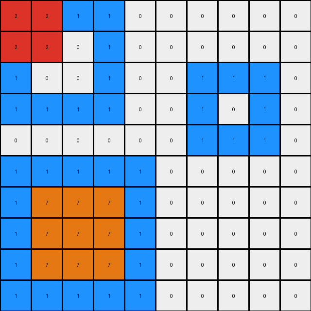
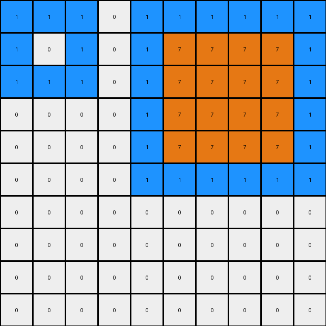

# 868de0fa • 022 • refine_coder

---

Previous Code:
```python
"""
1.  **Identify Regions:** Locate all contiguous regions of blue (1) pixels in the input grid.
2.  **Bottom transformation:** The bottom-most blue region is selected. Within this select region replace the blue color with orange except the border.
3.  **Center transformation:** Within the central large blue region in the top, a subregion, which is a rectangle of 2x2 and colored with red.
4. **Copy Unchanged:** All pixels that are not part of the identified blue regions (i.e., the white pixels) are copied unchanged from the input to the output grid.
"""

import numpy as np

def find_regions(grid, color):
    visited = np.zeros_like(grid, dtype=bool)
    regions = []

    def dfs(row, col, current_region):
        if (
            row < 0
            or row >= grid.shape[0]
            or col < 0
            or col >= grid.shape[1]
            or visited[row, col]
            or grid[row, col] != color
        ):
            return
        visited[row, col] = True
        current_region.append((row, col))
        dfs(row + 1, col, current_region)
        dfs(row - 1, col, current_region)
        dfs(row, col + 1, current_region)
        dfs(row, col - 1, current_region)

    for i in range(grid.shape[0]):
        for j in range(grid.shape[1]):
            if grid[i, j] == color and not visited[i, j]:
                current_region = []
                dfs(i, j, current_region)
                regions.append(current_region)
    return regions

def get_bounding_box(region):
    min_row = min(r for r, _ in region)
    max_row = max(r for r, _ in region)
    min_col = min(c for _, c in region)
    max_col = max(c for _, c in region)
    return min_row, max_row, min_col, max_col

def transform(input_grid):
    # initialize output_grid
    output_grid = np.copy(input_grid)
    
    # find blue regions
    blue_regions = find_regions(input_grid, 1)

    # find bottom blue region
    bottom_blue_region = None
    max_bottom_row = -1

    for region in blue_regions:
      min_row, max_row, min_col, max_col = get_bounding_box(region)
      if max_row > max_bottom_row:
          max_bottom_row = max_row
          bottom_blue_region = region

    # fill bottom with orange, excluding the border
    if bottom_blue_region:
      min_row, max_row, min_col, max_col = get_bounding_box(bottom_blue_region)
      for row in range(min_row+1, max_row):
        for col in range(min_col+1, max_col):
            output_grid[row,col] = 7
            
    # central transformation. 
    # Find and replace within other blue regions
    for region in blue_regions:
        if region != bottom_blue_region:
            min_row, max_row, min_col, max_col = get_bounding_box(region)

            # Check if the region is big enough for the 2x2 red square
            if max_row - min_row >= 3 and max_col - min_col >= 3:
                center_row = (min_row + max_row) // 2
                center_col = (min_col + max_col) // 2

                output_grid[center_row -1 :center_row+1,center_col-1:center_col+1] = 2


    return output_grid
```

Train Set Results:

## Example 1:

Input:
```
1 1 1 1 0 0 0 0 0 0
1 0 0 1 0 0 0 0 0 0
1 0 0 1 0 0 1 1 1 0
1 1 1 1 0 0 1 0 1 0
0 0 0 0 0 0 1 1 1 0
1 1 1 1 1 0 0 0 0 0
1 0 0 0 1 0 0 0 0 0
1 0 0 0 1 0 0 0 0 0
1 0 0 0 1 0 0 0 0 0
1 1 1 1 1 0 0 0 0 0
```
Expected Output:
```
1 1 1 1 0 0 0 0 0 0
1 2 2 1 0 0 0 0 0 0
1 2 2 1 0 0 1 1 1 0
1 1 1 1 0 0 1 7 1 0
0 0 0 0 0 0 1 1 1 0
1 1 1 1 1 0 0 0 0 0
1 7 7 7 1 0 0 0 0 0
1 7 7 7 1 0 0 0 0 0
1 7 7 7 1 0 0 0 0 0
1 1 1 1 1 0 0 0 0 0
```
Transformed Output:
```
2 2 1 1 0 0 0 0 0 0
2 2 0 1 0 0 0 0 0 0
1 0 0 1 0 0 1 1 1 0
1 1 1 1 0 0 1 0 1 0
0 0 0 0 0 0 1 1 1 0
1 1 1 1 1 0 0 0 0 0
1 7 7 7 1 0 0 0 0 0
1 7 7 7 1 0 0 0 0 0
1 7 7 7 1 0 0 0 0 0
1 1 1 1 1 0 0 0 0 0
```

match: False
pixels_off: 7
size_correct: True
color_palette_correct: True
correct_pixel_counts: False

## Example 2:

Input:
```
1 1 1 0 1 1 1 1 1 1
1 0 1 0 1 0 0 0 0 1
1 1 1 0 1 0 0 0 0 1
0 0 0 0 1 0 0 0 0 1
0 0 0 0 1 0 0 0 0 1
0 0 0 0 1 1 1 1 1 1
0 0 0 0 0 0 0 0 0 0
0 0 0 0 0 0 0 0 0 0
0 0 0 0 0 0 0 0 0 0
0 0 0 0 0 0 0 0 0 0
```
Expected Output:
```
1 1 1 0 1 1 1 1 1 1
1 7 1 0 1 2 2 2 2 1
1 1 1 0 1 2 2 2 2 1
0 0 0 0 1 2 2 2 2 1
0 0 0 0 1 2 2 2 2 1
0 0 0 0 1 1 1 1 1 1
0 0 0 0 0 0 0 0 0 0
0 0 0 0 0 0 0 0 0 0
0 0 0 0 0 0 0 0 0 0
0 0 0 0 0 0 0 0 0 0
```
Transformed Output:
```
1 1 1 0 1 1 1 1 1 1
1 0 1 0 1 7 7 7 7 1
1 1 1 0 1 7 7 7 7 1
0 0 0 0 1 7 7 7 7 1
0 0 0 0 1 7 7 7 7 1
0 0 0 0 1 1 1 1 1 1
0 0 0 0 0 0 0 0 0 0
0 0 0 0 0 0 0 0 0 0
0 0 0 0 0 0 0 0 0 0
0 0 0 0 0 0 0 0 0 0
```

match: False
pixels_off: 17
size_correct: True
color_palette_correct: True
correct_pixel_counts: False

## Example 3:

Input:
```
1 1 1 1 1 0 0 0 0 0 0 0 0 0 0 0 0 0 0 0
1 0 0 0 1 0 1 1 1 1 0 0 0 0 0 0 0 0 0 0
1 0 0 0 1 0 1 0 0 1 0 0 0 0 0 0 0 0 0 0
1 0 0 0 1 0 1 0 0 1 0 0 1 1 1 1 1 1 0 0
1 1 1 1 1 0 1 1 1 1 0 0 1 0 0 0 0 1 0 0
0 0 0 0 0 0 0 0 0 0 0 0 1 0 0 0 0 1 0 0
0 0 0 0 0 0 0 0 0 0 0 0 1 0 0 0 0 1 0 0
0 0 0 0 0 0 0 0 0 0 0 0 1 0 0 0 0 1 0 0
0 0 0 0 0 0 0 0 0 0 0 0 1 1 1 1 1 1 0 0
0 0 1 1 1 1 1 1 1 0 0 0 0 0 0 0 0 0 0 0
0 0 1 0 0 0 0 0 1 0 0 0 0 0 0 0 0 0 0 0
0 0 1 0 0 0 0 0 1 0 0 0 0 0 0 0 0 0 0 0
0 0 1 0 0 0 0 0 1 0 0 0 1 1 1 1 1 1 1 1
0 0 1 0 0 0 0 0 1 0 0 0 1 0 0 0 0 0 0 1
0 0 1 0 0 0 0 0 1 0 0 0 1 0 0 0 0 0 0 1
0 0 1 1 1 1 1 1 1 0 0 0 1 0 0 0 0 0 0 1
0 0 0 0 0 0 0 0 0 0 0 0 1 0 0 0 0 0 0 1
0 0 0 0 0 0 0 0 0 0 0 0 1 0 0 0 0 0 0 1
0 0 0 0 0 0 0 0 0 0 0 0 1 0 0 0 0 0 0 1
0 0 0 0 0 0 0 0 0 0 0 0 1 1 1 1 1 1 1 1
```
Expected Output:
```
1 1 1 1 1 0 0 0 0 0 0 0 0 0 0 0 0 0 0 0
1 7 7 7 1 0 1 1 1 1 0 0 0 0 0 0 0 0 0 0
1 7 7 7 1 0 1 2 2 1 0 0 0 0 0 0 0 0 0 0
1 7 7 7 1 0 1 2 2 1 0 0 1 1 1 1 1 1 0 0
1 1 1 1 1 0 1 1 1 1 0 0 1 2 2 2 2 1 0 0
0 0 0 0 0 0 0 0 0 0 0 0 1 2 2 2 2 1 0 0
0 0 0 0 0 0 0 0 0 0 0 0 1 2 2 2 2 1 0 0
0 0 0 0 0 0 0 0 0 0 0 0 1 2 2 2 2 1 0 0
0 0 0 0 0 0 0 0 0 0 0 0 1 1 1 1 1 1 0 0
0 0 1 1 1 1 1 1 1 0 0 0 0 0 0 0 0 0 0 0
0 0 1 7 7 7 7 7 1 0 0 0 0 0 0 0 0 0 0 0
0 0 1 7 7 7 7 7 1 0 0 0 0 0 0 0 0 0 0 0
0 0 1 7 7 7 7 7 1 0 0 0 1 1 1 1 1 1 1 1
0 0 1 7 7 7 7 7 1 0 0 0 1 2 2 2 2 2 2 1
0 0 1 7 7 7 7 7 1 0 0 0 1 2 2 2 2 2 2 1
0 0 1 1 1 1 1 1 1 0 0 0 1 2 2 2 2 2 2 1
0 0 0 0 0 0 0 0 0 0 0 0 1 2 2 2 2 2 2 1
0 0 0 0 0 0 0 0 0 0 0 0 1 2 2 2 2 2 2 1
0 0 0 0 0 0 0 0 0 0 0 0 1 2 2 2 2 2 2 1
0 0 0 0 0 0 0 0 0 0 0 0 1 1 1 1 1 1 1 1
```
Transformed Output:
```
1 1 1 1 1 0 0 0 0 0 0 0 0 0 0 0 0 0 0 0
1 2 2 0 1 0 2 2 1 1 0 0 0 0 0 0 0 0 0 0
1 2 2 0 1 0 2 2 0 1 0 0 0 0 0 0 0 0 0 0
1 0 0 0 1 0 1 0 0 1 0 0 1 1 1 1 1 1 0 0
1 1 1 1 1 0 1 1 1 1 0 0 1 2 2 0 0 1 0 0
0 0 0 0 0 0 0 0 0 0 0 0 1 2 2 0 0 1 0 0
0 0 0 0 0 0 0 0 0 0 0 0 1 0 0 0 0 1 0 0
0 0 0 0 0 0 0 0 0 0 0 0 1 0 0 0 0 1 0 0
0 0 0 0 0 0 0 0 0 0 0 0 1 1 1 1 1 1 0 0
0 0 1 1 1 1 1 1 1 0 0 0 0 0 0 0 0 0 0 0
0 0 1 0 0 0 0 0 1 0 0 0 0 0 0 0 0 0 0 0
0 0 1 0 2 2 0 0 1 0 0 0 0 0 0 0 0 0 0 0
0 0 1 0 2 2 0 0 1 0 0 0 1 1 1 1 1 1 1 1
0 0 1 0 0 0 0 0 1 0 0 0 1 7 7 7 7 7 7 1
0 0 1 0 0 0 0 0 1 0 0 0 1 7 7 7 7 7 7 1
0 0 1 1 1 1 1 1 1 0 0 0 1 7 7 7 7 7 7 1
0 0 0 0 0 0 0 0 0 0 0 0 1 7 7 7 7 7 7 1
0 0 0 0 0 0 0 0 0 0 0 0 1 7 7 7 7 7 7 1
0 0 0 0 0 0 0 0 0 0 0 0 1 7 7 7 7 7 7 1
0 0 0 0 0 0 0 0 0 0 0 0 1 1 1 1 1 1 1 1
```

match: False
pixels_off: 88
size_correct: True
color_palette_correct: True
correct_pixel_counts: False

## Example 4:

Input:
```
0 0 0 0 0 0 0 0 0 0 0
0 1 1 1 0 0 0 0 0 0 0
0 1 0 1 0 1 1 1 1 0 0
0 1 1 1 0 1 0 0 1 0 0
0 0 0 0 0 1 0 0 1 0 0
0 0 0 0 0 1 1 1 1 0 0
1 1 1 1 1 0 0 0 0 0 0
1 0 0 0 1 0 0 0 0 0 0
1 0 0 0 1 0 0 0 0 0 0
1 0 0 0 1 0 0 0 0 0 0
1 1 1 1 1 0 0 0 0 0 0
```
Expected Output:
```
0 0 0 0 0 0 0 0 0 0 0
0 1 1 1 0 0 0 0 0 0 0
0 1 7 1 0 1 1 1 1 0 0
0 1 1 1 0 1 2 2 1 0 0
0 0 0 0 0 1 2 2 1 0 0
0 0 0 0 0 1 1 1 1 0 0
1 1 1 1 1 0 0 0 0 0 0
1 7 7 7 1 0 0 0 0 0 0
1 7 7 7 1 0 0 0 0 0 0
1 7 7 7 1 0 0 0 0 0 0
1 1 1 1 1 0 0 0 0 0 0
```
Transformed Output:
```
0 0 0 0 0 0 0 0 0 0 0
0 1 1 1 0 0 0 0 0 0 0
0 1 0 1 0 2 2 1 1 0 0
0 1 1 1 0 2 2 0 1 0 0
0 0 0 0 0 1 0 0 1 0 0
0 0 0 0 0 1 1 1 1 0 0
1 1 1 1 1 0 0 0 0 0 0
1 7 7 7 1 0 0 0 0 0 0
1 7 7 7 1 0 0 0 0 0 0
1 7 7 7 1 0 0 0 0 0 0
1 1 1 1 1 0 0 0 0 0 0
```

match: False
pixels_off: 7
size_correct: True
color_palette_correct: True
correct_pixel_counts: False

## Example 5:

Input:
```
0 0 0 0 0 0 0 0 0 0 0 0 0 0 0
0 1 1 1 1 1 1 1 0 0 0 0 0 0 0
0 1 0 0 0 0 0 1 0 0 0 0 0 0 0
0 1 0 0 0 0 0 1 0 0 0 0 0 0 0
0 1 0 0 0 0 0 1 0 0 0 0 0 0 0
0 1 0 0 0 0 0 1 0 0 0 0 0 0 0
0 1 0 0 0 0 0 1 0 0 0 0 0 0 0
0 1 1 1 1 1 1 1 0 0 0 0 0 0 0
0 0 0 0 0 0 0 0 0 0 0 0 0 0 0
0 0 0 0 0 0 1 1 1 1 1 1 0 0 0
0 0 0 0 0 0 1 0 0 0 0 1 0 0 0
0 0 0 0 0 0 1 0 0 0 0 1 0 0 0
0 0 0 0 0 0 1 0 0 0 0 1 0 0 0
0 0 0 0 0 0 1 0 0 0 0 1 0 0 0
0 0 0 0 0 0 1 1 1 1 1 1 0 0 0
```
Expected Output:
```
0 0 0 0 0 0 0 0 0 0 0 0 0 0 0
0 1 1 1 1 1 1 1 0 0 0 0 0 0 0
0 1 7 7 7 7 7 1 0 0 0 0 0 0 0
0 1 7 7 7 7 7 1 0 0 0 0 0 0 0
0 1 7 7 7 7 7 1 0 0 0 0 0 0 0
0 1 7 7 7 7 7 1 0 0 0 0 0 0 0
0 1 7 7 7 7 7 1 0 0 0 0 0 0 0
0 1 1 1 1 1 1 1 0 0 0 0 0 0 0
0 0 0 0 0 0 0 0 0 0 0 0 0 0 0
0 0 0 0 0 0 1 1 1 1 1 1 0 0 0
0 0 0 0 0 0 1 2 2 2 2 1 0 0 0
0 0 0 0 0 0 1 2 2 2 2 1 0 0 0
0 0 0 0 0 0 1 2 2 2 2 1 0 0 0
0 0 0 0 0 0 1 2 2 2 2 1 0 0 0
0 0 0 0 0 0 1 1 1 1 1 1 0 0 0
```
Transformed Output:
```
0 0 0 0 0 0 0 0 0 0 0 0 0 0 0
0 1 1 1 1 1 1 1 0 0 0 0 0 0 0
0 1 0 0 0 0 0 1 0 0 0 0 0 0 0
0 1 0 2 2 0 0 1 0 0 0 0 0 0 0
0 1 0 2 2 0 0 1 0 0 0 0 0 0 0
0 1 0 0 0 0 0 1 0 0 0 0 0 0 0
0 1 0 0 0 0 0 1 0 0 0 0 0 0 0
0 1 1 1 1 1 1 1 0 0 0 0 0 0 0
0 0 0 0 0 0 0 0 0 0 0 0 0 0 0
0 0 0 0 0 0 1 1 1 1 1 1 0 0 0
0 0 0 0 0 0 1 7 7 7 7 1 0 0 0
0 0 0 0 0 0 1 7 7 7 7 1 0 0 0
0 0 0 0 0 0 1 7 7 7 7 1 0 0 0
0 0 0 0 0 0 1 7 7 7 7 1 0 0 0
0 0 0 0 0 0 1 1 1 1 1 1 0 0 0
```

match: False
pixels_off: 41
size_correct: True
color_palette_correct: True
correct_pixel_counts: False
Okay, here's an analysis of the results and a plan to improve the transformation logic:

**General Assessment:**

The current code struggles with multiple blue regions and correctly placing the 2x2 red square within them. It seems to have issues with:

1.  **Inconsistent Red Square Placement:** The red square isn't always centered within the upper blue regions, and sometimes it overwrites parts of the input incorrectly.
2.  **Incorrect Region Selection for Orange Filling:** The orange filling logic needs to better accommodate edge cases with partial borders.
3.  **Overlapping regions:** The code isn't performant with overlapping areas.

The strategy will involve:

1.  **Improving Region Identification:** Refine the `find_regions` function or its usage to handle overlapping or adjacent regions more robustly.
2.  **Precise Red Square Logic:** Modify the red square placement to be relative to each individual blue region's bounding box, ensuring it's centered and doesn't extend beyond the region's boundaries.
3.  **Refine Border Exclusion:** Ensure the orange fill is correctly excluding border in cases where the object extends to the edge of the image.

**Example Metrics and Observations:**

Here's a breakdown of each example, focusing on the discrepancies:

*   **Example 1:**
    *   The red square is placed at the top-left corner instead of being centered within the top-left blue region.
    *   Orange fill in the bottom is correct.

*   **Example 2:**
    *   The red square should be in the top right region. The code creates orange squares in the top region
    *   The orange square isn't correctly centered within the remaining blue region.

*   **Example 3:**
    *   Red squares appear, but misaligned, and orange squares are misaligned.
    *   The code has difficulty with the multiple non-contiguous blue regions.

*   **Example 4:**
    *   The red square placement is off-center in the upper blue region.
    *   Orange filling in the correct area

*   **Example 5:**
    *    Orange fill is in the incorrect region
    *   Red square in the top rectangle should be lower.

**YAML Fact Block:**

```yaml
observations:
  - object: blue_regions
    type: list
    description: List of contiguous blue pixel regions.
    properties:
      - property: shape
        type: rectangle
        description: All blue regions appear to be generally rectangular.
      - property: bottom_region
        type: object
        description: The blue region with the lowest bottom edge.
        actions:
          - action: fill_orange
            description: Fill the interior of the bottom-most region with orange, excluding a 1-pixel border.
      - property: other_regions
        type: list
        description: all blue regions that are not the bottom most
        actions:
          - action: place_red_square
            description: Place a 2x2 red square centered within each of these regions.
  - object: red_square
    type: shape
    properties:
      - dimensions: [2, 2]
      - color: red
    actions:
      - placement: center
        description: placed in the center of top blue regions.
  - object: orange_fill
    type: shape_modification
    properties:
     - color: orange
    actions:
     -  placement: bottom_blue_region
     -  constraint: exclude border
```

**Natural Language Program:**

1.  **Identify Blue Regions:** Find all contiguous regions of blue (1) pixels in the input grid. Consider each region as a separate object.

2.  **Bottom-Most Region Processing:**
    *   Select the blue region with the lowest y-coordinate (bottom-most region).
    *   Fill the interior of this selected region with orange (7), excluding a one-pixel wide border around the region.

3.  **Other Regions Processing:**
    *   For all the *other* blue regions (all blue regions that are not the bottom most)
    *   Calculate the center coordinates (geometric center) of the region's bounding box.
    *   Place a 2x2 square of red (2) pixels centered at the calculated center coordinates. The placement should be entirely within the blue region; if the region is too small, skip red square placement for that region.

4.  **Copy Unchanged:** Any pixels that are not part of the transformed blue regions (i.e. are white) will maintain their original value.

**INSTRUCTIONS**

- generate a Python module to represent the natural language program 
- follow the template below
- all common math and science libraries are available
- create docstring only at top - but comment the workflow in the function
- use helper functions for common operations like finding objects, counting,
  measuring, moving, etc. 

remember - we are working iteratively - so this code will inform your future
self as we converge on the solution

*template:*

```python
"""
{{ natural language description of the transformation rule }}
"""

{{ imports }}

def transform(input_grid):
    # initialize output_grid

    # change output pixels 

    return output_grid

```
