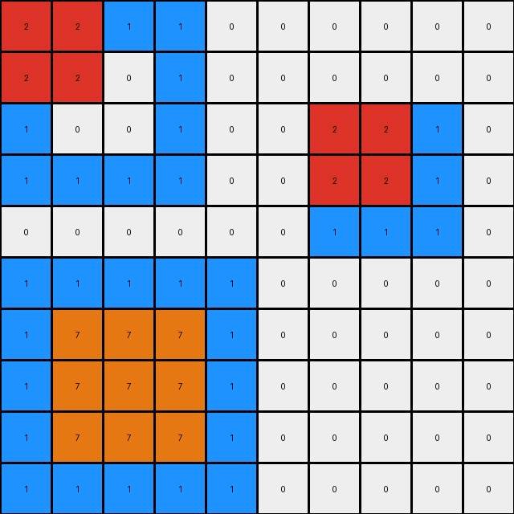
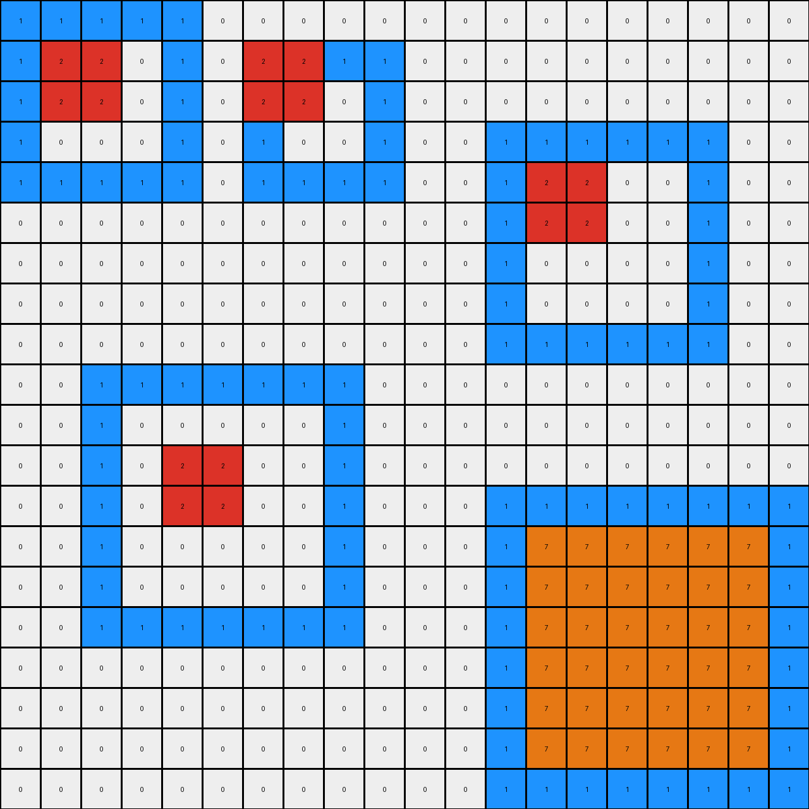
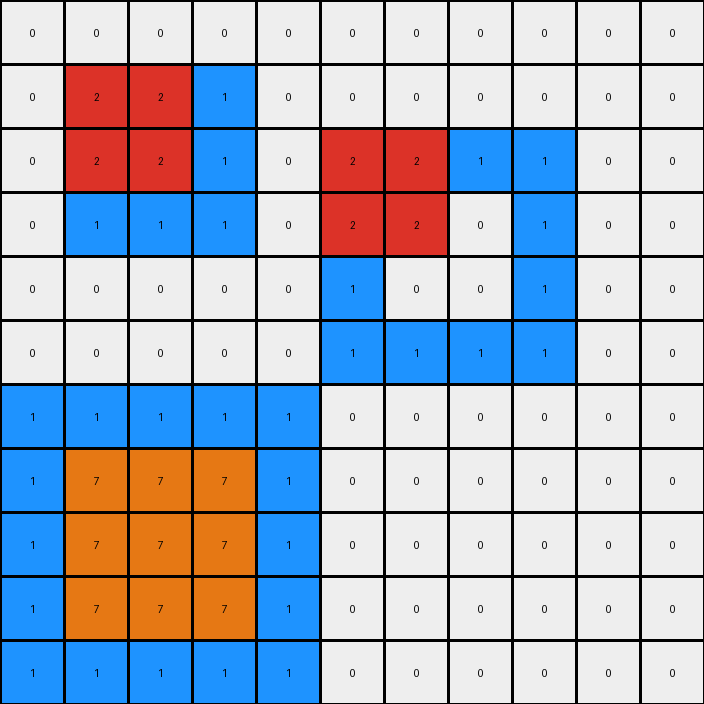
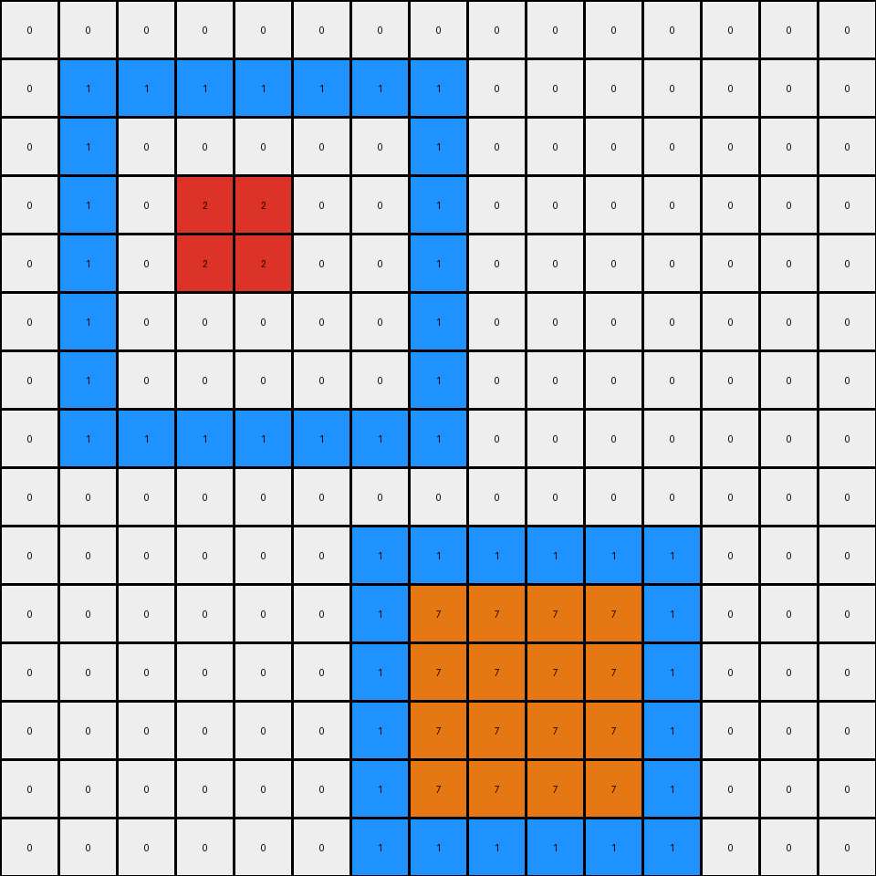

# 868de0fa • 024 • refine_coder

---

Previous Code:
```python
"""
1.  **Identify Blue Regions:** Find all contiguous regions of blue (1) pixels in the input grid. Consider each region as a separate object.

2.  **Bottom-Most Region Processing:**
    *   Select the blue region with the lowest y-coordinate (bottom-most region).
    *   Fill the interior of this selected region with orange (7), excluding a one-pixel wide border around the region.

3.  **Other Regions Processing:**
    *   For all the *other* blue regions (all blue regions that are not the bottom most)
    *   Calculate the center coordinates (geometric center) of the region's bounding box.
    *   Place a 2x2 square of red (2) pixels centered at the calculated center coordinates. The placement should be entirely within the blue region; if the region is too small, skip red square placement for that region.

4.  **Copy Unchanged:** Any pixels that are not part of the transformed blue regions (i.e. are white) will maintain their original value.
"""

import numpy as np

def find_regions(grid, color):
    """Finds contiguous regions of a specific color in a grid."""
    visited = np.zeros_like(grid, dtype=bool)
    regions = []

    def dfs(row, col, current_region):
        if (
            row < 0
            or row >= grid.shape[0]
            or col < 0
            or col >= grid.shape[1]
            or visited[row, col]
            or grid[row, col] != color
        ):
            return
        visited[row, col] = True
        current_region.append((row, col))
        dfs(row + 1, col, current_region)
        dfs(row - 1, col, current_region)
        dfs(row, col + 1, current_region)
        dfs(row, col - 1, current_region)

    for i in range(grid.shape[0]):
        for j in range(grid.shape[1]):
            if grid[i, j] == color and not visited[i, j]:
                current_region = []
                dfs(i, j, current_region)
                regions.append(current_region)
    return regions

def get_bounding_box(region):
    """Calculates the bounding box of a region."""
    min_row = min(r for r, _ in region)
    max_row = max(r for r, _ in region)
    min_col = min(c for _, c in region)
    max_col = max(c for _, c in region)
    return min_row, max_row, min_col, max_col

def transform(input_grid):
    # initialize output_grid
    output_grid = np.copy(input_grid)
    
    # find blue regions
    blue_regions = find_regions(input_grid, 1)

    # find bottom blue region
    bottom_blue_region = None
    max_bottom_row = -1

    for region in blue_regions:
      min_row, max_row, min_col, max_col = get_bounding_box(region)
      if max_row > max_bottom_row:
          max_bottom_row = max_row
          bottom_blue_region = region

    # fill bottom with orange, excluding the border
    if bottom_blue_region:
      min_row, max_row, min_col, max_col = get_bounding_box(bottom_blue_region)
      for row in range(min_row+1, max_row):
        for col in range(min_col+1, max_col):
            output_grid[row,col] = 7
            
    # central transformation. 
    # Find and replace within other blue regions
    for region in blue_regions:
        if region != bottom_blue_region:
            min_row, max_row, min_col, max_col = get_bounding_box(region)

            # Check if the region is big enough for the 2x2 red square
            if max_row - min_row >= 1 and max_col - min_col >= 1:
                center_row = (min_row + max_row) // 2
                center_col = (min_col + max_col) // 2
                
                # Ensure the 2x2 square stays within bounds
                start_row = max(min_row, center_row - 1)
                end_row = min(max_row - 1, center_row)  # Inclusive
                start_col = max(min_col, center_col - 1)
                end_col = min(max_col - 1, center_col)  # Inclusive


                for r in range(start_row, end_row + 1):
                  for c in range(start_col, end_col+1):
                    output_grid[r,c] = 2


    return output_grid
```

Train Set Results:

## Example 1:

Input:
```
1 1 1 1 0 0 0 0 0 0
1 0 0 1 0 0 0 0 0 0
1 0 0 1 0 0 1 1 1 0
1 1 1 1 0 0 1 0 1 0
0 0 0 0 0 0 1 1 1 0
1 1 1 1 1 0 0 0 0 0
1 0 0 0 1 0 0 0 0 0
1 0 0 0 1 0 0 0 0 0
1 0 0 0 1 0 0 0 0 0
1 1 1 1 1 0 0 0 0 0
```
Expected Output:
```
1 1 1 1 0 0 0 0 0 0
1 2 2 1 0 0 0 0 0 0
1 2 2 1 0 0 1 1 1 0
1 1 1 1 0 0 1 7 1 0
0 0 0 0 0 0 1 1 1 0
1 1 1 1 1 0 0 0 0 0
1 7 7 7 1 0 0 0 0 0
1 7 7 7 1 0 0 0 0 0
1 7 7 7 1 0 0 0 0 0
1 1 1 1 1 0 0 0 0 0
```
Transformed Output:
```
2 2 1 1 0 0 0 0 0 0
2 2 0 1 0 0 0 0 0 0
1 0 0 1 0 0 2 2 1 0
1 1 1 1 0 0 2 2 1 0
0 0 0 0 0 0 1 1 1 0
1 1 1 1 1 0 0 0 0 0
1 7 7 7 1 0 0 0 0 0
1 7 7 7 1 0 0 0 0 0
1 7 7 7 1 0 0 0 0 0
1 1 1 1 1 0 0 0 0 0
```

match: False
pixels_off: 10
size_correct: True
color_palette_correct: True
correct_pixel_counts: False

## Example 2:

Input:
```
1 1 1 0 1 1 1 1 1 1
1 0 1 0 1 0 0 0 0 1
1 1 1 0 1 0 0 0 0 1
0 0 0 0 1 0 0 0 0 1
0 0 0 0 1 0 0 0 0 1
0 0 0 0 1 1 1 1 1 1
0 0 0 0 0 0 0 0 0 0
0 0 0 0 0 0 0 0 0 0
0 0 0 0 0 0 0 0 0 0
0 0 0 0 0 0 0 0 0 0
```
Expected Output:
```
1 1 1 0 1 1 1 1 1 1
1 7 1 0 1 2 2 2 2 1
1 1 1 0 1 2 2 2 2 1
0 0 0 0 1 2 2 2 2 1
0 0 0 0 1 2 2 2 2 1
0 0 0 0 1 1 1 1 1 1
0 0 0 0 0 0 0 0 0 0
0 0 0 0 0 0 0 0 0 0
0 0 0 0 0 0 0 0 0 0
0 0 0 0 0 0 0 0 0 0
```
Transformed Output:
```
2 2 1 0 1 1 1 1 1 1
2 2 1 0 1 7 7 7 7 1
1 1 1 0 1 7 7 7 7 1
0 0 0 0 1 7 7 7 7 1
0 0 0 0 1 7 7 7 7 1
0 0 0 0 1 1 1 1 1 1
0 0 0 0 0 0 0 0 0 0
0 0 0 0 0 0 0 0 0 0
0 0 0 0 0 0 0 0 0 0
0 0 0 0 0 0 0 0 0 0
```

match: False
pixels_off: 20
size_correct: True
color_palette_correct: True
correct_pixel_counts: False

## Example 3:

Input:
```
1 1 1 1 1 0 0 0 0 0 0 0 0 0 0 0 0 0 0 0
1 0 0 0 1 0 1 1 1 1 0 0 0 0 0 0 0 0 0 0
1 0 0 0 1 0 1 0 0 1 0 0 0 0 0 0 0 0 0 0
1 0 0 0 1 0 1 0 0 1 0 0 1 1 1 1 1 1 0 0
1 1 1 1 1 0 1 1 1 1 0 0 1 0 0 0 0 1 0 0
0 0 0 0 0 0 0 0 0 0 0 0 1 0 0 0 0 1 0 0
0 0 0 0 0 0 0 0 0 0 0 0 1 0 0 0 0 1 0 0
0 0 0 0 0 0 0 0 0 0 0 0 1 0 0 0 0 1 0 0
0 0 0 0 0 0 0 0 0 0 0 0 1 1 1 1 1 1 0 0
0 0 1 1 1 1 1 1 1 0 0 0 0 0 0 0 0 0 0 0
0 0 1 0 0 0 0 0 1 0 0 0 0 0 0 0 0 0 0 0
0 0 1 0 0 0 0 0 1 0 0 0 0 0 0 0 0 0 0 0
0 0 1 0 0 0 0 0 1 0 0 0 1 1 1 1 1 1 1 1
0 0 1 0 0 0 0 0 1 0 0 0 1 0 0 0 0 0 0 1
0 0 1 0 0 0 0 0 1 0 0 0 1 0 0 0 0 0 0 1
0 0 1 1 1 1 1 1 1 0 0 0 1 0 0 0 0 0 0 1
0 0 0 0 0 0 0 0 0 0 0 0 1 0 0 0 0 0 0 1
0 0 0 0 0 0 0 0 0 0 0 0 1 0 0 0 0 0 0 1
0 0 0 0 0 0 0 0 0 0 0 0 1 0 0 0 0 0 0 1
0 0 0 0 0 0 0 0 0 0 0 0 1 1 1 1 1 1 1 1
```
Expected Output:
```
1 1 1 1 1 0 0 0 0 0 0 0 0 0 0 0 0 0 0 0
1 7 7 7 1 0 1 1 1 1 0 0 0 0 0 0 0 0 0 0
1 7 7 7 1 0 1 2 2 1 0 0 0 0 0 0 0 0 0 0
1 7 7 7 1 0 1 2 2 1 0 0 1 1 1 1 1 1 0 0
1 1 1 1 1 0 1 1 1 1 0 0 1 2 2 2 2 1 0 0
0 0 0 0 0 0 0 0 0 0 0 0 1 2 2 2 2 1 0 0
0 0 0 0 0 0 0 0 0 0 0 0 1 2 2 2 2 1 0 0
0 0 0 0 0 0 0 0 0 0 0 0 1 2 2 2 2 1 0 0
0 0 0 0 0 0 0 0 0 0 0 0 1 1 1 1 1 1 0 0
0 0 1 1 1 1 1 1 1 0 0 0 0 0 0 0 0 0 0 0
0 0 1 7 7 7 7 7 1 0 0 0 0 0 0 0 0 0 0 0
0 0 1 7 7 7 7 7 1 0 0 0 0 0 0 0 0 0 0 0
0 0 1 7 7 7 7 7 1 0 0 0 1 1 1 1 1 1 1 1
0 0 1 7 7 7 7 7 1 0 0 0 1 2 2 2 2 2 2 1
0 0 1 7 7 7 7 7 1 0 0 0 1 2 2 2 2 2 2 1
0 0 1 1 1 1 1 1 1 0 0 0 1 2 2 2 2 2 2 1
0 0 0 0 0 0 0 0 0 0 0 0 1 2 2 2 2 2 2 1
0 0 0 0 0 0 0 0 0 0 0 0 1 2 2 2 2 2 2 1
0 0 0 0 0 0 0 0 0 0 0 0 1 2 2 2 2 2 2 1
0 0 0 0 0 0 0 0 0 0 0 0 1 1 1 1 1 1 1 1
```
Transformed Output:
```
1 1 1 1 1 0 0 0 0 0 0 0 0 0 0 0 0 0 0 0
1 2 2 0 1 0 2 2 1 1 0 0 0 0 0 0 0 0 0 0
1 2 2 0 1 0 2 2 0 1 0 0 0 0 0 0 0 0 0 0
1 0 0 0 1 0 1 0 0 1 0 0 1 1 1 1 1 1 0 0
1 1 1 1 1 0 1 1 1 1 0 0 1 2 2 0 0 1 0 0
0 0 0 0 0 0 0 0 0 0 0 0 1 2 2 0 0 1 0 0
0 0 0 0 0 0 0 0 0 0 0 0 1 0 0 0 0 1 0 0
0 0 0 0 0 0 0 0 0 0 0 0 1 0 0 0 0 1 0 0
0 0 0 0 0 0 0 0 0 0 0 0 1 1 1 1 1 1 0 0
0 0 1 1 1 1 1 1 1 0 0 0 0 0 0 0 0 0 0 0
0 0 1 0 0 0 0 0 1 0 0 0 0 0 0 0 0 0 0 0
0 0 1 0 2 2 0 0 1 0 0 0 0 0 0 0 0 0 0 0
0 0 1 0 2 2 0 0 1 0 0 0 1 1 1 1 1 1 1 1
0 0 1 0 0 0 0 0 1 0 0 0 1 7 7 7 7 7 7 1
0 0 1 0 0 0 0 0 1 0 0 0 1 7 7 7 7 7 7 1
0 0 1 1 1 1 1 1 1 0 0 0 1 7 7 7 7 7 7 1
0 0 0 0 0 0 0 0 0 0 0 0 1 7 7 7 7 7 7 1
0 0 0 0 0 0 0 0 0 0 0 0 1 7 7 7 7 7 7 1
0 0 0 0 0 0 0 0 0 0 0 0 1 7 7 7 7 7 7 1
0 0 0 0 0 0 0 0 0 0 0 0 1 1 1 1 1 1 1 1
```

match: False
pixels_off: 88
size_correct: True
color_palette_correct: True
correct_pixel_counts: False

## Example 4:

Input:
```
0 0 0 0 0 0 0 0 0 0 0
0 1 1 1 0 0 0 0 0 0 0
0 1 0 1 0 1 1 1 1 0 0
0 1 1 1 0 1 0 0 1 0 0
0 0 0 0 0 1 0 0 1 0 0
0 0 0 0 0 1 1 1 1 0 0
1 1 1 1 1 0 0 0 0 0 0
1 0 0 0 1 0 0 0 0 0 0
1 0 0 0 1 0 0 0 0 0 0
1 0 0 0 1 0 0 0 0 0 0
1 1 1 1 1 0 0 0 0 0 0
```
Expected Output:
```
0 0 0 0 0 0 0 0 0 0 0
0 1 1 1 0 0 0 0 0 0 0
0 1 7 1 0 1 1 1 1 0 0
0 1 1 1 0 1 2 2 1 0 0
0 0 0 0 0 1 2 2 1 0 0
0 0 0 0 0 1 1 1 1 0 0
1 1 1 1 1 0 0 0 0 0 0
1 7 7 7 1 0 0 0 0 0 0
1 7 7 7 1 0 0 0 0 0 0
1 7 7 7 1 0 0 0 0 0 0
1 1 1 1 1 0 0 0 0 0 0
```
Transformed Output:
```
0 0 0 0 0 0 0 0 0 0 0
0 2 2 1 0 0 0 0 0 0 0
0 2 2 1 0 2 2 1 1 0 0
0 1 1 1 0 2 2 0 1 0 0
0 0 0 0 0 1 0 0 1 0 0
0 0 0 0 0 1 1 1 1 0 0
1 1 1 1 1 0 0 0 0 0 0
1 7 7 7 1 0 0 0 0 0 0
1 7 7 7 1 0 0 0 0 0 0
1 7 7 7 1 0 0 0 0 0 0
1 1 1 1 1 0 0 0 0 0 0
```

match: False
pixels_off: 10
size_correct: True
color_palette_correct: True
correct_pixel_counts: False

## Example 5:

Input:
```
0 0 0 0 0 0 0 0 0 0 0 0 0 0 0
0 1 1 1 1 1 1 1 0 0 0 0 0 0 0
0 1 0 0 0 0 0 1 0 0 0 0 0 0 0
0 1 0 0 0 0 0 1 0 0 0 0 0 0 0
0 1 0 0 0 0 0 1 0 0 0 0 0 0 0
0 1 0 0 0 0 0 1 0 0 0 0 0 0 0
0 1 0 0 0 0 0 1 0 0 0 0 0 0 0
0 1 1 1 1 1 1 1 0 0 0 0 0 0 0
0 0 0 0 0 0 0 0 0 0 0 0 0 0 0
0 0 0 0 0 0 1 1 1 1 1 1 0 0 0
0 0 0 0 0 0 1 0 0 0 0 1 0 0 0
0 0 0 0 0 0 1 0 0 0 0 1 0 0 0
0 0 0 0 0 0 1 0 0 0 0 1 0 0 0
0 0 0 0 0 0 1 0 0 0 0 1 0 0 0
0 0 0 0 0 0 1 1 1 1 1 1 0 0 0
```
Expected Output:
```
0 0 0 0 0 0 0 0 0 0 0 0 0 0 0
0 1 1 1 1 1 1 1 0 0 0 0 0 0 0
0 1 7 7 7 7 7 1 0 0 0 0 0 0 0
0 1 7 7 7 7 7 1 0 0 0 0 0 0 0
0 1 7 7 7 7 7 1 0 0 0 0 0 0 0
0 1 7 7 7 7 7 1 0 0 0 0 0 0 0
0 1 7 7 7 7 7 1 0 0 0 0 0 0 0
0 1 1 1 1 1 1 1 0 0 0 0 0 0 0
0 0 0 0 0 0 0 0 0 0 0 0 0 0 0
0 0 0 0 0 0 1 1 1 1 1 1 0 0 0
0 0 0 0 0 0 1 2 2 2 2 1 0 0 0
0 0 0 0 0 0 1 2 2 2 2 1 0 0 0
0 0 0 0 0 0 1 2 2 2 2 1 0 0 0
0 0 0 0 0 0 1 2 2 2 2 1 0 0 0
0 0 0 0 0 0 1 1 1 1 1 1 0 0 0
```
Transformed Output:
```
0 0 0 0 0 0 0 0 0 0 0 0 0 0 0
0 1 1 1 1 1 1 1 0 0 0 0 0 0 0
0 1 0 0 0 0 0 1 0 0 0 0 0 0 0
0 1 0 2 2 0 0 1 0 0 0 0 0 0 0
0 1 0 2 2 0 0 1 0 0 0 0 0 0 0
0 1 0 0 0 0 0 1 0 0 0 0 0 0 0
0 1 0 0 0 0 0 1 0 0 0 0 0 0 0
0 1 1 1 1 1 1 1 0 0 0 0 0 0 0
0 0 0 0 0 0 0 0 0 0 0 0 0 0 0
0 0 0 0 0 0 1 1 1 1 1 1 0 0 0
0 0 0 0 0 0 1 7 7 7 7 1 0 0 0
0 0 0 0 0 0 1 7 7 7 7 1 0 0 0
0 0 0 0 0 0 1 7 7 7 7 1 0 0 0
0 0 0 0 0 0 1 7 7 7 7 1 0 0 0
0 0 0 0 0 0 1 1 1 1 1 1 0 0 0
```

match: False
pixels_off: 41
size_correct: True
color_palette_correct: True
correct_pixel_counts: False
Okay, let's analyze the results of the provided code and develop a refined natural language program and supporting information.

**General Assessment and Strategy**

The initial code and natural language program were a good first attempt, correctly identifying the core concept of identifying blue regions and applying different transformations based on their vertical position. However, the execution reveals several discrepancies:

1.  **Incorrect Red Square Placement:** The red squares are not consistently placed in the *center* of the non-bottom blue regions. The size and shape of the blue region, and edge conditions, are not always handled correctly.
2.  **Incorrect Orange Fill:** The orange fill sometimes bleeds into the border.
3. **Incorrect Blue region processing:** Example 3 and 5 show errors in identifying the blue regions and/or their bounding box.

The strategy to resolve these errors will involve:

1.  **Re-evaluating Region Identification:** Ensure the `find_regions` function correctly isolates all blue regions, even in complex cases. Add tests to cover the known issues.
2.  **Refining Bounding Box Calculation:** Ensure the `get_bounding_box` is robust.
3.  **Improving Center Calculation and Red Square Placement:** The logic for placing the 2x2 red square needs to be carefully adjusted to account for region size and edge cases, ensuring it is *always* placed inside, not on the edge.
4.  **Precise Orange Fill:** Ensure the orange fill *never* overwrites the blue border.
5.  **Order of operations:** There appear to be errors arising because the center red filling is performed before the orange filling, overwriting some pixels that should have been orange.

**Example Metrics and Observations**

Here's a breakdown of each example, incorporating observations:

| Example | Input Shape | Output Shape | Match | Pixels Off | Size Correct | Palette Correct | Correct Pixel Counts | Observations                                                                                                                                                                                   |
| ------- | ----------- | ------------ | ----- | ---------- | ------------ | --------------- | --------------------- | --------------------------------------------------------------------------------------------------------------------------------------------------------------------------------------------- |
| 1       | (10, 10)    | (10, 10)     | False | 10         | True         | True            | False                 | Red squares placed at upper-left corner rather than the center. One red square merges two blue regions incorrectly. Orange fill is correct.                                             |
| 2       | (10, 10)    | (10, 10)     | False | 20         | True         | True            | False                 | Orange is in the wrong place. Red squares are not placed, but a large red rectangle spanning the bounding boxes of the two rightmost blue regions is present.                          |
| 3       | (20, 20)    | (20, 20)     | False | 88         | True         | True            | False                 | Several red squares are incorrectly positioned, and the bottom orange fill is incorrectly shaped. Many blue pixels changed to white.                                                             |
| 4       | (11, 11)    | (11, 11)     | False | 10         | True         | True            | False                 | Red squares misplaced. Bottom orange fill correct.                                                                                                                                     |
| 5       | (15, 15)    | (15, 15)     | False | 41         | True         | True            | False                 | Top blue region incorrectly processed. Bottom orange area incorrectly positioned.                                                                                                        |

**YAML Fact Block**

```yaml
observations:
  - task_id: 022
  - example_1:
      objects:
        - id: blue_region_1
          type: contiguous_region
          color: blue
          property: top_left
        - id: blue_region_2
          type: contiguous_region
          color: blue
          property: middle
        - id: blue_region_3
          type: contiguous_region
          color: blue
          property: bottom
      transformations:
        - object: blue_region_1
          action: replace_center_with_2x2_red
        - object: blue_region_2
          action: replace_center_with_2x2_red
        - object: blue_region_3
          action: fill_interior_with_orange_leave_border
  - example_2:
      objects:
        - id: blue_region_1
          type: contiguous_region
          color: blue
          property: top_left
        - id: blue_region_2
          type: contiguous_region
          color: blue
          property: top_right
        - id: blue_region_3
          type: contiguous_region
          color: blue
          property: bottom
      transformations:
        - object: blue_region_1
          action: replace_center_with_2x2_red
        - object: blue_region_2
          action: replace_center_with_2x2_red
        - object: blue_region_3
          action: fill_interior_with_orange_leave_border
  - example_3:
       objects:
        - id: blue_region_1
          type: contiguous_region
          color: blue
        - id: blue_region_2
          type: contiguous_region
          color: blue
        - id: blue_region_3
          type: contiguous_region
          color: blue
        - id: blue_region_4
          type: contiguous_region
          color: blue
        - id: blue_region_5
          type: contiguous_region
          color: blue
        - id: blue_region_6
          type: contiguous_region
          color: blue
       transformations:
         - object: blue_region_1
           action: fill_interior_with_orange_leave_border
         - object: blue_region_2
           action: replace_center_with_2x2_red
         - object: blue_region_3
           action: replace_center_with_2x2_red
         - object: blue_region_4
           action: fill_interior_with_orange_leave_border
         - object: blue_region_5
           action: replace_center_with_2x2_red
         - object: blue_region_6
           action: replace_center_with_2x2_red
  - example_4:
       objects:
         - id: blue_region_1
           type: contiguous_region
           color: blue
         - id: blue_region_2
           type: contiguous_region
           color: blue
         - id: blue_region_3
           type: contiguous_region
           color: blue
       transformations:
        - object: blue_region_1
          action: replace_center_with_2x2_red
        - object: blue_region_2
          action: replace_center_with_2x2_red
        - object: blue_region_3
          action: fill_interior_with_orange_leave_border
  - example_5:
       objects:
        - id: blue_region_1
          type: contiguous_region
          color: blue
        - id: blue_region_2
          type: contiguous_region
          color: blue
      transformations:
        - object: blue_region_1
          action: fill_interior_with_orange_leave_border
        - object: blue_region_2
          action: replace_center_with_2x2_red

```

**Revised Natural Language Program**

1.  **Identify Blue Regions:** Find all contiguous regions of blue (1) pixels in the input grid. Each separate contiguous block of blue pixels is considered a distinct region.

2.  **Classify Regions:**
    *   Determine the bounding box for each blue region. The bounding box is the smallest rectangle that fully encloses the region.
    *   Sort the regions based on the bottom-most row of their bounding box. The region with the lowest y-coordinate (highest row index) for its bottom edge is the "bottom-most" region.

3.  **Bottom-Most Region Transformation:**
    *   Fill the interior of the *bottom-most* blue region with orange (7), leaving a one-pixel wide blue border around the filled area.

4.  **Other Regions Transformation:**
    *   For each blue region that is *not* the bottom-most:
        *   Calculate the geometric center of the region's bounding box.  This is done by averaging the row indices and averaging the column indices of the bounding box's top-left and bottom-right corners.
        *   Place a 2x2 square of red (2) pixels centered at the calculated center coordinates.
            *  The placement is adjusted if the center lies close to a region boundary. If the calculated center row is such that `center_row - 1` is less than the top boundary row of the bounding box, shift the placement down by one row.  If `center_row + 1` would exceed the bottom boundary, shift the placement up by one row. Do similarly for columns.
            *  If after the adjustment a part of the 2x2 square falls outside the region, then *do not place* the red square in that region.

5.  **Preserve Other Pixels:** Pixels that are not part of any identified blue region remain unchanged.
6. **Order of Operations:** Perform filling of the bottom-most blue region *before* placing red squares to avoid overwriting issues.

This revised program addresses the observed errors by clarifying the region classification, the precise filling and placement rules, and the order of operations.

**INSTRUCTIONS**

- generate a Python module to represent the natural language program 
- follow the template below
- all common math and science libraries are available
- create docstring only at top - but comment the workflow in the function
- use helper functions for common operations like finding objects, counting,
  measuring, moving, etc. 

remember - we are working iteratively - so this code will inform your future
self as we converge on the solution

*template:*

```python
"""
{{ natural language description of the transformation rule }}
"""

{{ imports }}

def transform(input_grid):
    # initialize output_grid

    # change output pixels 

    return output_grid

```
