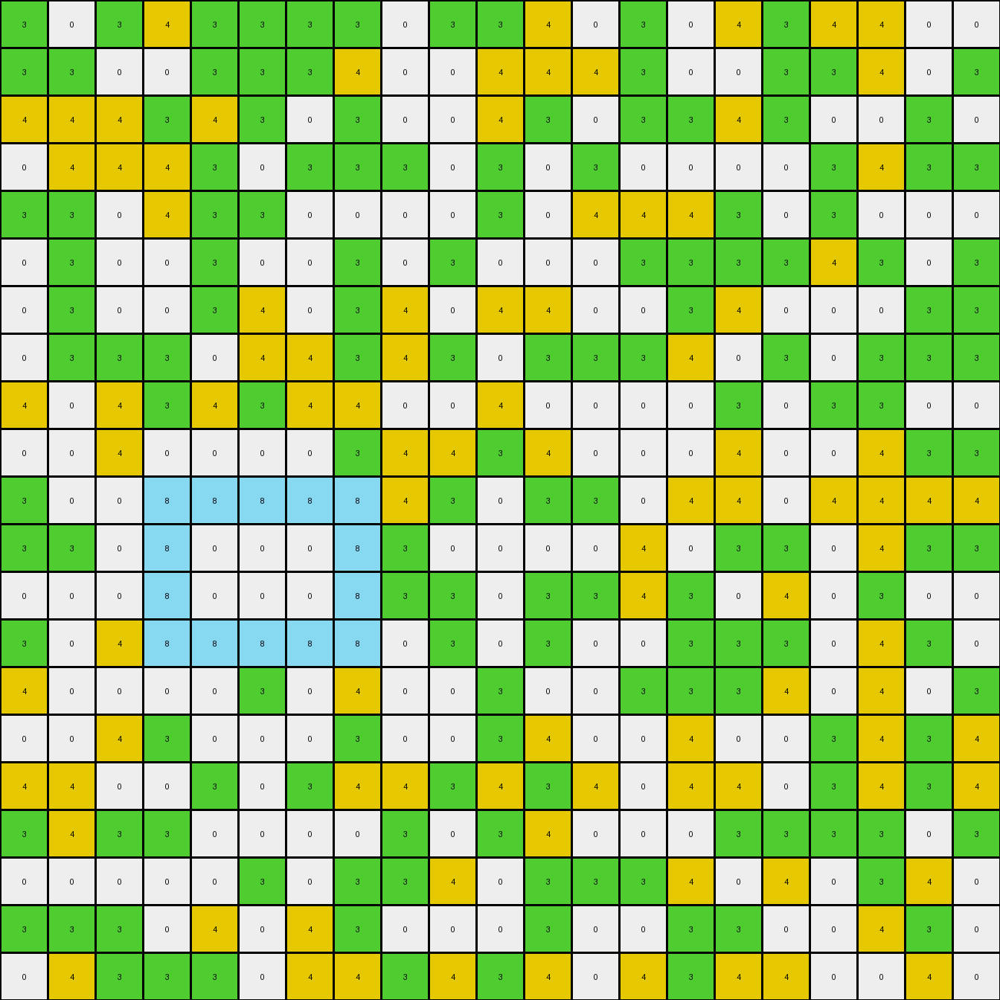

# 890034e9 • 005 • refine_dreamer

---


Previous Code:
```python
"""
1.  **Identify Target Objects:** Find all contiguous regions (objects) of a specific color in the input grid. Note the target color will vary across examples (e.g., red in example 1, azure in example 2).
2.  **Identify Interior Colors:** Within each target object's bounding box, check for specific "interior" colors.
3.  **Conditional Fill:**
    *   If a target object contains the specified "interior" colors:
        * Change any pixels matching the interior color within the bounding box to that interior color.
        * all other pixels within that area remain the same.

4. All other objects remain the same.
"""

import numpy as np

def find_objects(grid, color):
    """Finds contiguous regions of the specified color."""
    objects = []
    visited = np.zeros_like(grid, dtype=bool)

    def dfs(row, col):
        """Depth-first search to find connected components."""
        if (row < 0 or row >= grid.shape[0] or col < 0 or col >= grid.shape[1] or
                visited[row, col] or grid[row, col] != color):
            return []

        visited[row, col] = True
        region = [(row, col)]

        region.extend(dfs(row + 1, col))
        region.extend(dfs(row - 1, col))
        region.extend(dfs(row, col + 1))
        region.extend(dfs(row, col - 1))
        return region

    for row in range(grid.shape[0]):
        for col in range(grid.shape[1]):
            if not visited[row, col] and grid[row, col] == color:
                objects.append(dfs(row, col))
    return objects

def get_bounding_box(region):
    """Calculates the bounding box of a region."""
    min_row = min(r for r, c in region)
    max_row = max(r for r, c in region)
    min_col = min(c for r, c in region)
    max_col = max(c for r, c in region)
    return min_row, max_row, min_col, max_col

def contains_color(grid, bbox, color):
    """Checks if a bounding box contains a specific color."""
    min_row, max_row, min_col, max_col = bbox
    for row in range(min_row, max_row + 1):
        for col in range(min_col, max_col + 1):
            if grid[row, col] == color:
                return True
    return False


def transform(input_grid):
    # initialize output_grid
    output_grid = np.copy(input_grid)

    # Determine the target color and interior color based on the input.
    target_colors = [2, 8, 4, 3]  # Possible target colors (red, azure, yellow). Add others if necessary
    interior_colors = [0, 4]  # Possible filling colors, empty is represented by [].
    target_color = None
    interior_color = None

    for t_color in target_colors:
        target_objects = find_objects(input_grid, t_color)
        if target_objects:  #if target object not empty
            for i_color in interior_colors:
                for obj in target_objects:
                    bbox = get_bounding_box(obj)

                    if contains_color(input_grid, bbox, i_color):
                        target_color = t_color
                        interior_color = i_color
                        break  #found interior
                if target_color is not None: # if found object and interior color
                    break # found target
        if target_color is not None:
            break

    if target_color is None: #no target color found, don't change the input
        return output_grid


    # Find target objects
    target_objects = find_objects(input_grid, target_color)


    for target_object in target_objects:
        bbox = get_bounding_box(target_object)
        min_row, max_row, min_col, max_col = bbox

        #check if it contains interior color
        if contains_color(input_grid, bbox, interior_color):
            for row in range(min_row, max_row+1):
                for col in range(min_col, max_col+1):
                    #if within bounding box
                    if input_grid[row, col] == interior_color:
                        output_grid[row,col] = interior_color
        # else is not needed since output_grid is initialized with input, and target_color already found

    return output_grid
```

Train Set Results:

## Example 1:

Input:
```
0 8 1 1 0 1 1 1 1 0 1 0 1 0 1 1 1 1 1 1 1
1 1 0 8 1 1 1 0 1 0 0 0 1 1 1 1 0 1 1 1 1
1 0 0 1 0 0 2 2 2 2 1 1 1 1 1 8 1 1 1 1 0
0 1 1 1 1 1 2 0 0 2 1 1 1 1 1 1 1 8 1 0 1
1 1 1 1 1 0 2 0 0 2 1 0 0 1 1 0 1 0 1 1 0
1 0 0 0 0 1 2 0 0 2 1 8 1 1 1 1 1 0 1 1 1
0 0 1 1 0 1 2 2 2 2 1 0 1 0 0 1 1 8 0 0 8
0 1 8 0 0 1 1 0 0 1 1 0 1 1 1 1 8 1 1 0 0
1 1 1 8 8 1 1 1 0 0 8 1 1 1 1 1 8 1 0 0 1
8 1 0 1 1 1 1 0 8 1 1 0 1 1 1 1 0 0 1 0 1
8 0 1 1 1 1 1 0 0 1 1 1 1 0 1 1 8 1 1 8 1
1 1 1 8 1 0 1 1 8 1 0 1 1 1 0 1 1 1 1 0 1
1 0 8 1 1 8 0 1 1 1 1 1 1 1 0 1 0 8 1 1 1
1 1 8 1 1 1 0 1 0 0 1 1 0 8 1 0 1 0 1 1 8
1 1 1 1 1 1 0 0 8 1 0 0 1 1 8 1 1 8 1 0 1
8 8 8 1 1 1 1 8 1 1 0 0 1 1 0 1 1 1 1 0 1
1 1 0 1 8 0 0 8 1 1 0 0 1 1 1 1 0 1 0 1 0
1 8 8 1 1 1 1 1 1 1 1 1 0 1 1 1 0 0 1 1 0
1 1 8 0 1 0 1 1 0 1 1 1 1 1 1 0 1 0 0 1 1
1 1 0 0 8 1 0 1 0 0 0 0 1 1 1 0 8 0 0 0 0
1 0 0 1 0 0 1 0 0 1 1 1 1 0 1 1 0 8 1 8 0
```
Expected Output:
```
0 8 1 1 0 1 1 1 1 0 1 0 1 0 1 1 1 1 1 1 1
1 1 0 8 1 1 1 0 1 0 0 0 1 1 1 1 0 1 1 1 1
1 0 0 1 0 0 2 2 2 2 1 1 1 1 1 8 1 1 1 1 0
0 1 1 1 1 1 2 0 0 2 1 1 1 1 1 1 1 8 1 0 1
1 1 1 1 1 0 2 0 0 2 1 0 0 1 1 0 1 0 1 1 0
1 0 0 0 0 1 2 0 0 2 1 8 1 1 1 1 1 0 1 1 1
0 0 1 1 0 1 2 2 2 2 1 0 1 0 0 1 1 8 0 0 8
0 1 8 0 0 1 1 0 0 1 1 0 1 1 1 1 8 1 1 0 0
1 1 1 8 8 1 1 1 0 0 8 1 1 1 1 1 8 1 0 0 1
8 1 0 1 1 1 1 0 8 1 1 0 1 1 1 1 0 0 1 0 1
8 0 1 1 1 1 1 0 0 1 1 1 1 0 1 1 8 1 1 8 1
1 1 1 8 1 0 1 1 8 1 0 1 1 1 0 1 1 1 1 0 1
1 0 8 1 1 8 0 1 1 1 1 1 1 1 0 1 0 8 1 1 1
1 1 8 1 1 1 0 1 0 2 2 2 2 8 1 0 1 0 1 1 8
1 1 1 1 1 1 0 0 8 2 0 0 2 1 8 1 1 8 1 0 1
8 8 8 1 1 1 1 8 1 2 0 0 2 1 0 1 1 1 1 0 1
1 1 0 1 8 0 0 8 1 2 0 0 2 1 1 1 0 1 0 1 0
1 8 8 1 1 1 1 1 1 2 2 2 2 1 1 1 0 0 1 1 0
1 1 8 0 1 0 1 1 0 1 1 1 1 1 1 0 1 0 0 1 1
1 1 0 0 8 1 0 1 0 0 0 0 1 1 1 0 8 0 0 0 0
1 0 0 1 0 0 1 0 0 1 1 1 1 0 1 1 0 8 1 8 0
```
Transformed Output:
```
0 8 1 1 0 1 1 1 1 0 1 0 1 0 1 1 1 1 1 1 1
1 1 0 8 1 1 1 0 1 0 0 0 1 1 1 1 0 1 1 1 1
1 0 0 1 0 0 2 2 2 2 1 1 1 1 1 8 1 1 1 1 0
0 1 1 1 1 1 2 0 0 2 1 1 1 1 1 1 1 8 1 0 1
1 1 1 1 1 0 2 0 0 2 1 0 0 1 1 0 1 0 1 1 0
1 0 0 0 0 1 2 0 0 2 1 8 1 1 1 1 1 0 1 1 1
0 0 1 1 0 1 2 2 2 2 1 0 1 0 0 1 1 8 0 0 8
0 1 8 0 0 1 1 0 0 1 1 0 1 1 1 1 8 1 1 0 0
1 1 1 8 8 1 1 1 0 0 8 1 1 1 1 1 8 1 0 0 1
8 1 0 1 1 1 1 0 8 1 1 0 1 1 1 1 0 0 1 0 1
8 0 1 1 1 1 1 0 0 1 1 1 1 0 1 1 8 1 1 8 1
1 1 1 8 1 0 1 1 8 1 0 1 1 1 0 1 1 1 1 0 1
1 0 8 1 1 8 0 1 1 1 1 1 1 1 0 1 0 8 1 1 1
1 1 8 1 1 1 0 1 0 0 1 1 0 8 1 0 1 0 1 1 8
1 1 1 1 1 1 0 0 8 1 0 0 1 1 8 1 1 8 1 0 1
8 8 8 1 1 1 1 8 1 1 0 0 1 1 0 1 1 1 1 0 1
1 1 0 1 8 0 0 8 1 1 0 0 1 1 1 1 0 1 0 1 0
1 8 8 1 1 1 1 1 1 1 1 1 0 1 1 1 0 0 1 1 0
1 1 8 0 1 0 1 1 0 1 1 1 1 1 1 0 1 0 0 1 1
1 1 0 0 8 1 0 1 0 0 0 0 1 1 1 0 8 0 0 0 0
1 0 0 1 0 0 1 0 0 1 1 1 1 0 1 1 0 8 1 8 0
```

match: False
pixels_off: 14
size_correct: True
color_palette_correct: True
correct_pixel_counts: False

## Example 2:

Input:
```
3 0 3 4 3 3 3 3 0 3 3 4 0 3 0 4 3 4 4 0 0
3 3 0 0 3 3 3 4 0 0 4 4 4 3 0 0 3 3 4 0 3
4 4 4 3 4 3 0 3 0 0 4 3 0 3 3 4 3 0 0 3 0
0 4 4 4 3 0 3 3 3 0 3 0 3 0 0 0 0 3 4 3 3
3 3 0 4 3 3 0 0 0 0 3 0 4 4 4 3 0 3 0 0 0
0 3 0 0 3 0 0 3 0 3 0 0 0 3 3 3 3 4 3 0 3
0 3 0 0 3 4 0 3 4 0 4 4 0 0 3 4 0 0 0 3 3
0 3 3 3 0 4 4 3 4 3 0 3 3 3 4 0 3 0 3 3 3
4 0 4 3 4 3 4 4 0 0 4 0 0 0 0 3 0 3 3 0 0
0 0 4 0 0 0 0 3 4 4 3 4 0 0 0 4 0 0 4 3 3
3 0 0 8 8 8 8 8 4 3 0 3 3 0 4 4 0 4 4 4 4
3 3 0 8 0 0 0 8 3 0 0 0 0 4 0 3 3 0 4 3 3
0 0 0 8 0 0 0 8 3 3 0 3 3 4 3 0 4 0 3 0 0
3 0 4 8 8 8 8 8 0 3 0 3 0 0 3 3 3 0 4 3 0
4 0 0 0 0 3 0 4 0 0 3 0 0 3 3 3 4 0 4 0 3
0 0 4 3 0 0 0 3 0 0 3 4 0 0 4 0 0 3 4 3 4
4 4 0 0 3 0 3 4 4 3 4 3 4 0 4 4 0 3 4 3 4
3 4 3 3 0 0 0 0 3 0 3 4 0 0 0 3 3 3 3 0 3
0 0 0 0 0 3 0 3 3 4 0 3 3 3 4 0 4 0 3 4 0
3 3 3 0 4 0 4 3 0 0 0 3 0 0 3 3 0 0 4 3 0
0 4 3 3 3 0 4 4 3 4 3 4 0 4 3 4 4 0 0 4 0
```
Expected Output:
```
3 0 3 4 3 3 3 3 0 3 3 4 0 3 0 4 3 4 4 0 0
3 3 0 0 3 3 3 4 0 0 4 4 4 3 0 0 3 3 4 0 3
4 4 4 3 4 3 0 3 0 0 4 3 0 3 3 4 3 0 0 3 0
0 4 4 4 3 0 3 3 3 0 3 0 3 0 0 0 0 3 4 3 3
3 3 0 4 3 3 0 0 0 0 3 0 4 4 4 3 0 3 0 0 0
0 3 0 0 3 0 0 3 0 3 0 0 0 3 3 3 3 4 3 0 3
0 3 0 0 3 4 0 3 4 0 4 4 0 0 3 4 0 0 0 3 3
0 3 3 3 0 4 4 3 4 3 0 8 8 8 8 8 3 0 3 3 3
4 0 4 3 4 3 4 4 0 0 4 8 0 0 0 8 0 3 3 0 0
0 0 4 0 0 0 0 3 4 4 3 8 0 0 0 8 0 0 4 3 3
3 0 0 8 8 8 8 8 4 3 0 8 8 8 8 8 0 4 4 4 4
3 3 0 8 0 0 0 8 3 0 0 0 0 4 0 3 3 0 4 3 3
0 0 0 8 0 0 0 8 3 3 0 3 3 4 3 0 4 0 3 0 0
3 0 4 8 8 8 8 8 0 3 0 3 0 0 3 3 3 0 4 3 0
4 0 0 0 0 3 0 4 0 0 3 0 0 3 3 3 4 0 4 0 3
0 0 4 3 0 0 0 3 0 0 3 4 0 0 4 0 0 3 4 3 4
4 4 0 0 3 0 3 4 4 3 4 3 4 0 4 4 0 3 4 3 4
3 4 3 3 0 0 0 0 3 0 3 4 0 0 0 3 3 3 3 0 3
0 0 0 0 0 3 0 3 3 4 0 3 3 3 4 0 4 0 3 4 0
3 3 3 0 4 0 4 3 0 0 0 3 0 0 3 3 0 0 4 3 0
0 4 3 3 3 0 4 4 3 4 3 4 0 4 3 4 4 0 0 4 0
```
Transformed Output:
```
3 0 3 4 3 3 3 3 0 3 3 4 0 3 0 4 3 4 4 0 0
3 3 0 0 3 3 3 4 0 0 4 4 4 3 0 0 3 3 4 0 3
4 4 4 3 4 3 0 3 0 0 4 3 0 3 3 4 3 0 0 3 0
0 4 4 4 3 0 3 3 3 0 3 0 3 0 0 0 0 3 4 3 3
3 3 0 4 3 3 0 0 0 0 3 0 4 4 4 3 0 3 0 0 0
0 3 0 0 3 0 0 3 0 3 0 0 0 3 3 3 3 4 3 0 3
0 3 0 0 3 4 0 3 4 0 4 4 0 0 3 4 0 0 0 3 3
0 3 3 3 0 4 4 3 4 3 0 3 3 3 4 0 3 0 3 3 3
4 0 4 3 4 3 4 4 0 0 4 0 0 0 0 3 0 3 3 0 0
0 0 4 0 0 0 0 3 4 4 3 4 0 0 0 4 0 0 4 3 3
3 0 0 8 8 8 8 8 4 3 0 3 3 0 4 4 0 4 4 4 4
3 3 0 8 0 0 0 8 3 0 0 0 0 4 0 3 3 0 4 3 3
0 0 0 8 0 0 0 8 3 3 0 3 3 4 3 0 4 0 3 0 0
3 0 4 8 8 8 8 8 0 3 0 3 0 0 3 3 3 0 4 3 0
4 0 0 0 0 3 0 4 0 0 3 0 0 3 3 3 4 0 4 0 3
0 0 4 3 0 0 0 3 0 0 3 4 0 0 4 0 0 3 4 3 4
4 4 0 0 3 0 3 4 4 3 4 3 4 0 4 4 0 3 4 3 4
3 4 3 3 0 0 0 0 3 0 3 4 0 0 0 3 3 3 3 0 3
0 0 0 0 0 3 0 3 3 4 0 3 3 3 4 0 4 0 3 4 0
3 3 3 0 4 0 4 3 0 0 0 3 0 0 3 3 0 0 4 3 0
0 4 3 3 3 0 4 4 3 4 3 4 0 4 3 4 4 0 0 4 0
```

match: False
pixels_off: 14
size_correct: True
color_palette_correct: True
correct_pixel_counts: False

## Example 3:

Input:
```
0 0 3 0 3 2 0 2 0 3 3 2 2 2 2 2 2 2 2 3 3
3 2 2 0 3 2 0 2 2 2 2 2 2 2 2 3 2 2 0 3 2
3 3 0 3 0 0 3 2 2 2 2 3 2 2 2 2 3 0 0 3 2
2 2 3 2 4 4 4 4 4 4 3 0 3 2 0 2 2 2 0 0 3
3 3 2 0 4 0 0 0 0 4 2 0 2 2 0 2 3 0 2 2 0
3 2 2 2 4 0 0 0 0 4 0 3 2 2 3 2 2 3 3 2 0
2 0 2 0 4 0 0 0 0 4 2 0 0 0 2 2 2 0 2 2 2
0 2 0 2 4 4 4 4 4 4 2 2 0 2 0 2 0 0 2 2 2
2 0 2 2 2 0 2 0 2 0 3 2 3 3 0 2 0 0 0 2 2
0 2 3 0 3 0 2 3 2 2 2 0 2 0 0 0 2 2 3 2 0
3 0 2 0 2 0 0 2 2 0 3 3 2 3 0 3 3 0 0 3 0
2 3 0 3 2 2 2 2 2 0 0 0 0 2 0 2 0 3 0 0 2
3 2 2 0 2 0 2 2 0 3 2 2 2 2 3 0 2 2 2 2 2
3 3 3 2 0 2 0 2 0 3 2 2 2 0 0 3 2 2 3 2 2
0 0 2 2 2 3 2 0 0 2 3 2 0 3 0 2 2 3 2 2 0
2 2 2 2 2 3 2 3 3 3 2 0 0 0 0 2 0 0 2 3 0
2 2 2 2 3 0 0 3 3 2 0 0 0 0 0 0 2 2 3 2 0
2 0 3 2 2 2 3 2 3 3 3 0 0 0 0 0 2 0 0 2 3
2 2 0 0 0 0 0 0 0 3 2 3 2 2 3 0 0 2 2 0 0
0 3 0 2 2 2 0 0 0 2 2 2 2 3 0 2 0 0 0 3 2
2 3 2 2 2 0 0 3 2 0 3 2 0 2 2 2 3 0 0 2 2
```
Expected Output:
```
0 0 3 0 3 2 0 2 0 3 3 2 2 2 2 2 2 2 2 3 3
3 2 2 0 3 2 0 2 2 2 2 2 2 2 2 3 2 2 0 3 2
3 3 0 3 0 0 3 2 2 2 2 3 2 2 2 2 3 0 0 3 2
2 2 3 2 4 4 4 4 4 4 3 0 3 2 0 2 2 2 0 0 3
3 3 2 0 4 0 0 0 0 4 2 0 2 2 0 2 3 0 2 2 0
3 2 2 2 4 0 0 0 0 4 0 3 2 2 3 2 2 3 3 2 0
2 0 2 0 4 0 0 0 0 4 2 0 0 0 2 2 2 0 2 2 2
0 2 0 2 4 4 4 4 4 4 2 2 0 2 0 2 0 0 2 2 2
2 0 2 2 2 0 2 0 2 0 3 2 3 3 0 2 0 0 0 2 2
0 2 3 0 3 0 2 3 2 2 2 0 2 0 0 0 2 2 3 2 0
3 0 2 0 2 0 0 2 2 0 3 3 2 3 0 3 3 0 0 3 0
2 3 0 3 2 2 2 2 2 0 0 0 0 2 0 2 0 3 0 0 2
3 2 2 0 2 0 2 2 0 3 2 2 2 2 3 0 2 2 2 2 2
3 3 3 2 0 2 0 2 0 3 2 2 2 0 0 3 2 2 3 2 2
0 0 2 2 2 3 2 0 0 2 4 4 4 4 4 4 2 3 2 2 0
2 2 2 2 2 3 2 3 3 3 4 0 0 0 0 4 0 0 2 3 0
2 2 2 2 3 0 0 3 3 2 4 0 0 0 0 4 2 2 3 2 0
2 0 3 2 2 2 3 2 3 3 4 0 0 0 0 4 2 0 0 2 3
2 2 0 0 0 0 0 0 0 3 4 4 4 4 4 4 0 2 2 0 0
0 3 0 2 2 2 0 0 0 2 2 2 2 3 0 2 0 0 0 3 2
2 3 2 2 2 0 0 3 2 0 3 2 0 2 2 2 3 0 0 2 2
```
Transformed Output:
```
0 0 3 0 3 2 0 2 0 3 3 2 2 2 2 2 2 2 2 3 3
3 2 2 0 3 2 0 2 2 2 2 2 2 2 2 3 2 2 0 3 2
3 3 0 3 0 0 3 2 2 2 2 3 2 2 2 2 3 0 0 3 2
2 2 3 2 4 4 4 4 4 4 3 0 3 2 0 2 2 2 0 0 3
3 3 2 0 4 0 0 0 0 4 2 0 2 2 0 2 3 0 2 2 0
3 2 2 2 4 0 0 0 0 4 0 3 2 2 3 2 2 3 3 2 0
2 0 2 0 4 0 0 0 0 4 2 0 0 0 2 2 2 0 2 2 2
0 2 0 2 4 4 4 4 4 4 2 2 0 2 0 2 0 0 2 2 2
2 0 2 2 2 0 2 0 2 0 3 2 3 3 0 2 0 0 0 2 2
0 2 3 0 3 0 2 3 2 2 2 0 2 0 0 0 2 2 3 2 0
3 0 2 0 2 0 0 2 2 0 3 3 2 3 0 3 3 0 0 3 0
2 3 0 3 2 2 2 2 2 0 0 0 0 2 0 2 0 3 0 0 2
3 2 2 0 2 0 2 2 0 3 2 2 2 2 3 0 2 2 2 2 2
3 3 3 2 0 2 0 2 0 3 2 2 2 0 0 3 2 2 3 2 2
0 0 2 2 2 3 2 0 0 2 3 2 0 3 0 2 2 3 2 2 0
2 2 2 2 2 3 2 3 3 3 2 0 0 0 0 2 0 0 2 3 0
2 2 2 2 3 0 0 3 3 2 0 0 0 0 0 0 2 2 3 2 0
2 0 3 2 2 2 3 2 3 3 3 0 0 0 0 0 2 0 0 2 3
2 2 0 0 0 0 0 0 0 3 2 3 2 2 3 0 0 2 2 0 0
0 3 0 2 2 2 0 0 0 2 2 2 2 3 0 2 0 0 0 3 2
2 3 2 2 2 0 0 3 2 0 3 2 0 2 2 2 3 0 0 2 2
```

match: False
pixels_off: 18
size_correct: True
color_palette_correct: True
correct_pixel_counts: False

**INSTRUCTIONS**

The code above was generated based on observations from the first training
example

we have tested the transform function on each of the task example inputs and
compared with the expected output

review each of the examples provided and the results and consider how the
natural language program should be updated to accommodate this new knowledge

respond with the following deliverables:

- general assessment of the information provided and strategy for resolving the
  errors
- gather metrics about each of the examples and results - use code_execution to
  develop accurate reports on your assumptions
- a YAML block documenting facts - Focus on identifying objects, their properties, and the actions performed on them.
- a natural language program - Be as clear and concise as possible, providing a complete description of the transformation rule.


your responses should be considered as information in a report - not a
conversation
