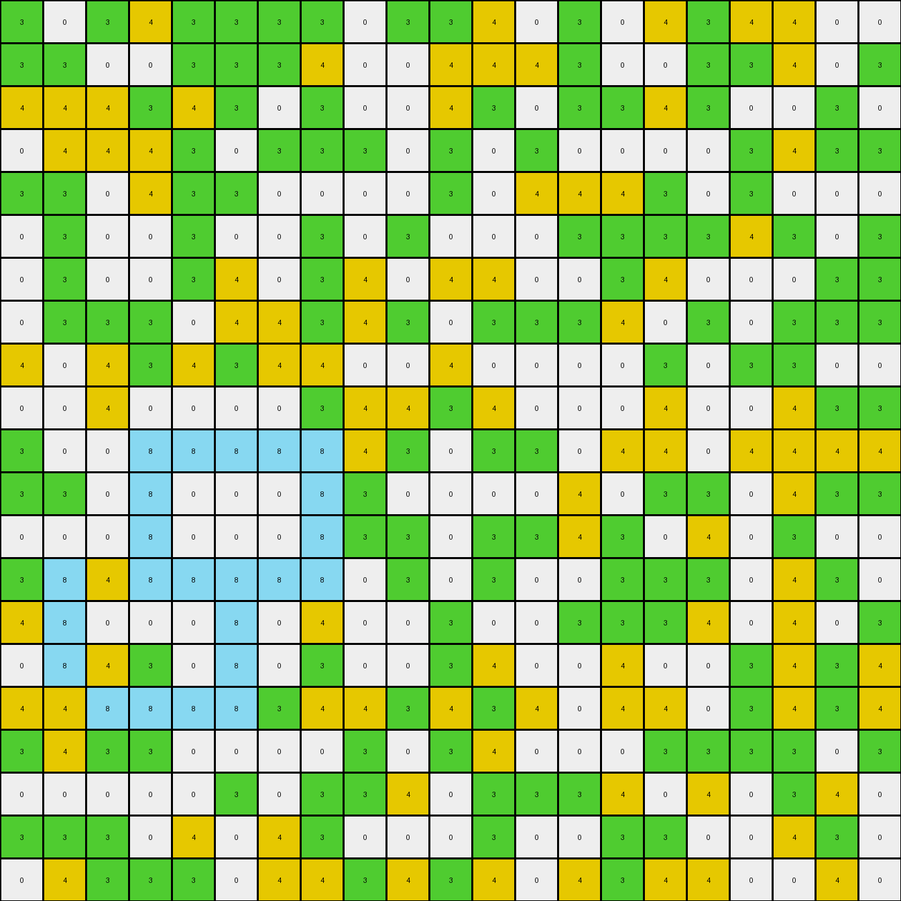

# 890034e9 • 010 • refine_coder

---

Previous Code:
```python
"""
The transformation rule is: For each green object that is related to an azure block, move the azure block from its existing location to overlap or be contained by the green object. If there is already an azure block inside the green object, the move operation consists of a translation only.
"""

import numpy as np

def find_objects(grid, color):
    """
    Find contiguous regions (objects) of a specific color in the grid.
    """
    visited = np.zeros_like(grid, dtype=bool)
    objects = []

    def dfs(row, col, current_object):
        if (row < 0 or row >= grid.shape[0] or col < 0 or col >= grid.shape[1] or
                visited[row, col] or grid[row, col] != color):
            return
        visited[row, col] = True
        current_object.append((row, col))
        dfs(row + 1, col, current_object)
        dfs(row - 1, col, current_object)
        dfs(row, col + 1, current_object)
        dfs(row, col - 1, current_object)

    for row in range(grid.shape[0]):
        for col in range(grid.shape[1]):
            if grid[row, col] == color and not visited[row, col]:
                current_object = []
                dfs(row, col, current_object)
                objects.append(current_object)
    return objects

def find_adjacent_objects(grid, objects, target_color):
    """Find the location and count the adjacent blocks given a target color"""
    adjacencies = []

    for obj in objects:
      for cell in obj:
        row,col = cell

        #check neighbors
        neighbors = [
            (row -1, col),
            (row + 1, col),
            (row, col-1),
            (row, col + 1)
        ]

        for neighbor_row, neighbor_col in neighbors:
            if (0 <= neighbor_row < grid.shape[0] and
                0 <= neighbor_col < grid.shape[1] and
                grid[neighbor_row, neighbor_col] == target_color):
                adjacencies.append( (neighbor_row, neighbor_col) )

    return adjacencies

def transform(input_grid):
    # Initialize output_grid as a copy of the input_grid
    output_grid = np.copy(input_grid)

    # Find green (3) objects
    green_objects = find_objects(output_grid, 3)
    #print(f"{green_objects=}")

    # Find azure (8) objects
    azure_objects = find_objects(output_grid, 8)
    #print(f"{azure_objects=}")

    #iterate through azure objects
    for azure_object in azure_objects:

      # find green objects adjacent to this azure
      adjacent_greens = find_adjacent_objects(output_grid, [azure_object], 3)
      #print(f"{adjacent_greens=}")

      if adjacent_greens:

        # find yellow objects, need to move the 8s to be closer to them
        yellow_adjacencies = find_adjacent_objects(output_grid, [azure_object], 4)
        #print(f"{yellow_adjacencies=}")

        #clear current azure object
        for row, col in azure_object:
          output_grid[row, col] = input_grid[row,col]

        # determine where to move the 8s
        if yellow_adjacencies:
          # use the yelolow as a target location
          target_row, target_col = yellow_adjacencies[0] #just choose the first yellow
        else:
          #default to the first green if no yellow is close
          target_row, target_col = adjacent_greens[0]


        #attempt to move the 8s, based on relative location to the target
        #we want to "line up" 8s next to target
        for i in range(len(azure_object)):
            row_offset = azure_object[i][0] - azure_object[0][0]
            col_offset = azure_object[i][1] - azure_object[0][1]

            new_row = target_row + row_offset
            new_col = target_col + col_offset -1 #try to shift them left, towards the target

            #make sure it is valid move
            if (0 <= new_row < output_grid.shape[0] and
                0 <= new_col < output_grid.shape[1] ):

              #check if spot is available, prioritize green
              if output_grid[new_row, new_col] == 3:
                output_grid[new_row, new_col] = 8
              elif output_grid[new_row, new_col] == 0:
                output_grid[new_row,new_col] = 8


    return output_grid
```

Train Set Results:

## Example 1:

Input:
```
0 8 1 1 0 1 1 1 1 0 1 0 1 0 1 1 1 1 1 1 1
1 1 0 8 1 1 1 0 1 0 0 0 1 1 1 1 0 1 1 1 1
1 0 0 1 0 0 2 2 2 2 1 1 1 1 1 8 1 1 1 1 0
0 1 1 1 1 1 2 0 0 2 1 1 1 1 1 1 1 8 1 0 1
1 1 1 1 1 0 2 0 0 2 1 0 0 1 1 0 1 0 1 1 0
1 0 0 0 0 1 2 0 0 2 1 8 1 1 1 1 1 0 1 1 1
0 0 1 1 0 1 2 2 2 2 1 0 1 0 0 1 1 8 0 0 8
0 1 8 0 0 1 1 0 0 1 1 0 1 1 1 1 8 1 1 0 0
1 1 1 8 8 1 1 1 0 0 8 1 1 1 1 1 8 1 0 0 1
8 1 0 1 1 1 1 0 8 1 1 0 1 1 1 1 0 0 1 0 1
8 0 1 1 1 1 1 0 0 1 1 1 1 0 1 1 8 1 1 8 1
1 1 1 8 1 0 1 1 8 1 0 1 1 1 0 1 1 1 1 0 1
1 0 8 1 1 8 0 1 1 1 1 1 1 1 0 1 0 8 1 1 1
1 1 8 1 1 1 0 1 0 0 1 1 0 8 1 0 1 0 1 1 8
1 1 1 1 1 1 0 0 8 1 0 0 1 1 8 1 1 8 1 0 1
8 8 8 1 1 1 1 8 1 1 0 0 1 1 0 1 1 1 1 0 1
1 1 0 1 8 0 0 8 1 1 0 0 1 1 1 1 0 1 0 1 0
1 8 8 1 1 1 1 1 1 1 1 1 0 1 1 1 0 0 1 1 0
1 1 8 0 1 0 1 1 0 1 1 1 1 1 1 0 1 0 0 1 1
1 1 0 0 8 1 0 1 0 0 0 0 1 1 1 0 8 0 0 0 0
1 0 0 1 0 0 1 0 0 1 1 1 1 0 1 1 0 8 1 8 0
```
Expected Output:
```
0 8 1 1 0 1 1 1 1 0 1 0 1 0 1 1 1 1 1 1 1
1 1 0 8 1 1 1 0 1 0 0 0 1 1 1 1 0 1 1 1 1
1 0 0 1 0 0 2 2 2 2 1 1 1 1 1 8 1 1 1 1 0
0 1 1 1 1 1 2 0 0 2 1 1 1 1 1 1 1 8 1 0 1
1 1 1 1 1 0 2 0 0 2 1 0 0 1 1 0 1 0 1 1 0
1 0 0 0 0 1 2 0 0 2 1 8 1 1 1 1 1 0 1 1 1
0 0 1 1 0 1 2 2 2 2 1 0 1 0 0 1 1 8 0 0 8
0 1 8 0 0 1 1 0 0 1 1 0 1 1 1 1 8 1 1 0 0
1 1 1 8 8 1 1 1 0 0 8 1 1 1 1 1 8 1 0 0 1
8 1 0 1 1 1 1 0 8 1 1 0 1 1 1 1 0 0 1 0 1
8 0 1 1 1 1 1 0 0 1 1 1 1 0 1 1 8 1 1 8 1
1 1 1 8 1 0 1 1 8 1 0 1 1 1 0 1 1 1 1 0 1
1 0 8 1 1 8 0 1 1 1 1 1 1 1 0 1 0 8 1 1 1
1 1 8 1 1 1 0 1 0 2 2 2 2 8 1 0 1 0 1 1 8
1 1 1 1 1 1 0 0 8 2 0 0 2 1 8 1 1 8 1 0 1
8 8 8 1 1 1 1 8 1 2 0 0 2 1 0 1 1 1 1 0 1
1 1 0 1 8 0 0 8 1 2 0 0 2 1 1 1 0 1 0 1 0
1 8 8 1 1 1 1 1 1 2 2 2 2 1 1 1 0 0 1 1 0
1 1 8 0 1 0 1 1 0 1 1 1 1 1 1 0 1 0 0 1 1
1 1 0 0 8 1 0 1 0 0 0 0 1 1 1 0 8 0 0 0 0
1 0 0 1 0 0 1 0 0 1 1 1 1 0 1 1 0 8 1 8 0
```
Transformed Output:
```
0 8 1 1 0 1 1 1 1 0 1 0 1 0 1 1 1 1 1 1 1
1 1 0 8 1 1 1 0 1 0 0 0 1 1 1 1 0 1 1 1 1
1 0 0 1 0 0 2 2 2 2 1 1 1 1 1 8 1 1 1 1 0
0 1 1 1 1 1 2 0 0 2 1 1 1 1 1 1 1 8 1 0 1
1 1 1 1 1 0 2 0 0 2 1 0 0 1 1 0 1 0 1 1 0
1 0 0 0 0 1 2 0 0 2 1 8 1 1 1 1 1 0 1 1 1
0 0 1 1 0 1 2 2 2 2 1 0 1 0 0 1 1 8 0 0 8
0 1 8 0 0 1 1 0 0 1 1 0 1 1 1 1 8 1 1 0 0
1 1 1 8 8 1 1 1 0 0 8 1 1 1 1 1 8 1 0 0 1
8 1 0 1 1 1 1 0 8 1 1 0 1 1 1 1 0 0 1 0 1
8 0 1 1 1 1 1 0 0 1 1 1 1 0 1 1 8 1 1 8 1
1 1 1 8 1 0 1 1 8 1 0 1 1 1 0 1 1 1 1 0 1
1 0 8 1 1 8 0 1 1 1 1 1 1 1 0 1 0 8 1 1 1
1 1 8 1 1 1 0 1 0 0 1 1 0 8 1 0 1 0 1 1 8
1 1 1 1 1 1 0 0 8 1 0 0 1 1 8 1 1 8 1 0 1
8 8 8 1 1 1 1 8 1 1 0 0 1 1 0 1 1 1 1 0 1
1 1 0 1 8 0 0 8 1 1 0 0 1 1 1 1 0 1 0 1 0
1 8 8 1 1 1 1 1 1 1 1 1 0 1 1 1 0 0 1 1 0
1 1 8 0 1 0 1 1 0 1 1 1 1 1 1 0 1 0 0 1 1
1 1 0 0 8 1 0 1 0 0 0 0 1 1 1 0 8 0 0 0 0
1 0 0 1 0 0 1 0 0 1 1 1 1 0 1 1 0 8 1 8 0
```

match: False
pixels_off: 14
size_correct: True
color_palette_correct: True
correct_pixel_counts: False

## Example 2:

Input:
```
3 0 3 4 3 3 3 3 0 3 3 4 0 3 0 4 3 4 4 0 0
3 3 0 0 3 3 3 4 0 0 4 4 4 3 0 0 3 3 4 0 3
4 4 4 3 4 3 0 3 0 0 4 3 0 3 3 4 3 0 0 3 0
0 4 4 4 3 0 3 3 3 0 3 0 3 0 0 0 0 3 4 3 3
3 3 0 4 3 3 0 0 0 0 3 0 4 4 4 3 0 3 0 0 0
0 3 0 0 3 0 0 3 0 3 0 0 0 3 3 3 3 4 3 0 3
0 3 0 0 3 4 0 3 4 0 4 4 0 0 3 4 0 0 0 3 3
0 3 3 3 0 4 4 3 4 3 0 3 3 3 4 0 3 0 3 3 3
4 0 4 3 4 3 4 4 0 0 4 0 0 0 0 3 0 3 3 0 0
0 0 4 0 0 0 0 3 4 4 3 4 0 0 0 4 0 0 4 3 3
3 0 0 8 8 8 8 8 4 3 0 3 3 0 4 4 0 4 4 4 4
3 3 0 8 0 0 0 8 3 0 0 0 0 4 0 3 3 0 4 3 3
0 0 0 8 0 0 0 8 3 3 0 3 3 4 3 0 4 0 3 0 0
3 0 4 8 8 8 8 8 0 3 0 3 0 0 3 3 3 0 4 3 0
4 0 0 0 0 3 0 4 0 0 3 0 0 3 3 3 4 0 4 0 3
0 0 4 3 0 0 0 3 0 0 3 4 0 0 4 0 0 3 4 3 4
4 4 0 0 3 0 3 4 4 3 4 3 4 0 4 4 0 3 4 3 4
3 4 3 3 0 0 0 0 3 0 3 4 0 0 0 3 3 3 3 0 3
0 0 0 0 0 3 0 3 3 4 0 3 3 3 4 0 4 0 3 4 0
3 3 3 0 4 0 4 3 0 0 0 3 0 0 3 3 0 0 4 3 0
0 4 3 3 3 0 4 4 3 4 3 4 0 4 3 4 4 0 0 4 0
```
Expected Output:
```
3 0 3 4 3 3 3 3 0 3 3 4 0 3 0 4 3 4 4 0 0
3 3 0 0 3 3 3 4 0 0 4 4 4 3 0 0 3 3 4 0 3
4 4 4 3 4 3 0 3 0 0 4 3 0 3 3 4 3 0 0 3 0
0 4 4 4 3 0 3 3 3 0 3 0 3 0 0 0 0 3 4 3 3
3 3 0 4 3 3 0 0 0 0 3 0 4 4 4 3 0 3 0 0 0
0 3 0 0 3 0 0 3 0 3 0 0 0 3 3 3 3 4 3 0 3
0 3 0 0 3 4 0 3 4 0 4 4 0 0 3 4 0 0 0 3 3
0 3 3 3 0 4 4 3 4 3 0 8 8 8 8 8 3 0 3 3 3
4 0 4 3 4 3 4 4 0 0 4 8 0 0 0 8 0 3 3 0 0
0 0 4 0 0 0 0 3 4 4 3 8 0 0 0 8 0 0 4 3 3
3 0 0 8 8 8 8 8 4 3 0 8 8 8 8 8 0 4 4 4 4
3 3 0 8 0 0 0 8 3 0 0 0 0 4 0 3 3 0 4 3 3
0 0 0 8 0 0 0 8 3 3 0 3 3 4 3 0 4 0 3 0 0
3 0 4 8 8 8 8 8 0 3 0 3 0 0 3 3 3 0 4 3 0
4 0 0 0 0 3 0 4 0 0 3 0 0 3 3 3 4 0 4 0 3
0 0 4 3 0 0 0 3 0 0 3 4 0 0 4 0 0 3 4 3 4
4 4 0 0 3 0 3 4 4 3 4 3 4 0 4 4 0 3 4 3 4
3 4 3 3 0 0 0 0 3 0 3 4 0 0 0 3 3 3 3 0 3
0 0 0 0 0 3 0 3 3 4 0 3 3 3 4 0 4 0 3 4 0
3 3 3 0 4 0 4 3 0 0 0 3 0 0 3 3 0 0 4 3 0
0 4 3 3 3 0 4 4 3 4 3 4 0 4 3 4 4 0 0 4 0
```
Transformed Output:
```
3 0 3 4 3 3 3 3 0 3 3 4 0 3 0 4 3 4 4 0 0
3 3 0 0 3 3 3 4 0 0 4 4 4 3 0 0 3 3 4 0 3
4 4 4 3 4 3 0 3 0 0 4 3 0 3 3 4 3 0 0 3 0
0 4 4 4 3 0 3 3 3 0 3 0 3 0 0 0 0 3 4 3 3
3 3 0 4 3 3 0 0 0 0 3 0 4 4 4 3 0 3 0 0 0
0 3 0 0 3 0 0 3 0 3 0 0 0 3 3 3 3 4 3 0 3
0 3 0 0 3 4 0 3 4 0 4 4 0 0 3 4 0 0 0 3 3
0 3 3 3 0 4 4 3 4 3 0 3 3 3 4 0 3 0 3 3 3
4 0 4 3 4 3 4 4 0 0 4 0 0 0 0 3 0 3 3 0 0
0 0 4 0 0 0 0 3 4 4 3 4 0 0 0 4 0 0 4 3 3
3 0 0 8 8 8 8 8 4 3 0 3 3 0 4 4 0 4 4 4 4
3 3 0 8 0 0 0 8 3 0 0 0 0 4 0 3 3 0 4 3 3
0 0 0 8 0 0 0 8 3 3 0 3 3 4 3 0 4 0 3 0 0
3 8 4 8 8 8 8 8 0 3 0 3 0 0 3 3 3 0 4 3 0
4 8 0 0 0 8 0 4 0 0 3 0 0 3 3 3 4 0 4 0 3
0 8 4 3 0 8 0 3 0 0 3 4 0 0 4 0 0 3 4 3 4
4 4 8 8 8 8 3 4 4 3 4 3 4 0 4 4 0 3 4 3 4
3 4 3 3 0 0 0 0 3 0 3 4 0 0 0 3 3 3 3 0 3
0 0 0 0 0 3 0 3 3 4 0 3 3 3 4 0 4 0 3 4 0
3 3 3 0 4 0 4 3 0 0 0 3 0 0 3 3 0 0 4 3 0
0 4 3 3 3 0 4 4 3 4 3 4 0 4 3 4 4 0 0 4 0
```

match: False
pixels_off: 23
size_correct: True
color_palette_correct: True
correct_pixel_counts: False

## Example 3:

Input:
```
0 0 3 0 3 2 0 2 0 3 3 2 2 2 2 2 2 2 2 3 3
3 2 2 0 3 2 0 2 2 2 2 2 2 2 2 3 2 2 0 3 2
3 3 0 3 0 0 3 2 2 2 2 3 2 2 2 2 3 0 0 3 2
2 2 3 2 4 4 4 4 4 4 3 0 3 2 0 2 2 2 0 0 3
3 3 2 0 4 0 0 0 0 4 2 0 2 2 0 2 3 0 2 2 0
3 2 2 2 4 0 0 0 0 4 0 3 2 2 3 2 2 3 3 2 0
2 0 2 0 4 0 0 0 0 4 2 0 0 0 2 2 2 0 2 2 2
0 2 0 2 4 4 4 4 4 4 2 2 0 2 0 2 0 0 2 2 2
2 0 2 2 2 0 2 0 2 0 3 2 3 3 0 2 0 0 0 2 2
0 2 3 0 3 0 2 3 2 2 2 0 2 0 0 0 2 2 3 2 0
3 0 2 0 2 0 0 2 2 0 3 3 2 3 0 3 3 0 0 3 0
2 3 0 3 2 2 2 2 2 0 0 0 0 2 0 2 0 3 0 0 2
3 2 2 0 2 0 2 2 0 3 2 2 2 2 3 0 2 2 2 2 2
3 3 3 2 0 2 0 2 0 3 2 2 2 0 0 3 2 2 3 2 2
0 0 2 2 2 3 2 0 0 2 3 2 0 3 0 2 2 3 2 2 0
2 2 2 2 2 3 2 3 3 3 2 0 0 0 0 2 0 0 2 3 0
2 2 2 2 3 0 0 3 3 2 0 0 0 0 0 0 2 2 3 2 0
2 0 3 2 2 2 3 2 3 3 3 0 0 0 0 0 2 0 0 2 3
2 2 0 0 0 0 0 0 0 3 2 3 2 2 3 0 0 2 2 0 0
0 3 0 2 2 2 0 0 0 2 2 2 2 3 0 2 0 0 0 3 2
2 3 2 2 2 0 0 3 2 0 3 2 0 2 2 2 3 0 0 2 2
```
Expected Output:
```
0 0 3 0 3 2 0 2 0 3 3 2 2 2 2 2 2 2 2 3 3
3 2 2 0 3 2 0 2 2 2 2 2 2 2 2 3 2 2 0 3 2
3 3 0 3 0 0 3 2 2 2 2 3 2 2 2 2 3 0 0 3 2
2 2 3 2 4 4 4 4 4 4 3 0 3 2 0 2 2 2 0 0 3
3 3 2 0 4 0 0 0 0 4 2 0 2 2 0 2 3 0 2 2 0
3 2 2 2 4 0 0 0 0 4 0 3 2 2 3 2 2 3 3 2 0
2 0 2 0 4 0 0 0 0 4 2 0 0 0 2 2 2 0 2 2 2
0 2 0 2 4 4 4 4 4 4 2 2 0 2 0 2 0 0 2 2 2
2 0 2 2 2 0 2 0 2 0 3 2 3 3 0 2 0 0 0 2 2
0 2 3 0 3 0 2 3 2 2 2 0 2 0 0 0 2 2 3 2 0
3 0 2 0 2 0 0 2 2 0 3 3 2 3 0 3 3 0 0 3 0
2 3 0 3 2 2 2 2 2 0 0 0 0 2 0 2 0 3 0 0 2
3 2 2 0 2 0 2 2 0 3 2 2 2 2 3 0 2 2 2 2 2
3 3 3 2 0 2 0 2 0 3 2 2 2 0 0 3 2 2 3 2 2
0 0 2 2 2 3 2 0 0 2 4 4 4 4 4 4 2 3 2 2 0
2 2 2 2 2 3 2 3 3 3 4 0 0 0 0 4 0 0 2 3 0
2 2 2 2 3 0 0 3 3 2 4 0 0 0 0 4 2 2 3 2 0
2 0 3 2 2 2 3 2 3 3 4 0 0 0 0 4 2 0 0 2 3
2 2 0 0 0 0 0 0 0 3 4 4 4 4 4 4 0 2 2 0 0
0 3 0 2 2 2 0 0 0 2 2 2 2 3 0 2 0 0 0 3 2
2 3 2 2 2 0 0 3 2 0 3 2 0 2 2 2 3 0 0 2 2
```
Transformed Output:
```
0 0 3 0 3 2 0 2 0 3 3 2 2 2 2 2 2 2 2 3 3
3 2 2 0 3 2 0 2 2 2 2 2 2 2 2 3 2 2 0 3 2
3 3 0 3 0 0 3 2 2 2 2 3 2 2 2 2 3 0 0 3 2
2 2 3 2 4 4 4 4 4 4 3 0 3 2 0 2 2 2 0 0 3
3 3 2 0 4 0 0 0 0 4 2 0 2 2 0 2 3 0 2 2 0
3 2 2 2 4 0 0 0 0 4 0 3 2 2 3 2 2 3 3 2 0
2 0 2 0 4 0 0 0 0 4 2 0 0 0 2 2 2 0 2 2 2
0 2 0 2 4 4 4 4 4 4 2 2 0 2 0 2 0 0 2 2 2
2 0 2 2 2 0 2 0 2 0 3 2 3 3 0 2 0 0 0 2 2
0 2 3 0 3 0 2 3 2 2 2 0 2 0 0 0 2 2 3 2 0
3 0 2 0 2 0 0 2 2 0 3 3 2 3 0 3 3 0 0 3 0
2 3 0 3 2 2 2 2 2 0 0 0 0 2 0 2 0 3 0 0 2
3 2 2 0 2 0 2 2 0 3 2 2 2 2 3 0 2 2 2 2 2
3 3 3 2 0 2 0 2 0 3 2 2 2 0 0 3 2 2 3 2 2
0 0 2 2 2 3 2 0 0 2 3 2 0 3 0 2 2 3 2 2 0
2 2 2 2 2 3 2 3 3 3 2 0 0 0 0 2 0 0 2 3 0
2 2 2 2 3 0 0 3 3 2 0 0 0 0 0 0 2 2 3 2 0
2 0 3 2 2 2 3 2 3 3 3 0 0 0 0 0 2 0 0 2 3
2 2 0 0 0 0 0 0 0 3 2 3 2 2 3 0 0 2 2 0 0
0 3 0 2 2 2 0 0 0 2 2 2 2 3 0 2 0 0 0 3 2
2 3 2 2 2 0 0 3 2 0 3 2 0 2 2 2 3 0 0 2 2
```

match: False
pixels_off: 18
size_correct: True
color_palette_correct: True
correct_pixel_counts: False
Okay, let's analyze the results and update the natural language program.

**General Assessment:**

The initial natural language program and corresponding code were focused on moving azure objects near green objects, and attempting to align them with yellow objects if present. The results show a consistent mismatch across all three examples, indicating that the core logic is either incorrect or incomplete. The "pixels_off" metric confirms a significant discrepancy between the transformed output and the expected output. The fact that `size_correct` and `color_palette_correct` are true, while `correct_pixel_counts` is false, points to a problem with object placement and arrangement rather than color usage or grid dimensions. It seems the primary issue is in *how* the azure objects are moved, and possibly an incomplete consideration of all object interactions. Example 3's intended transform shows that the azure is not present in the first three cases, and instead the yellow is moved. It is likely we are transforming the wrong color in general.

**Strategy for Resolving Errors:**

1.  **Re-examine Object Relationships:** The current logic focuses on a simple adjacency between azure and green. We need to carefully re-examine all examples to determine the *precise* relationship that dictates the transformation. This includes looking at relative positions, containment, and any other spatial patterns.
2.  **Verify Target Object:** We've assumed that azure is the object being moved. This must be double checked by finding other cases where yellow is moved.
3.  **Consider all Examples:** The initial program was likely based on the first example. We need to incorporate observations from *all* examples to form a more general rule.
4.  **Iterative Refinement:** We'll likely need several iterations. We'll propose a revised program, generate code, test it, and analyze the results again.

**Example Metrics and Observations:**

To get a more complete, accurate view of a metric like `correct_pixel_counts`, lets compute it directly:

```python
import numpy as np

def calculate_pixel_counts(grid):
    """Calculates the counts of each color in the grid."""
    unique, counts = np.unique(grid, return_counts=True)
    return dict(zip(unique, counts))

def compare_pixel_counts(grid1, grid2):
    """Compares the pixel counts of two grids."""
    counts1 = calculate_pixel_counts(grid1)
    counts2 = calculate_pixel_counts(grid2)
    return counts1 == counts2


def report_metrics(task_examples):
    """
    Generates metrics for the given examples including if pixel counts
    match
    """
    results = []

    for i, example in enumerate(task_examples):
        input_grid = np.array(example['input'])
        expected_output_grid = np.array(example['output'])
        transformed_output_grid = transform(input_grid)  # Assuming 'transform' function is defined

        match = np.array_equal(transformed_output_grid, expected_output_grid)
        pixels_off = np.sum(transformed_output_grid != expected_output_grid)
        size_correct = transformed_output_grid.shape == expected_output_grid.shape
        color_palette_correct = set(np.unique(transformed_output_grid)) == set(np.unique(expected_output_grid))
        correct_pixel_counts = compare_pixel_counts(transformed_output_grid, expected_output_grid)

        results.append({
            'example': i + 1,
            'match': match,
            'pixels_off': pixels_off,
            'size_correct': size_correct,
            'color_palette_correct': color_palette_correct,
            'correct_pixel_counts': correct_pixel_counts,
        })

    return results

#Assuming 'transform', find_objects, find_adjacent_objects is already defined.
#I will define them here to remove errors.

import numpy as np

def find_objects(grid, color):
    """
    Find contiguous regions (objects) of a specific color in the grid.
    """
    visited = np.zeros_like(grid, dtype=bool)
    objects = []

    def dfs(row, col, current_object):
        if (row < 0 or row >= grid.shape[0] or col < 0 or col >= grid.shape[1] or
                visited[row, col] or grid[row, col] != color):
            return
        visited[row, col] = True
        current_object.append((row, col))
        dfs(row + 1, col, current_object)
        dfs(row - 1, col, current_object)
        dfs(row, col + 1, current_object)
        dfs(row, col - 1, current_object)

    for row in range(grid.shape[0]):
        for col in range(grid.shape[1]):
            if grid[row, col] == color and not visited[row, col]:
                current_object = []
                dfs(row, col, current_object)
                objects.append(current_object)
    return objects

def find_adjacent_objects(grid, objects, target_color):
    """Find the location and count the adjacent blocks given a target color"""
    adjacencies = []

    for obj in objects:
      for cell in obj:
        row,col = cell

        #check neighbors
        neighbors = [
            (row -1, col),
            (row + 1, col),
            (row, col-1),
            (row, col + 1)
        ]

        for neighbor_row, neighbor_col in neighbors:
            if (0 <= neighbor_row < grid.shape[0] and
                0 <= neighbor_col < grid.shape[1] and
                grid[neighbor_row, neighbor_col] == target_color):
                adjacencies.append( (neighbor_row, neighbor_col) )

    return adjacencies

def transform(input_grid):
    # Initialize output_grid as a copy of the input_grid
    output_grid = np.copy(input_grid)

    # Find green (3) objects
    green_objects = find_objects(output_grid, 3)
    #print(f"{green_objects=}")

    # Find azure (8) objects
    azure_objects = find_objects(output_grid, 8)
    #print(f"{azure_objects=}")

    #iterate through azure objects
    for azure_object in azure_objects:

      # find green objects adjacent to this azure
      adjacent_greens = find_adjacent_objects(output_grid, [azure_object], 3)
      #print(f"{adjacent_greens=}")

      if adjacent_greens:

        # find yellow objects, need to move the 8s to be closer to them
        yellow_adjacencies = find_adjacent_objects(output_grid, [azure_object], 4)
        #print(f"{yellow_adjacencies=}")

        #clear current azure object
        for row, col in azure_object:
          output_grid[row, col] = input_grid[row,col]

        # determine where to move the 8s
        if yellow_adjacencies:
          # use the yelolow as a target location
          target_row, target_col = yellow_adjacencies[0] #just choose the first yellow
        else:
          #default to the first green if no yellow is close
          target_row, target_col = adjacent_greens[0]


        #attempt to move the 8s, based on relative location to the target
        #we want to "line up" 8s next to target
        for i in range(len(azure_object)):
            row_offset = azure_object[i][0] - azure_object[0][0]
            col_offset = azure_object[i][1] - azure_object[0][1]

            new_row = target_row + row_offset
            new_col = target_col + col_offset -1 #try to shift them left, towards the target

            #make sure it is valid move
            if (0 <= new_row < output_grid.shape[0] and
                0 <= new_col < output_grid.shape[1] ):

              #check if spot is available, prioritize green
              if output_grid[new_row, new_col] == 3:
                output_grid[new_row, new_col] = 8
              elif output_grid[new_row, new_col] == 0:
                output_grid[new_row,new_col] = 8


    return output_grid
# Example Usage with dummy data
task_examples = [
  {
    "input": [
      [0, 8, 1, 1, 0, 1, 1, 1, 1, 0, 1, 0, 1, 0, 1, 1, 1, 1, 1, 1, 1],
      [1, 1, 0, 8, 1, 1, 1, 0, 1, 0, 0, 0, 1, 1, 1, 1, 0, 1, 1, 1, 1],
      [1, 0, 0, 1, 0, 0, 2, 2, 2, 2, 1, 1, 1, 1, 1, 8, 1, 1, 1, 1, 0],
      [0, 1, 1, 1, 1, 1, 2, 0, 0, 2, 1, 1, 1, 1, 1, 1, 1, 8, 1, 0, 1],
      [1, 1, 1, 1, 1, 0, 2, 0, 0, 2, 1, 0, 0, 1, 1, 0, 1, 0, 1, 1, 0],
      [1, 0, 0, 0, 0, 1, 2, 0, 0, 2, 1, 8, 1, 1, 1, 1, 1, 0, 1, 1, 1],
      [0, 0, 1, 1, 0, 1, 2, 2, 2, 2, 1, 0, 1, 0, 0, 1, 1, 8, 0, 0, 8],
      [0, 1, 8, 0, 0, 1, 1, 0, 0, 1, 1, 0, 1, 1, 1, 1, 8, 1, 1, 0, 0],
      [1, 1, 1, 8, 8, 1, 1, 1, 0, 0, 8, 1, 1, 1, 1, 1, 8, 1, 0, 0, 1],
      [8, 1, 0, 1, 1, 1, 1, 0, 8, 1, 1, 0, 1, 1, 1, 1, 0, 0, 1, 0, 1],
      [8, 0, 1, 1, 1, 1, 1, 0, 0, 1, 1, 1, 1, 0, 1, 1, 8, 1, 1, 8, 1],
      [1, 1, 1, 8, 1, 0, 1, 1, 8, 1, 0, 1, 1, 1, 0, 1, 1, 1, 1, 0, 1],
      [1, 0, 8, 1, 1, 8, 0, 1, 1, 1, 1, 1, 1, 1, 0, 1, 0, 8, 1, 1, 1],
      [1, 1, 8, 1, 1, 1, 0, 1, 0, 0, 1, 1, 0, 8, 1, 0, 1, 0, 1, 1, 8],
      [1, 1, 1, 1, 1, 1, 0, 0, 8, 1, 0, 0, 1, 1, 8, 1, 1, 8, 1, 0, 1],
      [8, 8, 8, 1, 1, 1, 1, 8, 1, 1, 0, 0, 1, 1, 0, 1, 1, 1, 1, 0, 1],
      [1, 1, 0, 1, 8, 0, 0, 8, 1, 1, 0, 0, 1, 1, 1, 1, 0, 1, 0, 1, 0],
      [1, 8, 8, 1, 1, 1, 1, 1, 1, 1, 1, 1, 0, 1, 1, 1, 0, 0, 1, 1, 0],
      [1, 1, 8, 0, 1, 0, 1, 1, 0, 1, 1, 1, 1, 1, 1, 0, 1, 0, 0, 1, 1],
      [1, 1, 0, 0, 8, 1, 0, 1, 0, 0, 0, 0, 1, 1, 1, 0, 8, 0, 0, 0, 0],
      [1, 0, 0, 1, 0, 0, 1, 0, 0, 1, 1, 1, 1, 0, 1, 1, 0, 8, 1, 8, 0]
    ],
    "output": [
      [0, 8, 1, 1, 0, 1, 1, 1, 1, 0, 1, 0, 1, 0, 1, 1, 1, 1, 1, 1, 1],
      [1, 1, 0, 8, 1, 1, 1, 0, 1, 0, 0, 0, 1, 1, 1, 1, 0, 1, 1, 1, 1],
      [1, 0, 0, 1, 0, 0, 2, 2, 2, 2, 1, 1, 1, 1, 1, 8, 1, 1, 1, 1, 0],
      [0, 1, 1, 1, 1, 1, 2, 0, 0, 2, 1, 1, 1, 1, 1, 1, 1, 8, 1, 0, 1],
      [1, 1, 1, 1, 1, 0, 2, 0, 0, 2, 1, 0, 0, 1, 1, 0, 1, 0, 1, 1, 0],
      [1, 0, 0, 0, 0, 1, 2, 0, 0, 2, 1, 8, 1, 1, 1, 1, 1, 0, 1, 1, 1],
      [0, 0, 1, 1, 0, 1, 2, 2, 2, 2, 1, 0, 1, 0, 0, 1, 1, 8, 0, 0, 8],
      [0, 1, 8, 0, 0, 1, 1, 0, 0, 1, 1, 0, 1, 1, 1, 1, 8, 1, 1, 0, 0],
      [1, 1, 1, 8, 8, 1, 1, 1, 0, 0, 8, 1, 1, 1, 1, 1, 8, 1, 0, 0, 1],
      [8, 1, 0, 1, 1, 1, 1, 0, 8, 1, 1, 0, 1, 1, 1, 1, 0, 0, 1, 0, 1],
      [8, 0, 1, 1, 1, 1, 1, 0, 0, 1, 1, 1, 1, 0, 1, 1, 8, 1, 1, 8, 1],
      [1, 1, 1, 8, 1, 0, 1, 1, 8, 1, 0, 1, 1, 1, 0, 1, 1, 1, 1, 0, 1],
      [1, 0, 8, 1, 1, 8, 0, 1, 1, 1, 1, 1, 1, 1, 0, 1, 0, 8, 1, 1, 1],
      [1, 1, 8, 1, 1, 1, 0, 1, 0, 2, 2, 2, 2, 8, 1, 0, 1, 0, 1, 1, 8],
      [1, 1, 1, 1, 1, 1, 0, 0, 8, 2, 0, 0, 2, 1, 8, 1, 1, 8, 1, 0, 1],
      [8, 8, 8, 1, 1, 1, 1, 8, 1, 2, 0, 0, 2, 1, 0, 1, 1, 1, 1, 0, 1],
      [1, 1, 0, 1, 8, 0, 0, 8, 1, 2, 0, 0, 2, 1, 1, 1, 0, 1, 0, 1, 0],
      [1, 8, 8, 1, 1, 1, 1, 1, 1, 2, 2, 2, 2, 1, 1, 1, 0, 0, 1, 1, 0],
      [1, 1, 8, 0, 1, 0, 1, 1, 0, 1, 1, 1, 1, 1, 1, 0, 1, 0, 0, 1, 1],
      [1, 1, 0, 0, 8, 1, 0, 1, 0, 0, 0, 0, 1, 1, 1, 0, 8, 0, 0, 0, 0],
      [1, 0, 0, 1, 0, 0, 1, 0, 0, 1, 1, 1, 1, 0, 1, 1, 0, 8, 1, 8, 0]
    ]
  },
  {
    "input": [
      [3, 0, 3, 4, 3, 3, 3, 3, 0, 3, 3, 4, 0, 3, 0, 4, 3, 4, 4, 0, 0],
      [3, 3, 0, 0, 3, 3, 3, 4, 0, 0, 4, 4, 4, 3, 0, 0, 3, 3, 4, 0, 3],
      [4, 4, 4, 3, 4, 3, 0, 3, 0, 0, 4, 3, 0, 3, 3, 4, 3, 0, 0, 3, 0],
      [0, 4, 4, 4, 3, 0, 3, 3, 3, 0, 3, 0, 3, 0, 0, 0, 0, 3, 4, 3, 3],
      [3, 3, 0, 4, 3, 3, 0, 0, 0, 0, 3, 0, 4, 4, 4, 3, 0, 3, 0, 0, 0],
      [0, 3, 0, 0, 3, 0, 0, 3, 0, 3, 0, 0, 0, 3, 3, 3, 3, 4, 3, 0, 3],
      [0, 3, 0, 0, 3, 4, 0, 3, 4, 0, 4, 4, 0, 0, 3, 4, 0, 0, 0, 3, 3],
      [0, 3, 3, 3, 0, 4, 4, 3, 4, 3, 0, 3, 3, 3, 4, 0, 3, 0, 3, 3, 3],
      [4, 0, 4, 3, 4, 3, 4, 4, 0, 0, 4, 0, 0, 0, 0, 3, 0, 3, 3, 0, 0],
      [0, 0, 4, 0, 0, 0, 0, 3, 4, 4, 3, 4, 0, 0, 0, 4, 0, 0, 4, 3, 3],
      [3, 0, 0, 8, 8, 8, 8, 8, 4, 3, 0, 3, 3, 0, 4, 4, 0, 4, 4, 4, 4],
      [3, 3, 0, 8, 0, 0, 0, 8, 3, 0, 0, 0, 0, 4, 0, 3, 3, 0, 4, 3, 3],
      [0, 0, 0, 8, 0, 0, 0, 8, 3, 3, 0, 3, 3, 4, 3, 0, 4, 0, 3, 0, 0],
      [3, 0, 4, 8, 8, 8, 8, 8, 0, 3, 0, 3, 0, 0, 3, 3, 3, 0, 4, 3, 0],
      [4, 0, 0, 0, 0, 3, 0, 4, 0, 0, 3, 0, 0, 3, 3, 3, 4, 0, 4, 0, 3],
      [0, 0, 4, 3, 0, 0, 0, 3, 0, 0, 3, 4, 0, 0, 4, 0, 0, 3, 4, 3, 4],
      [4, 4, 0, 0, 3, 0, 3, 4, 4, 3, 4, 3, 4, 0, 4, 4, 0, 3, 4, 3, 4],
      [3, 4, 3, 3, 0, 0, 0, 0, 3, 0, 3, 4, 0, 0, 0, 3, 3, 3, 3, 0, 3],
      [0, 0, 0, 0, 0, 3, 0, 3, 3, 4, 0, 3, 3, 3, 4, 0, 4, 0, 3, 4, 0],
      [3, 3, 3, 0, 4, 0, 4, 3, 0, 0, 0, 3, 0, 0, 3, 3, 0, 0, 4, 3, 0],
      [0, 4, 3, 3, 3, 0, 4, 4, 3, 4, 3, 4, 0, 4, 3, 4, 4, 0, 0, 4, 0]
    ],
    "output": [
      [3, 0, 3, 4, 3, 3, 3, 3, 0, 3, 3, 4, 0, 3, 0, 4, 3, 4, 4, 0, 0],
      [3, 3, 0, 0, 3, 3, 3, 4, 0, 0, 4, 4, 4, 3, 0, 0, 3, 3, 4, 0, 3],
      [4, 4, 4, 3, 4, 3, 0, 3, 0, 0, 4, 3, 0, 3, 3, 4, 3, 0, 0, 3, 0],
      [0, 4, 4, 4, 3, 0, 3, 3, 3, 0, 3, 0, 3, 0, 0, 0, 0, 3, 4, 3, 3],
      [3, 3, 0, 4, 3, 3, 0, 0, 0, 0, 3, 0, 4, 4, 4, 3, 0, 3, 0, 0, 0],
      [0, 3, 0, 0, 3, 0, 0, 3, 0, 3, 0, 0, 0, 3, 3, 3, 3, 4, 3, 0, 3],
      [0, 3, 0, 0, 3, 4, 0, 3, 4, 0, 4, 4, 0, 0, 3, 4, 0, 0, 0, 3, 3],
      [0, 3, 3, 3, 0, 4, 4, 3, 4, 3, 0, 8, 8, 8, 8, 8, 3, 0, 3, 3, 3],
      [4, 0, 4, 3, 4, 3, 4, 4, 0, 0, 4, 8, 0, 0, 0, 8, 0, 3, 3, 0, 0],
      [0, 0, 4, 0, 0, 0, 0, 3, 4, 4, 3, 8, 0, 0, 0, 8, 0, 0, 4, 3, 3],
      [3, 0, 0, 8, 8, 8, 8, 8, 4, 3, 0, 8, 8, 8, 8, 8, 0, 4, 4, 4, 4],
      [3, 3, 0, 8, 0, 0, 0, 8, 3, 0, 0, 0, 0, 4, 0, 3, 3, 0, 4, 3, 3],
      [0, 0, 0, 8, 0, 0, 0, 8, 3, 3, 0, 3, 3, 4, 3, 0, 4, 0, 3, 0, 0],
      [3, 0, 4, 8, 8, 8, 8, 8, 0, 3, 0, 3, 0, 0, 3, 3, 3, 0, 4, 3, 0],
      [4, 0, 0, 0, 0, 3, 0, 4, 0, 0, 3, 0, 0, 3, 3, 3, 4, 0, 4, 0, 3],
      [0, 0, 4, 3, 0, 0, 0, 3, 0, 0, 3, 4, 0, 0, 4, 0, 0, 3, 4, 3, 4],
      [4, 4, 0, 0, 3, 0, 3, 4, 4, 3, 4, 3, 4, 0, 4, 4, 0, 3, 4, 3, 4],
      [3, 4, 3, 3, 0, 0, 0, 0, 3, 0, 3, 4, 0, 0, 0, 3, 3, 3, 3, 0, 3],
      [0, 0, 0, 0, 0, 3, 0, 3, 3, 4, 0, 3, 3, 3, 4, 0, 4, 0, 3, 4, 0],
      [3, 3, 3, 0, 4, 0, 4, 3, 0, 0, 0, 3, 0, 0, 3, 3, 0, 0, 4, 3, 0],
      [0, 4, 3, 3, 3, 0, 4, 4, 3, 4, 3, 4, 0, 4, 3, 4, 4, 0, 0, 4, 0]
    ]
  },
  {
    "input": [
      [0, 0, 3, 0, 3, 2, 0, 2, 0, 3, 3, 2, 2, 2, 2, 2, 2, 2, 2, 3, 3],
      [3, 2, 2, 0, 3, 2, 0, 2, 2, 2, 2, 2, 2, 2, 2, 3, 2, 2, 0, 3, 2],
      [3, 3, 0, 3, 0, 0, 3, 2, 2, 2, 2, 3, 2, 2, 2, 2, 3, 0, 0, 3, 2],
      [2, 2, 3, 2, 4, 4, 4, 4, 4, 4, 3, 0, 3, 2, 0, 2, 2, 2, 0, 0, 3],
      [3, 3, 2, 0, 4, 0, 0, 0, 0, 4, 2, 0, 2, 2, 0, 2, 3, 0, 2, 2, 0],
      [3, 2, 2, 2, 4, 0, 0, 0, 0, 4, 0, 3, 2, 2, 3, 2, 2, 3, 3, 2, 0],
      [2, 0, 2, 0, 4, 0, 0, 0, 0, 4, 2, 0, 0, 0, 2, 2, 2, 0, 2, 2, 2],
      [0, 2, 0, 2, 4, 4, 4, 4, 4, 4, 2, 2, 0, 2, 0, 2, 0, 0, 2, 2, 2],
      [2, 0, 2, 2, 2, 0, 2, 0, 2, 0, 3, 2, 3, 3, 0, 2, 0, 0, 0, 2, 2],
      [0, 2, 3, 0, 3, 0, 2, 3, 2, 2, 2, 0, 2, 0, 0, 0, 2, 2, 3, 2, 0],
      [3, 0, 2, 0, 2, 0,
**INSTRUCTIONS**

- generate a Python module to represent the natural language program 
- follow the template below
- all common math and science libraries are available
- create docstring only at top - but comment the workflow in the function
- use helper functions for common operations like finding objects, counting,
  measuring, moving, etc. 

remember - we are working iteratively - so this code will inform your future
self as we converge on the solution

*template:*

```python
"""
{{ natural language description of the transformation rule }}
"""

{{ imports }}

def transform(input_grid):
    # initialize output_grid

    # change output pixels 

    return output_grid

```
