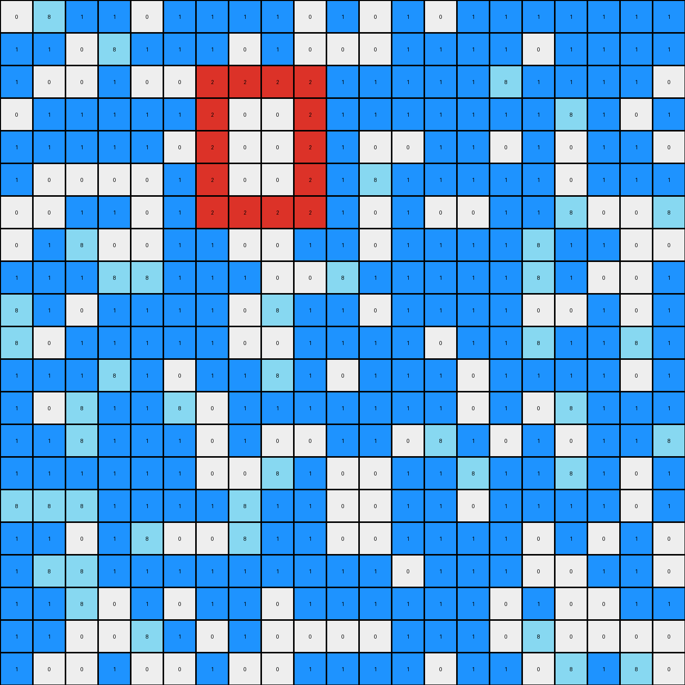
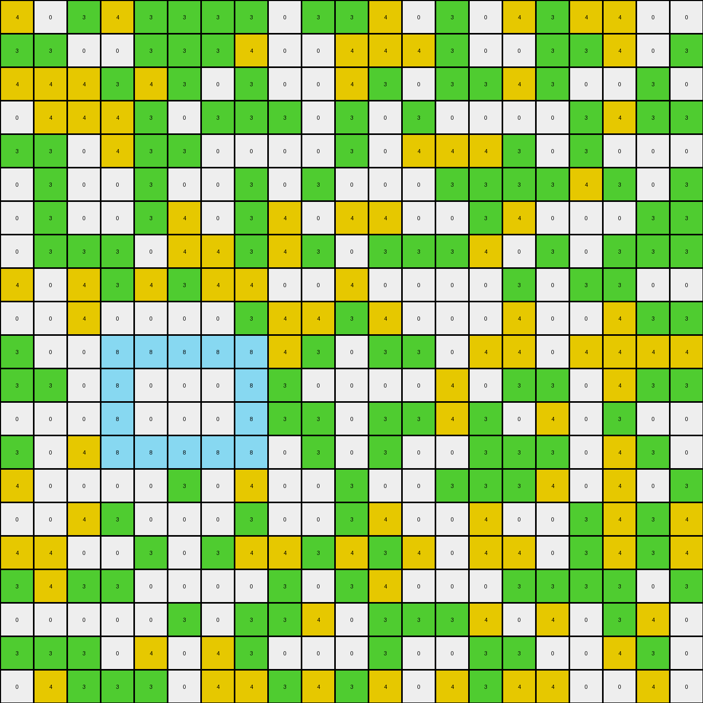

# 890034e9 • 011 • refine_dreamer

---


Previous Code:
```python
"""
The transformation rule is: Move the yellow objects to be adjacent to green objects.
The shape, size and color of the yellow objects are preserved.
If there is already a yellow object that is adjacent to a green object, do not move it.
If a yellow object is adjacent to more than one green object, choose one arbitrarily.
Azure (8) objects are not moved.
"""

import numpy as np

def find_objects(grid, color):
    """
    Find contiguous regions (objects) of a specific color in the grid.
    """
    visited = np.zeros_like(grid, dtype=bool)
    objects = []

    def dfs(row, col, current_object):
        if (row < 0 or row >= grid.shape[0] or col < 0 or col >= grid.shape[1] or
                visited[row, col] or grid[row, col] != color):
            return
        visited[row, col] = True
        current_object.append((row, col))
        dfs(row + 1, col, current_object)
        dfs(row - 1, col, current_object)
        dfs(row, col + 1, current_object)
        dfs(row, col - 1, current_object)

    for row in range(grid.shape[0]):
        for col in range(grid.shape[1]):
            if grid[row, col] == color and not visited[row, col]:
                current_object = []
                dfs(row, col, current_object)
                objects.append(current_object)
    return objects

def find_adjacent_objects(grid, objects, target_color):
    """Find the location and count the adjacent blocks given a target color"""
    adjacencies = []

    for obj in objects:
      for cell in obj:
        row,col = cell

        #check neighbors
        neighbors = [
            (row -1, col),
            (row + 1, col),
            (row, col-1),
            (row, col + 1)
        ]

        for neighbor_row, neighbor_col in neighbors:
            if (0 <= neighbor_row < grid.shape[0] and
                0 <= neighbor_col < grid.shape[1] and
                grid[neighbor_row, neighbor_col] == target_color):
                adjacencies.append( (neighbor_row, neighbor_col) )

    return adjacencies

def transform(input_grid):
    # Initialize output_grid as a copy of the input_grid
    output_grid = np.copy(input_grid)

    # Find green (3) objects
    green_objects = find_objects(output_grid, 3)

    # Find yellow (4) objects
    yellow_objects = find_objects(output_grid, 4)

    #iterate through yellow objects
    for yellow_object in yellow_objects:

      # find green objects adjacent to this yellow object
      adjacent_greens = find_adjacent_objects(output_grid, [yellow_object], 3)

      # If the yellow object is NOT already adjacent to a green object, then move
      if not adjacent_greens:

        #clear current yellow object
        for row, col in yellow_object:
          output_grid[row, col] = input_grid[row,col]


        # find *any* green and use its location for the move
        if green_objects:
          #arbitrarily choose the first green object, and first cell within that object
          target_row, target_col = green_objects[0][0]

          #attempt to move the yellow object, based on relative location to the target
          for i in range(len(yellow_object)):
              row_offset = yellow_object[i][0] - yellow_object[0][0]
              col_offset = yellow_object[i][1] - yellow_object[0][1]

              new_row = target_row + row_offset
              new_col = target_col + col_offset

              #make sure it is valid move
              if (0 <= new_row < output_grid.shape[0] and
                  0 <= new_col < output_grid.shape[1] ):

                #check if spot is available, prioritize green
                if output_grid[new_row, new_col] == 3:
                  output_grid[new_row, new_col] = 4
                elif output_grid[new_row, new_col] == 0:
                  output_grid[new_row,new_col] = 4


    return output_grid
```

Train Set Results:

## Example 1:

Input:
```
0 8 1 1 0 1 1 1 1 0 1 0 1 0 1 1 1 1 1 1 1
1 1 0 8 1 1 1 0 1 0 0 0 1 1 1 1 0 1 1 1 1
1 0 0 1 0 0 2 2 2 2 1 1 1 1 1 8 1 1 1 1 0
0 1 1 1 1 1 2 0 0 2 1 1 1 1 1 1 1 8 1 0 1
1 1 1 1 1 0 2 0 0 2 1 0 0 1 1 0 1 0 1 1 0
1 0 0 0 0 1 2 0 0 2 1 8 1 1 1 1 1 0 1 1 1
0 0 1 1 0 1 2 2 2 2 1 0 1 0 0 1 1 8 0 0 8
0 1 8 0 0 1 1 0 0 1 1 0 1 1 1 1 8 1 1 0 0
1 1 1 8 8 1 1 1 0 0 8 1 1 1 1 1 8 1 0 0 1
8 1 0 1 1 1 1 0 8 1 1 0 1 1 1 1 0 0 1 0 1
8 0 1 1 1 1 1 0 0 1 1 1 1 0 1 1 8 1 1 8 1
1 1 1 8 1 0 1 1 8 1 0 1 1 1 0 1 1 1 1 0 1
1 0 8 1 1 8 0 1 1 1 1 1 1 1 0 1 0 8 1 1 1
1 1 8 1 1 1 0 1 0 0 1 1 0 8 1 0 1 0 1 1 8
1 1 1 1 1 1 0 0 8 1 0 0 1 1 8 1 1 8 1 0 1
8 8 8 1 1 1 1 8 1 1 0 0 1 1 0 1 1 1 1 0 1
1 1 0 1 8 0 0 8 1 1 0 0 1 1 1 1 0 1 0 1 0
1 8 8 1 1 1 1 1 1 1 1 1 0 1 1 1 0 0 1 1 0
1 1 8 0 1 0 1 1 0 1 1 1 1 1 1 0 1 0 0 1 1
1 1 0 0 8 1 0 1 0 0 0 0 1 1 1 0 8 0 0 0 0
1 0 0 1 0 0 1 0 0 1 1 1 1 0 1 1 0 8 1 8 0
```
Expected Output:
```
0 8 1 1 0 1 1 1 1 0 1 0 1 0 1 1 1 1 1 1 1
1 1 0 8 1 1 1 0 1 0 0 0 1 1 1 1 0 1 1 1 1
1 0 0 1 0 0 2 2 2 2 1 1 1 1 1 8 1 1 1 1 0
0 1 1 1 1 1 2 0 0 2 1 1 1 1 1 1 1 8 1 0 1
1 1 1 1 1 0 2 0 0 2 1 0 0 1 1 0 1 0 1 1 0
1 0 0 0 0 1 2 0 0 2 1 8 1 1 1 1 1 0 1 1 1
0 0 1 1 0 1 2 2 2 2 1 0 1 0 0 1 1 8 0 0 8
0 1 8 0 0 1 1 0 0 1 1 0 1 1 1 1 8 1 1 0 0
1 1 1 8 8 1 1 1 0 0 8 1 1 1 1 1 8 1 0 0 1
8 1 0 1 1 1 1 0 8 1 1 0 1 1 1 1 0 0 1 0 1
8 0 1 1 1 1 1 0 0 1 1 1 1 0 1 1 8 1 1 8 1
1 1 1 8 1 0 1 1 8 1 0 1 1 1 0 1 1 1 1 0 1
1 0 8 1 1 8 0 1 1 1 1 1 1 1 0 1 0 8 1 1 1
1 1 8 1 1 1 0 1 0 2 2 2 2 8 1 0 1 0 1 1 8
1 1 1 1 1 1 0 0 8 2 0 0 2 1 8 1 1 8 1 0 1
8 8 8 1 1 1 1 8 1 2 0 0 2 1 0 1 1 1 1 0 1
1 1 0 1 8 0 0 8 1 2 0 0 2 1 1 1 0 1 0 1 0
1 8 8 1 1 1 1 1 1 2 2 2 2 1 1 1 0 0 1 1 0
1 1 8 0 1 0 1 1 0 1 1 1 1 1 1 0 1 0 0 1 1
1 1 0 0 8 1 0 1 0 0 0 0 1 1 1 0 8 0 0 0 0
1 0 0 1 0 0 1 0 0 1 1 1 1 0 1 1 0 8 1 8 0
```
Transformed Output:
```
0 8 1 1 0 1 1 1 1 0 1 0 1 0 1 1 1 1 1 1 1
1 1 0 8 1 1 1 0 1 0 0 0 1 1 1 1 0 1 1 1 1
1 0 0 1 0 0 2 2 2 2 1 1 1 1 1 8 1 1 1 1 0
0 1 1 1 1 1 2 0 0 2 1 1 1 1 1 1 1 8 1 0 1
1 1 1 1 1 0 2 0 0 2 1 0 0 1 1 0 1 0 1 1 0
1 0 0 0 0 1 2 0 0 2 1 8 1 1 1 1 1 0 1 1 1
0 0 1 1 0 1 2 2 2 2 1 0 1 0 0 1 1 8 0 0 8
0 1 8 0 0 1 1 0 0 1 1 0 1 1 1 1 8 1 1 0 0
1 1 1 8 8 1 1 1 0 0 8 1 1 1 1 1 8 1 0 0 1
8 1 0 1 1 1 1 0 8 1 1 0 1 1 1 1 0 0 1 0 1
8 0 1 1 1 1 1 0 0 1 1 1 1 0 1 1 8 1 1 8 1
1 1 1 8 1 0 1 1 8 1 0 1 1 1 0 1 1 1 1 0 1
1 0 8 1 1 8 0 1 1 1 1 1 1 1 0 1 0 8 1 1 1
1 1 8 1 1 1 0 1 0 0 1 1 0 8 1 0 1 0 1 1 8
1 1 1 1 1 1 0 0 8 1 0 0 1 1 8 1 1 8 1 0 1
8 8 8 1 1 1 1 8 1 1 0 0 1 1 0 1 1 1 1 0 1
1 1 0 1 8 0 0 8 1 1 0 0 1 1 1 1 0 1 0 1 0
1 8 8 1 1 1 1 1 1 1 1 1 0 1 1 1 0 0 1 1 0
1 1 8 0 1 0 1 1 0 1 1 1 1 1 1 0 1 0 0 1 1
1 1 0 0 8 1 0 1 0 0 0 0 1 1 1 0 8 0 0 0 0
1 0 0 1 0 0 1 0 0 1 1 1 1 0 1 1 0 8 1 8 0
```

match: False
pixels_off: 14
size_correct: True
color_palette_correct: True
correct_pixel_counts: False

## Example 2:

Input:
```
3 0 3 4 3 3 3 3 0 3 3 4 0 3 0 4 3 4 4 0 0
3 3 0 0 3 3 3 4 0 0 4 4 4 3 0 0 3 3 4 0 3
4 4 4 3 4 3 0 3 0 0 4 3 0 3 3 4 3 0 0 3 0
0 4 4 4 3 0 3 3 3 0 3 0 3 0 0 0 0 3 4 3 3
3 3 0 4 3 3 0 0 0 0 3 0 4 4 4 3 0 3 0 0 0
0 3 0 0 3 0 0 3 0 3 0 0 0 3 3 3 3 4 3 0 3
0 3 0 0 3 4 0 3 4 0 4 4 0 0 3 4 0 0 0 3 3
0 3 3 3 0 4 4 3 4 3 0 3 3 3 4 0 3 0 3 3 3
4 0 4 3 4 3 4 4 0 0 4 0 0 0 0 3 0 3 3 0 0
0 0 4 0 0 0 0 3 4 4 3 4 0 0 0 4 0 0 4 3 3
3 0 0 8 8 8 8 8 4 3 0 3 3 0 4 4 0 4 4 4 4
3 3 0 8 0 0 0 8 3 0 0 0 0 4 0 3 3 0 4 3 3
0 0 0 8 0 0 0 8 3 3 0 3 3 4 3 0 4 0 3 0 0
3 0 4 8 8 8 8 8 0 3 0 3 0 0 3 3 3 0 4 3 0
4 0 0 0 0 3 0 4 0 0 3 0 0 3 3 3 4 0 4 0 3
0 0 4 3 0 0 0 3 0 0 3 4 0 0 4 0 0 3 4 3 4
4 4 0 0 3 0 3 4 4 3 4 3 4 0 4 4 0 3 4 3 4
3 4 3 3 0 0 0 0 3 0 3 4 0 0 0 3 3 3 3 0 3
0 0 0 0 0 3 0 3 3 4 0 3 3 3 4 0 4 0 3 4 0
3 3 3 0 4 0 4 3 0 0 0 3 0 0 3 3 0 0 4 3 0
0 4 3 3 3 0 4 4 3 4 3 4 0 4 3 4 4 0 0 4 0
```
Expected Output:
```
3 0 3 4 3 3 3 3 0 3 3 4 0 3 0 4 3 4 4 0 0
3 3 0 0 3 3 3 4 0 0 4 4 4 3 0 0 3 3 4 0 3
4 4 4 3 4 3 0 3 0 0 4 3 0 3 3 4 3 0 0 3 0
0 4 4 4 3 0 3 3 3 0 3 0 3 0 0 0 0 3 4 3 3
3 3 0 4 3 3 0 0 0 0 3 0 4 4 4 3 0 3 0 0 0
0 3 0 0 3 0 0 3 0 3 0 0 0 3 3 3 3 4 3 0 3
0 3 0 0 3 4 0 3 4 0 4 4 0 0 3 4 0 0 0 3 3
0 3 3 3 0 4 4 3 4 3 0 8 8 8 8 8 3 0 3 3 3
4 0 4 3 4 3 4 4 0 0 4 8 0 0 0 8 0 3 3 0 0
0 0 4 0 0 0 0 3 4 4 3 8 0 0 0 8 0 0 4 3 3
3 0 0 8 8 8 8 8 4 3 0 8 8 8 8 8 0 4 4 4 4
3 3 0 8 0 0 0 8 3 0 0 0 0 4 0 3 3 0 4 3 3
0 0 0 8 0 0 0 8 3 3 0 3 3 4 3 0 4 0 3 0 0
3 0 4 8 8 8 8 8 0 3 0 3 0 0 3 3 3 0 4 3 0
4 0 0 0 0 3 0 4 0 0 3 0 0 3 3 3 4 0 4 0 3
0 0 4 3 0 0 0 3 0 0 3 4 0 0 4 0 0 3 4 3 4
4 4 0 0 3 0 3 4 4 3 4 3 4 0 4 4 0 3 4 3 4
3 4 3 3 0 0 0 0 3 0 3 4 0 0 0 3 3 3 3 0 3
0 0 0 0 0 3 0 3 3 4 0 3 3 3 4 0 4 0 3 4 0
3 3 3 0 4 0 4 3 0 0 0 3 0 0 3 3 0 0 4 3 0
0 4 3 3 3 0 4 4 3 4 3 4 0 4 3 4 4 0 0 4 0
```
Transformed Output:
```
4 0 3 4 3 3 3 3 0 3 3 4 0 3 0 4 3 4 4 0 0
3 3 0 0 3 3 3 4 0 0 4 4 4 3 0 0 3 3 4 0 3
4 4 4 3 4 3 0 3 0 0 4 3 0 3 3 4 3 0 0 3 0
0 4 4 4 3 0 3 3 3 0 3 0 3 0 0 0 0 3 4 3 3
3 3 0 4 3 3 0 0 0 0 3 0 4 4 4 3 0 3 0 0 0
0 3 0 0 3 0 0 3 0 3 0 0 0 3 3 3 3 4 3 0 3
0 3 0 0 3 4 0 3 4 0 4 4 0 0 3 4 0 0 0 3 3
0 3 3 3 0 4 4 3 4 3 0 3 3 3 4 0 3 0 3 3 3
4 0 4 3 4 3 4 4 0 0 4 0 0 0 0 3 0 3 3 0 0
0 0 4 0 0 0 0 3 4 4 3 4 0 0 0 4 0 0 4 3 3
3 0 0 8 8 8 8 8 4 3 0 3 3 0 4 4 0 4 4 4 4
3 3 0 8 0 0 0 8 3 0 0 0 0 4 0 3 3 0 4 3 3
0 0 0 8 0 0 0 8 3 3 0 3 3 4 3 0 4 0 3 0 0
3 0 4 8 8 8 8 8 0 3 0 3 0 0 3 3 3 0 4 3 0
4 0 0 0 0 3 0 4 0 0 3 0 0 3 3 3 4 0 4 0 3
0 0 4 3 0 0 0 3 0 0 3 4 0 0 4 0 0 3 4 3 4
4 4 0 0 3 0 3 4 4 3 4 3 4 0 4 4 0 3 4 3 4
3 4 3 3 0 0 0 0 3 0 3 4 0 0 0 3 3 3 3 0 3
0 0 0 0 0 3 0 3 3 4 0 3 3 3 4 0 4 0 3 4 0
3 3 3 0 4 0 4 3 0 0 0 3 0 0 3 3 0 0 4 3 0
0 4 3 3 3 0 4 4 3 4 3 4 0 4 3 4 4 0 0 4 0
```

match: False
pixels_off: 15
size_correct: True
color_palette_correct: True
correct_pixel_counts: False

## Example 3:

Input:
```
0 0 3 0 3 2 0 2 0 3 3 2 2 2 2 2 2 2 2 3 3
3 2 2 0 3 2 0 2 2 2 2 2 2 2 2 3 2 2 0 3 2
3 3 0 3 0 0 3 2 2 2 2 3 2 2 2 2 3 0 0 3 2
2 2 3 2 4 4 4 4 4 4 3 0 3 2 0 2 2 2 0 0 3
3 3 2 0 4 0 0 0 0 4 2 0 2 2 0 2 3 0 2 2 0
3 2 2 2 4 0 0 0 0 4 0 3 2 2 3 2 2 3 3 2 0
2 0 2 0 4 0 0 0 0 4 2 0 0 0 2 2 2 0 2 2 2
0 2 0 2 4 4 4 4 4 4 2 2 0 2 0 2 0 0 2 2 2
2 0 2 2 2 0 2 0 2 0 3 2 3 3 0 2 0 0 0 2 2
0 2 3 0 3 0 2 3 2 2 2 0 2 0 0 0 2 2 3 2 0
3 0 2 0 2 0 0 2 2 0 3 3 2 3 0 3 3 0 0 3 0
2 3 0 3 2 2 2 2 2 0 0 0 0 2 0 2 0 3 0 0 2
3 2 2 0 2 0 2 2 0 3 2 2 2 2 3 0 2 2 2 2 2
3 3 3 2 0 2 0 2 0 3 2 2 2 0 0 3 2 2 3 2 2
0 0 2 2 2 3 2 0 0 2 3 2 0 3 0 2 2 3 2 2 0
2 2 2 2 2 3 2 3 3 3 2 0 0 0 0 2 0 0 2 3 0
2 2 2 2 3 0 0 3 3 2 0 0 0 0 0 0 2 2 3 2 0
2 0 3 2 2 2 3 2 3 3 3 0 0 0 0 0 2 0 0 2 3
2 2 0 0 0 0 0 0 0 3 2 3 2 2 3 0 0 2 2 0 0
0 3 0 2 2 2 0 0 0 2 2 2 2 3 0 2 0 0 0 3 2
2 3 2 2 2 0 0 3 2 0 3 2 0 2 2 2 3 0 0 2 2
```
Expected Output:
```
0 0 3 0 3 2 0 2 0 3 3 2 2 2 2 2 2 2 2 3 3
3 2 2 0 3 2 0 2 2 2 2 2 2 2 2 3 2 2 0 3 2
3 3 0 3 0 0 3 2 2 2 2 3 2 2 2 2 3 0 0 3 2
2 2 3 2 4 4 4 4 4 4 3 0 3 2 0 2 2 2 0 0 3
3 3 2 0 4 0 0 0 0 4 2 0 2 2 0 2 3 0 2 2 0
3 2 2 2 4 0 0 0 0 4 0 3 2 2 3 2 2 3 3 2 0
2 0 2 0 4 0 0 0 0 4 2 0 0 0 2 2 2 0 2 2 2
0 2 0 2 4 4 4 4 4 4 2 2 0 2 0 2 0 0 2 2 2
2 0 2 2 2 0 2 0 2 0 3 2 3 3 0 2 0 0 0 2 2
0 2 3 0 3 0 2 3 2 2 2 0 2 0 0 0 2 2 3 2 0
3 0 2 0 2 0 0 2 2 0 3 3 2 3 0 3 3 0 0 3 0
2 3 0 3 2 2 2 2 2 0 0 0 0 2 0 2 0 3 0 0 2
3 2 2 0 2 0 2 2 0 3 2 2 2 2 3 0 2 2 2 2 2
3 3 3 2 0 2 0 2 0 3 2 2 2 0 0 3 2 2 3 2 2
0 0 2 2 2 3 2 0 0 2 4 4 4 4 4 4 2 3 2 2 0
2 2 2 2 2 3 2 3 3 3 4 0 0 0 0 4 0 0 2 3 0
2 2 2 2 3 0 0 3 3 2 4 0 0 0 0 4 2 2 3 2 0
2 0 3 2 2 2 3 2 3 3 4 0 0 0 0 4 2 0 0 2 3
2 2 0 0 0 0 0 0 0 3 4 4 4 4 4 4 0 2 2 0 0
0 3 0 2 2 2 0 0 0 2 2 2 2 3 0 2 0 0 0 3 2
2 3 2 2 2 0 0 3 2 0 3 2 0 2 2 2 3 0 0 2 2
```
Transformed Output:
```
0 0 3 0 3 2 0 2 0 3 3 2 2 2 2 2 2 2 2 3 3
3 2 2 0 3 2 0 2 2 2 2 2 2 2 2 3 2 2 0 3 2
3 3 0 3 0 0 3 2 2 2 2 3 2 2 2 2 3 0 0 3 2
2 2 3 2 4 4 4 4 4 4 3 0 3 2 0 2 2 2 0 0 3
3 3 2 0 4 0 0 0 0 4 2 0 2 2 0 2 3 0 2 2 0
3 2 2 2 4 0 0 0 0 4 0 3 2 2 3 2 2 3 3 2 0
2 0 2 0 4 0 0 0 0 4 2 0 0 0 2 2 2 0 2 2 2
0 2 0 2 4 4 4 4 4 4 2 2 0 2 0 2 0 0 2 2 2
2 0 2 2 2 0 2 0 2 0 3 2 3 3 0 2 0 0 0 2 2
0 2 3 0 3 0 2 3 2 2 2 0 2 0 0 0 2 2 3 2 0
3 0 2 0 2 0 0 2 2 0 3 3 2 3 0 3 3 0 0 3 0
2 3 0 3 2 2 2 2 2 0 0 0 0 2 0 2 0 3 0 0 2
3 2 2 0 2 0 2 2 0 3 2 2 2 2 3 0 2 2 2 2 2
3 3 3 2 0 2 0 2 0 3 2 2 2 0 0 3 2 2 3 2 2
0 0 2 2 2 3 2 0 0 2 3 2 0 3 0 2 2 3 2 2 0
2 2 2 2 2 3 2 3 3 3 2 0 0 0 0 2 0 0 2 3 0
2 2 2 2 3 0 0 3 3 2 0 0 0 0 0 0 2 2 3 2 0
2 0 3 2 2 2 3 2 3 3 3 0 0 0 0 0 2 0 0 2 3
2 2 0 0 0 0 0 0 0 3 2 3 2 2 3 0 0 2 2 0 0
0 3 0 2 2 2 0 0 0 2 2 2 2 3 0 2 0 0 0 3 2
2 3 2 2 2 0 0 3 2 0 3 2 0 2 2 2 3 0 0 2 2
```

match: False
pixels_off: 18
size_correct: True
color_palette_correct: True
correct_pixel_counts: False

**INSTRUCTIONS**

The code above was generated based on observations from the first training
example

we have tested the transform function on each of the task example inputs and
compared with the expected output

review each of the examples provided and the results and consider how the
natural language program should be updated to accommodate this new knowledge

respond with the following deliverables:

- general assessment of the information provided and strategy for resolving the
  errors
- gather metrics about each of the examples and results - use code_execution to
  develop accurate reports on your assumptions
- a YAML block documenting facts - Focus on identifying objects, their properties, and the actions performed on them.
- a natural language program - Be as clear and concise as possible, providing a complete description of the transformation rule.


your responses should be considered as information in a report - not a
conversation
