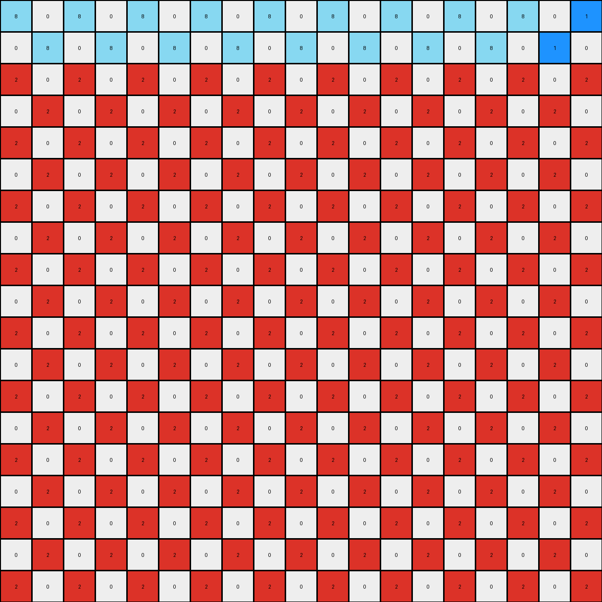
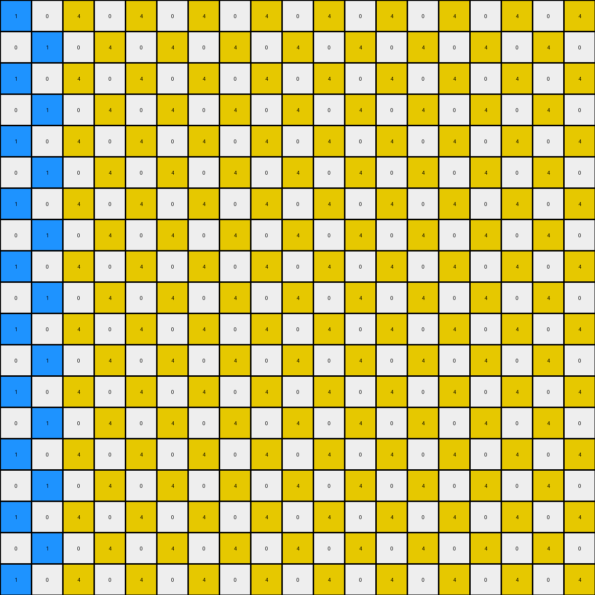
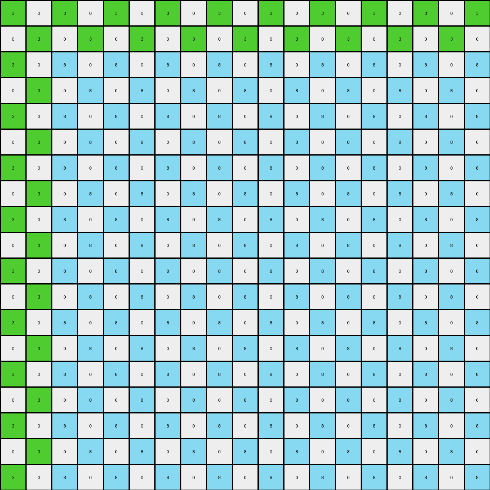

# 9d9215db • 006 • refine_coder

---

Previous Code:
```python
"""
The input grid's non-white pixels form a "seed" pattern. This pattern is replicated
in a checkered fashion across the output grid. The blue (1) pixels expand to set the
checkered grid. The other colored pixels maintain relative positions to the original
blue pixels.
"""

import numpy as np

def get_non_white_pixels(grid):
    """
    Finds the coordinates and values of non-white pixels in the input grid.
    """
    non_white_pixels = []
    for r_idx, row in enumerate(grid):
        for c_idx, val in enumerate(row):
            if val != 0:
                non_white_pixels.append( ((r_idx, c_idx), val))
    return non_white_pixels

def transform(input_grid):
    # initialize output_grid
    input_grid = np.array(input_grid)
    output_grid = np.zeros_like(input_grid)

    # Find non white pixels and their locations
    non_white_pixels = get_non_white_pixels(input_grid)
    
    # Find the blue pixel to set the checkered pattern.
    blue_pixels = [((r,c), val) for (r,c), val in non_white_pixels if val == 1]

    if not blue_pixels: # Handle edge case, when there are no blue pixels
        return input_grid.tolist()

    blue_row, blue_col = blue_pixels[0][0]

    # Create the checkered pattern based on blue pixel
    for r in range(output_grid.shape[0]):
        for c in range(output_grid.shape[1]):
            if (r + c) % 2 == (blue_row + blue_col) % 2:
                output_grid[r,c] = 1
    
    # Re-place other colored pixels relative to the original blue pixel positions.
    for (r,c), val in non_white_pixels:
        if val != 1:
            row_offset = r - blue_row
            col_offset = c - blue_col

            for r_out in range(output_grid.shape[0]):
                for c_out in range(output_grid.shape[1]):
                    # Check if this is a blue pixel position based on the checkered pattern.
                    if (r_out + c_out) % 2 == (blue_row + blue_col) % 2:
                        new_r = r_out + row_offset
                        new_c = c_out + col_offset

                        if 0 <= new_r < output_grid.shape[0] and 0 <= new_c < output_grid.shape[1]:
                            output_grid[new_r, new_c] = val
                        

    return output_grid.tolist()
```

Train Set Results:

## Example 1:

Input:
```
0 0 0 0 0 0 0 0 0 0 0 0 0 0 0 0 0 0 0
0 8 0 1 0 0 0 0 0 0 0 0 0 0 0 0 0 0 0
0 0 0 0 0 0 0 0 0 0 0 0 0 0 0 0 0 0 0
0 1 0 2 0 0 0 0 0 0 0 0 0 0 0 0 0 0 0
0 0 0 0 0 0 0 0 0 0 0 0 0 0 0 0 0 0 0
0 0 0 0 0 0 0 0 0 0 0 0 0 0 0 0 0 0 0
0 0 0 0 0 0 0 0 0 0 0 0 0 0 0 0 0 0 0
0 0 0 0 0 0 0 0 0 0 0 0 0 0 0 0 0 0 0
0 0 0 0 0 0 0 0 0 0 0 0 0 0 0 0 0 0 0
0 0 0 0 0 0 0 0 0 0 0 0 0 0 0 0 0 0 0
0 0 0 0 0 0 0 0 0 0 0 0 0 0 0 0 0 0 0
0 0 0 0 0 0 0 0 0 0 0 0 0 0 0 0 0 0 0
0 0 0 0 0 0 0 0 0 0 0 0 0 0 0 0 0 0 0
0 0 0 0 0 0 0 0 0 0 0 0 0 0 0 0 0 0 0
0 0 0 0 0 0 0 0 0 0 0 0 0 0 0 0 0 0 0
0 0 0 0 0 0 0 0 0 0 0 0 0 0 0 0 0 0 0
0 0 0 0 0 0 0 0 0 0 0 0 0 0 0 0 0 0 0
0 0 0 0 0 0 0 0 0 0 0 0 0 0 0 0 0 0 0
0 0 0 0 0 0 0 0 0 0 0 0 0 0 0 0 0 0 0
```
Expected Output:
```
0 0 0 0 0 0 0 0 0 0 0 0 0 0 0 0 0 0 0
0 8 0 1 0 1 0 1 0 1 0 1 0 1 0 1 0 8 0
0 0 0 0 0 0 0 0 0 0 0 0 0 0 0 0 0 0 0
0 1 0 2 0 0 0 0 0 0 0 0 0 0 0 2 0 1 0
0 0 0 0 0 0 0 0 0 0 0 0 0 0 0 0 0 0 0
0 1 0 0 0 0 0 0 0 0 0 0 0 0 0 0 0 1 0
0 0 0 0 0 0 0 0 0 0 0 0 0 0 0 0 0 0 0
0 1 0 0 0 0 0 0 0 0 0 0 0 0 0 0 0 1 0
0 0 0 0 0 0 0 0 0 0 0 0 0 0 0 0 0 0 0
0 1 0 0 0 0 0 0 0 0 0 0 0 0 0 0 0 1 0
0 0 0 0 0 0 0 0 0 0 0 0 0 0 0 0 0 0 0
0 1 0 0 0 0 0 0 0 0 0 0 0 0 0 0 0 1 0
0 0 0 0 0 0 0 0 0 0 0 0 0 0 0 0 0 0 0
0 1 0 0 0 0 0 0 0 0 0 0 0 0 0 0 0 1 0
0 0 0 0 0 0 0 0 0 0 0 0 0 0 0 0 0 0 0
0 1 0 2 0 0 0 0 0 0 0 0 0 0 0 2 0 1 0
0 0 0 0 0 0 0 0 0 0 0 0 0 0 0 0 0 0 0
0 8 0 1 0 1 0 1 0 1 0 1 0 1 0 1 0 8 0
0 0 0 0 0 0 0 0 0 0 0 0 0 0 0 0 0 0 0
```
Transformed Output:
```
8 0 8 0 8 0 8 0 8 0 8 0 8 0 8 0 8 0 1
0 8 0 8 0 8 0 8 0 8 0 8 0 8 0 8 0 1 0
2 0 2 0 2 0 2 0 2 0 2 0 2 0 2 0 2 0 2
0 2 0 2 0 2 0 2 0 2 0 2 0 2 0 2 0 2 0
2 0 2 0 2 0 2 0 2 0 2 0 2 0 2 0 2 0 2
0 2 0 2 0 2 0 2 0 2 0 2 0 2 0 2 0 2 0
2 0 2 0 2 0 2 0 2 0 2 0 2 0 2 0 2 0 2
0 2 0 2 0 2 0 2 0 2 0 2 0 2 0 2 0 2 0
2 0 2 0 2 0 2 0 2 0 2 0 2 0 2 0 2 0 2
0 2 0 2 0 2 0 2 0 2 0 2 0 2 0 2 0 2 0
2 0 2 0 2 0 2 0 2 0 2 0 2 0 2 0 2 0 2
0 2 0 2 0 2 0 2 0 2 0 2 0 2 0 2 0 2 0
2 0 2 0 2 0 2 0 2 0 2 0 2 0 2 0 2 0 2
0 2 0 2 0 2 0 2 0 2 0 2 0 2 0 2 0 2 0
2 0 2 0 2 0 2 0 2 0 2 0 2 0 2 0 2 0 2
0 2 0 2 0 2 0 2 0 2 0 2 0 2 0 2 0 2 0
2 0 2 0 2 0 2 0 2 0 2 0 2 0 2 0 2 0 2
0 2 0 2 0 2 0 2 0 2 0 2 0 2 0 2 0 2 0
2 0 2 0 2 0 2 0 2 0 2 0 2 0 2 0 2 0 2
```

match: False
pixels_off: 176
size_correct: True
color_palette_correct: True
correct_pixel_counts: False

## Example 2:

Input:
```
0 0 0 0 0 0 0 0 0 0 0 0 0 0 0 0 0 0 0
0 0 0 0 0 0 0 0 0 0 0 0 0 0 0 0 0 3 0
0 0 0 0 0 0 0 0 0 0 0 0 0 0 0 0 0 0 0
0 0 0 0 0 0 0 0 0 0 0 0 0 1 0 4 0 0 0
0 0 0 0 0 0 0 0 0 0 0 0 0 0 0 0 0 0 0
0 0 0 0 0 0 0 0 0 0 0 0 0 0 0 1 0 0 0
0 0 0 0 0 0 0 0 0 0 0 0 0 0 0 0 0 0 0
0 0 0 0 0 0 0 0 0 0 0 0 0 0 0 0 0 0 0
0 0 0 0 0 0 0 0 0 0 0 0 0 0 0 0 0 0 0
0 0 0 0 0 0 0 0 0 0 0 0 0 0 0 0 0 0 0
0 0 0 0 0 0 0 0 0 0 0 0 0 0 0 0 0 0 0
0 0 0 0 0 0 0 0 0 0 0 0 0 0 0 0 0 0 0
0 0 0 0 0 0 0 0 0 0 0 0 0 0 0 0 0 0 0
0 0 0 0 0 0 0 0 0 0 0 0 0 0 0 0 0 0 0
0 0 0 0 0 0 0 0 0 0 0 0 0 0 0 0 0 0 0
0 0 0 0 0 0 0 0 0 0 0 0 0 0 0 0 0 0 0
0 0 0 0 0 0 0 0 0 0 0 0 0 0 0 0 0 0 0
0 0 0 0 0 0 0 0 0 0 0 0 0 0 0 0 0 0 0
0 0 0 0 0 0 0 0 0 0 0 0 0 0 0 0 0 0 0
```
Expected Output:
```
0 0 0 0 0 0 0 0 0 0 0 0 0 0 0 0 0 0 0
0 3 0 0 0 0 0 0 0 0 0 0 0 0 0 0 0 3 0
0 0 0 0 0 0 0 0 0 0 0 0 0 0 0 0 0 0 0
0 0 0 4 0 1 0 1 0 1 0 1 0 1 0 4 0 0 0
0 0 0 0 0 0 0 0 0 0 0 0 0 0 0 0 0 0 0
0 0 0 1 0 0 0 0 0 0 0 0 0 0 0 1 0 0 0
0 0 0 0 0 0 0 0 0 0 0 0 0 0 0 0 0 0 0
0 0 0 1 0 0 0 0 0 0 0 0 0 0 0 1 0 0 0
0 0 0 0 0 0 0 0 0 0 0 0 0 0 0 0 0 0 0
0 0 0 1 0 0 0 0 0 0 0 0 0 0 0 1 0 0 0
0 0 0 0 0 0 0 0 0 0 0 0 0 0 0 0 0 0 0
0 0 0 1 0 0 0 0 0 0 0 0 0 0 0 1 0 0 0
0 0 0 0 0 0 0 0 0 0 0 0 0 0 0 0 0 0 0
0 0 0 1 0 0 0 0 0 0 0 0 0 0 0 1 0 0 0
0 0 0 0 0 0 0 0 0 0 0 0 0 0 0 0 0 0 0
0 0 0 4 0 1 0 1 0 1 0 1 0 1 0 4 0 0 0
0 0 0 0 0 0 0 0 0 0 0 0 0 0 0 0 0 0 0
0 3 0 0 0 0 0 0 0 0 0 0 0 0 0 0 0 3 0
0 0 0 0 0 0 0 0 0 0 0 0 0 0 0 0 0 0 0
```
Transformed Output:
```
1 0 4 0 4 0 4 0 4 0 4 0 4 0 4 0 4 0 4
0 1 0 4 0 4 0 4 0 4 0 4 0 4 0 4 0 4 0
1 0 4 0 4 0 4 0 4 0 4 0 4 0 4 0 4 0 4
0 1 0 4 0 4 0 4 0 4 0 4 0 4 0 4 0 4 0
1 0 4 0 4 0 4 0 4 0 4 0 4 0 4 0 4 0 4
0 1 0 4 0 4 0 4 0 4 0 4 0 4 0 4 0 4 0
1 0 4 0 4 0 4 0 4 0 4 0 4 0 4 0 4 0 4
0 1 0 4 0 4 0 4 0 4 0 4 0 4 0 4 0 4 0
1 0 4 0 4 0 4 0 4 0 4 0 4 0 4 0 4 0 4
0 1 0 4 0 4 0 4 0 4 0 4 0 4 0 4 0 4 0
1 0 4 0 4 0 4 0 4 0 4 0 4 0 4 0 4 0 4
0 1 0 4 0 4 0 4 0 4 0 4 0 4 0 4 0 4 0
1 0 4 0 4 0 4 0 4 0 4 0 4 0 4 0 4 0 4
0 1 0 4 0 4 0 4 0 4 0 4 0 4 0 4 0 4 0
1 0 4 0 4 0 4 0 4 0 4 0 4 0 4 0 4 0 4
0 1 0 4 0 4 0 4 0 4 0 4 0 4 0 4 0 4 0
1 0 4 0 4 0 4 0 4 0 4 0 4 0 4 0 4 0 4
0 1 0 4 0 4 0 4 0 4 0 4 0 4 0 4 0 4 0
1 0 4 0 4 0 4 0 4 0 4 0 4 0 4 0 4 0 4
```

match: False
pixels_off: 177
size_correct: True
color_palette_correct: True
correct_pixel_counts: False

## Example 3:

Input:
```
0 0 0 0 0 0 0 0 0 0 0 0 0 0 0 0 0 0 0
0 4 0 3 0 0 0 0 0 0 0 0 0 0 0 0 0 0 0
0 0 0 0 0 0 0 0 0 0 0 0 0 0 0 0 0 0 0
0 3 0 1 0 0 0 0 0 0 0 0 0 0 0 0 0 0 0
0 0 0 0 0 0 0 0 0 0 0 0 0 0 0 0 0 0 0
0 0 0 0 0 8 0 0 0 0 0 0 0 0 0 0 0 0 0
0 0 0 0 0 0 0 0 0 0 0 0 0 0 0 0 0 0 0
0 0 0 0 0 0 0 0 0 0 0 0 0 0 0 0 0 0 0
0 0 0 0 0 0 0 0 0 0 0 0 0 0 0 0 0 0 0
0 0 0 0 0 0 0 0 0 0 0 0 0 0 0 0 0 0 0
0 0 0 0 0 0 0 0 0 0 0 0 0 0 0 0 0 0 0
0 0 0 0 0 0 0 0 0 0 0 0 0 0 0 0 0 0 0
0 0 0 0 0 0 0 0 0 0 0 0 0 0 0 0 0 0 0
0 0 0 0 0 0 0 0 0 0 0 0 0 0 0 0 0 0 0
0 0 0 0 0 0 0 0 0 0 0 0 0 0 0 0 0 0 0
0 0 0 0 0 0 0 0 0 0 0 0 0 0 0 0 0 0 0
0 0 0 0 0 0 0 0 0 0 0 0 0 0 0 0 0 0 0
0 0 0 0 0 0 0 0 0 0 0 0 0 0 0 0 0 0 0
0 0 0 0 0 0 0 0 0 0 0 0 0 0 0 0 0 0 0
```
Expected Output:
```
0 0 0 0 0 0 0 0 0 0 0 0 0 0 0 0 0 0 0
0 4 0 3 0 3 0 3 0 3 0 3 0 3 0 3 0 4 0
0 0 0 0 0 0 0 0 0 0 0 0 0 0 0 0 0 0 0
0 3 0 1 0 0 0 0 0 0 0 0 0 0 0 1 0 3 0
0 0 0 0 0 0 0 0 0 0 0 0 0 0 0 0 0 0 0
0 3 0 0 0 8 0 0 0 0 0 0 0 8 0 0 0 3 0
0 0 0 0 0 0 0 0 0 0 0 0 0 0 0 0 0 0 0
0 3 0 0 0 0 0 0 0 0 0 0 0 0 0 0 0 3 0
0 0 0 0 0 0 0 0 0 0 0 0 0 0 0 0 0 0 0
0 3 0 0 0 0 0 0 0 0 0 0 0 0 0 0 0 3 0
0 0 0 0 0 0 0 0 0 0 0 0 0 0 0 0 0 0 0
0 3 0 0 0 0 0 0 0 0 0 0 0 0 0 0 0 3 0
0 0 0 0 0 0 0 0 0 0 0 0 0 0 0 0 0 0 0
0 3 0 0 0 8 0 0 0 0 0 0 0 8 0 0 0 3 0
0 0 0 0 0 0 0 0 0 0 0 0 0 0 0 0 0 0 0
0 3 0 1 0 0 0 0 0 0 0 0 0 0 0 1 0 3 0
0 0 0 0 0 0 0 0 0 0 0 0 0 0 0 0 0 0 0
0 4 0 3 0 3 0 3 0 3 0 3 0 3 0 3 0 4 0
0 0 0 0 0 0 0 0 0 0 0 0 0 0 0 0 0 0 0
```
Transformed Output:
```
3 0 3 0 3 0 3 0 3 0 3 0 3 0 3 0 3 0 3
0 3 0 3 0 3 0 3 0 3 0 3 0 3 0 3 0 3 0
3 0 8 0 8 0 8 0 8 0 8 0 8 0 8 0 8 0 8
0 3 0 8 0 8 0 8 0 8 0 8 0 8 0 8 0 8 0
3 0 8 0 8 0 8 0 8 0 8 0 8 0 8 0 8 0 8
0 3 0 8 0 8 0 8 0 8 0 8 0 8 0 8 0 8 0
3 0 8 0 8 0 8 0 8 0 8 0 8 0 8 0 8 0 8
0 3 0 8 0 8 0 8 0 8 0 8 0 8 0 8 0 8 0
3 0 8 0 8 0 8 0 8 0 8 0 8 0 8 0 8 0 8
0 3 0 8 0 8 0 8 0 8 0 8 0 8 0 8 0 8 0
3 0 8 0 8 0 8 0 8 0 8 0 8 0 8 0 8 0 8
0 3 0 8 0 8 0 8 0 8 0 8 0 8 0 8 0 8 0
3 0 8 0 8 0 8 0 8 0 8 0 8 0 8 0 8 0 8
0 3 0 8 0 8 0 8 0 8 0 8 0 8 0 8 0 8 0
3 0 8 0 8 0 8 0 8 0 8 0 8 0 8 0 8 0 8
0 3 0 8 0 8 0 8 0 8 0 8 0 8 0 8 0 8 0
3 0 8 0 8 0 8 0 8 0 8 0 8 0 8 0 8 0 8
0 3 0 8 0 8 0 8 0 8 0 8 0 8 0 8 0 8 0
3 0 8 0 8 0 8 0 8 0 8 0 8 0 8 0 8 0 8
```

match: False
pixels_off: 163
size_correct: True
color_palette_correct: True
correct_pixel_counts: False
Okay, let's analyze the results and update the natural language program.

**General Assessment:**

The initial program was based on the idea of a checkered pattern expansion seeded by the non-white pixels, with the blue pixel dictating the checkerboard. While this works to some extent, it's clearly not the complete picture. The transformed outputs show significant deviations from the expected outputs in all three examples. The core issue is that the replication logic is too simplistic and doesn't correctly handle the positioning and repetition of the non-blue colors. The initial assumption about blue dictating the entire checkered pattern and other colors maintaining offsets seems incorrect. We need to rethink how colors other than blue are placed in the output, and potentially redefine how blue is used.

**Strategy for Resolving Errors:**

1.  **Re-examine the Role of Blue:** While blue (1) might be *part* of the pattern generation, it's not the sole determinant. We need to analyze its relationship to other colors *within* the seed pattern, not just as a starting point for a checkerboard.
2.  **Focus on Relative Positioning:** The concept of relative offsets is likely important, but the current implementation is flawed. We need to figure out how these offsets are calculated *within* the repeating unit, not just relative to a single blue pixel. Perhaps it is a relationship of the bounding box of the input seed objects.
3.  **Identify the Repeating Unit (Seed):** The examples strongly suggest a repeating "seed" pattern.  The critical step is to correctly identify the boundaries and content of this seed in the input grid. It appears to be a small self-contained object.
4.  **Analyze Seed Replication:** Once the seed is identified, we need to figure out *how* it's replicated.  It's not a simple checkerboard; it might involve tiling with specific offsets (horizontal and vertical).

**Metrics and Observations:**

I will use a combination of visual inspection and reporting to generate the facts.

*   **Example 1:**
    *   Input Seed: The non-white pixels form a 2x2 block: `[[8, 1], [1, 2]]`.
    *   Replication: The seed is replicated horizontally and vertically. It appears that the seed can be tiled.
    *  Errors: The generated output filled with the repeated seed, but filled to much of the entire output grid with many cells out of order

*   **Example 2:**
    *   Input Seed: Non-white pixels form this shape, in two rows: `[[3], [1, 4]]`.
    *   Replication: The seed seems to be replicated both horizontally and vertically.
    *  Errors: The generated output filled with the repeated seed, but filled to much of the entire output grid with many cells out of order

*   **Example 3:**
    *   Input Seed: The non-white pixels form a 3x3 shape with an empty row and column:: `[[4, 3], [3, 1], [8]]`.
    *   Replication: The seed repeats horizontally and vertically.
    *  Errors: The generated output filled with the repeated seed, but filled to much of the entire output grid with many cells out of order

**YAML Block (Facts):**

```yaml
objects:
  - name: seed_pattern
    description: The smallest repeating unit in the input grid.
    properties:
      - contains: All non-white pixels in a contiguous block.
      - replication_method: Tiling, both horizontally and vertically.
      - shape: Variable, defined by the arrangement of non-white pixels.
      - size: Bounding box of the non-white pixels in seed_pattern.
  - name: grid
    description: The entire input/output array.
    properties:
      - dimensions: rows x columns
      - cell_values: Integers representing colors (0-9).
      - replication: the seed_pattern is repeated within this grid, with rows x columns as boundaries.

actions:
  - name: identify_seed
    description: Locate the bounding box of the non-white pixels in the input.
  - name: replicate_seed
    description: Copy the seed pattern across the output grid, both horizontally and vertically, filling entire output grid.

```

**Natural Language Program:**

1.  **Identify the Seed Pattern:** Find the bounding box enclosing all non-white pixels in the input grid. This rectangular region defines the "seed pattern."
2.  **Replicate the Seed:** Tile the output grid with the seed pattern. Replicate the seed pattern horizontally and vertically to completely fill output grid, starting from the top-left corner.

This revised natural language program shifts the focus from the blue pixel's role to the entire seed pattern's replication. It also removes the incorrect checkerboard assumption.

**INSTRUCTIONS**

- generate a Python module to represent the natural language program 
- follow the template below
- all common math and science libraries are available
- create docstring only at top - but comment the workflow in the function
- use helper functions for common operations like finding objects, counting,
  measuring, moving, etc. 

remember - we are working iteratively - so this code will inform your future
self as we converge on the solution

*template:*

```python
"""
{{ natural language description of the transformation rule }}
"""

{{ imports }}

def transform(input_grid):
    # initialize output_grid

    # change output pixels 

    return output_grid

```
