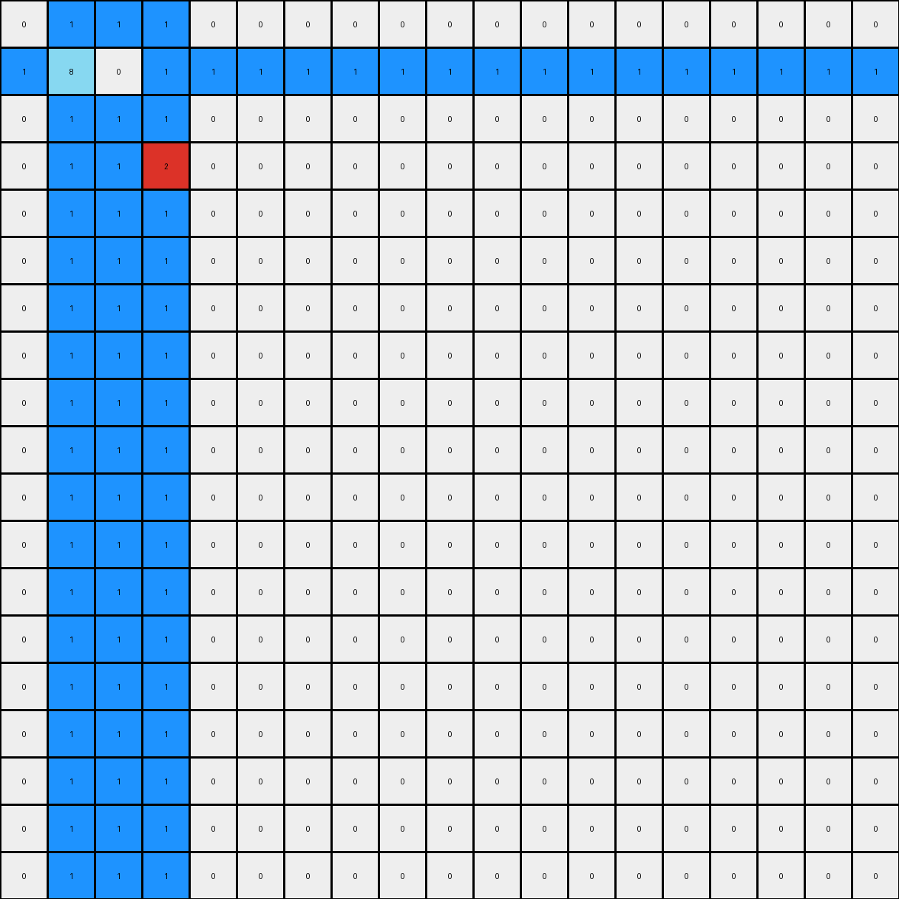
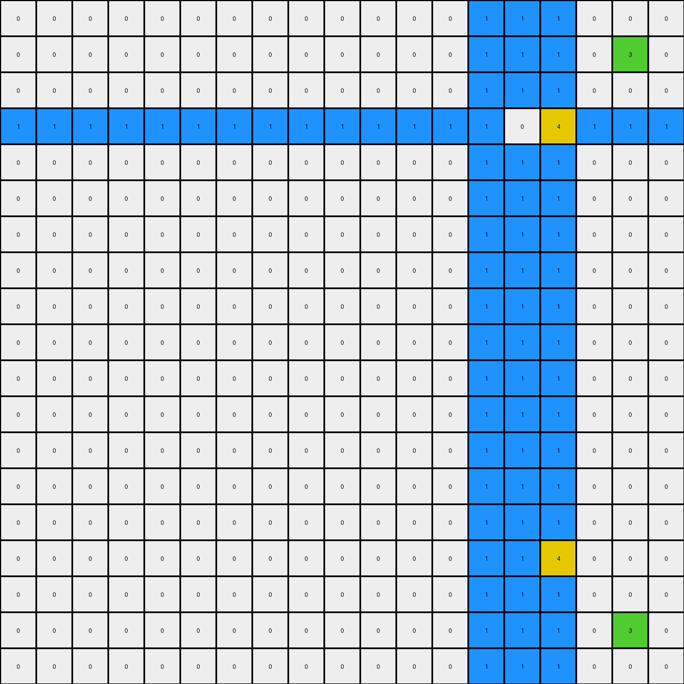
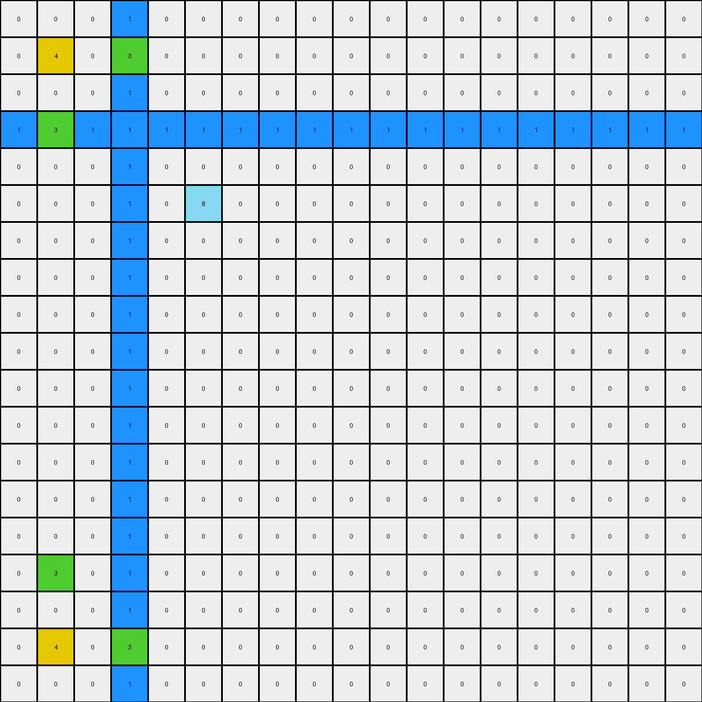

# 9d9215db • 009 • refine_dreamer

---

Previous Code:
```python
"""
1. **Identify Key Pixels:** Locate all non-white pixels (specifically blue (1), green (3), and yellow (4)) in the input grid.

2. **Mirror Green and Yellow:** For each green (3) pixel, mirror its position vertically across the center row of the grid. For each yellow pixel (4), mirror vertically across the center row.

3. **Expand Blue Pixels:**
    - Find horizontal distance from the line of blue pixels to edge of grid, on each side.
    - Create horizontal and vertical lines of blue pixels expanding out, using the distance.
    - Yellow and Green pixels in output from step 2 acts as barriers for blue pixel replication, blue will stop.
"""

import numpy as np

def get_non_white_pixels(grid):
    """Finds coordinates of non-white pixels."""
    coords = np.argwhere(grid != 0)
    return [tuple(coord) for coord in coords]

def mirror_vertically(grid, coord):
    """Mirrors a coordinate vertically across the center row."""
    center_row = grid.shape[0] // 2
    new_row = 2 * center_row - coord[0]
    return (new_row, coord[1])

def transform(input_grid):
    # initialize output_grid
    output_grid = np.copy(input_grid)
    rows, cols = input_grid.shape

    # Identify Key Pixels
    non_white_pixels = get_non_white_pixels(input_grid)

    # Mirror Green and Yellow
    for r, c in non_white_pixels:
        if input_grid[r, c] == 3 or input_grid[r,c] == 4:  # Green or yellow
            mirrored_coord = mirror_vertically(input_grid, (r, c))
            output_grid[mirrored_coord] = input_grid[r, c]

    # Expand Blue Pixels
    blue_pixels = [(r, c) for r, c in non_white_pixels if input_grid[r, c] == 1]
    if blue_pixels:
        #assumes blue pixels form a contiguous horizontal line, as per task
        min_blue_col = min(c for _, c in blue_pixels)
        max_blue_col = max(c for _, c in blue_pixels)

        #find center blue row
        blue_row = blue_pixels[0][0]

        #calculate distances
        dist_left = min_blue_col
        dist_right = cols - 1 - max_blue_col
        dist_up = blue_row
        dist_down = rows - 1 - blue_row


        #horizontal expansion (left)
        for c in range(dist_left):
           if output_grid[blue_row, c] == 0:
              output_grid[blue_row, c] = 1

        #horizontal expansion (right)
        for c in range(cols - dist_right, cols):
          if output_grid[blue_row,c] == 0:
            output_grid[blue_row, c] = 1

        #vertical expansion (up)
        for r in range(dist_up):
            for c in range(min_blue_col, max_blue_col + 1):
               if output_grid[r,c] == 0:
                output_grid[r, c] = 1

        #vertical expansion (down)
        for r in range(rows-dist_down, rows):
            for c in range(min_blue_col, max_blue_col + 1):
              if output_grid[r,c] == 0:
                output_grid[r, c] = 1
    return output_grid
```

Train Set Results:

## Example 1:

Input:
```
0 0 0 0 0 0 0 0 0 0 0 0 0 0 0 0 0 0 0
0 8 0 1 0 0 0 0 0 0 0 0 0 0 0 0 0 0 0
0 0 0 0 0 0 0 0 0 0 0 0 0 0 0 0 0 0 0
0 1 0 2 0 0 0 0 0 0 0 0 0 0 0 0 0 0 0
0 0 0 0 0 0 0 0 0 0 0 0 0 0 0 0 0 0 0
0 0 0 0 0 0 0 0 0 0 0 0 0 0 0 0 0 0 0
0 0 0 0 0 0 0 0 0 0 0 0 0 0 0 0 0 0 0
0 0 0 0 0 0 0 0 0 0 0 0 0 0 0 0 0 0 0
0 0 0 0 0 0 0 0 0 0 0 0 0 0 0 0 0 0 0
0 0 0 0 0 0 0 0 0 0 0 0 0 0 0 0 0 0 0
0 0 0 0 0 0 0 0 0 0 0 0 0 0 0 0 0 0 0
0 0 0 0 0 0 0 0 0 0 0 0 0 0 0 0 0 0 0
0 0 0 0 0 0 0 0 0 0 0 0 0 0 0 0 0 0 0
0 0 0 0 0 0 0 0 0 0 0 0 0 0 0 0 0 0 0
0 0 0 0 0 0 0 0 0 0 0 0 0 0 0 0 0 0 0
0 0 0 0 0 0 0 0 0 0 0 0 0 0 0 0 0 0 0
0 0 0 0 0 0 0 0 0 0 0 0 0 0 0 0 0 0 0
0 0 0 0 0 0 0 0 0 0 0 0 0 0 0 0 0 0 0
0 0 0 0 0 0 0 0 0 0 0 0 0 0 0 0 0 0 0
```
Expected Output:
```
0 0 0 0 0 0 0 0 0 0 0 0 0 0 0 0 0 0 0
0 8 0 1 0 1 0 1 0 1 0 1 0 1 0 1 0 8 0
0 0 0 0 0 0 0 0 0 0 0 0 0 0 0 0 0 0 0
0 1 0 2 0 0 0 0 0 0 0 0 0 0 0 2 0 1 0
0 0 0 0 0 0 0 0 0 0 0 0 0 0 0 0 0 0 0
0 1 0 0 0 0 0 0 0 0 0 0 0 0 0 0 0 1 0
0 0 0 0 0 0 0 0 0 0 0 0 0 0 0 0 0 0 0
0 1 0 0 0 0 0 0 0 0 0 0 0 0 0 0 0 1 0
0 0 0 0 0 0 0 0 0 0 0 0 0 0 0 0 0 0 0
0 1 0 0 0 0 0 0 0 0 0 0 0 0 0 0 0 1 0
0 0 0 0 0 0 0 0 0 0 0 0 0 0 0 0 0 0 0
0 1 0 0 0 0 0 0 0 0 0 0 0 0 0 0 0 1 0
0 0 0 0 0 0 0 0 0 0 0 0 0 0 0 0 0 0 0
0 1 0 0 0 0 0 0 0 0 0 0 0 0 0 0 0 1 0
0 0 0 0 0 0 0 0 0 0 0 0 0 0 0 0 0 0 0
0 1 0 2 0 0 0 0 0 0 0 0 0 0 0 2 0 1 0
0 0 0 0 0 0 0 0 0 0 0 0 0 0 0 0 0 0 0
0 8 0 1 0 1 0 1 0 1 0 1 0 1 0 1 0 8 0
0 0 0 0 0 0 0 0 0 0 0 0 0 0 0 0 0 0 0
```
Transformed Output:
```
0 1 1 1 0 0 0 0 0 0 0 0 0 0 0 0 0 0 0
1 8 0 1 1 1 1 1 1 1 1 1 1 1 1 1 1 1 1
0 1 1 1 0 0 0 0 0 0 0 0 0 0 0 0 0 0 0
0 1 1 2 0 0 0 0 0 0 0 0 0 0 0 0 0 0 0
0 1 1 1 0 0 0 0 0 0 0 0 0 0 0 0 0 0 0
0 1 1 1 0 0 0 0 0 0 0 0 0 0 0 0 0 0 0
0 1 1 1 0 0 0 0 0 0 0 0 0 0 0 0 0 0 0
0 1 1 1 0 0 0 0 0 0 0 0 0 0 0 0 0 0 0
0 1 1 1 0 0 0 0 0 0 0 0 0 0 0 0 0 0 0
0 1 1 1 0 0 0 0 0 0 0 0 0 0 0 0 0 0 0
0 1 1 1 0 0 0 0 0 0 0 0 0 0 0 0 0 0 0
0 1 1 1 0 0 0 0 0 0 0 0 0 0 0 0 0 0 0
0 1 1 1 0 0 0 0 0 0 0 0 0 0 0 0 0 0 0
0 1 1 1 0 0 0 0 0 0 0 0 0 0 0 0 0 0 0
0 1 1 1 0 0 0 0 0 0 0 0 0 0 0 0 0 0 0
0 1 1 1 0 0 0 0 0 0 0 0 0 0 0 0 0 0 0
0 1 1 1 0 0 0 0 0 0 0 0 0 0 0 0 0 0 0
0 1 1 1 0 0 0 0 0 0 0 0 0 0 0 0 0 0 0
0 1 1 1 0 0 0 0 0 0 0 0 0 0 0 0 0 0 0
```

match: False
pixels_off: 71
size_correct: True
color_palette_correct: True
correct_pixel_counts: False

## Example 2:

Input:
```
0 0 0 0 0 0 0 0 0 0 0 0 0 0 0 0 0 0 0
0 0 0 0 0 0 0 0 0 0 0 0 0 0 0 0 0 3 0
0 0 0 0 0 0 0 0 0 0 0 0 0 0 0 0 0 0 0
0 0 0 0 0 0 0 0 0 0 0 0 0 1 0 4 0 0 0
0 0 0 0 0 0 0 0 0 0 0 0 0 0 0 0 0 0 0
0 0 0 0 0 0 0 0 0 0 0 0 0 0 0 1 0 0 0
0 0 0 0 0 0 0 0 0 0 0 0 0 0 0 0 0 0 0
0 0 0 0 0 0 0 0 0 0 0 0 0 0 0 0 0 0 0
0 0 0 0 0 0 0 0 0 0 0 0 0 0 0 0 0 0 0
0 0 0 0 0 0 0 0 0 0 0 0 0 0 0 0 0 0 0
0 0 0 0 0 0 0 0 0 0 0 0 0 0 0 0 0 0 0
0 0 0 0 0 0 0 0 0 0 0 0 0 0 0 0 0 0 0
0 0 0 0 0 0 0 0 0 0 0 0 0 0 0 0 0 0 0
0 0 0 0 0 0 0 0 0 0 0 0 0 0 0 0 0 0 0
0 0 0 0 0 0 0 0 0 0 0 0 0 0 0 0 0 0 0
0 0 0 0 0 0 0 0 0 0 0 0 0 0 0 0 0 0 0
0 0 0 0 0 0 0 0 0 0 0 0 0 0 0 0 0 0 0
0 0 0 0 0 0 0 0 0 0 0 0 0 0 0 0 0 0 0
0 0 0 0 0 0 0 0 0 0 0 0 0 0 0 0 0 0 0
```
Expected Output:
```
0 0 0 0 0 0 0 0 0 0 0 0 0 0 0 0 0 0 0
0 3 0 0 0 0 0 0 0 0 0 0 0 0 0 0 0 3 0
0 0 0 0 0 0 0 0 0 0 0 0 0 0 0 0 0 0 0
0 0 0 4 0 1 0 1 0 1 0 1 0 1 0 4 0 0 0
0 0 0 0 0 0 0 0 0 0 0 0 0 0 0 0 0 0 0
0 0 0 1 0 0 0 0 0 0 0 0 0 0 0 1 0 0 0
0 0 0 0 0 0 0 0 0 0 0 0 0 0 0 0 0 0 0
0 0 0 1 0 0 0 0 0 0 0 0 0 0 0 1 0 0 0
0 0 0 0 0 0 0 0 0 0 0 0 0 0 0 0 0 0 0
0 0 0 1 0 0 0 0 0 0 0 0 0 0 0 1 0 0 0
0 0 0 0 0 0 0 0 0 0 0 0 0 0 0 0 0 0 0
0 0 0 1 0 0 0 0 0 0 0 0 0 0 0 1 0 0 0
0 0 0 0 0 0 0 0 0 0 0 0 0 0 0 0 0 0 0
0 0 0 1 0 0 0 0 0 0 0 0 0 0 0 1 0 0 0
0 0 0 0 0 0 0 0 0 0 0 0 0 0 0 0 0 0 0
0 0 0 4 0 1 0 1 0 1 0 1 0 1 0 4 0 0 0
0 0 0 0 0 0 0 0 0 0 0 0 0 0 0 0 0 0 0
0 3 0 0 0 0 0 0 0 0 0 0 0 0 0 0 0 3 0
0 0 0 0 0 0 0 0 0 0 0 0 0 0 0 0 0 0 0
```
Transformed Output:
```
0 0 0 0 0 0 0 0 0 0 0 0 0 1 1 1 0 0 0
0 0 0 0 0 0 0 0 0 0 0 0 0 1 1 1 0 3 0
0 0 0 0 0 0 0 0 0 0 0 0 0 1 1 1 0 0 0
1 1 1 1 1 1 1 1 1 1 1 1 1 1 0 4 1 1 1
0 0 0 0 0 0 0 0 0 0 0 0 0 1 1 1 0 0 0
0 0 0 0 0 0 0 0 0 0 0 0 0 1 1 1 0 0 0
0 0 0 0 0 0 0 0 0 0 0 0 0 1 1 1 0 0 0
0 0 0 0 0 0 0 0 0 0 0 0 0 1 1 1 0 0 0
0 0 0 0 0 0 0 0 0 0 0 0 0 1 1 1 0 0 0
0 0 0 0 0 0 0 0 0 0 0 0 0 1 1 1 0 0 0
0 0 0 0 0 0 0 0 0 0 0 0 0 1 1 1 0 0 0
0 0 0 0 0 0 0 0 0 0 0 0 0 1 1 1 0 0 0
0 0 0 0 0 0 0 0 0 0 0 0 0 1 1 1 0 0 0
0 0 0 0 0 0 0 0 0 0 0 0 0 1 1 1 0 0 0
0 0 0 0 0 0 0 0 0 0 0 0 0 1 1 1 0 0 0
0 0 0 0 0 0 0 0 0 0 0 0 0 1 1 4 0 0 0
0 0 0 0 0 0 0 0 0 0 0 0 0 1 1 1 0 0 0
0 0 0 0 0 0 0 0 0 0 0 0 0 1 1 1 0 3 0
0 0 0 0 0 0 0 0 0 0 0 0 0 1 1 1 0 0 0
```

match: False
pixels_off: 71
size_correct: True
color_palette_correct: True
correct_pixel_counts: False

## Example 3:

Input:
```
0 0 0 0 0 0 0 0 0 0 0 0 0 0 0 0 0 0 0
0 4 0 3 0 0 0 0 0 0 0 0 0 0 0 0 0 0 0
0 0 0 0 0 0 0 0 0 0 0 0 0 0 0 0 0 0 0
0 3 0 1 0 0 0 0 0 0 0 0 0 0 0 0 0 0 0
0 0 0 0 0 0 0 0 0 0 0 0 0 0 0 0 0 0 0
0 0 0 0 0 8 0 0 0 0 0 0 0 0 0 0 0 0 0
0 0 0 0 0 0 0 0 0 0 0 0 0 0 0 0 0 0 0
0 0 0 0 0 0 0 0 0 0 0 0 0 0 0 0 0 0 0
0 0 0 0 0 0 0 0 0 0 0 0 0 0 0 0 0 0 0
0 0 0 0 0 0 0 0 0 0 0 0 0 0 0 0 0 0 0
0 0 0 0 0 0 0 0 0 0 0 0 0 0 0 0 0 0 0
0 0 0 0 0 0 0 0 0 0 0 0 0 0 0 0 0 0 0
0 0 0 0 0 0 0 0 0 0 0 0 0 0 0 0 0 0 0
0 0 0 0 0 0 0 0 0 0 0 0 0 0 0 0 0 0 0
0 0 0 0 0 0 0 0 0 0 0 0 0 0 0 0 0 0 0
0 0 0 0 0 0 0 0 0 0 0 0 0 0 0 0 0 0 0
0 0 0 0 0 0 0 0 0 0 0 0 0 0 0 0 0 0 0
0 0 0 0 0 0 0 0 0 0 0 0 0 0 0 0 0 0 0
0 0 0 0 0 0 0 0 0 0 0 0 0 0 0 0 0 0 0
```
Expected Output:
```
0 0 0 0 0 0 0 0 0 0 0 0 0 0 0 0 0 0 0
0 4 0 3 0 3 0 3 0 3 0 3 0 3 0 3 0 4 0
0 0 0 0 0 0 0 0 0 0 0 0 0 0 0 0 0 0 0
0 3 0 1 0 0 0 0 0 0 0 0 0 0 0 1 0 3 0
0 0 0 0 0 0 0 0 0 0 0 0 0 0 0 0 0 0 0
0 3 0 0 0 8 0 0 0 0 0 0 0 8 0 0 0 3 0
0 0 0 0 0 0 0 0 0 0 0 0 0 0 0 0 0 0 0
0 3 0 0 0 0 0 0 0 0 0 0 0 0 0 0 0 3 0
0 0 0 0 0 0 0 0 0 0 0 0 0 0 0 0 0 0 0
0 3 0 0 0 0 0 0 0 0 0 0 0 0 0 0 0 3 0
0 0 0 0 0 0 0 0 0 0 0 0 0 0 0 0 0 0 0
0 3 0 0 0 0 0 0 0 0 0 0 0 0 0 0 0 3 0
0 0 0 0 0 0 0 0 0 0 0 0 0 0 0 0 0 0 0
0 3 0 0 0 8 0 0 0 0 0 0 0 8 0 0 0 3 0
0 0 0 0 0 0 0 0 0 0 0 0 0 0 0 0 0 0 0
0 3 0 1 0 0 0 0 0 0 0 0 0 0 0 1 0 3 0
0 0 0 0 0 0 0 0 0 0 0 0 0 0 0 0 0 0 0
0 4 0 3 0 3 0 3 0 3 0 3 0 3 0 3 0 4 0
0 0 0 0 0 0 0 0 0 0 0 0 0 0 0 0 0 0 0
```
Transformed Output:
```
0 0 0 1 0 0 0 0 0 0 0 0 0 0 0 0 0 0 0
0 4 0 3 0 0 0 0 0 0 0 0 0 0 0 0 0 0 0
0 0 0 1 0 0 0 0 0 0 0 0 0 0 0 0 0 0 0
1 3 1 1 1 1 1 1 1 1 1 1 1 1 1 1 1 1 1
0 0 0 1 0 0 0 0 0 0 0 0 0 0 0 0 0 0 0
0 0 0 1 0 8 0 0 0 0 0 0 0 0 0 0 0 0 0
0 0 0 1 0 0 0 0 0 0 0 0 0 0 0 0 0 0 0
0 0 0 1 0 0 0 0 0 0 0 0 0 0 0 0 0 0 0
0 0 0 1 0 0 0 0 0 0 0 0 0 0 0 0 0 0 0
0 0 0 1 0 0 0 0 0 0 0 0 0 0 0 0 0 0 0
0 0 0 1 0 0 0 0 0 0 0 0 0 0 0 0 0 0 0
0 0 0 1 0 0 0 0 0 0 0 0 0 0 0 0 0 0 0
0 0 0 1 0 0 0 0 0 0 0 0 0 0 0 0 0 0 0
0 0 0 1 0 0 0 0 0 0 0 0 0 0 0 0 0 0 0
0 0 0 1 0 0 0 0 0 0 0 0 0 0 0 0 0 0 0
0 3 0 1 0 0 0 0 0 0 0 0 0 0 0 0 0 0 0
0 0 0 1 0 0 0 0 0 0 0 0 0 0 0 0 0 0 0
0 4 0 3 0 0 0 0 0 0 0 0 0 0 0 0 0 0 0
0 0 0 1 0 0 0 0 0 0 0 0 0 0 0 0 0 0 0
```

match: False
pixels_off: 60
size_correct: True
color_palette_correct: True
correct_pixel_counts: False
**INSTRUCTIONS**

The code above was generated based on observations from the first training
example

we have tested the transform function on each of the task example inputs and
compared with the expected output

review each of the examples provided and the results and consider how the
natural language program should be updated to accommodate this new knowledge

respond with the following deliverables:

- general assessment of the information provided and strategy for resolving the
  errors
- gather metrics about each of the examples and results - use code_execution to
  develop accurate reports on your assumptions
- a YAML block documenting facts - Focus on identifying objects, their properties, and the actions performed on them.
- a natural language program - Be as clear and concise as possible, providing a complete description of the transformation rule.


your responses should be considered as information in a report - not a
conversation
