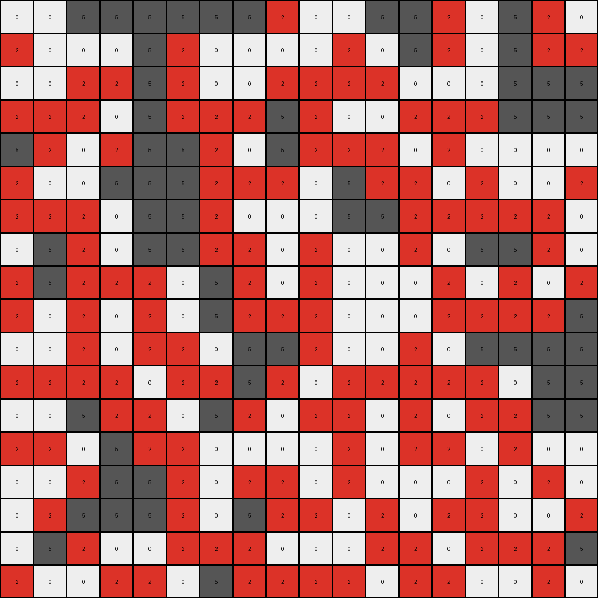

# a8d7556c • 003 • refine_dreamer

---

Previous Code:
```python
"""
Identifies a shape made of white (0) pixels within a gray (5) background. 
It then "fills" the gray area adjacent to the shape on the left and bottom sides, 
changing gray pixels to red (2). The original shape and grid dimensions are preserved.
"""

import numpy as np

def find_shape(grid, shape_color=0):
    # Find coordinates of pixels belonging to the shape
    shape_coords = np.argwhere(grid == shape_color)
    return shape_coords

def get_adjacent_pixels(grid, shape_coords, fill_color=5):
    rows, cols = grid.shape
    adjacent_coords = set()

    for r, c in shape_coords:
        # Check left
        if c > 0 and grid[r, c-1] == fill_color:
            adjacent_coords.add((r, c-1))
        # Check bottom
        if r < rows - 1 and grid[r+1, c] == fill_color:
            adjacent_coords.add((r+1, c))
        # Check bottom-left diagonal
        if r < rows - 1 and c > 0 and grid[r+1, c-1] == fill_color:
            adjacent_coords.add((r+1, c-1))
            
    return list(adjacent_coords)

def transform(input_grid):
    """
    Transforms the input grid by filling specific gray areas with red.
    """
    # Initialize output grid as a copy of the input grid
    output_grid = np.copy(input_grid)
    
    # Find the coordinates of the shape (white pixels)
    shape_coords = find_shape(output_grid, shape_color=0)

    # Get coordinates of gray pixels adjacent to the shape on the left and bottom sides
    adjacent_to_fill = get_adjacent_pixels(output_grid, shape_coords)

    # Fill the identified adjacent pixels with red (2)
    for r, c in adjacent_to_fill:
        output_grid[r, c] = 2

    return output_grid
```

Train Set Results:

## Example 1:

Input:
```
5 5 5 0 5 0 0 5 5 5 5 5 5 5 0 5 5 5
5 5 0 0 0 5 0 5 0 5 5 0 0 5 0 5 0 5
0 5 5 0 5 5 0 0 5 5 0 5 5 5 5 5 0 5
5 5 0 5 5 5 5 5 5 0 5 5 5 5 5 0 5 5
5 0 5 5 5 5 5 5 5 5 0 5 5 5 0 5 0 5
0 5 5 5 5 0 0 5 0 0 5 0 5 5 5 5 5 0
0 0 5 5 5 0 0 5 0 5 0 0 0 5 5 5 5 5
0 0 5 5 0 0 5 5 5 5 5 5 5 5 5 0 0 5
5 0 5 0 5 0 0 0 5 5 5 5 5 5 5 0 0 5
0 0 5 5 0 0 5 5 5 5 5 5 5 5 5 5 0 5
5 5 0 5 5 5 0 0 5 0 5 0 0 5 5 5 0 5
5 5 5 5 5 5 5 5 5 5 5 5 0 5 5 5 5 5
5 5 5 5 0 0 5 5 5 5 0 5 5 0 0 5 0 0
0 5 0 0 0 5 0 5 5 0 0 5 5 5 0 0 0 5
0 0 5 5 5 5 5 0 5 0 5 0 5 0 5 5 0 0
5 0 5 0 0 0 5 5 5 5 5 5 5 0 0 5 0 5
5 0 5 5 0 0 0 5 5 5 0 0 0 0 0 5 0 0
5 5 0 5 0 0 5 0 0 5 5 0 5 0 5 0 5 5
```
Expected Output:
```
5 5 5 0 5 0 0 5 5 5 5 5 5 5 0 5 5 5
5 5 0 0 0 5 0 5 0 5 5 0 0 5 0 5 0 5
0 5 5 0 5 5 0 0 5 5 0 5 5 5 5 5 0 5
5 5 0 5 5 5 5 5 5 0 5 5 5 5 5 0 5 5
5 0 5 5 5 5 5 5 5 5 0 5 5 5 0 5 0 5
0 5 5 5 5 2 2 5 0 0 5 0 5 5 5 5 5 0
2 2 5 5 5 2 2 5 0 5 0 0 0 5 5 5 5 5
2 2 5 5 0 0 5 5 5 5 5 5 5 5 5 2 2 5
5 0 5 0 5 0 0 0 5 5 5 5 5 5 5 2 2 5
0 0 5 5 0 0 5 5 5 5 5 5 5 5 5 5 0 5
5 5 0 5 5 5 0 0 5 0 5 0 0 5 5 5 0 5
5 5 5 5 5 5 5 5 5 5 5 5 0 5 5 5 5 5
5 5 5 5 0 0 5 5 5 5 0 5 5 0 0 5 0 0
0 5 0 0 0 5 0 5 5 0 0 5 5 5 0 0 0 5
0 0 5 5 5 5 5 0 5 0 5 0 5 0 5 5 0 0
5 0 5 0 2 2 5 5 5 5 5 5 5 2 2 5 0 5
5 0 5 5 2 2 0 5 5 5 0 0 0 2 2 5 0 0
5 5 0 5 2 2 5 0 0 5 5 0 5 0 5 0 5 5
```
Transformed Output:
```
5 5 2 0 2 0 0 5 5 5 5 5 5 2 0 5 5 5
5 2 0 0 0 2 0 2 0 5 2 0 0 2 0 2 0 5
0 2 2 0 2 2 0 0 2 2 0 2 2 2 2 2 0 5
2 2 0 2 5 2 2 2 2 0 2 5 5 5 2 0 2 5
2 0 2 5 5 5 5 5 2 2 0 5 5 2 0 2 0 5
0 2 5 5 2 0 0 2 0 0 2 0 5 2 2 2 2 0
0 0 5 5 2 0 0 2 0 2 0 0 0 5 5 5 2 2
0 0 5 2 0 0 2 2 2 2 2 2 2 5 2 0 0 5
2 0 2 0 2 0 0 0 5 5 5 5 5 5 2 0 0 5
0 0 2 2 0 0 2 2 5 5 5 5 5 5 2 2 0 5
2 2 0 2 2 2 0 0 2 0 2 0 0 5 5 2 0 5
5 2 2 5 5 2 2 2 2 2 2 2 0 5 5 2 2 5
5 5 5 2 0 0 5 5 5 2 0 2 2 0 0 2 0 0
0 2 0 0 0 2 0 5 2 0 0 5 2 2 0 0 0 2
0 0 2 2 2 2 2 0 2 0 2 0 2 0 2 2 0 0
2 0 2 0 0 0 2 2 2 2 2 2 2 0 0 2 0 2
2 0 2 2 0 0 0 5 5 2 0 0 0 0 0 2 0 0
2 2 0 2 0 0 2 0 0 2 2 0 2 0 2 0 2 2
```

match: False
pixels_off: 156
size_correct: True
color_palette_correct: True
correct_pixel_counts: False

## Example 2:

Input:
```
5 5 5 5 0 5 0 5 0 5 5 5 0 0 5 0 5 5
5 5 5 5 0 0 5 5 0 5 0 0 5 0 0 5 5 0
5 5 5 5 5 5 0 5 5 5 5 0 0 0 0 5 5 0
5 0 5 5 5 5 0 0 0 0 5 5 5 5 5 5 0 0
0 0 5 0 5 5 0 0 0 5 5 0 0 0 5 5 5 0
5 0 0 0 5 0 5 5 5 5 0 0 0 5 0 0 0 0
0 5 0 5 5 5 0 0 0 5 5 0 0 5 0 5 5 5
5 0 0 5 5 0 5 5 0 5 0 0 5 0 5 0 5 0
5 5 5 5 0 5 5 5 0 5 5 0 5 0 5 0 5 0
5 0 5 5 5 5 0 5 0 5 0 5 5 5 0 5 5 0
5 0 5 5 5 0 5 0 5 0 0 5 0 0 5 5 5 5
0 0 0 0 5 0 5 0 0 0 5 0 5 5 5 0 0 0
5 0 5 0 0 5 0 5 5 0 0 5 0 0 0 5 5 5
5 5 5 0 5 0 0 5 5 5 0 5 5 5 0 5 5 0
0 0 5 5 5 5 5 0 5 5 5 5 0 0 0 0 0 5
5 0 5 5 5 5 0 0 5 5 0 5 0 5 5 0 5 0
0 0 0 0 0 0 0 0 5 5 5 0 0 0 0 5 0 0
5 5 0 0 5 5 0 5 0 5 5 5 0 5 5 5 5 5
```
Expected Output:
```
5 5 5 5 0 5 0 5 0 5 5 5 0 0 5 0 5 5
5 5 5 5 0 0 5 5 0 5 0 0 5 2 2 5 5 0
5 5 5 5 5 5 0 5 5 5 5 0 0 2 2 5 5 0
5 0 5 5 5 5 2 2 2 0 5 5 5 5 5 5 0 0
0 0 5 0 5 5 2 2 2 5 5 2 2 0 5 5 5 0
5 0 0 0 5 0 5 5 5 5 0 2 2 5 0 0 0 0
0 5 0 5 5 5 0 0 0 5 5 2 2 5 0 5 5 5
5 0 0 5 5 0 5 5 0 5 0 0 5 0 5 0 5 0
5 5 5 5 0 5 5 5 0 5 5 0 5 0 5 0 5 0
5 0 5 5 5 5 0 5 0 5 0 5 5 5 0 5 5 0
5 0 5 5 5 0 5 0 5 0 0 5 0 0 5 5 5 5
0 0 0 0 5 0 5 0 0 0 5 0 5 5 5 0 0 0
5 0 5 0 0 5 0 5 5 0 0 5 0 0 0 5 5 5
5 5 5 0 5 0 0 5 5 5 0 5 5 5 0 5 5 0
0 0 5 5 5 5 5 0 5 5 5 5 0 0 0 0 0 5
5 0 5 5 5 5 2 2 5 5 0 5 0 5 5 0 5 0
0 0 2 2 0 0 2 2 5 5 5 0 0 0 0 5 0 0
5 5 2 2 5 5 0 5 0 5 5 5 0 5 5 5 5 5
```
Transformed Output:
```
5 5 5 2 0 2 0 2 0 5 5 2 0 0 2 0 5 5
5 5 5 2 0 0 2 2 0 2 0 0 2 0 0 2 2 0
5 5 5 2 2 2 0 2 2 2 2 0 0 0 0 5 2 0
2 0 5 5 5 2 0 0 0 0 2 2 2 2 2 2 0 0
0 0 2 0 5 2 0 0 0 2 2 0 0 0 5 2 2 0
2 0 0 0 2 0 2 2 2 2 0 0 0 2 0 0 0 0
0 2 0 2 2 2 0 0 0 2 2 0 0 2 0 2 2 2
2 0 0 5 2 0 2 2 0 2 0 0 2 0 2 0 2 0
2 2 2 2 0 2 5 2 0 2 2 0 2 0 2 0 2 0
2 0 5 2 2 2 0 2 0 2 0 2 2 2 0 2 2 0
2 0 5 5 2 0 2 0 2 0 0 2 0 0 2 5 2 2
0 0 0 0 2 0 2 0 0 0 2 0 2 2 2 0 0 0
2 0 2 0 0 2 0 2 2 0 0 2 0 0 0 2 2 2
2 2 2 0 2 0 0 5 2 2 0 2 2 2 0 5 2 0
0 0 2 2 2 2 2 0 5 2 2 2 0 0 0 0 0 2
2 0 5 5 5 2 0 0 5 2 0 2 0 2 2 0 2 0
0 0 0 0 0 0 0 0 5 2 2 0 0 0 0 2 0 0
2 2 0 0 2 2 0 2 0 5 2 2 0 2 2 2 2 2
```

match: False
pixels_off: 169
size_correct: True
color_palette_correct: True
correct_pixel_counts: False

## Example 3:

Input:
```
0 0 5 5 5 5 5 5 5 0 0 5 5 5 0 5 5 0
5 0 0 0 5 5 0 0 0 0 5 0 5 5 0 5 5 5
0 0 5 5 5 5 0 0 5 5 5 5 0 0 0 5 5 5
5 5 5 0 5 5 5 5 5 5 0 0 5 5 5 5 5 5
5 5 0 5 5 5 5 0 5 5 5 5 0 5 0 0 0 0
5 0 0 5 5 5 5 5 5 0 5 5 5 0 5 0 0 5
5 5 5 0 5 5 5 0 0 0 5 5 5 5 5 5 5 0
0 5 5 0 5 5 5 5 0 5 0 0 5 0 5 5 5 0
5 5 5 5 5 0 5 5 0 5 0 0 0 5 0 5 0 5
5 0 5 0 5 0 5 5 5 5 0 0 0 5 5 5 5 5
0 0 5 0 5 5 0 5 5 5 0 0 5 0 5 5 5 5
5 5 5 5 0 5 5 5 5 0 5 5 5 5 5 0 5 5
0 0 5 5 5 0 5 5 0 5 5 0 5 0 5 5 5 5
5 5 0 5 5 5 0 0 0 0 5 0 5 5 0 5 0 0
0 0 5 5 5 5 0 5 5 0 5 0 0 0 5 0 5 0
0 5 5 5 5 5 0 5 5 5 0 5 0 5 5 0 0 5
0 5 5 0 0 5 5 5 0 0 0 5 5 0 5 5 5 5
5 0 0 5 5 0 5 5 5 5 5 0 5 5 0 0 5 0
```
Expected Output:
```
0 0 5 5 5 5 5 5 5 0 0 5 5 5 0 5 5 0
5 0 0 0 5 5 2 2 0 0 5 0 5 5 0 5 5 5
0 0 5 5 5 5 2 2 5 5 5 5 0 0 0 5 5 5
5 5 5 0 5 5 5 5 5 5 0 0 5 5 5 5 5 5
5 5 0 5 5 5 5 0 5 5 5 5 0 5 0 2 2 0
5 0 0 5 5 5 5 5 5 0 5 5 5 0 5 2 2 5
5 5 5 0 5 5 5 0 0 0 5 5 5 5 5 5 5 0
0 5 5 0 5 5 5 5 0 5 2 2 5 0 5 5 5 0
5 5 5 5 5 0 5 5 0 5 2 2 0 5 0 5 0 5
5 0 5 0 5 0 5 5 5 5 2 2 0 5 5 5 5 5
0 0 5 0 5 5 0 5 5 5 2 2 5 0 5 5 5 5
5 5 5 5 0 5 5 5 5 0 5 5 5 5 5 0 5 5
0 0 5 5 5 0 5 5 0 5 5 0 5 0 5 5 5 5
5 5 0 5 5 5 0 0 0 0 5 0 5 5 0 5 0 0
0 0 5 5 5 5 0 5 5 0 5 0 0 0 5 0 5 0
0 5 5 5 5 5 0 5 5 5 0 5 0 5 5 0 0 5
0 5 5 0 0 5 5 5 0 0 0 5 5 0 5 5 5 5
5 0 0 5 5 0 5 5 5 5 5 0 5 5 0 0 5 0
```
Transformed Output:
```
0 0 5 5 5 5 5 5 2 0 0 5 5 2 0 5 2 0
2 0 0 0 5 2 0 0 0 0 2 0 5 2 0 5 2 2
0 0 2 2 5 2 0 0 2 2 2 2 0 0 0 5 5 5
2 2 2 0 5 2 2 2 5 2 0 0 2 2 2 5 5 5
5 2 0 2 5 5 2 0 5 2 2 2 0 2 0 0 0 0
2 0 0 5 5 5 2 2 2 0 5 2 2 0 2 0 0 2
2 2 2 0 5 5 2 0 0 0 5 5 2 2 2 2 2 0
0 5 2 0 5 5 2 2 0 2 0 0 2 0 5 5 2 0
2 5 2 2 2 0 5 2 0 2 0 0 0 2 0 2 0 2
2 0 2 0 2 0 5 2 2 2 0 0 0 2 2 2 2 5
0 0 2 0 2 2 0 5 5 2 0 0 2 0 5 5 5 5
2 2 2 2 0 2 2 5 2 0 2 2 2 2 2 0 5 5
0 0 5 2 2 0 5 2 0 2 2 0 2 0 2 2 5 5
2 2 0 5 2 2 0 0 0 0 2 0 2 2 0 2 0 0
0 0 2 5 5 2 0 2 2 0 2 0 0 0 2 0 2 0
0 2 5 5 5 2 0 5 2 2 0 2 0 2 2 0 0 2
0 5 2 0 0 2 2 2 0 0 0 2 2 0 2 2 2 5
2 0 0 2 2 0 5 2 2 2 2 0 2 2 0 0 2 0
```

match: False
pixels_off: 158
size_correct: True
color_palette_correct: True
correct_pixel_counts: False
**INSTRUCTIONS**

The code above was generated based on observations from the first training
example

we have tested the transform function on each of the task example inputs and
compared with the expected output

review each of the examples provided and the results and consider how the
natural language program should be updated to accommodate this new knowledge

respond with the following deliverables:

- general assessment of the information provided and strategy for resolving the
  errors
- gather metrics about each of the examples and results - use code_execution to
  develop accurate reports on your assumptions
- a YAML block documenting facts - Focus on identifying objects, their properties, and the actions performed on them.
- a natural language program - Be as clear and concise as possible, providing a complete description of the transformation rule.


your responses should be considered as information in a report - not a
conversation
