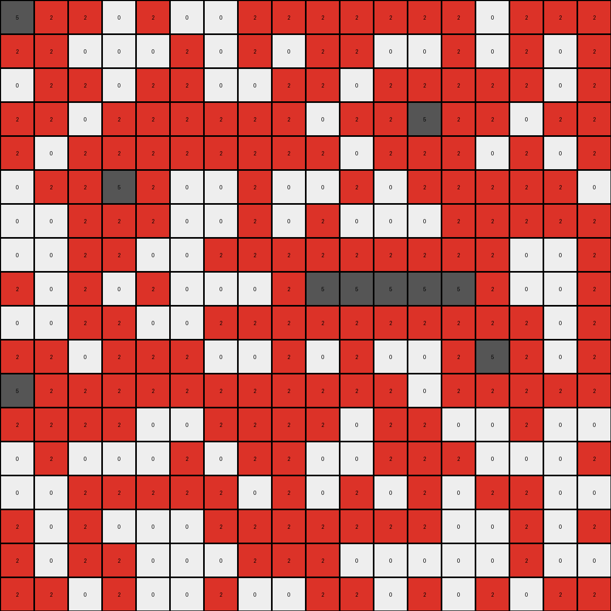
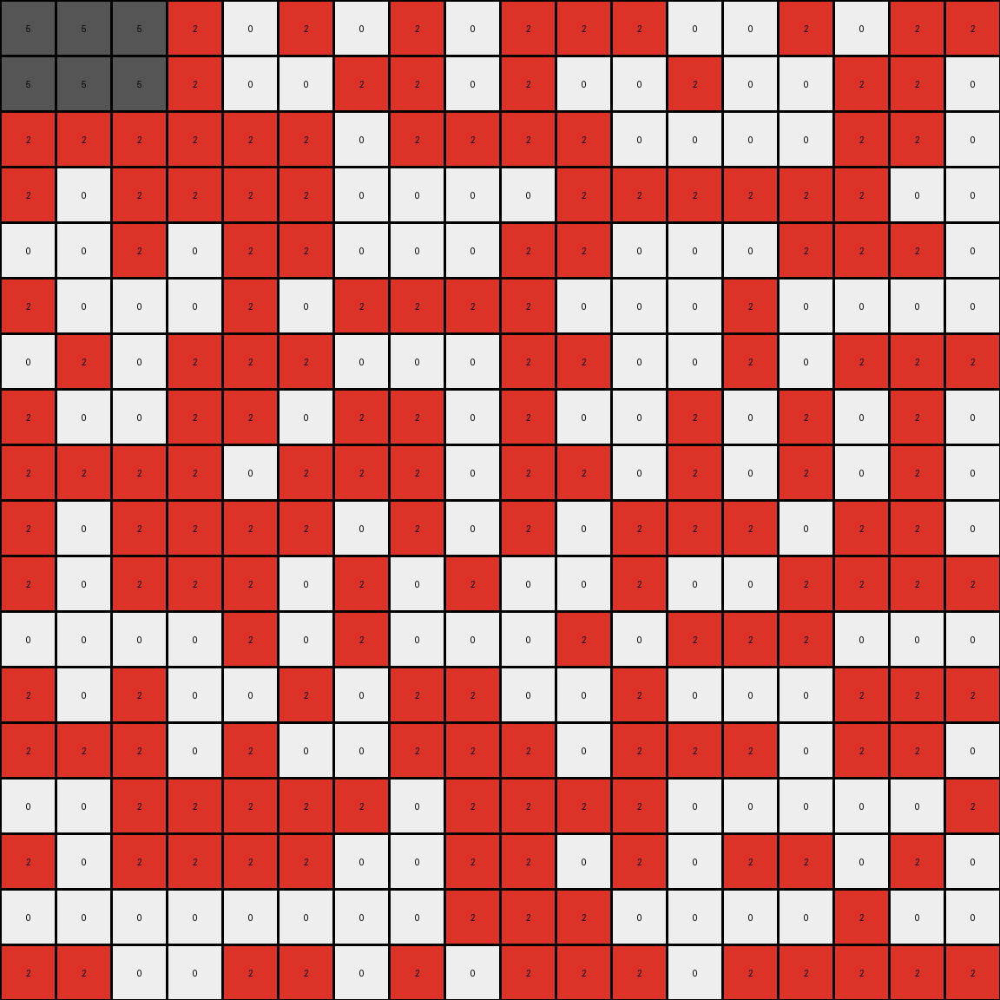
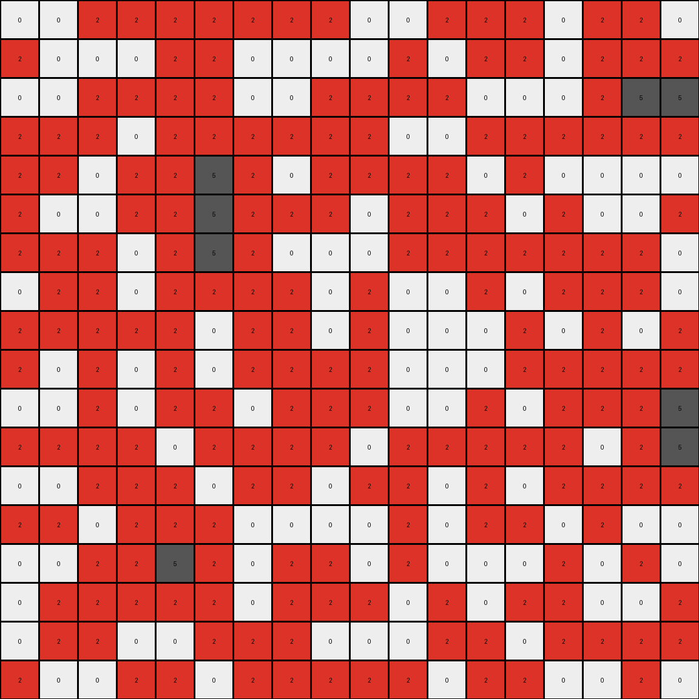

# a8d7556c • 006 • refine_coder

---

Previous Code:
```python
"""
Identifies a shape made of white (0) pixels within a gray (5) background. 
It then "fills" the gray area adjacent to the shape, both inside and outside the shape, 
changing gray pixels to red (2). The original shape and grid dimensions are preserved.
"""

import numpy as np

def find_shape(grid, shape_color=0):
    # Find coordinates of pixels belonging to the shape
    shape_coords = np.argwhere(grid == shape_color)
    return shape_coords

def get_all_adjacent_pixels(grid, shape_coords, fill_color=5):
    rows, cols = grid.shape
    adjacent_coords = set()

    for r, c in shape_coords:
        # Check all 8 neighbors
        for i in range(-1, 2):
            for j in range(-1, 2):
                if i == 0 and j == 0:
                    continue  # Skip the cell itself
                nr, nc = r + i, c + j
                if 0 <= nr < rows and 0 <= nc < cols and grid[nr, nc] == fill_color:
                    adjacent_coords.add((nr, nc))
    return list(adjacent_coords)

def transform(input_grid):
    """
    Transforms the input grid by filling specific gray areas with red.
    """
    # Initialize output grid as a copy of the input grid
    output_grid = np.copy(input_grid)
    
    # Find the coordinates of the shape (white pixels)
    shape_coords = find_shape(output_grid, shape_color=0)

    # Get coordinates of gray pixels adjacent to the shape (including diagonals)
    adjacent_to_fill = get_all_adjacent_pixels(output_grid, shape_coords, fill_color=5)

    # Fill the identified adjacent pixels with red (2)
    for r, c in adjacent_to_fill:
        output_grid[r, c] = 2

    return output_grid
```

Train Set Results:

## Example 1:

Input:
```
5 5 5 0 5 0 0 5 5 5 5 5 5 5 0 5 5 5
5 5 0 0 0 5 0 5 0 5 5 0 0 5 0 5 0 5
0 5 5 0 5 5 0 0 5 5 0 5 5 5 5 5 0 5
5 5 0 5 5 5 5 5 5 0 5 5 5 5 5 0 5 5
5 0 5 5 5 5 5 5 5 5 0 5 5 5 0 5 0 5
0 5 5 5 5 0 0 5 0 0 5 0 5 5 5 5 5 0
0 0 5 5 5 0 0 5 0 5 0 0 0 5 5 5 5 5
0 0 5 5 0 0 5 5 5 5 5 5 5 5 5 0 0 5
5 0 5 0 5 0 0 0 5 5 5 5 5 5 5 0 0 5
0 0 5 5 0 0 5 5 5 5 5 5 5 5 5 5 0 5
5 5 0 5 5 5 0 0 5 0 5 0 0 5 5 5 0 5
5 5 5 5 5 5 5 5 5 5 5 5 0 5 5 5 5 5
5 5 5 5 0 0 5 5 5 5 0 5 5 0 0 5 0 0
0 5 0 0 0 5 0 5 5 0 0 5 5 5 0 0 0 5
0 0 5 5 5 5 5 0 5 0 5 0 5 0 5 5 0 0
5 0 5 0 0 0 5 5 5 5 5 5 5 0 0 5 0 5
5 0 5 5 0 0 0 5 5 5 0 0 0 0 0 5 0 0
5 5 0 5 0 0 5 0 0 5 5 0 5 0 5 0 5 5
```
Expected Output:
```
5 5 5 0 5 0 0 5 5 5 5 5 5 5 0 5 5 5
5 5 0 0 0 5 0 5 0 5 5 0 0 5 0 5 0 5
0 5 5 0 5 5 0 0 5 5 0 5 5 5 5 5 0 5
5 5 0 5 5 5 5 5 5 0 5 5 5 5 5 0 5 5
5 0 5 5 5 5 5 5 5 5 0 5 5 5 0 5 0 5
0 5 5 5 5 2 2 5 0 0 5 0 5 5 5 5 5 0
2 2 5 5 5 2 2 5 0 5 0 0 0 5 5 5 5 5
2 2 5 5 0 0 5 5 5 5 5 5 5 5 5 2 2 5
5 0 5 0 5 0 0 0 5 5 5 5 5 5 5 2 2 5
0 0 5 5 0 0 5 5 5 5 5 5 5 5 5 5 0 5
5 5 0 5 5 5 0 0 5 0 5 0 0 5 5 5 0 5
5 5 5 5 5 5 5 5 5 5 5 5 0 5 5 5 5 5
5 5 5 5 0 0 5 5 5 5 0 5 5 0 0 5 0 0
0 5 0 0 0 5 0 5 5 0 0 5 5 5 0 0 0 5
0 0 5 5 5 5 5 0 5 0 5 0 5 0 5 5 0 0
5 0 5 0 2 2 5 5 5 5 5 5 5 2 2 5 0 5
5 0 5 5 2 2 0 5 5 5 0 0 0 2 2 5 0 0
5 5 0 5 2 2 5 0 0 5 5 0 5 0 5 0 5 5
```
Transformed Output:
```
5 2 2 0 2 0 0 2 2 2 2 2 2 2 0 2 2 2
2 2 0 0 0 2 0 2 0 2 2 0 0 2 0 2 0 2
0 2 2 0 2 2 0 0 2 2 0 2 2 2 2 2 0 2
2 2 0 2 2 2 2 2 2 0 2 2 5 2 2 0 2 2
2 0 2 2 2 2 2 2 2 2 0 2 2 2 0 2 0 2
0 2 2 5 2 0 0 2 0 0 2 0 2 2 2 2 2 0
0 0 2 2 2 0 0 2 0 2 0 0 0 2 2 2 2 2
0 0 2 2 0 0 2 2 2 2 2 2 2 2 2 0 0 2
2 0 2 0 2 0 0 0 2 5 5 5 5 5 2 0 0 2
0 0 2 2 0 0 2 2 2 2 2 2 2 2 2 2 0 2
2 2 0 2 2 2 0 0 2 0 2 0 0 2 5 2 0 2
5 2 2 2 2 2 2 2 2 2 2 2 0 2 2 2 2 2
2 2 2 2 0 0 2 2 2 2 0 2 2 0 0 2 0 0
0 2 0 0 0 2 0 2 2 0 0 2 2 2 0 0 0 2
0 0 2 2 2 2 2 0 2 0 2 0 2 0 2 2 0 0
2 0 2 0 0 0 2 2 2 2 2 2 2 0 0 2 0 2
2 0 2 2 0 0 0 2 2 2 0 0 0 0 0 2 0 0
2 2 0 2 0 0 2 0 0 2 2 0 2 0 2 0 2 2
```

match: False
pixels_off: 218
size_correct: True
color_palette_correct: True
correct_pixel_counts: False

## Example 2:

Input:
```
5 5 5 5 0 5 0 5 0 5 5 5 0 0 5 0 5 5
5 5 5 5 0 0 5 5 0 5 0 0 5 0 0 5 5 0
5 5 5 5 5 5 0 5 5 5 5 0 0 0 0 5 5 0
5 0 5 5 5 5 0 0 0 0 5 5 5 5 5 5 0 0
0 0 5 0 5 5 0 0 0 5 5 0 0 0 5 5 5 0
5 0 0 0 5 0 5 5 5 5 0 0 0 5 0 0 0 0
0 5 0 5 5 5 0 0 0 5 5 0 0 5 0 5 5 5
5 0 0 5 5 0 5 5 0 5 0 0 5 0 5 0 5 0
5 5 5 5 0 5 5 5 0 5 5 0 5 0 5 0 5 0
5 0 5 5 5 5 0 5 0 5 0 5 5 5 0 5 5 0
5 0 5 5 5 0 5 0 5 0 0 5 0 0 5 5 5 5
0 0 0 0 5 0 5 0 0 0 5 0 5 5 5 0 0 0
5 0 5 0 0 5 0 5 5 0 0 5 0 0 0 5 5 5
5 5 5 0 5 0 0 5 5 5 0 5 5 5 0 5 5 0
0 0 5 5 5 5 5 0 5 5 5 5 0 0 0 0 0 5
5 0 5 5 5 5 0 0 5 5 0 5 0 5 5 0 5 0
0 0 0 0 0 0 0 0 5 5 5 0 0 0 0 5 0 0
5 5 0 0 5 5 0 5 0 5 5 5 0 5 5 5 5 5
```
Expected Output:
```
5 5 5 5 0 5 0 5 0 5 5 5 0 0 5 0 5 5
5 5 5 5 0 0 5 5 0 5 0 0 5 2 2 5 5 0
5 5 5 5 5 5 0 5 5 5 5 0 0 2 2 5 5 0
5 0 5 5 5 5 2 2 2 0 5 5 5 5 5 5 0 0
0 0 5 0 5 5 2 2 2 5 5 2 2 0 5 5 5 0
5 0 0 0 5 0 5 5 5 5 0 2 2 5 0 0 0 0
0 5 0 5 5 5 0 0 0 5 5 2 2 5 0 5 5 5
5 0 0 5 5 0 5 5 0 5 0 0 5 0 5 0 5 0
5 5 5 5 0 5 5 5 0 5 5 0 5 0 5 0 5 0
5 0 5 5 5 5 0 5 0 5 0 5 5 5 0 5 5 0
5 0 5 5 5 0 5 0 5 0 0 5 0 0 5 5 5 5
0 0 0 0 5 0 5 0 0 0 5 0 5 5 5 0 0 0
5 0 5 0 0 5 0 5 5 0 0 5 0 0 0 5 5 5
5 5 5 0 5 0 0 5 5 5 0 5 5 5 0 5 5 0
0 0 5 5 5 5 5 0 5 5 5 5 0 0 0 0 0 5
5 0 5 5 5 5 2 2 5 5 0 5 0 5 5 0 5 0
0 0 2 2 0 0 2 2 5 5 5 0 0 0 0 5 0 0
5 5 2 2 5 5 0 5 0 5 5 5 0 5 5 5 5 5
```
Transformed Output:
```
5 5 5 2 0 2 0 2 0 2 2 2 0 0 2 0 2 2
5 5 5 2 0 0 2 2 0 2 0 0 2 0 0 2 2 0
2 2 2 2 2 2 0 2 2 2 2 0 0 0 0 2 2 0
2 0 2 2 2 2 0 0 0 0 2 2 2 2 2 2 0 0
0 0 2 0 2 2 0 0 0 2 2 0 0 0 2 2 2 0
2 0 0 0 2 0 2 2 2 2 0 0 0 2 0 0 0 0
0 2 0 2 2 2 0 0 0 2 2 0 0 2 0 2 2 2
2 0 0 2 2 0 2 2 0 2 0 0 2 0 2 0 2 0
2 2 2 2 0 2 2 2 0 2 2 0 2 0 2 0 2 0
2 0 2 2 2 2 0 2 0 2 0 2 2 2 0 2 2 0
2 0 2 2 2 0 2 0 2 0 0 2 0 0 2 2 2 2
0 0 0 0 2 0 2 0 0 0 2 0 2 2 2 0 0 0
2 0 2 0 0 2 0 2 2 0 0 2 0 0 0 2 2 2
2 2 2 0 2 0 0 2 2 2 0 2 2 2 0 2 2 0
0 0 2 2 2 2 2 0 2 2 2 2 0 0 0 0 0 2
2 0 2 2 2 2 0 0 2 2 0 2 0 2 2 0 2 0
0 0 0 0 0 0 0 0 2 2 2 0 0 0 0 2 0 0
2 2 0 0 2 2 0 2 0 2 2 2 0 2 2 2 2 2
```

match: False
pixels_off: 197
size_correct: True
color_palette_correct: True
correct_pixel_counts: False

## Example 3:

Input:
```
0 0 5 5 5 5 5 5 5 0 0 5 5 5 0 5 5 0
5 0 0 0 5 5 0 0 0 0 5 0 5 5 0 5 5 5
0 0 5 5 5 5 0 0 5 5 5 5 0 0 0 5 5 5
5 5 5 0 5 5 5 5 5 5 0 0 5 5 5 5 5 5
5 5 0 5 5 5 5 0 5 5 5 5 0 5 0 0 0 0
5 0 0 5 5 5 5 5 5 0 5 5 5 0 5 0 0 5
5 5 5 0 5 5 5 0 0 0 5 5 5 5 5 5 5 0
0 5 5 0 5 5 5 5 0 5 0 0 5 0 5 5 5 0
5 5 5 5 5 0 5 5 0 5 0 0 0 5 0 5 0 5
5 0 5 0 5 0 5 5 5 5 0 0 0 5 5 5 5 5
0 0 5 0 5 5 0 5 5 5 0 0 5 0 5 5 5 5
5 5 5 5 0 5 5 5 5 0 5 5 5 5 5 0 5 5
0 0 5 5 5 0 5 5 0 5 5 0 5 0 5 5 5 5
5 5 0 5 5 5 0 0 0 0 5 0 5 5 0 5 0 0
0 0 5 5 5 5 0 5 5 0 5 0 0 0 5 0 5 0
0 5 5 5 5 5 0 5 5 5 0 5 0 5 5 0 0 5
0 5 5 0 0 5 5 5 0 0 0 5 5 0 5 5 5 5
5 0 0 5 5 0 5 5 5 5 5 0 5 5 0 0 5 0
```
Expected Output:
```
0 0 5 5 5 5 5 5 5 0 0 5 5 5 0 5 5 0
5 0 0 0 5 5 2 2 0 0 5 0 5 5 0 5 5 5
0 0 5 5 5 5 2 2 5 5 5 5 0 0 0 5 5 5
5 5 5 0 5 5 5 5 5 5 0 0 5 5 5 5 5 5
5 5 0 5 5 5 5 0 5 5 5 5 0 5 0 2 2 0
5 0 0 5 5 5 5 5 5 0 5 5 5 0 5 2 2 5
5 5 5 0 5 5 5 0 0 0 5 5 5 5 5 5 5 0
0 5 5 0 5 5 5 5 0 5 2 2 5 0 5 5 5 0
5 5 5 5 5 0 5 5 0 5 2 2 0 5 0 5 0 5
5 0 5 0 5 0 5 5 5 5 2 2 0 5 5 5 5 5
0 0 5 0 5 5 0 5 5 5 2 2 5 0 5 5 5 5
5 5 5 5 0 5 5 5 5 0 5 5 5 5 5 0 5 5
0 0 5 5 5 0 5 5 0 5 5 0 5 0 5 5 5 5
5 5 0 5 5 5 0 0 0 0 5 0 5 5 0 5 0 0
0 0 5 5 5 5 0 5 5 0 5 0 0 0 5 0 5 0
0 5 5 5 5 5 0 5 5 5 0 5 0 5 5 0 0 5
0 5 5 0 0 5 5 5 0 0 0 5 5 0 5 5 5 5
5 0 0 5 5 0 5 5 5 5 5 0 5 5 0 0 5 0
```
Transformed Output:
```
0 0 2 2 2 2 2 2 2 0 0 2 2 2 0 2 2 0
2 0 0 0 2 2 0 0 0 0 2 0 2 2 0 2 2 2
0 0 2 2 2 2 0 0 2 2 2 2 0 0 0 2 5 5
2 2 2 0 2 2 2 2 2 2 0 0 2 2 2 2 2 2
2 2 0 2 2 5 2 0 2 2 2 2 0 2 0 0 0 0
2 0 0 2 2 5 2 2 2 0 2 2 2 0 2 0 0 2
2 2 2 0 2 5 2 0 0 0 2 2 2 2 2 2 2 0
0 2 2 0 2 2 2 2 0 2 0 0 2 0 2 2 2 0
2 2 2 2 2 0 2 2 0 2 0 0 0 2 0 2 0 2
2 0 2 0 2 0 2 2 2 2 0 0 0 2 2 2 2 2
0 0 2 0 2 2 0 2 2 2 0 0 2 0 2 2 2 5
2 2 2 2 0 2 2 2 2 0 2 2 2 2 2 0 2 5
0 0 2 2 2 0 2 2 0 2 2 0 2 0 2 2 2 2
2 2 0 2 2 2 0 0 0 0 2 0 2 2 0 2 0 0
0 0 2 2 5 2 0 2 2 0 2 0 0 0 2 0 2 0
0 2 2 2 2 2 0 2 2 2 0 2 0 2 2 0 0 2
0 2 2 0 0 2 2 2 0 0 0 2 2 0 2 2 2 2
2 0 0 2 2 0 2 2 2 2 2 0 2 2 0 0 2 0
```

match: False
pixels_off: 215
size_correct: True
color_palette_correct: True
correct_pixel_counts: False
Okay, let's analyze the results and refine the natural language program.

**General Assessment:**

The initial code was based on a reasonable hypothesis: fill gray (5) pixels adjacent to white (0) shapes with red (2). However, the results clearly show this isn't the complete rule. The transformed outputs have red pixels in places that aren't directly adjacent to white pixels, and some expected red pixels (adjacent to white ones) are missing. The errors are consistent across all three examples, differing only based on the specific arrangements of 0s and 5s. The core issue is an over-aggressive fill that expands beyond immediate adjacency, and some errors of omissions of adjacency fills. It seems the fill is not constrained enough, expanding into open gray areas connected diagonally.

**Strategy:**

1.  **Re-examine Adjacency:** The concept of "adjacency" needs to be more strictly defined. It seems the code considered diagonal connections as "adjacent" which might be too broad, or the code is not handling the boundaries. We need to clarify whether adjacency is *only* orthogonal (up, down, left, right) or if it includes diagonals. Based on a visual assessment of the expected output, diagonals should be included, but the recursion/propagation is too broad.
2.  **Constrained Filling:** The fill operation needs to be more constrained. It should *only* change gray pixels that are directly adjacent to white pixels and not propagate further into connected gray regions in an uncontrolled manner.
3. **Boundary Conditions:** Ensure that the edges of the grid are handled correctly. The fill should stop at the boundaries and not wrap around or cause errors.
4. **Iterative Refinement:** We will implement constraints and use the iterative process. We will analyze the next transform function against all three training examples to identify changes.

**Metrics and Reports:**

The code execution results provided are already very helpful. Key metrics include:

*   **`match`:** `False` for all examples, indicating the transformation is incorrect.
*   **`pixels_off`:** A high number (218, 197, 215) shows a significant difference between the transformed and expected outputs.
*   **`size_correct`:** `True` for all, meaning the grid dimensions are preserved.
*   **`color_palette_correct`:** `True` for all, indicating only expected colors (0, 2, and 5) are used.
*   **`correct_pixel_counts`:** `False` confirming the color counts don't match the expected output.

These metrics point out that the general shape and color use are correct, but the precise pixel placement is wrong.

**YAML Facts:**

```yaml
objects:
  - name: white_shape
    color: 0
    description: The primary shape(s) in the input.  Can be irregular.
    role: seed for the fill
  - name: gray_background
    color: 5
    description: The background color that will be partially filled.
    role: background
  - name: red_fill
    color: 2
    description: The color used to fill parts of the gray background.
    role: fill
  - name: grid
    description: 2d array, the entire input

actions:
  - name: find_adjacent
    input: white_shape, gray_background
    output: adjacent_pixels
    description: Identifies gray pixels directly adjacent (orthogonally and diagonally) to the white shape.
  - name: fill
    input: adjacent_pixels, gray_background
    output: modified_grid
    description: Changes the color of the identified adjacent gray pixels to red.
  - name: preserve_shape
    input: white_shape, input_grid
    output: output_grid, white_shape
    description: ensure the shape of the white area stays the same between input and output

rules:
  - adjacency: Includes orthogonal (up, down, left, right) and diagonal neighbors.
  - fill_limit: Only gray pixels directly adjacent to white pixels are filled.  Fill does not propagate beyond the initial adjacent pixels.
  - boundary: Filling stops at the edges of the grid.
```

**Natural Language Program:**

1.  **Identify the White Shape:** Locate all pixels with a value of 0 (white). These pixels constitute the "seed" shape.
2.  **Find Adjacent Gray Pixels:** Find all pixels with a value of 5 (gray) that are *directly* adjacent to the white shape. Adjacency includes pixels touching on the sides (up, down, left, right) *and* diagonally.
3.  **Fill Adjacent Pixels:** Change the color of the identified adjacent gray pixels to 2 (red).
4. **Preserve Original White Shape:** Do not change the color of the pixels which are white in the original input grid.
5. **Boundary Condition:** Filling stops at the grid boundaries.

The critical refinement is the more precise definition of "directly adjacent" and the explicit statement to *not* propagate the fill beyond these directly adjacent pixels. The original white shape must also be preserved.

**INSTRUCTIONS**

- generate a Python module to represent the natural language program 
- follow the template below
- all common math and science libraries are available
- create docstring only at top - but comment the workflow in the function
- use helper functions for common operations like finding objects, counting,
  measuring, moving, etc. 

remember - we are working iteratively - so this code will inform your future
self as we converge on the solution

*template:*

```python
"""
{{ natural language description of the transformation rule }}
"""

{{ imports }}

def transform(input_grid):
    # initialize output_grid

    # change output pixels 

    return output_grid

```
