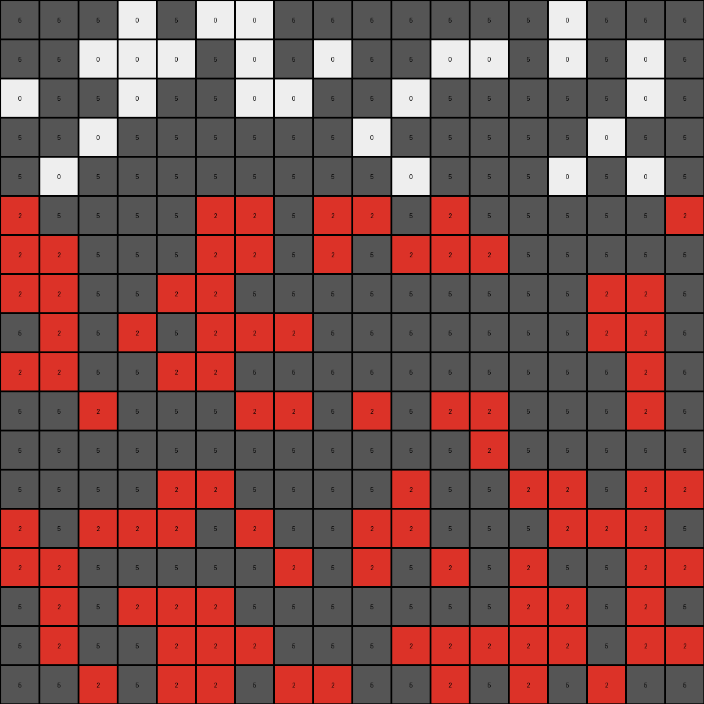
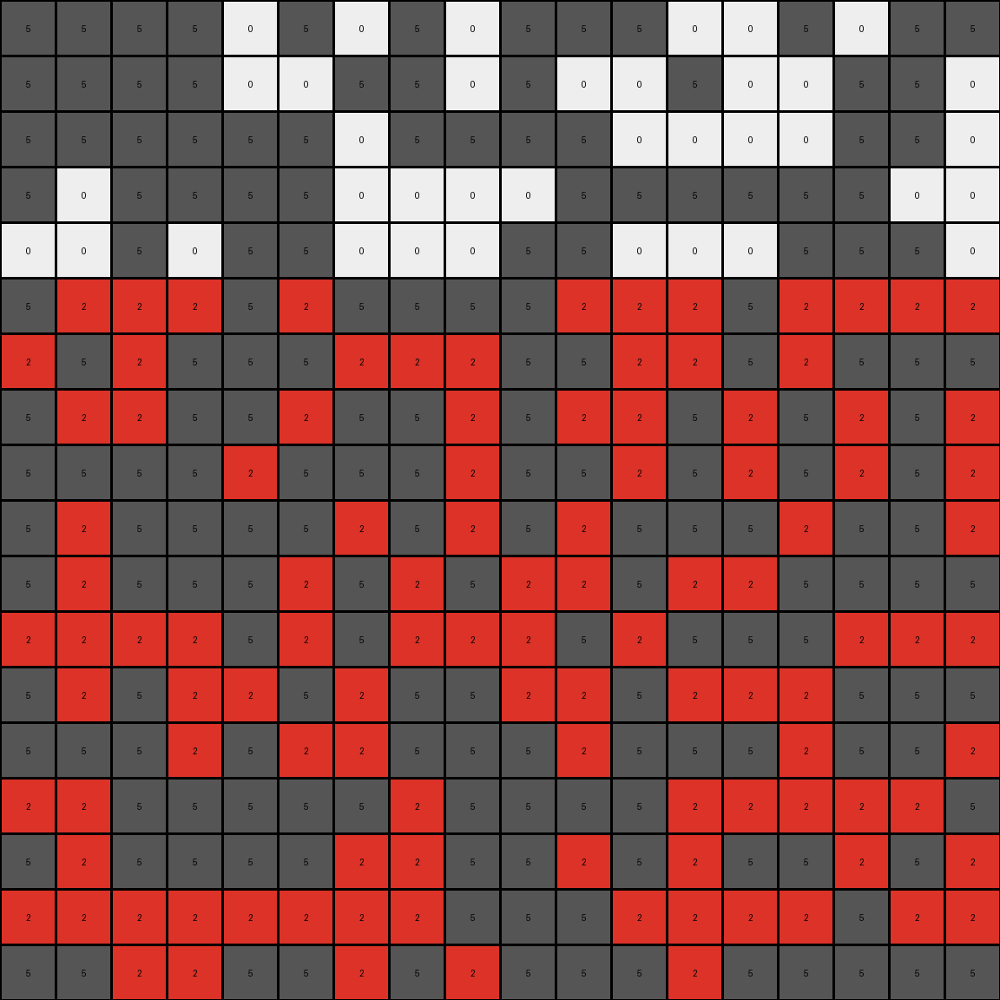

# a8d7556c • 009 • refine_dreamer

---

Previous Code:
```python
"""
1.  **Identify Regions:** Examine the input grid and identify enclosed regions of white (0) pixels that are completely surrounded by gray (5) pixels. These regions may have irregular shapes.

2.  **Selective Filling:** Starting at row index 5, and moving left to right, and downward by one row, for all regions identified in the prior stage: if there is white (0) pixel, paint it and every pixel to the right of it, until the next grey pixel, with '2'.
    - continue until the last row of the output

3.  **Preserve Boundaries:** The gray (5) pixels in the input grid remain unchanged in the output grid. Their positions define the boundaries for the filling operation.

4.  **Unfilled Regions:** Some white (0) regions may not be modified because it is before row 5, based on the selective filling criteria above.
"""

import numpy as np

def transform(input_grid):
    """Transforms the input grid according to the defined rules."""

    output_grid = np.copy(input_grid)
    rows, cols = output_grid.shape

    # Iterate through rows starting from index 5
    for i in range(5, rows):
        # Iterate through columns
        for j in range(cols):
            # Check if the current pixel is white (0)
            if output_grid[i, j] == 0:
                # Fill with red (2) to the right until a gray (5) pixel is encountered
                for k in range(j, cols):
                    if output_grid[i, k] == 0:
                        output_grid[i, k] = 2
                    elif output_grid[i,k] == 5:
                        break; #stop when a gray pixel is encountered
    return output_grid
```

Train Set Results:

## Example 1:

Input:
```
5 5 5 0 5 0 0 5 5 5 5 5 5 5 0 5 5 5
5 5 0 0 0 5 0 5 0 5 5 0 0 5 0 5 0 5
0 5 5 0 5 5 0 0 5 5 0 5 5 5 5 5 0 5
5 5 0 5 5 5 5 5 5 0 5 5 5 5 5 0 5 5
5 0 5 5 5 5 5 5 5 5 0 5 5 5 0 5 0 5
0 5 5 5 5 0 0 5 0 0 5 0 5 5 5 5 5 0
0 0 5 5 5 0 0 5 0 5 0 0 0 5 5 5 5 5
0 0 5 5 0 0 5 5 5 5 5 5 5 5 5 0 0 5
5 0 5 0 5 0 0 0 5 5 5 5 5 5 5 0 0 5
0 0 5 5 0 0 5 5 5 5 5 5 5 5 5 5 0 5
5 5 0 5 5 5 0 0 5 0 5 0 0 5 5 5 0 5
5 5 5 5 5 5 5 5 5 5 5 5 0 5 5 5 5 5
5 5 5 5 0 0 5 5 5 5 0 5 5 0 0 5 0 0
0 5 0 0 0 5 0 5 5 0 0 5 5 5 0 0 0 5
0 0 5 5 5 5 5 0 5 0 5 0 5 0 5 5 0 0
5 0 5 0 0 0 5 5 5 5 5 5 5 0 0 5 0 5
5 0 5 5 0 0 0 5 5 5 0 0 0 0 0 5 0 0
5 5 0 5 0 0 5 0 0 5 5 0 5 0 5 0 5 5
```
Expected Output:
```
5 5 5 0 5 0 0 5 5 5 5 5 5 5 0 5 5 5
5 5 0 0 0 5 0 5 0 5 5 0 0 5 0 5 0 5
0 5 5 0 5 5 0 0 5 5 0 5 5 5 5 5 0 5
5 5 0 5 5 5 5 5 5 0 5 5 5 5 5 0 5 5
5 0 5 5 5 5 5 5 5 5 0 5 5 5 0 5 0 5
0 5 5 5 5 2 2 5 0 0 5 0 5 5 5 5 5 0
2 2 5 5 5 2 2 5 0 5 0 0 0 5 5 5 5 5
2 2 5 5 0 0 5 5 5 5 5 5 5 5 5 2 2 5
5 0 5 0 5 0 0 0 5 5 5 5 5 5 5 2 2 5
0 0 5 5 0 0 5 5 5 5 5 5 5 5 5 5 0 5
5 5 0 5 5 5 0 0 5 0 5 0 0 5 5 5 0 5
5 5 5 5 5 5 5 5 5 5 5 5 0 5 5 5 5 5
5 5 5 5 0 0 5 5 5 5 0 5 5 0 0 5 0 0
0 5 0 0 0 5 0 5 5 0 0 5 5 5 0 0 0 5
0 0 5 5 5 5 5 0 5 0 5 0 5 0 5 5 0 0
5 0 5 0 2 2 5 5 5 5 5 5 5 2 2 5 0 5
5 0 5 5 2 2 0 5 5 5 0 0 0 2 2 5 0 0
5 5 0 5 2 2 5 0 0 5 5 0 5 0 5 0 5 5
```
Transformed Output:
```
5 5 5 0 5 0 0 5 5 5 5 5 5 5 0 5 5 5
5 5 0 0 0 5 0 5 0 5 5 0 0 5 0 5 0 5
0 5 5 0 5 5 0 0 5 5 0 5 5 5 5 5 0 5
5 5 0 5 5 5 5 5 5 0 5 5 5 5 5 0 5 5
5 0 5 5 5 5 5 5 5 5 0 5 5 5 0 5 0 5
2 5 5 5 5 2 2 5 2 2 5 2 5 5 5 5 5 2
2 2 5 5 5 2 2 5 2 5 2 2 2 5 5 5 5 5
2 2 5 5 2 2 5 5 5 5 5 5 5 5 5 2 2 5
5 2 5 2 5 2 2 2 5 5 5 5 5 5 5 2 2 5
2 2 5 5 2 2 5 5 5 5 5 5 5 5 5 5 2 5
5 5 2 5 5 5 2 2 5 2 5 2 2 5 5 5 2 5
5 5 5 5 5 5 5 5 5 5 5 5 2 5 5 5 5 5
5 5 5 5 2 2 5 5 5 5 2 5 5 2 2 5 2 2
2 5 2 2 2 5 2 5 5 2 2 5 5 5 2 2 2 5
2 2 5 5 5 5 5 2 5 2 5 2 5 2 5 5 2 2
5 2 5 2 2 2 5 5 5 5 5 5 5 2 2 5 2 5
5 2 5 5 2 2 2 5 5 5 2 2 2 2 2 5 2 2
5 5 2 5 2 2 5 2 2 5 5 2 5 2 5 2 5 5
```

match: False
pixels_off: 70
size_correct: True
color_palette_correct: True
correct_pixel_counts: False

## Example 2:

Input:
```
5 5 5 5 0 5 0 5 0 5 5 5 0 0 5 0 5 5
5 5 5 5 0 0 5 5 0 5 0 0 5 0 0 5 5 0
5 5 5 5 5 5 0 5 5 5 5 0 0 0 0 5 5 0
5 0 5 5 5 5 0 0 0 0 5 5 5 5 5 5 0 0
0 0 5 0 5 5 0 0 0 5 5 0 0 0 5 5 5 0
5 0 0 0 5 0 5 5 5 5 0 0 0 5 0 0 0 0
0 5 0 5 5 5 0 0 0 5 5 0 0 5 0 5 5 5
5 0 0 5 5 0 5 5 0 5 0 0 5 0 5 0 5 0
5 5 5 5 0 5 5 5 0 5 5 0 5 0 5 0 5 0
5 0 5 5 5 5 0 5 0 5 0 5 5 5 0 5 5 0
5 0 5 5 5 0 5 0 5 0 0 5 0 0 5 5 5 5
0 0 0 0 5 0 5 0 0 0 5 0 5 5 5 0 0 0
5 0 5 0 0 5 0 5 5 0 0 5 0 0 0 5 5 5
5 5 5 0 5 0 0 5 5 5 0 5 5 5 0 5 5 0
0 0 5 5 5 5 5 0 5 5 5 5 0 0 0 0 0 5
5 0 5 5 5 5 0 0 5 5 0 5 0 5 5 0 5 0
0 0 0 0 0 0 0 0 5 5 5 0 0 0 0 5 0 0
5 5 0 0 5 5 0 5 0 5 5 5 0 5 5 5 5 5
```
Expected Output:
```
5 5 5 5 0 5 0 5 0 5 5 5 0 0 5 0 5 5
5 5 5 5 0 0 5 5 0 5 0 0 5 2 2 5 5 0
5 5 5 5 5 5 0 5 5 5 5 0 0 2 2 5 5 0
5 0 5 5 5 5 2 2 2 0 5 5 5 5 5 5 0 0
0 0 5 0 5 5 2 2 2 5 5 2 2 0 5 5 5 0
5 0 0 0 5 0 5 5 5 5 0 2 2 5 0 0 0 0
0 5 0 5 5 5 0 0 0 5 5 2 2 5 0 5 5 5
5 0 0 5 5 0 5 5 0 5 0 0 5 0 5 0 5 0
5 5 5 5 0 5 5 5 0 5 5 0 5 0 5 0 5 0
5 0 5 5 5 5 0 5 0 5 0 5 5 5 0 5 5 0
5 0 5 5 5 0 5 0 5 0 0 5 0 0 5 5 5 5
0 0 0 0 5 0 5 0 0 0 5 0 5 5 5 0 0 0
5 0 5 0 0 5 0 5 5 0 0 5 0 0 0 5 5 5
5 5 5 0 5 0 0 5 5 5 0 5 5 5 0 5 5 0
0 0 5 5 5 5 5 0 5 5 5 5 0 0 0 0 0 5
5 0 5 5 5 5 2 2 5 5 0 5 0 5 5 0 5 0
0 0 2 2 0 0 2 2 5 5 5 0 0 0 0 5 0 0
5 5 2 2 5 5 0 5 0 5 5 5 0 5 5 5 5 5
```
Transformed Output:
```
5 5 5 5 0 5 0 5 0 5 5 5 0 0 5 0 5 5
5 5 5 5 0 0 5 5 0 5 0 0 5 0 0 5 5 0
5 5 5 5 5 5 0 5 5 5 5 0 0 0 0 5 5 0
5 0 5 5 5 5 0 0 0 0 5 5 5 5 5 5 0 0
0 0 5 0 5 5 0 0 0 5 5 0 0 0 5 5 5 0
5 2 2 2 5 2 5 5 5 5 2 2 2 5 2 2 2 2
2 5 2 5 5 5 2 2 2 5 5 2 2 5 2 5 5 5
5 2 2 5 5 2 5 5 2 5 2 2 5 2 5 2 5 2
5 5 5 5 2 5 5 5 2 5 5 2 5 2 5 2 5 2
5 2 5 5 5 5 2 5 2 5 2 5 5 5 2 5 5 2
5 2 5 5 5 2 5 2 5 2 2 5 2 2 5 5 5 5
2 2 2 2 5 2 5 2 2 2 5 2 5 5 5 2 2 2
5 2 5 2 2 5 2 5 5 2 2 5 2 2 2 5 5 5
5 5 5 2 5 2 2 5 5 5 2 5 5 5 2 5 5 2
2 2 5 5 5 5 5 2 5 5 5 5 2 2 2 2 2 5
5 2 5 5 5 5 2 2 5 5 2 5 2 5 5 2 5 2
2 2 2 2 2 2 2 2 5 5 5 2 2 2 2 5 2 2
5 5 2 2 5 5 2 5 2 5 5 5 2 5 5 5 5 5
```

match: False
pixels_off: 108
size_correct: True
color_palette_correct: True
correct_pixel_counts: False

## Example 3:

Input:
```
0 0 5 5 5 5 5 5 5 0 0 5 5 5 0 5 5 0
5 0 0 0 5 5 0 0 0 0 5 0 5 5 0 5 5 5
0 0 5 5 5 5 0 0 5 5 5 5 0 0 0 5 5 5
5 5 5 0 5 5 5 5 5 5 0 0 5 5 5 5 5 5
5 5 0 5 5 5 5 0 5 5 5 5 0 5 0 0 0 0
5 0 0 5 5 5 5 5 5 0 5 5 5 0 5 0 0 5
5 5 5 0 5 5 5 0 0 0 5 5 5 5 5 5 5 0
0 5 5 0 5 5 5 5 0 5 0 0 5 0 5 5 5 0
5 5 5 5 5 0 5 5 0 5 0 0 0 5 0 5 0 5
5 0 5 0 5 0 5 5 5 5 0 0 0 5 5 5 5 5
0 0 5 0 5 5 0 5 5 5 0 0 5 0 5 5 5 5
5 5 5 5 0 5 5 5 5 0 5 5 5 5 5 0 5 5
0 0 5 5 5 0 5 5 0 5 5 0 5 0 5 5 5 5
5 5 0 5 5 5 0 0 0 0 5 0 5 5 0 5 0 0
0 0 5 5 5 5 0 5 5 0 5 0 0 0 5 0 5 0
0 5 5 5 5 5 0 5 5 5 0 5 0 5 5 0 0 5
0 5 5 0 0 5 5 5 0 0 0 5 5 0 5 5 5 5
5 0 0 5 5 0 5 5 5 5 5 0 5 5 0 0 5 0
```
Expected Output:
```
0 0 5 5 5 5 5 5 5 0 0 5 5 5 0 5 5 0
5 0 0 0 5 5 2 2 0 0 5 0 5 5 0 5 5 5
0 0 5 5 5 5 2 2 5 5 5 5 0 0 0 5 5 5
5 5 5 0 5 5 5 5 5 5 0 0 5 5 5 5 5 5
5 5 0 5 5 5 5 0 5 5 5 5 0 5 0 2 2 0
5 0 0 5 5 5 5 5 5 0 5 5 5 0 5 2 2 5
5 5 5 0 5 5 5 0 0 0 5 5 5 5 5 5 5 0
0 5 5 0 5 5 5 5 0 5 2 2 5 0 5 5 5 0
5 5 5 5 5 0 5 5 0 5 2 2 0 5 0 5 0 5
5 0 5 0 5 0 5 5 5 5 2 2 0 5 5 5 5 5
0 0 5 0 5 5 0 5 5 5 2 2 5 0 5 5 5 5
5 5 5 5 0 5 5 5 5 0 5 5 5 5 5 0 5 5
0 0 5 5 5 0 5 5 0 5 5 0 5 0 5 5 5 5
5 5 0 5 5 5 0 0 0 0 5 0 5 5 0 5 0 0
0 0 5 5 5 5 0 5 5 0 5 0 0 0 5 0 5 0
0 5 5 5 5 5 0 5 5 5 0 5 0 5 5 0 0 5
0 5 5 0 0 5 5 5 0 0 0 5 5 0 5 5 5 5
5 0 0 5 5 0 5 5 5 5 5 0 5 5 0 0 5 0
```
Transformed Output:
```
0 0 5 5 5 5 5 5 5 0 0 5 5 5 0 5 5 0
5 0 0 0 5 5 0 0 0 0 5 0 5 5 0 5 5 5
0 0 5 5 5 5 0 0 5 5 5 5 0 0 0 5 5 5
5 5 5 0 5 5 5 5 5 5 0 0 5 5 5 5 5 5
5 5 0 5 5 5 5 0 5 5 5 5 0 5 0 0 0 0
5 2 2 5 5 5 5 5 5 2 5 5 5 2 5 2 2 5
5 5 5 2 5 5 5 2 2 2 5 5 5 5 5 5 5 2
2 5 5 2 5 5 5 5 2 5 2 2 5 2 5 5 5 2
5 5 5 5 5 2 5 5 2 5 2 2 2 5 2 5 2 5
5 2 5 2 5 2 5 5 5 5 2 2 2 5 5 5 5 5
2 2 5 2 5 5 2 5 5 5 2 2 5 2 5 5 5 5
5 5 5 5 2 5 5 5 5 2 5 5 5 5 5 2 5 5
2 2 5 5 5 2 5 5 2 5 5 2 5 2 5 5 5 5
5 5 2 5 5 5 2 2 2 2 5 2 5 5 2 5 2 2
2 2 5 5 5 5 2 5 5 2 5 2 2 2 5 2 5 2
2 5 5 5 5 5 2 5 5 5 2 5 2 5 5 2 2 5
2 5 5 2 2 5 5 5 2 2 2 5 5 2 5 5 5 5
5 2 2 5 5 2 5 5 5 5 5 2 5 5 2 2 5 2
```

match: False
pixels_off: 81
size_correct: True
color_palette_correct: True
correct_pixel_counts: False
**INSTRUCTIONS**

The code above was generated based on observations from the first training
example

we have tested the transform function on each of the task example inputs and
compared with the expected output

review each of the examples provided and the results and consider how the
natural language program should be updated to accommodate this new knowledge

respond with the following deliverables:

- general assessment of the information provided and strategy for resolving the
  errors
- gather metrics about each of the examples and results - use code_execution to
  develop accurate reports on your assumptions
- a YAML block documenting facts - Focus on identifying objects, their properties, and the actions performed on them.
- a natural language program - Be as clear and concise as possible, providing a complete description of the transformation rule.


your responses should be considered as information in a report - not a
conversation
