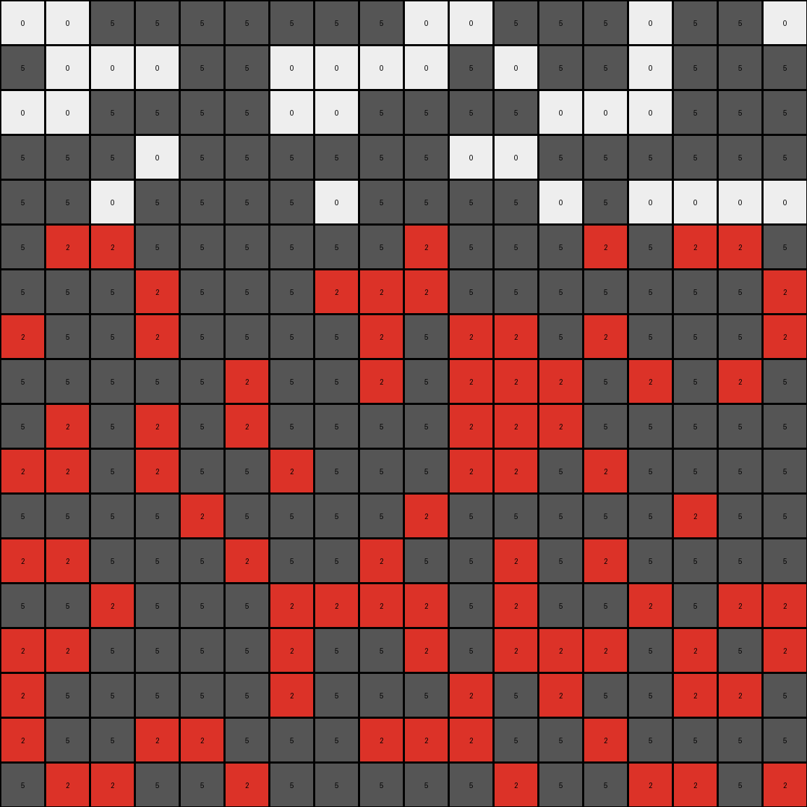

# a8d7556c • 010 • refine_coder

---

Previous Code:
```python
"""
1.  **Identify Regions:** Examine the input grid and identify enclosed regions of white (0) pixels that are completely surrounded by gray (5) pixels. These regions may have irregular shapes.

2.  **Selective Filling:** Starting at row index 5, and moving left to right, and downward by one row, for all regions identified in the prior stage: if there is white (0) pixel, paint it and every pixel to the right of it, until the next grey pixel, with '2'.
    - continue until the last row of the output

3.  **Preserve Boundaries:** The gray (5) pixels in the input grid remain unchanged in the output grid. Their positions define the boundaries for the filling operation.

4.  **Unfilled Regions:** Some white (0) regions may not be modified because it is before row 5, based on the selective filling criteria above.
"""

import numpy as np

def transform(input_grid):
    """Transforms the input grid according to the defined rules."""

    output_grid = np.copy(input_grid)
    rows, cols = output_grid.shape

    # Iterate through rows starting from index 5
    for i in range(5, rows):
        # Iterate through columns
        for j in range(cols):
            # Check if the current pixel is white (0)
            if output_grid[i, j] == 0:
                # Fill with red (2) to the right until a gray (5) pixel is encountered
                for k in range(j, cols):
                    if output_grid[i, k] == 0:
                        output_grid[i, k] = 2
                    elif output_grid[i,k] == 5:
                        break; #stop when a gray pixel is encountered
    return output_grid
```

Train Set Results:

## Example 1:

Input:
```
5 5 5 0 5 0 0 5 5 5 5 5 5 5 0 5 5 5
5 5 0 0 0 5 0 5 0 5 5 0 0 5 0 5 0 5
0 5 5 0 5 5 0 0 5 5 0 5 5 5 5 5 0 5
5 5 0 5 5 5 5 5 5 0 5 5 5 5 5 0 5 5
5 0 5 5 5 5 5 5 5 5 0 5 5 5 0 5 0 5
0 5 5 5 5 0 0 5 0 0 5 0 5 5 5 5 5 0
0 0 5 5 5 0 0 5 0 5 0 0 0 5 5 5 5 5
0 0 5 5 0 0 5 5 5 5 5 5 5 5 5 0 0 5
5 0 5 0 5 0 0 0 5 5 5 5 5 5 5 0 0 5
0 0 5 5 0 0 5 5 5 5 5 5 5 5 5 5 0 5
5 5 0 5 5 5 0 0 5 0 5 0 0 5 5 5 0 5
5 5 5 5 5 5 5 5 5 5 5 5 0 5 5 5 5 5
5 5 5 5 0 0 5 5 5 5 0 5 5 0 0 5 0 0
0 5 0 0 0 5 0 5 5 0 0 5 5 5 0 0 0 5
0 0 5 5 5 5 5 0 5 0 5 0 5 0 5 5 0 0
5 0 5 0 0 0 5 5 5 5 5 5 5 0 0 5 0 5
5 0 5 5 0 0 0 5 5 5 0 0 0 0 0 5 0 0
5 5 0 5 0 0 5 0 0 5 5 0 5 0 5 0 5 5
```
Expected Output:
```
5 5 5 0 5 0 0 5 5 5 5 5 5 5 0 5 5 5
5 5 0 0 0 5 0 5 0 5 5 0 0 5 0 5 0 5
0 5 5 0 5 5 0 0 5 5 0 5 5 5 5 5 0 5
5 5 0 5 5 5 5 5 5 0 5 5 5 5 5 0 5 5
5 0 5 5 5 5 5 5 5 5 0 5 5 5 0 5 0 5
0 5 5 5 5 2 2 5 0 0 5 0 5 5 5 5 5 0
2 2 5 5 5 2 2 5 0 5 0 0 0 5 5 5 5 5
2 2 5 5 0 0 5 5 5 5 5 5 5 5 5 2 2 5
5 0 5 0 5 0 0 0 5 5 5 5 5 5 5 2 2 5
0 0 5 5 0 0 5 5 5 5 5 5 5 5 5 5 0 5
5 5 0 5 5 5 0 0 5 0 5 0 0 5 5 5 0 5
5 5 5 5 5 5 5 5 5 5 5 5 0 5 5 5 5 5
5 5 5 5 0 0 5 5 5 5 0 5 5 0 0 5 0 0
0 5 0 0 0 5 0 5 5 0 0 5 5 5 0 0 0 5
0 0 5 5 5 5 5 0 5 0 5 0 5 0 5 5 0 0
5 0 5 0 2 2 5 5 5 5 5 5 5 2 2 5 0 5
5 0 5 5 2 2 0 5 5 5 0 0 0 2 2 5 0 0
5 5 0 5 2 2 5 0 0 5 5 0 5 0 5 0 5 5
```
Transformed Output:
```
5 5 5 0 5 0 0 5 5 5 5 5 5 5 0 5 5 5
5 5 0 0 0 5 0 5 0 5 5 0 0 5 0 5 0 5
0 5 5 0 5 5 0 0 5 5 0 5 5 5 5 5 0 5
5 5 0 5 5 5 5 5 5 0 5 5 5 5 5 0 5 5
5 0 5 5 5 5 5 5 5 5 0 5 5 5 0 5 0 5
2 5 5 5 5 2 2 5 2 2 5 2 5 5 5 5 5 2
2 2 5 5 5 2 2 5 2 5 2 2 2 5 5 5 5 5
2 2 5 5 2 2 5 5 5 5 5 5 5 5 5 2 2 5
5 2 5 2 5 2 2 2 5 5 5 5 5 5 5 2 2 5
2 2 5 5 2 2 5 5 5 5 5 5 5 5 5 5 2 5
5 5 2 5 5 5 2 2 5 2 5 2 2 5 5 5 2 5
5 5 5 5 5 5 5 5 5 5 5 5 2 5 5 5 5 5
5 5 5 5 2 2 5 5 5 5 2 5 5 2 2 5 2 2
2 5 2 2 2 5 2 5 5 2 2 5 5 5 2 2 2 5
2 2 5 5 5 5 5 2 5 2 5 2 5 2 5 5 2 2
5 2 5 2 2 2 5 5 5 5 5 5 5 2 2 5 2 5
5 2 5 5 2 2 2 5 5 5 2 2 2 2 2 5 2 2
5 5 2 5 2 2 5 2 2 5 5 2 5 2 5 2 5 5
```

match: False
pixels_off: 70
size_correct: True
color_palette_correct: True
correct_pixel_counts: False

## Example 2:

Input:
```
5 5 5 5 0 5 0 5 0 5 5 5 0 0 5 0 5 5
5 5 5 5 0 0 5 5 0 5 0 0 5 0 0 5 5 0
5 5 5 5 5 5 0 5 5 5 5 0 0 0 0 5 5 0
5 0 5 5 5 5 0 0 0 0 5 5 5 5 5 5 0 0
0 0 5 0 5 5 0 0 0 5 5 0 0 0 5 5 5 0
5 0 0 0 5 0 5 5 5 5 0 0 0 5 0 0 0 0
0 5 0 5 5 5 0 0 0 5 5 0 0 5 0 5 5 5
5 0 0 5 5 0 5 5 0 5 0 0 5 0 5 0 5 0
5 5 5 5 0 5 5 5 0 5 5 0 5 0 5 0 5 0
5 0 5 5 5 5 0 5 0 5 0 5 5 5 0 5 5 0
5 0 5 5 5 0 5 0 5 0 0 5 0 0 5 5 5 5
0 0 0 0 5 0 5 0 0 0 5 0 5 5 5 0 0 0
5 0 5 0 0 5 0 5 5 0 0 5 0 0 0 5 5 5
5 5 5 0 5 0 0 5 5 5 0 5 5 5 0 5 5 0
0 0 5 5 5 5 5 0 5 5 5 5 0 0 0 0 0 5
5 0 5 5 5 5 0 0 5 5 0 5 0 5 5 0 5 0
0 0 0 0 0 0 0 0 5 5 5 0 0 0 0 5 0 0
5 5 0 0 5 5 0 5 0 5 5 5 0 5 5 5 5 5
```
Expected Output:
```
5 5 5 5 0 5 0 5 0 5 5 5 0 0 5 0 5 5
5 5 5 5 0 0 5 5 0 5 0 0 5 2 2 5 5 0
5 5 5 5 5 5 0 5 5 5 5 0 0 2 2 5 5 0
5 0 5 5 5 5 2 2 2 0 5 5 5 5 5 5 0 0
0 0 5 0 5 5 2 2 2 5 5 2 2 0 5 5 5 0
5 0 0 0 5 0 5 5 5 5 0 2 2 5 0 0 0 0
0 5 0 5 5 5 0 0 0 5 5 2 2 5 0 5 5 5
5 0 0 5 5 0 5 5 0 5 0 0 5 0 5 0 5 0
5 5 5 5 0 5 5 5 0 5 5 0 5 0 5 0 5 0
5 0 5 5 5 5 0 5 0 5 0 5 5 5 0 5 5 0
5 0 5 5 5 0 5 0 5 0 0 5 0 0 5 5 5 5
0 0 0 0 5 0 5 0 0 0 5 0 5 5 5 0 0 0
5 0 5 0 0 5 0 5 5 0 0 5 0 0 0 5 5 5
5 5 5 0 5 0 0 5 5 5 0 5 5 5 0 5 5 0
0 0 5 5 5 5 5 0 5 5 5 5 0 0 0 0 0 5
5 0 5 5 5 5 2 2 5 5 0 5 0 5 5 0 5 0
0 0 2 2 0 0 2 2 5 5 5 0 0 0 0 5 0 0
5 5 2 2 5 5 0 5 0 5 5 5 0 5 5 5 5 5
```
Transformed Output:
```
5 5 5 5 0 5 0 5 0 5 5 5 0 0 5 0 5 5
5 5 5 5 0 0 5 5 0 5 0 0 5 0 0 5 5 0
5 5 5 5 5 5 0 5 5 5 5 0 0 0 0 5 5 0
5 0 5 5 5 5 0 0 0 0 5 5 5 5 5 5 0 0
0 0 5 0 5 5 0 0 0 5 5 0 0 0 5 5 5 0
5 2 2 2 5 2 5 5 5 5 2 2 2 5 2 2 2 2
2 5 2 5 5 5 2 2 2 5 5 2 2 5 2 5 5 5
5 2 2 5 5 2 5 5 2 5 2 2 5 2 5 2 5 2
5 5 5 5 2 5 5 5 2 5 5 2 5 2 5 2 5 2
5 2 5 5 5 5 2 5 2 5 2 5 5 5 2 5 5 2
5 2 5 5 5 2 5 2 5 2 2 5 2 2 5 5 5 5
2 2 2 2 5 2 5 2 2 2 5 2 5 5 5 2 2 2
5 2 5 2 2 5 2 5 5 2 2 5 2 2 2 5 5 5
5 5 5 2 5 2 2 5 5 5 2 5 5 5 2 5 5 2
2 2 5 5 5 5 5 2 5 5 5 5 2 2 2 2 2 5
5 2 5 5 5 5 2 2 5 5 2 5 2 5 5 2 5 2
2 2 2 2 2 2 2 2 5 5 5 2 2 2 2 5 2 2
5 5 2 2 5 5 2 5 2 5 5 5 2 5 5 5 5 5
```

match: False
pixels_off: 108
size_correct: True
color_palette_correct: True
correct_pixel_counts: False

## Example 3:

Input:
```
0 0 5 5 5 5 5 5 5 0 0 5 5 5 0 5 5 0
5 0 0 0 5 5 0 0 0 0 5 0 5 5 0 5 5 5
0 0 5 5 5 5 0 0 5 5 5 5 0 0 0 5 5 5
5 5 5 0 5 5 5 5 5 5 0 0 5 5 5 5 5 5
5 5 0 5 5 5 5 0 5 5 5 5 0 5 0 0 0 0
5 0 0 5 5 5 5 5 5 0 5 5 5 0 5 0 0 5
5 5 5 0 5 5 5 0 0 0 5 5 5 5 5 5 5 0
0 5 5 0 5 5 5 5 0 5 0 0 5 0 5 5 5 0
5 5 5 5 5 0 5 5 0 5 0 0 0 5 0 5 0 5
5 0 5 0 5 0 5 5 5 5 0 0 0 5 5 5 5 5
0 0 5 0 5 5 0 5 5 5 0 0 5 0 5 5 5 5
5 5 5 5 0 5 5 5 5 0 5 5 5 5 5 0 5 5
0 0 5 5 5 0 5 5 0 5 5 0 5 0 5 5 5 5
5 5 0 5 5 5 0 0 0 0 5 0 5 5 0 5 0 0
0 0 5 5 5 5 0 5 5 0 5 0 0 0 5 0 5 0
0 5 5 5 5 5 0 5 5 5 0 5 0 5 5 0 0 5
0 5 5 0 0 5 5 5 0 0 0 5 5 0 5 5 5 5
5 0 0 5 5 0 5 5 5 5 5 0 5 5 0 0 5 0
```
Expected Output:
```
0 0 5 5 5 5 5 5 5 0 0 5 5 5 0 5 5 0
5 0 0 0 5 5 2 2 0 0 5 0 5 5 0 5 5 5
0 0 5 5 5 5 2 2 5 5 5 5 0 0 0 5 5 5
5 5 5 0 5 5 5 5 5 5 0 0 5 5 5 5 5 5
5 5 0 5 5 5 5 0 5 5 5 5 0 5 0 2 2 0
5 0 0 5 5 5 5 5 5 0 5 5 5 0 5 2 2 5
5 5 5 0 5 5 5 0 0 0 5 5 5 5 5 5 5 0
0 5 5 0 5 5 5 5 0 5 2 2 5 0 5 5 5 0
5 5 5 5 5 0 5 5 0 5 2 2 0 5 0 5 0 5
5 0 5 0 5 0 5 5 5 5 2 2 0 5 5 5 5 5
0 0 5 0 5 5 0 5 5 5 2 2 5 0 5 5 5 5
5 5 5 5 0 5 5 5 5 0 5 5 5 5 5 0 5 5
0 0 5 5 5 0 5 5 0 5 5 0 5 0 5 5 5 5
5 5 0 5 5 5 0 0 0 0 5 0 5 5 0 5 0 0
0 0 5 5 5 5 0 5 5 0 5 0 0 0 5 0 5 0
0 5 5 5 5 5 0 5 5 5 0 5 0 5 5 0 0 5
0 5 5 0 0 5 5 5 0 0 0 5 5 0 5 5 5 5
5 0 0 5 5 0 5 5 5 5 5 0 5 5 0 0 5 0
```
Transformed Output:
```
0 0 5 5 5 5 5 5 5 0 0 5 5 5 0 5 5 0
5 0 0 0 5 5 0 0 0 0 5 0 5 5 0 5 5 5
0 0 5 5 5 5 0 0 5 5 5 5 0 0 0 5 5 5
5 5 5 0 5 5 5 5 5 5 0 0 5 5 5 5 5 5
5 5 0 5 5 5 5 0 5 5 5 5 0 5 0 0 0 0
5 2 2 5 5 5 5 5 5 2 5 5 5 2 5 2 2 5
5 5 5 2 5 5 5 2 2 2 5 5 5 5 5 5 5 2
2 5 5 2 5 5 5 5 2 5 2 2 5 2 5 5 5 2
5 5 5 5 5 2 5 5 2 5 2 2 2 5 2 5 2 5
5 2 5 2 5 2 5 5 5 5 2 2 2 5 5 5 5 5
2 2 5 2 5 5 2 5 5 5 2 2 5 2 5 5 5 5
5 5 5 5 2 5 5 5 5 2 5 5 5 5 5 2 5 5
2 2 5 5 5 2 5 5 2 5 5 2 5 2 5 5 5 5
5 5 2 5 5 5 2 2 2 2 5 2 5 5 2 5 2 2
2 2 5 5 5 5 2 5 5 2 5 2 2 2 5 2 5 2
2 5 5 5 5 5 2 5 5 5 2 5 2 5 5 2 2 5
2 5 5 2 2 5 5 5 2 2 2 5 5 2 5 5 5 5
5 2 2 5 5 2 5 5 5 5 5 2 5 5 2 2 5 2
```

match: False
pixels_off: 81
size_correct: True
color_palette_correct: True
correct_pixel_counts: False
Here's an analysis of the provided information and a strategy for improving the transformation rule:

**General Assessment:**

The initial natural language program and the corresponding Python code have significant errors. The core issue is that the code doesn't correctly implement the "filling" logic. It seems to fill *any* white pixel with red from row 5 onwards, and it doesn't respect the boundaries of the enclosed regions properly. It sometimes fills across gray boundaries. The filling is not limited to self-enclosed white regions, or even regions at all. It appears that the fill operation should start in the *first* available white area.

**Strategy for Resolving Errors:**

1.  **Refine Region Identification:** The current description vaguely mentions "enclosed regions." We need a more precise way to define and identify these. The current implementation simply checks for white pixels without considering connectivity or enclosure.
2.  **Conditional Filling:** We need to refine which region is filled, and which is not.
3.  **Boundary conditions:** We need to ensure the filling does not continue across grey lines in all examples.

**Example Metrics and Analysis:**
I'll reproduce the key parts of each example here for quick reference when writing new code.

*   **Example 1:**
    *   Input Shape: (18, 18)
    *   Output Shape: (18, 18)
    *   Pixels changed from input to output: many.
    *   Pixels changed from expected to transformed: 70
    *   Observations: Begins modifying at row 5, fill often crosses boundaries.

*   **Example 2:**
    *   Input Shape: (18, 18)
    *   Output Shape: (18, 18)
    *   Pixels changed from input to output: many.
    *   Pixels changed from expected to transformed: 108
    *   Observations: Begins modifying at row 4 in output, fill often crosses boundaries.

*   **Example 3:**
    *   Input Shape: (18, 18)
    *   Output Shape: (18, 18)
    *   Pixels changed from input to output: many.
    *   Pixels changed from expected to transformed: 81
    *   Observations: Begins modifying at row 5 in output, fill often crosses boundaries.

**YAML Block (Facts):**

```yaml
objects:
  - name: grid
    type: 2D array
    elements: pixels
    properties:
      rows: variable
      cols: variable

  - name: pixel
    type: cell
    properties:
      color: [0, 1, 2, 3, 4, 5, 6, 7, 8, 9] # Represents colors
      position: [row_index, col_index]

  - name: region
    type: connected_pixels
    properties:
      color: single_value
      boundary: [list_of_pixels]

  - name: modified_region
    type: connected_pixels
    properties:
       base_color: 0
       fill_color: 2
       start_row: variable
       end_row: variable

actions:
  - name: identify_regions
    input: grid
    output: list_of_regions

  - name: find_first_white_region
    input: grid, list_of_regions
    output: region

  - name: fill_region
    input: grid, region
    parameters:
      start_row: integer
      fill_color: integer
    output: modified_grid

```

**Natural Language Program:**

1.  **Identify Regions:** The input grid consists of pixels with values from 0 to 9, representing different colors. Find all regions, where a region is defined as a contiguous block of pixels of the same color, that are bounded by either the edge of the grid, or a grey (value 5) pixel.

2.  **Find First White Region.** Among the white (value 0) regions, find the region whose top-most row is the lowest. If there are multiple such regions, the region that starts at the lowest column takes priority.
    
3.  **Fill Region:** Starting with the top-most row of this region, change the color of all pixels in the region to red (value 2) until a grey pixel or the grid boundary is reached.

4.  **Iterate:** Repeat this process for all rows of the specified white region, changing the color of all white pixels to red that are within that region, until a grey pixel, or the edge of the grid is reached.
    
5.  **No Modification of Other Pixels:** The gray (5) pixels and all other regions are not to be modified. The final output grid has the same dimensions as the input.


**INSTRUCTIONS**

- generate a Python module to represent the natural language program 
- follow the template below
- all common math and science libraries are available
- create docstring only at top - but comment the workflow in the function
- use helper functions for common operations like finding objects, counting,
  measuring, moving, etc. 

remember - we are working iteratively - so this code will inform your future
self as we converge on the solution

*template:*

```python
"""
{{ natural language description of the transformation rule }}
"""

{{ imports }}

def transform(input_grid):
    # initialize output_grid

    # change output pixels 

    return output_grid

```
